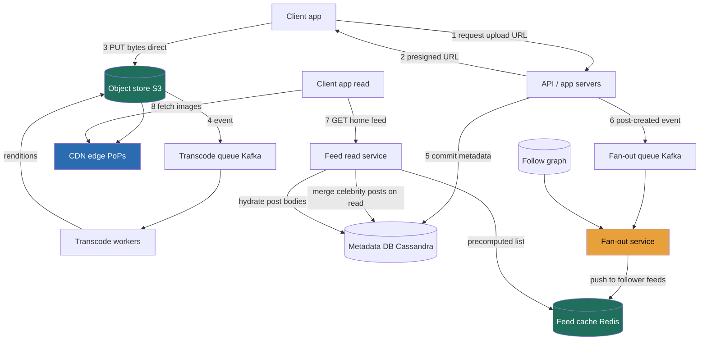

> Instagram is the canonical "social media + media storage" problem, and it is really **three systems in a trench coat**: a write-heavy **upload pipeline** that puts bytes into an object store and onto a CDN, a **social graph** of who-follows-whom, and a brutally read-heavy **home-feed builder** that has to assemble a personalized timeline in tens of milliseconds. The one decision the whole interview turns on is **how you build that feed** — do you do the work at *write* time (precompute every follower's feed when someone posts) or at *read* time (gather-and-merge when someone opens the app)? Each is correct for a different part of the user base, and the senior answer is a **hybrid** that routes by follower count. We will drive the entire design through **RESHADED** — Requirements, Estimation, Storage, High-level design, API, Data model, Evaluation, Design evolution — and the Director-altitude move is to keep saying, at each step, *which requirement forces this choice and what it costs me.*

### Learning objectives
- Run a full **RESHADED** pass on a photo-sharing feed, deriving every structural decision from a stated requirement and its rejected alternative.
- Quantify the system from first principles — **~100M photos/day**, a **~100:1 read:write skew**, **~55 PB/year** of media versus **~36 TB/year** of metadata — and use those numbers to *force* the architecture, not decorate it.
- Make the pivotal **feed-build** decision — **fan-out-on-write vs fan-out-on-read**, and the **celebrity hybrid** — and state the write-amplification cost (one celebrity post = **~100M feed inserts**) that kills the naive choice.
- Split the **upload path** correctly: object store + CDN for bytes (Lesson 3.11, 3.5), a partitioned metadata DB for the small structured rows, and an **async transcode** pipeline off the user's request path.
- Handle **likes/comments at hot-key scale** with **sharded counters** (Lesson 3.16), and know where to **delegate a deep-dive** — the ranking model, the transcode farm, the graph store — like a Director, not solve it like an IC.

### Intuition first
Forget the database for a second and think about a **newspaper that prints a unique front page for every single reader.** When a journalist (a user you follow) files a story (posts a photo), the paper has a choice. It can **typeset that story into the personal edition of every subscriber who follows that journalist the instant it's filed** — so when you wake up and open your paper, your personalized front page is *already assembled* and you just read it (this is **fan-out-on-write**: do the work when content is *created*, pay at write time, reads are instant). Or it can **wait until you actually open your paper, then run around to every journalist you follow, grab their latest stories, and lay out your front page on the spot** (this is **fan-out-on-read**: do the work when content is *requested*, reads are expensive, writes are trivial).

For an ordinary journalist with 200 subscribers, pre-typesetting into 200 editions is cheap and makes everyone's morning read instant — fan-out-on-write wins. But now a **celebrity with 100 million followers** files one story, and the "typeset it into everyone's edition" plan means **100 million edits for a single post** — the printing press melts. For that one journalist you must flip strategies: **don't** pre-typeset; leave the story on a shelf, and when any of their 100M followers opens their paper, fetch that one celebrity story fresh and merge it in. That's the whole crux: **fan-out-on-write for the long tail, fan-out-on-read for the celebrities, blended per-reader** — a hybrid that nobody designs on the first try and everybody arrives at once they do the arithmetic. Hold that newspaper image; every decision below is a consequence of it, plus the fact that the *photos themselves* are huge and the *records about them* are tiny, so they live in two completely different stores.

---

## R — Requirements

RESHADED starts by scoping *before* building. The signal here is not listing features — it's **cutting** to a defensible core and naming the read:write reality that will dictate everything downstream.

**Functional (the core we will actually build):**
1. **Upload a photo** (with caption, optional location/tags) — and have it transcoded into display renditions.
2. **Follow / unfollow** another user (the social graph).
3. **Home feed** — view a personalized, reverse-chronological-ish timeline of photos from accounts you follow.
4. **Like and comment** on a photo, and see the counts.

**Explicitly cut (state these out loud, so the interviewer knows it's a choice, not an omission):** Stories/Reels (a near-identical media pipeline with a TTL — I'd reuse the upload path), Direct Messages (that's the WhatsApp problem, Lesson 5.6), Explore/search (Lesson 5.7's typeahead + a separate discovery-ranking system), ads insertion, and **ML feed *ranking***. I will build the feed as a **rankable list of candidate posts** and treat the ranking model itself as a **delegated deep-dive** — "I'd have the feed-ranking team own the model; my design's job is to deliver the candidate set and the signals (recency, affinity, engagement) it scores." That delegation *is* the Director move, not a gap.

**Clarifying questions I would actually ask** (and the assumptions I'll proceed on if the interviewer waves me on):
- *Scale?* Assume FAANG-Instagram: **~2B registered users, ~500M daily actives.**
- *Feed ordering — strict chronological or ranked?* Assume **ranked-ish but recency-dominated**; this matters because pure chronological makes fan-out-on-write trivial (append) while ranking forces a re-score on read.
- *How fresh must the feed be?* Assume **seconds-to-low-minutes** is fine — a new post need not appear in followers' feeds in real time. This single answer is what *permits* asynchronous fan-out; if the answer were "instant," I'd be forced toward read-time assembly.
- *Consistency of likes/counts?* Assume **eventually consistent display counts are acceptable** (a like count that lags a second is fine) — which is exactly what licenses sharded counters in the D-step.

**Non-functional requirements (these are what I'll grade my own design against in Evaluation):**
- **Read-heavy, hard.** Feed/photo reads dominate uploads by **~100:1** (derived next). The system is a read-serving machine with a write pipeline bolted on.
- **Feed latency:** home-feed open should target **p99 ≲ 200 ms** server-side. This is the number the feed-build strategy lives or dies by.
- **Availability over strict consistency** for reads. A feed that's a few seconds stale, or briefly missing the newest post, is fine; an *unavailable* feed is not. This is an **AP** lean (Lesson 2.7) for the feed path — though the *graph* and *upload-commit* want stronger consistency, so the system is not uniformly AP.
- **Durability of media is non-negotiable** — losing a user's photos is unforgivable; target **11 nines** on the object store (Lesson 3.11's bar).
- **Cost-aware:** at ~55 PB/year of new media and petabytes/day of egress, storage tiering and CDN hit-ratio are budget lines a Director owns, not afterthoughts.

> The requirement that secretly decides the architecture is **"feed may be seconds stale."** It is what makes asynchronous fan-out legal. I'll flag it explicitly because juniors skip past it and then can't justify why precompute is allowed.

---

## E — Estimation

RESHADED's E step is "enough math to make a defensible call," rounded aggressively, assumptions stated. The goal is to *force* the design, so I compute the four numbers that change decisions: **write QPS, read QPS (and the skew), media storage, and egress** — plus the cache working set and a server count.

**Assumptions:** 500M DAU; each active user uploads on average **~0.2 photos/day** (most days, most people post nothing) → **~100M photos/day**; each active user does **~20 feed/photo reads/day** (opens the app several times, scrolls some).

**Write QPS (uploads):**
- 100M photos/day ÷ 86,400 s ≈ **~1,200 writes/s average**, peak ~2× ≈ **~2,500 writes/s**. This is *tiny* — uploads are not the scaling problem. (The scaling problem is what each upload *triggers* downstream.)

**Read QPS (feed/photo views):**
- 500M DAU × 20 reads = **10B reads/day** ÷ 86,400 ≈ **~115k reads/s average**, peak ~2.5× ≈ **~290k reads/s**.
- **Read:write ≈ 10B : 100M = ~100:1.** This is the headline number: the system is overwhelmingly a **read** system. It justifies aggressive caching, read replicas, a CDN, and precomputing feeds.

**Media storage (the big one):**
- Per photo, after transcode, store the original plus a set of display renditions (thumbnail, feed-size, full). Effective **~1.5 MB per photo** across the rendition set.
- 100M/day × 1.5 MB = **~150 TB/day** of *usable* media → **~55 PB/year** usable, and it **only grows** (photos are kept forever).
- Durability overhead: at **3× replication** that's ~165 PB/year raw; with **erasure coding (~1.4× overhead)** ~**77 PB/year raw**. The erasure-coding choice (Lesson 3.11) saves ~**90 PB/year of raw disk** — a line item worth real money, justified in the S step.

**Metadata storage (the deliberate contrast):**
- A photo's *record* — id, owner, caption, location, timestamps, pointers — is **~1 KB**. 100M/day × 1 KB = **~100 GB/day** → **~36 TB/year**.
- **Media is ~1,500× the size of metadata** (55 PB vs 36 TB). That ratio is the entire justification for splitting bytes (object store) from records (a database) — they don't just want different stores, they're not even the same order of magnitude of problem.

**Egress bandwidth (where the CDN earns its keep):**
- Reads serve a feed-sized rendition, **~200 KB** average. 10B reads/day × 200 KB = **~2 PB/day** of image egress.
- At a **95% CDN hit ratio** (Lesson 3.5), the **origin/object store sees only ~5% = ~100 TB/day**. The CDN absorbs **~1.9 PB/day**. Serving that 2 PB/day from origin is both latency-fatal and budget-fatal; the CDN is not optional, it's load-bearing.

**Feed cache working set:**
- A precomputed feed = a list of ~**500 post IDs + scores ≈ 100 bytes** each per user. All 500M DAU = 500M × 50 KB ≈ **~25 TB** — too large to pin entirely in RAM. So I cache feeds for the **~50M users active in a short window (~2.5 TB)** and rebuild cold users' feeds on demand. That's a **Redis-cluster-sized** working set, not a "buy infinite RAM" fantasy.

**Server count (feed-read tier):**
- Peak ~290k reads/s ÷ ~5,000 rps/server ≈ **~60 servers**; round to **~100 with headroom + AZ redundancy**. The point isn't the exact count — it's that the read tier is *stateless and horizontally scaled* behind the cache, which the 100:1 skew demands.

> The two numbers I carry forward into every later decision: **100:1 read:write** (→ precompute + cache + CDN) and **media ≫ metadata by ~1,500×** (→ two stores). Everything else is downstream of those.

---

## S — Storage

The S step matches each kind of data to a store *type* and names real systems — and, per the two-store insight above, this problem has **four distinct data shapes**, each with a different access pattern. Naming them separately (and rejecting the temptation to jam them into one database) is the signal.

| Data | Shape & access pattern | Store **type** | Real system | Rejected alternative (and why) |
|---|---|---|---|---|
| **Photo bytes** (originals + renditions) | Huge, immutable, write-once read-many, whole-object | **Object/blob store + CDN** | **S3 / GCS** behind **CloudFront / Cloudflare** | A database BLOB column — wrong tool: melts the DB cache, can't reach 11 nines cheaply, can't sit on a CDN. (Lesson 3.11.) |
| **Photo & user metadata** | Small (~1 KB) structured rows, keyed lookups by id/owner, very high read rate | **Wide-column / partitioned KV** | **Cassandra** (or DynamoDB) | A single Postgres instance — fine at 36 TB *total*, but it can't absorb ~290k QPS or partition cleanly across regions without sharding work I'd rather the store do. |
| **The follow graph** (edges) | Many-to-many edges, two hot queries: "who do I follow?" and "who follows me?" | **Partitioned KV / adjacency lists** (or a graph DB) | **Cassandra** edge tables; a dedicated graph store (TAO-style) at extreme scale | A relational join table at billions of edges — the "followers of X" query for a celebrity becomes a multi-million-row scan; **denormalize both directions** instead. |
| **Home feeds** (precomputed timelines) | Per-user list of post IDs, transient, latency-critical | **In-memory store** | **Redis** (lists/sorted sets) | Reading the feed from the metadata DB on every open — that's fan-out-on-read with no cache, which the 100:1 skew can't afford. |

The headline storage decision and its trade: **bytes go in an object store fronted by a CDN; records go in a partitioned wide-column DB; feeds live in Redis.** I'm rejecting the "one Postgres for everything" answer not because Postgres is bad — at 36 TB of metadata it would *hold* the data — but because (a) it can't host 55 PB of bytes economically or durably, and (b) a single primary can't serve ~290k QPS. The store choice is forced by the **two numbers** from Estimation, exactly as it should be.

On the object store itself, the sub-decision is **durability via erasure coding vs 3× replication** (Lesson 3.11): erasure coding reaches the same ~11 nines at **~1.4× overhead instead of 3×**, saving ~90 PB/year of raw disk at our volume — I take erasure coding for the cold/warm bulk, accepting its higher reconstruction cost on the rare read of a degraded object. *Rejected:* 3× replication everywhere — operationally simpler and faster to reconstruct, but at 55 PB/year the 200% overhead is a budget I won't sign.

---

## H — High-level design

The H step is "think in components": a box diagram plus the happy path in prose. Two flows matter — the **write/upload path** and the **read/feed path** — and the key architectural statement is that **fan-out happens asynchronously, off the user's upload request.**



**Happy-path: upload (write).** The client asks the API for a **presigned upload URL** and uploads the bytes **directly to the object store** (the app servers never touch the photo — they'd be a bandwidth bottleneck at 150 TB/day). The object-store write fires an event onto a **Kafka transcode queue**; **transcode workers** generate the rendition set (thumbnail/feed/full) and write them back to the object store, where the CDN can pull them. **Crucially, transcode is asynchronous** — the user's "post" returns the moment metadata is committed; renditions appear a moment later. In parallel, the API **commits the photo's metadata row** to Cassandra and emits a **`post-created` event** to a second Kafka topic. The **fan-out service** consumes it, looks up the author's followers in the **graph store**, and **pushes the new post's ID into each follower's feed list in Redis** — for non-celebrity authors (the hybrid split is the A/D-step detail).

**Happy-path: home feed (read).** The client calls the **feed read service**, which (a) reads the user's **precomputed feed list from Redis** (the fan-out-on-write portion), (b) **fetches the latest posts from the handful of celebrities/high-follower accounts the user follows on-the-fly** and merges them in (the fan-out-on-read portion), (c) **re-scores/ranks** the merged candidate set, and (d) **hydrates** the top ~N post IDs into full post objects (caption, author, counts) from Cassandra. The response is a list of posts with **CDN URLs** for the images; the client fetches the actual bytes from the **CDN edge**, not from us. This split — list assembly server-side, byte delivery via CDN — is what makes a p99 ≲ 200 ms feed open feasible against a 100:1 read load.

---

## A — API design

The A step defines the interface. Keep it small and RESTful; the only non-obvious choices are the **presigned-URL upload** (offload bytes from app servers) and a **cursor-paginated feed** (offsets break on an ever-growing, re-ranked list).

```
# --- Upload (two-phase: get URL, then commit) ---
POST /v1/uploads:request
  body: { content_type, size_bytes }
  -> { upload_id, presigned_url, expires_at }      # client PUTs bytes straight to object store

POST /v1/posts
  body: { upload_id, caption, location?, tagged_user_ids[] }
  -> { post_id, status: "processing" }             # returns BEFORE transcode finishes

GET  /v1/posts/{post_id}
  -> { post_id, author, caption, renditions:{thumb,feed,full URLs}, like_count, comment_count, created_at }

# --- Social graph ---
POST   /v1/users/{user_id}/follow      -> 202   # async-safe; idempotent
DELETE /v1/users/{user_id}/follow      -> 202

# --- Home feed (cursor-paginated, NOT offset) ---
GET /v1/feed?cursor={opaque}&limit=20
  -> { posts:[ {post_id, author, renditions, counts, ...} ], next_cursor }

# --- Likes & comments (counts are read from sharded counters) ---
POST   /v1/posts/{post_id}/likes       -> 202   # idempotent per (user, post): re-like is a no-op
DELETE /v1/posts/{post_id}/likes       -> 202
POST   /v1/posts/{post_id}/comments    body:{ text }   -> { comment_id, created_at }
GET    /v1/posts/{post_id}/comments?cursor=&limit=     -> { comments[], next_cursor }
```

Two decisions worth defending. **Cursor pagination, not `offset/limit`:** the feed is an ever-growing, re-ranked list; an offset of 100 means something different every time the list changes, causing dupes and skips. An **opaque cursor** (encoding the last-seen score/position) is stable. *Rejected:* offset pagination — simpler, but broken on a live feed. **`POST /likes` returns 202 (accepted), not the new count:** the like is processed asynchronously into a sharded counter, and the display count is eventually consistent (a requirement we secured in R). *Rejected:* returning the authoritative new count synchronously — it would force a read of a hot, sharded counter on the write path, the exact anti-pattern Lesson 3.16 warns about.

---

## D — Data model

The D step is "know where data lives": schema, keys, and — the part that matters at scale — the **partition/shard key**, because the partition key is what determines whether your hottest query hits one node or fans across the cluster.

**`photos` (Cassandra) — the metadata row.** Partition key `photo_id` for point reads; a second query-shaped table for a user's own grid.
```
photos:        PK = photo_id
               (author_id, caption, location, rendition_keys, created_at, status)
posts_by_user: PK = author_id, clustering key = created_at DESC   # "show me a user's profile grid"
```
The `rendition_keys` are just object-store paths (e.g. `s3://media/ab/cd/<photo_id>/feed.jpg`); the bytes are *not* in the DB. The two-table pattern (denormalize by query) is the Cassandra idiom from Lesson 2.3 — you model a table per access path rather than relying on secondary indexes.

**Follow graph — both directions, denormalized.** The two hot queries pull in opposite directions, so store **two adjacency lists**:
```
following:  PK = user_id  ->  set/rows of followee_ids     # "who do I follow?" (read on feed build)
followers:  PK = user_id  ->  set/rows of follower_ids     # "who follows me?" (read on fan-out)
```
Partitioning by `user_id` makes "who do I follow" a single-partition read. But **`followers` for a celebrity is a multi-million-row partition** — a known **hot/large-partition** problem we fix in Evaluation (it's *why* fan-out-on-write can't serve celebrities).

**Home feed (Redis).** A per-user sorted set keyed by user, scored by rank/recency:
```
feed:{user_id}  ->  ZSET of (post_id -> score), capped to ~500 entries (trim on insert)
```
Partition/shard key = `user_id` (the Redis-cluster hash slot). Capping at ~500 keeps the working set at the ~2.5 TB we budgeted and bounds memory per user.

**Likes/comments — sharded counters (Lesson 3.16).** The count is not a column you `UPDATE`; it's **N sub-counters summed on read**, because a celebrity post is a hot write key:
```
like_count:{post_id}:{shard}   shard in 0..N-1     # increment a random shard
comments:   PK = post_id, clustering key = created_at DESC   # the comment bodies, append-only
```
The **partition key choices are the load-bearing detail**: `photo_id`/`user_id`/`post_id` spread point reads evenly across the cluster, while the *celebrity follower partition* and the *celebrity counter key* are the two hot spots the next step exists to fix.

---

## E — Evaluation

The second E is where you **stress your own design**: re-check it against the NFRs and hunt the bottlenecks — hot keys, single points, tail latency, write amplification — and **fix each, naming the trade the fix makes.** This is the highest-signal section for a Director; an architecture with no self-identified failure modes reads as untested.

**Bottleneck 1 — Fan-out write amplification (the headline failure).** Fan-out-on-write means every post is copied into every follower's feed. Average author has ~200 followers, so ~1,200 uploads/s × 200 = **~230k feed-insert writes/s** baseline — absorbable. But a **celebrity post (100M followers) = ~100M feed inserts for a single post.** At even 1M inserts/s that's **~100 seconds of fan-out work per celebrity post**, it floods Redis and the fan-out workers, and it's almost entirely **wasted** (most followers won't open the app before the post is stale).
> **Fix — the hybrid (push for the tail, pull for the head).** Set a threshold (e.g. **>1M followers = "celebrity"**). For normal authors, **fan-out-on-write** (push to follower feeds) as designed. For celebrities, **do NOT fan out** — leave their posts in their own `posts_by_user` table, and at **feed read time, pull each followed-celebrity's recent posts and merge** them into the precomputed feed. **Trade:** the feed read is now slightly more expensive (a handful of extra reads + a merge + re-rank per open) in exchange for **eliminating the 100M-insert write storm**. Since the system is 100:1 read-heavy you'd normally hate adding read cost — but a user follows only a *few* celebrities, so it's a few extra reads, not hundreds; the trade is overwhelmingly worth it. *This hybrid is the single most important answer in the whole problem.*

**Bottleneck 2 — Hot/large partition: a celebrity's `followers` list.** Fanning out to a celebrity (for the sub-celebrity accounts that *do* fan out) means reading a multi-million-row partition, and any single partition is one node's problem.
> **Fix:** the hybrid above already spares true celebrities from fan-out entirely (their followers are never enumerated for push). For high-but-sub-threshold accounts, **fan out asynchronously and in parallel batches** off Kafka so a big follower list is drained by many workers over seconds, not one worker synchronously. **Trade:** more fan-out latency (a post takes seconds to fully propagate) for bounded per-worker load — acceptable because R bought us "feed may be seconds stale."

**Bottleneck 3 — Hot counter key (celebrity likes).** A viral post can take likes faster than a single Redis key or DB row can serialize (`count = count + 1` is one lock/partition; Lesson 3.16). Even a modest spike of ~17k likes/s on one post stresses a single row.
> **Fix — sharded counters.** Split each post's like count into **N sub-counters**, increment a random one, **sum on read** (or sum periodically into a cached total). On Redis (~100k ops/s/key) a viral post needs only **a handful of shards**; on a Postgres row (~1k/s) you'd need ~17 — which is itself the argument for keeping counts in Redis. **Trade:** the count is now **exact-but-eventually-consistent** and a read costs N sub-reads (hidden behind a rollup). We pre-bought this staleness in R. *Rejected:* one atomic counter — simplest and strongly consistent, but a hard throughput wall on a viral post.

**Bottleneck 4 — Feed read tail latency (hydration fan-out).** A feed open reads ~500 IDs from Redis, then **hydrates** each into a full post (author, caption, counts) — that's a fan-out of ~20 (one screen) reads to Cassandra per open, at ~290k opens/s. The slowest hydration read sets the p99 (tail-latency amplification).
> **Fix:** cache **hydrated post objects** in Redis (a hot post is hydrated once and served to millions), batch the hydration reads (multi-get), and only hydrate the ~20 posts in the first page, not all 500. **Trade:** more cache memory and a cache-invalidation concern (a post edited or deleted must evict) for a bounded, mostly cache-served hydration. This is the cache-aside pattern (Lesson 3.7) applied to feed hydration.

**Bottleneck 5 — Single points / availability.** The object store and CDN are managed/multi-AZ by design. The risks are the **fan-out service** and **Redis**. Fan-out is **stateless and replayable from Kafka** — if it falls behind, posts propagate late (degraded, not broken). Redis feed loss is **recoverable**: a cold/evicted feed is **rebuilt on read** by pulling from `posts_by_user` of followed accounts — i.e. the system **degrades from fan-out-on-write to fan-out-on-read** under cache loss rather than failing. **Trade:** a rebuilt feed read is slower (a burst of DB reads) for the guarantee that **losing the feed cache never loses data or availability** — Redis is an accelerator, never the source of truth.

**Re-check vs NFRs:** read p99 ≲ 200 ms — met by precomputed feeds + Redis hydration cache + CDN byte delivery. 100:1 read skew — met by CDN (95% offload) + cache + read replicas. Media durability 11 nines — met by the object store + erasure coding. Availability/AP feed — met by Kafka-replayable fan-out and read-time feed rebuild. Cost — CDN turns 2 PB/day into ~100 TB/day origin; erasure coding saves ~90 PB/yr raw.

---

## D — Design evolution

The final D justifies the trade-offs and pushes past v1: **how it scales at 10×, the hardest trade-offs, what I'd revisit, and where I'd delegate** — the Director's "think past v1."

**At 10× (1.5 PB/day media, ~3M reads/s):**
- **Media & CDN scale linearly and cheaply** — object stores and CDNs are built for this; the lever is **raising the CDN hit ratio** (tiered caches, origin shielding — Lesson 3.5) and **lifecycle-tiering** cold media to glacier-class storage (most photos are viewed heavily for days, then almost never — Lesson 3.11's hot/cold/archive). At 1.5 PB/day the tiering decision is a multi-million-dollar/year budget line.
- **The feed/fan-out tier is the part that strains.** The hybrid threshold becomes a **continuous knob**, not a binary: I'd want fan-out cost modeled per-author (follower count × follower activity) and the push/pull boundary tuned dynamically — and I'd **delegate that modeling to the feed team** with a stated prior ("push below ~X active followers, pull above; revisit X from the fan-out cost dashboard"). Multi-region adds **geo-locality**: build a user's feed in their home region, replicate the graph and metadata cross-region (accepting replication lag — Lesson 2.4), and pin feed Redis regionally.

**The hardest trade-offs (the ones I'd flag as genuinely contested):**
1. **Where to draw the celebrity threshold.** Too low → too much read-time merging (read cost creeps up on the 100:1 path); too high → fan-out storms leak back in. It's an empirical, monitored boundary, not a constant.
2. **Ranked vs chronological feed.** Ranking improves engagement but forces a **re-score on every read** (you can't fully precompute a ranked feed because scores decay and new signals arrive), pushing work back toward read-time. Pure chronological makes fan-out-on-write a trivial append. This is a **product-vs-infra tension** I'd surface to the room, not silently resolve.
3. **Erasure coding vs replication for *hot* media.** Erasure coding saves disk but makes a **degraded read slower** (reconstruct from parity). For the freshest, hottest photos I might keep replication and only erasure-code the warm/cold tier — a per-tier decision, not global.

**What I'd revisit first:** the **hydration cache invalidation** (edits/deletes/blocks must promptly evict, and "delete must actually remove a photo everywhere" is a privacy/legal obligation, not best-effort), and **counter reconciliation** for the number that might feed creator payouts/analytics — which, per Lesson 3.16, should be **recomputed exactly from the event log**, separate from the fast display counter.

**Where I'd delegate a deep-dive (explicit Director signal):**
- **Feed ranking model** → the ML/feed-ranking team. My architecture delivers the candidate set + signals; the model is theirs.
- **Transcode farm** → the media team — codecs, rendition matrix, GPU vs CPU encoding economics. My prior: async, queue-driven, idempotent per `photo_id`.
- **Graph store at extreme scale** → the infra team — "I'd have them benchmark a TAO-style graph cache vs Cassandra adjacency lists for the celebrity-follower read; my prior is the denormalized adjacency lists are fine until the followers-of-X read dominates, then a dedicated graph cache earns its keep."

Naming *what* I'd delegate, *to whom*, and *with what prior* is the altitude this round is scoring — I go deep where the decision turns (the feed-build hybrid) and hand off the rest credibly.

---

## Trade-offs table — the pivotal decisions

| Decision | Option A | Option B | Option C (chosen, usually) | Use A when… / Use B when… / Use C when… |
|---|---|---|---|---|
| **Feed build** | **Fan-out-on-write** (push to all follower feeds at post time) | **Fan-out-on-read** (gather + merge at read time) | **Hybrid** — push for normal authors, pull for celebrities | A: small/even follower counts, read-heavy, feed must open instantly. B: very write-heavy or tiny read base, or feeds rarely read. **C: real social scale with a few huge accounts + a long tail — the default.** |
| **Media durability** | **3× replication** (200% overhead, fast reconstruct) | — | **Erasure coding** (~40% overhead, slower reconstruct) | A: hot tier where degraded-read latency matters. **C: warm/cold bulk at PB scale where the 200% overhead is the budget killer.** |
| **Like/comment counts** | **Single atomic counter** (strong, simple) | **Sharded counter** (write÷N, eventually consistent) | **Sharded display counter + exact event-log reconciliation** | A: low write rate. B: viral hot keys, display-only. **C: viral counts where a separate exact number feeds analytics/payouts.** |

(Two more decisions argued inline above, each with its rejected alternative: **presigned-URL direct upload** vs app-servers-proxy-bytes, and **cursor pagination** vs offset.)

---

## What interviewers probe here

At Director altitude they are not checking whether you can name Redis. They're checking whether you can pick the feed strategy, **price** it, and know what to delegate.

- **"How do you build the home feed?"** — *Strong signal:* immediately frames **fan-out-on-write vs on-read**, does the write-amplification arithmetic (celebrity = ~100M inserts/post), and lands on the **hybrid with a follower threshold**, naming the read-cost trade it accepts. *Red flag:* "I'd query the posts of everyone they follow and sort" with no awareness that this is fan-out-on-read and what it costs at 290k reads/s — or precompute-everything with no celebrity carve-out.
- **"Why two different stores for photos vs their metadata?"** — *Strong:* the ~1,500× size ratio (55 PB vs 36 TB), object store + CDN for immutable bytes, partitioned DB for small structured rows, and *why* a DB BLOB column is the wrong tool. *Red flag:* "store the image in a Postgres column."
- **"A celebrity's post is getting liked a million times a minute — what breaks?"** — *Strong:* names the **hot-key write-contention** wall, shards the counter (N from the per-key ceiling), and separates the **eventually-consistent display count** from an **exact event-log-reconciled** number (Lesson 3.16). *Red flag:* "add read replicas" (replicas don't relieve a hot *write* key).
- **"What's your CDN actually buying you, in numbers?"** *(cost signal)* — *Strong:* a 95% hit ratio turns ~2 PB/day egress into ~100 TB/day at origin — latency *and* a budget line read two ways (Lesson 3.5). *Red flag:* "it makes images faster" with no offload/cost framing.
- **"What would you not build yourself / hand to another team?"** *(delegation signal)* — *Strong:* the ranking model, the transcode codec matrix, the extreme-scale graph store — each handed off **with a stated prior**. *Red flag:* trying to design the ML ranking model live (too deep, wrong altitude) — or hand-waving "the team handles it" with no prior.

---

## Common mistakes

- **Designing only fan-out-on-write (or only on-read).** Either alone breaks at real social scale; the hybrid is the answer, and the celebrity threshold is the crux number. Skipping the celebrity case is the single most common failure.
- **Storing photo bytes in the database.** Blows the DB cache, can't reach 11 nines economically, can't sit on a CDN. Bytes → object store; records → DB.
- **Putting the app servers in the byte path.** Proxying 150 TB/day of uploads through app servers is a self-inflicted bottleneck — use **presigned URLs** so clients write straight to the object store.
- **Synchronous transcode / synchronous fan-out.** Both belong **off the request path** on a queue. A user's "post" must return in tens of ms, not wait on transcode or 100M feed inserts.
- **One atomic counter for viral likes.** A hot write key is a throughput wall; shard it (Lesson 3.16) and accept eventual consistency for the display count.
- **Treating the feed cache as the source of truth.** Redis is an accelerator; a lost feed must be **rebuildable** from the metadata DB, or a cache failure becomes data loss.
- **Offset pagination on a live, re-ranked feed.** Causes dupes/skips; use an opaque cursor.
- **No quantification.** "It scales horizontally" with no QPS, storage, or egress math reads as not-technical-enough-to-lead.

---

## Interviewer follow-up questions (with model answers)

**Q1. A user posts, then immediately opens their own feed and doesn't see the post. What happened and how do you fix it?**
> *Model:* Classic **read-your-writes** miss (Lesson 2.4). Fan-out is asynchronous, so the post may not have landed in the user's *own* feed list yet, and ranked feeds further reorder things. Fix: on the author's own feed read, **merge their just-posted item in client-side or server-side from `posts_by_user`** for a short window regardless of fan-out state (their own recent posts are a cheap, bounded read), and/or write the author's own feed entry **synchronously** on post while the follower fan-out stays async. Trade: a touch more work on the post path for the author's own entry, to guarantee they always see their own post immediately — everyone else tolerates seconds of lag.

**Q2. How do you keep the feed reasonably fresh without making writes (or reads) explode?**
> *Model:* Freshness is bounded by **fan-out lag** for pushed posts (seconds, by design — R permitted it) and is **real-time for pulled celebrity posts** (fetched fresh on read). I won't push everything in real time (write storm) nor pull everything on read (read storm at 100:1) — the **hybrid** gives near-real-time for the few high-reach accounts that matter and seconds-fresh for the long tail. If product demands stricter freshness, I'd **lower the pull threshold** (more accounts pulled fresh) and pay the read cost, monitoring the read-tier p99. The dial is the threshold, and I'd tie it to a freshness SLO, not pick it arbitrarily.

**Q3. The feed-ranking team wants a new engagement signal recomputed per-read. Does your design allow it, and what's the cost?**
> *Model:* Yes — that's exactly *why* the feed is assembled as a **candidate set re-scored at read time**, not a frozen list. The cost is read-side compute: re-scoring ~500 candidates per open at ~290k opens/s. I'd keep the **candidate retrieval** cheap (precomputed list + celebrity merge) and bound the **scoring** to the top page, push expensive features into a precomputed per-user/per-post feature store the ranker reads, and **delegate the model + feature pipeline to the ranking team** with the contract "retrieval is mine, scoring is yours, here's the latency budget." That separation is deliberate — it lets ranking iterate without touching the storage/fan-out architecture.

**Q4. Walk me through deleting a photo — everywhere.**
> *Model:* Delete is a multi-store, partly-async operation and a **legal/privacy obligation**, not best-effort. (1) Mark the metadata row `deleted` (immediately hides it from new reads/hydration). (2) **Evict** the hydrated post object from the Redis cache and let it age out of follower feed lists (or actively remove on the next trim). (3) **Purge the CDN** copies (or rely on versioned URLs so the old object is unreachable — Lesson 3.5) and delete the object-store renditions + original. (4) Reconcile counters/comments. The trade: deletion is **eventually complete** across caches/CDN, but the *authoritative* hide (metadata flag) is immediate, so the photo stops being served promptly even while byte cleanup finishes. The thing I will not accept is a delete that leaves the bytes publicly fetchable on the CDN — that's a privacy incident.

**Q5. You're over budget. Where do you cut without hurting the product?**
> *Model:* Three levers, in order. (1) **Raise the CDN hit ratio** — tiered caching/origin shielding; every point of hit ratio cuts origin egress, and at ~2 PB/day that's the biggest line. (2) **Lifecycle-tier cold media** to archive storage (most photos are cold within days; cold storage is ~an order of magnitude cheaper) — Lesson 3.11. (3) **Erasure-code the warm/cold tier** (1.4× vs 3× overhead) — ~90 PB/yr of raw disk saved at our volume. I would *not* cut the feed cache or read replicas — that hits the 100:1 read path and degrades p99. The cuts target **stored-but-rarely-read bytes**, where the cost lives and the user never notices.

---

## Key takeaways

- **The feed-build decision is the whole problem.** Fan-out-on-write (precompute, instant reads, write amplification) vs fan-out-on-read (assemble on read, cheap writes, expensive reads); at social scale the answer is a **hybrid** — push for the long tail, pull for celebrities — because one celebrity post = **~100M feed inserts** otherwise.
- **Drive it with the two numbers:** **~100:1 read:write** (→ CDN + cache + precompute) and **media ≫ metadata by ~1,500×** (55 PB/yr vs 36 TB/yr → bytes in an object store + CDN, records in a partitioned DB). The architecture falls out of the arithmetic.
- **Keep the heavy work off the request path:** presigned-URL **direct-to-object-store** uploads, **async transcode** on a queue, **async fan-out** on a queue — the user's post returns in tens of ms.
- **Hot keys get sharded and made eventually-consistent:** likes/comments via **sharded counters** (N from the per-key ceiling), with a separate **exact event-log reconciliation** for any number that feeds payouts/analytics (Lesson 3.16).
- **At Director altitude, name the trade and delegate the deep-dives:** go deep on the feed hybrid (where the decision turns), hand the **ranking model, transcode codecs, and extreme-scale graph store** to their teams **with a stated prior** — and quantify the CDN/erasure-coding cost levers a budget owner is accountable for.

> **Spaced-repetition recap:** Newspaper that prints a unique front page per reader — typeset at filing time (**fan-out-on-write**, instant reads) for normal authors, lay out on demand (**fan-out-on-read**) for the celebrity whose one story would mean 100M edits: that **hybrid** is the crux. Photos (≈55 PB/yr) live in an **object store + CDN**; their 1 KB records (≈36 TB/yr) live in a **partitioned DB**; precomputed feeds live in **Redis**. System is **~100:1 read-heavy**, so cache hard, push work off the request path, and **shard the viral like counter**. Drive it all through **RESHADED** and name every trade + what you'd delegate.
