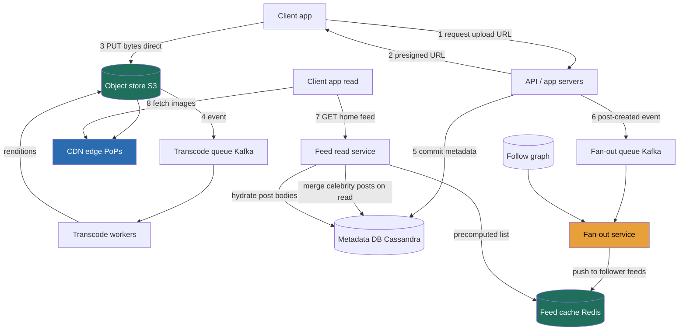

> Instagram is really **three systems in a trench coat**: a write-heavy **upload pipeline** putting bytes into an object store and onto a CDN, a **social graph**, and a brutally read-heavy **home-feed builder** assembling a personalized timeline in tens of milliseconds. The one decision the whole interview turns on is **how you build that feed**, at *write* time (precompute every follower's feed when someone posts) or *read* time (gather-and-merge on app open)? Each is correct for a different part of the user base, and the senior answer is a **hybrid** routed by follower count. The Director-altitude move is to keep saying, at each RESHADED step, *which requirement forces this choice and what it costs me.*

### Learning objectives
- Run a full **RESHADED** pass on a photo-sharing feed, deriving every structural decision from a stated requirement and its rejected alternative.
- Quantify from first principles, **~100M photos/day**, **~100:1 read:write**, **~55 PB/year** of media vs **~36 TB/year** of metadata, and use those numbers to *force* the architecture, not decorate it.
- Make the pivotal **feed-build** decision, fan-out-on-write vs fan-out-on-read, and the **celebrity hybrid**, and state the write-amplification cost (one celebrity post = **~100M feed inserts**) that kills the naive choice.
- Split the **upload path** correctly: object store + CDN for bytes, a partitioned metadata DB for records, async transcode off the request path.
- Handle **likes/comments at hot-key scale** with sharded counters, and **delegate the deep-dives**, ranking model, transcode farm, graph store, like a Director, not solve them like an IC.

### Intuition first
Think of a **newspaper that prints a unique front page for every reader.** When a journalist (someone you follow) files a story (posts a photo), the paper can **typeset it into the personal edition of every subscriber the instant it's filed**, your front page is pre-assembled when you wake up (**fan-out-on-write**: pay at write time, reads are instant). Or it can **wait until you open your paper, then run around collecting the latest stories from everyone you follow** (**fan-out-on-read**: cheap writes, expensive reads). For an ordinary journalist with 200 subscribers, pre-typesetting is cheap, fan-out-on-write wins. But a **celebrity with 100 million followers** files one story and "typeset into everyone's edition" means **100 million edits for a single post**, the press melts. For that journalist you flip strategies: leave the story on a shelf and merge it in fresh when each reader opens their paper. **Push for the long tail, pull for the celebrities, blended per reader**, that hybrid is the whole crux, plus the fact that photos are huge and records about them are tiny, so they live in two completely different stores.

---

## R: Requirements

Scope *before* building, the signal is **cutting** to a defensible core and naming the read:write reality that dictates everything downstream.

**Functional (the core):**
1. **Upload a photo** (caption, optional location/tags), transcoded into display renditions.
2. **Follow / unfollow** (the social graph).
3. **Home feed**, personalized, reverse-chronological-ish timeline from accounts you follow.
4. **Like and comment**, with visible counts.

**Explicitly cut (out loud, so it reads as choice, not omission):** Stories/Reels (same media pipeline + TTL), DMs, Explore/search, ads, and **ML feed ranking**, I build the feed as a rankable candidate set and delegate the model: *"the feed-ranking team owns scoring; my design delivers the candidate set and the signals (recency, affinity, engagement)."* That delegation *is* the Director move, not a gap.

**Clarifying questions (with assumed answers):**
- *Scale?* **~2B registered, ~500M DAU.**
- *Strict chronological or ranked?* **Ranked-ish, recency-dominated**, pure chronological would make fan-out-on-write a trivial append; ranking forces a re-score on read.
- *Feed freshness?* **Seconds-to-low-minutes is fine.** This is the requirement that secretly decides the architecture, it's what makes asynchronous fan-out legal. Flag it explicitly; juniors skip it and then can't justify precompute.
- *Likes/counts consistency?* **Eventually consistent display counts are acceptable**, which licenses sharded counters later.

**Non-functional:**
- **Read-heavy, hard:** ~100:1 reads:uploads (derived next). A read-serving machine with a write pipeline bolted on.
- **Feed latency:** p99 **≲ 200 ms** server-side on feed open.
- **Availability over strict consistency** for reads (AP lean), a slightly stale feed is fine, an unavailable one is not. The graph and upload-commit want stronger consistency; the system is not uniformly AP.
- **Media durability is non-negotiable**, target **11 nines** on the object store.
- **Cost-aware:** at ~55 PB/year of media and ~2 PB/day of egress, storage tiering and CDN hit ratio are budget lines a Director owns.

---

## E: Estimation

Enough math to force the design. **Assumptions:** 500M DAU; ~0.2 uploads/user/day → **~100M photos/day**; ~20 feed/photo reads/user/day.

**Write QPS:** 100M/day ÷ 86,400 ≈ **~1,200/s avg, ~2,500/s peak**. Tiny, uploads are not the scaling problem; what each upload *triggers* downstream is.

**Read QPS:** 500M × 20 = **10B reads/day** ≈ **~115k/s avg, ~290k/s peak**. **Read:write ≈ 100:1**, the headline number justifying caching, replicas, CDN, and precomputed feeds.

**Media storage:** ~1.5 MB/photo across the rendition set × 100M/day = **~150 TB/day → ~55 PB/year**, growing forever. Durability overhead: 3× replication ≈ 165 PB/year raw vs **erasure coding (~1.4×) ≈ 77 PB/year**, the EC choice saves **~90 PB/year of raw disk**, a real budget line.

**Metadata:** ~1 KB/photo record × 100M/day = **~100 GB/day → ~36 TB/year**. **Media is ~1,500× metadata** (55 PB vs 36 TB), the entire justification for splitting bytes from records; they're not even the same order of magnitude of problem.

**Egress:** ~200 KB/read × 10B/day = **~2 PB/day**. At a **95% CDN hit ratio** origin sees ~100 TB/day; the CDN absorbs ~1.9 PB/day. The CDN is not optional, it's load-bearing for latency *and* budget.

**Feed cache working set:** ~500 post IDs + scores ≈ 50 KB/user; all 500M DAU ≈ ~25 TB, too big to pin. Cache the **~50M recently-active users (~2.5 TB)**, rebuild cold feeds on demand. A Redis-cluster-sized working set, not infinite RAM.

**Read tier:** ~290k/s ÷ ~5k rps/server ≈ ~60 → **~100 servers with headroom**, stateless behind the cache.

> The two numbers carried into every later decision: **100:1 read:write** (→ precompute + cache + CDN) and **media ≫ metadata by ~1,500×** (→ two stores).

---

## S: Storage

Four distinct data shapes, each matched to a store type, refusing to jam them into one database is the signal.

| Data | Shape & access pattern | Store **type** | Real system | Rejected alternative (and why) |
|---|---|---|---|---|
| **Photo bytes** | Huge, immutable, write-once read-many | **Object/blob store + CDN** | **S3 / GCS** behind **CloudFront / Cloudflare** | A database BLOB column, wrong tool: melts the DB cache, can't reach 11 nines cheaply, can't sit on a CDN. |
| **Photo & user metadata** | Small (~1 KB) rows, keyed lookups, very high read rate | **Wide-column / partitioned KV** | **Cassandra** (or DynamoDB) | Single Postgres, holds 36 TB but can't absorb ~290k QPS or partition cleanly without sharding work I'd rather the store do. |
| **Follow graph** | Many-to-many edges; "who do I follow?" and "who follows me?" | **Partitioned KV / adjacency lists** | **Cassandra** edge tables; TAO-style graph cache at extreme scale | Relational join table, "followers of X" for a celebrity becomes a multi-million-row scan; **denormalize both directions**. |
| **Home feeds** | Per-user ID lists, transient, latency-critical | **In-memory store** | **Redis** (sorted sets) | Reading the feed from the metadata DB per open, fan-out-on-read with no cache, unaffordable at 100:1. |

The headline decision: **bytes in an object store fronted by a CDN; records in a partitioned wide-column DB; feeds in Redis**, forced by the two Estimation numbers. On durability, take **erasure coding (~1.4× overhead) over 3× replication** for the warm/cold bulk, same ~11 nines, ~90 PB/year of raw disk saved; the 200% overhead is a budget I won't sign at 55 PB/year.

<details>
<summary>Go deeper, erasure coding mechanics and the per-tier choice (IC depth, optional)</summary>

Erasure coding splits an object into k data + m parity fragments (e.g. 10+4 → 1.4× overhead) spread across failure domains; any k fragments reconstruct the object. The cost is on the read-of-a-degraded-object path: reconstruction requires fetching k fragments and computing, versus replication's single whole-copy read, so degraded reads are slower and repair traffic is bursty. That's why the right answer is per-tier, not global: keep **3× replication for the hot tier** (freshest photos, where degraded-read latency would be user-visible) and **EC for warm/cold bulk** (most bytes, rarely read). Lifecycle policies migrate objects between tiers as read rates decay over days.

</details>

---

## H: High-level design

Two flows matter, **upload** and **feed read**, and the key statement is that **fan-out happens asynchronously, off the user's upload request.**



**Upload (write).** Clients **upload bytes direct to object storage** via a presigned URL, app servers never touch the photo (at 150 TB/day they'd be a bandwidth bottleneck), and **async transcode workers** generate renditions off a queue. The user's "post" returns the moment the metadata row commits to Cassandra; in parallel a `post-created` event drives the **fan-out service**, which looks up the author's followers and pushes the post ID into each follower's Redis feed list, for non-celebrity authors (the hybrid split is below).

<details>
<summary>Go deeper, upload and transcode pipeline mechanics (IC depth, optional)</summary>

The two-phase upload: client `POST`s intent (content type, size) → API returns a short-lived presigned URL → client `PUT`s straight to S3 → the object-store write fires an event onto a Kafka transcode topic → workers pull, generate the rendition set (thumbnail / feed-size / full), and write renditions back under deterministic keys the CDN can pull. Workers are **idempotent per `photo_id`** (re-processing a duplicate event overwrites the same keys), so the queue can be at-least-once. The post is visible with a "processing" status until renditions land; clients show the local image meanwhile. Rendition matrix, codec choice (JPEG/WebP/AVIF), and GPU-vs-CPU encoding economics belong to the media team, the architecture only requires async + queue-driven + idempotent.

</details>

**Home feed (read).** The feed read service (a) pulls the user's **precomputed list from Redis** (the push portion), (b) **fetches recent posts from the few celebrities the user follows and merges** them (the pull portion), (c) re-scores the merged candidates, and (d) **hydrates** the top ~N IDs into full post objects from Cassandra. The response carries **CDN URLs**; the client fetches bytes from the edge, not from us. List assembly server-side, byte delivery via CDN, that split is what makes p99 ≲ 200 ms feasible at 100:1.

---

## A: API design

Small and RESTful; the two non-obvious choices are the **presigned-URL upload** and a **cursor-paginated feed**.

```
# --- Upload (two-phase: get URL, then commit) ---
POST /v1/uploads:request
  body: { content_type, size_bytes }
  -> { upload_id, presigned_url, expires_at }      # client PUTs bytes straight to object store

POST /v1/posts
  body: { upload_id, caption, location?, tagged_user_ids[] }
  -> { post_id, status: "processing" }             # returns BEFORE transcode finishes

GET  /v1/posts/{post_id}
  -> { post_id, author, caption, renditions:{thumb,feed,full URLs}, like_count, comment_count, created_at }

# --- Social graph ---
POST   /v1/users/{user_id}/follow      -> 202   # async-safe; idempotent
DELETE /v1/users/{user_id}/follow      -> 202

# --- Home feed (cursor-paginated, NOT offset) ---
GET /v1/feed?cursor={opaque}&limit=20
  -> { posts:[ {post_id, author, renditions, counts, ...} ], next_cursor }

# --- Likes & comments ---
POST   /v1/posts/{post_id}/likes       -> 202   # idempotent per (user, post)
DELETE /v1/posts/{post_id}/likes       -> 202
POST   /v1/posts/{post_id}/comments    body:{ text }   -> { comment_id, created_at }
GET    /v1/posts/{post_id}/comments?cursor=&limit=     -> { comments[], next_cursor }
```

**Cursor pagination, not `offset/limit`:** the feed is an ever-growing, re-ranked list; an offset means something different every time it changes, causing dupes and skips. *Rejected:* offset, simpler, broken on a live feed. **`POST /likes` returns 202, not the new count:** the like lands asynchronously in a sharded counter and the display count is eventually consistent (secured in R). *Rejected:* returning the authoritative count synchronously, it forces a read of a hot sharded counter on the write path, the 3.16 anti-pattern.

---

## D: Data model

The part that matters at scale is the **partition key**, it determines whether your hottest query hits one node or fans across the cluster.

**`photos` (Cassandra):** PK = `photo_id` for point reads, plus a second query-shaped table `posts_by_user` (PK = `author_id`, clustered by `created_at DESC`) for profile grids, the table-per-access-path idiom from 2.3. `rendition_keys` are object-store paths; the bytes are *not* in the DB.

**Follow graph, both directions, denormalized:** `following` (PK = `user_id` → followee ids) for feed builds, and `followers` (PK = `user_id` → follower ids) for fan-out. Partitioning by `user_id` makes each a single-partition read, but **`followers` for a celebrity is a multi-million-row partition**, the hot-partition problem Evaluation fixes (it's *why* fan-out-on-write can't serve celebrities).

**Home feed (Redis):** `feed:{user_id}` → ZSET of (post_id → score), **capped at ~500 entries** (trim on insert), bounding per-user memory and the ~2.5 TB working set. Shard key = `user_id`.

**Likes/comments:** the count is **not a column you `UPDATE`**, a celebrity post is a hot write key, so use **sharded counters per 3.16** (`like_count:{post_id}:{shard}`, increment a random shard, sum on read); comment bodies are an append-only table PK'd by `post_id`.

The load-bearing summary: `photo_id`/`user_id`/`post_id` partition keys spread point reads evenly; the *celebrity follower partition* and the *celebrity counter key* are the two hot spots the next step exists to fix.

---

## E: Evaluation

Stress your own design, an architecture with no self-identified failure modes reads as untested. Each fix names its trade.

**Bottleneck 1, fan-out write amplification (the headline failure).** Average author ~200 followers → ~1,200 uploads/s × 200 ≈ 230k feed inserts/s, absorbable. But a **celebrity post (100M followers) = ~100M feed inserts for one post**, even at 1M inserts/s that's ~100 seconds of fan-out per post, flooding Redis and the workers, and mostly *wasted* (few followers open the app before it's stale).
> **Fix, the hybrid (push the tail, pull the head).** Threshold at e.g. **>1M followers**. Normal authors fan out on write as designed. Celebrities **don't fan out**, their posts stay in `posts_by_user`, and at **read time** the feed service pulls each followed celebrity's recent posts and merges. **Trade:** every feed read gets slightly more expensive (a handful of extra reads + a merge) in exchange for eliminating the 100M-insert write storm. On a 100:1 read-heavy system you'd normally hate adding read cost, but a user follows only a *few* celebrities, so it's a few extra reads, not hundreds. *This hybrid is the single most important answer in the problem.*

**Bottleneck 2, the celebrity `followers` partition.** The hybrid spares true celebrities from fan-out entirely (their follower lists are never enumerated for push). For big-but-sub-threshold accounts, **fan out asynchronously in parallel batches off Kafka**, many workers drain the list over seconds. **Trade:** seconds of propagation latency for bounded per-worker load, exactly what "feed may be seconds stale" bought us in R.

**Bottleneck 3, hot counter key (celebrity likes).** A viral post takes likes faster than one row can serialize. **Fix:** sharded counters per **The sharded-counter building block**, split into N sub-counters, increment randomly, sum on read; the count becomes exact-but-eventually-consistent, which R pre-bought. *Rejected:* one atomic counter, strongly consistent but a hard throughput wall on a viral post.

**Bottleneck 4, feed-read hydration tail latency.** A feed open hydrates ~20 post IDs into full objects at ~290k opens/s, and the slowest read sets the p99. **Fix in one line:** cache **hydrated post objects** in Redis (a hot post hydrates once, serves millions) and hydrate only the first page, accepting that **edits/deletes must evict** the cached object.

**Bottleneck 5, single points / availability.** Object store and CDN are managed/multi-AZ. Fan-out is **stateless and replayable from Kafka**, if it lags, posts propagate late (degraded, not broken). A lost/evicted Redis feed is **rebuilt on read** from `posts_by_user` of followed accounts, the system degrades from fan-out-on-write to fan-out-on-read under cache loss. **Trade:** a slow rebuilt read for the guarantee that **Redis is an accelerator, never the source of truth**.

**Re-check vs NFRs:** p99 ≲ 200 ms ✓ (precomputed feeds + hydration cache + CDN bytes). 100:1 skew ✓ (95% CDN offload + cache). 11-nines media ✓ (object store + EC). AP feed ✓ (replayable fan-out, read-time rebuild). Cost ✓ (CDN turns 2 PB/day into ~100 TB/day origin; EC saves ~90 PB/yr raw).

---

## D: Design evolution

**At 10× (1.5 PB/day media, ~3M reads/s):** media and CDN scale linearly, the levers are **CDN hit ratio** (tiered caches, origin shielding) and **lifecycle-tiering** cold media (most photos are read heavily for days, then almost never); at this volume tiering is a multi-million-dollar/year line. The **feed/fan-out tier is what strains**: the celebrity threshold becomes a continuous, monitored knob (fan-out cost modeled per author as follower count × follower activity). Multi-region adds geo-locality: build feeds in the user's home region, replicate graph + metadata cross-region accepting lag.

**The hardest trade-offs (worth flagging as genuinely contested):**
1. **Where the celebrity threshold sits.** Too low → read-time merging creeps up on the 100:1 path; too high → fan-out storms leak back. An empirical boundary, not a constant.
2. **Ranked vs chronological.** Ranking improves engagement but forces re-scoring on every read (scores decay, signals arrive); chronological makes fan-out-on-write a trivial append. A **product-vs-infra tension** to surface to the room, not silently resolve.
3. **Hydration-cache invalidation and delete.** "Delete must remove a photo everywhere" is a privacy/legal obligation, not best-effort; and any count feeding payouts/analytics needs **exact event-log reconciliation** separate from the fast display counter.

**Where I'd delegate (with a stated prior, the consolidation of every hand-off in this design):**
- **Feed ranking model** → ranking team. I deliver the candidate set + signals; the model is theirs.
- **Transcode farm** → media team, codecs, rendition matrix, GPU-vs-CPU economics. Prior: async, queue-driven, idempotent per `photo_id`.
- **Graph store at extreme scale** → infra, "benchmark a TAO-style graph cache vs Cassandra adjacency lists for the celebrity-follower read; my prior is the adjacency lists hold until the followers-of-X read dominates."
- **Push/pull threshold tuning** → feed team, "push below ~X active followers, pull above; revisit X from the fan-out cost dashboard."

Going deep where the decision turns (the hybrid) and handing off the rest with a prior is the altitude this round scores.

---

## Trade-offs table: the pivotal decisions

| Decision | Option A | Option B | Option C (chosen, usually) | Use when… |
|---|---|---|---|---|
| **Feed build** | **Fan-out-on-write** (push at post time) | **Fan-out-on-read** (gather at read time) | **Hybrid**, push normal authors, pull celebrities | A: small/even follower counts, instant reads. B: write-heavy or rarely-read feeds. **C: real social scale, a few huge accounts + a long tail.** |
| **Media durability** | **3× replication** (200% overhead, fast reconstruct) |, | **Erasure coding** (~40% overhead, slower reconstruct) | A: hot tier where degraded-read latency matters. **C: warm/cold bulk at PB scale.** |
| **Like/comment counts** | **Single atomic counter** | **Sharded counter** (write÷N, eventual) | **Sharded display counter + exact event-log reconciliation** | A: low write rate. B: viral hot keys, display-only. **C: counts that also feed analytics/payouts.** |

(Two more argued inline with their rejected alternatives: **presigned direct upload** vs proxying bytes, and **cursor** vs offset pagination.)

---

## What interviewers probe here

- **"How do you build the home feed?"**, *Strong:* frames push vs pull, does the write-amplification arithmetic (celebrity = ~100M inserts/post), lands on the **hybrid with a follower threshold**, names the read-cost trade. *Red flag:* "query everyone they follow and sort" with no cost awareness, or precompute-everything with no celebrity carve-out.
- **"Why two stores for photos vs metadata?"**, *Strong:* the **~1,500× ratio** (55 PB vs 36 TB); object store + CDN for immutable bytes, partitioned DB for rows. *Red flag:* "store the image in a Postgres column."
- **"A celebrity post takes a million likes a minute, what breaks?"**, *Strong:* hot-key write contention → sharded counters, plus separating the eventually-consistent display count from an exact reconciled number. *Red flag:* "add read replicas" (replicas don't relieve a hot *write* key).
- **"What's the CDN buying you, in numbers?"**, *Strong:* 95% hit ratio turns ~2 PB/day into ~100 TB/day at origin, latency *and* a budget line. *Red flag:* "it makes images faster."
- **"What would you hand to another team?"**, *Strong:* ranking model, transcode matrix, extreme-scale graph store, each **with a stated prior**. *Red flag:* designing the ML ranker live (wrong altitude) or "the team handles it" with no prior.

---

## Common mistakes

- **Only fan-out-on-write (or only on-read).** Either alone breaks at social scale; skipping the celebrity case is the single most common failure.
- **Photo bytes in the database.** Melts the DB cache, can't reach 11 nines economically, can't sit on a CDN.
- **App servers in the byte path / synchronous transcode or fan-out.** A "post" must return in tens of ms, bytes go direct to object storage; heavy work goes on queues.
- **One atomic counter for viral likes.** A hot write key is a throughput wall; shard it.
- **Treating the feed cache as the source of truth.** A lost feed must be rebuildable from the metadata DB, or a cache failure becomes data loss.

---

## Interviewer follow-up questions (with model answers)

**Q1. A user posts, then immediately opens their own feed and doesn't see the post. What happened?**
> *Model:* Classic **read-your-writes** miss, fan-out is async, so the post hasn't landed in the author's own feed list yet. Fix: merge the author's own recent posts from `posts_by_user` into their feed read for a short window (cheap, bounded), and/or write the author's own feed entry synchronously while follower fan-out stays async. Trade: a touch more work on the post path so authors always see their own post; everyone else tolerates seconds of lag.

**Q2. The ranking team wants a new engagement signal recomputed per read. Does your design allow it?**
> *Model:* Yes, that's exactly why the feed is a **candidate set re-scored at read time**, not a frozen list. Cost is read-side compute: re-scoring candidates at ~290k opens/s. I keep retrieval cheap (precomputed list + celebrity merge), bound scoring to the first page, push expensive features into a precomputed feature store, and **delegate the model + feature pipeline** with the contract "retrieval is mine, scoring is yours, here's the latency budget." That separation lets ranking iterate without touching storage or fan-out.

**Q3. Walk me through deleting a photo, everywhere.**
> *Model:* A multi-store, partly-async operation and a **legal obligation**, not best-effort. (1) Mark the metadata row `deleted`, the authoritative hide, immediate. (2) Evict the hydrated object from Redis; let it age out of feed lists. (3) Purge the CDN (or rely on versioned URLs) and delete the object-store renditions + original. (4) Reconcile counters/comments. Deletion is eventually *complete*, but the hide is instant. What I won't accept: bytes still fetchable on the CDN after a delete, that's a privacy incident.

**Q4. You're over budget. Where do you cut without hurting the product?**
> *Model:* Three levers, in order. (1) **Raise the CDN hit ratio**, at ~2 PB/day egress it's the biggest line. (2) **Lifecycle-tier cold media**, most photos are cold within days; archive storage is ~an order of magnitude cheaper. (3) **Erasure-code the warm/cold tier**, ~90 PB/yr raw disk saved vs 3× replication. I would *not* cut the feed cache or read replicas, that hits the 100:1 read path and p99. The cuts target stored-but-rarely-read bytes, where the cost lives and users never notice.

---

## Key takeaways

- **The feed-build decision is the whole problem:** push (precompute, instant reads, write amplification) vs pull (cheap writes, expensive reads), at social scale the answer is the **hybrid**, because one celebrity post = **~100M feed inserts** otherwise.
- **Drive it with two numbers:** **~100:1 read:write** (→ CDN + cache + precompute) and **media ≫ metadata by ~1,500×** (→ bytes in object store + CDN, records in a partitioned DB). The architecture falls out of the arithmetic.
- **Keep heavy work off the request path:** presigned direct-to-object-store uploads, async transcode, async fan-out, a post returns in tens of ms.
- **Hot keys get sharded and eventually consistent:** likes/comments via sharded counters, with exact event-log reconciliation for any number feeding payouts.
- **Director altitude:** go deep on the feed hybrid (where the decision turns); delegate ranking, transcode, and the graph store **with stated priors**; own the CDN and erasure-coding cost levers.

> **Spaced-repetition recap:** Newspaper printing a unique front page per reader, typeset at filing time (**fan-out-on-write**) for normal authors, lay out on demand (**fan-out-on-read**) for the celebrity whose one story would mean 100M edits: that **hybrid** is the crux. Photos (≈55 PB/yr) in an **object store + CDN**; their 1 KB records (≈36 TB/yr) in a **partitioned DB**; feeds in **Redis**. **~100:1 read-heavy** → cache hard, push work off the request path, **shard the viral like counter**. Name every trade + what you'd delegate.
