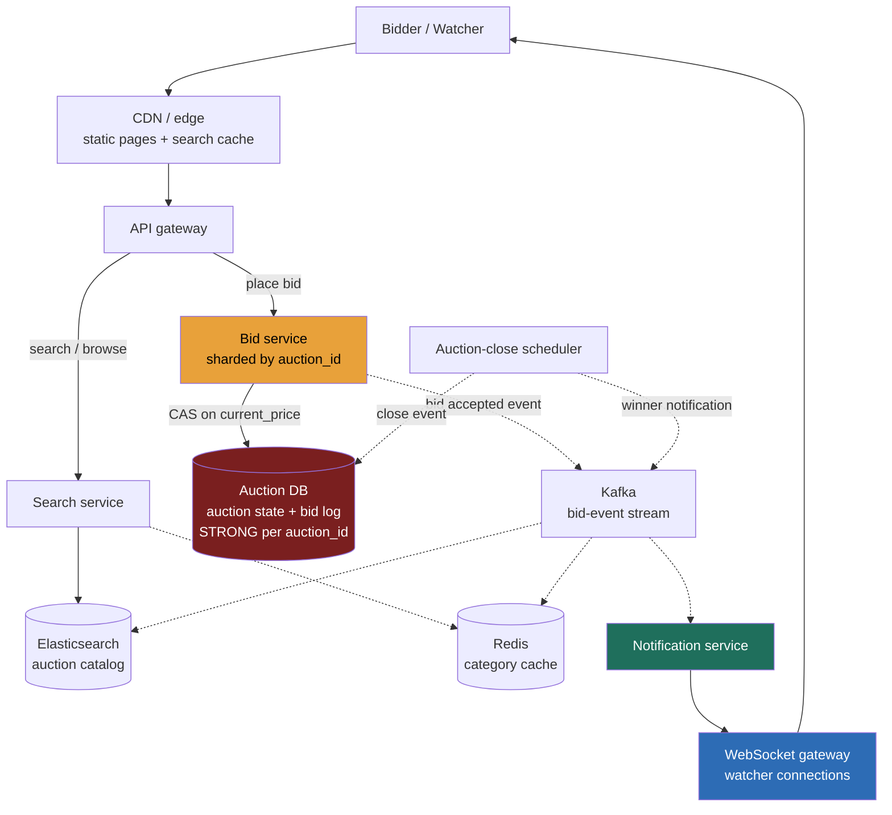

> **Why this gets asked, and what separates a Director answer.** Auction is Ticketmaster's cousin: both are contention problems under a correctness invariant. The difference is the *shape* of contention. Ticketmaster is **33:1 demand on one seat**, a flash crowd, solved with a queue and CAS. Auction is **rolling CAS on a single maximum** with *low per-auction write rate* but **10M simultaneous auctions**, solved with per-auction serialization points and a fan-out tier that scales independently of the core. The Director move is naming that pair, drawing the strong/eventual boundary correctly, and knowing when the math says a global lock is unnecessary. Candidates who conflate auction and seat-reservation, or who reach for a distributed lock before checking the numbers, are immediately recognizable.

---

### Learning objectives

1. Apply **RESHADED** to a problem where the crux is **compare-and-set on a running maximum** (highest bid) rather than a seat-hold TTL.
2. Articulate the **CAS-on-max vs seat-hold** distinction, the two canonical faces of the contention interview pattern.
3. Design a **strongly-consistent auction core** (per-auction serialization) decoupled from an **eventually-consistent fan-out tier** (watcher broadcast), with the math that justifies each boundary.
4. Reason through the **anti-sniping close-time extension** and the **flash-sale variant** (bounded-counter decrement) as design-evolution paragraphs, not standalone designs.
5. Name the cost/operational dimension, what this system spends on, what to delegate, and where the operational risk lives.

---

### Intuition first

Imagine a physical auction room. One auctioneer manages a single item: whoever shouts the highest price wins when the gavel falls. The auctioneer's job is simple, **only advance the price, never go back, and close the gavel fairly**. The hard part isn't the auctioneer; it's the *room*: thousands of observers who need to see the current bid in near-real time, plus the edge case where two bidders shout the same instant before the hammer falls.

Now scale that to a warehouse with **10 million simultaneous auctions**, one auctioneer per auction, all independent. The auctioneers are cheap and parallel; the challenge is the scoreboard that shows the current high bid to every watcher in real time. You don't need a single global lock, you need **one serialization point per auction**, and a fast, cheap broadcast path that is explicitly *not* the authoritative record.

That asymmetry, a tiny strongly-consistent per-auction core, a large eventually-consistent fan-out, is the whole design.

---

## R: Requirements

> Pin scope before building. The load-bearing fact here is not a global QPS; it is the **per-auction contention shape** and the total **concurrent auction count**.

**Clarifying questions (with assumed answers):**

- *Reserve price, buy-it-now, or pure ascending bid?* → **Both**, standard ascending-bid (English auction) is the main case; buy-it-now is an add-on that closes the auction instantly.
- *Auction duration?* → Minutes to days; typical eBay-scale is **hours**. Not a flash crowd; bids arrive at low, bursty rates per auction.
- *What's the correctness invariant?* → **No bid lower than or equal to the current high bid must be accepted.** The winning bid must be exactly the highest accepted bid. No double-wins.
- *Watchers, how many per auction, and what's the acceptable lag?* → Potentially **thousands of watchers per hot auction**; lag up to **a few seconds** is acceptable for the displayed current price. The authoritative price is always read from the source-of-truth before a bid is accepted.
- *Anti-sniping?* → Yes, a bid placed in the last N seconds **extends the close time** by N seconds (standard practice on eBay).
- *Scale?* → ~**10M concurrent active auctions**, ~**500M registered users**, ~**10M bids/day** across all auctions.

**Functional requirements:**
1. **Create** an auction with reserve price, duration, buy-it-now price.
2. **Browse/search** active auctions by category, keyword, seller.
3. **Place a bid**, accepted only if strictly greater than the current high bid; CAS.
4. **Watch** an auction, receive near-real-time updates on new high bids.
5. **Close** an auction at expiry (or buy-it-now trigger), declare the winner.
6. **Anti-sniping**, extend close time when a bid arrives near deadline.
7. **Pay and fulfill**, winner pays; I scope this to "trigger payment workflow" and delegate PCI.

**Explicitly cut:** proxy bidding (auto-increment), Dutch auctions, seller analytics, dispute resolution, returns, fraud scoring. Named and dropped. Scoping is the signal.

**Non-functional requirements:**
- **Strong consistency on bid acceptance**, linearizable per auction: the current high bid is the only valid baseline; two simultaneous bids must resolve to exactly one winner with no accepted underbid.
- **High availability for browse/search/watching**, AP, cache-fronted, staleness of seconds is fine.
- **Low latency**, bid placement p99 < 300 ms; watcher update lag < 3 s acceptable.
- **Scale**, 10M concurrent auctions; ~10M bids/day; potentially thousands of watchers on hot auctions.
- **Anti-sniping close-time extension** must be atomic with bid acceptance; can't extend the close without the bid winning.

---

## E: Estimation

> Enough math to draw the strong/eventual boundary and reject approaches that would not survive the numbers.

**Assumptions:** 10M concurrent auctions; 10M bids/day; peak bid rate 10× average; ~1K watchers on a hot auction; ~500 watchers on average for auctions with watchers; ~30% of auctions have at least one watcher.

**Bid write QPS (global):**
`10M bids/day ÷ 86,400 s ≈ 116 bids/s` average; peak 10× → **~1,200 bids/s** globally. Spread across 10M auctions, this is **on average 0.000116 bids/s per auction**, roughly **one bid every ~two hours** per auction in the average case. Even a hot auction during its closing minutes might see **5-20 bids/min**, or < 1 bid/s per auction. This is the critical number: **per-auction write contention is low by design**. A global lock would be absurd; a per-auction serialization point is cheap and correct.

**Fan-out (watcher notifications):**
`1,200 bids/s × 500 watchers/auction (average, active auctions) × 30% active fraction ≈ 180,000 watcher events/s`. Hot auctions in closing minutes: `20 bids/min × 1,000 watchers ≈ 333 events/s on that one auction`. Total fan-out is comfortably handled by a pub-sub tier (Kafka + WebSocket gateway); the core never touches it. This is the fan-out number that references **the live-comments** connection economics, tens of thousands of persistent WebSocket connections per gateway node.

**Storage:**
- Auction metadata: `10M auctions × ~1 KB ≈ 10 GB` active; cheap.
- Bid history: `10M bids/day × 365 × ~200 B ≈ 730 GB/yr` → **~1 TB/yr**. Append-only, fits in a time-partitioned wide-column store or Postgres with partitioning.
- Working set (active auctions + recent bids): fits in ~50-100 GB RAM across a small cluster.

**What estimation decided:**
- Per-auction write rate is **< 1 bid/s**, no queue needed to meter the core; global 1,200 bids/s parallelizes trivially across 10M independent serialization points.
- Fan-out at 180K events/s is the actual scaling challenge and must be decoupled from the bid-acceptance path.
- Storage is small (~1 TB/yr bids); hardness is correctness + fan-out, not volume.

---

## S: Storage

> Three data classes with different consistency needs; pick by access pattern.

**1. Auction state + bid ledger (strongly consistent, per-auction serialization).**
- *Choice:* **relational/NewSQL store sharded by `auction_id`**, Postgres with row-level conditional updates, or DynamoDB with conditional writes. The pattern demands a single-statement CAS on `current_price`, a bid-log append in the same transaction, and conditional close-time extension.
- *Rejected, Cassandra LWW:* last-write-wins allows two concurrent bids to both succeed and converge to the wrong replica winner, the underbid is silently accepted. Not viable.
- *Rejected, global Redis SETNX lock per auction:* adds a network hop and a lock-timeout dependency; DB row-level atomicity already provides the invariant.

**2. Auction catalog + search (read-heavy, AP).**
- *Choice:* **Elasticsearch/OpenSearch** for full-text + faceted search, fronted by Redis cache. Staleness of minutes is invisible.
- *Rejected, search off the auction DB:* couples the browse firehose to the CP core.

**3. Watcher notification (eventually consistent, high fan-out).**
- *Choice:* **Kafka** for bid-event publication; **WebSocket gateway** for last-mile push. The displayed price is a hint; the CAS is the truth.
- *Rejected, synchronous push from bid-acceptance path:* couples bid p99 to an unbounded watcher count.

---

## H: High-level design

> A small strongly-consistent core (bid acceptance, auction state) decoupled from a large eventually-consistent fan-out (watchers, search, catalog).



**Happy path, placing a bid:** The bidder's request hits the API gateway, routes to the **Bid service** (request hashed to the shard owning that `auction_id`). The service executes an **atomic conditional update**: advance `current_price` and append to the bid log only if the new bid is strictly greater than `current_price`, and the auction is still open. One bid wins; concurrent lower bids see 0 rows updated and receive a **409, outbid**. If the bid arrives within the anti-sniping window, the same transaction extends `close_at`. On success, the Bid service emits a `bid_accepted` event to **Kafka**. The Notification service consumes the event and pushes it to **WebSocket gateway** nodes, which fan out to all active watcher connections for that `auction_id`.

**Happy path, watching:** A watcher opens a WebSocket connection to the gateway; the gateway subscribes the connection to the `auction:{auction_id}` channel. The watcher receives a push for each `bid_accepted` event. No polling; no load on the auction DB. The displayed price is eventually consistent; the gavel falls on the source-of-truth price.

**The shape to notice:** the Auction DB is touched only for bid writes and auction-state reads at bid time. Everything else, search, watching, current-price display, seller dashboards, is AP and never touches the CP core.

---

## A: API design

> The status codes and the idempotency key are the correctness story; keep the surface small.

```
# --- Browse (eventual, cached) ---
GET  /v1/auctions?q=&category=&min_price=&sort=
     -> 200 { auctions: [...], total }
GET  /v1/auctions/{auctionId}
     -> 200 { auctionId, title, currentPrice, closeAt, watcherCount, ... }
     # currentPrice is a hint from cache; authoritative check happens at bid-place time

# --- Place a bid (strongly consistent, CAS) ---
POST /v1/auctions/{auctionId}/bids
  headers: { Idempotency-Key: <uuid> }
  body: { amount: 155.00, currency: "USD" }
  -> 201 { bidId, newCurrentPrice, closeAt }  # CAS succeeded; you are the high bidder
  -> 409 { currentPrice: 160.00, message: "outbid" }  # CAS failed; current price returned
  -> 410 Gone                                  # auction already closed
  -> 400                                       # amount <= currentPrice (client-side guard)

# --- Watch (WebSocket upgrade) ---
GET  /v1/auctions/{auctionId}/stream           # Upgrade: websocket
  <- { type: "bid", newPrice: 155.00, closeAt, bidderId_masked }  # push on each bid
  <- { type: "close", winnerId_masked, finalPrice }

# --- Buy-it-now ---
POST /v1/auctions/{auctionId}/buy-now
  headers: { Idempotency-Key: <uuid> }
  -> 201 { orderId }                           # atomic close + win
  -> 409                                       # already closed or bid exceeds buy-now price

# --- Create auction (seller) ---
POST /v1/auctions
  body: { title, description, reservePrice, startPrice, buyNowPrice, closeAt, ... }
  -> 201 { auctionId, ... }
```

**Design notes:**
- **`Idempotency-Key` on bid placement is mandatory.** A network retry without it places two bids; the second may succeed as the new high bid. The unique key deduplicates server-side.
- **The `currentPrice` in the 409 response is a Director touch.** The client gets the fresh authoritative price immediately; no follow-up GET that races with another bid.
- **WebSocket upgrade, not polling.** 1-s polling × 1,000 watchers × 10K hot auctions = 10M reads/s on cache; WebSocket push at the same scale is ~10K fan-out events/s, two orders of magnitude cheaper. See the live-comments lesson.
- **No separate "get current price" call for bidders**, the 201/409 response carries it.

---

## D: Data model

> The shard key and the CAS condition together define the correctness of the system.

**`auctions`**, primary key `auction_id`; shard key `auction_id`; carries `current_price`, `current_winner_id`, `reserve_price`, `buy_now_price`, `close_at`, `status` (`OPEN`/`CLOSED`/`CANCELLED`), `version` for optimistic concurrency.

**`bids`**, primary key `(auction_id, bid_id)`; shard key `auction_id` (colocated with the auction row); carries `amount`, `bidder_id`, `placed_at`, `idempotency_key` (unique index for dedup).

**The CAS statement (the correctness mechanism):**
```sql
UPDATE auctions
  SET current_price = :amount,
      current_winner_id = :bidder_id,
      close_at = CASE
        WHEN close_at - now() < :snipe_window
        THEN close_at + :extension
        ELSE close_at
      END,
      version = version + 1
WHERE auction_id = :auction_id
  AND status = 'OPEN'
  AND :amount > current_price
  AND close_at > now();
-- 1 row updated = CAS won; 0 rows = outbid, closed, or amount too low
```

On success: insert the bid row in the same transaction.

**Shard key = `auction_id`. The load-bearing decision:**
- *Why it's right:* all operations on an auction, CAS on `current_price`, bid log append, close-time extension, close event, are scoped to one `auction_id`. Sharding by `auction_id` colocates all of them on one shard: no cross-shard 2PC; the CAS, the bid append, and the anti-snipe extension are one local transaction.
- *Rejected, shard by `bidder_id`:* the CAS on `current_price` needs to own the auction row; distributing by bidder scatters bids for the same auction across shards, forcing distributed transactions for every bid.
- *Rejected, shard by `category`:* hot categories create hot shards. `auction_id` distributes load uniformly.

**Hot-auction concern, and why the math rejects a global lock:** The hottest closing auction might see **20 bids/min**, one bid every 3 seconds. A per-row serialized CAS at that rate is trivially fast; row-level locking within a shard holds for microseconds. A global lock (Redis SETNX) adds a network round trip (~1 ms) for every bid on every auction, unnecessary overhead when per-row DB atomicity already provides the invariant. State the math; don't reach for a distributed lock unless the per-row rate demands it.

<details>
<summary>Go deeper, bid deduplication and idempotency key mechanics (IC depth, optional)</summary>

The `idempotency_key` column in `bids` has a unique index scoped to `auction_id`. On bid placement, the server upserts: if the key already exists, it returns the original result (won/lost) without re-executing the CAS. This handles the common case of a client retry after a timeout: the CAS ran, the bid won, the network dropped the response, the client retries. Without the dedup, the retry might place a second bid at a higher amount if the first bid's win lowered the server-side reservation minimum. With the dedup, the retry returns the original 201 or 409.

Implementation detail: the upsert must check the key before the CAS, within the same transaction, to avoid a race between two parallel retries of the same key. Postgres `INSERT ... ON CONFLICT DO NOTHING` followed by a check on rows-affected achieves this. DynamoDB's `ConditionExpression` on `idempotency_key` does the same.

</details>

---

## E: Evaluation

> Re-check against NFRs and surface the real bottlenecks.

**Re-check vs NFRs:**
- *No accepted underbid*, CAS with `amount > current_price`; one winner per update; multi-condition covers closed and expired auctions.
- *Watcher lag < 3 s*, Kafka + WebSocket push; typical end-to-end at low load is < 500 ms; under fan-out the bottleneck is WebSocket gateway throughput, not the Kafka lag.
- *Browse availability*, fully decoupled AP tier; auction DB failures don't affect search.
- *Scale: 10M concurrent auctions*, each is an independent row; 1,200 bids/s globally across 10M rows is trivially parallelized by sharding.

**Bottleneck 1, CAS correctness under concurrent bids.**
Two bidders submit `$110` simultaneously against `current_price = $100`.
*Fix:* the CAS condition `amount > current_price` with row-level serialization means exactly one UPDATE affects 1 row; the other sees 0 rows → 409 with the current price. *Rejected:* version-check only, a version bump doesn't encode price ordering; a stale-version retry could accept a lower bid after a winning higher bid. The CAS must test both conditions.

**Bottleneck 2, Fan-out on a closing hot auction.**
1,000 watchers, 20 bids/min ≈ 333 watcher events/s on that auction.
*Fix:* Bid service emits to Kafka and returns 201 immediately; Notification service fans out to WebSocket gateway nodes holding watcher connections (~50K per node). Watcher lag of 1-2 s is expected and acceptable. *Rejected:* synchronous fan-out, turns a 20 ms DB operation into a seconds-scale bid-acceptance p99.

**Bottleneck 3, Anti-sniping atomicity.**
A bid within the snipe window must atomically accept the bid *and* extend `close_at`.
*Fix:* the conditional CASE expression in the CAS UPDATE handles both in one statement (see data model). *Rejected:* two-step, a crash between bid acceptance and `close_at` extension closes the auction without the anti-snipe window.

**Bottleneck 4, Auction-close scheduling at 10M active auctions.**
A cron sweep is O(10M) per second.
*Fix:* **Redis sorted set delayed queue**, `ZADD close_queue <close_at_ms> <auction_id>` on create; scheduler polls `ZRANGEBYSCORE` for expired entries, processes, `ZREM`s. Anti-snipe re-enqueues with the new score. *Trade-off:* Redis dependency, mitigated by a replicated cluster.

<details>
<summary>Go deeper, distributed close-scheduler patterns (IC depth, optional)</summary>

Two viable patterns for at-scale auction closing:

**Redis sorted set:** auction close events stored as `ZADD close_queue <close_timestamp> <auction_id>`. A scheduler polls `ZRANGEBYSCORE close_queue 0 <now()> LIMIT 100` every second, processes each auction close, and `ZREM` on completion. Anti-snipe re-enqueue is a `ZADD` with the new score. Simple; works for tens of millions of auctions; single-node Redis can handle ~100K operations/s easily.

**Kafka with timestamp routing:** publish a "close" event to a Kafka topic with `close_at` as the event time; a consumer with a configurable processing lag processes events whose timestamp has passed. More durable (Kafka vs Redis persistence), but timestamp-based delay in Kafka requires careful consumer offset management and is less operationally obvious than a sorted set. Prefer the sorted set pattern unless Kafka is already the event bus and durability of close events is a concern.

Both fail gracefully: the CAS on bid acceptance already checks `close_at > now()`, so even if the scheduler is delayed, no bids are accepted after the true close time. The scheduler's job is to finalize state and trigger winner notification, not to enforce the close.

</details>

---

## D: Design evolution

> Push dimensions, find what breaks, name the trade-off.

**At 10× (100M concurrent auctions, 12K bids/s global):**
The bid-acceptance core scales horizontally, each `auction_id` shard is independent; add shards. The fan-out tier scales by adding WebSocket gateway nodes and Notification service consumers. The close scheduler scales by partitioning the sorted set by `auction_id % N` across N Redis nodes. Nothing here is qualitatively different; this is the system's natural scale axis. The operational risk at 10× is **shard rebalancing** during growth, plan for consistent hashing across shard nodes rather than static assignment.

**Flash-sale variant (bounded-counter decrement):**
A flash sale is not an auction, it is a **fixed inventory sold at a fixed price, first-come-first-served**. The contention shape is Ticketmaster's GA variant: one hot counter per SKU, claimed with a conditional decrement that cannot go below zero: `UPDATE inventory SET qty = qty - 1 WHERE sku_id = ? AND qty > 0`. At extreme concurrency (thousands of requests/s on one SKU), that single row serializes. The fix is a **sharded counter**: split inventory across N shards, decrement a random shard, sum on read. Trade-off: the displayed remaining count is approximate (sum of shards with slight staleness) in exchange for N× write throughput. This is the CAS-on-max/seat-hold/bounded-counter **third face of contention**, name it explicitly as a family.

**The CAS-on-max vs seat-hold contrast (the Director synthesis):**
Ticketmaster uses a seat-hold TTL, a temporary claim that expires, with `AVAILABLE → HELD(ttl) → SOLD`. Auction uses CAS-on-max, no hold, no TTL on the bid; the high bid is simply replaced atomically when outbid, and the auction closes at a point in time. The underlying DB primitive is the same (conditional update, one winner), but the semantic differs: seats require a *temporary exclusive claim* during payment; bids require a *monotonically advancing maximum with no exclusive claim* (anyone can outbid you at any time). Both are serialized at the row level; neither requires an external lock. Name the pair to show pattern recognition across the module.

**What I'd revisit:** proxy bidding changes the CAS to "advance to `min(proxy_max, current_price + increment)`", a server-side agent; isolate behind the Bid service. Reserve-price adds a status branch in close logic. Multi-item lots flip the CAS to "maintain top-N bids", a separate auction type flag.

**Where I'd delegate:**
- *Payment/PCI:* "Payments team owns `charge(orderId, amount, paymentToken)`; my prior is delayed capture (authorize at bid win, capture at close) with idempotent retry."
- *Fraud/shill bidding:* "Trust-and-safety owns detection; my prior is behavioral signals fed to a scoring service that can invalidate bids post-close; I expose a bid-history API."
- *WebSocket gateway:* "Co-design with infra referencing the live-comments scale numbers; my prior is managed WebSocket service before bespoke."

---

### Trade-offs table: pivotal decisions

| Decision | Option A | Option B | Option C | Use when |
|---|---|---|---|---|
| **Bid concurrency** | **CAS on `current_price`**, atomic conditional update; loser gets 409 | **Pessimistic row lock** (`SELECT FOR UPDATE`) | **External distributed lock** (Redis SETNX per auction) | **A** always, per-auction rate < 1 bid/s; optimistic CAS fails fast, no lock held. **B** forms convoys under flash close. **C** adds a network hop for an invariant DB atomicity already provides free. |
| **Watcher fan-out** | **Async Kafka + WebSocket gateway**, bid path emits event, fan-out independent | **Synchronous push from Bid service** | **Polling by watchers** | **A** always, decouples bid p99 from watcher count. **B** fatal at 1K+ watchers. **C** 2 orders of magnitude more read load than push. |
| **Auction-close scheduling** | **Delayed queue** (Redis sorted set by close timestamp) | **Cron table scan** (`WHERE close_at < now()`) | **Client-triggered close** | **A** always, O(1) per close event; anti-snipe re-enqueue is `ZADD`. **B** O(10M) per sweep at scale. **C** race if no traffic arrives. |
| **Shard key** | **`auction_id`**, all ops on one auction colocated | **`seller_id`** | **`category_id`** | **A** always, CAS + bid append + anti-snipe in one local transaction. **B** hot shards for power sellers. **C** couples AP browse to CP write core. |

---

### What interviewers probe here (Director altitude)

**"What prevents two people winning the same auction?"**
Strong signal: the CAS on `current_price`, DB serializes writes to the row; exactly one UPDATE affects 1 row; the loser sees 0 rows and gets a 409 with the fresh price; both wins are not possible. Name the CP choice and the rejected AP alternative.
Red flag: "we use a distributed lock per auction" (DB row-level CAS already provides the invariant; check the per-row rate before reaching for infrastructure); or "Kafka ordering handles it" (Kafka does not provide atomic conditional updates).

**"How does the anti-sniping extension stay atomic with bid acceptance?"**
Strong signal: CAS and `close_at` extension are one conditional UPDATE statement, name the failure mode of the two-step approach (bid wins, crash before extension → auction closes without snipe window).
Red flag: "update close_at in a separate call."

**"You have 1,000 watchers on a hot auction. How do you fan out without slowing down bids?"**
Strong signal: Bid service emits to Kafka and returns 201 immediately; Notification service consumes async, fans out to WebSocket gateway nodes; 1-2 s lag is expected. Watcher count must not appear in bid-acceptance p99. Cost: WebSocket gateway tier dominates, not the auction DB. Reference the live-comments connection economics.
Red flag: synchronous fan-out; or "polling" without quantifying the 10M reads/s amplification.

**"Why not a per-auction distributed lock (Redis SETNX)?"**
Strong signal: show the math, hottest closing auction sees < 1 bid/s on average; per-row DB serialization already provides the invariant atomically; Redis adds a network hop and a failure domain with no benefit. Directors check the per-row rate before reaching for distributed infrastructure.
Red flag: proposing Redis SETNX without checking bid rate, or conflating it with DB row serialization.

**"What does this system cost?"**
Strong signal: auction DB is small (~1 TB, ~1,200 bids/s); cost is the WebSocket gateway + Elasticsearch cluster. Operational risk is the WebSocket gateway under flash closings. Delegate payments/PCI and fraud with stated priors.
Red flag: sizing a giant database.

---

### Common mistakes

- **Proposing a distributed lock before checking per-auction write rate.** The math shows < 1 bid/s per auction on average. DB row-level CAS is already atomic; Redis SETNX adds a network hop and a failure domain for an invariant you get for free.
- **Conflating auction CAS with Ticketmaster seat holds.** Seat holds use TTL-based exclusive claims (`AVAILABLE → HELD → SOLD`); bids use a monotonically advancing maximum with no exclusive claim. The DB primitive is identical; the semantics and design differ. Name the pair.
- **Synchronous fan-out from the bid path.** Coupling bid p99 to watcher count is fatal at scale; 1,000 watchers on a closing auction would turn a 20 ms DB operation into seconds.
- **Polling instead of WebSocket push.** 1,000 watchers × 10K hot auctions × 1-s poll = 10M reads/s; push at the same scale is ~10K events/s, two orders of magnitude cheaper.
- **Two-step anti-sniping.** A crash between bid acceptance and `close_at` extension leaves the auction closed without the snipe window extended. Single-statement CAS eliminates the race.

---

### Practice questions with model answers

**Q1. A bidder places $200 at the exact moment another bidder places $205. Both bids arrive at the same millisecond. What happens?**

> *Model:* The DB serializes writes to the `auction_id` row. One UPDATE executes first; the second's `amount > current_price` condition is evaluated against the already-updated price. Either way exactly one bid wins per write slot and the winner is the highest bid. The loser gets a 409 with the current price and can rebid immediately, no seat hold, no exclusive claim.

**Q2. The Notification service is down for 30 seconds during a hot auction close. What breaks and what doesn't?**

> *Model:* Watchers stop receiving live updates, UX degradation, not a correctness failure. Bid acceptance continues; events accumulate in Kafka (durable, replicated); on recovery the Notification service consumes from its last offset. The auction DB is unaffected; the auction closes at `close_at` as scheduled. Alert on consumer lag; this is a P2 incident (watcher SLA degraded), not P0 (the Bid service and DB are the P0 surface).

**Q3. Design the auction-close mechanism for 10M active auctions without a table scan.**

> *Model:* `ZADD close_queue <close_at_ms> <auction_id>` on create. Scheduler polls `ZRANGEBYSCORE close_queue 0 <now_ms> LIMIT 100` every second, executes close logic, `ZREM`s the entry. Anti-snipe re-enqueue is `ZADD` with the new score (ZADD updates existing members). Trade-off: Redis dependency and failure mode, mitigated by a replicated cluster. Alternative, cron table scan, is O(10M) per sweep at scale. At 10×: shard the sorted set by `auction_id % N`.

**Q4. A seller claims the winning bid was placed after the auction closed. How do you audit this?**

> *Model:* The CAS condition includes `close_at > now()`, any bid arriving after `close_at` affects 0 rows and is rejected with a 410; it never appears in the bid log. The `bids` table records `placed_at` with server-assigned timestamps; a bid in the log definitionally passed the `close_at` check at write time. Audit: query `bids WHERE auction_id = ? ORDER BY placed_at` and verify the winner is the highest row; cross-check against the close-event timestamp in Kafka. I'd expose a "bid history" API backed by a read replica and delegate dispute adjudication to Trust & Safety.

---

### Key takeaways

1. **Auction is the second face of the contention pattern** (Ticketmaster is the first): Ticketmaster uses a TTL-based seat hold (`AVAILABLE → HELD → SOLD`); auction uses CAS-on-max (monotonically advancing `current_price`, no exclusive claim, no TTL on the bid). The DB primitive, conditional update, one winner, is identical; the semantics differ. Name the pair.
2. **Per-auction write rate < 1 bid/s on average.** DB row-level CAS is the correct primitive; a distributed lock (Redis SETNX) adds overhead and a failure domain for an invariant the DB already provides. Directors check the per-row rate before reaching for infrastructure.
3. **The fan-out tier is where the scale and cost live**, not the auction DB. 180K watcher events/s requires a decoupled Kafka → Notification service → WebSocket gateway path; synchronous fan-out from the bid-acceptance path couples bid p99 to watcher count, immediately fatal under hot closings.
4. **Anti-sniping extension must be atomic with bid acceptance.** Both the CAS and the `close_at` update belong in one conditional UPDATE statement; a two-step approach creates a crash-between-steps correctness failure.
5. **Draw the strong/eventual boundary tight:** the auction DB (bid acceptance, auction state) is strongly consistent and small; search, browse, and watcher display are AP. The spend is the WebSocket gateway + Elasticsearch cluster; the auction DB is modest (~1 TB). Delegate payments/PCI and fraud/shill-bidding detection with stated priors.

> **Spaced-repetition recap:** Online Auction = **CAS-on-max**, advance `current_price` only if the new bid is strictly greater, one atomic conditional UPDATE, loser gets 409. Per-auction write rate is < 1 bid/s, DB row-level CAS is sufficient; no distributed lock needed. Fan-out to **thousands of watchers** via async Kafka → WebSocket gateway; never synchronous on the bid path. **Anti-sniping** is a conditional `close_at` extension in the same CAS statement. Close scheduling uses a Redis sorted set (delayed queue) to avoid O(10M) scans. Strong on auction state + bid log; eventual on search, browse, and watcher display. Contrast with Ticketmaster: seat-hold TTL vs CAS-on-max, same conditional-update primitive, different semantics.

---

*End of Lesson 5.4. The online auction problem is the CAS-on-max complement to Ticketmaster's seat-hold TTL, both are contention problems solved by per-resource conditional writes at the DB layer, differentiated by whether the claim is exclusive-and-temporary (seat hold) or monotonically-advancing-and-open (highest bid).*
