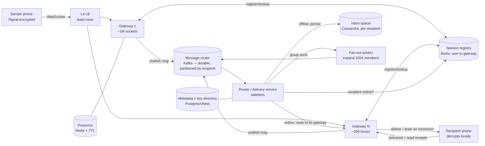

### Learning objectives
- Run the **RESHADED** spine end-to-end on a real-time messaging system, defending each step against requirements, cost, and risk rather than reciting components.
- Separate the two hard sub-problems, the **session layer** (mapping a user's device to the gateway holding its socket) and the **router + per-recipient inbox** (durable delivery to an offline phone), and explain why messaging is a **write-fan-out** problem, *unlike* a feed.
- Quantify in numbers a Director can stand behind: **~200M concurrent connections**, **~2.5M sends/s** peak, **~6M deliveries/s** after fan-out, **~12M receipt events/s**.
- State what **end-to-end encryption** *buys* and what it *forbids*, no server-side content search, no plaintext group fan-out, and which features survive (receipts, presence, routing on metadata).
- Know where a Director **goes deep** (ordering / delivery guarantees, the E2E constraint) and where they **delegate a benchmark** (gateway density, compaction), naming each trade-off.

### Intuition first
A messaging backend is not a database problem, it's a **switchboard** problem. Hundreds of millions of phones each hold one open line to the building (a persistent socket). The hard part is never "store the message", a text is 200 bytes. The hard part is: when Alice hands over a sealed envelope addressed to Bob, **which of our 250 switchboard operators currently holds Bob's line**, and **what do we do when Bob's line is dead**? So the system is two cooperating machines: a **directory** ("user → which operator has their socket right now"), looked up millions of times a second; and a **per-person mailbox**, when Bob is offline the envelope goes into his mailbox, and the instant he reconnects, the operator drains it to him in order, then deletes it. Two wrinkles make it WhatsApp and not a toy: a **group** message is one envelope copied into many mailboxes (fan-out), and the envelopes are **sealed (E2E-encrypted)**, the building can route them and stamp them "delivered" but can never open them, which quietly kills any feature that needs to read content.

Two framing notes. First, the read:write skew is the **opposite of a feed**: a feed post is read thousands of times (fan out on *read*); a message is read by a handful of recipients exactly once and is then dead weight, so you fan out on *write* and **delete after delivery**. Second, the server is deliberately dumb about content, our cleverness lives in routing and delivery, never in the payload.

---

## R: Requirements

"Build WhatsApp" hides a dozen products; the signal is **cutting to a defensible core and saying why**.

**Clarifying questions (and assumed answers):**
- *Groups?* → **Yes, capped at 1,024 members** (WhatsApp's real cap). The cap bounds fan-out and lets me reject "group = pub-sub topic with millions of subscribers."
- *Server-side message history?* → **No** (the WhatsApp model): the server holds a message only **until delivered**, then deletes it. Load-bearing, it turns a petabyte storage problem into a transient-queue problem. Contrasted with iMessage/Telegram in Design Evolution.
- *E2E encryption?* → **Yes.** A *constraint*, not a feature, it removes whole sub-systems (server-side search, plaintext group fan-out).
- *Media?* → **Delegated to blob store + CDN**; the chat path carries only a pointer + decryption key.
- *Ordering?* → **Per-conversation FIFO**; no global ordering (impossible and unnecessary).

**CUT (with the reason):** voice/video calls (a WebRTC/SFU problem), status/stories (a feed problem), payments, server-side full-text search (E2E forbids it, search is client-side). Trying to design all of WhatsApp in 45 minutes is the red flag.

**Functional:** 1:1 messages in real time; group messages (≤1,024); **offline delivery** (reliable on reconnect); **delivery + read receipts** (✓ / ✓✓ / blue); **presence** (online / last-seen); per-conversation FIFO with **exactly-once *display***.

**Non-functional (these drive every later decision):**
- **Latency:** p99 end-to-end **< 500 ms** when both online, the headline SLO.
- **Availability ≥ 99.99% for send**, and **always-writable**: if the recipient is down, the sender must still succeed (decouple via a queue).
- **Durability:** an *accepted* message is never lost before delivery.
- **Scale/skew:** **~500M DAU, ~100B messages/day**, read:write ≈ 1:1 per message, but **fan-out heavy** (one group send → up to 1,024 delivery writes) and **receipt-amplified**.

The decisive requirement is **always-writable + offline delivery**: it forces an **asynchronous, queue-backed router**, the architectural fork everything else hangs off.

---

## E: Estimation

Enough math to size the **gateway fleet**, the **storage burden**, and the **bandwidth**, and to expose that the real load is **deliveries and receipts**, not sends.

**Assumptions:** 500M DAU; 100B messages/day; peak ≈ 2× average; average message reaches **~2.5 recipients** (mostly 1:1, leavened by groups); **~40% of DAU hold a live socket at peak**; envelope ~200 B (ciphertext + headers; media offloaded).

**Concurrent connections (the crux number):**
```
500M DAU × 40% online at peak = 200M concurrent persistent connections
```

**Messages and deliveries:**
```
100B/day ÷ 86,400 ≈ 1.2M sends/s average → ~2.5M/s peak
2.5M sends/s × 2.5 recipients ≈ 6M deliveries/s peak
```
The inbox layer absorbs **~6M writes/s**, not 2.5M, a 1,024-member group send is *one* request but up to 1,024 inbox writes. **Fan-out is the load.**

**Receipts (the silent amplifier):**
```
6M deliveries/s × 2 (delivered + read) ≈ 12M receipt events/s peak (~50 B each)
```
Receipts **outnumber messages 2:1**, naming this is Director signal; it changes the throughput sizing more than the headline send rate does.

**Gateway fleet:** a tuned epoll/WebSocket box holds ~1M sockets (a few KB each) → 200M ÷ 1M = **~200 boxes, run ~250-300** for headroom and failure domains; ~2 TB of socket state fleet-wide. The gateway is **memory- and connection-bound, not CPU-bound**, that shapes the instance choice.

**Storage (where the WhatsApp model pays off):**
```
Transient inbox only (delete on delivery), ~10% of recipients offline:
  100B/day × 2.5 × 10% × 200 B ≈ 5 TB/day of undelivered buffer — draining continuously.
Contrast — IF we persisted history: 100B/day × 365 × 200 B ≈ 7.3 PB/year (×2.5 if per-recipient).
```
**~5 TB/day transient vs ~7+ PB/year persisted**, that contrast is the whole argument for delete-on-delivery. Revisited in Design Evolution, because multi-device pulls the other way.

**Bandwidth:** sends ~4 Gbps in, deliveries ~9.6 Gbps out, **trivial** next to the media tier. The chat backend is a **connection-management and routing** problem, not a bandwidth or storage problem.

**The one-line takeaway:** size for **200M sockets** and **~6M deliveries + ~12M receipts/s**, not "1.2M messages/s", fan-out and receipts are 4-10× the headline.

---

## S: Storage

Four distinct data shapes; conflating them into one database is the classic mistake.

**1. The per-recipient inbox (undelivered messages).** ~6M writes/s, append-only, read-once-then-delete, keyed by recipient, ordered, the textbook **write-heavy LSM** workload. **Choice: Cassandra/ScyllaDB**, partition key = recipient, clustered by sequence, so a reconnect drains one ordered partition. *Rejected, Postgres/B-tree:* random-I/O writes and a single-leader bottleneck can't absorb 6M writes/s of churning short-lived rows; we give up ACID we don't need and inherit compaction pressure (Evaluation), the right tax. *The WhatsApp reality:* undelivered messages buffer in **RAM (Mnesia)** and delete on delivery; Cassandra is the portable answer, and the choice hinges on how long offline retention must be (RAM if minutes, Cassandra if 30 days).

**2. The session registry (user → gateway).** Read on every delivery (millions/s), written on every connect/disconnect, tiny, **expendable** (rebuildable from reconnections). **Choice: Redis**, `device_id → {gateway_id, conn_id, last_seen}` with heartbeat TTL. *Rejected, a disk store:* adds latency to the hottest lookup in the system, and persistence is *pointless*, if a gateway dies its sessions are gone anyway. Saying "this registry is *meant* to be losable" is stronger signal than forcing it into a durable store for tidiness.

**3. User/group metadata + key directory.** Read-heavy, genuinely relational (members of group Y, groups of user X), modest volume. **Choice: sharded Postgres/MySQL (Vitess/Spanner-class at this scale)**, membership and the E2E **public-key/prekey directory** live here. *Rejected, KV:* membership wants joins and secondary indexes.

**4. Receipts & presence.** Receipts are a 12M/s firehose of tiny ephemeral events, they ride the **same message path** back to senders, not a persisted SQL table. Presence is last-seen timestamps with heavy churn → **Redis with short TTL**, refreshed by the connection heartbeat.

---

## H: High-level design

The architecture splits into the **connection layer** (stateful, holds sockets) and the **logic layer** (stateless services + stores), decoupled by a **durable queue** so a send never waits on a recipient.



**Happy path, Alice messages Bob (both online):** Alice's client encrypts for Bob and sends the sealed envelope over her WebSocket to her gateway. The gateway does **not** deliver directly, it **publishes to Kafka (partitioned by recipient) and immediately acks Alice** (the single ✓). *Ack-then-route is what makes the system always-writable*: the send succeeds in tens of ms regardless of Bob's state. The stateless **router** consumes, looks Bob up in the **Redis registry**, finds his gateway, and pushes down his socket; Bob decrypts locally. Delivered and read receipts flow back over the same rails (✓✓, blue ✓✓).

**Offline path:** registry miss → the router **writes the envelope into Bob's inbox partition in Cassandra**. On reconnect, the gateway registers Bob and **drains his inbox in order**, deleting on confirmed delivery.

**Group path:** E2E means the server can't fan out plaintext, the client encrypts (Sender Keys, see Evaluation) and a **fan-out worker** expands the group into up to 1,024 routing jobs back onto Kafka, each delivered like a 1:1 message. The 1,024 cap bounds the blast.

The two defining choices: **(a)** the gateway is the *only* stateful tier, everything behind it is stateless and horizontal; **(b)** the **Kafka router decouples send from deliver**, giving durability + always-writable + back-pressure in one move.

---

## A: API design

Messaging is **bidirectional and push**, so the core API is **not REST**, it's a small set of **WebSocket frames**, with a thin REST surface for what isn't real-time. The connection is a WSS upgrade with an auth token; a periodic heartbeat doubles as keepalive and presence.

**Real-time frames (the hot path):**
```
SEND      { client_msg_id, conversation_id, recipient_device_ids[],
            ciphertext, type:"text|media_ptr", ts }
            -> server replies ACK { client_msg_id, server_msg_id, status:"SENT" }   // single ✓
DELIVER   { server_msg_id, sender_id, conversation_id, ciphertext, ts }             // server → recipient
RECEIPT   { server_msg_id, kind:"DELIVERED|READ", by_device_id, ts }               // ✓✓ / blue
TYPING    { conversation_id, state:"start|stop" }                                   // ephemeral, not stored
PRESENCE  { user_id, state:"online|offline", last_seen }                            // subscribed per-contact
```

**Why `client_msg_id` on every SEND (the Director-grade detail):** the network is at-least-once; flaky connections cause resends. The server **dedupes on `(sender, client_msg_id)`**, the idempotency key that turns at-least-once transport into **exactly-once display**. Omitting it is the classic duplicate-message bug.

**Thin REST surface (setup/admin, not latency-critical):**
```
POST /v1/auth/register            # phone number → account, device registration
POST /v1/keys/upload              # identity key + prekeys (E2E)
GET  /v1/keys/{user_id}           # fetch a prekey bundle to start a session
POST /v1/groups                   # create group; POST /v1/groups/{id}/members
GET  /v1/media/upload-url         # presigned blob-store URL; bytes go to CDN, not the chat path
```

*Rejected alternative, REST polling (`GET /messages?since=` on a timer):* adds poll-interval latency, wastes the server with empty polls at 200M-client scale, and breaks the <500 ms SLO. Push is mandatory.

---

## D: Data model

The partition keys are the decisions that determine whether the system has hot spots.

**Inbox (Cassandra):** **partition key = `recipient_id`** (plus a time bucket to bound partition size), clustering key = `msg_seq` (timeuuid) for ordered drain; the value is the opaque `ciphertext` the server never decrypts. Rows are tombstoned on confirmed delivery. *Why not `conversation_id` as the partition key?* Delivery is **per recipient**, partitioning by conversation scatters a user's pending messages across partitions and makes a busy 1,024-member group **one hot partition**. Partition by recipient and load spreads evenly. **This is the pivotal data-model trade-off.**

**Session registry (Redis):** `conn:{device_id} → {gateway_id, conn_id, last_seen}` with a heartbeat TTL, plus `user:{user_id} → set of device_ids`. **Keyed by `device_id`, not `user_id`**, a user has multiple devices, each with its own socket, and delivery fans out to all of them.

**Ordering:** per-conversation FIFO via a **client-attached per-conversation sequence number** (recipient orders and detects gaps), plus Kafka's partition-local ordering (partitioned by recipient) so one user's deliveries don't reorder. *Rejected, a global sequencer:* a needless single bottleneck; per-conversation order is all the product needs.

**Group metadata + key directory (Postgres/Vitess):** `groups` and `group_members` sharded by `group_id` with a secondary index on `user_id` ("my groups"); `key_directory` sharded by `user_id`, the one thing stored in plaintext that enables encryption, because public keys are public by design.

**Summary:** transient ciphertext → Cassandra (or RAM); who's-connected → Redis; membership + public keys → Postgres; presence → Redis. Receipts ride the message path, not a table.

---

## E: Evaluation

Stress the design against the NFRs; fix each bottleneck and name the trade.

**Bottleneck 1, the session registry is on every delivery's critical path.** 6M+ lookups/s; if Redis stalls, all delivery stalls. **Fix:** shard by `device_id`, co-locate router consumers with registry shards, cache sender-side contact→gateway hints. *Trade:* a briefly-stale hint can mis-route one message, which the router retries on the registry miss, rare extra hops to keep the common case at one fast in-memory read.

**Bottleneck 2, a gateway failure drops ~1M sockets at once.** **Fix in one line:** clients auto-reconnect with jittered backoff, registry entries self-expire by TTL, and nothing accepted is lost (in-flight messages are in Kafka, undelivered ones in Cassandra), users see a sub-second blip, not data loss.

**Bottleneck 3, group fan-out cost (write + crypto amplification).** A busy 1,024-member group turns each send into ~1,024 inbox writes and, naively, **O(N) encryptions on the sender's phone**. **Fix (crypto):** **Sender Keys: O(1) crypto per message, O(N) re-key only on membership change, and the security team owns the protocol.** **Fix (fan-out):** dedicated workers expand groups asynchronously with Kafka back-pressure. *Trade:* churny groups pay re-key cost and large groups see slightly higher delivery latency, invisible at human scale.

<details>
<summary>Go deeper, Sender Keys mechanics (IC depth, optional)</summary>

Pairwise Signal sessions would force the sender to encrypt each group message once per recipient device, O(N) per message, brutal at 1,024 members. Sender Keys (Signal's group mechanism): each sender generates one symmetric **sender key** and distributes it *once* to all members via N pairwise-encrypted control messages; every subsequent message is encrypted **once** with that key and members decrypt with their copy. When a member leaves, the sender key must be **rotated** (another O(N) distribution) so the departed member can't read new messages; joins can be handled by sending the existing key to the new member if backward secrecy isn't required for pre-join history. Amortized cost stays low because membership changes are far rarer than messages. The server's role remains pure routing of sealed envelopes.

</details>

**Bottleneck 4, the LSM tax on delete-on-delivery.** Writing a row and immediately tombstoning it at 6M/s creates real compaction and read-amplification pressure on the inbox drain. **The Director line:** *delete-on-delivery creates tombstone pressure; I'd have the storage team benchmark compaction strategies against our churn for p99 drain latency, my prior is time-bucketed partitions dropped whole, with the hot queue in RAM.*

<details>
<summary>Go deeper, tombstone and compaction tactics (IC depth, optional)</summary>

- **Bucket partitions by time and TTL whole buckets**, dropping an entire SSTable/partition is free compared to tombstoning row-by-row inside live partitions.
- **Leveled compaction** keeps the drain's range-scan fast (fewer SSTables per read) at the cost of higher background write amplification; size-tiered is cheaper to write but lets tombstones linger across more files. The right choice is a benchmark against real churn, not a default.
- For very-short-lived messages, keep the queue **in RAM (Mnesia/Redis)** and spill only long-offline users to Cassandra, WhatsApp's actual shape. Capacity-plan compaction CPU/IO as a first-class cost; it's an on-call budget item, not an implementation detail.

</details>

**Bottleneck 5, tail latency and the always-on cost.** **Fix:** run gateways at **~60% socket capacity** so a failover surge fits; partition Kafka finely; deprioritize the 12M/s receipt firehose below message delivery. *Trade:* ~60% loading means more boxes, a deliberate cost-for-latency trade a Director signs off on.

**Re-check vs NFRs:** always-writable ✓ (ack-then-route); durability ✓ (Kafka + Cassandra hold accepted messages through any single failure); p99 < 500 ms ✓ (one in-memory registry hop + push, headroom-protected); 99.99% ✓ (stateless logic tier, TTL-self-healing registry, auto-reconnect). The residual costs, compaction, reconnect storms, re-keys, 60%-loaded gateways, are **named and priced**, which is the point of this step.

---

## D: Design evolution

**At 10× (5B DAU / ~25M sends/s):** gateways scale linearly (shared-nothing); the **registry and Kafka partition count** become the limits. **Regionalize**: pin users to a home region, run a registry + router per region, route cross-region traffic over a backbone, one global 6M/s lookup problem becomes N local ones, at the cost of an extra few-tens-of-ms hop for cross-region chats. **Receipts (→120M/s) become the dominant load**: batch and coalesce ("delivered up to seq N" instead of N receipts), make read receipts best-effort, coarser granularity for an order-of-magnitude throughput win.

**The hardest trade-offs (where I'd spend whiteboard time):**
1. **E2E encryption vs features and ops.** E2E forbids server-side search (client-side only), server-side content spam-scanning (metadata + reporting instead), plaintext group fan-out (forces Sender Keys), and easy multi-device. The rejected alternative, TLS-only with server-readable plaintext, re-enables all of that but is off the table for a privacy-first product. *We trade a class of server-side intelligence for a privacy guarantee*; naming what you gave up is the signal.
2. **Delete-on-delivery vs cloud history.** WhatsApp's model is cheap (**~5 TB/day transient vs ~7 PB/yr persisted**) but makes new-device history painful, the server threw the past away. iMessage/Telegram pay the petabyte bill for encrypted server-side history. I'd revisit the moment "full history on a new device" becomes a hard requirement: store E2E-encrypted blobs the server can't read, and accept the storage bill plus the genuinely hard key-management problem (getting the history key to a new device without the server learning it).
3. **Ordering.** Per-conversation FIFO + recipient-side ordering is enough; a global ordering service is a needless single bottleneck I'd only revisit if a feature truly needed cross-conversation total order (none does).

**Where I'd delegate (with stated priors):**
- *Infra:* benchmark **gateway connection density**, Erlang/BEAM (WhatsApp's actual choice) vs Go/Rust epoll, for sockets-per-box and failover time; my prior is BEAM's lightweight-process model, but I want the number.
- *Storage:* the **compaction benchmark** from Bottleneck 4, p99 drain latency and compaction CPU before we commit.
- *Security:* the **Signal protocol integration and key directory**, specialist crypto; my job is an architecture that routes sealed envelopes and never assumes it can read them.

---

## Trade-offs table: the pivotal decisions

| Decision | Option A | Option B | Option C | Use when… |
|---|---|---|---|---|
| **Client transport** | **WebSocket** (persistent, bidi push) ✅ | HTTP long-poll | MQTT | **WebSocket** for general real-time bidi at scale; **MQTT** for battery/bandwidth-constrained IoT-style clients; **long-poll** only as firewall fallback. Reject SSE (unidirectional). |
| **Delivery model** | **Write-fan-out to per-recipient inbox** (push) ✅ | Read-fan-out / shared timeline (pull) | Synchronous direct delivery | **Write-fan-out** here, bounded fan-out (≤1,024), read-once, must reach offline users. **Read-fan-out** is for feeds. **Synchronous** breaks always-writable. |
| **Undelivered store** | **Cassandra** (LSM, durable, 30-day offline) ✅ | In-RAM (Mnesia/Redis) | Postgres | **Cassandra** for durable long-offline retention at 6M writes/s. **RAM** when messages are minutes-lived (WhatsApp's real choice). **Postgres** can't absorb the churn. |
| **Encryption** | **E2E (Signal)** ✅ | Transport-only (TLS) | None | **E2E** for a privacy product, accept losing server-side search/scan/fan-out. **TLS-only** if server-side content features are required and the trust model allows. |

---

## What interviewers probe here

- **"How does the server route a message when the recipient could be on any of 250 gateways?"**, *Strong:* a **session registry (Redis) mapping device→gateway**, heartbeat-TTL'd, looked up by the router; notes it's the hottest dependency and shards it. *Red flag:* "the load balancer figures it out," or broadcasting to all gateways.
- **"Walk me through delivery to an offline user."**, *Strong:* ack-then-route (always-writable), registry miss → durable per-recipient inbox, drain-and-delete on reconnect, exactly-once display via `client_msg_id` dedupe. *Red flag:* losing messages when the recipient is down.
- **"What does E2E *stop you* from building?"**, *Strong:* no server-side search/spam-scanning/plaintext fan-out; forces Sender Keys; makes multi-device hard, stated as a deliberate privacy-for-intelligence trade. *Red flag:* promising server-side content scanning with E2E on, a contradiction.
- **"Your group-message cost is exploding. Where, and what do you do?"**, *Strong:* write + receipt amplification and O(N) sender crypto; fixes via Sender Keys (O(1)), async fan-out workers, receipt coalescing. *Red flag:* quoting "messages/sec" without the fan-out multiplier.
- **"What would you *not* build yourself?"**, *Strong:* delegates Signal integration to security, gateway density and compaction to infra/storage **with a stated prior and a benchmark to settle it**. *Red flag:* personally tuning compaction in the room (too deep) or "it scales" (too high).

---

## Common mistakes

- **Sizing for "messages/sec" and forgetting fan-out + receipts.** The real load is **~6M deliveries/s and ~12M receipts/s**, 4-10× the headline; quoting only the send rate undersizes everything.
- **Synchronous delivery (sender waits for recipient).** Breaks always-writable; ack-then-route via the durable queue is the fix.
- **Persisting all history by default.** Delete-on-delivery is the model (5 TB/day vs ~7 PB/yr) unless multi-device cloud history is an explicit requirement.
- **Partitioning the inbox by `conversation_id`.** A busy group becomes one hot partition; partition by **`recipient_id`** so load spreads and a drain is one ordered scan.
- **No idempotency key.** Without `client_msg_id` dedupe, at-least-once transport delivers duplicates on every flaky-network resend.

---

## Interviewer follow-up questions (with model answers)

**Q1. WhatsApp is E2E-encrypted. How do you do *group* fan-out if the server can't read the message?**
> *Model:* Encryption is the client's job, the server can't make one plaintext copy and broadcast. Naive pairwise encryption is O(N) crypto per message; **Sender Keys** makes it **O(1) per message with an O(N) re-key only when membership changes** (rotate on leave so the departed member can't read on). The server's role is pure routing: a fan-out worker expands the group into per-recipient delivery jobs on Kafka, each delivered like a 1:1 message. The protocol internals belong to the security team; the architecture guarantees it only ever routes sealed envelopes.

**Q2. A gateway holding ~1M connections crashes. What happens?**
> *Model:* Bounded impact, by design. Sockets drop and clients **auto-reconnect with jittered backoff** (no thundering herd); the dead box's registry entries **self-expire by TTL**; and **no accepted message is lost**, published messages are in Kafka, undelivered ones in Cassandra, and each user drains their inbox on reconnect. Net effect: a sub-second blip. The design choice that makes this safe: the gateway is the only stateful tier and holds **no source-of-truth state**. It's also why I run gateways at ~60% capacity, a failover surge has to fit.

**Q3. Product wants full chat history on a newly-added device. Your design deletes on delivery. What changes, and what does it cost?**
> *Model:* My model can't satisfy it, the server threw the history away, which is exactly what kept storage at ~5 TB/day transient instead of ~7 PB/yr. The change: **server-side E2E-encrypted history**, opaque blobs encrypted to keys the user's devices share. Costs I'd name: (a) the petabyte-scale storage bill, now real and growing; (b) **key management**, getting the history key to the new device without the server learning it (encrypted backups with a PIN/HSM, the iMessage/Telegram model, the genuinely hard part, delegated to security); (c) retention/compliance policy I now own. I'd take the trade only when multi-device-with-history is a hard requirement.

**Q4. How do presence and "last seen" scale when they change constantly for hundreds of millions of users?**
> *Model:* Presence is high-churn, ephemeral, best-effort, **Redis with a short TTL**, refreshed by the same heartbeat that keeps the connection alive, so it's nearly free. The scaling trick is **don't push every transition to every contact**, that's an N² fan-out storm that would dwarf the message load. Subscribe lazily (only contacts in the currently-open chat list), coalesce flapping. *Trade:* presence can be a few seconds stale, completely acceptable for "last seen," and it saves an enormous fan-out.

---

## Key takeaways
- **Messaging is a switchboard, not a database:** the two hard sub-problems are the **session registry** (device→gateway, Redis, the hottest lookup) and the **durable per-recipient inbox** (Cassandra/RAM), sized for **200M sockets** and **~6M deliveries + ~12M receipts/s**, not the 1.2M-send/s headline.
- **Fan out on *write*, delete on delivery**, the inverse of a feed. Bounded fan-out (≤1,024), read once, then gone: **~5 TB/day transient vs ~7 PB/yr persisted**.
- **Ack-then-route through a durable queue (Kafka)** buys always-writable + durability + offline buffering in one move; a `client_msg_id` idempotency key turns at-least-once transport into **exactly-once display**.
- **E2E encryption is the defining constraint, not a feature:** it kills server-side search, content scanning, and plaintext fan-out (→ Sender Keys, O(1) group crypto), and makes multi-device hard, a named privacy-for-intelligence trade.
- **Director altitude:** go deep on the E2E constraint and the ordering/delivery argument; **delegate** gateway density, compaction, and the Signal integration with stated priors, and always quote the **fan-out-multiplied** numbers.

> **Spaced-repetition recap:** Switchboard, not a database. Registry (Redis: device→gateway, hottest read) + per-recipient inbox (Cassandra/RAM: durable offline queue, delete on delivery). **Ack-then-route via Kafka** = always-writable + durable; `client_msg_id` dedupe = exactly-once display. **Fan out on write** (≤1,024, read-once), not on read. Size for **200M sockets, ~6M deliveries/s, ~12M receipts/s**. **E2E (Signal)** kills server-side search/scan/plaintext-fan-out → **Sender Keys** for O(1) group crypto. Go deep on E2E + ordering; delegate gateway tuning + compaction.
