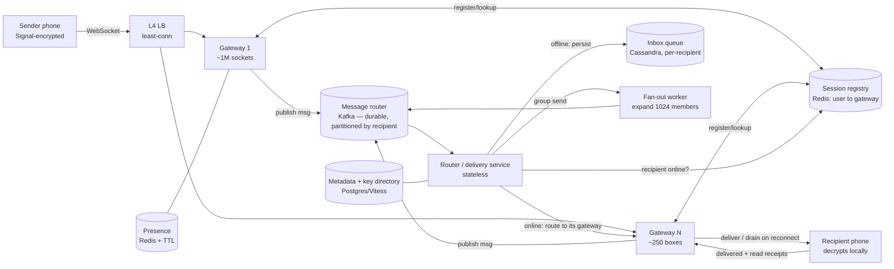

### Learning objectives
- Run the **RESHADED** spine end-to-end on a real-time messaging system, and defend each step's call against requirements, cost, and risk rather than reciting components.
- Separate the two hard sub-problems — **the persistent-connection / session layer** (mapping a user's device to the gateway holding its socket) and **the message router + per-recipient inbox** (durable delivery to an offline phone) — and explain why messaging is a **write-fan-out** problem, *unlike* a feed.
- Quantify the system in numbers a Director can stand behind: **~200M concurrent connections**, **~2.5M messages/sec** peak, **~6M deliveries/sec** after fan-out, **~12M receipt events/sec**, and the gateway fleet, storage, and bandwidth those imply.
- State precisely what **end-to-end encryption (the Signal protocol)** *buys* and what it *forbids* — no server-side content search, no server-side group fan-out of plaintext, sender-side per-device encryption — and which features survive (receipts, presence, routing on metadata).
- Identify where a Director **goes deep** (the ordering / delivery-guarantee argument, the E2E constraint) and where they **delegate a benchmark** (gateway tuning, compaction strategy), naming the trade-off each fix makes.

### Intuition first
A messaging backend is not really a database problem — it's a **switchboard** problem. Hundreds of millions of phones each hold one open line to the building (a persistent socket). The hard part is never "store the message"; a text message is 200 bytes. The hard part is: when Alice's phone hands a sealed envelope to the building addressed to Bob, **which of our 250 switchboard operators is currently holding Bob's line**, and **what do we do when Bob's line is dead** (his phone is off, on the subway, asleep)? So the system is two cooperating machines. The first is a **directory** — a constantly-changing map of "user → which operator has their socket right now" — that must be looked up millions of times a second and updated every time a phone reconnects to a different operator. The second is a **per-person mailbox**: when Bob is offline we drop the sealed envelope into Bob's mailbox, and the instant his phone reconnects, the operator drains his mailbox to him, oldest first, and only then deletes it. Two wrinkles make it WhatsApp specifically and not a toy: a **group** message is one envelope that must be copied into *many* mailboxes (fan-out), and because the envelopes are **sealed (E2E-encrypted)**, the building can route them and stamp them "delivered" but can **never open them** — which quietly kills any feature that needs to read content. Every section below is a detail of that switchboard.

Two framing notes before the spine. First, the read:write skew here is the **opposite** of a feed: in a feed one write is read thousands of times (Lesson on Twitter), so you fan out on *read*; in messaging a message is read by a handful of recipients **exactly once** and then is dead weight, so you fan out on *write* and delete after delivery. Second, the server is **deliberately dumb about content** — E2E means our cleverness has to live in routing and delivery, never in the payload.

---

## R — Requirements

The first RESHADED move is to scope hard, because "build WhatsApp" hides a dozen products (status/stories, voice/video calls, payments, channels). At Director altitude the signal is **cutting to a defensible core and saying why**, then naming the read:write and scale assumptions the rest of the design will rest on.

**Clarifying questions I'd ask the interviewer (and the answers I'll assume):**
- *1:1 only, or groups too?* → **Both**, groups capped at **1,024** members (WhatsApp's real cap). The cap matters: it bounds fan-out and lets me reject a "group = pub-sub topic with millions of subscribers" design.
- *Must we store message history server-side?* → **No** (the WhatsApp model): the server holds a message only **until delivered to all recipients**, then deletes it. This is a load-bearing decision — it turns a petabyte storage problem into a transient-queue problem. I'll contrast with the iMessage/Telegram-cloud model in Design Evolution.
- *End-to-end encryption?* → **Yes.** This is a *constraint*, not a feature, and I'll mention it explicitly because it removes whole sub-systems (server-side search, server-side group fan-out of plaintext).
- *Media (photos/video)?* → **In scope but delegated**: media goes to a **blob store + CDN** (separate problem, see Lesson 5.9 Dropbox / 5.10 YouTube); the chat path carries only a **pointer + decryption key**, not bytes. I scope the chat backend to text-sized envelopes.
- *Ordering guarantee?* → **Per-conversation FIFO** (messages within one chat arrive in send order); **no global ordering** (impossible and unnecessary).

**CUT from scope (stated out loud, with the reason):** voice/video calls (a WebRTC/SFU problem, orthogonal), status/stories (a feed problem — that's Lesson 5.4), payments, and **server-side full-text search** (E2E forbids it — search is client-side only). Cutting these is itself the signal; trying to design all of WhatsApp in 45 minutes is the red flag.

**Functional requirements (the core):**
1. Send/receive **1:1** messages in real time (sub-second when both online).
2. Send/receive **group** messages (≤ 1,024 members).
3. **Offline delivery**: a message to an offline user is delivered reliably when they reconnect.
4. **Delivery + read receipts** (the single ✓, double ✓, blue ✓✓).
5. **Presence** (online / last-seen).
6. **Ordering**: per-conversation FIFO; **exactly-once *display*** (no dupes, no gaps) from the user's perspective.

**Non-functional requirements (these drive every later decision):**
- **Latency**: p99 end-to-end delivery **< 500 ms** when both parties are online — this is the headline SLO.
- **Availability**: **≥ 99.99%** for send (a dropped message is a product-killer); the system must be **always-writable** — if a recipient is down, the sender must still succeed (decouple via a queue).
- **Durability**: an *accepted* message is **never lost** before delivery, even if a server dies mid-flight.
- **Scale / skew**: **~500M DAU**, **~100B messages/day**, **read:write ≈ 1:1** in *message* terms (each message written once, read ~once per recipient) — but **delivery-fan-out heavy** (one group send → up to 1,024 delivery writes) and **receipt-amplified** (each delivery spawns delivered + read events).

The decisive requirement is **always-writable + offline delivery**: it forces an **asynchronous, queue-backed** router (the sender does not wait for the recipient), which is the architectural fork everything else hangs off.

---

## E — Estimation

RESHADED's E step is "enough math to make a defensible call," not exhaustive arithmetic. I round hard and state assumptions; the goal is to size the **gateway fleet**, the **storage burden**, and the **bandwidth**, and to expose where the real load is (spoiler: it's **deliveries and receipts**, not sends).

**Assumptions:** 500M DAU; 100B messages/day (publicly-cited WhatsApp order of magnitude); diurnal **peak ≈ 2× average**; average message hits **~2.5 recipients** (most traffic is 1:1 = 1 recipient, leavened by groups up to 1,024); **~40%** of DAU hold a live socket at peak (phones keep the connection open even while idle — this is the number that sizes the gateway, and it's bigger than people expect); message envelope **~200 bytes** on the wire (ciphertext + headers; media is offloaded).

**Concurrent connections (sizes the gateway fleet — the crux number):**
```
500M DAU × 40% online at peak = 200M concurrent persistent connections
```

**Messages per second:**
```
100B / day ÷ 86,400 s ≈ 1.16M msgs/s average  → round to ~1.2M/s
peak (×2)                                       → ~2.5M msgs/s
```

**Deliveries per second (the real write load — fan-out counts here):**
```
2.5M sends/s × 2.5 recipients ≈ 6M deliveries/s peak
```
This is the number that matters: the inbox layer absorbs **~6M writes/s**, not 2.5M. A 1,024-member group send is *one* client request but *up to 1,024* inbox writes — fan-out is the load.

**Receipt events per second (the silent amplifier):**
```
each delivery → 1 "delivered" + 1 "read" receipt ≈ 2 events
6M deliveries/s × 2 ≈ 12M receipt events/s peak (each tiny, ~50 B)
```
Receipts **outnumber messages 2:1**. Naming this is Director signal — most candidates forget receipts are a bigger event stream than the messages themselves, and it changes the storage/throughput sizing.

**Gateway (connection) server count:**
```
A tuned epoll/WebSocket box holds ~1M concurrent sockets (a few KB/conn).
200M ÷ 1M = ~200 boxes  → run ~250–300 for headroom + failure domains.
Memory: 200M × ~10 KB/conn ≈ 2 TB of socket state across the fleet (~8–10 GB/box).
```
The gateway is **memory- and connection-bound, not CPU-bound** — that shapes the instance choice (lots of RAM + network, modest CPU).

**Storage (this is where the WhatsApp model pays off):**
```
Transient inbox only (delete on delivery). Assume ~10% of recipients offline at any moment:
  100B/day × 2.5 fan-out × 10% offline × 200 B ≈ 5 TB/day of *undelivered* buffer (full delivery basis)
  — and it drains continuously, so steady-state is a small fraction of that.
Contrast — IF we persisted history (we don't): one stored copy per authored message
  100B/day × 365 × 200 B ≈ 7.3 PB/year   (and ×2.5 ≈ 18 PB/yr if you store per-recipient).
```
That contrast is the whole argument for the delete-on-delivery model: **~5 TB/day transient vs ~7+ PB/year persisted** (one canonical copy per message; multiply by fan-out if you store per recipient). I'll revisit the persisted variant in Design Evolution because multi-device pulls in that direction.

**Bandwidth (chat path only; media is separate):**
```
Inbound  sends:      2.5M/s × 200 B × 8 ≈ 4 Gbps
Outbound deliveries: 6M/s   × 200 B × 8 ≈ 9.6 Gbps
```
A few tens of Gbps for the entire text path — **trivial** compared to the media/CDN tier. This confirms the right instinct: the chat backend is a **connection-management and routing** problem, not a bandwidth or storage problem. Media bytes never touch it.

**The one-line takeaway from estimation:** size the system for **200M sockets** and **~6M deliveries + ~12M receipts per second**, not for "1.2M messages/sec" — fan-out and receipts are 4–10× the headline number, and that reframing is the point of the E step.

---

## S — Storage

The S step is to name *what must persist*, match each kind of data to a **store type by access pattern**, and name real systems — justifying each against its rejected alternative. There are four distinct data shapes here, and conflating them into one database is a classic mistake.

**1. The undelivered message queue (per-recipient inbox).** Access pattern: **enormous write rate (~6M/s), append-only, read-once-then-delete, keyed by recipient, ordered.** This is the textbook **write-heavy, LSM-shaped** workload from the indexing lesson.
- **Choice: a wide-column LSM store — Cassandra (or ScyllaDB / HBase).** Partition key = `user_id` (or `device_id`), clustering key = message sequence/timestamp, so a recipient's pending messages are one ordered partition you can range-scan on reconnect and then tombstone. Cassandra's append-optimized writes and linear write scaling fit 6M writes/s.
- **Rejected — Postgres / a B-tree relational store:** in-place random-I/O writes and a single-leader write bottleneck cannot absorb 6M writes/s of churning, short-lived rows; we don't need joins or transactions on this data. *Trade-off accepted:* we give up rich querying and ACID we don't need, and we **inherit tombstone/compaction pressure** (see Evaluation) — a real operational tax, but the right one.
- **Note on the WhatsApp reality:** WhatsApp famously buffers undelivered messages in **Mnesia (Erlang's distributed store) in RAM** and deletes on delivery — i.e. an in-memory queue, because messages are so short-lived. Cassandra is the more portable, interview-standard answer; I'd name both and say the choice hinges on **how long undelivered messages must survive** (RAM if minutes, Cassandra if up-to-30-days offline retention is required).

**2. The connection/session registry (user → gateway).** Access pattern: **read on every single message (millions/s), written on every connect/disconnect, tiny values, must be fast and expendable** (rebuildable from reconnections).
- **Choice: an in-memory store — Redis** (a cluster), mapping `user_id/device_id → {gateway_id, conn_id, last_seen}`, with a **TTL/heartbeat** so dead entries self-expire.
- **Rejected — putting this in Cassandra/Postgres:** a disk-backed store adds latency to the hottest lookup in the system (it's on the critical path of every delivery) and persistence is *pointless* — if a gateway dies, its sessions are gone anyway and clients reconnect. *Trade-off:* Redis can lose the table on failure, but that's **acceptable and even correct** here — the source of truth is the live TCP connections, not the registry.

**3. User/group metadata (profiles, group membership, keys directory).** Access pattern: **read-heavy, strongly-consistent-ish, relational (who is in which group), modest volume.**
- **Choice: a relational store — PostgreSQL / MySQL (sharded by `user_id`/`group_id`)**, or a managed equivalent (Spanner/Vitess at this scale). Group membership and the **public-key / prekey directory** (for E2E) live here.
- **Rejected — a single global SQL instance:** won't hold 2B users' metadata; shard it. *Rejected — a KV store for membership:* group membership is genuinely relational (joins, "all groups for user X", "all members of group Y") and benefits from secondary indexes.

**4. Receipts & presence.** Receipts are a **firehose of tiny, ephemeral events** (~12M/s); presence is **last-seen timestamps with heavy churn**.
- **Choice: Redis for live presence** (key per user, short TTL, updated on heartbeat) and **Cassandra (or just the inbox path) for receipt delivery** — receipts are themselves small messages routed through the same router back to the sender. *Rejected — persisting every receipt forever in SQL:* the volume (12M/s) and the throwaway nature make a relational store the wrong tool.

The Director framing: **four data shapes, four stores, each justified by its access pattern** — and a willingness to say "the session registry is *meant* to be losable" is stronger signal than forcing everything into one database for tidiness.

---

## H — High-level design

The H step is a component diagram plus the happy-path narration. The architecture splits cleanly into the **connection layer** (stateful, holds sockets) and the **logic layer** (stateless services + the router + the stores), deliberately decoupled by a **message queue** so a send never waits on a recipient.



**Happy path — Alice messages Bob (both online):**
1. Alice's phone has a live **WebSocket** to **Gateway 7** (established at app open via the L4 load balancer; the gateway wrote `alice → gw7` into the **Redis session registry** with a heartbeat TTL).
2. Alice's client **encrypts** the message for Bob's device (Signal protocol — see the D and Evaluation steps), then **publishes the sealed envelope** over its socket to gw7.
3. gw7 does **not** deliver directly. It **publishes to the message router (Kafka)**, partitioned by **recipient `user_id`**, and immediately **acks Alice** (the single ✓ — "sent to server"). *This ack-then-route is what makes the system always-writable*: Alice's send succeeds in ~tens of ms regardless of Bob's state.
4. The **router/delivery service** (stateless, consuming Kafka) looks up Bob in the **session registry**: **Bob is online on gw12**.
5. The router **forwards the envelope to gw12**, which **pushes it down Bob's socket**. Bob's phone **decrypts locally** and displays it.
6. Bob's phone emits a **delivered receipt** → back through gw12 → router → Alice's gw7 → Alice (the second ✓). When Bob opens the chat, a **read receipt** flows the same way (the blue ✓✓).

**Offline path — Bob is not connected:**
- At step 4 the registry shows **no live session** for Bob. The router **writes the envelope into Bob's inbox partition in Cassandra** (durably queued).
- When Bob's phone reconnects (to any gateway), the gateway **registers** him in Redis and **drains his Cassandra inbox** in order, pushing each message; on confirmed delivery it **tombstones** them. Bob's send/receive resumes; receipts now flow back to Alice.

**Group path — Alice messages a 500-member group:**
- Because of **E2E**, the server cannot create one plaintext copy and fan it out as plaintext. The client **encrypts once per recipient device** (Sender Keys optimization, below) and the **fan-out worker expands the group** into up to 500 routing jobs back onto Kafka; each is then delivered exactly like a 1:1 message (online → push, offline → Cassandra inbox). The 1,024 cap bounds this fan-out.

The two design choices that define this diagram: **(a)** the gateway layer is the *only* stateful, sticky tier and everything behind it is stateless and horizontally scalable; **(b)** the **Kafka router decouples send from deliver**, giving durability + always-writable + back-pressure for free (the queue absorbs delivery spikes).

---

## A — API design

The A step nails the interface. Messaging is **bidirectional and push**, so the core API is **not REST** — it's a small set of **WebSocket frames** (a persistent connection), with a thin REST/HTTPS surface only for things that aren't real-time (auth, key upload, group admin, media URLs).

**Connection (persistent, WebSocket over TLS):**
```
WS  CONNECT  wss://chat.example.com         # upgrade; auth token in header
              -> server registers {device_id → gateway} in Redis, starts heartbeat
PING / PONG  (every ~30s)                    # keepalive + presence; missed → mark offline
```

**Real-time frames (over the open socket — the hot path):**
```
SEND      { client_msg_id, conversation_id, recipient_device_ids[],
            ciphertext, type:"text|media_ptr", ts }
            -> server replies ACK { client_msg_id, server_msg_id, status:"SENT" }   // single ✓
DELIVER   { server_msg_id, sender_id, conversation_id, ciphertext, ts }             // server → recipient
RECEIPT   { server_msg_id, kind:"DELIVERED|READ", by_device_id, ts }               // both directions  // ✓✓ / blue
TYPING    { conversation_id, state:"start|stop" }                                   // ephemeral, not stored
PRESENCE  { user_id, state:"online|offline", last_seen }                            // subscribed per-contact
```

**Why a `client_msg_id` is on every SEND (Director-grade detail):** the network is at-least-once; a flaky connection causes the client to **resend**. The server **dedupes on `(sender, client_msg_id)`** so a retried send isn't delivered twice — this is the **idempotency key** that turns at-least-once transport into **exactly-once display**. Calling this out is strong signal; omitting it is the classic duplicate-message bug.

**Thin REST/HTTPS surface (not latency-critical):**
```
POST /v1/auth/register            # phone number → account, device registration
POST /v1/keys/upload              # upload identity key + signed prekey + one-time prekeys (E2E)
GET  /v1/keys/{user_id}           # fetch a recipient's prekey bundle to start a session
POST /v1/groups                   # create group
POST /v1/groups/{id}/members      # add/remove (admin)
GET  /v1/media/upload-url         # presigned blob-store URL; bytes go to CDN, not the chat path
```

The interface decision in one line: **WebSocket frames for the real-time bidirectional path** (chosen over REST request/response, which cannot *push* and would force the client to poll), and a **minimal REST tier for setup/admin** where request/response is the natural fit. Rejected alternative — **REST polling for new messages** (e.g. `GET /messages?since=...` on a timer): it adds latency (poll interval), wastes the server with empty polls at 200M-client scale, and breaks the < 500 ms SLO; push is mandatory.

---

## D — Data model

The D step pins schemas, **keys, indexes, and the partition/shard key**, and says **where each table lives**. The partition keys are the most important decisions here — they determine whether the system has hot spots.

**Inbox / message queue — Cassandra (LSM wide-column):**
```
TABLE inbox (
  recipient_id   uuid,          -- PARTITION KEY  → all of a user's pending msgs co-located, drained on reconnect
  bucket         int,           -- optional sub-partition (e.g. day) to bound partition size
  msg_seq        timeuuid,      -- CLUSTERING KEY (DESC) → per-recipient FIFO ordering for free
  sender_id      uuid,
  conversation_id uuid,
  ciphertext     blob,          -- server NEVER decrypts (E2E)
  created_at     timestamp,
  PRIMARY KEY ((recipient_id, bucket), msg_seq)
)  -- delete (tombstone) on confirmed delivery
```
**Shard/partition key = `recipient_id`** (the read pattern is always "give me *this user's* pending messages"). Clustering by `msg_seq` gives ordered drain. *Why not `conversation_id` as the partition key?* — because delivery is **per recipient**, and partitioning by conversation would scatter a user's pending messages across many partitions and create a **hot partition for a busy group** (1,024 members writing to one partition). Partitioning by recipient spreads load evenly. This is the pivotal data-model trade-off.

**Session registry — Redis (in-memory KV):**
```
KEY   conn:{device_id}  →  HASH { gateway_id, conn_id, last_seen }   TTL ~60s (heartbeat-refreshed)
KEY   user:{user_id}    →  SET of device_ids   (multi-device fan-out)
```
**Key = `device_id`** (not `user_id`), because a user has **multiple devices** and each holds its own socket; delivery fans out to all of a user's online devices. Sharded by key across the Redis cluster.

**Messages-on-the-wire / sequencing.** Per-conversation FIFO is enforced with a **per-conversation monotonic sequence number** the client attaches; the recipient orders by it and detects gaps. Globally we rely on **partition-local ordering in Kafka** (partition by `recipient_id`) so a single recipient's deliveries don't reorder. *No global sequencer* — rejected because it's an unnecessary single bottleneck (see the Sequencer building block, Lesson 3.6); per-conversation ordering is all the product needs.

**Group metadata — Postgres/Vitess (relational, sharded):**
```
TABLE groups        ( group_id PK, name_enc, created_by, member_count, ... )       -- shard by group_id
TABLE group_members ( group_id, user_id, role, joined_at,
                      PRIMARY KEY (group_id, user_id),
                      INDEX (user_id) )   -- index supports "all groups for user X"
TABLE key_directory ( user_id, device_id, identity_key, signed_prekey,
                      one_time_prekeys[], PRIMARY KEY (user_id, device_id) )        -- shard by user_id
```
**Shard key = `group_id`** for the group tables (membership reads/writes are group-scoped), with a **secondary index on `user_id`** for the "my groups" query. The **key directory** (E2E public keys/prekeys) is shard-by-`user_id` and is the *one* thing the server stores in plaintext that enables encryption — public keys are public by design.

**Where data lives, summarized:** transient ciphertext → **Cassandra** (or RAM); who's-connected → **Redis**; who's-in-which-group + public keys → **Postgres/Vitess**; live presence → **Redis**. Receipts ride the **message path** (they're just small messages), not a separate persisted table.

---

## E — Evaluation

The second E step is where a Director earns the round: **stress your own design against the NFRs, find the bottlenecks — hot keys, single points, tail latency, write/space amplification — and fix each, naming the trade-off the fix makes.** I'll walk the failure list.

**Bottleneck 1 — the session registry is on every message's critical path (hot dependency).**
Every delivery does a Redis lookup; at 6M deliveries/s that's 6M+ lookups/s, and if Redis stalls, *all* delivery stalls.
- **Fix:** shard the Redis registry by `device_id` (spreads the 6M/s across the cluster); **co-locate** the router consumers with the registry shards; cache the *sender's own* contact→gateway hints at the gateway. *Trade-off:* more moving parts and a cache that can be **briefly stale** (a recipient who just migrated gateways may get one mis-routed message, which the router retries on the registry miss) — we accept rare extra hops to keep the common case at one fast in-memory read.

**Bottleneck 2 — gateway failure drops ~1M live sockets at once (blast radius / single point at the box level).**
If gw7 dies, ~1M users disconnect simultaneously and stampede to reconnect.
- **Fix:** clients **auto-reconnect with jittered backoff** (avoid a thundering herd onto the LB); sessions in Redis **self-expire by TTL** so stale entries clear; in-flight messages are **safe in Kafka** (already published) and undelivered ones are in **Cassandra** — *nothing accepted is lost*. *Trade-off:* affected users see a sub-second reconnect blip; we pay for resilience with a small reconnect storm we tame with jitter rather than trying to make gateways never fail.

**Bottleneck 3 — the group "hot fan-out" (write amplification on big/busy groups).**
A 1,024-member group with active chatter turns each send into 1,024 inbox writes + up to 1,024 receipt streams back — a write- and receipt-amplification spike, and naive **per-recipient encryption is O(N) crypto on the sender** every message.
- **Fix (crypto):** the **Sender Keys** optimization (Signal's group mechanism) — each sender distributes *one* symmetric **sender key** to the group once (via N pairwise-encrypted messages), then encrypts each subsequent message **once** with that key; members decrypt with the shared sender key. This turns per-message cost from **O(N) to O(1)** encryptions, with an O(N) re-key only when membership changes. *Trade-off:* membership changes (someone leaves) force a **sender-key rotation** (you don't want the departed member reading new messages), so churny groups pay re-key cost — acceptable because membership changes are far rarer than messages.
- **Fix (fan-out):** dedicated **fan-out workers** expand the group asynchronously and **back-pressure through Kafka** so a 1,024-blast is absorbed as queue depth, not a synchronous stall. *Trade-off:* large groups have **slightly higher delivery latency** (queue drain) than 1:1 — acceptable and invisible at human scale.

**Bottleneck 4 — Cassandra tombstone / compaction pressure (space + read amplification, the LSM tax).**
Delete-on-delivery means we write a row and immediately tombstone it; **tombstones accumulate** and can slow the range-scan that drains an inbox (the exact LSM read-amplification problem from the indexing lesson).
- **Fix:** **bucket partitions by time** and **TTL** whole buckets (drop, don't tombstone row-by-row); tune **leveled compaction** for the read-heavy drain; for very-short-lived messages, keep the queue in **RAM (Mnesia/Redis)** and only spill long-offline users to Cassandra. *Trade-off:* leveled compaction adds **write amplification** (CPU/IO) to reduce read amplification on drain — we spend background compute to keep the reconnect-drain fast, and we capacity-plan that compaction as a first-class cost (Directors own that on-call budget).

**Bottleneck 5 — tail latency under load + the always-on connection cost.**
p99 < 500 ms can blow out if a gateway is overloaded or a Kafka partition lags.
- **Fix:** size gateways for **headroom** (run at ~60% socket capacity so a failover-induced surge fits); **partition Kafka** finely enough that no single partition is a bottleneck; shed/queue receipts (the 12M/s firehose) at lower priority than messages so receipts never starve message delivery. *Trade-off:* running gateways at 60% means **more boxes** (cost) to protect tail latency — a deliberate cost-for-latency trade a Director signs off on.

**Re-check against the NFRs:** always-writable ✓ (ack-then-route via Kafka); durability ✓ (Kafka + Cassandra hold accepted messages through any single failure); p99 < 500 ms ✓ (one in-memory registry hop + push, headroom-protected); 99.99% ✓ (stateless logic tier + TTL-self-healing registry + auto-reconnect). The design survives its own stress test; the residual costs (compaction, reconnect storms, group re-keys, 60%-loaded gateways) are **named and priced**, which is the point of the E step.

---

## D — Design evolution

The final D step is forward-looking: **how it scales at 10×, the hardest trade-offs, what I'd revisit, and where I'd delegate a deep-dive** — the explicit Director move of going deep where the decision turns on it and credibly handing off the rest.

**Scaling to 10× (5B DAU / ~25M msgs/s territory):**
- **Gateways scale linearly** (just add boxes; the layer is shared-nothing) — but the **session registry and Kafka partition count** become the limits. I'd **regionalize**: pin users to a home region, run a registry + router per region, and route cross-region messages over a backbone — turning one global 6M/s lookup problem into N smaller local ones. *Trade-off:* cross-region messages take an extra hop (a few tens of ms); acceptable since most chats are intra-region.
- **Receipts (the 12M/s → 120M/s firehose) become the dominant load.** I'd **batch and coalesce** receipts (one "delivered up to seq N" instead of N individual receipts) and consider making read receipts **best-effort** (the product already lets users disable them). *Trade-off:* coarser receipt granularity for an order-of-magnitude throughput win.

**The hardest trade-offs (where I'd spend whiteboard time):**
1. **E2E encryption vs. features and ops.** E2E (Signal) is non-negotiable for the product, and it **forbids**: server-side search (must be client-side), server-side spam/abuse content scanning (must rely on metadata + reporting), server-side group fan-out of plaintext (forces Sender Keys), and **easy multi-device** (every device is a separate crypto identity). This is the deepest constraint in the system and I'd state it explicitly: *we trade away a class of server-side intelligence for a privacy guarantee, and we accept harder multi-device and abuse-handling as the cost.* The rejected alternative — **transport encryption only (TLS, server sees plaintext)** — would re-enable search/scanning/simple fan-out but is off the table for a privacy-first product; naming *why* you're giving those up is the signal.
2. **Delete-on-delivery vs. cloud history (multi-device).** WhatsApp's no-server-history model is cheap (5 TB/day transient vs ~7 PB/yr persisted) but makes **multi-device + new-device history** painful — a new device can't fetch the past from the server because the server threw it away. iMessage/Telegram chose **server-side (E2E-)encrypted cloud history**, paying the petabyte storage cost for seamless multi-device. *I'd revisit this* the moment "full history on a new device" becomes a hard requirement: move to **encrypted server-side history** (encrypted blobs the server stores but can't read), accepting the storage bill and key-management complexity.
3. **Ordering guarantee.** Per-conversation FIFO via per-conversation sequence + recipient-side ordering is enough and avoids a global sequencer. The rejected alternative — a **global ordering service** — is a needless single bottleneck; I'd only revisit if a feature genuinely needed cross-conversation total order (none does).

**Where I'd delegate a deep-dive (explicit Director hand-offs):**
- *"Have the infra team benchmark **gateway connection density** — Erlang/BEAM (WhatsApp's actual choice) vs a Go/Rust epoll server — for sockets-per-box and failover time; my prior is the BEAM stack for its per-connection lightweight-process model, but I want the number."*
- *"Have storage **benchmark Cassandra leveled vs size-tiered compaction** against our real tombstone churn, and evaluate keeping the hot queue in RAM (Mnesia/Redis) with Cassandra only as offline-spill — I want the p99 drain latency and the compaction CPU cost before we commit."*
- *"Have the security team own the **Signal protocol integration and key-directory** (prekey management, multi-device session setup) — this is specialist crypto; my job is to ensure the architecture *routes* sealed envelopes and never assumes it can read them."*

That triad — **go deep on the E2E constraint and the ordering/delivery argument, delegate the gateway-tuning and compaction benchmarks with a stated prior** — is exactly the altitude the round is scoring.

---

## Trade-offs table — the pivotal decisions

| Decision | Option A | Option B | Option C | Use when… |
|---|---|---|---|---|
| **Client transport** | **WebSocket** (persistent, bidi push) ✅ | HTTP long-poll | MQTT | **WebSocket** for general real-time bidi at scale; **MQTT** when clients are battery/bandwidth-constrained IoT-style (lighter framing); **long-poll** only as a firewall-traversal fallback. Reject SSE (unidirectional). |
| **Delivery model** | **Write-fan-out to per-recipient inbox** (push) ✅ | Read-fan-out / shared timeline (pull) | Synchronous direct delivery | **Write-fan-out** here — small bounded fan-out (≤1,024), read-once, must reach offline users. **Read-fan-out** is for feeds (huge fan-out, read-many). **Synchronous** breaks always-writable. |
| **Undelivered store** | **Cassandra** (LSM, durable, 30-day offline) ✅ | In-RAM (Mnesia/Redis) | Postgres | **Cassandra** for durable, long-offline retention at 6M writes/s. **RAM** when messages are minutes-lived (cheapest, WhatsApp's real choice). **Postgres** rejected — can't absorb the churn, ACID unneeded. |
| **Encryption** | **E2E (Signal)** ✅ | Transport-only (TLS) | None | **E2E** for a privacy product — accept loss of server-side search/scan/fan-out. **TLS-only** if server-side content features are required and trust model allows. |

---

## What interviewers probe here

At Director altitude the probes are about **trade-off articulation, cost ownership, and delegation** — not whether you can recite the WebSocket handshake.

- **"How does the server route a message to the right machine when the recipient could be on any of 250 gateways?"** — *Strong signal:* names a **session registry (Redis) mapping device→gateway**, refreshed by heartbeat with a TTL, looked up by the router on the delivery path; notes it's the system's hottest dependency and shards/co-locates it. *Red flag:* "the load balancer figures it out" or broadcasting every message to all gateways.
- **"Walk me through delivery to an offline user."** — *Strong:* ack-then-route (always-writable), registry miss → **durable per-recipient inbox in Cassandra**, drain-and-tombstone on reconnect, exactly-once *display* via `client_msg_id` dedupe. *Red flag:* losing messages when the recipient is down, or assuming the recipient is always connected.
- **"What does end-to-end encryption *stop you* from building, and what's the cost?"** — *Strong:* no server-side search/spam-scanning/plaintext group fan-out; forces **Sender Keys** and makes **multi-device** hard; states it as a deliberate privacy-for-intelligence trade. *Red flag:* claiming you'll "search messages server-side" or "scan for spam content" with E2E on — a contradiction that signals not understanding the constraint.
- **"Your group-message cost is exploding. Where, and what do you do?"** — *Strong:* identifies **write + receipt amplification (O(N) per send)** and **O(N) per-message crypto**, fixes with **Sender Keys (O(1) crypto)** + async fan-out workers + receipt coalescing, naming the re-key trade-off. *Red flag:* unaware fan-out is the load, or quoting "messages/sec" without the fan-out multiplier.
- **"What would you *not* build yourself, and what's your prior?"** — *Strong:* delegates **Signal integration** to security, **gateway density** and **compaction strategy** to infra/storage with a stated prior and a benchmark to settle it. *Red flag:* claiming to personally tune compaction/B-tree fanout (too deep, wrong altitude) — or hand-waving "it scales" (too high).

---

## Common mistakes

- **Sizing for "messages/sec" and forgetting fan-out + receipts.** The real load is **~6M deliveries/s and ~12M receipts/s**, 4–10× the 1.2M-msg/s headline. Quoting only the send rate undersizes everything.
- **Synchronous delivery (sender waits for recipient).** Breaks always-writable and 99.99%; the **Kafka decouple + ack-then-route** is the fix. A message to an offline user must still succeed instantly.
- **Persisting all history by default.** WhatsApp **deletes on delivery** (5 TB/day transient vs ~7 PB/yr persisted). Assuming a giant message store is the wrong model unless multi-device cloud history is an explicit requirement.
- **Claiming server-side search/spam-scanning with E2E on.** A direct contradiction — the server can't read ciphertext. Search is client-side; abuse handling is metadata + user-reports.
- **Partitioning the inbox by `conversation_id`.** Creates a **hot partition** for big/busy groups; partition by **`recipient_id`** so load spreads and a user's drain is one ordered scan.
- **Treating the session registry as durable/critical state.** It's *meant* to be losable — the source of truth is the live socket; rebuild it from reconnections, expire it by TTL.
- **No idempotency key.** Without `client_msg_id` dedupe, at-least-once transport delivers duplicates on every flaky-network resend.
- **Group = pub-sub topic with millions of subscribers.** The **1,024 cap** bounds fan-out deliberately; designing for unbounded group size is solving a problem the product doesn't have (that's the channels/broadcast problem, a different lesson).

---

## Interviewer follow-up questions (with model answers)

**Q1. Both users are online — trace the message and every receipt, and give me the latency budget.**
> *Model:* Alice's client encrypts for Bob (Signal) and sends over her WebSocket to her gateway, which **publishes to Kafka and acks Alice immediately** (single ✓, ~tens of ms — this ack is what keeps us always-writable). The router consumes, **looks Bob up in the Redis registry** (one in-memory hop, sub-ms), finds him on gw12, forwards, and gw12 **pushes down Bob's socket**; Bob decrypts locally and renders. Bob's phone emits a **delivered receipt** (✓✓) that flows back gw12→router→Alice's gateway→Alice; on chat-open a **read receipt** (blue) follows the same path. Budget: client→gateway ~50 ms, registry lookup <5 ms, router→gateway→recipient ~50 ms — comfortably inside **p99 < 500 ms**, with headroom for a Kafka hop. The receipts are just small messages on the same rails.

**Q2. WhatsApp is end-to-end encrypted. How do you do *group* fan-out if the server can't read the message, and how do you keep it from being O(N) crypto per message?**
> *Model:* The server never sees plaintext, so it can't make one copy and broadcast it — encryption is the client's job. Naively the sender encrypts the message **once per recipient device** (pairwise Signal sessions) = **O(N) encryptions per message**, which is brutal for a 1,024-member group. The fix is **Sender Keys**: the sender generates one symmetric **sender key**, distributes it **once** to all members via N pairwise-encrypted control messages, then encrypts each subsequent message **once** with that key (**O(1)**); members decrypt with the shared sender key. The server's role is pure routing — a **fan-out worker** expands the group into per-recipient delivery jobs on Kafka, each delivered like a 1:1 message. *Trade-off:* when a member leaves you must **rotate the sender key** (so they can't read new messages) — an O(N) re-key, but membership changes are far rarer than messages, so amortized cost stays low.

**Q3. A gateway holding ~1M connections crashes. What happens to those users and to in-flight messages?**
> *Model:* Three things, all bounded. (1) **The ~1M sockets drop**; clients **auto-reconnect with jittered exponential backoff** to avoid a thundering herd on the LB, landing on other gateways. (2) **Their registry entries self-expire** by heartbeat TTL, so the router stops trying to route to the dead box; new sessions register on reconnect. (3) **No accepted message is lost** — anything published is durably in **Kafka**, anything undelivered is in the **Cassandra inbox**, so on reconnect each user **drains their inbox in order**. Net user impact is a **sub-second reconnect blip**. The design choice that makes this safe is that the gateway is the *only* stateful tier and it holds **no source-of-truth state** — sockets are reconstructible, messages live in durable stores behind it. *Cost note:* this is why I run gateways at ~60% capacity — so a failover surge fits without cascading.

**Q4. Product wants full chat history to appear instantly on a newly-added device. Your current design deletes messages on delivery. What changes, and what does it cost?**
> *Model:* My current model can't satisfy this — the server **threw the history away** after delivery, which is exactly what made storage cheap (5 TB/day transient vs ~7 PB/yr persisted). To support new-device history I move to **server-side encrypted history**: the server stores messages as **E2E-encrypted blobs it cannot read** (encrypted to a key the user's devices share, e.g. backed by an encrypted key-backup), and a new device fetches and decrypts them. Costs I'd name: (a) the **petabyte-scale storage bill** I was avoiding, now real and growing; (b) **key management** — securely getting the history-decryption key to the *new* device without the server learning it (this is the genuinely hard part — encrypted backups with a user PIN/HSM, the model iMessage/Telegram use); (c) **retention/compliance** policy I now have to own. I'd take this trade only when multi-device-with-history is a hard product requirement, and I'd **delegate the key-backup crypto design to the security team** with the architecture guaranteeing the server stores opaque blobs.

**Q5. How do presence and "last seen" scale, given they change constantly for hundreds of millions of users?**
> *Model:* Presence is **high-churn, ephemeral, and best-effort** — perfect for **Redis with a short TTL** keyed per user, refreshed by the **same heartbeat** that maintains the connection (so presence is almost free — it's a side effect of the keepalive). "Online" = a live registry entry; "offline/last-seen" = entry expired, timestamp recorded. The scaling trick is **don't push every presence change to every contact** — that's an N² fan-out storm. Instead, **subscribe lazily**: a client only gets presence for the contacts in its **currently-open chat list**, and we **coalesce** updates (debounce flapping). *Trade-off:* presence can be **slightly stale** (a few seconds), which is completely acceptable for a "last seen" feature and saves an enormous fan-out. If we naively broadcast every online/offline transition to all contacts of all 500M users, presence alone would dwarf the message load — so I treat it as best-effort, TTL-driven, and pull-on-interest.

---

## Key takeaways
- **Messaging is a switchboard, not a database**: the two hard sub-problems are the **session registry** (device→gateway, in Redis, the hottest lookup) and the **durable per-recipient inbox** (Cassandra/RAM) for offline delivery — sized for **200M sockets** and **~6M deliveries + ~12M receipts/s**, not the 1.2M-msg/s headline.
- **Fan out on *write*, delete on delivery** — the inverse of a feed. Small bounded fan-out (≤1,024) read once then tombstoned keeps storage at **~5 TB/day transient** instead of **~7 PB/yr persisted**; rejected the read-fan-out/shared-timeline model that suits feeds.
- **Decouple send from deliver with a durable queue (Kafka) and ack-then-route** — that single move delivers **always-writable + durability + offline buffering**, and a `client_msg_id` idempotency key turns at-least-once transport into **exactly-once display**.
- **E2E encryption is the defining constraint, not a feature**: it forbids server-side search, content spam-scanning, and plaintext group fan-out (forcing **Sender Keys**, O(N)→O(1) crypto), and makes multi-device hard — a deliberate **privacy-for-server-intelligence** trade you must name.
- **Director altitude = go deep on the E2E constraint and the ordering/delivery-guarantee argument; delegate** gateway connection-density and Cassandra compaction-strategy benchmarks with a stated prior — and always quote the **fan-out-multiplied** numbers, never the bare send rate.

> **Spaced-repetition recap:** Switchboard, not a database. Registry (Redis: device→gateway, hottest read) + per-recipient inbox (Cassandra/RAM: durable offline queue, delete on delivery). **Ack-then-route via Kafka** = always-writable + durable + offline buffering; `client_msg_id` dedupe = exactly-once display. **Fan out on write** (≤1,024, read-once), not on read. Size for **200M sockets, ~6M deliveries/s, ~12M receipts/s** — fan-out and receipts dominate. **E2E (Signal)** kills server-side search/scan/plaintext-fan-out → **Sender Keys** for O(1) group crypto; it's a privacy-for-intelligence trade. Go deep on E2E + ordering; delegate gateway tuning + compaction.
