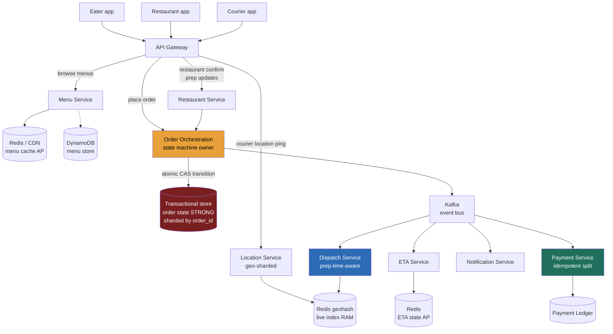
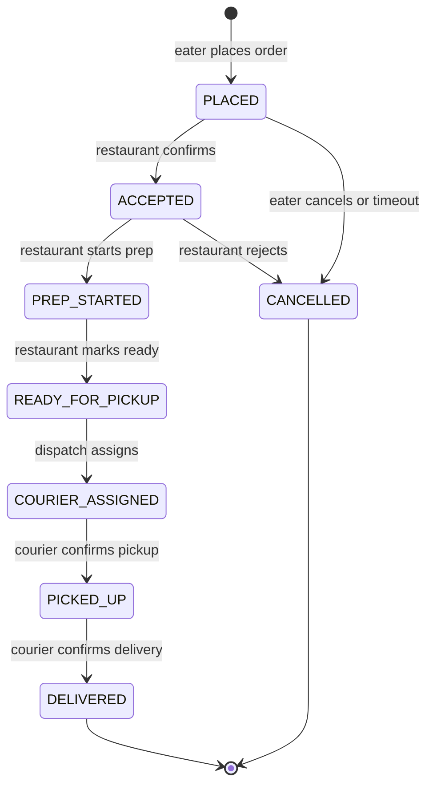

> **Why this gets asked at DoorDash, Uber, Grab, and Instacart, and what separates a Director answer.** This is not a proximity problem (that's the proximity-matching problem); it's a *marketplace coordination* problem with three actors whose incentives conflict, a restaurant-prep waiting period that makes naive dispatch wrong, a payment flow that must split a single charge across three parties, and a 5-10× intraday peak that the system must absorb without over-provisioning for. The IC answer draws a "place order → dispatch courier" flow and calls it done. The Director answer identifies the **order state machine** as the correctness core, draws service boundaries on **actor boundaries** (which also maps to org topology), names where eventual consistency is safe (menus, ETAs) and where it is not (order state, payment), and quantifies the fleet-sizing problem the peak creates.

### Learning objectives
- Run the full **RESHADED** spine on a three-sided marketplace; adapt H/D to decompose services by **actor boundary** and explain why that mirrors the team topology.
- Model the **order state machine** as the correctness core, define valid transitions, identify the transitions that must be atomic, and distinguish the states where eventual consistency is acceptable.
- Quantify the **5-10× lunch/dinner peak**, size the courier fleet, and pick a dispatch strategy that balances delivery time, courier fairness, and cost, stating what you are giving up in each trade.
- Know where **the payment-split** adds complexity beyond a standard charge (see the payment platform) and delegate the PCI surface.
- Draw the **strong/eventual boundary** explicitly: menus and ETAs are hints; order state and payment are the invariant.

### Intuition first

Think of a short-order diner with three parties who must all show up at the same moment: the customer who ordered, the cook who has to make the food, and the delivery person who has to carry it. If the delivery person arrives while the cook is still chopping onions, the driver idles and the food goes cold. If the driver arrives ten minutes after the food is ready, the food goes cold anyway. The whole system's quality hinges on *timing coordination*, and the kitchen's prep time is the hardest variable because it is noisy, restaurant-dependent, and unknown until the cook actually starts. That coordination is the state machine. Every order moves through a sequence of gates, placed, restaurant-accepted, prep started, ready for pickup, picked up, en route, delivered, and the hard design question is: which transitions must the system enforce atomically, which services observe vs. own state, and how do you get a courier to the restaurant at *exactly* the moment the food is ready rather than ten minutes early or ten minutes late?

That timing problem is what distinguishes this question from proximity matching. Uber's core problem is a write firehose and a nearby query. DoorDash's core problem is coordinating three actors across an unpredictable restaurant-prep wait, at a demand spike that arrives twice a day on a clock you can predict.

---

## R: Requirements

> **RESHADED step 1:** Scope the three-sided marketplace to a defensible core, draw the actor boundaries out loud, and state the non-functional invariants before the design.

**Clarifying questions I'd ask (with assumed answers):**

- *Three-sided or two-sided?* → **Three-sided:** eater, restaurant partner, courier. Restaurant prep time is the distinguishing variable that makes naive dispatch wrong.
- *What's the delivery SLA?* → Best-effort; **30-45 min end-to-end** is the UX bar. The NFR is customer-visible ETA accuracy, not a hard SLA.
- *Is payment a split?* → Yes, a single eater charge must fan out to restaurant payment (food cost), courier payment (delivery fee), and platform fee. See the payment platform for the ledger design; scope here to the split trigger and idempotency.
- *Scale?* → **~5M orders/day** globally (reasonable DoorDash/Uber Eats proxy), heavy concentration in US metros, 5-10× peak vs. off-peak.
- *Consistency bar on menus vs. orders?* → **Menus: eventual** (a stale price by a few minutes is a minor UX issue, handled by re-pricing at checkout). **Order state: strong**, a courier and a restaurant must never observe the same order in contradictory states.

**Functional requirements (scoped core):**

1. Eater browses restaurants and menus, places an order, tracks delivery status.
2. Restaurant receives the order, confirms acceptance, marks food ready.
3. System dispatches a courier to the restaurant at the right time (not when the order is placed).
4. Courier navigates to restaurant for pickup, navigates to eater for delivery, marks each milestone.
5. System charges the eater, splits payment to restaurant and courier (see the payment platform for the ledger; scope here to the trigger + idempotency key).
6. ETA is continuously updated as prep and delivery progress.

**Explicitly CUT:** restaurant onboarding, menu ingestion pipelines, surge pricing, promotional discounts, loyalty/rewards, ratings, refunds UX, driver onboarding/background check, map rendering. I scope to **browse → order → dispatch → delivery → payment trigger** and say so.

**Non-functional requirements:**

- **Order state: strong consistency / CP**, the state machine transition `PLACED → ACCEPTED` must not fork; a courier must not be dispatched to an already-cancelled order.
- **Menus and ETAs: eventual**, staleness of 30-120 s is invisible to users; these must not be served from the order-state store.
- **Dispatch latency: < 5 s** from restaurant-accepted to courier-notified; this is on the critical user-visible path.
- **Peak tolerance: 5-10× lunch (12-2 pm) and dinner (6-9 pm)** intraday spikes; infrastructure must scale to peak without over-provisioning the trough by 10×.
- **Payment idempotency:** the charge-and-split must be exactly-once even on retry/timeout.

---

## E: Estimation

> **RESHADED step 2:** Quantify the trough and the peak, derive fleet sizing, and name what the peak math decides architecturally.

**Assumptions:** 5M orders/day, avg order value ~$35, avg delivery time ~35 min, avg restaurant prep ~18 min, courier active-session ping every 5 s.

**Steady-state order QPS:**
`5M ÷ 86,400 ≈ 58 orders/s` average. Lunch/dinner peak at 8× average → **~460 orders/s peak**. Write-contended but not extreme; a sharded transactional store handles this easily.

**Order state events (the write amplification the state machine creates):**
Each order generates ~8 state transitions (placed, accepted, prep-started, ready, courier-assigned, picked-up, en-route, delivered). Peak: `460 × 8 ≈ 3,700 state events/s`. These must be durable and sequenced; Kafka absorbs the fan-out.

**Courier location ingest (the write firehose):**
~500K active couriers globally, pinging every 5 s → `500K ÷ 5 = 100K writes/s`. Peak at 8× → **~200K location writes/s** in aggregate (but geographically sharded, a US-East metro shard sees ~5-10K/s). This is the same pattern as proximity matching; I won't re-teach the geospatial index design.

**Restaurant-prep wait and fleet sizing:**
Avg prep time 18 min; target courier arrival = food-ready time. Courier transit to restaurant averages ~8 min → dispatch ~10 min after order placed. If we dispatch at order placement instead (naive), the courier waits ~10 min at the restaurant: at peak, `460 orders/s × 10 min × 1 courier/order = 276,000 courier-minutes/hour` wasted, roughly **4,600 idle courier-hours/hour** at peak. At a $15/hr courier cost that is **$69K/hour in idle cost at peak**, per metro at scale. This is why prep-time-aware dispatch is a business decision, not an engineering nicety.

**Storage:**
- Order table: `5M orders/day × 365 × ~2 KB/order ≈ 3.65 TB/yr`. Shardable; not large.
- Menu catalog: ~500K restaurant partners × ~50 items avg × ~500 B/item ≈ **12.5 GB**, trivially fits in a distributed cache.
- Location index: ~500K active couriers × ~200 B ≈ **100 MB** in RAM, the live index is a RAM problem, not storage.

**What estimation decided:**
- Peak is 8× trough, autoscaling on the stateless tiers handles this; the state store is the one thing that cannot elastically scale at lunch.
- Wasted courier-idle cost justifies a prep-time estimator and delayed dispatch.
- Menu staleness is acceptable; order state is not. The storage and consistency choices follow from these numbers, not from taste.

---

## S: Storage

> **RESHADED step 3:** Three data classes with different consistency requirements; pick stores by access pattern and invariant, not by what's trendy.

**1. Order state (strongly consistent, write-contended at peak).**

Access pattern: atomic state transitions (`PLACED → ACCEPTED`, `ACCEPTED → COURIER_ASSIGNED`, etc.), each conditional on current state; must never fork or apply out of order. Volume: ~460 writes/s peak, ~3.65 TB/yr. Correctness absolute.

Choice: **relational/NewSQL transactional store**, sharded Postgres or CockroachDB, sharded by `order_id` (high-cardinality, no hot-shard). Each transition is a single conditional `UPDATE ... WHERE status = 'expected_state'`; multi-row operations (order + payment-ledger entry) need real transactions.

Rejected, eventually-consistent KV for order state: last-write-wins on two concurrent `ACCEPTED` events can put a restaurant and a courier in contradictory states. The volume doesn't justify the operational complexity of strong-consistency workarounds on a store that isn't built for it.

**2. Menu catalog and restaurant metadata (read-heavy, AP).**

Access pattern: ~2M reads/s browsing menus, ~1 write/menu change, staleness of 60-120 s acceptable.

Choice: **Redis distributed cache** (TTL ~2 min) backed by a **document store** (DynamoDB or Firestore) for menu content. CDN-cacheable at the edge for the static parts. Menu reads must never touch the order-state store.

Rejected, serving menus from the order store: couples a 2M-reads/s browse firehose to a CP database designed for ~460 writes/s peak. Wrong tool; wrong coupling.

**3. Courier location (write-dominated, eventual, in-memory).**

Same pattern as the proximity problem, I won't re-derive. The live index is ~100 MB RAM; geohash-based with adaptive cell sizing for dense metros; geo-sharded. Durability: **none needed**, a missed ping is recovered in 5 s.

**4. Dispatch queue and ETA state (Kafka + Redis).**

Dispatch decisions and ETA updates flow through **Kafka** (durable, replay on failure); in-flight ETA state lives in **Redis** (low-latency reads for the tracking UI). ETAs are hints; they never block a state transition.

**5. Payment ledger (strongly consistent, see the payment platform).**

The split trigger writes to the payment ledger in the same transaction as the `DELIVERED` state transition, using an idempotency key. The ledger design (multi-party settlement, restaurant payout, courier payout) is the payment platform's subject; scope here is the idempotent trigger.

---

## H: High-level design

> **RESHADED step 4, Adaptation, said out loud:** I decompose services by **actor boundary** (eater-facing, restaurant-facing, courier-facing) rather than by technical layer. This mirrors the team topology: a team owns the full vertical for one actor, can ship features end-to-end without coordinating across three other teams' backlogs, and owns the on-call surface for their actor's SLA. The Order Orchestration service sits at the center, it owns the state machine and is the only writer of order state.



**Happy path, compressed:**

1. Eater browses the menu via **Menu Service** (Redis/CDN, never touching order state).
2. `POST /orders` hits **Order Orchestration**, which writes `PLACED` atomically to the order store and emits an event to Kafka.
3. Kafka fans out: **Restaurant Service** notifies the restaurant app; **ETA Service** computes an initial estimate.
4. Restaurant confirms via **Restaurant Service** → Orchestration transitions `PLACED → ACCEPTED → PREP_STARTED` with conditional writes.
5. **Dispatch Service** subscribes to `PREP_STARTED` and the prep-time estimate; it holds the courier assignment until `estimated_ready_time - courier_travel_time`. At that moment it queries the **Location Service** for nearby available couriers (the geo-query), assigns the best match, and transitions `COURIER_ASSIGNED`.
6. Courier picks up, marks `PICKED_UP`; delivers, marks `DELIVERED`.
7. `DELIVERED` transition writes an idempotency-keyed entry to the **Payment Ledger**, triggering the three-way split.
8. **Notification Service** fans out status updates to eater, restaurant, and courier at each transition.

**The shape to notice:** Order Orchestration is the single writer of order state. All other services are either event consumers or APIs that request a transition, they never write order state directly. This is the correctness boundary; it is also the on-call boundary.

---

## A: API design

> **RESHADED step 5:** Keep to the calls the three actors need; status codes and idempotency are the correctness story.

```
# --- Eater-facing ---
GET  /v1/restaurants?lat=&lng=&radius_km=     -> 200 { restaurants:[...] }
GET  /v1/restaurants/{restaurantId}/menu       -> 200 { sections:[...] }
                                               # served from cache; asOf timestamp in response

POST /v1/orders
  body: { restaurantId, items:[{itemId, qty}], deliveryAddress, paymentToken }
  headers: { Idempotency-Key: <uuid> }
  -> 201 { orderId, status:"PLACED", etaMinutes }
  -> 409  # duplicate idempotency key (client retry)

GET  /v1/orders/{orderId}                      -> 200 { status, etaMinutes, courierLocation? }

# --- Restaurant-facing ---
POST /v1/orders/{orderId}/accept               -> 200 { status:"ACCEPTED" }
  -> 409  # already accepted or cancelled (concurrent press)
POST /v1/orders/{orderId}/prep-started
  body: { estimatedPrepMinutes }               -> 200 { status:"PREP_STARTED", dispatchEta }
POST /v1/orders/{orderId}/ready                -> 200 { status:"READY_FOR_PICKUP" }

# --- Courier-facing ---
PUT  /v1/couriers/{courierId}/location
  body: { lat, lng, bearing, speed }           -> 204
  # 5-s ping; geo-sharded; write-heavy; no strong consistency needed

POST /v1/orders/{orderId}/pickup               -> 200 { status:"PICKED_UP" }
POST /v1/orders/{orderId}/deliver
  body: { proofOfDelivery? }
  headers: { Idempotency-Key: <uuid> }
  -> 200 { status:"DELIVERED" }
  -> 409  # idempotency (courier retry on network failure)
```

**Design notes (each with rejected alternative):**

- **`Idempotency-Key` on `POST /orders` and `deliver`.** Rejected: trusting clients not to retry, network failures guarantee retries; without the key a double-tap creates two orders or two payment charges.
- **Separate restaurant-accept and prep-started.** Rejected: merging them into one call. The restaurant may accept immediately but not start prep for 5 min (queued behind existing orders). Separating the calls lets the dispatch service use `estimatedPrepMinutes` for the delayed-dispatch calculation; conflating them forces a static prep estimate, wasting courier idle time.
- **Menu endpoint explicitly returns `asOf` timestamp.** The menu is a hint; a re-price check happens at order creation. Rejected: omitting `asOf`, a client can't know whether to re-fetch without it.
- **Courier location is a `PUT`, not an event stream.** Each ping is independent and idempotent; a dropped ping is harmless. Rejected: a persistent WebSocket for location, connection overhead at 500K couriers is unnecessary when the ping is fire-and-forget.

---

## D: Data model

> **RESHADED step 6:** The order table's shard key and state column are the most consequential decisions; everything else follows from them.

**`orders`, shard key: `order_id` (UUID v4, high cardinality, no hot shard)**

| Field | Type | Notes |
|---|---|---|
| `order_id` | UUID | Primary key, shard key |
| `status` | enum | State machine current state |
| `restaurant_id` | UUID | FK; also an index for restaurant-facing queries |
| `courier_id` | UUID nullable | Assigned after dispatch |
| `eater_id` | UUID | |
| `idempotency_key` | string unique | On `POST /orders`; dedup client retries |
| `items` | JSONB | Snapshot of what was ordered at order time |
| `delivery_address` | JSONB | Geo-point + text |
| `estimated_ready_at` | timestamp | Set at `PREP_STARTED`; drives dispatch timing |
| `version` | int64 | Optimistic concurrency for state transitions |
| `created_at` | timestamp | |
| `updated_at` | timestamp | |

**State machine, the core Mermaid artifact:**



**Each transition is a conditional `UPDATE ... WHERE order_id = ? AND version = ? AND status = 'expected_state'`**, one row, optimistic CAS. Exactly one writer wins; the loser sees 0 rows updated and returns 409. No distributed lock needed; the transactional store's row-level serialization is sufficient.

**Why `order_id` is the shard key (and not `restaurant_id`):**

Sharding by `restaurant_id` creates a hot shard for a high-volume restaurant at peak, a pizza chain with 500 lunch orders an hour concentrates all writes on one shard. `order_id` distributes writes uniformly. The cost: queries like "show restaurant dashboard" require a secondary index on `restaurant_id`, with an occasional scatter-gather for the restaurant-facing read. That read path is low-frequency (a restaurant checks their queue, not a hot path), so the scatter cost is acceptable. Rejected alternative: sharding by `restaurant_id` with a counter-shard defense, the solution exists, but `order_id` sharding avoids the problem without a workaround.

<details>
<summary>Go deeper, prep-time estimation model (IC depth, optional)</summary>

The dispatch service's effectiveness depends on `estimated_ready_at`. A naive fixed estimate (e.g., "always 18 min") wastes courier idle time when a restaurant is slow; a stale estimate dispatches couriers too early. Production systems use a small regression model per restaurant:

- Features: hour of day, day of week, current queue depth (count of `ACCEPTED` orders for this restaurant), item count, item complexity bucket.
- Target: actual `READY_FOR_PICKUP - PREP_STARTED` from historical orders.
- Update cadence: retrained nightly per restaurant; served from a feature store (Redis).
- Fallback: restaurant's rolling p75 from the last 7 days.

The model output is `estimated_prep_seconds`; dispatch fires at `PREP_STARTED + estimated_prep_seconds - avg_courier_travel_seconds_from_nearest_available`. Getting within ±3 min of the actual ready time is the SLO that minimizes idle wait while keeping pickup-to-door time low. Accuracy beyond that yields diminishing returns and the model cost grows super-linearly.

The decision to delegate: "I'd have the ML platform team own the prep-time estimator as a prediction service; my prior is a restaurant-level gradient-boosted tree retrained nightly with a rule-based fallback. The dispatch service calls it at `PREP_STARTED` and treats the output as advisory, it can always fall back to the restaurant's stated `estimatedPrepMinutes`."

</details>

---

## E: Evaluation

> **RESHADED step 7:** Re-check against the NFRs, find the bottlenecks, fix each with a named trade-off.

**Re-check vs. NFRs:**

- Order state strong? Yes, transactional store, conditional CAS writes, single writer (Orchestration service).
- Menus eventual? Yes, Redis/CDN, never touches order store.
- Dispatch < 5 s? At `PREP_STARTED` the dispatch service computes `fire_at = now + estimated_prep - avg_travel`; a Redis sorted set with score = `fire_at` lets a dispatch worker `ZRANGEBYSCORE ... 0 now` poll at 1-s granularity. The courier assignment query uses the geo-index.
- Peak tolerance? Stateless services autoscale; the order store is the constraint, addressed below.

**Bottleneck 1, order-state hot shard at peak.**

`460 orders/s × 8 transitions = 3,700 writes/s` distributed across `order_id` shards. With 20 shards, each shard handles ~185 writes/s, well within a single Postgres node's write budget (~5-10K writes/s). The 5-10× peak pushes to ~1,850 writes/s per shard at the extreme, still manageable. The safety valve: add shards; `order_id`-sharded data is trivially re-sharded (new orders route to the new shard; old orders stay put). Rejected: a single Postgres for order state, at peak, `3,700 writes/s` on one node with contention is marginal; one slow disk flush cascades.

**Bottleneck 2, the restaurant-prep wait and courier idle cost.**

Quantified in E: naive dispatch wastes ~$69K/hr in idle courier cost at scale. The delayed-dispatch mechanism (fire at `estimated_ready_at - travel_time`) requires the dispatch service to hold a pending assignment in a durable scheduled queue (Redis sorted set + Kafka for durability). Trade-off: delayed dispatch adds latency to the `COURIER_ASSIGNED` transition, if the restaurant marks `READY` earlier than estimated, the courier has not yet been dispatched and there is a brief pickup delay. Fix: subscribe to `READY_FOR_PICKUP` in addition to the timer; dispatch immediately on early-ready. Rejected alternative: always dispatch at `ACCEPTED`, maximizes courier availability at restaurant but burns idle time; at DoorDash scale the cost is material.

**Bottleneck 3, three-way payment split reliability.**

The `DELIVERED` transition and the payment-ledger write must be atomic or idempotent. If the transaction commits the `DELIVERED` state but the ledger write fails, the courier delivered for free. Fix: write the ledger entry in the same database transaction as the state transition, using the order's idempotency key as the ledger entry's dedup key (see the payment platform). Downstream settlement (payout to restaurant/courier) is asynchronous and retry-safe. Trade-off: coupling the ledger write to the state transition means a slow payment-DB write can delay `DELIVERED` ack, acceptable because this path is not user-latency-critical.

**Bottleneck 4, dispatch fairness vs. delivery time optimization.**

A pure delivery-time optimizer always assigns the nearest courier, which concentrates orders on couriers in high-density areas and starves suburban couriers of income. This is a courier-retention risk (business NFR). Options: (A) pure proximity, minimizes delivery time, unfair to suburban couriers; (B) zone-balanced assignment, fair, but can route a courier from across a zone when a closer one exists; (C) a weighted score: `score = α × proximity + β × courier_earnings_deficit_today`. The third option lets the business tune the tradeoff via `α`/`β` without an architecture change. Reject pure proximity for a mature marketplace (courier churn is real); reject pure fairness for a new one (delivery time drives eater retention in early growth).

<details>
<summary>Go deeper, dispatch as an assignment problem (IC depth, optional)</summary>

At a per-order level, dispatch is a bipartite matching problem: available couriers (left) × pending ready orders (right), with edge weight = utility score. In real-time at peak, exhaustive Hungarian matching across all couriers and orders in a metro is O(n³), which is too slow for a 5-s dispatch SLA.

Production systems approximate: (1) limit the candidate set to couriers within a geohash cell (reduces n dramatically); (2) use a greedy assignment with a priority queue sorted by score; (3) batch assignments on a 2-5 s tick rather than per-event (amortizes the matching cost). The greedy solution is within a small factor of optimal for the delivery-time objective because the geographic constraint already reduces the feasible set; the fairness objective benefits from the batching window, which allows the system to consider multiple pending orders before assigning any courier.

I'd delegate this to a dedicated Dispatch/ML team with a stated prior: "greedy geo-constrained matching on a 3-s tick with a tunable fairness weight; revisit with multi-order batching if courier utilization targets aren't met."

</details>

**Bottleneck 5, 5-10× peak and infrastructure cost.**

The trough is ~58 orders/s; peak is ~460 orders/s. Stateless services (API gateway, Menu, Notification, ETA) autoscale horizontally, add instances in 30-60 s with a container platform. The location ingest path is geo-sharded and handles peak natively. The constraint is the order-state database: you cannot instantly double its shard count at 12:01 pm. Mitigation: pre-provision for peak (accept the trough over-cost); or use a connection pool layer (PgBouncer) to absorb connection spikes without adding shards. The operational cost of a 10× over-provisioned order DB is small relative to overall COGS for a marketplace; the alternative (under-provisioned and degrading at peak) costs orders and courier trust. This is a business decision, not a purely technical one, name it as such.

---

## D: Design evolution

> **RESHADED step 8:** Push each dimension, find what breaks first, name what you'd hand to a specialist.

**At 10× order volume (50M orders/day):**

Order-state sharding scales linearly, `order_id` key distributes cleanly, add shards as needed. The dispatch optimizer gains a **multi-order batching** dimension: route one courier to two nearby ready orders in sequence, halving per-order delivery cost at the price of delivery-time variance. This adds a `BATCHED` state to the machine and a batch-graph service, but doesn't change the CAS invariant. Location ingest scales via geographic sharding, no architecture change.

**Hardest trade-offs to defend:**

- **Delayed dispatch vs. guaranteed courier availability.** The prep-time estimate has error; handle early-ready by subscribing to `READY_FOR_PICKUP` and firing immediately; handle late-ready by accepting some idle cost. The ±3-min SLO is the business decision on how much idle time to trade for model complexity.
- **Actor-boundary decomposition under pressure.** As the codebase matures, each actor's service will be tempted to write order state directly ("it's faster"). Keeping Orchestration as the single writer is an organizational decision as much as a technical one. Enforce it via access control on the order store, not just convention.
- **Menu staleness on flash deals.** 120-s TTL is fine for stable menus. Flash deals require push invalidation: `PATCH /menus/{id}` from the restaurant service calls a cache invalidation API; Kafka-buffered invalidation decouples the dependency at the cost of slightly longer max-staleness.

**Where I'd delegate:**

- **Prep-time prediction:** "ML platform team; my prior is a restaurant-level gradient-boosted regressor retrained nightly, rule-based fallback. Dispatch treats it as advisory."
- **Payment settlement and PCI:** "Payments team owns the split ledger behind `triggerSplit(orderId, idempotencyKey, amounts)`. I provide the idempotency key and amounts at `DELIVERED`; PCI stays on their side."
- **Dispatch fairness weights:** "Courier growth team owns `α`/`β`; I expose them as runtime config. Weekly courier-earnings distribution is the health metric."
- **Geo-index bake-off:** "Mapping team owns the geohash vs. S2 vs. H3 decision; my prior is geohash with adaptive cell sizing for dense metros."

---

## Trade-offs table: the pivotal decisions

| Decision | Option A | Option B | Option C | Use when |
|---|---|---|---|---|
| **Order state store** | **Transactional SQL / NewSQL sharded by `order_id`** | Cassandra with conditional writes | DynamoDB with transactions | **A**, multi-row atomicity (order + ledger) + conditional CAS at ~460 writes/s peak; volume too small to justify NoSQL complexity. **B**, if single-row transitions only; fragile on multi-row. **C**, viable for single-region; cross-region gets expensive. |
| **Dispatch timing** | **Delayed: fire at `estimated_ready_at - travel`** | Eager: dispatch at `ACCEPTED` | On-demand: dispatch at `READY_FOR_PICKUP` | **A** (our choice), minimizes courier idle; requires a reliable prep estimator. **B**, maximizes courier availability; wastes idle time at scale. **C**, zero idle time; pickup delay if no nearby courier. |
| **Dispatch objective** | **Weighted score: proximity + fairness** | Pure proximity | Pure zone fairness | **A**, mature marketplace; courier retention matters. **B**, early growth; delivery time drives eater NPS. **C**, contractor-heavy models with income guarantees. |
| **Service decomposition** | **Actor boundaries** (eater / restaurant / courier / orchestration) | Technical layers (API / logic / data) | Monolith | **A**, enables team autonomy, aligns on-call with actor SLA. **B**, every feature crosses three team backlogs. **C**, fine at < 5 engineers; serializes at scale. |
| **Menu staleness** | **Cache TTL ~120 s + push invalidation on explicit change** | Cache TTL only (no push) | Strong consistency (no cache) | **A**, best tradeoff: low staleness on changes, low cost at rest. **B**, up to TTL delay on explicit menu changes (unacceptable for flash deals). **C**, couples browse firehose to CP order store; never. |

---

## What interviewers probe here (Director altitude)

- **"What prevents dispatching a courier to a cancelled order?"**, Strong: conditional CAS, `COURIER_ASSIGNED` is only valid from `READY_FOR_PICKUP`; a concurrent cancellation wins the row first; dispatch sees 0 rows updated and re-queries. Red flag: "we check before dispatching", a read-then-write race condition.

- **"Why not dispatch at order-placed?"**, Strong: names the idle-cost consequence (~$69K/hr wasted at peak) and frames delayed dispatch as a business optimization. Red flag: vague "keep the courier available" without the number.

- **"Where is your strong/eventual boundary?"**, Strong: strong on order state and payment ledger (three actors must never see contradictory states); eventual on menus and ETAs (hints; correctness lives at the CAS transition). Names the CP choice. Red flag: "eventual everywhere", fine for menus, creates coordinated bugs on order state.

- **"How do you handle the 5-10× peak?"**, Strong: stateless services autoscale; order DB pre-provisions for peak (names the cost explicitly); connection pooling absorbs burst; order-DB over-provision cost is small relative to COGS. Red flag: "just add servers" without naming the constraint.

- **"Why actor-boundary decomposition?"**, Strong: invokes Conway's law, one team ships end-to-end for one actor, on-call aligns with actor SLA, no three-team coordination per feature. Red flag: "microservices are better" without the org argument.

---

## Common mistakes

- **Dispatching at order-placed instead of at ready-minus-travel.** This is the single most common design gap. The restaurant-prep wait makes naive dispatch expensive and operationally wrong; always quantify the idle-cost consequence.
- **Making menus strongly consistent.** A 120-s stale menu that re-prices at checkout is acceptable UX. Serving menus from the order-state store couples a 2M-reads/s browse firehose to a CP transactional database and is a scaling catastrophe.
- **Treating the order state machine as a single actor's concern.** Three actors (eater, restaurant, courier) write to it via separate services; the correctness invariant requires a single writer (Orchestration) with conditional CAS transitions. Letting each actor's service write state directly creates race conditions.
- **Ignoring idempotency on `DELIVERED` and the payment split.** Courier apps retry on network failure; without an idempotency key the delivery confirmation fires the payment split twice, charging the eater twice and triggering a compliance incident.
- **Not naming the peak as a fleet-sizing and cost problem.** The 5-10× intraday spike is not just a traffic-scaling question, it determines over-provisioning cost, courier pool sizing, and whether the dispatch system can absorb demand without degrading. A Director answer names the business cost of the design choices.

---

## Practice questions (with model answers)

**Q1. A restaurant marks an order `READY_FOR_PICKUP`, but the courier assigned to it just cancelled. What happens?**

> Model answer: The courier cancellation triggers a state transition `COURIER_ASSIGNED → READY_FOR_PICKUP` (reverting to the pre-assignment state, with the `courier_id` cleared). The Orchestration service emits a `CourierCancelled` event to Kafka; the Dispatch service consumes it and re-runs the courier assignment query against the live geo-index. Since the food is already ready, dispatch fires immediately, no prep-time delay. If no courier is available within, say, 3 min, the system escalates (broader search radius, higher courier incentive via a surge bonus). The key invariant: the order state reverts cleanly via the same conditional CAS that protects all other transitions; the courier's cancellation is idempotent (retries don't corrupt state).

**Q2. Menu items have real-time limited availability (e.g., "only 5 portions of the special left today"). How does your menu design handle this?**

> Model answer: A Redis atomic `DECR` on a per-item counter handles the hot path, sub-millisecond, never touches the order store. The transactional store holds the authoritative count; Redis is reconciled every minute. Trade-off: a Redis crash before persistence can over-commit by one, acceptable for a physical "daily special," not for a legally-enforced quantity (use the transactional store and accept the latency). Same pattern as the GA ticket counter.

**Q3. The system needs to show the eater a live ETA updated every 30 s as the courier moves. How does the ETA flow work without hammering the order store?**

> Model answer: ETA is a hint, not order state. The ETA Service subscribes to courier-location events from Kafka, recomputes using current position + routing API, and writes to **Redis** (`eta:{orderId}`, TTL 60 s). The eater's polling call reads from Redis, never the order store. If Redis is down, the API falls back to the `last_eta_minutes` column updated lazily at state transitions. Correctness property: a stale ETA is a UX degradation; order state is unaffected. Rejected: writing ETA to the order store on every courier ping, ~100K writes/s against a CP store sized for ~3,700 state-transition writes/s.

**Q4. How does the three-way payment split handle a partial refund for a missing item?**

> Model answer: A partial refund reverses a fraction of the restaurant's payout and credits the eater; the courier's delivery fee is untouched (they delivered). This is a ledger operation (see the payment platform): the Refund Service issues a credit memo against the restaurant's payout entry with the order's idempotency key as anchor. If the restaurant was already settled in the nightly batch, the credit becomes an AR item against the next cycle. Director delegation: "credit the eater immediately; recover from the restaurant via next-cycle offset, this must be in the partner contract."

---

### Key takeaways

1. **The order state machine is the correctness core.** Eleven states, actor-driven transitions, each enforced by a conditional CAS (`UPDATE ... WHERE status = 'expected_state'`). One writer (Orchestration) prevents the race conditions that arise when three actors can each write state directly.
2. **Delayed dispatch is a business optimization, not an afterthought.** Dispatching at `estimated_ready_at - travel_time` instead of at order-placed eliminates ~$69K/hr in idle courier cost at scale. The prep-time estimator is worth building.
3. **Draw the strong/eventual boundary at the invariant, not at "everything strong for safety."** Menus and ETAs are hints, serve them from Redis/CDN. Order state and payment ledger are the invariant, serve them from a transactional store. Coupling browse traffic to the CP store is a scaling failure.
4. **Decompose by actor boundary.** Eater service, Restaurant service, Courier service, Orchestration, each maps to a team, an on-call rotation, and an actor's SLA. This is the Conway argument applied: the org chart should match the service boundaries, or Conway's law will enforce a coupling you didn't intend.
5. **The 5-10× peak is a fleet-sizing and cost problem, not just a traffic problem.** Stateless services autoscale; the order DB pre-provisions for peak (accept the cost explicitly); connection pooling absorbs burst. Naming the cost and the decision is the Director move.

> **Spaced-repetition recap:** Food delivery = **three-sided marketplace coordination**, eater, restaurant, courier, with a restaurant-prep waiting period that makes naive dispatch wrong. Core artifact: an **11-state order state machine** with conditional CAS transitions (`PLACED → ACCEPTED → PREP_STARTED → READY → COURIER_ASSIGNED → PICKED_UP → DELIVERED`), single writer (Orchestration service). **Delayed dispatch** fires at `estimated_ready_at - travel_time`, not at order-placed. **Strong**: order state + payment ledger. **Eventual**: menus (120-s TTL) and ETAs (Redis hint). Service decomposition by **actor boundary** mirrors team topology. Peak is 5-10× lunch/dinner; stateless autoscales, order DB pre-provisions. Payment split is idempotency-keyed at `DELIVERED`; delegate PCI surface to Payments. Geo-matching reuses the proximity design, don't re-teach.

---

*End of Lesson 5.5. Food Delivery inverts the Ticketmaster contention frame: here the hard problem is not flash-crowd rate control but temporal coordination of three actors across a noisy restaurant-prep wait, the state machine as the single source of truth, delayed dispatch as the cost optimizer, and actor-boundary decomposition as the org-design signal.*
