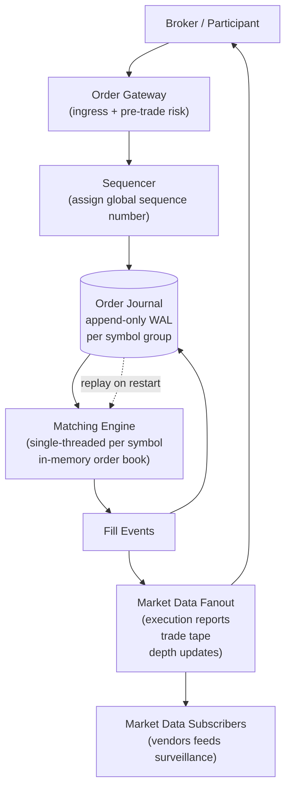

> **Why this gets asked at Director level:** Every other problem in this course rewards the horizontal-scaling reflex. This one punishes it. A matching engine violates the distributed-systems playbook on purpose: strict **price-time priority** demands a single point of serialization, and the correctness argument is non-negotiable. The Director signal is seeing that tension immediately, designing around it deliberately, and knowing *which* axis to scale (symbols, not replicas of one book). Fintech interviews at Coinbase, Robinhood, Citadel, and Amazon's trading-infrastructure teams weight this problem heavily. The canonical failure is proposing eventual-consistency or horizontal fanout of a single order book.

### Learning objectives

1. Articulate why strict price-time priority mandates a **single-threaded, deterministic matching engine**, and why that is the right answer, not a design flaw to engineer away.
2. Adapt the RESHADED Estimation step to a **latency budget in microseconds** rather than QPS; recognize that throughput and latency pull in opposite directions here.
3. Design an **event-sourced** order book, append to a journal, derive state by replay, as the mechanism for determinism, audit, and crash recovery.
4. Scale by **partitioning symbols across independent engines**, not by distributing one book; state the trade-offs of that choice.
5. Sketch the **brokerage-reconciliation variant** (orders vs. executions drift when you don't own the exchange) and delegate kernel-bypass networking with a stated prior.

### Intuition first

Imagine a sports auction where every bidder must be served in **exact arrival order** at the stated price, with no two bids processed simultaneously and the entire history logged so any dispute can be replayed. Now imagine 10,000 such auctions running in parallel, one per ticker. The right mental model is **10,000 single-threaded auctioneers**, each running independently in their own room, each keeping a perfect ledger. The alternative, one auctioneer shouting across all rooms at once, sounds more scalable until you realize the ledger is now shared, every bid needs a distributed lock, and "who got the lot?" becomes a consensus problem. The single-threaded auctioneer per symbol is not a concession; it is the architecture.

That is the entire design, restated: **one matching engine per symbol (or symbol group), running single-threaded, persisting to an append-only journal**. Every other component, market-data fanout, risk checks, brokerage reconciliation, is downstream of that core and can be eventually consistent. The core itself cannot be.

---

## R: Requirements

> Scope carefully: a real exchange is vast. The interview tests whether you can draw the right boundary around the critical path, order ingestion, matching, and execution reporting, and defer the rest.

**Clarifying questions I would ask (with assumed answers):**

- *Central limit order book (CLOB) or RFQ/dark pool?* → **CLOB**, the canonical form; price-time priority, continuous matching.
- *Which order types?* → **Market and limit orders** as the core; stop and iceberg as stretch. Cutting complexity protects the correctness argument.
- *Latency target?* → Exchange-grade: **order-to-acknowledgement < 1 ms**, **order-to-execution < 10 ms** end-to-end at the exchange boundary. Market-data fanout < 5 ms from match.
- *Scale?* → **~1,000 symbols**, each handling up to **50,000 orders/sec** at peak; **~10M orders/day** across the exchange.
- *Regulatory?* → Full **audit trail**: every order state transition durable and replayable; timestamps to microsecond resolution.

**Functional requirements:**

1. **Submit** a limit or market order; receive an acknowledgement with an order ID.
2. **Match** orders per strict price-time priority: best bid meets best ask; earlier arrivals at the same price execute first.
3. **Report executions** (fills) to the submitting broker/participant in real time.
4. **Publish market data**, top-of-book, depth snapshot, trade tape, to market-data subscribers.
5. **Cancel or modify** a resting order before it fills.
6. **Replay** the full order history for audit, dispute resolution, and crash recovery.

**Explicitly cut:** user accounts and KYC, settlement and clearing (a separate regulated layer), risk/margin pre-trade checks beyond the exchange boundary, dark pools, payment for order flow, FIX protocol framing at the wire level, cross-exchange arbitrage. State what you are cutting and why, scope discipline is the signal.

**Non-functional requirements:**

- **Strict determinism:** the same sequence of orders must always produce the same sequence of fills. No "it depends on race conditions." This is both a correctness and a regulatory requirement.
- **Low latency:** order-acknowledgement < 1 ms at the exchange; execution report < 10 ms end-to-end.
- **Durability:** every order and every fill durable before the acknowledgement returns (or immediately after, with a clear recovery contract stated).
- **Auditability:** full replay from log; microsecond timestamps; no gaps.
- **High availability:** the exchange cannot go dark during market hours; engine restart must be fast (seconds via replay, not minutes).

**The load-bearing framing:** this is not a reads-vs-writes ratio problem. It is a **latency + determinism** problem. Every architectural decision traces back to those two NFRs, and they are in tension: the techniques that lower latency (in-memory state, single-threaded execution, kernel bypass) tend to increase recovery complexity; the techniques that guarantee durability (synchronous fsync, replication) add latency. Name that tension in the interview, the whole design is a series of controlled bets against it.

---

## E: Estimation

> **RESHADED adaptation:** for a matching engine the Estimation step is a **latency budget**, not a capacity model. The bottleneck is not storage or QPS; it is the microsecond allocation across the critical path. Throughput numbers still matter for journal sizing and fanout design, but state this adaptation out loud.

**Throughput baseline:**

- 1,000 symbols × 50,000 orders/sec peak = **50M orders/sec exchange-wide** (NYSE/NASDAQ-class peak). At ~20% fill rate: **10M fills/sec**, generating **20M execution reports/sec** to brokers. The fanout tier, not the matching core, carries the bulk of message volume.

**Journal sizing:** `10M orders/day × 200B ≈ 2 GB/day`; a full year ≈ **~750 GB raw**, trivially retained on NVMe.

**Latency budget (the real headline):**

A 1 ms order-to-acknowledgement budget: network ingress ~50-200 µs; risk pre-check ~10-50 µs; journal write ~50-200 µs (NVMe); matching engine execution **~1-10 µs** (the engine is the fastest component); acknowledgement egress ~50-200 µs.

**The implication:** matching is not the bottleneck. **I/O, journal writes and network, consumes 90%+ of the budget.** The engine must be kept purely in-memory and single-threaded to protect that 1-10 µs core; any synchronization or lock inside the engine shows up immediately in p99. Architecture decisions trace to I/O, not matching logic.

---

## S: Storage

> Three data classes with completely different requirements; choosing one store for all three is the most common mistake.

**1. The order journal (write-ahead log, the source of truth).**

- *Access pattern:* sequential append at every order event; read sequentially during replay; random-access rare (single-order lookup for cancel). Throughput: ~50M events/day, burst ~50K events/sec per symbol group.
- *Choice:* a **purpose-built append-only log**, either a local NVMe WAL (Kafka-style segment files, or a custom ring-buffer journal replicated to a standby) or **Apache Kafka** with a dedicated exchange-internal topic per symbol. The journal is the single source of truth; everything else is derived.
- *Rejected, a general-purpose RDBMS as the journal:* row-level locking and MVCC overhead add latency on the write path. The engine needs sequential-append semantics, not random-update transactions.
- *Rejected, an in-memory-only structure with no journal:* unrecoverable on crash; fails the audit NFR. A matching engine without a durable journal is a liability, not a design.

**2. The live order book (in-memory, derived state).**

- *What it is:* a per-symbol data structure of resting limit orders, organized by price level, ordered by arrival time within each level.
- *Choice:* **pure in-memory**, rebuilt on startup by replaying the journal. It is not a persistent store, it is a view over the journal. This is event sourcing at its simplest: the journal is the record; the in-memory book is the projection.
- *Why this works:* replay of a single symbol's journal to rebuild a full day's book takes **seconds** (a few million events at memory speed). Recovery time is bounded by the journal size since the last snapshot, not by disk I/O on a large database.
- *Snapshot cadence:* optionally checkpoint the book state every N minutes to cap replay time; the checkpoint is advisory, never the source of truth.

**3. Market data and execution reports (high-volume, eventually consistent, fan-out).**

- *Choice:* a **message bus** (Kafka or a purpose-built multicast bus). Consumers (market-data vendors, broker gateways, surveillance) subscribe and replay independently. Staleness of a few milliseconds is acceptable; the execution report to the submitting broker is derived directly from the fill event in the journal, not from the bus.

<details>
<summary>Go deeper, order-book data structure choices (IC depth, optional)</summary>

The classic CLOB implementation uses a **price-level map** (a balanced BST or a skip list keyed by price, or for integer-tick instruments, a fixed-size array indexed by tick offset from a base price) where each price level holds a **FIFO queue of resting orders**.

Common implementations:
- **Array-of-queues (limit order array):** for instruments with a bounded tick range (e.g., equities with an integer tick size and a known price band), maintain two fixed-size arrays, one for bids indexed by price level, one for asks, each element being a doubly-linked list (deque) of orders at that price. O(1) insert and remove; O(1) best-bid/best-ask via a maintained pointer. Drawback: wasted memory for sparse books; requires resizing on price moves outside the array bounds.
- **Red-black tree / skip list keyed by price:** O(log N) insert and remove per price level; works for any price range. The standard in many open-source engines (e.g., OpenHFT Chronicle-FIX). In practice N (number of distinct price levels) is small (hundreds to thousands), so log N is a handful of comparisons.
- **Within a price level:** a simple FIFO doubly-linked list; O(1) enqueue and dequeue; order lookup by ID via a separate hash map for cancels.

The data-structure choice matters for the engine's 1-10 µs budget but is legitimately IC-level tuning. At Director altitude the decisions that matter are: all-in-memory, single-threaded, FIFO within price level, no shared state across symbols.

</details>

---

## H: High-level design

> The shape to make visible: a **per-symbol matching core** (single-threaded, in-memory, journal-backed) behind an **order gateway** that handles ingress and risk pre-checks, with a **fanout tier** downstream for market data and execution reports.



**Happy path (order ingestion and fill):**

1. A broker submits a limit order to the **Order Gateway**, which validates message format, applies basic rate-limit and position pre-checks, and assigns a microsecond timestamp.
2. The **Sequencer** assigns a monotonically increasing global sequence number, the total order of all events. This is the key to determinism: sequence number assignment is the single serialization point.
3. The sequenced event is appended to the **Order Journal** (durable).
4. The **Matching Engine** consumes the event from the journal in sequence-number order. It is single-threaded: one event at a time, no locks, no shared state with other symbol engines. It updates the in-memory order book, matches if a crossing quote exists, and emits fill events back to the journal.
5. Fill events are read by the **Fanout tier**, which dispatches execution reports to the submitting broker and publishes market-data updates (top-of-book change, trade print) to subscribers.

**The critical design choice, the Sequencer.** All scaling approaches must preserve a total order per symbol. For a multi-symbol exchange, the sequencer assigns a global sequence number across all symbols; each per-symbol engine filters to its own events by symbol ID, keeping each engine single-threaded and independent while giving the journal a unified replay record. *Rejected: letting each engine assign its own sequence numbers*, cross-symbol audit becomes impossible and reconstruction of "what happened at 09:30:00.000123" requires reconciling N independent clocks.

---

## A: API design

> Keep to the exchange-boundary surface. FIX protocol framing and binary wire encoding are IC-level details; delegate them.

```
# --- Order submission ---
POST /v1/orders
  body: { symbolId, side (BUY|SELL), type (LIMIT|MARKET), qty, limitPrice?, timeInForce (GTC|IOC|FOK), clientOrderId }
  -> 201 { orderId, sequenceNo, status: ACKNOWLEDGED, timestamp_us }
  -> 400 { error: INVALID_SYMBOL | INVALID_PRICE | RISK_REJECTED }

# --- Cancel ---
DELETE /v1/orders/{orderId}
  -> 200 { orderId, status: CANCEL_PENDING }  # pending until engine processes it
  -> 404                                       # unknown order
  -> 409 { status: ALREADY_FILLED }           # cancel arrived after fill

# --- Order status (polling fallback; execution reports are push) ---
GET /v1/orders/{orderId}
  -> 200 { orderId, status, fillQty, remainingQty, fills:[{fillId, price, qty, ts}] }

# --- Execution reports (push, via persistent connection) ---
STREAM /v1/executions?participantId=  # WebSocket or FIX drop-copy session
  -> { event: FILL, orderId, fillId, price, qty, timestamp_us, sequenceNo }
  -> { event: CANCEL_ACK, orderId, timestamp_us }

# --- Market data (separate surface, eventual) ---
STREAM /v1/market-data/{symbolId}/depth
  -> { sequenceNo, bids:[{price,qty}], asks:[{price,qty}], timestamp_us }
```

**Design notes:**

- **`sequenceNo` on every response** lets a broker detect gaps in its execution-report stream and replay from the journal to fill them.
- **Cancel returns `CANCEL_PENDING`, not `CANCELLED`.** The engine may have matched the order in the microseconds between cancel submission and processing. *Rejected: synchronous cancel acknowledgement*, it couples gateway latency to the engine's queue depth.
- **Execution reports are push.** Every broker maintains a persistent connection (FIX session or equivalent) receiving a stream of fill events tagged with sequence numbers. I delegate FIX protocol framing to the market-connectivity team, with the prior that FIX 4.2/4.4 is the standard for equities and institutional-grade crypto.

---

## D: Data model

> Two authoritative records: the **journal event** and the **order state** derived from it. Everything else is a projection.

**Journal event (the atomic unit):**

| Field | Type | Notes |
|---|---|---|
| `sequence_no` | uint64 | global monotonic; primary key; total order |
| `timestamp_us` | int64 | microseconds since epoch; exchange clock |
| `symbol_id` | string | ticker/instrument identifier |
| `event_type` | enum | `NEW_ORDER` / `CANCEL` / `MODIFY` / `FILL` / `CANCEL_ACK` |
| `order_id` | uuid | |
| `side` | enum | `BUY` / `SELL` (on NEW_ORDER) |
| `price` | int64 | price in integer ticks (no floating point, rounding is a correctness bug) |
| `qty` | int64 | shares/contracts |
| `fill_id` | uuid | populated on `FILL` events |
| `counterparty_order_id` | uuid | the other side of a fill |

**Prices are integer ticks, never floats.** IEEE 754 is non-deterministic across platforms (compiler flags, FPU mode); rounding inconsistencies break audit replay. Represent price as `int64` ticks (e.g., $123.45 = 12345 at a 0.01 tick size). This is a correctness invariant, not a micro-optimization.

**In-memory order state (derived, not stored separately):**

The live order book is rebuilt by replaying events from the journal. For query purposes, a **read model**, Redis or an in-process hash map updated by the fanout consumer, serves the `GET /v1/orders/{orderId}` path. It is eventually consistent with the journal by design; exact fill details are always available from the journal for audit.

<details>
<summary>Go deeper, event sourcing pattern and recovery by replay (IC depth, optional)</summary>

The matching engine is a textbook **event-sourced** system:

- **Command:** an incoming order submission or cancel.
- **Event:** the journal record produced by processing the command (NEW_ORDER, FILL, CANCEL_ACK, etc.).
- **State:** the in-memory order book, fully derivable by replaying events in sequence-number order.

**Recovery by replay** works as follows:
1. On startup, the engine reads the journal from the last checkpoint (or from the beginning of the day).
2. It re-applies events in sequence-number order, rebuilding the in-memory book.
3. Once caught up to the tail of the journal, it resumes live processing.

For a busy symbol with 50,000 events/sec over a 6.5-hour trading day: `50,000 × 6.5 × 3600 ≈ 1.17B events/day`. At 200 bytes/event, the day's journal is ~234 GB, not trivially replayed from scratch. In practice:
- **Intraday snapshots every N minutes** (e.g., every 15 min) cap the replay window. A snapshot records the full book state; replay starts from the most recent snapshot.
- Snapshots are advisory, the journal remains the source of truth; a corrupted snapshot triggers a full replay from the previous snapshot.

The pattern makes the engine **auditable by construction**: any disputed fill can be reproduced by replaying the journal from the start of the day through the fill's sequence number on a separate machine. This satisfies regulatory requirements without a separate audit database.

</details>

---

## E: Evaluation

> Re-check against the NFRs (determinism, latency, durability, auditability, HA) and hunt the failure modes.

**Re-check vs NFRs:** determinism, single-threaded, sequence-number total order. ✓ Latency, engine 1-10 µs; I/O dominates. See bottlenecks. Durability, every event journaled. ✓ Auditability, full replay from journal. ✓ HA, restart via replay from snapshot; target < 30 s. See bottleneck 3.

**Bottleneck 1, journal write latency eats the budget.**

Journal fsync on every event costs **~1-5 ms** on spinning disk, **~50-200 µs** on NVMe, ~**5-50 µs** with a battery-backed RAID write-back cache. That is most of the 1 ms budget on NVMe alone.

*Three approaches, each with a trade-off:*

| Approach | Latency | Recovery contract | Use when |
|---|---|---|---|
| **Synchronous fsync per event** | 50-200 µs (NVMe) | Zero-loss: every acknowledged order is durable | Regulatory requirement; no tolerance for loss |
| **Group commit (batch fsync)** | Avg 10-50 µs at steady load; tail spikes on flush | At-most-one event lost on ungraceful shutdown | High throughput; can tolerate a re-send from broker on reconnect |
| **Async log + synchronous replication to hot standby** | ~20-100 µs (replication RTT on co-located standby) | No loss if standby is healthy; risk window = replication lag | Exchange-grade HA; standby promotes in <1 s |

The right answer for an exchange is **async log + synchronous standby replication**, it achieves near-synchronous-fsync durability at replication-RTT latency, and keeps the hot-standby ready for instant failover. I would propose this and delegate the storage-team benchmark of group-commit vs. sync-replication on the specific NVMe/network topology to confirm the p99 numbers.

**Bottleneck 2, network latency and kernel overhead.**

At sub-millisecond exchange-to-broker round trips, the Linux kernel networking stack (~20-50 µs per syscall) consumes a significant fraction of the budget. High-frequency trading venues address this with **kernel-bypass networking** (DPDK, RDMA, or Solarflare OpenOnload) that bypasses the kernel, achieving ~1-5 µs for NIC-to-application delivery.

*My stated prior for this interview:* "I would delegate the kernel-bypass decision to the network engineering team. My prior is that a modern exchange co-locating brokers in the same data center can hit a 200-500 µs round-trip without kernel bypass, which is sufficient for most participants. Kernel-bypass infrastructure (custom drivers, dedicated cores, vendor NIC support, operational complexity) is a meaningful investment I'd approve only after profiling shows the kernel path is the binding constraint at our target participant tier. The matching engine architecture does not change, kernel bypass is a transport layer decision below the sequencer."

**Bottleneck 3, single-threaded engine as a single point of failure.**

If the matching engine for a symbol crashes, that symbol halts.

*Fix:* **hot standby with journal replay.** A standby consumes the same journal stream and maintains an identical in-memory book, lagging the primary by ~1 ms (co-located replication). On primary failure the standby promotes, re-processes any un-applied events, and resumes. Target failover < 1 second. *Trade-off:* hot standbys double the engine fleet, accepted because a symbol halt during market hours is a regulatory and reputational event.

**Bottleneck 4, hot symbols dominate engine resources.**

AAPL or BTC may see 10× the order rate of median symbols; a single core for the hottest name can saturate.

*Fix:* **symbol grouping by volume tier.** Assign each engine thread a group of symbols whose combined peak rate fits one core's budget (~100-200K events/sec for a tight C++ loop). Re-balance daily based on prior-day volume; hot outliers (index rebalance, earnings) get a dedicated engine. *Trade-off:* engine failure now affects a symbol group, size groups to bound the blast radius (max ~20 symbols/engine).

---

## D: Design evolution

> Two dimensions: scale up the exchange itself, and the brokerage-reconciliation variant where you do not own the exchange.

**At 10× order volume (500M orders/day, NYSE-class peak):**

The matching engine does not change, single-threaded, in-memory, journal-backed scales linearly with symbol count. What changes:

- **Journal throughput:** move to a dedicated WAL cluster (Kafka with hardware-optimized producers, per-symbol partitions) to parallelize writes while preserving per-symbol total order.
- **Fanout tier:** 200M execution reports/day requires a dedicated gateway cluster with per-connection ordered delivery; market-data fanout moves to multicast or coalesce-and-publish.
- **Symbol grouping becomes dynamic:** static assignment breaks during market events. A separate resource manager that monitors order-rate per symbol and rebalances groups above a threshold is the operational control, not inside the engine.

**Brokerage-reconciliation variant (the Robinhood/brokerage problem):**

When you are a broker routing orders to an exchange you do not own, **orders vs. executions drift**, the broker's internal order state and the exchange's execution record can diverge:

- **Rejected at the exchange:** broker believes order is live; fix: require an exchange-issued acknowledgement with a sequence number before marking an order as resting.
- **Fill received, order not found:** network partition during acknowledgement; fix: execution-report stream carries sequence numbers; broker detects gaps and requests a replay from the journal.
- **Duplicate cancel:** broker reconnects and re-sends a cancel the exchange already processed; fix: idempotent cancel by `clientOrderId`, exchange returns current state, not an error.
- **Clock drift:** use `sequenceNo`, not wall-clock time, as the canonical ordering key in all reconciliation logic.

The reconciliation design is a **state machine per order** at the broker (SUBMITTED → ACKNOWLEDGED → RESTING → PARTIAL_FILL → FILLED/CANCELLED) with sequence-number-gapped replay as the recovery path. The broker's view may lag the exchange by one RTT but must never permanently diverge. The journal is the arbiter.

**Where I'd delegate:**

- **FIX protocol and co-location networking:** *"The market-connectivity team owns the FIX session layer and co-location NIC configuration. My prior is FIX 4.4 for equities and institutional crypto; kernel bypass only after profiling confirms it's the latency-binding layer at our participant tier."*
- **Clearing and settlement:** *"Clearing (matching the confirmed fill to a settlement obligation) is a separate regulated system, I scope the exchange to fill reporting and would interface to the clearing house via a standard FIX/ISO 20022 execution record. The clearing team owns the settlement lifecycle."*
- **Pre-trade risk engine:** *"The risk team owns position-limit and buying-power checks. My prior is a low-latency in-process check inside the Order Gateway (microsecond, stateful per participant) for hard limits, with a separate async risk monitor for portfolio-level checks that do not need to block order submission."*

---

### Trade-offs: the pivotal decisions

| Decision | Option A | Option B | Option C | Use when |
|---|---|---|---|---|
| **Matching engine threading** | **Single-threaded per symbol group** (our choice) | Multi-threaded with lock-per-price-level | Lock-free CAS on shared book | **A**: determinism, no synchronization, the correct answer for CLOB. **B**: complex, non-deterministic under replay. **C**: possible for simple book ops but ordering guarantees break under concurrent inserts at the same price level. |
| **Scaling axis** | **Partition symbols across engines** (our choice) | Replicate one engine horizontally | Shard the order book by price range | **A**: independent engines, linear scale, no cross-shard coordination. **B**: violates price-time priority, two replicas can process the same symbol independently and produce different fills. **C**: a distributed transaction on every cross-range match (nearly every match). |
| **Journal write durability** | **Async log + sync standby replication** (our choice) | Synchronous fsync per event | In-memory only, no journal | **A**: exchange-grade durability at replication-RTT latency, instant failover. **B**: correct but 50-200 µs per event budget hit. **C**: no audit trail, unacceptable. |
| **Price representation** | **Integer ticks** (our choice) | IEEE 754 double | Fixed-point decimal string | **A**: exact, deterministic, trivially comparable. **B**: rounding non-determinism across platforms breaks audit replay. **C**: correct but slow; serialization cost on the hot path. |

---

### What interviewers probe here (Director altitude)

- **"Why can't you shard the order book horizontally?"**, *Strong signal:* "Price-time priority requires a total order per symbol. Two engines processing the same symbol assign sequence numbers independently; fills diverge, both incorrect and a regulatory violation. You scale by partitioning symbols across engines, never by distributing one book." *Red flag:* horizontal distribution without addressing total-order violation.
- **"How do you recover if the engine crashes?"**, *Strong signal:* "The engine is derived state, a projection of the journal. Restart, replay from the last snapshot to the journal tail (seconds per symbol at memory speed), resume. The hot standby makes failover instantaneous by pre-applying the journal in parallel." *Red flag:* "restore from a database backup", implies the book is stored separately from the journal.
- **"Why does price-time priority demand single-threaded execution?"**, *Strong signal:* "Two threads on the same price level can interleave in any order; fill sequence becomes a race condition. The sequencer enforces total order before events reach the engine; the engine just executes in sequence. Locks serialize correctly but their admission order is non-deterministic under contention, so replay is broken." *Red flag:* "use locks to serialize."
- **"What's the cost and what would you delegate?"**, *Strong signal:* "At 1,000 symbols with hot-standby pairs: ~200-400 engine cores, ~50-100 TB/year journal, modest for exchange-grade infrastructure. I delegate kernel-bypass networking, clearing/settlement, and pre-trade risk with stated priors. The engine design does not change with those choices." *Red flag:* proposing Raft/Paxos for per-symbol state where journal + hot standby is sufficient.
- **"What breaks in the brokerage variant?"**, *Strong signal:* "Orders and executions drift, partitions cause permanent divergence without reconciliation. The fix is sequence-number-gapped replay: broker detects gaps and requests replay from the journal. Exchange sequence number is always authoritative." *Red flag:* "just retry the order", idempotency alone doesn't tell the broker whether the first attempt was accepted.

---

### Common mistakes

- **Proposing horizontal distribution of a single order book.** Splitting a symbol's book across nodes requires cross-shard coordination on every match (nearly every event), reintroduces race conditions under concurrent inserts at the same price level, and breaks deterministic replay. This is the most common and most fatal mistake.
- **Using floating-point for prices.** IEEE 754 doubles are non-deterministic across platform configurations; replaying the journal on a different machine can produce different fill prices. Prices are integer ticks, always.
- **Treating the in-memory book as the source of truth rather than the journal.** The book is a derived view. If the book is lost (crash), it must be fully reconstructable from the journal, any design that requires the live book state for recovery has no recovery path.
- **Confusing availability with redundancy for the matching engine.** A hot standby (same journal, same state, instant failover) is the right HA model here. Sharding for scale and replication for availability are the same axis for most distributed systems, for a matching engine they are categorically different and must not be conflated.
- **Ignoring the brokerage-reconciliation dimension.** Fintech interviews often pivot here. The exchange-owned design and the brokerage-client design have different failure modes; conflating them or assuming the brokerage has the same guarantees as the exchange is a scope error.

---

### Practice questions (with model answers)

**Q1. Two orders arrive at the same price level. How does the engine decide which fills first?**

> *Model answer:* Price-time priority: best price executes first; at the same price, the order with the lower sequence number (earlier global arrival at the sequencer) fills first. The sequencer assigns a monotonically increasing sequence number to every event before it reaches the engine; the engine processes events strictly in order. There is no tie-breaking heuristic, the sequence number is the total order, determined at ingestion. Any distributed fanout of sequence assignment breaks this guarantee.

**Q2. The journal fills up 234 GB in a trading day. How do you keep restart time under 30 seconds?**

> *Model answer:* Periodic intraday snapshots. Every 15 minutes, serialize the in-memory book to a snapshot file. On restart, load the snapshot, then replay only events after its sequence number. For 50,000 events/sec with a 15-min window: ~45M events replayed at ~10M events/sec = ~4.5 seconds per symbol. The snapshot is advisory, fall back to the prior snapshot if corrupted. Journal is always the source of truth.

**Q3. A broker sends a cancel for an order that has already filled. What does the exchange return?**

> *Model answer:* `409 ALREADY_FILLED` with the fill details, not an error implying a malformed cancel. The cancel arrived after the match event in the journal; this is a normal race condition. The broker receives the `CANCEL_ACK` (409) and the fill execution report in sequence-number order; it reconciles by accepting the fill as authoritative. Sequence numbers, not delivery order, determine state.

**Q4. How would you design differently for 10 million symbols (crypto long-tail)?**

> *Model answer:* Static symbol grouping breaks on core count when most symbols trade near-zero volume. Use **dynamic engine allocation**: a pool of engine threads; assign a symbol to a thread on first order, evict inactive symbols on TTL. Hot symbols (top 1% by volume) get dedicated threads; cold symbols share threads, with the invariant that a thread processes one symbol's events at a time, no interleaving. Journal and sequencer do not change. The operational challenge: a sudden spike on a cold symbol (listing, news) must trigger re-assignment within seconds. Instrument order-rate per symbol; delegate the scheduling policy to the exchange ops team.

---

### Key takeaways

1. **Single-threaded, per-symbol matching is the correct answer, not a limitation.** Strict price-time priority requires a total order of events; any distribution of a single symbol's book reintroduces race conditions and breaks deterministic replay. Scale by partitioning symbols across engines.
2. **The matching engine is derived state; the journal is truth.** Event-source the engine: append every order and fill to an append-only journal; rebuild the in-memory book by replay. This makes the engine fast (pure in-memory), auditable (full replay), and recoverable (replay from snapshot).
3. **The latency budget is dominated by I/O, not computation.** The engine itself runs in 1-10 µs; journal writes and network consume 90%+ of a 1 ms budget. Architecture decisions (sync vs. async journal, kernel-bypass networking) are I/O decisions, not matching-logic decisions.
4. **Prices are integer ticks, always.** Floating-point is non-deterministic across platforms; it breaks audit replay and is a correctness bug, not a performance concern.
5. **The brokerage variant is a distinct design problem.** When you don't own the exchange, orders and executions can drift; the fix is sequence-number-gapped replay with exchange sequence number as the authoritative ordering key, and a strict state machine per order at the broker.

> **Spaced-repetition recap:** Stock exchange = **single-threaded deterministic matching engine per symbol, journal-backed (event sourcing), scaled by symbol partitioning not book distribution.** Price-time priority demands a total order → sequencer assigns global sequence numbers → engine processes strictly in sequence → one winner, deterministic replay. Latency budget: engine is 1-10 µs; I/O dominates (async journal + sync standby replication for exchange-grade durability at ~20-100 µs). Prices in integer ticks. Recover by replaying journal from last snapshot, seconds per symbol. Brokerage variant: sequence-number-gapped replay is the reconciliation mechanism; exchange sequence number is always authoritative.

---

*End of Lesson 5.6. The stock exchange is the course's canonical "when NOT to distribute" case, the single-threaded deterministic engine inverts every horizontal-scaling reflex. Related: payment systems (the other CP-by-necessity domain); quorum reads/writes (the distributed alternative, and why it does not apply here).*
