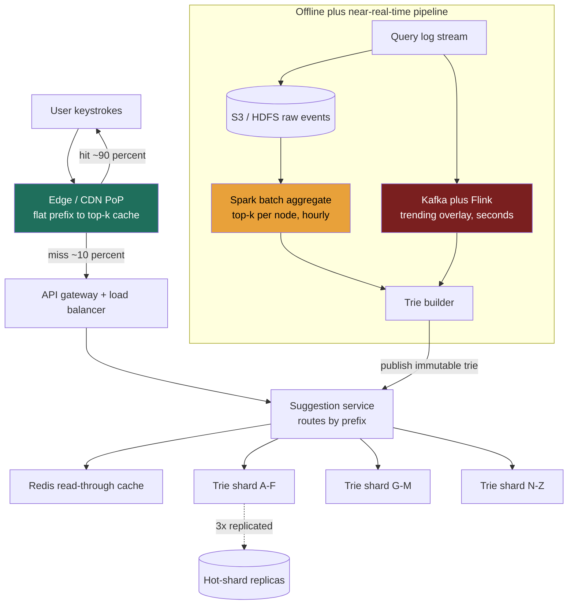

### Learning objectives
- Run the full **RESHADED** spine on a latency-first problem where the dominant constraint is a **sub-100 ms** budget, not storage or write throughput.
- Justify a **precomputed top-k trie** plus **edge caching** as the answer to "the compute is microseconds, the network is everything."
- Reason about the central trade, **exactness/freshness for latency**, and decide between offline batch, near-real-time streaming, and a hybrid.
- Diagnose and fix the signature bottleneck of this design: **hot shards** when you partition a trie by prefix.
- Operate at Director altitude: tie every choice to a requirement, quantify it, name the rejected alternative, and say where you would delegate the deep-dive.

### Intuition first
Typeahead feels like search, but it is the opposite problem. Search can take 300 ms and rank from the whole corpus; typeahead must answer **between two keystrokes**, a human types ~5 characters per second, so you have well under 100 ms or the suggestions feel laggy and the user has already typed past them. The crux: **you cannot compute ranked suggestions from billions of queries on the keystroke**. So you don't. You do the ranking **ahead of time, offline**, and bake the answer, the top 5 completions for every popular prefix, into a structure you can read in microseconds. Picture the **speed-dial on an old phone**: the phone didn't search your contacts as you dialed; the popular numbers were *precomputed* onto buttons, so "press 2" was instant. Typeahead is speed-dial for query prefixes: the work is done in advance, the keystroke just looks up the button. Everything hard in this problem is a consequence of that one move, keeping those precomputed buttons fresh, sharding them when they don't fit, and serving them from close enough to the user that the *network*, not the lookup, fits the budget.

---

## R - Requirements

RESHADED step 1. Pin the scope before building, and establish the skew that drives every later decision.

**Functional (the defensible core):**
- Given a prefix (1+ chars), return the **top-k** (k = 5) most relevant query completions.
- Suggestions ranked by **popularity** (historical query frequency), with a **recency/trending** tilt.
- Update the suggestion corpus from the **stream of real user queries** over time.

**Cut from scope (state it out loud, scoping is the signal):**
- **Personalization** (per-user history, location): a different problem (per-user state, privacy), defer to a v2 re-rank layer.
- **Spell-correction / fuzzy matching** ("recieve" → "receive"): valuable but a separate ranking concern; mention as an extension, don't build it in v1.
- **Full-text search / result serving**: out of scope, we return *query suggestions*, not documents.
- **Strong consistency / exactness**: explicitly traded away (see below). A suggestion that is an hour stale, or omits a brand-new query, is **fine**; a suggestion that arrives at 150 ms is **not**.

**Non-functional (these are the problem):**
- **Latency:** p99 end-to-end **< 100 ms**; the serving compute itself **< 10 ms**. This is the hard constraint.
- **Availability:** ~99.9%. Typeahead is a *best-effort enhancement*, if it fails, the search box still works (degrade gracefully to no suggestions). This permission to fail is itself a design lever.
- **Scale:** very high read QPS, geographically global.
- **Freshness:** **eventual**, minutes-to-hours stale is acceptable for the long tail; trending terms want seconds-to-minutes. Tunable, not strict.

**Read:write skew, the headline number.** This is a **read-dominated** system by an enormous margin. Reads = suggestion lookups on every keystroke. Writes (in the sense of *changing the served corpus*) happen in **batch**, decoupled from the request path. The raw query-event ingest rate is real but it flows into an **offline pipeline**, never the serving tier. So the serving path is effectively **read-only**, ~**500:1** reads to corpus-rebuilds in practice. That single fact licenses heavy precomputation, aggressive caching, and immutable serving structures, the entire architecture falls out of it.

**Scale assumption to anchor estimation:** model a Google-suggest-tier service at **5 billion searches/day**. (If the real number is 1B or 10B, the math scales linearly and, as we'll see, the *architecture does not change*, the edge absorbs the multiplier. That insensitivity is the point.)

---

## E - Estimation

RESHADED step 2. Enough math to make a defensible call. Round hard; state every assumption.

**Assumption:** a user types ~**6 keystrokes** per search before selecting, and we fire one (debounced) suggestion request per keystroke. So **suggestion requests = searches × 6**.

**Read QPS (the number that sizes the system):**
- 5B searches/day × 6 = **30B suggestion requests/day**.
- 30e9 / 86,400 s ≈ **350k QPS average**.
- Peak ≈ 2× average = **~700k QPS peak**.

> Note the insensitivity: if keystrokes/search is 12, not 6, read QPS doubles to ~700k avg / ~1.4M peak. We will size the **edge tier** for peak and let it absorb the head of the distribution, so this assumption moves a CDN capacity number, not the architecture. A Director flags that the design is robust to the estimate being wrong by 2-3×.

**Write QPS (corpus ingest, offline, not on the request path):**
- 5B query-events/day to log and aggregate.
- 5e9 / 86,400 ≈ **58k events/s average → round to ~60k/s**.
- These hit **Kafka + object storage**, never the trie at request time. They matter for pipeline sizing, not serving latency.

**Persistent storage (raw query logs, the corpus that must survive):**
- Per event ≈ 50 bytes (query string + timestamp + minimal metadata).
- 5e9 × 50 B = **250 GB/day raw**.
- Retain a 30-day aggregation window hot → 250 GB × 30 ≈ **~7.5 TB**; years of cold history → **multi-PB** in object storage. Cheap, archival, off the hot path.

**Serving structure (the in-RAM trie, the cache working set):**
- Keep the **top ~100M distinct query phrases** (the popular head + meaningful tail; the rest is noise nobody completes to).
- Trie nodes ≈ ~500M (prefix sharing collapses shared stems).
- Per node: 5 precomputed top-k references + score + child pointers ≈ ~100 bytes.
- 500M × 100 B = **~50 GB**; round up for overhead to **~100 GB**.
- **Key insight:** 100 GB **fits in RAM on a single large box** (e.g., a 256 GB instance). So the serving trie is *not* a storage-capacity problem, which reshapes the sharding decision (step D, Data model).

**Edge / CDN working set (the hottest prefixes):**
- Query popularity is **Zipfian**, a tiny head dominates. The hottest ~**1M prefixes** plausibly serve the large majority of traffic.
- 1M entries × ~200 bytes (prefix + serialized top-5) = **~200 MB per PoP**. Trivially fits in edge memory.

**Bandwidth:**
- Response ≈ 5 suggestions × ~40 B ≈ **~200 B/response** (+ headers).
- 350k QPS × ~300 B ≈ **~100 MB/s ≈ ~0.8 Gbps** average egress; ~1.6 Gbps peak. Modest, latency, not bandwidth, is the binding constraint.

**Instance count (origin serving tier):**
- If the edge absorbs ~**90%** of the 700k peak (justified by the Zipfian head), the **origin sees ~70k QPS**.
- A single in-RAM trie shard comfortably serves ~**50k QPS** (lookups are tens of µs; network + serialization dominate).
- Raw QPS would need only ~2 shards. But because the trie fits in RAM, **shard count is driven by blast-radius + 10× growth headroom, not QPS**, call it **~6-8 shards × 3 replicas ≈ 12-24 instances**.
- **The rejected-alternative framing (RULE 2 + RULE 1 in one move):** *without* the edge tier, the origin eats the full 700k peak → ~14 shards × 3 replicas ≈ **~40+ trie servers**, plus every request pays cross-region network RTT against the 100 ms budget. The edge absorbs 90%, so we run **~a dozen** boxes and keep tail latency near the user. That is why the edge tier exists.

---

## S - Storage

RESHADED step 3. What must persist, matched to access pattern, with real systems named. There are **two distinct storage answers** here, do not conflate them.

**Tier 1, the persistent raw/aggregated corpus (what truly *persists*):**
- **Need:** durably capture ~250 GB/day of query events; re-aggregate them in large scans for the offline pipeline; retain history for trend windows.
- **Access pattern:** append-only writes, massive sequential batch reads, no point lookups, no low-latency requirement.
- **Choice:** **object storage / data lake**, **S3** (or HDFS) for raw events, with a **columnar warehouse** (e.g., BigQuery / Snowflake / Parquet-on-S3) for the aggregation jobs. **Rejected:** a transactional RDBMS (Postgres), wrong tool: we never do row-level OLTP on this data, just full scans, and Postgres would be far costlier per TB at PB scale. **Rejected:** Cassandra, its write-optimized LSM is fine for ingest, but we don't need its point-lookup serving path here; object storage is cheaper for cold scan-only data.

**Tier 2, the serving structure (what answers the keystroke):**
- **Need:** return top-k for a prefix in < 10 ms; immutable between rebuilds; ~100 GB; read-only at request time.
- **Choice:** an **in-memory trie with precomputed top-k cached at each node**, held in the serving process (or a memory store fronting it). Reads walk the prefix to its node and return the pre-baked list, no ranking at request time. Periodically the offline pipeline **publishes a new immutable trie** and the serving tier swaps to it (blue/green), so reads never block on writes.
- **The pivotal S-step decision and its rejected alternative:**
  - **Chosen, in-RAM trie:** prefix sharing keeps it compact; one walk yields *all* completions of a prefix; natural fit for "top-k for prefix p".
  - **Rejected, prefix → top-k in a KV store (DynamoDB / Redis), one row per prefix:** dead simple, O(1), no structural sharing, trivially shardable by hashing the prefix key. We *reject it as the primary model* because it explodes storage (every prefix of every phrase becomes its own materialized row, no stem sharing) and it can't cheaply answer "all completions under a prefix" if requirements grow. **But we keep this idea**, a flat `prefix → top-k` KV is *exactly* what we push to the **edge cache and Redis layer** for the hot head, where O(1) and simplicity win and the row count is bounded to the ~1M hottest prefixes. So: trie at origin, flat KV at the edge. Right tool, right tier.

---

## H - High-level design

RESHADED step 4. Components first, then the happy path in prose.



**Happy path (read):** the user types `de`. The client debounces (~50-100 ms idle) and issues `GET /suggest?q=de`. The request hits the **nearest edge PoP**, which holds a flat `prefix → top-5` cache of the hottest prefixes. **~90% of the time it's a hit**, the edge returns `["dell laptop", "delivery", "delhi weather", ...]` in single-digit milliseconds, dominated by the last-mile RTT, and the request never touches our origin. On a **miss** (~10%, a colder prefix), the edge forwards to the regional **API gateway + load balancer**, which routes to the **suggestion service**. That service checks a **Redis read-through cache**, and on a miss routes by prefix to the owning **trie shard**, walks to the node for `de`, returns its precomputed top-5, and back-fills Redis and the edge along the way. End-to-end stays under the 100 ms budget because the only real cost is network hops, the lookup itself is microseconds.

**Happy path (write / refresh, fully off the request path):** every query a user *submits* is logged to **Kafka** and landed in **S3**. Hourly, a **Spark** batch job aggregates the window, computes the new top-k per trie node, and the **trie builder** produces a fresh immutable trie that is **published** to the serving shards (atomic swap). In parallel, a **Flink** streaming job watches Kafka for **surging terms** and emits a lightweight **trending overlay** within seconds, merged on top of the batch base. Readers always see a consistent, immutable snapshot; freshness improves between rebuilds without ever touching read latency.

---

## A - API design

RESHADED step 5. The interface is deliberately tiny, one read endpoint carries essentially all traffic.

**Read (the hot path):**
```
GET /v1/suggest?q={prefix}&limit={k}&lang={lang}&region={region}
  -> 200 { "suggestions": [
       { "text": "dell laptop", "score": 0.98 },
       { "text": "delivery",    "score": 0.91 }, ... ] }
```
- `q` = the prefix (required). `limit` defaults to 5, capped (e.g., 10) so payloads stay tiny and cacheable.
- `lang` / `region` partition the corpus (suggestions differ by locale) and become part of the **cache key**.
- **Cacheable & idempotent:** `Cache-Control: public, max-age=60` lets the edge/CDN serve it, the API contract is *designed for caching*, which is what makes the 90% edge hit-rate real. **Rejected:** a `POST` body for the prefix, it would be cleaner for long inputs but breaks HTTP caching, the single most important property here; not worth it.

**Ingest (off the request path, internal/async):**
```
POST /internal/v1/query-events        (batched, fire-and-forget -> Kafka)
  body: [{ "q": "dell laptop", "ts": ..., "lang": "en", "region": "us" }, ...]
```

**Admin (corpus lifecycle):**
```
POST /internal/v1/trie/publish { "version": "...", "location": "s3://..." }
POST /internal/v1/suggest/blocklist { "term": "..." }   # safety: drop banned/PII suggestions
```
The blocklist is a Director-grade detail: suggestions are *public output* and a legal/trust-and-safety surface, you must be able to suppress a harmful completion fast, ahead of the next rebuild.

---

## D - Data model

RESHADED step 6. Schema, keys, indexes, and, the decision that matters, the **shard key**.

**Serving trie node (in RAM):**
```
TrieNode {
  char:        byte                  // edge label
  children:    map<char, NodePtr>    // sparse
  topK:        [ {phrase_id, score} ] x5   // PRECOMPUTED at this node
}
PhraseTable { phrase_id -> { text, lang, region } }   // strings stored once, referenced by id
```
Storing `phrase_id` references (not full strings) in every node's `topK` is what keeps the trie at ~100 GB instead of multiples of it, the string for "dell laptop" lives **once** in `PhraseTable`, not re-copied into the node for `d`, `de`, `del`, ….

**Persistent aggregate (warehouse, drives rebuilds):**
```
QueryAgg { query_text (PK), lang, region, count_window, count_lifetime, last_seen }
```
Scanned in bulk by Spark; never point-queried at request time.

**The partition / shard key, and why the obvious choice is a trap.**
- The natural instinct is to **shard by first letter / prefix range** (A-F, G-M, N-Z) so a prefix lookup goes straight to one shard. It *reads* cleanly and preserves prefix-locality.
- **But it produces catastrophically skewed shards.** Query prefixes are nowhere near uniform: prefixes starting "s", "a", "t" carry vastly more traffic and phrases than "z", "q", "x". A first-letter range scheme gives you one molten shard and several idle ones, a textbook **hot partition**.
- **Chosen shard key: hash of the (complete) query prefix**, e.g., `shard = hash(prefix) % N`. **Trade-off named:** hashing **destroys prefix-locality**, adjacent prefixes scatter across shards, so you could no longer do a *range scan* over prefixes. **Why that's free here:** every suggestion lookup is for a **single, fully-specified prefix** → it's a **point lookup**, not a range scan. We never needed prefix-range locality on the serving path, so hashing costs us nothing real and buys uniform load. (For *building*, the offline job can still construct one logical trie and partition the materialized nodes by the same hash.) **Rejected, range/prefix sharding:** only justified if requirements demanded range queries over prefixes, which v1 explicitly does not.
- **Replication:** each shard **3× replicated** for read scaling + availability; hot shards (even after hashing, the distribution isn't perfectly flat) get **extra replicas**. Data lives: trie shards in regional serving clusters; flat top-k at the edge; raw + aggregates in S3/warehouse.

---

## E - Evaluation

RESHADED step 7. Stress the design against the NFRs, find the bottlenecks, and **fix each, naming the trade-off the fix makes**.

**Re-check vs the < 100 ms budget.** Decompose where the 100 ms actually goes: client→edge RTT (~10-40 ms depending on geography) + edge processing (~1-5 ms) dominates; on a miss, add edge→origin RTT + trie walk (~µs) + serialization. **The compute is microseconds; the network is the entire budget.** This is *why* we precompute (no ranking on the path) and *why* we push to the edge (kill the long RTT). If we tried to rank on the keystroke, even a 30 ms ranking job would blow the budget once stacked on network. Conclusion: the design is latency-correct **only because** of precompute + edge, those aren't optimizations, they're the load-bearing decisions.

**Bottleneck 1, Hot shards (the signature failure of this problem).** Even after hashing the prefix, real traffic has surges (a breaking-news term, a viral product) that concentrate on whichever shard owns that prefix. *Fix:* (a) **extra replicas on hot shards** + load-aware routing, *trade-off:* more memory/cost for the duplicated shard, and the publish pipeline must update all replicas atomically; (b) lean on the **edge** to flatten the head before it ever reaches a shard, *trade-off:* edge serves slightly staler data (bounded by `max-age`). The combination means a single trending term is absorbed at the edge and, on misses, spread across replicas rather than melting one box.

**Bottleneck 2, Tail latency from cold prefixes / cache misses.** The ~10% that miss the edge pay the full origin round-trip and can breach p99. *Fix:* a **regional Redis read-through layer** in front of the shards catches near-head misses, and we **warm** the edge/Redis at publish time with the known-popular prefixes so few requests ever hit a truly cold path. *Trade-off:* more moving parts and cache-invalidation surface on each rebuild, paid down by the immutable-snapshot design (swap, don't mutate).

**Bottleneck 3, Single point of failure on a shard.** If a shard's replicas all fail, that slice of prefixes returns nothing. *Fix:* because typeahead is a **best-effort enhancement**, we **degrade gracefully**, return an empty suggestion list (search box still works) rather than erroring, and serve last-known edge cache. *Trade-off:* users in that prefix range temporarily see stale/no suggestions, an explicitly **acceptable** degradation given the 99.9% (not 99.99%) availability target. Naming "this is allowed to fail softly" is itself the Director signal.

**Bottleneck 4, Write/rebuild amplification.** Rebuilding and republishing a 100 GB trie hourly is heavy; doing it on every new query would be insane. *Fix:* this is the **freshness-for-cost trade**, batch the rebuild (hourly) for the bulk, and use the **Flink trending overlay** for the few terms that genuinely need seconds-fresh. *Trade-off:* the long tail is up to an hour stale (accepted in R) while trending terms stay fresh, we spend streaming compute *only* where freshness has user value, not uniformly.

**Bottleneck 5, Edge correctness for safety-sensitive output.** A blocked/harmful suggestion cached at the edge could persist for `max-age`. *Fix:* keep `max-age` modest (e.g., 60 s), and support **active purge** of a term across PoPs via the blocklist path. *Trade-off:* lower TTL = lower hit-rate / more origin load; we accept a slightly busier origin to bound how long a bad suggestion can live. Cost vs trust, Director's call, and trust wins.

---

## D - Design evolution

RESHADED step 8. How it holds at 10×, the hardest trade-offs, what to revisit, and where to delegate.

**At 10× (50B searches/day → ~3.5M QPS avg, ~7M peak):**
- The **edge tier scales horizontally** with PoPs and the Zipfian head means hit-rate *improves* with volume (more traffic concentrates on the head), so origin QPS grows **sub-linearly**. This is the architecture paying off: 10× traffic is mostly absorbed where it's cheapest.
- The **100 GB trie** is the more interesting pressure. At today's scale it fits one box, so, honest judgment call, **v1 didn't strictly need prefix-sharding for capacity**; we sharded for blast-radius and headroom. At 10× corpus (richer locales, more retained phrases, say ~1 TB), sharding becomes **load-bearing for capacity**, not just safety. We'd raise shard count (driven by per-box RAM + replica count) and revisit the hash function for even spread.

**Hardest trade-offs (the ones an interviewer will push on):**
- **Freshness vs latency vs cost.** Pure streaming (everything seconds-fresh) is the "ideal" but multiplies pipeline cost and risks destabilizing the serving snapshot; pure batch is cheap but trending terms lag. The **hybrid** (batch base + streaming overlay) is the defensible middle, and the line between "trending, stream it" and "tail, batch it" is a tunable business decision, not a fixed constant.
- **Edge TTL vs trust/safety.** Higher TTL = cheaper and faster; lower TTL = harmful suggestions die quicker. Resolved in favor of bounded TTL + active purge.

**What I'd revisit:**
- **Personalization** (cut from v1): adding a per-user re-rank on top of the global top-k without blowing the latency budget is a genuine design problem, likely a small, cached per-user layer that *re-orders* the global candidates rather than recomputing them.
- **Multi-language/locale explosion**: each `(lang, region)` is effectively its own corpus; at many locales the trie-set and rebuild cost multiply, worth a dedicated capacity model.

**Where I'd delegate (the Director move):**
- "I'd have the **storage/ranking team benchmark the ranking function**, frequency-only vs frequency × recency-decay vs a learned model, and A/B it on suggestion CTR. My prior is a time-decayed frequency score because it's cheap to precompute and captures trending, but the exact decay constant is an empirical tuning job I'd own the *outcome* of, not the *knob*."
- "I'd have the **infra team load-test the hot-shard replica strategy** under a simulated viral-term spike and report the replica count that holds p99, I want the SLO defended with data, not my guess."
- "The **trie-build job's** incremental-vs-full-rebuild cost at 10× is a focused investigation for the data-platform team; I'd set the freshness SLO and let them choose the mechanism."

That division, own the SLOs, the trade-offs, and the cost envelope; delegate the benchmarks and the knob-tuning, is the altitude this round is scoring.

---

## Trade-offs table: the pivotal decisions

| Decision | Option A | Option B | Option C | Use when… |
|---|---|---|---|---|
| **Corpus freshness** | **Offline batch** (Spark/Hadoop), hours-stale, cheap, stable | **Streaming** (Kafka+Flink), seconds-stale, costly, more fragile | **Hybrid** (batch base + streaming trending overlay) | A: long-tail suggestions; B: pure real-time need; **C (chosen): most products, tail batched, trending streamed** |
| **Serving model** | **In-RAM trie**, compact via prefix sharing, prefix-native | **Flat `prefix→top-k` KV** (DynamoDB/Redis), O(1), simple, no sharing | **Trie at origin + flat KV at edge** | A: origin store; B: hot head/edge; **C (chosen): both, right tool per tier** |
| **Shard key** | **Prefix/first-letter range**, locality, but **hot partitions** | **Hash of prefix**, uniform load, no range scans |, | Range only if you need prefix-range scans (v1 doesn't); **hash chosen, lookups are point lookups, locality is free to lose** |

---

## What interviewers probe here

At Director altitude the probes are about **judgment, cost, and delegation**, not whether you can code a trie.

- **"You're partitioning a trie by prefix, what goes wrong, and how do you fix it?"**
  *Strong signal:* immediately names **hot shards** (the "s"/"a" shard dwarfs "z"), then fixes with **hash-sharding** (and explains *why losing prefix-locality is free*, lookups are point lookups), plus hot-shard replicas and edge flattening. *Red flag:* "shard by first letter" with no awareness of skew, or proposing range-sharding without justifying a range-query need.
- **"Where does the 100 ms actually go?"**
  *Strong:* "compute is µs, the budget is **network RTT**, which is exactly why we precompute top-k and push to the edge." Shows the latency budget is understood as a *systems* property. *Red flag:* trying to rank on the keystroke, or optimizing the trie walk (already negligible) instead of the network.
- **"How fresh are suggestions, and what does fresher cost?"**
  *Strong:* articulates the **freshness-for-cost** trade, batch the tail, stream the trending head, and frames the boundary as a tunable business call. Quantifies that uniform streaming multiplies pipeline cost for little tail value. *Red flag:* "we'll just stream everything in real time" with no cost awareness, or "rebuild on every query."
- **"This is a best-effort feature, how does that change your design?"**
  *Strong:* uses the **permission to fail** as a lever, degrade to empty suggestions, target 99.9% not 99.99%, serve stale edge cache on origin failure. *Red flag:* over-engineering five-nines into a feature that's allowed to silently no-op.
- **Delegation:** *Strong:* "I own the freshness SLO and the latency budget; I delegate the ranking-function benchmark and the hot-shard load-test, with a stated prior." *Red flag:* either hand-waving ("the team will handle ranking") or diving into B-tree-fanout-level tuning with no decision.

---

## Common mistakes

- **Ranking on the request path.** The whole game is to *precompute*; computing relevance per keystroke blows the budget. If you find yourself sorting at request time, you've lost the plot.
- **Sharding the trie by first letter / prefix range** and not seeing the hot-partition skew it creates.
- **Treating it as a storage problem.** The trie is ~100 GB, it fits in RAM. The hard constraint is **latency** (network), not capacity. Sizing fleets off raw QPS while ignoring the edge over-provisions ~5× (~40 boxes vs ~a dozen).
- **Forgetting the edge / CDN.** Without it you eat cross-region RTT on every keystroke and need ~40+ origin servers. The Zipfian head is the gift, caching it is the single highest-leverage move.
- **Demanding strong consistency / exactness.** Suggestions are inherently approximate and best-effort; insisting on freshness or five-nines mis-allocates cost.
- **Ignoring trust & safety.** Suggestions are public output and a legal surface, no blocklist/purge path is a real-world miss.

---

## Interviewer follow-up questions (with model answers)

**Q1. Walk me through why a trie beats just storing every prefix → top-k in a hash map.**
> *Model:* The flat hash map is O(1) and dead simple, and I *do* use it, at the edge and in Redis for the ~1M hottest prefixes. But as the **primary** store it materializes a row for every prefix of every phrase with **no structural sharing**: "dell laptop" forces separate entries for `d`, `de`, `del`, … each carrying the string, which multiplies storage well past the trie's ~100 GB. The trie shares stems (the string lives once in a phrase table, referenced by id) and answers "all completions under prefix p" in one walk if requirements ever grow. So: trie at origin for compactness and prefix-nativeness, flat KV at the edge for O(1) on the bounded hot set. Right tool per tier.

**Q2. A brand-new query term starts trending hard. Trace how, and how fast, it shows up in suggestions.**
> *Model:* Submitted queries flow to Kafka in real time. The **Flink streaming job** detects the surge (rate spike over a short window) within **seconds** and emits a trending overlay that merges on top of the batch base, so the term can appear in suggestions in seconds-to-a-minute *without* waiting for the hourly trie rebuild. The full **Spark batch** job folds it into the base corpus at the next hourly rebuild for durable ranking. This is the hybrid freshness model: stream the few terms where seconds matter, batch the rest, we spend streaming compute only where freshness has user value.

**Q3. Your p99 is fine but p99.9 is breaching 100 ms. Diagnose.**
> *Model:* The tail is the **edge-miss path**, the ~10% (and the colder slice within it) that round-trip to origin, plus any request landing on a **hot shard** mid-spike or during a **trie publish/swap**. Fixes, each with its trade: warm the edge/Redis with popular prefixes at publish time so fewer requests go cold (more publish-time work); add **replicas to hot shards** with load-aware routing (more memory/cost); make the trie swap **atomic and non-blocking** via immutable snapshots so a publish never stalls reads; and bound edge TTL so staleness is controlled. If a slice still can't meet p99.9, I'd **degrade it**, empty suggestions beat a 200 ms hang, since the feature is best-effort.

**Q4. The business wants suggestions personalized to the user. How, without blowing the latency budget?**
> *Model:* I would **not** recompute per user on the path. I'd keep the global precomputed top-k as the candidate set and add a thin **per-user re-rank** that *reorders* those ~5-20 candidates using a small, cached user-affinity signal (recent categories, locale), reordering a tiny candidate list is microseconds and stays in budget. Per-user state is small and cacheable. This is also why I'd cut personalization from v1 and add it as a layer: it's a separable re-rank, not a rebuild of the serving structure. I'd delegate the affinity-model design to the ranking team with a CTR-based A/B as the success metric.

**Q5. Defend the cost of this system to a CFO.**
> *Model:* The dominant cost saver is the **edge cache**: it absorbs ~90% of a ~700k peak QPS so we run ~a dozen origin trie boxes instead of ~40+, and CDN egress is cheap relative to compute. The persistent corpus sits in **object storage** (cents/GB at PB scale), not an expensive transactional DB. The **batch-first freshness** model means we pay for heavy streaming compute only on the small trending set, not on all 5B daily events. The deliberate **99.9% (not 99.99%)** target and graceful degradation avoid the multi-million-dollar tax of five-nines on a feature that's allowed to soft-fail. Every architectural choice here is also a cost choice, and I can name the dollar lever behind each.

---

### Key takeaways
- **Latency is the only hard constraint** (p99 < 100 ms): the compute is microseconds, the **network is the budget**, so precompute top-k and serve from the **edge**.
- **Read-dominated, ~500:1**: writes are an **offline pipeline**, never the request path → immutable serving tries, swapped atomically.
- **Edge caching the Zipfian head absorbs ~90% of peak**, cutting the origin fleet from ~40 boxes to ~a dozen, sizing off raw QPS while ignoring the edge over-provisions ~5×.
- **Shard by hash of the prefix, not by prefix range**, range-sharding creates hot partitions; lookups are point lookups, so losing prefix-locality is free.
- **Trade exactness/freshness for latency**: hybrid pipeline, **batch the tail, stream the trending head**, spends freshness budget only where it has user value.

> **Spaced-repetition recap:** Typeahead = speed-dial for prefixes, precompute top-k offline into an in-RAM trie, serve the Zipfian head from the edge so the *network* (not the lookup) fits the sub-100 ms budget. Read-dominated; writes are an offline batch+streaming pipeline. Shard by **hash of prefix** (range-sharding ⇒ hot shards). Trade freshness/exactness for latency, and let it fail soft, it's best-effort.
