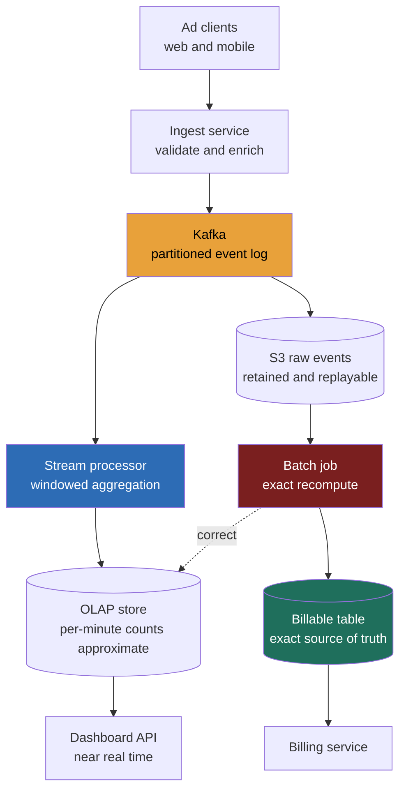

> **This is the most-cited "modern infra" question, #1 among Meta's most-asked, and frequent at Amazon and Google, because it's the cleanest test of whether you can reason about a *streaming data pipeline* where the numbers are money.** A weak answer builds one Kafka-to-database flow and calls it done. A Director-level answer opens with a single question, *is this for billing, or for analytics?*, and lets the answer flip the whole architecture, because **exactly-once counting at scale and approximate-but-fast counting are two different systems that happen to share a firehose.** The signal is recognizing that you cannot bill an advertiser from a number you computed approximately, and designing the two paths deliberately rather than pretending one path can be both.

### Learning objectives
- Run the **RESHADED** spine on a **streaming-analytics** problem and surface its load-bearing tension out loud: **every click is revenue, so the speed-vs-truth split is forced**, a fast approximate stream for dashboards, a slow exact batch as the billing source of truth.
- Open with the **billing-or-analytics** clarifying question and show how the answer **flips the architecture**, the opening Director move on this problem.
- Decide where **exactly-once counting** is mandatory (billing) and where **at-least-once with eventual correction** is fine (live dashboards), and place **dedup, late-event handling, and idempotent reprocessing** accordingly.
- Treat **raw-event retention** as a real budget line in estimation, the batch source of truth needs the raw events kept, and that storage is a number you defend.
- Frame the **Lambda-vs-Kappa** design-evolution argument by reference rather than re-teaching it, and hand the same pipeline off to top-K.

### Intuition first
Picture a **cash register at a stadium concession stand** wired to two displays. One is a **big scoreboard** the manager glances at all night, "we've sold about 40,000 drinks so far", updated live, roughly right, and nobody cares if it's off by a few hundred at any instant. The other is the **end-of-night till reconciliation** the accountant runs: every receipt counted, every refund applied, every duplicate swipe removed, and the number that actually settles the books. **Same stream of sales, two completely different machines**, one optimized for *now and roughly*, the other for *eventually and exactly*, because one drives a glance and the other drives money.

An ad click aggregator is exactly this. A hundred thousand ad events a second pour in. Advertisers' live dashboards want the scoreboard: "your campaign got ~12,400 clicks in the last 5 minutes", fast, approximate, good enough to make a budget decision. But the **invoice** at month's end is the till reconciliation: every billable click counted exactly once, every fraudulent or duplicate click removed, every late-arriving event from a phone that was offline for an hour folded in. The mistake almost everyone makes is trying to build one pipeline that serves both, **you cannot bill an advertiser from the scoreboard.** The whole design is two paths from one firehose: a **stream** that's fast and forgivably wrong, and a **batch** that's slow and the source of truth.

That asymmetry, *speed for the dashboard, truth for the bill*, is the opposite of a single-source-of-truth instinct, and learning to hold two reconcilable numbers at once is what this question tests.

---

## R: Requirements

> Pin the scope, and lead with the one clarifying question that flips the architecture. **The spine is standard, but R does double work here: the billing-vs-analytics answer decides whether exactly-once is a hard invariant or a nice-to-have.**

**The opening Director move, the question I ask first:** *"Is this number used to bill advertisers, or to power live analytics dashboards?"* The answer changes everything:
- **Billing** → exactly-once counting is a hard correctness invariant; a batch recompute over retained raw events becomes the source of truth; the stream is a convenience, never the bill.
- **Analytics only** → at-least-once with bounded error is fine; you can skip the batch path entirely and serve everything from the stream.

I'll design for the **harder, real case: both.** Advertisers see a near-real-time dashboard *and* get billed, so I build both paths and reconcile them.

**Clarifying questions I'd ask (with assumed answers):**
- *Billing or analytics?* → **Both.** Dashboards from the stream, invoices from the batch. This is the whole design.
- *Dashboard freshness bar?* → **~1 minute end-to-end** is plenty for a budget glance; not sub-second.
- *Exactly-once where?* → **Billing only.** The dashboard tolerates small, self-correcting error.
- *How late can events arrive?* → Mobile clients offline for minutes-to-hours; design for **late events up to ~24h**, dropped beyond that.
- *Fraud/invalid-click filtering in scope?* → **Acknowledge it, delegate the model.** Billing must exclude invalid clicks; the detection logic is a trust-and-safety system.

**Functional requirements:**
1. **Ingest** ad click/impression events at high volume.
2. **Aggregate** counts by `(ad_id, campaign_id, time_window)`, plus common dimensions (region, device).
3. **Serve a near-real-time dashboard** (per-minute counts, ~1-min fresh).
4. **Produce an exact billable count** per campaign per billing period, the source of truth.
5. **Handle late events and reprocessing** without double-counting.

**Explicitly CUT (scoping is the signal):** ad serving / auction (that's the ad-exchange problem), targeting, the fraud *model* itself (delegated), advertiser UI, budget pacing/throttling. I scope to **ingest → aggregate → two read paths (live + billable)**, and say so.

**Non-functional requirements:**
- **Exactly-once for billing**, each billable click counted once and only once; the cardinal correctness invariant.
- **At-least-once + eventual correction for the dashboard**, fast, approximate, self-healing as the batch catches up.
- **High write availability at ingest**, never drop a billable event; an event lost is revenue lost.
- **Freshness:** dashboard ~1 min; billable numbers settle within the late-event window (~24h).
- **Durability of raw events**, the batch source of truth depends on raw events being retained and replayable.

**The skew, stated:** this is **write-heavy at ingest, read-light at query.** 100k+ events/sec in; a few thousand dashboard reads/sec out. That inverts the social-feed shape, the hard part is the **ingest firehose and the exactly-once accounting over it**, not fan-out reads.

---

## E: Estimation

> Enough math to make a defensible call, and on this problem, **raw-event retention is a real budget line**, because the batch source of truth can't exist without the raw events kept.

**Assumptions:** **100k events/sec** sustained, peak ~3× → **300k/sec**; each raw event ~**200 bytes** (ad_id, campaign_id, user/device id, timestamp, geo, type); ~500k active campaigns.

**Ingest throughput:** `100k/sec × 200 B ≈ 20 MB/s` sustained, **~60 MB/s peak.** Per day: `100k × 86,400 ≈ 8.6B events/day`. This is a partitioned-log problem (Kafka), not a single-database problem.

**Raw-event retention (the line item people forget):**
- `8.6B events/day × 200 B ≈ 1.7 TB/day raw.`
- The batch source of truth needs raw events for the **whole billing + late-event window**. Keep **~30 days hot**: `1.7 TB × 30 ≈ ~50 TB`, on cheap object storage (S3); compressed ~3-5× → **~10-15 TB billed.**
- **The decision this forces:** raw retention is the price of having a recomputable source of truth. *Trade-off named:* ~50 TB/month of S3 (a few hundred dollars) buys the ability to replay and re-bill correctly. *Rejected:* keep only aggregates → you can never recompute, audit, or fix a counting bug after the fact. For a system where the output is invoices, retaining raw is non-negotiable.

**Aggregated output (tiny by comparison):** counts by `(campaign, minute, a few dimensions)`. `500k campaigns × 1,440 min/day × ~tens of dimension combos × ~30 B ≈ low tens of GB/day`, orders of magnitude smaller than raw. The aggregates fit comfortably in an OLAP store; the raw is what costs.

**Read load:** dashboards, say 10k advertisers polling every ~30s → **~few hundred reads/sec**, trivially cached. Billing, a periodic batch job, not interactive.

**Instance count:** the spend concentrates in **(1) the ingest log + stream-processing tier** (sized for 300k/sec peak, tens of partitions, a handful of stream-processor workers) and **(2) raw object storage.** The OLAP serving store and dashboard tier are small. The headline: **this is a throughput-and-retention problem, not a storage-volume-of-results problem.**

**What estimation decided:** ingest is a partitioned-log firehose; raw retention (~50 TB/mo) is the defensible cost of a recomputable billing truth; aggregates are tiny; reads are trivial. The numbers point straight at a two-path (stream + batch) architecture.

---

## S: Storage

> Three data classes with different durability and consistency needs; pick stores by access pattern.

**1. Raw event log (durable, replayable, append-only), the spine of the whole system.**
- *Access pattern:* append at 100k+/sec, partitioned, retained, replayed by both the stream processor (live) and the batch job (truth).
- *Choice:* **Kafka** (partitioned, durable, replayable log) as the ingest buffer, tee'd to **S3** (cheap long-term raw retention for the batch source of truth).
- *Rejected, write events straight into a database:* no store absorbs 300k/sec of small writes cheaply, and you'd lose the *replay* property that makes idempotent reprocessing possible. The log decouples bursty ingest from downstream consumers and is the foundation of both exactly-once and reprocessing.

**2. Aggregated counts for the dashboard (fast read, time-series, approximate-OK).**
- *Choice:* an **OLAP / time-series store**, Druid, ClickHouse, or Pinot, fed by the stream processor, serving per-minute rollups. Tuned for fast group-by-time-window reads.
- *Rejected, serve dashboards from a row store:* per-minute group-bys over high-cardinality dimensions are exactly what columnar OLAP does well and OLTP does badly.

**3. Billable aggregates (exact, auditable, settled).**
- *Choice:* a **transactional/warehouse table** written by the batch job, exact counts per campaign per period, with the raw events retained behind them for audit. This is the number that goes on the invoice.
- *Rejected, bill from the OLAP store:* that store holds the *approximate* stream output; billing from it means billing from a number you computed at-least-once. **Never bill from the stream.**

**Dedup state** (for exactly-once) lives in the stream processor's **keyed state store** (e.g. RocksDB-backed Flink state), recent event IDs, windowed so it doesn't grow unbounded.

---

## H: High-level design

> The shape to make visible: **one firehose, two paths**, a fast approximate stream for the dashboard and a slow exact batch for the bill, reconciling into the same campaign.



**Happy path, compressed:** a click hits the **ingest service** (validate, enrich with geo/device, stamp event time), which appends to **Kafka**, partitioned by `campaign_id` (or `ad_id`) so a campaign's events land in order on one partition. From the log, **two consumers fan out**:
- **The speed path:** a **stream processor** (Flink / Kafka Streams) does windowed aggregation, per-minute counts per campaign and dimension, and writes to the **OLAP store**, which the **dashboard** reads. This is at-least-once and fast; small over/under-counts are tolerated and self-correct.
- **The truth path:** the same events land in **S3** as retained raw. A periodic **batch job** (hourly/daily) recomputes exact counts over the raw, applying full dedup, late-event inclusion, and fraud filtering, and writes the **billable table**, the source of truth the **billing service** invoices from. The batch also **back-corrects** the OLAP store so the dashboard converges to truth.

**The shape to notice:** the load-bearing wall runs between the **approximate stream (dashboard, speed)** and the **exact batch (billing, truth)**. They share the ingest log but diverge on the correctness contract. This is the **Lambda-style two-path** structure, and whether to collapse it to one path is the central design-evolution argument.

---

## A: API design

> Two writes-in and two reads-out; the idempotency and the event-time field *are* the correctness story.

```
# --- Ingest (write path; at-least-once, never drop) ---
POST /v1/events
  body: {
    eventId,            # client- or gateway-assigned UUID -> dedup key
    adId, campaignId,
    eventType,          # "click" | "impression"
    eventTime,          # client event timestamp (drives windowing + late handling)
    userId, geo, device
  }
  -> 202 Accepted       # appended to the log; processed async

# --- Dashboard read (approximate, fast) ---
GET /v1/campaigns/{campaignId}/stats?from=&to=&granularity=minute
  -> 200 { series:[{window, clicks, impressions}], asOf: <ts>, source: "stream" }
                        # source flags this as the APPROXIMATE number

# --- Billable read (exact, settled) ---
GET /v1/campaigns/{campaignId}/billable?period=2026-06
  -> 200 { billableClicks, settledAt, source: "batch" }
                        # the source of truth; only present after the batch settles
```

**Design notes (each with its rejected alternative):**
- **Every event carries an `eventId`**, the dedup key that makes exactly-once possible downstream. *Rejected: dedup on (adId, userId, timestamp)*, collisions and clock skew make it unreliable; an explicit ID is unambiguous.
- **`eventTime` is the client's event timestamp, not arrival time.** Windowing and late-event handling key off *event* time. *Rejected: processing-time windows*, they misattribute a late mobile event to the wrong minute and can't be corrected.
- **The dashboard response is explicitly tagged `source: "stream"`** and the billable response `source: "batch"`. The API makes the speed-vs-truth split visible to the caller, you can never confuse the dashboard number for the bill.
- **Ingest returns 202, not 200**, the event is durably logged, not yet processed. Honest about the async pipeline.

---

## D: Data model

> The aggregation key and the dedup key are the two consequential decisions.

**Raw event**, keyed by `eventId` (dedup), partitioned in Kafka by `campaign_id`. Carries `ad_id`, `campaign_id`, `event_type`, **`event_time`** (the windowing key), `user_id`, `geo`, `device`. Retained raw in S3 for the batch.

**Aggregate row**, keyed by **`(campaign_id, time_window, dimension_tuple)`** → `count`. The window is a fixed bucket (e.g. 1-minute). This is what both the stream (approximate) and batch (exact) produce; they write to different stores but share this shape, which is what lets them reconcile.

**Billable row**, `(campaign_id, billing_period)` → `exact_count`, `settled_at`. Written only by the batch, after dedup + late-event + fraud filtering.

<details>
<summary>Go deeper, exactly-once mechanics: dedup, watermarks, idempotent reprocessing (IC depth, optional)</summary>

**Exactly-once on the stream** is really *effectively-once* and rests on three legs:
- **Dedup by `eventId`:** the stream processor keeps recent event IDs in keyed state (RocksDB-backed). A retried or duplicated event whose ID is already seen is dropped. State is windowed (e.g. last few hours) so it doesn't grow unbounded, older dups are caught by the batch instead.
- **Transactional sink / offset commit:** Flink's checkpointing + Kafka transactions commit the aggregate write and the consumer offset atomically. On failure the processor rewinds to the last checkpoint and replays; because the sink write was transactional, no double-count results. This is what "exactly-once" means operationally, *replay is safe because the output commit is atomic with the input offset.*
- **Watermarks for late events:** a **watermark** is the processor's estimate of "event time has progressed to T; I've probably seen everything up to T." Windows close when the watermark passes them, with a grace period (allowed lateness) for stragglers. Events later than the grace period are sent to a side output (or simply caught by the batch).

**The batch is the safety net.** It owns *true* exactly-once because it sees the *complete* retained raw, including events that arrived after the stream's window closed, and recomputes from scratch. Its correctness is structural: idempotent recomputation over an immutable, deduped raw set always yields the same exact answer, no matter how many times you run it. That's why billing reads the batch, not the stream: the stream is exactly-once *within its window*; the batch is exactly-once *over all events, ever*.

**Idempotent reprocessing:** because raw is retained and the recompute is a pure function of (raw events, dedup rule, fraud rule), you can re-run any historical period, to fix a counting bug, apply a new fraud rule, or fold in very-late events, and overwrite the billable row deterministically. This is the property aggregate-only systems can never have.

</details>

**Partition key = `campaign_id`.** Co-locates a campaign's events on one Kafka partition (in-order, single-consumer aggregation) and matches the query shape (per-campaign dashboards and bills). *Rejected: partition by `user_id`*, scatters a campaign's events across all partitions, forcing a cross-partition shuffle to aggregate per campaign. *Hot-campaign caveat:* a viral campaign overloads one partition (the hot-key shape); sub-partition it by `(campaign_id, hash(ad_id) % k)` and sum on read, the sharded-counter pattern applied to the log.

---

## E: Evaluation

> Re-check against the NFRs and hunt the bottlenecks, naming each trade-off.

**Re-check vs NFRs:** exactly-once billing, the batch recompute over deduped raw; dashboard freshness, the ~1-min stream; never-drop ingest, the durable log; late events, watermarks (stream) + the full-raw recompute (batch). Now the bottlenecks.

**Bottleneck 1, double-counting (the cardinal billing risk).**
A client retries a click, or the stream replays after a crash, and the same click is counted twice, directly inflating the bill.
*Fix:* **dedup by `eventId`** in the stream's keyed state for the live number, and, the real guarantee, the **batch recomputes exactly-once over the complete deduped raw set**, which is the number that bills. *Rejected:* relying on the stream alone for billing, its dedup state is windowed and finite, so a duplicate arriving days late slips through. The batch, seeing all raw, catches it. **The batch is why billing is correct; the stream is just fast.**

**Bottleneck 2, late events (the offline-mobile problem).**
A phone is offline for an hour, then floods in events stamped with old `event_time`s, after the stream's window already closed.
*Fix:* **watermarks with a grace period** on the stream (so moderately-late events still land in the right minute), and, definitively, the **batch sees them in the raw and attributes them correctly** regardless of how late. The dashboard may briefly under-count; it converges when the batch back-corrects. *Trade-off:* event-time windowing plus a late window is more complex than processing-time, accepted because misattributing a billable click to the wrong period is a billing error, not a cosmetic one.

**Bottleneck 3, billing from the approximate stream (the architecture-defining mistake).**
Someone wires the invoice to the OLAP store because it's already there.
*Fix:* **never bill from the stream.** Billing reads the **batch billable table only.** The stream is structurally at-least-once and lossy on very-late events; the batch is the source of truth. This separation *is* the design. *Rejected:* a single path serving both, it forces you to either make the stream exactly-once over an unbounded late window (impractical) or accept approximate billing (unacceptable).

**Bottleneck 4, ingest firehose / hot campaigns.**
300k/sec peak, with one viral campaign overloading a single partition.
*Fix:* **partition the log** for parallelism; **sub-partition hot campaigns** by `(campaign_id, hash(ad_id) % k)` and sum on read (the sharded-counter pattern); buffer in Kafka so bursts don't backpressure ingest. *Trade-off:* sub-partitioning makes per-campaign reads fan across k partitions, cheap, and only for the rare hot campaign.

**Bottleneck 5, fraud / invalid clicks inflating the bill.**
Bots and duplicate-intent clicks must not be billed.
*Fix:* **filter invalid clicks in the batch** before settling the billable number; flag them in the stream best-effort for the dashboard. *Delegate the model*, the detection logic is a trust-and-safety system; I own the *integration point* (the batch applies the fraud verdict before billing), with a stated prior: rules + behavioral scoring, re-runnable over retained raw so a new rule can re-settle a past period.

**Closing re-check:** exactly-once billing holds (batch over deduped raw); dashboard is fast and self-correcting (stream + back-correction); ingest never drops (durable log); late events are attributed correctly (watermarks + full recompute); fraud is filtered before settlement. The two paths each do the one job they're good at.

---

## D: Design evolution

> Push the dimensions up and find what breaks, and on this problem, the central evolution argument is **Lambda vs Kappa** (referenced, not re-taught).

**The Lambda-vs-Kappa question (the headline trade-off).** The two-path design above is **Lambda**, a stream layer for speed and a batch layer for truth, reconciled. Its well-known cost is **maintaining two codebases** that must compute the *same* aggregation and agree. The **Kappa** alternative: one stream path, and to "recompute," you **replay the retained log** through the same stream code. Where each wins:
- **Stay Lambda when** the batch's correctness contract genuinely differs from the stream's, here it does: billing needs exactly-once over an *unbounded* late-event window and re-runnable fraud filtering, which is naturally a batch recompute over retained raw. The two paths aren't redundant; they have different correctness guarantees.
- **Move toward Kappa when** you can express the exact recompute as a *replay* of the same streaming job over the retained log (which we already keep in S3). Modern stream engines make this viable, collapsing two codebases into one. *Trade-off:* a full historical replay through the stream is operationally heavier than a batch scan, and the engine must guarantee exactly-once on replay.
- **My prior:** keep the raw log retained (we already do, it's the enabler of *both*), start Lambda for the clear billing/dashboard correctness split, and migrate the recompute to log-replay (Kappa-style) once the streaming engine's exactly-once-on-replay is proven, to kill the dual-codebase tax. This is a *managed evolution*, not a day-one bet.

**At 10× (1M events/sec):** the ingest log and stream tier scale horizontally on partitions (the design's whole point); raw retention grows linearly (~500 TB/mo, a real cost to revisit with tiering and aggressive compression); the OLAP and billing stores barely move (aggregates stay tiny). The bottleneck shifts to **partition count and stream-processor parallelism**, both horizontal.

**Hardest trade-offs to defend:**
- **Two numbers for one thing.** The dashboard and the bill can briefly disagree; the dashboard converges to the batch. Defending *why that's correct* (speed vs truth, not a bug) is the senior tell.
- **Raw retention cost vs recomputability.** Keeping ~50 TB/mo of raw is the price of audit, bug-fix, and re-billing. Drop it and you lose the source of truth forever.
- **Lambda's dual codebase** vs Kappa's heavier replay, a live architectural choice, not a settled one.

**Where I'd delegate (the explicit Director move):**
- **Fraud/invalid-click model:** *"Trust-and-safety owns the detection model behind `isValid(event) -> verdict`; I own the integration, the batch applies the verdict before settling the billable number, and because raw is retained, a new rule can re-settle a past period. My prior is rules + behavioral scoring."*
- **The stream engine bake-off:** *"Data-platform benchmarks Flink vs Kafka Streams vs Spark Structured Streaming on our 300k/sec exactly-once-with-late-events workload; my prior is Flink for mature event-time + exactly-once, escalating only if operational cost dominates."*
- **The OLAP store choice:** *"Analytics benchmarks Druid vs ClickHouse vs Pinot on our per-minute group-by read shape; my prior is whichever the org already runs."* What I keep, the **two-path speed/truth split, never-bill-from-the-stream, and raw retention as the recompute enabler**, and what I delegate, with a stated prior, is the altitude.

**Handoff:** the exact same ingest log + aggregation pipeline is the substrate for **top-K** ("the 100 highest-clicked ads right now"), same firehose, a different read shape (heavy-hitters over a window rather than per-campaign totals).

---

### Trade-offs table: the pivotal decisions

| Decision | Option A | Option B | Option C | Use when... |
|---|---|---|---|---|
| **Counting paths** | **Two paths, stream + batch** (Lambda) | **Stream only** (Kappa / replay) | **Batch only** | **A** when billing needs exact + late-tolerant *and* dashboards need fast, the real case (our choice). **B** when the recompute can be a log-replay of the same job and exactly-once-on-replay is proven. **C** only for pure analytics with no freshness need. |
| **Bill from which path** | **Batch billable table** | **Stream OLAP output** | Hybrid reconcile-then-bill | **A** always for billing, exact over complete deduped raw (our choice). **B never**, billing from an approximate at-least-once number. **C** is just A with extra steps. |
| **Window / time basis** | **Event-time + watermarks** | **Processing-time windows** | **Ingest-time** | **A** when late events must be attributed correctly, billing does (our choice). **B** when late events are rare and approximate is fine. **C** as a cheap middle ground for analytics-only. |
| **Log partition key** | **`campaign_id`** | **`user_id`** | **Round-robin** | **A** matches the per-campaign query + in-order aggregation (our choice); sub-shard hot campaigns. **B** scatters a campaign across partitions. **C** maximizes spread but forces a full shuffle to aggregate. |

---

### What interviewers probe here (Director altitude)

- **"Is this for billing or analytics?"**, *Strong:* asks it *first*, then designs two paths, fast approximate stream for dashboards, exact batch for the bill, and states that the answer flips the architecture. *Red flag:* builds one pipeline and never distinguishes the two contracts.
- **"How do you count each click exactly once for billing?"**, *Strong:* dedup by explicit `eventId`; the **batch recompute over complete deduped raw is the real guarantee** (exactly-once over *all* events, not just a window); never bill from the stream. *Red flag:* "exactly-once on the stream" with no batch, ignoring late events outside the window.
- **"A mobile event arrives 3 hours late. Where does it land on the bill?"**, *Strong:* watermarks give the stream a grace window; definitively, the **batch sees it in retained raw and attributes it to the correct period**; the dashboard converges via back-correction. *Red flag:* processing-time windows that silently misattribute it.
- **"Why keep all the raw events, that's a lot of storage."**, *Strong:* raw retention (~50 TB/mo, a defended line item) is what makes the billing number **recomputable, auditable, and re-billable** when a fraud rule or counting bug changes; aggregate-only can never do that. *Red flag:* keeps only aggregates and can't audit or correct.
- **"Lambda or Kappa here, and why?"**, *Strong:* names the dual-codebase cost of Lambda and the heavier-replay cost of Kappa; keeps Lambda while the billing/dashboard correctness contracts genuinely differ; migrates to log-replay once exactly-once-on-replay is proven (by reference, doesn't re-derive). *Red flag:* picks one by fashion with no trade-off.

---

### Common mistakes

- **Billing from the stream.** The OLAP/stream number is at-least-once and lossy on very-late events. Bill from the **batch** over complete deduped raw, full stop. This is the single most important rule on the problem.
- **One pipeline for both jobs.** Speed (dashboard) and truth (billing) are different correctness contracts; forcing one path makes you either accept approximate bills or build impractical unbounded-window exactly-once.
- **Processing-time windows.** They misattribute late mobile events to the wrong minute and can't be corrected. Use **event-time + watermarks**, with the batch as the authority.
- **Dropping raw events to save storage.** Without retained raw you can never recompute, audit, or re-bill after a bug or a new fraud rule. Raw retention is the enabler of the whole truth path.
- **No explicit `eventId`.** Dedup on derived fields (user+timestamp) is unreliable under clock skew and collisions; an assigned ID makes exactly-once tractable.

---

### Interviewer follow-up questions (with model answers)

**Q1. Walk me through counting a single click exactly once for the invoice.**
> *Model:* The click arrives with an assigned `eventId` and durably lands on the Kafka log, partitioned by `campaign_id`, and is tee'd to S3 as retained raw. The **stream** dedups by `eventId` in keyed state and produces a fast approximate count for the dashboard, but that's not the bill. The **bill** comes from a **batch job that recomputes over the complete retained raw**: it dedups across *all* events (not just a window), folds in late arrivals, applies the fraud filter, and writes an exact count to the billable table. The invoice reads only that table. So exactly-once for billing is structural: idempotent recomputation over an immutable, deduped raw set yields the same exact number however many times it runs. The stream is fast; the batch is true.

**Q2. The same firehose, but now show me top-10 ads by clicks in the last 5 minutes.**
> *Model:* That's the **top-K / heavy-hitters** read shape over the *same* ingest log and stream layer. Same partitioned firehose, same windowing, but instead of per-campaign totals I maintain a bounded top-K structure (e.g. Count-Min Sketch for frequencies + a heap of candidates) per window, so I don't sort the full cardinality. Crucially, for a *dashboard* top-K, approximate is fine, so it stays purely on the stream, no batch needed unless top-K ever drives money. The reusable substrate is the log + stream aggregation; only the aggregation function and read shape change.

**Q3. Your stream processor crashes mid-window. Did you lose or double-count clicks for the dashboard?**
> *Model:* Neither, if exactly-once is configured: the processor checkpoints state and commits aggregate writes transactionally with the consumer offset (Flink + Kafka transactions). On restart it rewinds to the last checkpoint and replays from the log; because the output commit was atomic with the input offset, replay doesn't double-count, and nothing is lost because the log retained the events. The dashboard may stall for the restart window, then catch up. And even if the stream got it slightly wrong, the **batch back-corrects** the dashboard and *is* the bill, the stream never has to be perfect.

**Q4. Why not just make the stream exactly-once and drop the batch entirely (Kappa)?**
> *Model:* You can move toward Kappa, recompute by replaying the retained log through the same stream job, killing Lambda's dual-codebase cost. I keep the raw log precisely so that's possible. But I hold Lambda while two things are true: billing needs exactly-once over an *unbounded* late-event window (a stream's dedup state is finite, so a click arriving days late slips its window, the batch, seeing all raw, doesn't), and fraud rules must be re-runnable over history to re-settle past periods. Both are naturally batch recomputes. Once the engine's exactly-once-on-replay is proven for our late-event profile, I'd collapse to Kappa, a managed migration, not a day-one bet.

**Q5. What does this cost, and what would you delegate?**
> *Model:* The spend is the **ingest log + stream tier** (sized for 300k/sec peak) and **raw retention** (~50 TB/mo S3, a few hundred dollars, the price of a recomputable, auditable bill). The aggregates and dashboard tier are small; reads are trivially cached. I delegate the **fraud model** to trust-and-safety behind `isValid(event)`, owning only the integration point (batch applies the verdict before settling). I delegate the **stream-engine and OLAP-store bake-offs** with stated priors (Flink for event-time + exactly-once; whichever OLAP the org runs). What I keep is the two-path speed/truth split, never-bill-from-the-stream, and raw retention as the recompute enabler.

---

### Key takeaways
- **Every click is money, so the design splits speed from truth:** a fast **approximate stream** for live dashboards and a slow **exact batch** for the bill, two paths from one firehose (the Lambda shape). The opening Director move is asking **"billing or analytics?"**, it flips the architecture.
- **Never bill from the stream.** The stream is at-least-once and lossy on very-late events; the **batch recompute over complete deduped raw is the source of truth**, exactly-once over *all* events, not just a window.
- **Raw-event retention (~50 TB/mo) is a defended budget line, not waste:** it's what makes the billing number recomputable, auditable, and re-billable when a fraud rule or counting bug changes. Aggregate-only can never do that.
- **Late events and dedup are correctness, not polish:** event-time windowing + watermarks on the stream, full-raw recompute in the batch, and explicit `eventId` dedup; the dashboard converges to truth via back-correction.
- **It's a write-heavy, throughput-and-retention problem:** partition the durable log by `campaign_id`, sub-shard hot campaigns, scale stream parallelism horizontally; aggregates and reads are tiny. Delegate the fraud model and the engine/store bake-offs with stated priors.

> **Spaced-repetition recap:** Ad click aggregator = **streaming analytics where every event is money.** Ask **billing or analytics** first, it flips the design. Build **two paths from one Kafka firehose**: a fast **approximate stream** (Flink → OLAP → dashboard, at-least-once, self-correcting) and a slow **exact batch** (S3 raw → recompute → billable table, exactly-once over complete deduped raw). **Never bill from the stream.** Handle **late events** (event-time + watermarks; batch is the authority) and **dedup** (explicit `eventId`). **Raw retention (~50 TB/mo)** is the recompute enabler. **Lambda now, Kappa once exactly-once-on-replay is proven**. Same pipeline feeds **top-K**. Delegate the fraud model + engine/store bake-offs.

---

*End of Lesson 5.7. The Ad Click Aggregator is the canonical streaming-analytics interview: the hard part isn't volume, it's that **the output is invoices**, forcing a deliberate speed-vs-truth split, an approximate stream for dashboards and an exact, recomputable batch as the billing source of truth, reusing batch-vs-stream and Lambda/Kappa reasoning and sharded counters.*
