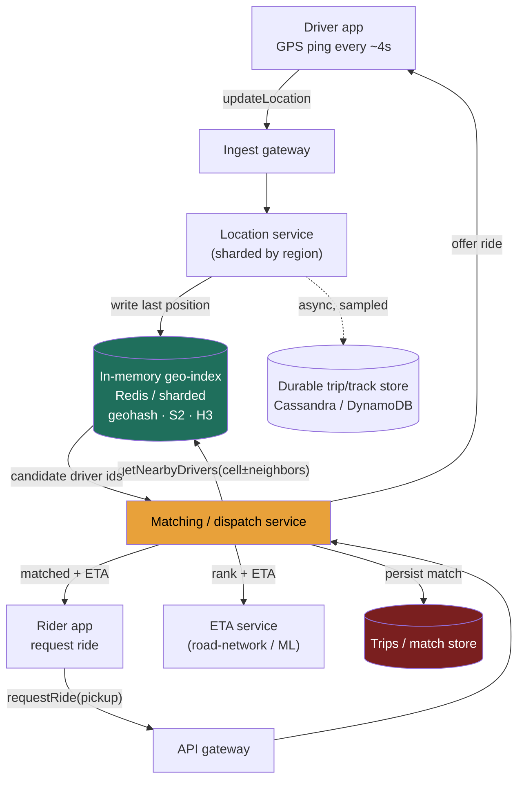

### Learning objectives
- Run the full **RESHADED** spine on a *write-dominated* geospatial problem, and recognize why that inversion (pings in ≫ nearby queries out) flips the usual read-heavy intuition from Twitter/Instagram.
- **Estimate** the headline number - **driver-location write QPS** - from active-driver count and ping interval, and show why the *live* index is a RAM/throughput problem, not a storage-capacity one.
- Choose a **geospatial index** (uniform grid vs **geohash** vs **quadtree** vs **S2** vs Uber's **H3**) from the access pattern, and explain precisely *why a uniform grid hot-spots* in a dense city while an adaptive structure does not.
- Design the **nearby-driver query**, the **matching/dispatch** service, and a credible **ETA** path - then stress the design for hot regions, write amplification, and dispatch single-points-of-failure, fixing each with a named trade-off.
- Operate at **Director altitude**: tie every choice to a requirement, quantify the cost, and name where you'd delegate a deep-dive (the ETA model, the road-network router).

### Intuition first
Picture a city carved into neighborhood squares on a giant board. Every few seconds, **every** taxi drops a pin in whatever square it's currently standing in - so the board is a live, constantly-rewritten map of "who is where." When a rider raises their hand, you don't search the whole city; you look only at *their* square and the eight touching it, grab the handful of cabs standing there, and offer the ride to the closest. The entire system is two motions: **a firehose of pins being updated** (millions of cars, every few seconds) and **a tiny, cheap lookup** in one small patch of the board (one rider, a few squares). The hard part isn't the lookup - it's that downtown at 6 p.m. one square holds *ten thousand* cabs while a suburban square holds three, so a board drawn with equal-sized squares has a few squares that are impossibly crowded and most that are nearly empty. The whole design problem is: how do you draw the squares so no single one melts, and how do you absorb the firehose of pins without it becoming the bottleneck?

That asymmetry - **a write firehose feeding a small, local read** - is the opposite of a social feed (where a few writes fan out to millions of reads), and getting that backwards is the first thing this problem tests.

---

## R - Requirements

**Functional (the defensible core):**
1. A driver's app **reports its location** continuously while online (the write firehose).
2. A rider can **find nearby available drivers** for their pickup point (the nearby query).
3. The system **matches** a ride request to a driver and **dispatches** the offer (accept/decline, with fallback to the next driver).
4. Return an **ETA / distance** for the matched driver to reach the rider.

**Explicitly CUT (state the cut - scoping *is* the signal):** surge pricing, fare calculation, payments, the post-match live trip-tracking map, turn-by-turn navigation, driver/rider onboarding and ratings, map *rendering*. Each is a real subsystem; including all of them is the "too high, hand-wavy" failure. I scope to **location ingest → index → nearby query → match/dispatch → ETA** and say so out loud.

**Clarifying questions I'd ask the interviewer (and the assumptions I'll proceed on):**
- *How fresh must a driver's position be?* → **~4 s** staleness is fine; a car 4 s stale is <60 m off at city speed. This sets the ping interval and therefore the write QPS.
- *What's the search radius / latency budget for "nearby"?* → radius ~**1-5 km**, p99 nearby-query latency **< 100-200 ms** (a human is waiting on the "finding your driver" spinner).
- *Global or single-city?* → **global**, but matching is inherently **local** - a rider in Delhi is never matched to a driver in Berlin. This hands us a natural geographic shard and is the single most useful fact in the problem.
- *Consistency bar on positions?* → **eventual / best-effort.** Losing one ping is harmless (the next arrives in 4 s); the live location store does **not** need durability or strong consistency. Trips and payments (out of scope) do.

**Non-functional requirements:**
- **High write availability** for ingest - dropping pings degrades match quality, but the ingest path must never block a driver's app.
- **Low read latency** (< ~200 ms p99) for the nearby query - it's on the rider's critical interactive path.
- **Eventual consistency** on positions; **no durability requirement** on live location (it's reconstructed every 4 s).
- **Geographic locality / regional isolation** - a city outage shouldn't take down another continent.
- **Elasticity for hot spots** - the design must survive a downtown cell that is 1000× denser than average.

**Read:write skew - the crux, stated up front.** Unlike a feed (≈100:1 *read*:write), this is **write-dominated**: every online driver writes every 4 s (~**0.5M writes/s**, derived next), while nearby queries fire only when a rider requests (~**20K/s**). That's roughly **25:1 write:read** - inverted. The architecture follows from that inversion: the expensive thing to scale is *ingesting and indexing positions*, not serving reads.

---

## E - Estimation

*Enough math to make a defensible call - round hard, state assumptions, flex the knobs.*

**Driver-location write QPS (the headline number):**
- Registered drivers globally: assume **5M**. Drivers work shifts, so not all are online; assume **~20% online at peak ≈ 1M concurrent active drivers**.
- Each active driver pings every **4 s** while online → `1M ÷ 4 s =` **250K writes/s** baseline.
- Apply a peak/burst factor (rush hour, retries) → round to **~0.5M location-update writes/sec** at peak.
- *Flex:* if "all 5M online" were the brief, it's `5M ÷ 4s ≈ 1.25M/s`. The formula `online_drivers ÷ ping_interval` is the thing to show; the interviewer can dial it. **Headline: ~500K write QPS, ~100% of it location pings.**

**Nearby-query (read) QPS:**
- Assume **~100M rides/day** globally → `100M ÷ 86,400 s ≈ 1.2K/s` average.
- Peak factor ~10× → **~12K ride requests/s**; each triggers ~1 nearby query plus a few refreshes → round to **~20K nearby reads/sec**.
- **Confirms the inversion: 0.5M writes/s vs 20K reads/s ≈ 25:1 write:read.**

**Storage - and the key realization that this is *not* a storage problem:**
- A live driver position is **ephemeral**: only the *latest* point matters for matching; no history needed. One record ≈ `driverId(8) + lat(8) + lng(8) + ts(8) + status(1) ≈ 40 B`, call it **~100 B** with overhead.
- `1M active drivers × 100 B =` **~100 MB** of hot location state. That fits in **RAM on a single beefy node** - trivially. The live index is a **throughput/RAM** problem, not a capacity one. (Replicate and shard it for QPS and blast-radius, not for size.)
- *Durable* data (out of the hot path): drivers ~`5M × 1 KB = 5 GB`; trips ~`100M/day × 1 KB × 365 ≈ 36 TB/yr` → a sharded durable store, but **not** what the matching path touches.

**Bandwidth:** ingest ≈ `0.5M/s × 100 B ≈ 50 MB/s ≈ 0.4 Gbps` of payload (more with TLS/connection overhead, but the payload is tiny). Reads are negligible by comparison.

**Cache / working set:** the entire live index (~100 MB) *is* effectively the working set and lives in memory - there's no cold tier to cache *from*. The "cache" here is the in-memory geo-index itself.

**Instance count (location/ingest tier):** a single in-memory location-service node sustains ~**10-50K ops/s** comfortably; `0.5M/s ÷ ~20K ≈` **~25 nodes**, sharded by region (round to *tens* of nodes), each replicated. That fleet, not a database, is the spend.

**The one-line takeaway from E:** the system is defined by **~0.5M position writes/s into a ~100 MB in-RAM index, serving ~20K tiny local reads/s** - so optimize the *write+index* path and keep the index in memory.

---

## S - Storage

Two data classes with opposite needs - matching them to stores is the S step.

**1. Live driver location + the geo-index (ephemeral, write-hot, read-local).**
- *Access pattern:* ~0.5M writes/s of last-known position; point-and-radius reads; no history; loss-tolerant; ~100 MB.
- *Choice:* an **in-memory store** - **Redis** (its **geospatial** commands `GEOADD`/`GEOSEARCH` encode points as **geohash**-scored sorted-set members), or an in-process sharded geo-index service fronted by Redis. Positions are kept in RAM, sharded by region, replicated async for availability.
- *Rejected:* a disk-backed relational/LSM store (Postgres/Cassandra) as the *live* index. It would durably persist 0.5M writes/s of data we **explicitly don't need to keep** - paying write-amplification and disk I/O for a value overwritten 4 s later. We reject durability because the R step said positions are reconstructed every 4 s; spending IOPS to persist them is the classic over-engineering tell here.

**2. Durable entities: drivers, riders, trips, match records (read-mostly, must persist).**
- *Access pattern:* keyed lookups by id, modest write rate, must survive crashes, some need transactions (a trip's lifecycle).
- *Choice:* a **partitioned key-value / wide-column store** (**DynamoDB** or **Cassandra**) for trips/profiles at scale, or **Postgres** (sharded) if relational integrity on trips matters more than raw scale. This is the durable system of record, off the matching hot path.
- *Rejected:* putting these in the in-memory tier - we'd lose trip records on a node failure, which is unacceptable (unlike positions). Different durability requirement → different store. *Also rejected:* a single Postgres for trips at 36 TB/yr - it must be sharded (by `city/region` or `trip_id` hash).

**The index *structure* itself** (geohash vs quadtree vs S2/H3) is the heart of this problem and is decided in **Evaluation**, where the dense-city hot-spot forces the choice.

---

## H - High-level design



**Happy path, in prose:**
1. **Ingest.** A driver's app sends `updateLocation` every ~4 s to the nearest **ingest gateway**, routed to the **location service** shard that owns that geographic region. The service overwrites that driver's last-known position in the **in-memory geo-index** (computing the driver's cell id - geohash/S2/H3 - and moving them between cell buckets if they crossed a boundary). This path is fire-and-forget and must be cheap: it's running 0.5M times/sec.
2. **Request.** A rider sends `requestRide(pickup_lat, pickup_lng)` to the **matching service**.
3. **Nearby query.** Matching computes the pickup's cell id, asks the geo-index for **that cell plus its neighbors** (to avoid the boundary problem - a driver 50 m away but in the adjacent cell must still be found), and gets back a small candidate set of online, available drivers.
4. **Rank + ETA.** Matching filters to *available* drivers, calls the **ETA service** to score candidates by realistic drive time (not straight-line distance), and picks the best.
5. **Dispatch.** It **offers** the ride to that driver; on decline/timeout it **falls back** to the next candidate (a short serialized offer loop, or a small parallel batch). On accept, it **persists the match** to the durable trip store and returns `{driver, ETA}` to the rider.

The asymmetry is visible in the diagram: the thick, hot edge is **driver → geo-index** (0.5M/s); the rider path is thin and local.

---

## A - API design

Kept deliberately small - the four functional requirements map to four calls.

```
# Driver ingest (the firehose) - tiny payload, fire-and-forget
POST /v1/drivers/{driverId}/location
  body: { lat, lng, ts, status }          # status: available | on_trip | offline
  → 202 Accepted                          # no body; never block the driver app

# Nearby query (internal, used by matching; also exposable for "cars near you")
GET  /v1/drivers/nearby?lat=&lng=&radius_m=2000&limit=20
  → 200 { drivers: [ { driverId, lat, lng, etaSeconds } ] }

# Rider requests a match (orchestrates nearby → rank → dispatch)
POST /v1/rides/request
  body: { riderId, pickup:{lat,lng}, dropoff:{lat,lng} }
  → 200 { rideId, driver:{ driverId, lat, lng }, etaSeconds }
  → 503 if no driver found in radius (caller widens radius / retries)

# Driver responds to an offer
POST /v1/rides/{rideId}/respond
  body: { driverId, decision }            # accept | decline
  → 200 { status }                        # confirmed | reoffered
```

**Design notes (each a choice with a rejected alternative):**
- `updateLocation` returns **202**, not 200-with-body - we **reject** any synchronous read-back on ingest; the driver app must never wait, and we won't pay to serialize a response 0.5M times/sec.
- `requestRide` is a **single orchestrating call** rather than making the rider's client chain `nearby` → `respond` itself - we **reject** client-side orchestration because dispatch logic (fallback ordering, locking a driver so two riders can't grab the same car) must be server-authoritative.
- Ingest is plain **HTTPS POST** for simplicity here; at Uber's scale a persistent **gRPC/WebSocket** stream removes per-ping TLS-handshake overhead. We **reject** opening that complexity in v1 but flag it as the first ingest optimization (see Design evolution).

---

## D - Data model

**Live position (in-memory geo-index) - the hot path:**

| Field | Type | Notes |
|---|---|---|
| `driverId` | int64 | key |
| `lat`, `lng` | float64 | last reported point |
| `cellId` | int64 / string | geohash prefix / S2 / H3 id - the **bucket** |
| `status` | enum | available / on_trip / offline |
| `ts` | int64 | last-update epoch ms (staleness check) |

- **Logical layout:** a map from **`cellId` → set of drivers in that cell**, so a nearby query is "read these few cell buckets," plus a `driverId → position` map for direct updates. In **Redis**, this is a geo sorted-set per region (`GEOADD region driverId`), which encodes the geohash internally and answers `GEOSEARCH ... BYRADIUS`.
- **Partition / shard key = geographic region (a coarse cell, e.g. city or S2 level-8 cell).** This is the load-bearing decision: because **matching is always local**, sharding by region means a nearby query hits **one shard**, and a city's traffic is isolated to its shard's blast radius. We **reject sharding by `driverId` hash** - it would scatter one neighborhood's drivers across every shard, turning a single local query into a scatter-gather across the whole fleet.

**Durable entities (off the hot path):**

| Table | Key | Shard key | Store |
|---|---|---|---|
| `drivers` | `driverId` | `driverId` hash | DynamoDB / Cassandra |
| `trips` | `tripId` | `city` or `tripId` hash | DynamoDB / Cassandra (Postgres if relational) |
| `match_log` | `rideId` | `rideId` hash | durable store; written on match |

- **Indexes:** the only "index" that matters on the hot path is the **spatial** one (the cell bucketing); on durable trips, secondary indexes by `driverId` and `riderId` for history (built lazily, off the matching path). We **reject** rich secondary indexing on the live store - it's a transient bucket map, not a query database.
- **Where data lives:** positions in RAM (regional shards); trips/profiles in the durable partitioned store, in the rider's home region with cross-region replication for the durable set only.

---

## E - Evaluation

Re-check against the NFRs and break the design on purpose. Four bottlenecks, each fixed with a *named* trade-off.

**Bottleneck 1 - the dense-city hot spot (the central problem).**
A **uniform grid** (equal-sized cells, e.g. fixed-precision geohash) *hot-spots* because **driver density is wildly non-uniform**: a downtown geohash cell at rush hour holds 10,000 drivers while a rural cell holds 3. The crowded cell's bucket is huge, its owning shard is saturated by updates and queries, and a nearby query there must scan thousands of candidates - while 95% of cells sit nearly empty. *Equal-area cells, unequal load.* This is why the grid choice is a **load-balancing** decision, not a geometry detail.

*Fix - use an **adaptive / hierarchical** index instead of a fixed grid:*
- **Quadtree:** recursively split a cell into 4 quadrants **only when it exceeds a capacity threshold** (say 100 drivers). Dense downtown subdivides deep (small cells, bounded bucket size); empty countryside stays one big cell. Trade: it's an **in-memory tree that must be rebuilt/rebalanced** as density shifts, and updates cost a tree traversal - more complex than a flat hash, but bucket sizes stay bounded regardless of density.
- **S2 (Google):** projects the sphere via a **Hilbert curve** into hierarchical **64-bit cell ids**, levels 0-30 (level-12 ≈ **3.3-6.4 km²**, level-16 ≈ **~150 m**). The Hilbert ordering keeps spatially-near cells numerically-near, so a radius query becomes a few **range scans** over id intervals, and you can **mix levels** (coarse cells where sparse, fine where dense) to bound bucket size. Trade: more machinery than a geohash string; you manage a cell-covering per query.
- **H3 (Uber's actual production system):** a **hexagonal** hierarchical grid. Uber built it because square/geohash cells have **non-uniform neighbors** - edge neighbors at distance `d`, diagonal neighbors at `d√2` - so "expand the search ring" is ambiguous; **hexagons have 6 neighbors all at equal distance**, making k-ring expansion and density/dispatch math clean and uniform. Trade: hexagons **can't tile perfectly hierarchically** (a parent hex's children are approximate, not exact subdivisions) - an accepted imperfection Uber takes for the adjacency win.

*Why not just shrink the uniform grid globally?* **Rejected:** uniformly tiny cells make a *sparse* nearby query touch hundreds of empty cells (read amplification) and explode the cell count - you'd trade the dense-city hot spot for a sparse-region scan. The point of quadtree/S2/H3 is **variable resolution**: small cells exactly where it's dense, large where it's sparse.

**Bottleneck 2 - the hot *region shard* (skew across machines).**
Even with an adaptive index, the *shard* that owns Manhattan handles vastly more ingest+queries than the one owning a small town - a hot shard.
*Fix:* shard at a **fine enough granularity** that a single hot metro can be **split across multiple shards** (sub-divide a city's cells over several nodes) and **replicate** the hot region's index for read scaling. Trade: finer shards mean a query near a shard boundary must **fan out to 2-4 shards** and merge - we accept a small scatter on boundary queries to keep any one shard survivable. (This is the same hot-key lesson from 3.7, applied to geography.)

**Bottleneck 3 - write amplification on cell crossings.**
A moving driver crossing a cell boundary must be **removed from the old bucket and added to the new** - and at fine resolution near a boundary, a driver can flap between two cells every few seconds, doubling index churn.
*Fix:* use **coarse-enough cells for ingest** (bucket churn is rare) while still answering fine radius queries via the hierarchy, and **hysteresis** (only move a driver if they're clearly inside the new cell). Trade: slightly coarser buckets mean a few more candidates per query - cheap compared to constant re-bucketing at 0.5M/s.

**Bottleneck 4 - dispatch as a single point of failure / double-booking.**
The matching service must ensure **two riders don't get offered the same car**, and a crashed matcher mid-dispatch shouldn't strand a ride.
*Fix:* make matching **stateless and regionally partitioned** (many instances, each owning a region's requests), and put a **short-lived lock/reservation** on a driver in the in-memory store the instant they're offered (TTL'd, so a crashed matcher's lock auto-expires and the driver re-enters the pool). Trade: a lock adds a round-trip and a brief window where an offered-but-not-accepted driver is unavailable to others - we accept minor under-utilization to prevent double-booking, and a TTL bounds the damage from a matcher crash.

**Re-check vs NFRs:** write availability (ingest is 202, fire-and-forget, regionally sharded ✓); read latency (nearby query hits one-to-few shards over an in-memory bounded bucket → well under 200 ms ✓); eventual consistency / no durability on positions (✓ by design); regional isolation (region = shard, so a metro outage is contained ✓); hot-spot survival (adaptive index + fine shard split + replication ✓).

---

## D - Design evolution

**At 10× (10M concurrent drivers, ~5M writes/s, ~200K nearby reads/s):**
- **Ingest becomes the dominant cost.** Move drivers off per-ping HTTPS onto a **persistent gRPC/WebSocket stream** (kill the handshake tax), and/or front ingest with a **partitioned log (Kafka)** so the location service consumes pings at its own pace and bursts are absorbed in the log. Trade: a log adds end-to-end latency to position freshness - acceptable because positions are already ~4 s stale by spec.
- **Adapt the ping rate dynamically:** a driver stopped at a light or parked needn't ping every 4 s; an idle/stationary driver backs off to 10-30 s, a fast-moving one stays at 4 s. This can cut write QPS by a large factor for free. Trade: more client logic and variable freshness.
- **Split the index by resolution tier** and keep the whole live index sharded across the location fleet (~250 nodes at 10×), with the durable trip store scaled independently (it never sat on the hot path).

**Hardest trade-offs to defend:**
- **Index granularity** is a genuine dilemma: coarse cells minimize ingest churn but bloat query candidate sets; fine cells bound query work but explode bucket-crossing writes and sparse-region scans. The honest answer is **variable resolution (quadtree/S2/H3)** precisely so you don't pick one global cell size - that's *why* Uber didn't ship a uniform grid.
- **Freshness vs ingest cost:** every second you shave off the ping interval multiplies write QPS linearly. The 4 s choice is a product decision (match quality) traded against fleet cost - and dynamic ping rate is how you escape the linear penalty.
- **Local sharding vs cross-border trips:** region sharding is the win, but airport/border cases (pickup in one shard, drivers pooled in another) force boundary fan-out. Accepted as a small minority of queries.

**What I'd revisit:** whether Redis-geo suffices or a **purpose-built in-memory geo-service** (quadtree/H3 in-process) is warranted - I'd benchmark before committing. And whether trips need a relational store (disputes, accounting) vs a wide-column one - that's a data-integrity call, not a scale call.

**Where I'd delegate the deep-dive (the Director move):**
- **ETA / routing** is its own discipline - real drive-time needs a **road-network graph + live traffic + historical models**, not Euclidean distance. *"I'd have the Maps/Routing team own ETA behind a clean `etaSeconds(from, to)` interface; my prior is a contraction-hierarchies router seeded by historical speeds, refined by an ML model on live conditions - but I'd let them benchmark and own the SLA."* Naming the boundary and the interface - rather than hand-rolling Dijkstra on the whiteboard - is the altitude signal.
- **Index-structure bake-off (geohash vs S2 vs H3)**: *"I'd have the platform team benchmark bucket-size distribution and query p99 under our real density on the top-20 metros before standardizing - my prior is H3 for the adjacency uniformity, but that's a decision I'd want measured, not asserted."*
- **Surge/pricing and fraud** are entire adjacent systems I'd scope out and delegate, consuming the same location signal.

---

## Trade-offs table - the pivotal decisions

| Decision | Option A | Option B | Option C | Use when… |
|---|---|---|---|---|
| **Geo-index structure** | **Uniform grid / fixed geohash** - flat hash on a fixed-precision prefix; dead simple | **Quadtree** - adaptive 4-way split on capacity; bounded bucket size | **S2 / H3** - hierarchical 64-bit cells (Hilbert) / hexagons (uniform neighbors) | Grid: uniform density / prototype. Quadtree: skewed density, in-memory, you'll maintain a tree. **S2/H3: production geo at scale (H3 = Uber's choice for clean adjacency).** |
| **Live-location store** | **In-memory (Redis-geo / sharded service)** - RAM, async-replicated, loss-tolerant | **Disk-backed durable DB** (Cassandra/Postgres) | — | In-memory: positions are ephemeral + rewritten every 4 s (the right call). Durable DB: only if you must keep position *history* (you don't, for matching). |
| **Shard key for the index** | **Geographic region / cell** - local query hits one shard | **`driverId` hash** - even write spread | — | Region: matching is local → one-shard reads + regional isolation (the right call). driverId-hash: only if queries weren't geographic (they are), so rejected - it scatter-gathers every nearby query. |

---

## What interviewers probe here (Director altitude)

- **"What's the read:write ratio, and why does it matter?"** - *Strong signal:* immediately names it **write-dominated** (~0.5M pings/s vs ~20K nearby reads/s, ~25:1 write:read) and *inverts* the usual feed intuition, then designs the ingest+index path as the thing to scale. *Red flag:* assumes read-heavy "like every web app" and over-builds the read cache.
- **"Why does a uniform grid fall over in a dense city, and what do you use instead?"** - *Strong:* equal-area cells but wildly unequal density → a downtown bucket holds thousands while most are empty, hot-spotting one shard and bloating that query; fix with **variable resolution** (quadtree/S2/H3), naming why *not* a globally-tiny grid (sparse-region scan + cell explosion). *Red flag:* "just add more cells" or no awareness that density is the problem.
- **"Do you persist driver locations? At what consistency?"** - *Strong:* **no durability, eventual consistency** - a position is rewritten every 4 s, so spending IOPS/durability on it is waste; keep it in RAM. *Red flag:* a durable, strongly-consistent write per ping at 0.5M/s (massive over-engineering and cost).
- **"Where would you delegate, and how?"** - *Strong:* hands **ETA/routing** to a Maps team behind a clean interface (with a defensible prior: contraction-hierarchies + live traffic + ML), and proposes a **measured bake-off** for the index structure rather than asserting one. *Red flag:* tries to whiteboard Dijkstra and live-traffic modeling personally (too deep, wrong altitude) - or hand-waves "the ETA service computes it" with no interface or prior.
- **"What does this cost to run, and what's the dominant line item?"** - *Strong:* the **ingest+index fleet** (tens of in-memory nodes, replicated), driven by ping rate × online drivers - and proposes **dynamic ping rate** and **streamed ingest** as the cost levers; the durable store is cheap by comparison. *Red flag:* sizes a giant database and ignores that the live index is ~100 MB.

---

## Common mistakes

- **Treating it as read-heavy.** It's write-dominated; the firehose is ingest, not reads. Mis-sizing this mis-designs everything downstream.
- **A uniform grid / fixed geohash precision.** Guarantees a dense-city hot spot - equal-area cells, unequal density. Use quadtree/S2/H3 for variable resolution.
- **Persisting every ping durably.** Positions are ephemeral and rewritten every 4 s; durability and strong consistency here are pure waste. Keep them in RAM, loss-tolerant.
- **Sharding the index by `driverId` instead of region.** Turns a one-shard local query into a fleet-wide scatter-gather. Matching is local - shard by geography.
- **Ranking by straight-line distance.** A driver 200 m away across a river is 15 min by road. Real **ETA** needs the road network - and is the thing to **delegate**, not hand-roll.
- **Forgetting the cell-boundary problem.** A driver 50 m away in the *adjacent* cell must still be found - query the cell **plus its neighbors** (clean with H3's uniform 6-neighbor ring).
- **No reservation/lock on dispatch.** Two riders get offered the same car. A short TTL'd lock prevents double-booking and self-heals on matcher crash.

---

## Interviewer follow-up questions (with model answers)

**Q1. Estimate the driver-location write QPS, and explain why that number drives the architecture.**
> *Model:* Assume ~5M registered drivers, ~20% online at peak ≈ **1M concurrent**, each pinging every **4 s** → `1M ÷ 4s = 250K/s` baseline, ~**0.5M writes/s** with a peak factor. Nearby reads are only ~**20K/s** (≈100M rides/day, peaked), so it's **~25:1 write:read - write-dominated**, the inverse of a social feed. That inversion is the whole architecture: the scaling problem is **ingesting and indexing positions**, not serving reads, so I keep the index **in RAM** (it's only ~100 MB), shard it **by region**, and obsess over the cheapness of the write path (202, fire-and-forget, eventually a streamed/Kafka ingest with dynamic ping rate). I do *not* build a giant read cache - there's barely any read load by comparison.

**Q2. Walk me through geohash vs quadtree vs S2, and why a naive grid hot-spots.**
> *Model:* A **uniform grid / fixed-precision geohash** uses equal-area cells, but driver density is wildly unequal - a downtown cell holds thousands, a rural cell holds three. So one cell's bucket is enormous (slow queries, saturated shard) while most are empty: **equal area, unequal load → hot spot.** Shrinking the global cell size doesn't fix it - now sparse queries scan hundreds of empty cells and the cell count explodes. The fix is **variable resolution.** A **quadtree** splits a cell into 4 only when it exceeds a capacity threshold, so dense areas subdivide deep and sparse areas stay coarse - bucket sizes stay bounded, at the cost of maintaining an in-memory tree. **S2** gives hierarchical 64-bit cells ordered along a **Hilbert curve** (spatially-near = numerically-near), so radius queries become range scans and you can mix levels. **H3 (Uber's production choice)** is hexagonal, chosen because hexagons have **6 equidistant neighbors** (squares have edge neighbors at `d` and diagonal at `d√2`), making ring-expansion and density math uniform - accepting that hexes don't subdivide perfectly hierarchically.

**Q3. Do you store driver location in a database? Defend the consistency and durability choice.**
> *Model:* **No durable database for the live position** - I keep it in an **in-memory store** (Redis-geo or a sharded in-process geo-index), **async-replicated**, **eventually consistent**, **loss-tolerant**. The justification is from the requirements: a position is **overwritten every 4 s**, so it has no archival value for matching and losing one ping is invisible (the next arrives in 4 s). Paying for durability and strong consistency on 0.5M writes/s of disposable data is the classic over-engineering trap - it buys a guarantee the use case doesn't need and costs enormous write-amplification and IOPS. The durable store is reserved for **trips, matches, and profiles**, which genuinely must survive crashes. Different durability requirement → different store: that separation is the point.

**Q4. A driver is 50 m from the rider but in the next cell over and gets missed. What's wrong and how do you fix it?**
> *Model:* That's the **cell-boundary problem** - a radius query that reads only the rider's own cell misses anyone in an adjacent cell, even if they're closer than someone in-cell. Fix: query the rider's cell **plus its neighboring cells** and then filter by true distance/ETA. With a square/geohash grid you must handle 8 neighbors with the edge-vs-corner distance asymmetry; this is exactly why **H3's hexagonal k-ring** is cleaner - 6 neighbors all equidistant, so "expand the ring by k" is unambiguous. Practically: pick a cell resolution near the search radius, pull cell + ring, union the buckets, then rank. Trade-off: you read a few extra buckets (more candidates) to guarantee correctness at boundaries - cheap and necessary.

**Q5. How would you build ETA, and would you build it yourself?**
> *Model:* **I would not hand-roll it on the whiteboard - I'd delegate it behind a clean interface** `etaSeconds(from, to)`. Naively it's Euclidean distance, which is wrong (rivers, one-ways, traffic). A real ETA needs the **road-network graph** with a fast shortest-path (contraction hierarchies / A*), **historical speed profiles** by time-of-day, and a **live-traffic / ML correction**. At Director altitude my answer is: *the Maps/Routing team owns ETA and its SLA; my prior is contraction-hierarchies seeded by historical speeds with an ML layer on live conditions, but they should benchmark and own it.* The matching service just calls the interface to rank candidates. Trying to derive Dijkstra and traffic models myself would be operating two levels too low - the signal here is knowing where my depth ends and delegating it credibly with a stated prior.

---

### Key takeaways
- This problem is **write-dominated** (~0.5M location pings/s vs ~20K nearby reads/s, ~25:1) - the *inverse* of a feed; design the **ingest + index** path, not a read cache. Always derive the headline write QPS as `online_drivers ÷ ping_interval`.
- The live driver-location index is **~100 MB and ephemeral** - keep it **in RAM** (Redis-geo / sharded service), async-replicated, **eventually consistent, no durability**. Persisting disposable per-ping data is the over-engineering trap. Durable trips/profiles live in a separate partitioned store.
- A **uniform grid hot-spots** because density is non-uniform (equal-area cells, unequal load). Use **variable resolution** - **quadtree** (capacity-split), **S2** (Hilbert-ordered 64-bit cells), or **H3** (hexagons, 6 equidistant neighbors - Uber's actual choice) - and query the **cell + its neighbors** to handle boundaries.
- **Shard the index by geographic region**, never by `driverId` hash - matching is local, so region-sharding gives one-shard queries, regional isolation, and a path to split a hot metro across nodes (replicate the hot region for reads).
- **Director moves:** quantify the cost (the ingest fleet is the line item; dynamic ping rate + streamed/Kafka ingest are the levers), put a **TTL'd reservation lock** on dispatch to stop double-booking, and **delegate ETA/routing** to a Maps team behind `etaSeconds(from,to)` with a stated prior - know where your depth ends.

> **Spaced-repetition recap:** Uber proximity = a **write firehose** (every online driver pings every ~4 s → ~0.5M writes/s) feeding a **tiny local read** (nearby query, ~20K/s) - **write-dominated, ~25:1**, the inverse of a feed. Live positions are **ephemeral → keep ~100 MB in RAM**, eventually consistent, no durability. A **uniform grid hot-spots** in dense cities (equal area, unequal load) → use **quadtree / S2 / H3** for variable resolution (H3's hexagons give uniform neighbors - Uber's real choice), querying **cell + neighbors**. **Shard by region** (local matching), TTL-lock the dispatch, and **delegate ETA** to routing behind a clean interface.

---

*End of Lesson 5.7. The geo-index here reuses consistent-hash sharding (2.6) and the in-memory cache discipline (3.7), but inverts the read:write assumption that drove Twitter/Instagram - a reminder that **RESHADED's R and E steps decide the architecture before any box is drawn.** Next: 5.8 Dropbox/Drive - the large-file, sync-and-conflict problem.*
