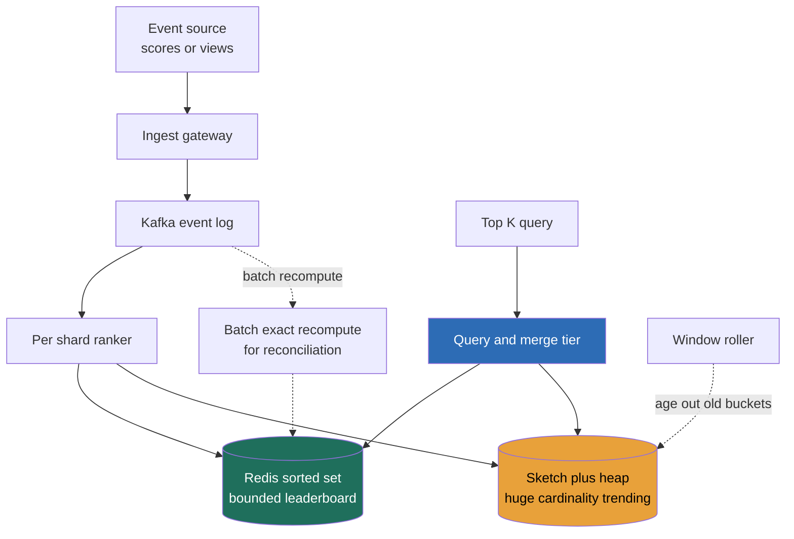

> **Why this gets asked at Director level:** Top-K and leaderboards look like two unrelated problems and are really one, *who are the heavy hitters, ranked, right now?*, under three knobs: precision, cost, freshness. The trap is that the math is seductive. An IC dives into Count-Min Sketch row/column tuning or sorted-set memory layout and never makes a decision; a Director interrogates whether **exact rank is even a requirement**, frames three options in five minutes, and picks one against the numbers. Meta asks the "top-10 songs in the last hour" variant; YouTube's "top-K most-viewed" is on Meta's most-asked list; gaming leaderboards show up at Riot, Blizzard, Strava, and Duolingo. The canonical failure is computing a sketch the question didn't need, or quoting "just use a Redis sorted set" without the memory bill.

### Learning objectives

1. See **trending/top-K and the leaderboard as one problem**, *ranked heavy hitters over a window*, whose only real axes are **precision, cost, and freshness**, all set in the Requirements step.
2. Interrogate whether **exact global rank is a requirement** at all; default to **exact top-N + percentile buckets** for the tail, and carry the memory math (~1 GB per 10M members in a sorted set).
3. Pick between **exact (Redis sorted sets)**, **approximate (Count-Min Sketch + heap)**, and **batch (MapReduce/stream)** from window size, cardinality, and lag tolerance, not from taste.
4. Apply **CMS** here as a building block (mechanics stay in the count-min-sketch building block); reuse sharded-counter reasoning for the write-hot score path.
5. Operate at Director altitude: quantify the memory/compute bill, name where you'd delegate sketch tuning, and defend the freshness/cost dial.

### Intuition first

Picture two scoreboards. The first is a **stadium leaderboard**: a few thousand named athletes, ranked exactly top to bottom, updating as scores come in. The second is the **trending board at a news kiosk**, "the 10 hottest stories right now?", out of *millions* of articles, almost all of which nobody is reading. Same shape: *rank the heavy hitters over a recent window.* But the second board has a tell most people miss: **you do not need to rank article #4,000,000.** Nobody asks for the exact rank of a story with three views. You need the **top 10 dead-on**, and for everything else a rough bucket ("popular / niche / cold") is plenty.

That is the entire lesson. When the population is small and bounded, a game's ranked players, keep an exact sorted structure and pay for it. When the population is huge and the tail is worthless, trending hashtags, hot URLs, top songs, keep an **exact small head and an approximate tail**: a tiny sketch counts frequencies cheaply, a small heap holds the current top-K. The IC mistake is treating "rank everything exactly" as the requirement, then heroically scaling a structure that costs ~1 GB per 10M members. The Director move is asking, *out loud, in the first two minutes:* "Exact rank for the whole population, or exact top-N and buckets for the rest?" The answer collapses the design.

Hold three ideas: **trending and leaderboard are the same ranked-heavy-hitters problem; the requirement is rarely "exact rank for everyone"; and precision, cost, and freshness are one coupled dial you set in R, not three.**

---

## R: Requirements

> Pin the scope, and, because this is an altitude test, spend R interrogating **how exact** and **how fresh** the ranking must be. That question, not any data structure, decides the architecture.

**The merge, stated up front (the framing that earns the level):** "Trending / top-K heavy hitters" and "real-time leaderboard" are the **same problem**, a ranked list of the highest-scoring entities over a window. They differ on exactly two requirement numbers, and I drive the whole design off them: **cardinality** (a game ranks ~10-50M players, bounded; trending spans ~billions of hashtags/URLs/songs, almost all cold) and **precision of rank** (exact total order, or exact top-N plus coarse buckets for the tail).

**Clarifying questions I'd ask (with assumed answers):**

- *Exact rank for every entity, or exact top-K and approximate tail?* → **Top-K exact; tail bucketed.** The load-bearing answer. "Player #4,000,001 vs #4,000,002" almost never matters; "top 100 / top 1%?" does.
- *Window, all-time, or rolling?* → **Both exist.** Leaderboard is all-time or per-season; trending is a **rolling 1-hour / 24-hour window**, and the window is what makes trending hard, since old events must age out.
- *How fresh?* → **Seconds of lag is fine** for trending; near-real-time for live ranked play. A dial, not a constant.
- *Read:write shape?* → **Write-heavy ingest, read-heavy board.**

**Functional requirements:**

1. **Ingest** score/score-delta or count events at high rate.
2. **Top-K query:** return the K highest-ranked entities over the window.
3. **Rank/score lookup:** "what's my rank and score?" (leaderboard case).
4. **Window roll:** trending must reflect a *recent* window, aging out old events.
5. **Around-me / percentile:** "the 10 players around me," or "you're in the top 2%."

**Explicitly CUT (scoping is the signal):** anti-cheat/score validation (delegated to trust-and-safety), social graph, notifications, historical replay of past leaderboards, cross-game federation. I scope to **ingest → rank → top-K + rank/percentile lookup → window roll.**

**Non-functional requirements:**

- **Tunable precision**, exact top-K, with a requirement-driven choice of how exact the tail is. The single most important NFR here.
- **Freshness within a stated budget**, seconds for trending; near-real-time for live ranked play.
- **Write-throughput tolerance**, absorb a hot key (a viral hashtag, a streamed top song) without a single-row write wall.
- **Bounded memory/cost**, must not silently grow to "~1 GB per 10M × every window × every shard."
- **Availability**, the board is AP; a stale-by-seconds top-K is fine. *Not* a strong-consistency problem (contrast the strong-consistency problems).

**The load-bearing tension, named:** **exact-and-expensive vs 99%-accurate-and-cheap.** Exact rank for a bounded population is a solved problem (a sorted set) at linear memory. Exact rank for a billion-key trending stream is *not* worth its cost, the requirement was never "rank the tail." The whole design hinges on refusing to over-specify precision.

---

## E: Estimation

> **RESHADED adaptation:** Estimation is the *decision driver* here, not background sizing. The three numbers from R, **window size, cardinality, lag tolerance**, pick the approach directly. I compute the memory cost of "exact everything" and let it disqualify itself.

**Leaderboard (bounded cardinality), the sorted-set bill.** A Redis sorted set stores, per member, the ID + score + skiplist/hash overhead, ~100 B. So `10M × 100 B ≈ 1 GB` per leaderboard. **The number to carry: ~1 GB per 10M members.** At 50M, ~5 GB, one beefy node or a few shards. **Bounded and cheap; exact rank is affordable here.** Writes: 1M concurrent players posting every ~10 s ≈ **100K updates/s**, which exceeds one `ZADD` key's ceiling under a hot board, so writes shard (below), but the *data* fits trivially in memory.

**Trending (huge cardinality), why exact disqualifies itself.** Keep an **exact** count per key over a 1-hour window across **1B distinct keys**: `1B × ~50 B ≈ 50 GB` *per window*, write-hot and rolling, times replicas. The kicker: **you discard ~99.9999% of it**, you only return the top ~100. Paying 50 GB to compute a list of 100 is the IC trap. A **Count-Min Sketch** holds frequency estimates in **fixed sub-linear space, tens of MB regardless of cardinality**, paired with a **min-heap of size K**. `~MBs + a 100-entry heap` replaces 50 GB, and the one-sided error (overestimates only) means a false-high on a *cold* key still can't crack the top-100.

**Ingest rate.** A global trending firehose peaks at `~1M events/s`. The CMS update is O(d) hashes, the heap touch O(log K), both cheap, both shardable. A single hot key (one viral hashtag) is a **write-hot counter**, the exact sharded-counter problem; shard it or let per-shard sketches absorb it, then merge.

**What estimation decided:** bounded cardinality → **exact sorted set at ~1 GB/10M**. Huge cardinality, worthless tail → **exact is 50 GB discarded**, so **CMS + heap (MBs)**. Window and lag tolerance decide **live** vs **micro-batch**. The numbers, not preference, draw every line.

---

## S: Storage

> Two regimes, picked by cardinality. Same query, different store, that *is* the lesson.


**1. Bounded leaderboard → in-memory sorted set (exact).** A **Redis sorted set** (skiplist + hash), sharded for write throughput: `ZADD` on update, `ZREVRANGE 0 K` for top-K, `ZREVRANK` for "my rank," `ZRANGEBYSCORE` for "around me", all O(log N) or better, exact, ~1 GB/10M. The requirement (bounded population, exact rank) and the store match perfectly. *Rejected, relational `ORDER BY score LIMIT K`:* every write churns the index and top-K hammers the DB under read load; the sorted set is purpose-built and in-memory. *Rejected, Cassandra/wide-column:* no native ranked-range read.

**2. Huge-cardinality trending → sketch + heap (approximate).** A **Count-Min Sketch** for frequency estimates + a **min-heap of size K** for the current leaders (both standard tools); per-shard sketches **merge** by cell-wise add at query time. *Rejected, an exact per-key counter map:* 50 GB/window for a discarded list of 100, the over-engineering this question screens for.

**3. The durable event log (truth, for reconciliation).** **Kafka** holds the raw stream. The live board is a fast, loss-tolerant projection; a board that must be *exactly* reconciled (tournament payout) is recomputed from the log in **batch**, the same display-vs-billing split as the YouTube view count. Fast board for display; slow exact pipeline for money.

**Window state** (rolling trending) lives as **bucketed sub-sketches**, one CMS per minute, summed over the window and dropped as they age (Data model, below).

---

## H: High-level design

> The shape to make visible: a **streaming ingest tier** fanning events into **per-shard rankers**, and a **query/merge tier** assembling the top-K, exact via sorted sets for bounded populations, approximate via sketch+heap for huge ones.



**Happy path, compressed.** Events land on the **ingest gateway**, append to **Kafka** (durable truth), and fan out to **per-shard rankers**. For a **bounded leaderboard**, each shard owns a slice of members in a **Redis sorted set**; a top-K query reads each shard's local top-K and the **merge tier** combines them (K from each of S shards → final K). For **huge-cardinality trending**, each shard keeps a **per-window CMS + local heap**; the merge tier sums the sketches and merges the heaps. The **window roller** drops expired buckets. When a board must be *exactly* right (payouts, audits), a **batch job** recomputes from the Kafka log, fast path approximate-and-fresh, slow path exact-and-reconciled.

**The shape to notice:** the same query routes to **one of two engines by cardinality**, both behind a merge tier combining per-shard partials. Sharding buys write throughput and memory; the merge step keeps the top-K correct across shards.

<details>
<summary>Go deeper, why merging local top-K per shard is correct (IC depth, optional)</summary>

For an **exact** sorted set sharded by member, a member lives on exactly one shard, so its score is complete on that shard. The global top-K is contained in the **union of each shard's local top-K**: any entity in the global top-K must be in its own shard's top-K (it can't be beaten by K others on its own shard without being beaten by K others globally). So reading top-K from each of S shards and merging yields an exact global top-K, at the cost of reading `S × K` candidates. This is a classic top-K merge and is exact for exact per-shard scores.

For an **approximate** CMS, the sketch itself is what's approximate, not the merge: CMS is linear, so the cell-wise sum of per-shard sketches equals the sketch you'd get from the combined stream. The per-shard heaps are a candidate cache; the merge re-queries the merged sketch for final frequencies. Error stays one-sided (overestimate only), so a true heavy hitter is never *under*counted out of the top-K.

</details>

---

## A: API design

> A small surface; the meaningful choices are the **precision flag** and that score-write and board-read are separate paths.

```
# --- Ingest (write-heavy) ---
POST /v1/boards/{boardId}/events
  body: { entityId, delta }            # score delta or +1 count
  -> 202 Accepted                       # async; logged, fanned to rankers

# --- Top-K (read-heavy) ---
GET  /v1/boards/{boardId}/top?k=100&window=1h
  -> 200 { asOf, exact, entries:[{entityId, score, rank}] }
                                        # exact=false for sketch-backed trending

# --- Rank / percentile lookup (leaderboard) ---
GET  /v1/boards/{boardId}/rank/{entityId}
  -> 200 { rank, score, percentileBucket }   # exact rank if bounded
  -> 200 { score, percentileBucket }          # tail: no exact rank, by design

# --- Around-me (bounded leaderboard only) ---
GET  /v1/boards/{boardId}/around/{entityId}?n=10
  -> 200 { entries:[...] }
```

**Design notes (each with its rejected alternative):**

- **The response carries `exact: bool` and `asOf`.** A trending board is honest that it's a sketch-backed estimate as of a timestamp. *Rejected: pretending every board is exact*, a precision contract the system can't keep at a billion keys.
- **Rank lookup degrades to a `percentileBucket` for the tail.** "Top 2%" needs no exact rank, avoiding storing exact rank for the long tail. *Rejected: exact rank for everyone*, the ~1 GB/10M (or 50 GB trending) bill the requirement never asked for.
- **Ingest is `202` async, decoupled from the board read.** *Rejected: synchronous score-then-read*, couples the write-hot ingest path to board-read latency and serializes on the hot key.

---

## D: Data model

> The decisions that matter: the **shard key** (write throughput), and the **window representation** (so trending can age out cheaply). Exact column schemas are IC detail.

**Bounded leaderboard (exact).** Logical model `{entityId → score}` as a sorted set keyed by `boardId`, **sharded by `entityId`** so writes spread and each member's score is complete on one shard (making per-shard top-K merge exact). Hot single entities get the **sharded-counter treatment** if one entity's update rate exceeds a key's write ceiling.

**Trending window (approximate).** A **ring of per-slice sub-sketches**, one CMS per time bucket (60 one-minute buckets for a 1-hour window). A query sums the in-window buckets; the **window roller** drops the oldest each tick, making "age out old events" an O(1) bucket drop, not a per-key expiry scan.

<details>
<summary>Go deeper, sliding-window sketches and the heap (IC depth, optional)</summary>

**Bucketed (tumbling sub-windows):** maintain `W` sub-sketches, one per sub-interval. The window frequency of a key = sum of its estimate across the in-window buckets. To slide, drop the oldest bucket and start a fresh one. Trade-off: window granularity = bucket width (a 1-hour window in 1-minute buckets is accurate to ~1 minute at the edges). Memory = `W × sketch_size`, still tens of MB for W=60.

**The top-K heap:** a min-heap of size K keyed by estimated frequency. On each event, update the sketch, read the key's new estimate, and if it exceeds the heap-min (or the key is already in the heap), update the heap. The heap is a *candidate cache*, it can drift, so the authoritative top-K is recomputed by re-querying the merged sketch for the heap's candidates at query time. CMS's one-sided error means a genuine heavy hitter is never undercounted below a cold key, so it won't be wrongly evicted.

Column-level fields (entityId, score, lastUpdate, windowBucketId, sketch row/width params) are legitimately IC-level and live with the implementing team; the Director-altitude decisions are: shard by entity for exact, bucket the window for approximate, and keep a size-K heap over the merged sketch.

</details>

**Shard key = `entityId` (exact case). The load-bearing write decision.** It spreads write-hot ingest across shards and keeps each member's score complete on one shard, so per-shard top-K merges to an exact global top-K. *Rejected, shard by score range:* a member's rank moves across shards as its score changes (a write becomes a cross-shard move), and the hot score band becomes a hot shard. Shard by identity, merge for rank.

---

## E: Evaluation

> Re-check against the NFRs (tunable precision, freshness, write tolerance, bounded cost, AP availability) and hunt the bottlenecks, naming each trade-off.

**Re-check vs NFRs:** precision, exact sorted set for bounded, CMS+heap for huge, by cardinality. ✓ Freshness, live for low lag, micro-batch where seconds are fine. Write tolerance, sharded writes + sharded counters on hot keys. Cost, CMS bounds trending to MBs; sorted set bounded by cardinality. AP, eventually consistent by design. Now the bottlenecks.

**Bottleneck 1, the write-hot key (a viral hashtag, a top streamed song).** One entity takes a disproportionate share of events; its counter is the hottest write in the system. *Fix:* the **sharded-counter pattern**, fan its increments across N sub-counters (or let per-shard sketches each absorb 1/S of the stream), merged on read. *Trade-off:* write ÷ N for read × N, hidden behind the periodic merge, the exact deal. *Rejected:* a single atomic counter, a hard throughput wall.

**Bottleneck 2, exact rank for a huge population is the cost wall.** Exact rank over a billion trending keys is 50 GB/window discarded down to 100. *Fix:* **don't.** Exact **top-K** (heap) + **approximate frequencies** (CMS) + **percentile buckets** for the tail, giving up exact rank for a long tail the requirement never asked for, to cut memory ~1000×. This *is* the central decision, surfaced as a bottleneck on purpose.

**Bottleneck 3, top-K merge across shards (read cost).** Reading `S × K` candidates on every query is wasteful on a read-heavy board. *Fix:* **cache the merged top-K** with a short TTL (the freshness budget); reads serve it O(1), the merge runs on the TTL cadence, the same **freshness-vs-cost knob** as the counter rollup interval and the search-index refresh. *Rejected:* merging on every read.

**Bottleneck 4, window aging (trending must forget).** Old events must stop counting or yesterday's news trends forever. *Fix:* **bucketed sub-sketches** dropped as they age (O(1) per roll), not per-key TTLs (a billion-key scan). *Trade-off:* window edges accurate to one bucket width (±1 min), invisible for a trending board.

**Bottleneck 5, when the board pays out (exactness for money).** A tournament prize or ad-payout ranking can't ride a sketch. *Fix:* a **batch exact recompute** from the Kafka log, validated, deduped, anti-cheat-filtered, separate from the display board, which lags minutes/hours for exactness. The Director move: **two boards, two consistency contracts**, never let the cheap display board be the source of truth for money (the display-vs-billing split, applied).

**Closing re-check:** precision set by cardinality and requirement, not taste; freshness is a TTL dial; hot keys sharded; memory bounded (MBs trending, ~1 GB/10M leaderboard); money reconciled offline. The AP display path and the exact batch path stay apart.

---

## D: Design evolution

> Push each axis up an order of magnitude, find what breaks first, name what you'd hand to a specialist.

**At 10× (global firehose, multi-region, ~10M events/s):**
- **Ingest goes regional.** Per-region rankers maintain local boards; a global merge tier sums regional sketches / merges regional top-K. *Trade-off:* the global board lags regional ones by the merge interval, accepted for a horizontally scalable ingest tier.
- **The exact sorted set sub-shards** further as the population grows (50M → 500M → many shards); "around-me" within a shard stays exact while deep global rank becomes a merged estimate. *Trade-off:* exact rank for the head, buckets for the deep tail, the same discipline, scaled.

**Hardest trade-offs to defend:**
- **The precision boundary.** Exact top-K + bucketed tail is the whole bet. Too exact (rank everything) → the cost wall; too coarse (sketch the head too) → a wrong #1, the one thing this product can't get wrong. Keep the **exact surface as small as the product demands, the top-K, and no larger.**
- **The freshness/cost dial.** The merge/cache TTL trades staleness for compute (esports wants sub-second; "trending this week" tolerates minutes).
- **Sketch error vs the head.** CMS overestimates, so a cold key never displaces a true heavy hitter, but two *close* hitters near rank K can swap. If exact ordering at the bottom of the top-K matters, widen the sketch or keep an exact counter for just the heap's candidates.

**Where I'd delegate (the explicit Director move):**
- **Sketch tuning:** *"Data-platform owns CMS width/depth and HLL precision to hit our error target; my prior is a CMS sized for <1% error on the top-K with per-minute buckets, they benchmark it against our key distribution."* (Mechanics in the count-min-sketch building block.)
- **Anti-cheat / score validation:** *"Trust-and-safety owns score validation and bot filtering before events count; my prior is server-authoritative scoring with anomaly detection on ingest."*
- **The exact reconciliation pipeline:** *"Data-eng owns the batch recompute from the event log for any board that pays out; my prior is a dedup-and-validate job, sketch board for display only."* What I keep, the exact-vs-approximate decision, the shard/merge shape, the freshness dial, and what I hand off with priors, is the altitude.

---

### Trade-offs: the pivotal decisions

| Decision | Option A | Option B | Option C | Use when… |
|---|---|---|---|---|
| **Ranking engine** | **Exact, Redis sorted sets** | **Approximate, Count-Min Sketch + size-K heap** | **Batch, MapReduce / stream aggregation** | **A** for bounded, known cardinality needing exact rank (game leaderboard, ~1 GB/10M). **B** for huge cardinality where only top-K matters and the tail is worthless (trending), MBs, one-sided error. **C** for exact-and-reconciled boards that pay out, where minutes of lag are fine. |
| **Tail precision** | **Exact rank for all** | **Exact top-K + percentile buckets** (our default) | **Top-K only, no per-entity rank** | **A** only when the population is small *and* exact rank of everyone is a real requirement. **B** the default, exact head, cheap buckets. **C** when nobody needs "my rank." |
| **Freshness** | **Live board** (per event) | **Micro-batch / cached merge with TTL** (our default) | **Periodic batch** | **A** for sub-second live ranked play. **B** for seconds-tolerant boards, TTL is the freshness/cost dial. **C** for "trending this week," where minutes are fine. |

---

### What interviewers probe here (Director altitude)

- **"Is exact rank actually a requirement?"**, *Strong:* asks it in the first two minutes, splits into **exact top-K + bucketed tail**, notes "rank #4,000,001" is never asked, frames precision/cost/freshness as the three knobs set in R. *Red flag:* assumes "rank everyone exactly" and heroically scales to fit it.
- **"Trending and a leaderboard, same or different?"**, *Strong:* "Same problem, ranked heavy hitters over a window, differing only on cardinality and tail precision; the engine (sorted set vs sketch+heap) falls out of those two numbers." *Red flag:* two unrelated systems, or a sketch on a 10M-player board that fits exactly in ~1 GB.
- **"A billion distinct trending keys, what's the memory bill, and how do you cut it?"**, *Strong:* exact ≈ 50 GB/window *discarded down to 100*, replaced with **CMS (MBs) + a size-K heap**, one-sided error making a cold-key false-high harmless. *Red flag:* a giant exact counter map, or HLL (cardinality, wrong tool) for a frequency/top-K question.
- **"How does the board forget old events for a rolling window?"**, *Strong:* **bucketed sub-sketches** dropped as they age (O(1)). *Red flag:* per-key TTL scan over a billion keys.
- **"What does this cost, and what would you delegate?"**, *Strong:* trending is **MBs of sketch**, leaderboard **~1 GB/10M**; delegates sketch tuning and anti-cheat with priors; keeps a separate **exact batch board for payouts**. *Red flag:* hand-tunes CMS rows in the room, or lets the display board pay creators.

---

### Common mistakes

- **Assuming exact rank for the whole population is the requirement.** It rarely is, exact top-K + percentile buckets for the tail collapse the cost. Interrogate precision in R; it's the whole problem.
- **Treating trending and leaderboard as different problems.** Same ranked-heavy-hitters query; only cardinality and tail precision differ. Pick the engine from those two numbers.
- **Exact counting a billion-key stream.** ~50 GB/window to return a list of 100, use CMS + a size-K heap (MBs, one-sided error).
- **Wrong sketch for the question.** HLL counts *distinct* (cardinality); CMS counts *frequency* (top-K). HLL for "top hashtags" is a category error.
- **Letting the fast display board be the source of truth for money.** Payout/tournament rankings need an exact batch recompute from the event log; the sketch board is display-only.

---

### Practice questions (with model answers)

**Q1. Top-10 trending hashtags over the last hour, out of a billion distinct tags. Walk the design.**

> *Model answer:* I don't keep exact counts for a billion keys, ~50 GB/window to return 10 items, almost all discarded. I use a **Count-Min Sketch** for per-key frequency in fixed sub-linear space (tens of MB) plus a **min-heap of size K** for the current top-10. The 1-hour window is a **ring of per-minute sub-sketches**; the roller drops the oldest each tick (O(1), not a per-key scan). Ingest shards by key region; per-shard sketches **merge** by cell-wise add at query time, and CMS's one-sided error means a true heavy hitter is never undercounted out of the top-10. The board is AP, `exact:false`, fresh to ≤ the merge TTL. If it ever pays out, recompute exactly in batch from the Kafka log, display approximate, payout reconciled.

**Q2. A game leaderboard with 20M ranked players. Sorted set or sketch?**

> *Model answer:* **Sorted set, exact.** Cardinality is bounded and known, so cost is bounded: ~100 B × 20M ≈ **~2 GB**, a couple of Redis nodes. I get exact rank, `ZREVRANGE`, `ZREVRANK`, `ZRANGEBYSCORE`, all O(log N). A sketch would *throw away* exactness I can cheaply afford and can't even answer "my exact rank." Shard by `playerId` for write throughput, merge per-shard top-K for the global head; hot single players get the sharded-counter treatment. The sketch is right only when cardinality is huge and the tail is worthless, not here.

**Q3. The leaderboard write path is melting on a hot player during a streamed event. What's happening and what's the fix?**

> *Model answer:* That player's score key is the hottest **write** in the system, every update serializes on one key (the hot-key write-contention wall). Replicas don't help; replication adds read capacity, not write throughput to one key. **Shard the counter:** fan the increments across N sub-counters, sum on read; size N from peak rate ÷ per-key ceiling. The sorted-set entry updates from the rolled-up total. Trade-off: write ÷ N for read × N behind the rollup, and the displayed score trails by ≤ the rollup interval, fine for a leaderboard.

**Q4. Why is "exact rank for everyone" the wrong default, and when is it right?**

> *Model answer:* It's wrong when the population is huge and the tail is worthless: nobody asks the exact rank of the four-millionth entity, so paying linear memory (50 GB/window for trending) to compute it is cost with no requirement behind it. The right default is **exact top-K + percentile buckets** ("top 2%") for the tail. It *is* right when the population is **bounded and small enough that exact is cheap**, a ~10-50M-player leaderboard at ~1 GB/10M, *and* the product genuinely needs "my exact rank." Keep the exact surface as small as the requirement demands.

---

### Key takeaways

1. **Trending/top-K and the leaderboard are one problem**, ranked heavy hitters over a window, separated only by **cardinality** and **tail precision**. Pick the engine from those two numbers, not from taste.
2. **Interrogate whether exact rank is even a requirement.** The default is **exact top-K + percentile buckets** for the tail; "rank #4,000,001" is never asked. Asked in R, this collapses the design.
3. **Bounded cardinality → exact Redis sorted set at ~1 GB per 10M members.** **Huge cardinality → CMS + size-K heap** in MBs, since exact is ~50 GB/window discarded down to 100. **Batch recompute** for boards that pay out.
4. **Apply the building-block tools:** CMS (frequency/top-K, one-sided error), sharded counters for hot keys, and the **display-vs-billing split**, fast approximate board for display, exact batch board for money. Mechanics live in the count-min-sketch building block.
5. **Precision, cost, and freshness are one coupled dial.** Set precision in R; cap cost with sketches and bounded sorted sets; tune freshness with the merge/cache TTL. Window aging is an O(1) bucketed-sketch drop.

> **Spaced-repetition recap:** Top-K / trending / leaderboard = **one problem, ranked heavy hitters over a window**, under three knobs (precision, cost, freshness) set in R. Ask first: *exact rank for everyone, or exact top-K + buckets?*, the answer collapses the design. **Bounded cardinality → exact Redis sorted set (~1 GB/10M); huge cardinality → CMS + size-K heap (MBs, one-sided error), since exact is ~50 GB/window thrown away; payouts → batch exact recompute.** Shard by entity, merge per-shard top-K or sum sketches; roll the window with O(1) bucketed sub-sketches. Reuse the building-block tools (CMS, sharded counters, display-vs-billing); board is AP, never the source of truth for money.

---

*End of Lesson 5.8. Top-K / trending / leaderboard is the course's pure altitude test: the IC drowns in sketch math; the Director frames exact (sorted set) vs approximate (CMS + heap) vs batch in five minutes and decides against the numbers, applying the heavy-hitter and sharded-counter tools rather than re-deriving them, and inheriting its display-vs-billing split. Related: the ad-click aggregator and the count-min-sketch building block this lesson applies.*
