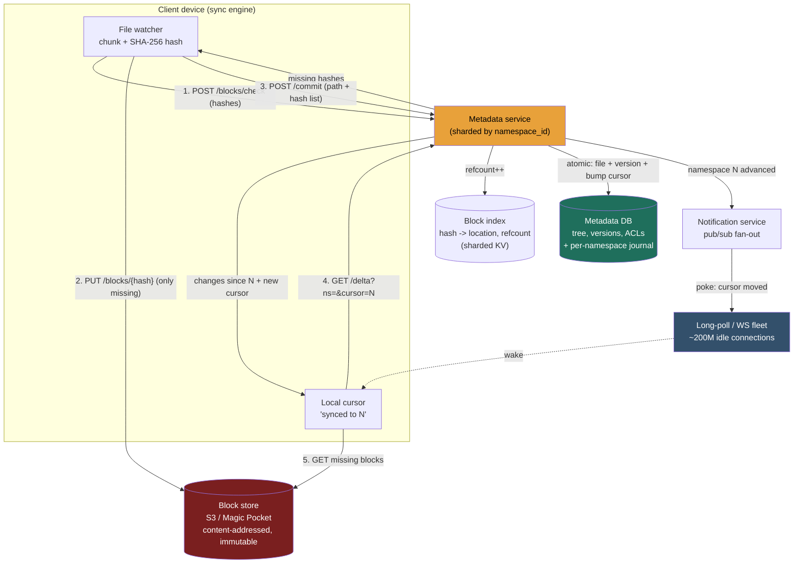

> This is a **sync-and-conflict** problem - that is what makes it different from every storage problem before it. The metadata-vs-blob split is **table stakes** here (Pastebin, 5.1, owned it). The genuinely new crux: **keep N devices byte-identical with a server source of truth, cheaply, while concurrent edits land from anywhere.** The blob-store building block (blob store), 3.4/2.5 (KV + partitioning), and 2.4/2.8 (replication, quorum) built the parts; this walkthrough assembles them around the one idea that ties sharing, sync, sharding, and ACLs together: the **namespace**.

### Learning objectives
- Run the full **RESHADED** spine on a *sync-dominated* problem and recognize why the headline number is not one QPS but **"~120K durable metadata commits/s behind ~200M cheap idle connections"** - two planes, not one.
- **Estimate** users, storage (to exabytes), block count, and the **commit rate**, with the per-user basis stated and the chain internally consistent.
- Justify **fixed 4MB content-addressed chunking** + **SHA-256 dedup** + a **metadata service split from a dumb block store**, each against its rejected alternative.
- Design the **journal/cursor sync feed** and **conflicted-copy** resolution, then stress the design for the hot shared namespace, dedup-store deletion, and the far-behind client.
- Operate at **Director altitude**: split the cheap notification plane from the expensive commit plane, quantify the delta/dedup bandwidth win, make the **build-vs-buy** call on the block plane (S3 vs Magic Pocket), and delegate the chunking algorithm with a stated prior.

### Intuition first
Sync is a **shared notebook that many people each keep a copy of in their own bag**, kept identical to a master copy on a shelf while several people scribble at once. Three moves do it. **Re-copy only the pages that changed** - edit one paragraph on page 40, copy page 40, not the notebook (**delta sync**). **Never re-copy a page the shelf already holds an identical copy of** - just write "my page 40 = that existing page" (**content-hash dedup**). **When two people scribble on the same page at once, keep both** - label one "page 40 (Alice's conflicted copy)" rather than silently discarding it (**conflict resolution - never lose a write**). And so nobody flips through the whole notebook to find what's new, the shelf keeps a **running ordered list of every changed page**; each person remembers "I've copied up to entry #812" and asks "what changed after 812?" (the **journal / cursor**).

The shelf itself is two separate things, and keeping them separate is the load-bearing decision: a small, perfectly-accurate **logbook** (which pages each file is made of, who can see it, what changed when - pointers, never contents) in front of a vast, dumb **page rack** that holds pages addressed by their content and knows nothing about files or owners. Everything below is a literal feature of that notebook-and-shelf.

---

## R - Requirements

**Clarifying questions that change the design:**
- *Sync client (Dropbox: a mirrored folder) or web-first drive (Google Drive)?* **Assume sync-first** - that's the hard, distinctive part, and it makes the journal/cursor feed the centerpiece.
- *How big can a file get, and how does it change?* *The* question. **Assume files up to multi-GB, frequently mutated in place** (you re-save a 50MB deck) - which is what forces chunking + delta sync.
- *Real-time collaborative editing inside a file?* **No - explicitly cut.** That's Google **Docs** (OT/CRDT on structured text), a different problem. Drive/Dropbox treats a file as an **opaque blob**; conflicts resolve at file granularity with a conflicted copy. Making that cut *is* a strong-signal move.
- *Consistency bar?* **Strong, read-your-writes, ordered consistency on metadata** (after my commit, every device converges to it, in order); the *bytes* are immutable and content-addressed, so block reads are trivially consistent.

**Functional requirements (the defensible core):**
1. **Upload / update a file** from any device - only changed data crosses the wire, and bytes the server already has are never re-stored.
2. **Download / sync** - a device learns *what changed* since it last synced and pulls only the deltas.
3. **Metadata service** - the file tree, **versions** (history, restore), and **sharing / ACLs**.
4. **Conflict resolution** - concurrent edits from two offline devices must **never silently lose a write**.

**Explicitly CUT from v1:** in-file co-editing (above), full-text content search (we index metadata only), previews/transcoding, comments/activity feeds, trash/retention beyond basic versioning. Each is a real adjacent subsystem; I scope to **chunk → dedup → store → commit → journal → sync → resolve conflicts** and say so.

**Non-functional requirements:**
- **Bandwidth efficiency** - the headline NFR. Re-uploading whole files on every save kills this product; delta + dedup are mandatory.
- **Durability** - people's only copy of their data; **eleven nines** on stored bytes. Losing a file is the unforgivable failure.
- **Strong, ordered consistency on metadata** - sync must converge, never out of order.
- **High availability** on the sync/notification path; clients retry, so brief blips are tolerable.
- **Scale:** ~exabytes of bytes, trillions of files, hundreds of millions of always-connected devices; **$/GB on the block plane dominates the bill** - a budget the Director owns.

**Read:write skew - and why a single ratio is the wrong answer.** Two planes with opposite profiles: the **block plane** is **write-once, read-by-your-own-devices**, heavily write-deduplicated; the **metadata/notification plane** is **read-amplified by device + member fan-out** - one commit is read by every one of my devices *and* every member of a shared folder. The honest framing: **one expensive ordered commit, fanned out to many cheap reads over many idle connections.** That fan-out, not raw QPS, is what we engineer.

**Assumptions carried forward:** **500M registered, 100M DAU, ~2 devices/active user → ~200M sync connections**; **~10GB/user blended**; **avg file ~1MB**; **~100 changes/user/day**.

---

## E - Estimation

Enough math to make a defensible call. The single most important honesty move: **declare the per-user basis.**

**Users and connections.** 500M registered, 100M DAU × ~2 devices → **~200M concurrent sync connections** - mostly **idle long-lived connections** (long-poll/WebSocket) that exist to say "wake up, something changed."

**Storage.** Basis: **blended across all 500M registered at ~10GB/user** - deliberately not 50GB, because the near-empty free tier dominates the average (if the brief were paying users only, ~50GB is fine; the formula is what matters). Raw: `500M × 10 GB = 5 EB`. **Dedup + compression recover ~30-40%** (shared org files, identical attachments, repeated installers) → **~3 EB effective**. That order-of-exabytes number is what makes the byte plane a *cost* problem and sets up the build-vs-buy call.

**File and block counts.** At ~1MB average, `5 EB / 1 MB ≈` **~5 trillion files**; at **4MB blocks** (Dropbox's actual size) most files are one block, so **~5 trillion blocks**. The chain ties out, and the block *index* is itself a few hundred TB - a sharded store in its own right, not a side table.

<details>
<summary>Go deeper - verifying the estimation chain (IC depth, optional)</summary>

- Identity check: `files_per_user = 5T / 500M = 10K`, consistent with `10 GB / 1 MB = 10K files` per user. If `avg_file_size × file_count ≠ total_storage`, the whole number set is suspect.
- Block count: most files are <4MB → at least one block per file → block count ≈ file count ≈ 5T. Dividing `5 EB / 4 MB` *undercounts* - that only holds if every block were a full 4MB, but the average file is 1MB. Large files dominate the *byte* total but not the *count*.
- Block-index sizing: one entry = `hash(32B SHA-256) + location pointer + refcount + size ≈ 50 B`; `5T × 50 B ≈ 250 TB`, call it hundreds of TB with replication - a sharded, cached KV store in its own right.

</details>

**Change / commit rate (the headline write number).** ~100 changes/user/day (a worker saving every few minutes - the soft knob) × 100M DAU = 10B/day → **~120K metadata commits/s average, ~300-500K/s peak**. This is a **durable, ordered, transactional** write rate - genuinely expensive, and the thing to scale. Behind it sit the ~200M cheap connections that merely *read* the resulting journal.

**Bandwidth - quantify the win, the product *is* bandwidth efficiency.** A user edits 2 slides in a **50MB deck**: naive whole-file upload = 50MB; **delta** (changed 4MB blocks only) = ~4-8MB, a **~7-10× saving**; **dedup** (the client first asks which block hashes the server already has) = often **~0 bytes** if the blocks already exist anywhere - the famous "instant upload," **up to ~100×+**. Aggregate ingest is therefore dominated by genuinely-new blocks, not re-uploads.

**Cache / working set.** The hot set is **metadata and the journal tail** - a Redis-class tens of GB, tiny against ~3 EB of cold immutable blocks (served from the block store/CDN, no hot byte-cache needed).

**Instance count (order-of-magnitude).** Notification fleet: ~200M idle connections at ~100K-500K/node → **hundreds of connection-bound edge nodes**. Metadata commits: **order tens of shards**, sized for write throughput + ordered journal. Block store: managed S3-class - you size **spend and durability**, not boxes; this is the budget line item.

**The one-line takeaway from E:** **~120K durable, ordered metadata commits/s fanned out over ~200M idle connections, against ~3 EB of write-once content-addressed blocks** - optimize the commit + journal + fan-out path and the $/GB of the byte plane, and let dedup/delta keep the wire cheap.

---

## S - Storage

The two-plane split is assumed (Pastebin proved it); the S-step job is picking the store *type* for the **three** data classes this problem actually has.

**1. File content - the blocks (write-once, immutable, content-addressed, ~exabytes).**
- *Choice:* a **blob/object store** - **S3** (or GCS/Azure) keyed by **content hash**, erasure-coded for eleven-nines durability at sane $/GB. At the extreme top end, in-house (**Magic Pocket** - the Design-evolution call).
- *Rejected:* blocks **in a database** - multi-MB blobs in transactional rows waste the buffer pool, blow up replication, and pay 10× the $/GB; ruinous at exabytes. *Also rejected:* a POSIX filesystem - we want a flat content-addressed key space so dedup is a hash lookup, not a directory tree.

**2. Metadata - file tree, versions, namespaces, ACLs (the system of record).**
- *Choice:* a **sharded relational / NewSQL store** - sharded **MySQL** (Dropbox's historical path) or **Spanner/CockroachDB**. Relational fits because a commit is a **multi-row transaction** (file row + version row + journal row, atomically).
- *Rejected:* a leaderless eventually-consistent store (Cassandra/Dynamo) as the tree's system of record - sync **requires ordered, read-your-writes consistency**; a device reading a half-applied or out-of-order tree corrupts the user's folder. AP is fine for the immutable *bytes*, not for the *order of changes*.

**3. The block index + journal (the glue - itself at scale).**
- *Choice:* the **hash → location + refcount** map is a **sharded KV store**, hash-partitioned by block hash (naturally uniform); the **per-namespace ordered journal** is an append-only log in the metadata store (a monotonic cursor), or a partitioned Kafka-style log at high fan-out.
- *Rejected:* folding the block index into the metadata DB - ~5T rows with a completely different (hash-uniform point-lookup) access pattern. *Also rejected:* one global journal table - it must be **partitioned by namespace** so one user's sync never scans another's changes.

---

## H - High-level design

The unifying abstraction is the **namespace**: a logical container of files with **one ordered change journal (a cursor)** and **one ACL**. A user's private root is a namespace; **a shared folder is a namespace mounted into multiple users' trees.** This single idea collapses sharing, sync, sharding, and ACLs into one concept.



**Upload - the two-phase, dedup-aware write.** The client chunks a changed file into **4MB blocks**, SHA-256-hashes each, and calls **`/blocks/check`** - "which of these do you already have?" It then `PUT`s **only the missing blocks** to the block store, and finally **`/commit`s** the new file state (`path + ordered hash list + baseVersion`) - one transaction that writes file/version rows, bumps refcounts, and **advances the namespace's cursor** with a journal entry. The check-first handshake *is* dedup and "instant upload" (server has every block → zero bytes uploaded); the commit is the moment of truth - bytes without a commit are orphan blocks, GC'd later. The metadata service then **pokes** every idle connection subscribed to that namespace via pub/sub.

**Sync - the journal pull.** A device's cursor says "synced to N"; its long-poll connection sits idle until poked, then calls **`GET /delta?cursor=N`** → the changes since N plus the new cursor M. It fetches only blocks it doesn't already have, reassembles, and advances to M - now byte-identical to the server for that namespace.

The asymmetry mirrors 5.7: the **thin, ubiquitous** edge is 200M idle connections; the **expensive, ordered** edge is the commit + journal write. Bytes flow client↔block-store and are deduplicated before they leave the client.

---

## A - API design

Kept small; the shape of the **two-phase upload** is the whole game.

```
# --- Upload: three steps, dedup-first ---

# 1. Which of these block hashes do you already have? (the dedup handshake)
POST /v1/blocks/check
  body: { hashes: ["<sha256>", ...] }
  -> 200 { missing: ["<sha256>", ...] }      # upload only these

# 2. Upload a missing block (content-addressed; idempotent - hash IS the key)
PUT  /v1/blocks/{sha256}
  body: <up to 4MB of bytes>
  -> 201 Created                              # or 200 if it raced and already exists

# 3. Atomically commit the new file state (the ordered write that bumps the cursor)
POST /v1/files/commit
  body: { namespaceId, path, blocks:["<sha256>",...], baseVersion, mtime }
  -> 200 { fileId, version, cursor }          # new namespace cursor
  -> 409 Conflict { serverVersion }           # baseVersion stale -> client makes conflicted copy

# --- Sync: long-poll + delta pull ---
GET  /v1/namespaces/{namespaceId}/longpoll?cursor=N&timeout=30
  -> 200 { changed: true, cursor: M } | { changed: false }
GET  /v1/namespaces/{namespaceId}/delta?cursor=N
  -> 200 { entries: [ { path, op, blocks:[...], version } ], cursor: M, has_more }

# --- Metadata / sharing ---
POST /v1/namespaces/{namespaceId}/members   { userId, role }   # role: viewer | editor
GET  /v1/files/{fileId}/versions            -> [ {version, mtime, size} ]
POST /v1/files/{fileId}/restore             { version }        # restore = new commit pointing at old blocks
```

**Design notes (each a choice with a rejected alternative):**
- **`/blocks/check` before upload** is the keystone. We **reject** a single `PUT /files` streaming the whole file - it re-uploads bytes the server already has, killing the headline NFR. One extra round-trip buys up to 100× bytes.
- **Content-addressed `PUT /blocks/{hash}`** makes uploads **idempotent and retry-safe**. We **reject** server-assigned block IDs - they lose idempotency and dedup.
- **`/commit` is one atomic call** carrying `baseVersion`. We **reject** incremental tree mutation - the namespace must never expose a half-applied file, and `baseVersion` is what lets the server return a 409 instead of clobbering.
- **`/delta` + `/longpoll`** rather than fetching the whole tree - full-tree polling is the bandwidth-death alternative this design exists to avoid (Evaluation).

---

## D - Data model

**The load-bearing decisions: shard the metadata by `namespace_id`, and give each namespace a per-namespace journal with a monotonic cursor.** Outline: `namespaces` (cursor, type), `files` (path, latest version), `file_versions` (ordered block-hash list - **versioning rides on dedup**: a version is just a different block list, so retention is a pure cost lever), `namespace_journal` (append-only change feed, range-scanned by `/delta`), `acls` (role per member - **the ACL lives on the namespace**, not per-file). The **block index** (`hash → location, refcount`) shards independently **by block hash** - deliberately decoupled, because a deduped block is shared across many namespaces and belongs to none.

Sharding by `namespace_id` means a `/delta` pull hits **one shard**, a commit is a **single-shard transaction**, and the journal is naturally ordered on one node. We **reject sharding by `file_id` hash** - it scatters one user's tree across every shard, turning "what changed since N" into a fleet-wide scatter-gather and making the ordered journal impossible to maintain cheaply (the same shard-by-the-query's-scope-unit argument as the region sharding).

A consequence worth saying out loud: **a shared folder is one namespace with N ACL entries and one journal**, mounted into N trees. Sharing isn't a special case - it's the namespace abstraction doing its job.

<details>
<summary>Go deeper - full table layouts (IC depth, optional)</summary>

Metadata DB (sharded by `namespace_id`):

| Table | Key | Notable columns | Notes |
|---|---|---|---|
| `namespaces` | `namespaceId` | `ownerId`, `cursor` (monotonic), `type` (root/shared) | the unit of sync + sharing + sharding |
| `files` | `(namespaceId, fileId)` | `path`, `latestVersion`, `isDeleted` | one row per file; the tree |
| `file_versions` | `(fileId, version)` | `blockList[]` (ordered hashes), `size`, `mtime` | a version = a different block list |
| `namespace_journal` | `(namespaceId, cursor)` | `fileId`, `op` (add/mod/del), `version` | append-only; range-scanned by `/delta` |
| `acls` | `(namespaceId, userId)` | `role` (viewer/editor) | ACL on the namespace, not per-file |

Block index (separate, hash-sharded KV): `hash` (32B SHA-256, the key), `location` (block-store key), `refcount` (deletion safety), `size` (≤4MB). Journal tail cached hot for `/delta`; blocks erasure-coded in the object store; metadata replicated per 2.4.

</details>

---

## E - Evaluation

Re-check against the NFRs and break the design on purpose. Five bottlenecks, each fixed with a *named* trade-off.

**Bottleneck 1 - full-tree-diff sync would be bandwidth death (why the journal exists).**
The naive sync - periodically fetch the whole tree and diff - pulls a 10K-file listing repeatedly across **200M devices** for the common case where *nothing changed*, and can't convey *order*, breaking convergence.
*Fix - the **per-namespace cursor/journal**:* the client stores "synced to N," long-polls until poked, pulls only entries after N. We pay an ordered-log write on every commit to turn **O(tree) sync into O(changes)** - the one mechanism the whole design is organized around.

**Bottleneck 2 - the hot shared namespace (fan-out amplification).**
A 10,000-member company folder: one change must poke 10,000 connections, each triggering a `/delta` - a thundering herd onto one namespace's shard.
*Fix:* **pub/sub fan-out with coalescing** (50 edits in a minute wake each member ~once - "cursor moved to M" supersedes M-1), **replicate the hot namespace's journal** for read scaling, and cap/split giant memberships. Trade: bounded extra sync latency (seconds) - acceptable for file sync, far cheaper than per-edit herds.

**Bottleneck 3 - deletion in a dedup'd store (the correctness trap).**
A block referenced by many files cannot die because *one* of them was deleted - naive "delete file → delete its blocks" silently corrupts every other file sharing those bytes.
*Fix:* **GC at trillion-block scale - lazy mark-and-sweep over refcount contention; reclaim late, never wrongly.** Refcounts reclaim promptly but the decrement contends on hot blocks (a popular installer referenced by millions - the 3.16 sharded-counter problem); at ~1T blocks, storage is cheaper than counter contention. *Rejected:* exact refcounts as the primary mechanism (or only with heavy batching/approximation). Details in the Design-evolution Go deeper.

**Bottleneck 4 - the far-behind client (a week offline).**
`/delta?cursor=N` with N thousands of entries stale would return a huge, fragile payload.
*Fix:* **paginate `/delta`** (`has_more`), and past a compaction threshold **fall back to a snapshot reset** - send current state rather than replay every entry (a file edited 500 times offline should sync as its *final state*). Trade: the snapshot transfers more than a pure delta, but it bounds journal retention and avoids churn replay.

**Bottleneck 5 - concurrent edits (never lose a write).**
Two offline devices edit the same file from the same `baseVersion`; the second `/commit` is stale.
*Fix:* the first commit wins the path; the second gets a **409** and commits its version as **`report (Alice's conflicted copy).pdf`** - both survive, the user reconciles. We **reject in-file merge (OT/CRDT)** - you cannot 3-way-merge an opaque PSD or XLSX byte-stream; that's the *Docs* problem on structured text, explicitly out of scope. We **reject bare last-write-wins** - silent data loss is the unforgivable failure for a backup product. Conflicted-copy is "ugly but never lies."

**Re-check vs NFRs:** bandwidth (delta + dedup + journal ✓); durability (eleven-nines erasure-coded immutable blocks ✓); ordered metadata consistency (single-shard transactional commit + per-namespace journal ✓); availability (idle long-poll fleet + retry ✓); scale (namespace-sharded metadata, hash-sharded index, exabyte object store ✓); cost (dedup ~35% + GC + object-store $/GB ✓).

---

## D - Design evolution

**At 10× (~10-30 EB, ~1-5M commits/s, ~2B connections):**
- **Block plane: build-vs-buy becomes the defining cost decision.** S3-class is the right *v1* (durability and ops for free), but at tens of exabytes **$/GB on managed storage dominates the P&L** - this is where Dropbox built **Magic Pocket**, its in-house exabyte store. The Director call: *"S3 until the storage bill crosses the threshold where a dedicated storage org pays for itself in $/GB; then build - a multi-year program I staff and delegate, not whiteboard."* Trade: in-house means owning durability, hardware refresh, and on-call for the most unforgivable failure mode.
- **Notification fleet scales by connection count, not data** - more edge nodes, with pub/sub fan-out pushed regional.
- **Metadata plane:** more namespace shards; the rare **cross-namespace move** needs a 2-phase distributed transaction - accept it's slow and rare, keep the common single-namespace commit fast.

**Hardest trade-offs to defend:**
- **Fixed 4MB blocks vs content-defined chunking (CDC):** **fixed-4MB for v1** - simple, uniform addressing, and dedup/delta work for in-place edits (most real saves); **CDC survives prepends/inserts but adds complexity - revisit if insert-heavy workloads appear in telemetry.** Naming fixed chunking's boundary-shift cost is what makes the rejection real, not hollow.
- **Refcount vs GC for deletion** (Bottleneck 3): prompt-reclaim-with-contention vs simple-but-lazy. I lean GC at a trillion blocks.
- **Sync latency vs fan-out cost:** coalesced pokes trade a few seconds of latency for surviving big shared folders - defensible because file sync isn't real-time.

<details>
<summary>Go deeper - chunking boundaries and dedup-store GC (IC depth, optional)</summary>

**Why fixed chunking breaks on inserts.** With fixed 4MB boundaries, inserting bytes near the *start* of a file shifts every subsequent boundary, so *every* block's hash changes - dedup and delta break on that file and you re-upload the whole thing despite a one-byte insert. **Content-defined chunking** (rsync-style **rolling hash**) places boundaries based on *content*, not offset, so an insert dirties only the local chunk - boundaries "heal." Costs: variable-sized blocks, more CPU, more complex addressing. Fixed wins for v1 because most real edits are in-place overwrites at stable offsets; the bake-off metric is dedup ratio vs CPU cost on real file corpora.

**Refcounts vs mark-and-sweep, mechanically.** Refcounts: `++` on commit, `--` on delete, free at 0 - exact and prompt, but the decrement is a write-hot counter on popular blocks (millions of references to one installer block - the 3.16 problem), and a miscounted decrement *wrongly deletes shared data*, the worst failure class. Mark-and-sweep: periodically scan which blocks any live version still references and delete orphans - contention-free and safe-by-construction (reclaim later, never wrongly), but dead bytes are paid for until the sweep, and the scan over ~1T blocks is itself a heavy distributed batch job (incremental/partitioned sweeps in practice). Middle ground: batched/approximate refcounts feeding a verifying sweep.

</details>

**What I'd revisit:** sharded MySQL (mature, operationally known) vs Spanner/CockroachDB (cleaner horizontal transactions) for the metadata store - an ops-and-integrity call I'd benchmark under the real commit mix.

**Where I'd delegate (the Director move):**
- **The chunking/diff algorithm:** *"the storage/sync team owns the chunker behind `chunk(file) → [blocks]`; my prior is fixed-4MB, moving to CDC if telemetry shows insert-heavy workloads - benchmarked on dedup ratio and CPU, not asserted."*
- **The exabyte object store (Magic Pocket-class):** an entire storage org - erasure coding, hardware, placement. *"I scope and fund it; I don't design the coding scheme on the whiteboard."*
- **Real-time co-editing (Docs/OT):** explicitly scoped out and handed to a collaboration team - same files, fundamentally different problem.

---

## Trade-offs table - the pivotal decisions

| Decision | Option A | Option B | Option C | Use when… |
|---|---|---|---|---|
| **Chunking strategy** | **Whole-file** | **Fixed-size 4MB blocks** (content-addressed) | **Content-defined chunking (CDC)** | Whole-file: tiny immutable files only. **Fixed-4MB: the right v1 - simple, dedup + delta work for in-place edits (Dropbox's choice).** CDC: prepend/insert-heavy workloads where fixed boundaries shift. |
| **Sync mechanism** | **Full-tree diff / polling** | **Per-namespace cursor + journal** |, | Full-tree: never at this scale - O(tree) across 200M devices. **Cursor/journal: O(changes), ordered, long-poll-driven - the right call.** |
| **Conflict resolution** | **Silent last-write-wins** | **LWW + conflicted copy** | **In-file merge (OT/CRDT)** | Silent LWW: never - silent loss is unforgivable. **Conflicted-copy: the right call for opaque blobs (Dropbox's choice).** OT/CRDT: structured text with real-time co-editing - that's *Docs*, out of scope. |

---

## What interviewers probe here (Director altitude)

- **"What's the read:write skew, and why is a single ratio the wrong answer?"** - *Strong signal:* names **two planes** - write-once/dedup'd blocks vs a metadata plane **read-amplified by device + member fan-out** - and designs the cheap-connection / expensive-commit split. *Red flag:* "read-heavy like every app" and a byte read-cache the immutable block store already obviates.
- **"How does a device know what changed without re-downloading everything?"** - *Strong:* the **per-namespace cursor + journal**, contrasted with full-tree-diff death. *Red flag:* periodic tree fetch-and-compare, or no notion of *order*.
- **"You dedup blocks across users. How do you delete safely?"** - *Strong:* refcount-or-GC with the trade named (prompt-but-contended vs lazy-but-safe), leaning GC at ~1T blocks. *Red flag:* "delete the file's blocks" - corrupts every other file sharing them.
- **"Two offline devices edit the same file. What happens - and why not merge?"** - *Strong:* **conflicted copy, never lose a write**, and why OT/CRDT is the *Docs* problem on structured text, a deliberate scope cut. *Red flag:* bare last-write-wins, or merging binary blobs.
- **"Where's the spend?"** - *Strong:* **$/GB of the exabyte block plane**; dedup and GC are the levers, and at the top end it's a **build-vs-buy** call (S3 → Magic Pocket) - a staffed multi-year program. *Red flag:* obsessing over compute while storage $/GB is the P&L.

---

## Common mistakes

- **Re-treading the metadata/blob split as the headline.** It's table stakes (Pastebin). The new crux is **sync** - cursor/journal, dedup, conflict.
- **Full-tree-diff sync.** O(tree) per poll across 200M devices. The per-namespace cursor + journal makes it O(changes).
- **Uploading whole files.** Skips the `/blocks/check` handshake - the headline bandwidth NFR dies. Chunk, hash, ask-what's-missing, upload only the new.
- **Deleting a dedup'd block on single-file delete.** Corrupts every other file sharing it. Refcounts or GC - and name the trade.
- **Merging conflicts on binary blobs.** That's *Docs* on structured text. For opaque files: **conflicted copy** - ugly but never loses a write.

---

## Interviewer follow-up questions (with model answers)

**Q1. Estimate storage and the commit rate, and defend your per-user basis.**
> *Model:* Basis stated first: **blended across all 500M registered at ~10GB/user** - free tier dominates, so a blended 50GB would be indefensible. Raw `= 5 EB`; dedup+compression ~35% → **~3 EB effective**. At ~1MB/file that's **~5T files ≈ ~5T blocks** (most files are one sub-4MB block), and the chain ties out (`10GB/1MB = 10K files/user`). Writes: ~100 changes/user/day × 100M DAU → **~120K commits/s avg, ~300-500K peak**. The headline is the pairing: **~120K durable ordered commits/s fanned out over ~200M idle connections.** The soft knob is changes/user/day - I'd anchor it and let the interviewer dial it.

**Q2. Walk me through the upload path. Why the `/blocks/check` round-trip before uploading?**
> *Model:* Chunk into **4MB blocks**, SHA-256 each locally, call **`/blocks/check`** → the server says which hashes it's missing; `PUT` **only those** (content-addressed, idempotent); then **`/commit`** the path + ordered hash list + `baseVersion` in one transaction that bumps refcounts and advances the namespace cursor. The check-first round-trip *is* dedup and instant upload: edit 2 slides in a 50MB deck → upload ~4-8MB (**~10×**); the file already exists server-side → **~0 bytes**. One extra RTT buys up to 100× bandwidth - rejecting it means re-uploading bytes the server already has.

**Q3. Design the sync feed. What about a device offline for a week?**
> *Model:* Each **namespace** has a monotonic **cursor** and an ordered **journal**. A device stores "synced to N," holds an idle long-poll, and on a poke calls `/delta?cursor=N` → entries since N + new cursor, fetching only blocks it lacks. **O(changes), not O(tree)** - full-tree diff across 200M devices is bandwidth death for the no-change common case. Far-behind client: **paginate `/delta`**, and past the journal's compaction threshold **fall back to a snapshot reset** - a file edited 500 times offline syncs as its final state, not 500 deltas. Trade: snapshot transfers more, but bounds journal retention.

**Q4. Two devices edit the same file offline, both reconnect. What happens? Why not merge?**
> *Model:* Both committed from the same `baseVersion`; the first wins the path, the second gets a **409** and writes a **conflicted copy** (`report (Bob's conflicted copy).pdf`) - both versions survive, the user reconciles. I deliberately don't merge inside the file: it's an **opaque binary blob** with no meaningful 3-way merge. OT/CRDT merge is for structured text with real-time co-editing - **Google Docs**, which I scoped out. **Silent last-write-wins is the unforgivable failure** for a backup product, so I reject it explicitly.

---

### Key takeaways
- This is a **sync-and-conflict** problem; the metadata/blob split is table stakes. The crux: keep **N devices byte-identical, cheaply, under concurrent edits** - via **delta sync + content-hash dedup + a journal/cursor + conflicted-copy**.
- The headline is **two planes, not one QPS**: **~120K durable ordered commits/s** fanned out over **~200M idle connections**, against **~3 EB** of write-once blocks. State the per-user basis and make the chain tie out.
- **Fixed 4MB content-addressed blocks + SHA-256 dedup**; the **two-phase upload** (`check → PUT → commit`) *is* dedup and instant upload. Fixed chunking's cost is boundary shift on inserts - CDC fixes it at the price of complexity; revisit on telemetry.
- The **per-namespace cursor + journal** is the load-bearing sync mechanism (O(changes), not O(tree)); the **namespace** unifies sync, sharing, sharding, and ACLs - **shard by `namespace_id`** (reject file-id hash: scatter-gather).
- **Director moves:** dedup'd deletion = **lazy GC over refcount contention** (reclaim late, never wrongly); hot shared namespaces need **coalesced pub/sub fan-out**; the byte plane is a **build-vs-buy** call (S3 → Magic Pocket); **delegate the chunker** with a stated prior.

> **Spaced-repetition recap:** Dropbox/Drive = **sync**, not storage. Three moves: **delta** (only changed 4MB blocks), **dedup** (SHA-256 content addressing; the `/blocks/check` handshake = instant upload), **conflicted-copy** (never lose a write; merge is for *Docs*). A **per-namespace cursor + journal** drives sync - O(changes) - and the **namespace** ties sync+sharing+sharding+ACLs together → **shard by namespace_id**. Headline: **~120K ordered commits/s behind ~200M idle connections**, against **~3 EB** of immutable blocks. Deletion needs **GC (or refcounts)**; the byte plane's **$/GB** is the budget (S3 → Magic Pocket).

---

*End of Lesson 5.8. Dropbox/Drive reuses the metadata/blob split, shard-by-the-query's-scope-unit, the journal/log discipline, and sharded-counter contention - but its distinctive crux is **sync**: a cursor/journal feed plus dedup'd delta upload, where RESHADED's R-step consistency bar and E-step fan-out math decide the architecture before any box is drawn. Next: 5.9 YouTube/Netflix - the video upload, transcode-ladder, and CDN-delivery problem.*
