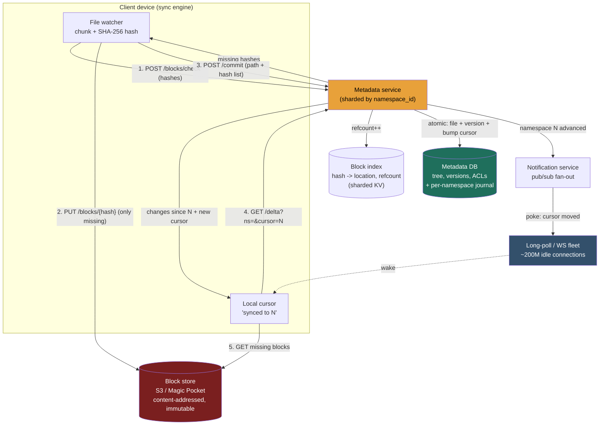

> This is a **sync-and-conflict** problem, and that is what makes it different from every storage problem before it. Pastebin (5.1) already owns the metadata-vs-blob *split*, and 5.7 already referenced it - here that split is **table stakes**, assumed background, not the headline. The genuinely new crux is: **keep N devices byte-identical with a server source of truth, cheaply, while concurrent edits land from anywhere.** Lesson 3.11 (Blob / Object Store) built the block plane this leans on; 3.4 (Key-Value Store) and 2.5 (partitioning) built the metadata store and its shard key; 2.4 (replication) and 2.8 (quorum) inform how the journal stays durable. This walkthrough assembles them around the one elegant idea that ties sharing, sync, sharding, and ACLs into a single concept: the **namespace**.

### Learning objectives
- Run the full **RESHADED** spine on a *sync-dominated* problem and recognize why the headline number is not one QPS but **"~120K durable metadata commits/s behind ~200M cheap idle connections"** - two planes, not one.
- **Estimate** users, files, storage (to exabytes), block count, and the **change/commit rate**, and verify the chain is internally consistent (`avg_file_size x file_count = total_storage`; `file_count / users = files_per_user`).
- Justify **fixed 4MB content-addressed chunking** + **SHA-256 dedup** + a **metadata service split from a dumb block store**, each against its rejected alternative - and name the cost of fixed chunking (boundary shift) honestly.
- Design the **journal/cursor sync feed** and **conflicted-copy** resolution, then stress the design for the hot shared namespace, dedup-store deletion, and the far-behind client - fixing each with a *named* trade-off.
- Operate at **Director altitude**: split the cheap notification plane from the expensive commit plane, quantify the delta/dedup bandwidth win, make the **build-vs-buy** call on the block plane (S3 vs Magic Pocket), and name where you'd delegate (the chunking/diff algorithm).

### Intuition first
Sync is a **shared notebook that many people each keep a copy of in their own bag.** The whole job is to keep every copy identical to a master copy on a shelf, as cheaply as possible, while several people scribble at once. Three moves do it, and the entire design is just these three made real. **First, you re-copy only the pages that changed** - if someone edits one paragraph on page 40, you don't re-copy the whole notebook, you copy page 40 (that's **delta sync** - send only changed chunks). **Second, you never re-copy a page that the shelf already has an identical copy of** - if the page you're about to add is byte-for-byte a page that already exists (maybe a colleague added the same attachment last week), you just write a note "my page 40 = that existing page" and copy nothing (that's **content-hash dedup** - the same bytes are stored once). **Third, when two people scribble different things on the same page at the same moment, you don't pick a winner and silently throw one away** - you keep both, labelling one "page 40 (Alice's conflicted copy)" (that's **conflict resolution** - never lose a write). And so nobody has to flip through the whole notebook to find what's new, the shelf keeps a **running list of every page that changed and in what order** - each person remembers "I've copied up to entry #812" and just asks "what changed after 812?" (that's the **journal / change feed** with a per-notebook cursor).

The shelf itself is two separate things, and keeping them separate is the load-bearing decision: a small, perfectly-accurate **logbook** that records *which pages each file is made of, who can see it, what changed when* - pointers, never page contents - sitting in front of a vast, dumb **page rack** that just holds pages addressed by their content and knows nothing about files, owners, or order. Everything below is a literal feature of that notebook-and-shelf.

---

## R - Requirements

RESHADED starts by bounding the problem, because **scope before build** is the first thing a Director is scored on. Separate functional from non-functional, ask the two or three clarifying questions that actually change the architecture, then **cut** to a defensible core out loud.

**Clarifying questions that change the design (ask these, don't assume silently):**
- *Is this primarily a file *sync* client (Dropbox: a folder that mirrors across my devices) or a web-first *drive* (Google Drive: a UI I browse)?* It changes whether the **journal/cursor sync feed** is the centerpiece. **Assume sync-first** - that's the hard, distinctive part.
- *How big can a file get, and how do files change?* This is *the* question. If files were always small and immutable we'd be back at Pastebin. **Assume files up to multi-GB, frequently *mutated in place*** (you edit a 50MB deck and re-save) - which is what forces chunking + delta sync.
- *Do we need real-time collaborative editing inside a file (two cursors in one doc at once)?* **No - explicitly cut.** That's Google **Docs** (operational-transform / CRDT on structured text), a different problem. Drive/Dropbox sync treats a file as an **opaque blob**; conflicts are resolved at file granularity with a conflicted copy, not merged character-by-character. Making that cut *is* a strong-signal move.
- *What's the consistency bar?* **Strong, read-your-writes consistency on the metadata** (after my upload commits, every device and the web UI must converge to it, in order) - but the *bytes* are immutable and content-addressed, so block reads are trivially consistent.

**Functional requirements (the defensible core):**
1. **Upload / update a file** from any device - efficiently (only changed data crosses the wire) and with dedup (don't re-store bytes the server already has).
2. **Download / sync** - a device learns *what changed* since it last synced and pulls only the deltas, converging to the server's state.
3. **Metadata service** - the file tree (folders, names, sizes), **versions** (history, restore), and **sharing / ACLs** (who can read/write a folder).
4. **Conflict resolution** - concurrent edits to the same file from two offline devices must **never silently lose a write**.

**Explicitly CUT from v1 (state the cut - scoping *down* is the signal):** in-file real-time co-editing (Docs/OT, above), full-text search across file *contents* (a separate distributed-search problem, 3.12 - we index *metadata* only), thumbnail/preview generation and transcoding, server-side document rendering, comments/notifications/activity feeds, and trash/retention policy beyond basic versioning. Each is a real adjacent subsystem; building all of them in 45 minutes is the "too high, hand-wavy" failure. I scope to **chunk -> dedup -> store -> commit metadata -> journal -> sync -> resolve conflicts** and say so.

**Non-functional requirements:**
- **Bandwidth efficiency** - the headline NFR. Re-uploading a whole file on every save is the naive design that kills this product; delta + dedup are mandatory, not nice-to-have.
- **Durability** - this is people's only copy of their data; target **eleven nines (99.999999999%)** on stored bytes (the S3-class bar). Losing a file is the unforgivable failure.
- **Strong, ordered consistency on metadata** - sync must converge; a device must never apply changes out of order or miss one.
- **High availability** on the sync/notification path (the client retries, so brief blips are tolerable - but the metadata service backs the whole product).
- **Scalable** to ~exabytes of bytes, trillions of files, and hundreds of millions of always-connected devices.
- **Cost-efficient at the byte plane** - at exabyte scale, $/GB of the block store dominates the bill; this is a budget the Director owns.

**Read:write skew - and why a single ratio is the wrong answer here.** This problem has **two planes with opposite profiles**, and naming that nuance is the signal:
- The **block (byte) plane** is **write-once, read-by-your-own-devices** - a chunk is uploaded once (dedup makes most uploads zero-byte) and read mainly when a device first syncs it. Modest, and heavily *write-deduplicated*.
- The **metadata / notification plane** is **read-amplified by device + member fan-out** - one file change is a single durable *commit*, but it is *read* by every one of my devices **and** every member of a shared folder. A 10-person shared folder turns 1 write into ~10 reads; my 3 devices turn it into 3 more.

So instead of "100:1 read-heavy," the honest framing is: **one expensive ordered commit, fanned out to many cheap reads over many idle long-lived connections.** That fan-out, not raw QPS, is what we engineer.

**The scale/skew assumptions carried forward** (everything in E depends on these): **500M registered users, 100M DAU, ~2 devices per active user -> ~200M sync connections**; **~10GB/user blended** (most accounts are near-empty free tier - basis stated below); **avg file ~1MB**; **~100 file changes/user/day**.

---

## E - Estimation

The goal is **enough math to make a defensible call**, not a spreadsheet. Round aggressively, state assumptions, and *verify the chain ties together* (the self-check that bites at this altitude is an internally inconsistent number set). The single most important honesty move: **declare the per-user basis.**

**Users and connections.**
- **500M registered**, **100M DAU**. Each active user runs ~2 devices (laptop + phone) -> **~200M concurrent sync connections** to maintain. These are mostly **idle long-lived connections** (long-poll / WebSocket) that carry almost no data - they exist to say "wake up, something changed."

**Storage - and the per-user basis (state it explicitly).**
- I'll use a **blended-across-all-500M-registered** basis at **~10GB/user**. This is *deliberately not* 50GB: free tier dominates (most accounts are near-empty), and a blended 50GB would be indefensible - the free majority pulls the average down. (If the brief were "active paying users only," ~50GB is fine; the formula is the thing to show, the interviewer can dial the basis.)
- Raw bytes: `500M users x 10 GB = 5 EB` (five exabytes) raw.
- **Dedup + compression** recover ~30-40% (shared files in orgs, identical attachments, repeated app installers) -> **~3 EB effective** stored. Call it **order single-digit exabytes** - this is what makes the byte plane a *cost* problem and pushes toward in-house storage at the top end (Design evolution).

**File and block counts - verify the identity.**
- avg file ~**1MB** -> file count `= 5 EB / 1 MB =` **~5 trillion files**.
- Identity check: `files_per_user = 5T / 500M =` **10K files/user** - consistent with "10GB/user at 1MB/file" (`10 GB / 1 MB = 10K`). The chain ties out. ✓
- Chunks at **4MB blocks** (Dropbox's actual block size). Most files are <4MB (one block), so block count is dominated by the small-file majority -> at least one block per file -> **~5 trillion blocks** (large files add a modest few each; they dominate the *byte* total but not the *count*). Dividing `5 EB / 4 MB` would *undercount* - that only holds if every block were full 4MB, but the average file is 1MB.
- **The block index is itself a big store.** One index entry `= hash(32B SHA-256) + location pointer + refcount + size ~= 50 B`. `5T x 50 B ~= 250 TB`, call it **hundreds of TB with replication** - a sharded, cached metadata store in its own right, *not* a side table. Flagging that the *index* is a distributed-storage problem is a Director-altitude catch.

**Change / commit rate (the headline write number).**
- Assume **~100 file changes/user/day** for active users (a worker saving documents every few minutes across a workday; the soft knob - I'll anchor and flex it).
- `100 changes x 100M DAU = 10B changes/day` -> `10B / 86,400 s ~=` **~116K commits/s average** -> round to **~120K metadata commits/s avg, ~300-500K/s peak** (work-hours bunching, multi-timezone overlap).
- *This is the number that defines the metadata-commit plane.* It is a **durable, ordered, transactional** write rate - genuinely expensive, and the thing to scale. Behind it sit the ~200M cheap connections that merely *read* the resulting journal.

**Bandwidth - a worked example beats a gross figure.** The product *is* bandwidth efficiency, so quantify the win, don't just cite a sum:
- A user edits **2 slides in a 50MB deck** and hits save.
- **Naive (whole-file upload):** 50MB across the wire.
- **Delta (changed 4MB blocks only):** the edit touches maybe 1-2 blocks -> **~4-8MB**. **~7-10x** saving.
- **Dedup (server already has unchanged blocks):** the client first *asks* which block hashes the server already has; the unchanged ~46MB is already stored -> uploads **only the new blocks** -> often **~0 extra** if the new blocks also already exist somewhere (the famous "instant upload" of a file someone else already uploaded). **Up to ~100x+** saving on common files.
- Aggregate ingest is therefore far below naive: even at `120K commits/s`, the *byte* ingest is dominated by genuinely-new blocks, not re-uploads - dedup is doing the heavy lifting. The egress (devices pulling deltas) is similarly delta-shaped.

**Cache / working set.** The hot working set is **metadata and the journal tail**, not bytes: the recent change-feed entries each device polls, and hot file-tree listings. That's a Redis-class working set of **tens of GB**, tiny against ~3 EB of cold blocks. Blocks themselves are cold and immutable -> served from the block store / CDN, not a hot cache.

**Instance count (order-of-magnitude).**
- **Notification / long-poll fleet:** ~200M connections, each cheap (idle). At ~100K-500K idle connections per node (epoll/event-loop), `200M / ~250K ~=` **~hundreds of edge nodes** to hold connections. This fleet is *connection-bound*, not CPU-bound - the analog of 5.7's ingest tier.
- **Metadata-commit service:** ~120K-500K commits/s of small transactional writes -> a **sharded** datastore (sharded by namespace, see D) - **order tens of shards**, sized for write throughput + ordered journal, not for byte volume.
- **Block store + CDN:** managed S3-class (or in-house Magic Pocket at the top end) - you size **spend and durability**, not boxes. This is the budget line item.

**The one-line takeaway from E:** the system is **~120K durable, ordered metadata commits/s fanned out over ~200M idle connections**, against **~3 EB of write-once content-addressed blocks** - so optimize the **commit + journal + fan-out** path and the **$/GB** of the byte plane, and let dedup/delta keep the wire cheap.

---

## S - Storage

The split into two planes is *assumed* here (Pastebin proved it); the S-step job is to pick the store *type* for each of the **three** data classes this problem actually has, and justify each against the access pattern.

**1. File content - the blocks (write-once, immutable, content-addressed, ~exabytes).**
- *Access pattern:* enormous volume, **immutable** (a 4MB block keyed by its SHA-256 never changes - an "edit" produces *new* blocks), write-once, read by a user's devices, must be eleven-nines durable, $/GB-sensitive.
- *Choice:* a **blob / object store** - **Amazon S3** (or GCS / Azure Blob) keyed by **content hash**, with erasure coding for durability/cost. At the extreme top end, an **in-house object store (Dropbox's Magic Pocket)** for $/GB control (Design evolution makes this build-vs-buy call).
- *Rejected:* storing blocks **in a database** (relational or wide-column). A multi-MB blob in a transactional row wastes the buffer pool, blows up replication, and pays $/GB an order of magnitude over object storage - the exact mistake the metadata/blob split exists to avoid, now at exabyte scale where it would be ruinous. *Also rejected:* a POSIX filesystem as the abstraction - we want a flat, content-addressed key space, not a directory tree, so dedup is a hash-table lookup.

**2. Metadata - file tree, versions, namespaces, ACLs (the system of record).**
- *Access pattern:* small rows, **strongly consistent, transactional, ordered** (a commit atomically updates a file's block list, bumps a version, and advances a cursor), keyed lookups (list a folder, get a file's blocks), modest per-row size, ~120K-500K writes/s.
- *Choice:* a **sharded relational / NewSQL store** - sharded **MySQL/Postgres** (Dropbox's historical choice: sharded MySQL behind an "Edgestore"-style layer) or **Spanner / CockroachDB** for horizontally-scalable transactions. Relational fits because a commit needs a **multi-row transaction** (file row + version row + journal row, atomically) and the tree has real referential structure.
- *Rejected:* a leaderless eventually-consistent store (Cassandra/Dynamo) as the *system of record for the tree*. Sync **requires ordered, read-your-writes consistency** - if a device reads a half-applied or out-of-order tree it corrupts the user's folder. We reject AP here because the R-step consistency bar forbids it; eventual consistency is fine for the *bytes* (immutable, so trivially consistent) but not for the *order of changes*.

**3. The block index + journal (the glue - and itself at scale).**
- *Access pattern:* the **hash -> location + refcount** map (hundreds of TB, point lookups + dedup checks at upload time) and the **per-namespace ordered change journal** (append-heavy, range-scan-by-cursor on read).
- *Choice:* the block index is a **sharded KV store** (hash-partitioned by block hash - a naturally uniform key); the journal is an **append-only, ordered log per namespace** living in the metadata store (a monotonically-increasing cursor column / sequence) - or a partitioned **Kafka**-style log at high fan-out.
- *Rejected:* folding the block index into the main metadata DB - it's `~5 trillion` rows with a totally different (hash-uniform, point-lookup) access pattern than the tree; it deserves its own hash-sharded store. *Also rejected:* a naive global journal table - it must be **partitioned by namespace** so one user's sync never scans another's changes (the partition argument, below).

**The *sync mechanism* itself** (cursor/journal vs full-tree diff) and the *conflict policy* are the heart of this problem and are decided in **High-level design** and **Evaluation**.

---

## H - High-level design

The unifying abstraction is the **namespace**: a logical container of files with **one ordered change journal (a cursor)** and **one ACL (member list + permissions)**. A user's private root is a namespace; **a shared folder is a namespace mounted into multiple users' trees.** This single idea collapses sharing, sync, sharding, and ACLs into one concept - hold onto it; it reappears in D and E.



**Happy path - upload (the two-phase, dedup-aware write):**
1. **Watch + chunk + hash.** The client's sync engine notices a file changed, splits it into **4MB blocks**, and computes each block's **SHA-256**. This is purely local.
2. **`/blocks/check` (the dedup handshake).** The client sends the *list of hashes* to the metadata service and asks **"which of these do you already have?"** The service checks the **block index** and replies with the **missing** set. *This call is what makes dedup and "instant upload" real* - if the server already has every block (someone uploaded this file before), the answer is "none missing" and we upload zero bytes.
3. **`PUT /blocks/{hash}` (upload only the missing).** The client uploads *only* the missing blocks straight to the **block store**, content-addressed by hash. Unchanged blocks (the 46MB of the 50MB deck) never move.
4. **`/commit` (the atomic metadata write).** The client sends the new file state: `path + ordered list of block hashes + base version`. The metadata service, in **one transaction**, writes the file/version rows, **increments refcounts** on the referenced blocks, and **advances the namespace's cursor** by appending a journal entry. The commit is the moment of truth - bytes without a commit are orphan blocks (GC'd later); the commit is what the world sees.
5. **Fan-out poke.** The metadata service tells the **notification service** "namespace N's cursor moved." Pub/sub wakes every idle connection subscribed to N (my other devices + folder members).

**Happy path - sync (the journal pull):**
1. A device's local cursor says "I'm synced to **N**." Its long-poll connection sits idle until the notification service **pokes** it ("N advanced").
2. The device calls **`GET /delta?namespace=N&cursor=N`** -> the service returns **the changes since cursor N** (added/modified/deleted files, each with its block-hash list) **plus the new cursor M**.
3. The device runs `/blocks/check`-style logic locally, **fetches only blocks it doesn't already have** from the block store, reassembles the files, and advances its cursor to M. It is now byte-identical to the server for that namespace.

The asymmetry mirrors 5.7: the **thin, ubiquitous** edge is the 200M idle long-poll connections (almost no data); the **expensive, ordered** edge is the commit + journal write. Bytes flow point-to-point client<->block-store and are deduplicated before they ever leave the client.

---

## A - API design

Kept small; the shape of the **two-phase upload** is the whole game - it's what turns "upload a file" into "upload only genuinely-new bytes."

```
# --- Upload: three steps, dedup-first ---

# 1. Which of these block hashes do you already have? (the dedup handshake)
POST /v1/blocks/check
  body: { hashes: ["<sha256>", ...] }
  -> 200 { missing: ["<sha256>", ...] }      # upload only these

# 2. Upload a missing block (content-addressed; idempotent - hash IS the key)
PUT  /v1/blocks/{sha256}
  body: <up to 4MB of bytes>
  -> 201 Created                              # or 200 if it raced and already exists

# 3. Atomically commit the new file state (the ordered write that bumps the cursor)
POST /v1/files/commit
  body: { namespaceId, path, blocks:["<sha256>",...], baseVersion, mtime }
  -> 200 { fileId, version, cursor }          # new namespace cursor
  -> 409 Conflict { serverVersion }           # baseVersion stale -> client makes conflicted copy

# --- Sync: long-poll + delta pull ---

# Long-poll: block until this namespace's cursor passes the client's, or timeout
GET  /v1/namespaces/{namespaceId}/longpoll?cursor=N&timeout=30
  -> 200 { changed: true, cursor: M } | { changed: false }   # then call /delta

# The journal pull: what changed since my cursor?
GET  /v1/namespaces/{namespaceId}/delta?cursor=N
  -> 200 { entries: [ { path, op, blocks:[...], version } ], cursor: M, has_more }

# --- Metadata / sharing ---
POST /v1/namespaces/{namespaceId}/members   { userId, role }   # role: viewer | editor
GET  /v1/files/{fileId}/versions            -> [ {version, mtime, size} ]   # version history
POST /v1/files/{fileId}/restore             { version }        # restore = new commit pointing at old blocks
```

**Design notes (each a choice with a rejected alternative):**
- **`/blocks/check` before upload** is the keystone. We **reject** a single `PUT /files` that streams the whole file - that would re-upload bytes the server already has, killing the headline bandwidth NFR. The check-first handshake *is* dedup and instant-upload; it costs one extra round-trip to save up to 100x bytes.
- **Content-addressed `PUT /blocks/{hash}`** makes uploads **idempotent and safe to retry** - the hash is the key, so a retried or raced upload is a harmless no-op. We **reject** opaque server-assigned block IDs, which would lose idempotency and dedup (you couldn't tell two identical blocks apart by name).
- **`/commit` is a single atomic call** carrying `baseVersion`. We **reject** letting the client mutate the tree incrementally (separate "add block," "set name" calls) - the commit must be one transaction so the namespace never exposes a half-applied file, and `baseVersion` is what lets the server detect a conflict (409) instead of clobbering.
- **`/delta` + `/longpoll` (journal pull)** rather than the client GETting the whole tree. We **reject** full-tree polling outright in the next section - it's the bandwidth-death alternative this entire design exists to avoid.

---

## D - Data model

**Metadata DB (the system of record) - keyed and *sharded by `namespace_id`*:**

| Table | Key | Notable columns | Notes |
|---|---|---|---|
| `namespaces` | `namespaceId` | `ownerId`, `cursor` (monotonic), `type` (root/shared) | the unit of sync + sharing + sharding |
| `files` | `(namespaceId, fileId)` | `path`, `latestVersion`, `isDeleted` | one row per file; the tree |
| `file_versions` | `(fileId, version)` | `blockList[]` (ordered hashes), `size`, `mtime` | **versioning rides on dedup** - a version is just a different block list |
| `namespace_journal` | `(namespaceId, cursor)` | `fileId`, `op` (add/mod/del), `version` | the **change feed**; append-only, range-scanned by `/delta` |
| `acls` | `(namespaceId, userId)` | `role` (viewer/editor) | **ACL lives on the namespace**, not per-file |

**Block index (separate, hash-sharded KV):**

| Field | Type | Notes |
|---|---|---|
| `hash` | bytes(32) | SHA-256 - the key, **hash-partitioned** (uniform by construction) |
| `location` | string | block-store key / placement |
| `refcount` | int | how many file-versions reference this block (deletion safety) |
| `size` | int | <= 4MB |

**The partition / shard key = `namespace_id`. This is the load-bearing decision.**
- Because **all of a user's (or shared folder's) sync activity is scoped to a namespace** - listing changes, committing, polling - sharding by `namespace_id` means **a `/delta` pull hits one shard**, a commit's transaction is **single-shard** (no distributed transaction for the common case), and the journal for a namespace is **naturally ordered on one node**.
- We **reject sharding by `file_id` hash** - it would scatter one user's tree across every shard, turning "list my changes since cursor N" into a **scatter-gather across the whole fleet** and making the ordered journal impossible to maintain cheaply. (Identical argument to 5.7's region-sharding: shard by the unit the query is scoped to.)
- The **block index shards independently by block hash** - a uniform key, deliberately *decoupled* from namespace sharding because a block is shared across many namespaces (that's the whole point of dedup). A block belongs to no single namespace.

**Where data lives:** tree/versions/ACLs/journal in the sharded metadata DB (sharded by namespace, replicated for durability + read scaling per 2.4); blocks in the object store (content-addressed, erasure-coded, eleven-nines); block index in its own hash-sharded KV; journal tail cached hot for `/delta`.

**Two model consequences worth saying out loud:**
- **Versioning is free-riding on dedup.** A new version stores *only its new blocks* and shares the rest; "restore version 3" is a *new commit* whose block list points at version 3's (still-referenced) blocks. Retention (keep 30 days / N versions) is therefore a pure **cost lever** - more retention = more blocks pinned against GC.
- **A shared folder is one namespace with N entries in `acls` and one journal**, mounted into N users' trees. Sharing isn't a special case - it's the namespace abstraction doing its job.

---

## E - Evaluation

Re-check against the NFRs and break the design on purpose. Five bottlenecks, each fixed with a *named* trade-off.

**Bottleneck 1 - full-tree-diff sync would be bandwidth death (why the journal exists).**
The naive sync is: client periodically fetches the whole file tree and diffs it against local. At **10K files/user** that's a large listing pulled repeatedly across **200M devices** - gigabytes of metadata churn for the common case where *nothing changed*. It also can't tell you *order*, breaking convergence.
*Fix - the **per-namespace cursor/journal** (already in the design):* the client stores "synced to N," long-polls until poked, then pulls **only entries after N**. A no-change poll transfers ~nothing; a change transfers only the delta. Trade: the server must maintain a **durable ordered journal per namespace** (append cost on every commit, plus a far-behind-client problem, Bottleneck 4) - we pay an ordered-log write to turn O(tree) sync into O(changes). This is the analog of Uber's geo-index: the one mechanism the whole design is organized around.

**Bottleneck 2 - the hot shared namespace (fan-out amplification).**
A **10,000-member shared folder** (a company-wide drive): one file change advances *one* cursor, but the notification service must **poke 10,000 connections**, and each then issues a `/delta` + block fetches. One write becomes a **10,000-read thundering herd**, and that namespace's single shard/journal is a write+read hot spot.
*Fix:*
- **Pub/sub fan-out with batching** at the notification tier (one cursor bump -> one pub/sub publish -> fan-out to subscribers), and **coalesce** rapid successive changes into a single poke ("cursor moved to M" supersedes "moved to M-1"), so 50 edits in a minute wake each member ~once.
- **Replicate the hot namespace's journal** for `/delta` read scaling, and **cap practical membership** / split giant orgs into sub-namespaces.
Trade: batching/coalescing adds **bounded sync latency** (a member sees changes a few seconds later, not instantly) - acceptable for file sync, and far cheaper than a per-edit thundering herd. (Same hot-key lesson as 3.7/5.7, applied to membership fan-out.)

**Bottleneck 3 - deletion in a dedup'd store (the correctness trap interviewers love).**
A block referenced by **many** files cannot be deleted just because *one* file referencing it is deleted - that would corrupt every other file sharing those bytes. Naive "delete file -> delete its blocks" silently destroys other users' data.
*Fix - reference counting or GC, and the trade between them:*
- **Refcounts** (the `refcount` column): increment on commit, decrement on delete; free a block only at **refcount 0**. *Exact and prompt, but* the decrement **contends on hot blocks** (a popular installer block referenced by millions) - a write-hot counter (the sharded-counter problem, 3.16).
- **Mark-and-sweep GC** (lazy): periodically scan which blocks are still referenced by *any* live version and delete the orphans. *Simpler and contention-free, but* reclaims space **late** (bytes you're paying for sit dead until the sweep) and the scan over ~1 trillion blocks is heavy.
Trade: **refcounts buy prompt reclamation at the cost of write contention; GC buys simplicity at the cost of delayed reclamation + a giant periodic scan.** I'd lean **GC (or refcounts approximated/batched)** at this scale - storage is cheaper than counter contention at a trillion blocks - and say so.

**Bottleneck 4 - the far-behind client (a week offline).**
A device offline for a week comes back and asks `/delta?cursor=N` where N is thousands of entries stale - returning the entire backlog in one response is a huge payload and a slow, fragile sync.
*Fix:* **paginate `/delta`** (`has_more` + bounded page size) so the client catches up in chunks; and past a threshold (the journal has been **compacted** beyond N), **fall back to a snapshot reset** - send the current tree state directly rather than replaying every historical entry. Trade: the snapshot path transfers more than a pure delta would, but it **bounds journal retention** (we can compact old entries) and avoids replaying churn (a file edited 500 times while you were away should sync as *its final state*, not 500 deltas). We accept occasional snapshot cost to keep the journal finite.

**Bottleneck 5 - concurrent edits / conflicts (never lose a write).**
Two devices, both offline, both edit the same file from the same `baseVersion`, then both reconnect and `/commit`. The second commit's `baseVersion` is now stale.
*Fix - **last-writer-wins at the file with a conflicted copy**, not silent overwrite:* the first commit wins the path; the second gets a **409**, and the client **renames its version to `report (Alice's conflicted copy).pdf`** and commits *that* as a new file. Both versions survive; the user reconciles. Trade: we **reject in-file merge (OT/CRDT)** because the file is an **opaque binary blob** - you cannot 3-way-merge a PSD or an XLSX byte-stream meaningfully; that's the *Docs* problem on *structured text*, explicitly out of scope. Conflicted-copy is "ugly but never lies" - the right call for opaque blobs. (We also **reject bare last-write-wins that drops the loser** - silent data loss is the unforgivable failure for a backup product.)

**Re-check vs NFRs:** bandwidth (delta + dedup + journal -> only changed/new bytes ever move ✓); durability (eleven-nines erasure-coded block store, immutable content-addressed blocks ✓); ordered metadata consistency (single-shard transactional commit + per-namespace ordered journal ✓); availability (idle long-poll fleet + client retry; metadata sharded/replicated ✓); scale (namespace-sharded metadata, hash-sharded block index, exabyte object store ✓); cost (dedup ~35% byte reduction + object-storage $/GB; GC reclaims dead blocks ✓).

---

## D - Design evolution

**At 10x (5B users-equivalent load, ~10-30 EB, ~1-5M commits/s, ~2B connections):**
- **Block plane: build-vs-buy becomes the defining cost decision.** S3-class storage is the right *v1* (durability and ops for free), but at tens of exabytes the **$/GB on managed object storage dominates the company P&L**. This is where Dropbox built **Magic Pocket** - their in-house exabyte object store - to take cost and placement control. The Director call: *"S3 until the storage bill crosses the threshold where a dedicated storage org pays for itself in $/GB savings; then build in-house, and that's a multi-year program I'd staff and delegate, not whiteboard."* Trade: in-house storage means owning durability, hardware refresh, and on-call for the most unforgivable failure mode - a real cost against the $/GB win.
- **Notification fleet scales by connection count, not data** - shard the ~2B long-poll connections across more edge nodes (connection-bound), and push **pub/sub fan-out regionally** so a namespace's pokes don't cross continents needlessly.
- **Metadata commit plane:** more namespace shards; the rare **cross-namespace operation** (moving a file *between* two folders owned by different namespaces) needs a **2-phase / distributed transaction** - accept it's slow and rare, keep the common single-namespace commit fast.

**Hardest trade-offs to defend:**
- **Fixed 4MB blocks vs content-defined chunking (CDC) - and the honest cost of fixed.** I chose **fixed** for simplicity and uniform addressing, but I must name what it costs: with fixed boundaries, **inserting bytes near the *start* of a file shifts every subsequent boundary**, so *every* block's hash changes -> dedup and delta **break on that file** (you re-upload the whole thing despite a one-byte insert). **CDC** (rsync-style **rolling hash** that places boundaries based on *content*, not offset) means an insert dirties only the *local* chunk - boundaries "heal." The trade: CDC is more complex and variable-sized. **I accept fixed-4MB's boundary-shift weakness for v1 simplicity** because most real edits are *in-place overwrites* (saving a doc rewrites blocks at stable offsets) rather than prepends - but I'd revisit CDC for prepend-heavy workloads. *Naming the boundary-shift cost is what makes this a real rejection, not a hollow one.*
- **Refcount vs GC for deletion** (Bottleneck 3) - prompt-reclaim-with-contention vs simple-but-lazy. A genuine dilemma; I lean GC at a trillion blocks.
- **Sync latency vs fan-out cost** - instant pokes are a thundering herd on big shared folders; batching/coalescing trades a few seconds of latency for surviving the fan-out. Defensible because file sync isn't real-time.

**What I'd revisit:** whether the metadata store should be **sharded MySQL** (Dropbox's actual path, mature, operationally known) or **Spanner/CockroachDB** (cleaner horizontal transactions, fewer resharding headaches) - a data-integrity-and-ops call, not a scale headline, and I'd want it benchmarked under our real commit mix before committing.

**Where I'd delegate the deep-dive (the Director move):**
- **The chunking / diff algorithm itself.** *"I'd have the storage/sync team own the chunker behind a clean `chunk(file) -> [blocks]` interface; my prior is fixed-4MB to start, moving to **content-defined chunking with a rolling hash** if prepend/insert workloads show up in telemetry - but they should benchmark dedup ratio and CPU cost on real file corpora, not take my assertion."* Naming CDC and the interface, rather than deriving the rolling-hash polynomial on the board, is the altitude signal.
- **The exabyte object store (Magic Pocket-class).** An entire storage org - erasure coding, hardware, placement, durability proofs. *"I scope and fund it; I do not design the erasure-coding scheme on the whiteboard."*
- **Real-time co-editing (Docs/OT)** is an adjacent system I'd explicitly scope *out* and hand to a collaboration team - it consumes the same files but is a fundamentally different (structured-text, character-merge) problem.

---

## Trade-offs table - the pivotal decisions

| Decision | Option A | Option B | Option C | Use when… |
|---|---|---|---|---|
| **Chunking strategy** | **Whole-file** (store/transfer the entire file) | **Fixed-size 4MB blocks** (content-addressed) | **Content-defined chunking (CDC)** - rolling-hash boundaries | Whole-file: tiny immutable files only (you don't have those). **Fixed-4MB: the right v1 - simple, uniform, dedup + delta work for in-place edits (Dropbox's choice).** CDC: prepend/insert-heavy files where fixed boundaries shift and break dedup. |
| **Sync mechanism** | **Full-tree diff / polling** (fetch tree, compare) | **Per-namespace cursor + journal** (pull changes since N) | — | Full-tree: never at this scale - O(tree) per poll across 200M devices is bandwidth death. **Cursor/journal: the right call - O(changes), ordered, long-poll-driven.** |
| **Conflict resolution** | **Silent last-write-wins** (drop the loser) | **Last-write-wins + conflicted copy** (keep both) | **In-file merge (OT / CRDT)** | Silent LWW: never - silent data loss is unforgivable for a backup product. **Conflicted-copy: the right call for opaque binary blobs (Dropbox's choice).** OT/CRDT: only for *structured text with real-time co-editing* - that's Google **Docs**, not Drive sync (out of scope). |
| **Block deletion** | **Reference counting** (free at refcount 0) | **Mark-and-sweep GC** (lazy scan for orphans) | — | Refcounts: when prompt space reclaim matters and you can absorb hot-block counter contention. **GC: leans right at ~1T blocks - simpler, contention-free, storage is cheaper than counter contention; reclaims late.** |

---

## What interviewers probe here (Director altitude)

- **"What's the read:write skew, and why is a single ratio the wrong answer?"** - *Strong signal:* refuses one number; names **two planes** - the block plane is write-once/read-by-own-devices and heavily *dedup'd*, while the metadata/notification plane is **read-amplified by device + member fan-out** (one commit -> many reads over many idle connections). Then designs the cheap-connection / expensive-commit split. *Red flag:* "it's read-heavy like every app" and over-builds a byte read-cache that the immutable content-addressed block store + CDN already handle.
- **"How does a device know what changed without re-downloading everything?"** - *Strong:* the **per-namespace cursor + journal** - client stores "synced to N," long-polls until poked, pulls only entries after N; contrasts it with full-tree-diff bandwidth death. *Red flag:* periodic full-tree fetch-and-compare, or no notion of *order* (which breaks convergence).
- **"You dedup blocks across users. How do you delete safely?"** - *Strong:* a shared block can't die with one file -> **refcount or GC**, and names the trade (refcount = prompt but hot-block contention; GC = simple but lazy + trillion-block scan). *Red flag:* "delete the file's blocks" - silently corrupts every other file sharing them.
- **"Two offline devices edit the same file. What happens - and why not merge?"** - *Strong:* **last-writer-wins with a conflicted copy** (never lose a write), and explicitly **why not OT/CRDT** - the file is an opaque blob you can't 3-way-merge; that's the *Docs* problem on structured text, a deliberate scope cut. *Red flag:* "last write wins" with no caveat (silent loss), or proposing to merge binary blobs.
- **"What does this cost to run, and where's the spend?"** - *Strong:* the **$/GB of the exabyte block plane** dominates; dedup (~35%) and GC are the levers, and at the top end it's a **build-vs-buy** call (S3 -> in-house Magic Pocket) that's a multi-year staffed program. *Red flag:* obsesses over compute and ignores that storage $/GB at exabytes is the P&L.

---

## Common mistakes

- **Re-treading the metadata/blob split as the headline.** It's table stakes here (Pastebin owned it). The new crux is **sync** - cursor/journal, dedup, conflict. Lead with sync.
- **Quoting a single read:write ratio.** The block plane and the metadata/notification plane have opposite profiles; the signal is naming the **device+member fan-out** amplification, not a number.
- **Full-tree-diff sync.** O(tree) per poll across 200M devices is bandwidth death. The **per-namespace cursor + journal** turns it into O(changes).
- **Uploading whole files.** Skips the `/blocks/check` dedup handshake and delta - the headline bandwidth NFR dies. Chunk, hash, ask-what's-missing, upload only the new.
- **Deleting a dedup'd block on single-file delete.** Corrupts every other file sharing it. Use **refcounts or GC**.
- **Merging conflicts on binary blobs (OT/CRDT).** That's *Docs* on structured text. For opaque files, **conflicted copy** - ugly but never loses a write.
- **An inconsistent number chain.** If `avg_file_size x file_count != total_storage` or `file_count/users != files_per_user`, the whole estimation is suspect. State the per-user basis (blended vs active) and make it tie out.
- **Forgetting the block index is itself ~hundreds of TB.** A trillion blocks x ~50B is a sharded store in its own right, not a side table.

---

## Interviewer follow-up questions (with model answers)

**Q1. Estimate storage and the change/commit rate, and show the chain ties together.**
> *Model:* I'll state the basis: **blended across all 500M registered** at **~10GB/user** (free tier dominates - 50GB blended would be indefensible). Raw `= 500M x 10GB = 5 EB`; dedup+compression ~35% -> **~3 EB effective**. Avg file ~1MB -> file count `= 5 EB / 1MB =` **~5 trillion files**, and the identity checks: `files_per_user = 5T/500M = 10K`, consistent with `10GB/1MB = 10K`. At **4MB blocks**, since most files are one sub-4MB block, that's **~5 trillion blocks** (≈ file count; `5 EB/4MB` would *undercount* by assuming every block is full 4MB), whose index (`~50B/entry`) is itself **~hundreds of TB**. For writes: **~100 changes/user/day x 100M DAU = 10B/day** -> `/86,400 ~=` **~120K commits/s avg, ~300-500K peak**. The headline isn't that number alone - it's **~120K durable ordered commits/s fanned out over ~200M idle connections**. The soft knob is changes/user/day; I'd anchor it to "a worker saving every few minutes" and let the interviewer dial it.

**Q2. Walk me through the upload path. Why the `/blocks/check` round-trip before uploading?**
> *Model:* The client chunks the file into **4MB blocks**, SHA-256-hashes each locally, then calls **`/blocks/check`** with the hash list -> the server replies which hashes it's **missing**. The client `PUT`s **only the missing blocks** (content-addressed, so idempotent), then **`/commit`**s `path + ordered hash list + baseVersion` in one transaction that bumps refcounts and **advances the namespace cursor**. The check-first round-trip *is* dedup and "instant upload": if I edit 2 slides in a 50MB deck, only the 1-2 changed blocks are missing -> I upload ~4-8MB instead of 50MB (**~10x**); if the file already exists on the server (a shared installer), *nothing* is missing -> **~0 bytes, instant**. I trade one extra RTT to save up to 100x bytes - the headline bandwidth NFR. Rejecting it (streaming the whole file) re-uploads bytes the server already has.

**Q3. Design the sync feed. How does a device catch up, and what about a device offline for a week?**
> *Model:* Each **namespace** has a **monotonic cursor** and an **ordered journal**. A device stores "synced to N," holds an **idle long-poll** connection, and when the notification service **pokes** it ("cursor moved"), calls **`/delta?cursor=N`** -> gets entries since N + new cursor M, fetches only blocks it lacks, advances to M. This is **O(changes), not O(tree)** - the alternative, full-tree diff, would pull gigabytes of metadata across 200M devices for the common no-change case. For the **far-behind client**: I **paginate `/delta`** so it catches up in chunks, and past a retention threshold (journal compacted beyond N) I **fall back to a snapshot reset** - send current state directly rather than replay thousands of historical entries (a file edited 500 times offline should sync as its *final state*, not 500 deltas). Trade: snapshot transfers more than a pure delta but bounds journal retention and avoids churn replay.

**Q4. You dedup identical blocks across millions of users. When a user deletes a file, how do you reclaim space without corrupting others?**
> *Model:* You **cannot** delete a block just because one file referencing it was deleted - a popular block (an installer, a shared template) is referenced by many files; freeing it corrupts all of them. Two safe approaches with a real trade: **reference counting** - a `refcount` per block, ++ on commit, -- on delete, free at 0 - which is **exact and prompt** but the decrement **contends hot** on popular blocks (the sharded-counter problem at a trillion blocks). Or **mark-and-sweep GC** - periodically scan which blocks any live version still references and delete orphans - which is **simpler and contention-free** but reclaims **late** (you pay for dead bytes until the sweep) and the scan is heavy. At ~1 trillion blocks I'd lean **GC (or heavily-batched/approximate refcounts)** - storage is cheaper than counter contention - and I'd say that's the trade I'm making, not pretend one is free.

**Q5. Two devices edit the same file offline, both reconnect. What happens? Why not merge the file?**
> *Model:* Both committed from the same `baseVersion`; the first to reach the server wins the path, the second gets a **409 Conflict** (its baseVersion is stale). The losing client **doesn't discard its edit** - it writes a **conflicted copy** (`report (Bob's conflicted copy).pdf`) as a new file, so **both versions survive** and the user reconciles. I deliberately **do not merge inside the file**: a Drive/Dropbox file is an **opaque binary blob** (a PSD, an XLSX byte-stream) - there's no meaningful 3-way merge. Character-level merge with **operational transform / CRDTs** is for **structured text with real-time co-editing** - that's **Google Docs**, a different system I scoped out. Conflicted-copy is "ugly but never lies"; **silent last-write-wins (dropping the loser) is the unforgivable failure** for a backup product, so I reject it explicitly.

---

### Key takeaways
- This is a **sync-and-conflict** problem; the metadata/blob split is **table stakes** (Pastebin owned it). The new crux is keeping **N devices byte-identical with a server source of truth, cheaply, under concurrent edits** - via **delta sync + content-hash dedup + a journal/cursor + conflicted-copy**.
- The headline number is **two planes, not one QPS**: **~120K durable ordered metadata commits/s** fanned out over **~200M idle long-poll connections**. The read:write skew is **device+member fan-out amplification** on the metadata plane vs **write-once-dedup'd** on the block plane - name the nuance, not a single ratio. (Verify the chain: `avg_file_size x count = storage`; `count/users = per-user`; state the per-user *basis*.)
- **Fixed 4MB content-addressed blocks + SHA-256 dedup** are Dropbox's actual choices; the **two-phase upload** (`/blocks/check` -> `PUT /blocks/{hash}` -> `/commit`) *is* dedup and instant-upload. Name fixed-chunking's cost - **boundary shift** on inserts breaks dedup, which **content-defined chunking** fixes - or the rejection is hollow.
- The **per-namespace cursor + journal** is the load-bearing sync mechanism (O(changes), not O(tree)); the **namespace** unifies sync, sharing, sharding, and ACLs - **shard metadata by `namespace_id`** (reject file_id-hash: scatter-gather). Block index shards independently by hash.
- **Director moves:** dedup'd **deletion needs refcounts-or-GC** (name the trade), the **hot shared namespace** needs pub/sub fan-out + batching, and the exabyte block plane is a **build-vs-buy** call (S3 -> in-house Magic Pocket) - quantify the $/GB, **delegate** the chunking/diff algorithm and the storage org with a stated prior.

> **Spaced-repetition recap:** Dropbox/Drive = **sync**, not storage. Three moves: **delta** (send only changed 4MB blocks), **dedup** (content-hash SHA-256 -> store identical bytes once; the `/blocks/check` handshake = "instant upload"), and **conflicted-copy** (never lose a write; merge is for *Docs*, not opaque blobs). A **per-namespace cursor + journal** drives sync (O(changes), long-poll + `/delta`); the **namespace** ties sync+sharing+sharding+ACLs together -> **shard by namespace_id**. The headline is **~120K ordered commits/s behind ~200M idle connections**, against **~3 EB** of immutable blocks. Deletion in a dedup store needs **refcounts or GC**; the byte plane's **$/GB** is the budget (S3 -> Magic Pocket build-vs-buy). Verify the number chain ties out and **state the per-user basis**.

---

*End of Lesson 5.8. Dropbox/Drive reuses the metadata/blob split (5.1), namespace-style sharding by the query's scope-unit (5.7), the journal/log discipline (3.13), and sharded-counter contention (3.16) - but its distinctive crux is **sync**: a cursor/journal feed plus dedup'd delta upload, where RESHADED's R-step consistency bar (ordered, read-your-writes on metadata) and E-step fan-out math decide the architecture before any box is drawn. Next: 5.9 YouTube/Netflix - the video upload, transcode-ladder, and CDN-delivery problem.*
