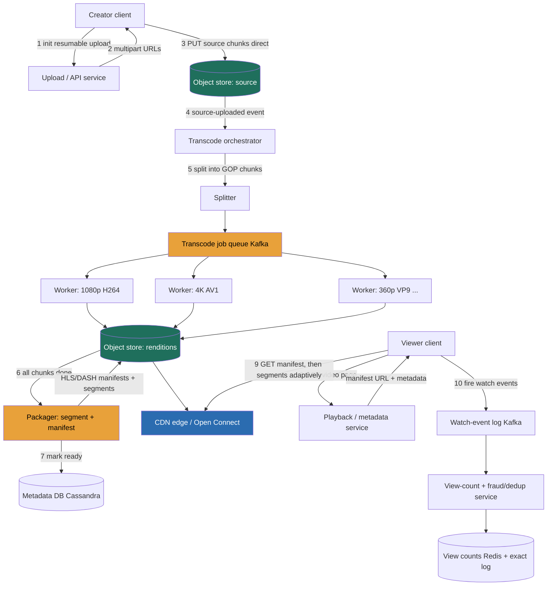

> Video looks like a streaming problem and is actually a **batch-encoding-plus-static-file-delivery** problem. The mental flip that separates a Director answer from a junior one is this: **you do not stream video from a server.** You **pre-chop** each source video, offline, into a *ladder* of small static segments — one rung per resolution, several columns per codec — and the client **adaptively pulls** those segments from a CDN like any other static file, switching rungs as its bandwidth changes. The engine that builds that ladder is a **transcoding pipeline** (one source → N resolutions × M codecs, run as parallel async jobs on chunks); the thing that forces the whole architecture is **bandwidth** — a real video service pushes **terabits per second** of egress, more bytes than almost any other system on earth. Lesson 3.11 (Blob / Object Store) built the byte plane, 3.5 (CDN) built the delivery tier, 3.8/3.9 (queues / pub-sub) built the async job fabric, and 3.16 (Sharded Counters) built the view-count machinery. This walkthrough assembles them into a video platform, drives it through **RESHADED**, and keeps returning to the one number that dominates the budget and the design: **~125 Tbps of egress.** We build **YouTube** (upload-driven, user-generated, hot view counts) as the primary system, and bring in **Netflix** (finite curated catalog, encoded once, pre-positioned at the ISP edge) as the contrast in Design evolution.

### Learning objectives
- Run a full **RESHADED** pass on a video platform, deriving every structural decision from a stated requirement and its rejected alternative.
- Quantify the system from first principles — **~500 hours uploaded/min**, **~1B watch-hours/day**, a **~1,400:1 watch:upload skew**, **~125 Tbps egress**, **~2 EB/year** of media — and use those numbers to *force* the architecture, not decorate it.
- Make the pivotal **delivery + encode** decision: **adaptive-bitrate (HLS/DASH) over a pre-built static ladder** vs server-side transcode-on-the-fly vs single-bitrate progressive download — and design the transcode pipeline as **chunked parallel jobs**, not whole-file serial encodes.
- Reason about **codec economics** (H.264 universal / VP9 / AV1) where AV1 saves **~30% of bytes** (~37 Tbps at our scale) but costs far more encode compute — a budget trade a Director owns.
- Handle **view counts at hot-key scale with fraud/dedup**, split the **upload path** (resumable multipart + object store + async transcode) from the **metadata store**, and know where to **delegate** — the codec matrix, the recommendation model, the ABR player heuristics — like a Director, not solve them like an IC.

### Intuition first
Forget "streaming" — picture a **printing-and-distribution operation for a magazine that has to be readable on a billboard, a laptop, and a cracked phone screen on a subway with one bar of signal.** When an author submits one master manuscript (you upload one source video), the plant does **not** keep the master and re-typeset a custom edition for each reader on demand — that would melt the presses. Instead, **once, up front and in the background, it prints the same content at every size and on every paper stock it might ever need**: a giant billboard version, a crisp laptop version, a tiny low-ink subway version, and a few of each on different printing technologies (codecs) because not every newsstand can display every stock. It **cuts each edition into small numbered pages** and ships pallets of those pages out to **thousands of local newsstands** (CDN edge servers) close to readers. Now when you sit down to read, your **reader app looks at how good your light is** (your current bandwidth) and **grabs the next page at whatever size you can currently handle** from the nearest newsstand — and if the train enters a tunnel, the *next page* it grabs is the tiny low-ink one, seamlessly, mid-article. That is **adaptive bitrate**: the content is pre-cut into a *ladder* of static pages at many sizes, sitting on local shelves, and the client picks the right rung page-by-page.

Hold that image, because three consequences fall straight out of it and drive the entire design. First, the expensive, slow work (**printing every edition** = transcoding into the full resolution × codec ladder) happens **once, offline, on a job queue** — never on the reader's request path. Second, the thing readers actually pull is **dumb static pages on local shelves** (segments on a CDN), so the read path is a file server, not a smart per-user video stream — which is the only way to serve a billion watch-hours a day. Third, **the pallets of paper are the cost** — at our scale the egress of those pages is **~125 terabits per second**, orders of magnitude more bytes than the records describing the videos, so bytes and bandwidth dominate every decision and the records are an afterthought by comparison. Everything below is a consequence of "pre-cut the ladder, ship it to the edge, let the client adapt," plus the brutal arithmetic of moving that many bytes.

---

## R — Requirements

RESHADED starts by scoping *before* building. The signal here is not listing features — it's **cutting** to a defensible core and naming the watch:upload reality and the bandwidth dominance that dictate everything downstream.

**Functional (the core we will actually build):**
1. **Upload a video** (with title, description, tags, thumbnail) — and have it transcoded into the full streaming ladder.
2. **Watch a video** — adaptive-bitrate playback that adjusts to the client's network, served from near the user.
3. **View count** per video (and basic engagement — likes), displayed with acceptable lag.
4. **Browse / search / recommend** — surface videos to watch (search and the recommendation model treated as a **side path**, mostly delegated).

**Explicitly cut (state these out loud, so the interviewer knows it's a choice, not an omission):**
- **Live streaming** — a genuinely different beast (real-time/low-latency transcode, LL-HLS, sub-segment chunking, no offline ladder). I'd reuse the byte plane and CDN but rebuild the encode path; I treat it as a Design-evolution extension, not v1.
- **DRM / content protection** (Widevine / FairPlay / PlayReady) — non-negotiable for *Netflix* (studios won't license without it) but a bolt-on for UGC YouTube. I name it as a **delegated workstream** (the player-security team owns key exchange + license servers; my pipeline produces encrypted segments + manifests) so the omission reads as scope control, not ignorance.
- **The recommendation model itself** — I build the system that *serves* recommendations and logs the signals (watch time, completion, co-views), and treat the ranking model as a **delegated deep-dive**. That delegation *is* the Director move.
- **Comments, channels/monetization, Shorts** — comments are the Instagram pattern (5.3), Shorts is the same pipeline with a vertical aspect ratio and a different feed, monetization is a separate billing system. Cut for time, reuse known parts.

**Clarifying questions I would actually ask** (and the assumptions I'll proceed on if waved on):
- *Scale?* Assume FAANG-YouTube: **~2B monthly users**, **~500 hours of video uploaded every minute**, **~1B watch-hours/day**.
- *Latency target — is this video-on-demand or live?* Assume **VOD**. This single answer is what *permits* the entire offline-ladder approach; if it were live, real-time encode would force a completely different pipeline.
- *Start-up latency budget?* Assume **time-to-first-frame p99 ≲ 2 s**, and **rebuffer ratio < ~0.5%** of watch time — the quality bars ABR + CDN proximity exist to hit.
- *View-count semantics?* Assume **eventually-consistent display counts are fine**, but counts must be **deduplicated and fraud-filtered** (a view counts roughly once per session; bots are filtered) — because view counts drive creator payouts and trending, so they are *not* a casual `+1`. This distinction is what forces a separate exact reconciliation path.

**Non-functional requirements (what I'll grade my own design against in Evaluation):**
- **Read-heavy, extreme.** Watch dominates upload by **~1,400:1** (derived next) — even more lopsided than Instagram's 100:1. The system is a byte-delivery machine with a tiny upload pipeline and a huge encode pipeline behind it.
- **Bandwidth is the dominant constraint.** **~125 Tbps average egress** (peak ~2.5×) is the headline number; it forces CDN/edge offload and is the single biggest budget line a Director owns. No other NFR comes close in cost.
- **Playback quality:** time-to-first-frame p99 ≲ 2 s, rebuffer < 0.5%. These are delivered by ABR (client picks a sustainable rung) + CDN proximity (segments served from near the user), not by a faster origin.
- **Durability of source + renditions** — losing a creator's upload is unforgivable; **11 nines** on the object store (Lesson 3.11). The *source* is the irreplaceable master; renditions are regenerable but expensive to rebuild.
- **Availability over strict consistency** for the watch path. A view count that lags, or a brand-new upload not yet watchable until transcode finishes, is fine; an *unavailable* watch path is not. **AP** lean (Lesson 2.7) for delivery; the *upload commit* and *billing-grade view count* want stronger guarantees, so the system is not uniformly AP.

> The requirement that secretly licenses the whole architecture is **"VOD, and a new upload need not be instantly watchable."** It is what makes **offline, asynchronous, chunked transcode** legal. I flag it explicitly because juniors skip it and then can't justify why the expensive encode is allowed to be slow.

---

## E — Estimation

RESHADED's E step is "enough math to make a defensible call," rounded aggressively, assumptions stated. The discipline that keeps the numbers consistent: pick **three anchors** and derive everything from them — **(1) 500 hours uploaded/min, (2) 1B watch-hours/day, (3) ~7 GB stored per source-hour across the full ladder×codecs.** I compute the numbers that change decisions: upload vs watch QPS (and the skew), **egress** (the headline), media storage, and the transcode compute fleet.

**Upload (write) side — tiny:**
- 500 hours/min × 60 × 24 = **~720,000 hours uploaded/day.** At ~5 min average length that's ~8.6M videos/day ÷ 86,400 ≈ **~100 video uploads/s average**, peak ~2× ≈ **~200/s.** Uploads are *not* the scaling problem — they're a trickle. (The scaling problem is what each upload *triggers*: the encode, and later the watching.)

**Watch (read) side — enormous:**
- **1B watch-hours/day.** **Watch:upload (in hours) = 1B : 720k ≈ ~1,400:1.** This is the headline ratio: the system is overwhelmingly a **read/delivery** system. It justifies a CDN absorbing nearly all bytes, pre-built static segments, and edge proximity.
- **Average concurrent streams:** 1B watch-hours/day ÷ 24 = **~42M streams in flight at any instant** (on average). Peak is materially higher (evenings, big drops).

**Egress bandwidth (the number that dominates everything):**
- Blended ABR bitrate served ≈ **3 Mbps** (a mix of 240p phones to 4K TVs; assumption, stated). 42M concurrent × 3 Mbps = **~125 Tbps average egress**, peak ~2.5× ≈ **~310 Tbps.**
- Per day: 1B watch-hours × 3,600 s × 3 Mbps ÷ 8 = **~1.35 EB/day of video egress** (~1.3 exabytes *per day*). **This is the system.** Serving even a fraction of it from origin is both latency-fatal and budget-fatal — the CDN/edge is not an optimization, it *is* the read architecture.
- **CDN offload:** at a **95% edge hit ratio** (Lesson 3.5), the origin/object store sees only ~5% = **~70 PB/day**; the CDN/edge absorbs **~1,280 PB/day.** At terabit scale, every point of hit ratio is a multi-million-dollar line item.

**Media storage (the big, ever-growing one):**
- One source-hour, transcoded into the full ladder (≈6–8 resolution rungs × 2–3 codecs), stores **~7 GB** of renditions (assumption, stated; the source mezzanine is extra and kept cold). 720k hours/day × 7 GB = **~5 PB/day usable** → **~1.8 EB/year**, and it **only grows** (UGC is kept ~forever).
- Durability overhead via **erasure coding (~1.4×)** instead of 3× replication: ~2.5 EB/year raw vs ~5.4 EB/year — the erasure-coding choice (Lesson 3.11) saves on the order of **~3 EB/year of raw disk** at our volume. That is a budget number, not a footnote; justified in S.

**Metadata storage (the deliberate contrast):**
- A video's *record* — id, owner, title, description, tags, rendition/manifest pointers, status — is **~2 KB.** 8.6M/day × 2 KB ≈ **~17 GB/day** → **~6 TB/year.**
- **Media is ~5 orders of magnitude larger than metadata** (~2 EB/year vs ~6 TB/year, a ratio in the hundreds of thousands). Even more extreme than Instagram's ~1,500×. That gulf is the entire justification for splitting bytes (object store + CDN) from records (a database) — they are not even remotely the same class of problem.

**Transcode compute (the hidden fleet):**
- Every uploaded hour must be encoded into the whole ladder, and encoding is **slower than real time** — modern codecs especially (AV1 can be **10–100× slower than real time** per rendition on CPU). Summing across ~6 rungs × ~3 codecs, encoding one source-hour over the **full ladder** can cost on the order of **tens to >100 CPU-hours.** At 720k source-hours/day, the full-ladder math is brutal: 720k × ~50 CPU-hrs ÷ 24 ≈ **~1.5M cores running continuously** (range ~0.9M–3M for ~30–100 CPU-hrs/source-hr) — a nine-figure compute line, *not* "tens of thousands." This is **precisely why we don't encode the full ladder for everything**: we run a **cheap H.264 pass for every upload** (a few CPU-hours/source-hour → a fleet ~an order of magnitude smaller) so the video is watchable fast, and **backfill the expensive VP9/AV1 rungs only for content that earns views** (most uploads get a handful of views — encoding AV1 for them is pure waste). That popularity-gated backfill is what keeps the steady-state fleet sane, and it's the reason the pipeline must be **chunked and parallel** (next, in H) so wall-clock latency stays minutes, not hours, and a single failure doesn't restart a whole movie.

> The three numbers I carry into every later decision: **~1,400:1 watch:upload** (→ edge-served static segments, CDN absorbs ~all bytes), **~125 Tbps egress** (→ the dominant cost; CDN/Open-Connect-style edge is the read architecture), and **media ≫ metadata by ~5 orders of magnitude** (→ two completely different stores). Everything else is downstream.

---

## S — Storage

The S step matches each kind of data to a store *type* and names real systems. Per the gulf above, this problem has **five distinct data shapes**, each with a different access pattern. Naming them separately — and rejecting the temptation to jam them into one database — is the signal.

| Data | Shape & access pattern | Store **type** | Real system | Rejected alternative (and why) |
|---|---|---|---|---|
| **Video segments + manifests** (the ladder: `.ts`/`.m4s` chunks, `.m3u8`/`.mpd`) | Enormous, immutable, write-once read-many-billions, whole-segment GETs from near the user | **Object/blob store + CDN/edge** | **S3 / GCS** behind **CloudFront / a private edge CDN** (Netflix: **Open Connect** appliances inside ISPs) | A database BLOB column or an NFS file server — melts at EB scale, can't reach 11 nines economically, can't sit at the edge. (Lesson 3.11.) |
| **Source / mezzanine masters** | Huge, immutable, *cold* (read only to re-encode), irreplaceable | **Object store, cold/archive tier** | **S3 Glacier-class** | Keeping sources on hot storage — pure waste; a source is read maybe once after upload (to encode) and rarely again. |
| **Video & channel metadata** | Small (~2 KB) structured rows, keyed point reads by `video_id`, very high read rate, partitionable | **Wide-column / partitioned KV** | **Cassandra** (or **Bigtable** / DynamoDB) | A single Postgres instance — fine at 6 TB *total*, but it can't absorb the metadata read rate or partition cleanly across regions without sharding work I'd rather the store own. |
| **View counts (+ likes)** | Hot write keys (a viral video), display-tolerant lag, but need exact reconciliation for payouts | **Sharded counters in-memory + exact recompute from a log** | **Redis** shards + **Kafka** event log → batch recompute (Spark/Flink) | A single `UPDATE count=count+1` row — a hot-key throughput wall on a viral video (Lesson 3.16), and no fraud/dedup hook. |
| **Watch events / signals** | Append-only firehose (every play, seek, completion), huge volume, consumed by analytics + recommendations | **Append-only log → columnar warehouse** | **Kafka** → **BigQuery / S3 + Spark** | Writing watch events into the OLTP metadata DB — pollutes the serving store with analytics write load. |

The headline storage decision and its trade: **segments + manifests go in an object store fronted by an edge CDN; sources go cold; records go in a partitioned wide-column DB; counts live in Redis with an exact log behind them; watch events go to a log/warehouse.** I'm rejecting the "one database for everything" answer not because the DB is bad — at 6 TB of metadata it would *hold* the records — but because (a) it cannot host ~2 EB/year of bytes durably or economically, and (b) nothing but a CDN can serve ~125 Tbps from near the user. The store choice is forced by the **three numbers** from Estimation, exactly as it should be.

Two sub-decisions worth defending:
- **Edge durability/cost via erasure coding vs 3× replication** (Lesson 3.11): erasure coding reaches ~11 nines at **~1.4× overhead instead of 3×**, saving on the order of **~3 EB/year of raw disk** at our volume — I take it for the warm/cold bulk, accepting slower reconstruction on the rare degraded read. *Rejected:* 3× everywhere — simpler/faster reconstruct, but at EB scale the 200% overhead is a budget I won't sign.
- **Keep the source as a cold mezzanine, encode renditions from it.** *Rejected:* discarding the source after encoding to save storage — tempting, but if I add a new codec (say AV1 later, or a new rung) I'd have to re-encode from a lossy rendition (quality loss) or can't at all. The source is the irreplaceable master; cold storage is cheap; keep it.

---

## H — High-level design

The H step is "think in components": a box diagram plus the happy path in prose. Three flows matter — the **upload path**, the **transcode pipeline** (the engine, where I go deep), and the **watch path** — and the key architectural statement is that **transcode happens offline as chunked parallel jobs, and the watch path is a dumb CDN of static segments.**



**Happy-path: upload (write).** The creator's client initiates a **resumable multipart upload** and PUTs the source **directly to the object store** in chunks (the app servers never touch the bytes — a 10 GB source over a flaky connection would crush them; resumability means a dropped connection retries one chunk, not the whole file). The completed source fires a **`source-uploaded` event** to the **transcode orchestrator**, and the API **commits a metadata row** (`status: processing`) so the video exists in the catalog immediately, just not yet watchable.

**Happy-path: transcode (the engine — go deep here).** The orchestrator **splits the source into independent chunks at GOP/keyframe boundaries** (so each chunk is self-contained and decodable alone), and emits one **transcode job per (chunk × rung × codec)** onto a Kafka job queue. A **fleet of stateless workers** pulls jobs and encodes in parallel — chunk 7 at 1080p/H.264 on one worker, chunk 12 at 4K/AV1 on another. Because the work is chunked, a 2-hour movie's full ladder finishes in **minutes of wall-clock, not hours**, and a single worker crash re-queues **one chunk**, not the whole encode (idempotent per chunk id). When all chunks for a rung are done, a **packager** stitches them, cuts the final **streaming segments** (2–6 s `.m4s`/`.ts` each), and writes the **HLS/DASH manifests** (the playlists that list every rung and its segment URLs) back to the object store, where the CDN can pull them. Finally it flips the metadata row to `ready`. **This chunked-parallel DAG is the heart of the problem** — it's why encode is fast, fault-tolerant, and elastically scalable.

**Happy-path: watch (read).** The viewer's client hits the **playback/metadata service**, which returns video metadata plus the **manifest URL**. The client fetches the **manifest from the CDN**, sees the available rungs (240p…4K) and codecs, **measures its own bandwidth, and pulls segments adaptively** — starting low for a fast first frame, climbing rungs as throughput allows, dropping instantly if the network degrades. **Every byte of video comes from the CDN edge, never from us** — that's the only way to serve 125 Tbps. In parallel the client fires **watch events** (play, seek, completion) to a Kafka log; the **view-count service** consumes them, **dedups and fraud-filters**, and updates the (sharded) count. This split — tiny metadata call to us, all bytes from the edge, ABR on the client — is what makes p99-first-frame ≲ 2 s feasible at this scale.

---

## A — API design

The A step defines the interface. Keep it small; the non-obvious choices are the **resumable multipart upload** (a 10 GB source must survive a flaky connection), the **manifest-based playback** (we hand out a manifest URL, not a byte stream), and the **fire-and-forget watch-event beacon**.

```
# --- Upload (resumable / multipart) ---
POST /v1/uploads:init
  body: { filename, size_bytes, content_type }
  -> { upload_id, part_urls[], part_size }          # client PUTs source chunks straight to object store

POST /v1/uploads/{upload_id}:complete
  body: { parts:[{part_number, etag}] }              # assembles the multipart source
  -> { video_id, status: "processing" }              # returns BEFORE transcode finishes

POST /v1/videos
  body: { video_id, title, description, tags[], thumbnail_upload_id }
  -> { video_id, status: "processing" }

GET  /v1/videos/{video_id}
  -> { video_id, title, channel, status, manifest_url, thumbnails, view_count, created_at }
                                                      # status flips processing -> ready when packaged

# --- Playback (we return a MANIFEST URL; bytes come from the CDN) ---
GET /v1/videos/{video_id}/manifest
  -> 302 redirect to  https://cdn.example.com/<video_id>/master.m3u8   (HLS) or /manifest.mpd (DASH)
  # the client then GETs the manifest + segments directly from the CDN, choosing rungs adaptively

# --- Watch events (fire-and-forget beacon; powers counts + recommendations) ---
POST /v1/videos/{video_id}/events           body: { session_id, type: play|seek|heartbeat|complete, position_ms }
  -> 202                                            # never on the critical playback path

# --- Engagement ---
POST /v1/videos/{video_id}/likes            -> 202   # idempotent per (user, video)

# --- Browse / search / recommend (recommendation model delegated) ---
GET /v1/search?q=&cursor=&limit=20          -> { results:[...], next_cursor }
GET /v1/recommendations?cursor=&limit=20    -> { videos:[...], next_cursor }    # candidate set; ranking owned by ML team
```

Three decisions worth defending. **Resumable multipart upload, not a single presigned PUT:** Instagram's 1.5 MB photo (5.3) is fine with one PUT, but a multi-GB source over mobile *will* drop mid-upload; multipart + resume retries one part, not the whole file. *Rejected:* single-shot PUT — simpler, but a failed upload of a 10 GB source is a furious creator and wasted bandwidth. **Playback returns a manifest URL (a 302 to the CDN), not a video byte stream:** the manifest is the entire ABR mechanism — it lists every rung and codec and lets the *client* adapt. *Rejected:* a `GET /video/{id}/stream` that proxies bytes through us — that puts us in the 125 Tbps path and defeats the CDN; we must hand off to the edge. **Watch events are 202 fire-and-forget:** they feed counts and recommendations but must **never** block or slow playback. *Rejected:* a synchronous "register view" call that returns the new count — it would put a hot, sharded, fraud-checked counter on the critical playback path (the exact anti-pattern of Lesson 3.16).

---

## D — Data model

The D step is "know where data lives": schema, keys, and — the part that matters at scale — the **partition/shard key**, because the partition key is what decides whether your hottest query hits one node or fans across the cluster.

**`videos` (Cassandra) — the metadata row.** Partition key `video_id` for point reads; a second query-shaped table for a channel's video list.
```
videos:          PK = video_id
                 (channel_id, title, description, tags, status,
                  manifest_keys{hls,dash}, rendition_keys[], thumbnail_keys[], created_at)
videos_by_chan:  PK = channel_id, clustering key = created_at DESC   # "show me a channel's uploads"
```
`manifest_keys`/`rendition_keys` are just object-store paths (e.g. `s3://renditions/ab/cd/<video_id>/1080p_h264/seg_0007.m4s`); **the bytes are not in the DB.** The two-table pattern (denormalize by query) is the Cassandra idiom from Lesson 2.3 — a table per access path rather than secondary indexes.

**Transcode job tracking (orchestrator state).** A small store tracking each chunk job so the packager knows when a rung is complete and crashes are idempotent:
```
transcode_jobs:  PK = video_id, clustering = (rung, codec, chunk_idx)
                 (status: queued|running|done|failed, attempt, worker_id, output_key)
```
Keyed by `video_id` so all of one video's job state is one partition (a bounded ~tens-of-thousands-of-rows partition — a 2-hour movie at 6 s chunks × 6 rungs × 3 codecs is ~20,000 rows, fine). Idempotency is per `(video_id, rung, codec, chunk_idx)` — re-running a failed chunk overwrites the same output key.

**View counts — sharded, with an exact log (Lesson 3.16).** The count is **not** a column you `UPDATE`; a viral video is a hot write key. It is **N sub-counters summed on read**, *plus* a separate exact figure recomputed from the watch-event log for payouts:
```
view_count:{video_id}:{shard}   shard in 0..N-1     # increment a deduped shard; sum on read for display
# authoritative count = recompute from the Kafka watch-event log (deduped per session, bot-filtered) in batch
```
Partition/shard key for the display counter = `video_id` hashed into N Redis shards. The **dedup** (count once per `session_id` within a window) lives in the view-count service *before* the increment — this is the load-bearing difference from a like counter.

**Watch events (Kafka → warehouse).** Append-only, partitioned by `video_id` (so all events for a hot video stream through a bounded set of partitions but parallelize across videos):
```
watch_events:  key = video_id, value = {session_id, user_id, type, position_ms, ts}
```
The **partition-key choices are the load-bearing detail**: `video_id`/`channel_id` spread point reads and event streams evenly, while the *viral video's counter key* is the one hot spot the next step exists to fix — and the watch-event log is what lets the exact count be recomputed independently of the fast display counter.

---

## E — Evaluation

The second E is where you **stress your own design**: re-check against the NFRs and hunt the bottlenecks — hot keys, single points, tail latency, write amplification — and **fix each, naming the trade the fix makes.** This is the highest-signal section for a Director; an architecture with no self-identified failure modes reads as untested.

**Bottleneck 1 — Egress cost and origin meltdown (the headline failure).** ~125 Tbps (peak ~310 Tbps) cannot be served from origin — it would be both latency-fatal and budget-fatal, and a single popular new video could saturate origin egress.
> **Fix — push ~all bytes to the edge, and raise the hit ratio relentlessly.** Pre-built **static segments on a CDN** (Lesson 3.5) take 95%+ of traffic; **origin shielding / tiered caches** keep a viral video's first-views from stampeding origin; **predictive pre-positioning** pushes anticipated-hot content to edges before demand (this is exactly Netflix Open Connect's model — appliances *inside* ISPs). **Trade:** more storage at the edge and a pre-positioning system (and stale-content invalidation complexity) in exchange for collapsing ~1.3 EB/day to ~70 PB/day at origin and serving from near the user. *Rejected:* serving from a few big origin regions — simpler, but the egress bill and the cross-ocean latency both make it impossible.

**Bottleneck 2 — Transcode throughput, latency, and cost.** Whole-file serial encoding of a 2-hour 4K source across ~6 rungs × ~3 codecs takes *hours*, and one failure restarts the lot — unacceptable for "video watchable in minutes," and the AV1 compute alone is a fleet.
> **Fix — chunked parallel transcode (the engine from H).** Split at GOP boundaries, fan thousands of independent chunk jobs across a stateless worker fleet, idempotent per chunk, packaged when complete. **Trade:** orchestration complexity (split/track/stitch, the `transcode_jobs` table) and a packaging step for **minutes-not-hours latency, fault isolation (a crash re-queues one chunk), and elastic scaling**. On the codec axis: **encode the cheap universal H.264 first** so the video is watchable on anything within minutes, then **backfill VP9/AV1 asynchronously** for the bandwidth savings — so first-watchability never waits on slow AV1. *Rejected:* whole-file serial encode — simplest, but hours of latency and an all-or-nothing failure mode.

**Bottleneck 3 — Codec economics (a bandwidth/compute trade worth real money).** Single-codec H.264 is universally playable but ~30% more bytes than AV1; at 125 Tbps that "30%" is **~37 Tbps** of egress (and the matching CDN/transit bill). Pure AV1 saves it but is far slower to encode and won't play on old devices.
> **Fix — multi-codec ladder, serve the best the client supports.** Encode **H.264 (universal floor), VP9 (broad modern support), AV1 (best compression for capable clients)**; the manifest advertises all, the client picks. **Trade:** ~2–3× the encode compute and storage for **up to ~30% egress reduction on the (large, modern) share of traffic that can take AV1** — and at terabit scale the egress savings dwarf the encode/storage cost. *Rejected:* one codec — either you overpay egress forever (H.264-only) or you break old devices (AV1-only).

**Bottleneck 4 — Hot view-count key + fraud.** A viral video takes views faster than one Redis key or DB row can serialize (`count = count + 1` is one lock/partition; Lesson 3.16), *and* naive counting is trivially gamed (bots, replays inflating payouts).
> **Fix — dedup + sharded display counter + exact log reconciliation.** The view-count service **dedups per `session_id`** and applies **fraud heuristics** before counting; the display count is **N sharded sub-counters summed on read** (a viral video needs only a handful of Redis shards at ~100k ops/s/key); the **payout-grade count is recomputed exactly and offline from the Kafka watch-event log**, fully deduped and bot-filtered. **Trade:** the display count is **eventually consistent and approximate** (acceptable per R) while the money number is **exact but delayed** — two numbers on purpose. *Rejected:* one atomic counter — a hot-key throughput wall *and* no place to put fraud logic.

**Bottleneck 5 — Tail latency: time-to-first-frame and rebuffering.** A cold/distant segment, or a client that opens at too high a rung, spikes startup time and causes rebuffers — the quality NFRs (p99 TTFF ≲ 2 s, rebuffer < 0.5%) live here.
> **Fix:** **start low, climb fast** (the player requests a low rung first for an instant first frame, then ramps), **short initial segments**, **edge proximity** (segment served from the nearest PoP), and a **healthy buffer-ahead** so a momentary dip doesn't stall. **Trade:** a slightly-lower-quality first few seconds for a fast, stall-free start — exactly the ABR bargain. The player heuristic itself I'd **delegate** to the client/media team with a stated prior (buffer-based + throughput-estimate hybrid).

**Bottleneck 6 — Single points / availability.** Object store + CDN are managed/multi-region by design. The risks are the **transcode orchestrator** and the **view-count path.** Transcode is **stateless and replayable from Kafka** — if it falls behind, new uploads go watchable late (degraded, not broken), and chunk jobs are idempotent. View counting is **replayable from the event log** — a lost Redis counter is **recomputed from Kafka**, so a cache failure never loses the authoritative number. **Trade:** late-appearing uploads / briefly-stale counts under failure for the guarantee that **no source bytes and no payout-grade view is ever lost** — Redis and the encode fleet are accelerators, never the source of truth.

**Re-check vs NFRs:** ~1,400:1 watch skew + ~125 Tbps — met by static segments on a CDN/edge absorbing ~95% (origin ~70 PB/day). TTFF ≲ 2 s / rebuffer < 0.5% — met by ABR (start-low-climb-fast) + edge proximity. Durability 11 nines — met by object store + erasure coding, source kept cold as the master. Availability/AP watch path — met by Kafka-replayable transcode + counts and CDN delivery. Cost — edge offload + AV1 (~37 Tbps saved) + erasure coding (~3 EB/yr raw saved) are the levers a budget owner pulls.

---

## D — Design evolution

The final D justifies the trade-offs and pushes past v1: **how it scales at 10×, the Netflix contrast, the hardest trade-offs, what I'd revisit, and where I'd delegate** — the Director's "think past v1."

**At 10× (~1.25 Pbps egress, ~10B watch-hours/day):**
- **Egress is the wall, and it's a physical/commercial one, not just software.** The lever stops being "add servers" and becomes **own the edge**: deploy **ISP-embedded caching appliances** (the Open Connect model) so bytes never traverse expensive transit, push the **CDN hit ratio toward 99%** with predictive pre-positioning of anticipated-hot content, and **lean harder on AV1** (every point of AV1 adoption is terabits saved). At 1.25 Pbps these are nine-figure budget lines a Director defends to finance, and I'd **delegate the edge-placement/peering strategy to the network/infra team** with the prior "embed at the ISP for the top-N titles by region; CDN for the tail."
- **Transcode scales out cheaply** (it's embarrassingly parallel) — the lever is **encode efficiency**: per-title / per-scene encoding (spend more bits only on complex shots), and prioritizing the codec backfill toward the most-watched content so AV1 savings land where the egress actually is.
- **Storage lifecycle-tiers aggressively** — most UGC is watched heavily for days then almost never; tier cold renditions and sources to archive class (an order of magnitude cheaper). At ~2 EB/year the tiering decision is itself a multi-million-dollar/year budget line (Lesson 3.11).

**The Netflix contrast (same byte plane, opposite encode/serve economics — the "new constraint" lens):**
- **Finite, curated catalog, not a UGC firehose.** No 500-hours-a-minute ingest and **no hot view-count problem** (a fixed catalog, counts are not the product). So the upload pipeline shrinks to an **internal ingest** of studio masters.
- **Encode once, optimize obsessively.** With a finite catalog you can afford **per-title and per-shot encoding** — bespoke bitrate ladders per title — because each title is watched millions of times; the encode cost amortizes to nothing per view. (YouTube can't: most uploads get a handful of views, so it uses a cheaper one-size ladder and only re-encodes the long tail's winners.)
- **Pre-position the whole catalog at the ISP edge (Open Connect).** Because the catalog is finite and demand is predictable, Netflix ships appliances into ISPs and **pre-loads tonight's likely-watched titles overnight** — so peak-evening traffic is served from a box inside your ISP. YouTube's catalog is too large/long-tail to fully pre-position, so it leans on a general CDN + caching.
- **DRM and recommendations move to the core.** Studio licensing **mandates DRM** (the scope cut I flagged in R becomes central), and with a finite catalog the **recommendation model is the product** (it decides what the limited shelf surfaces), not a side path.

**The hardest trade-offs (genuinely contested):**
1. **How rich a ladder, and which codecs, per content tier.** Encoding the full ladder × 3 codecs for a video that gets 12 views is pure waste; under-encoding a viral hit overpays egress forever. The senior answer is **adaptive**: cheap H.264 ladder for everything, **backfill richer rungs/AV1 only for content that earns views** — a monitored, content-popularity-driven policy, not a constant.
2. **Pre-positioning vs on-demand caching at the edge.** Pre-positioning cuts peak egress and latency but wastes edge storage on content that isn't watched; it pays off only for predictable demand (Netflix) and partially for YouTube's head. A per-region, per-tier call, not global.
3. **Erasure coding vs replication for *hot* renditions.** Erasure coding saves EB-scale disk but makes a **degraded read slower** (reconstruct from parity); for the hottest, newest renditions I might replicate and only erasure-code the warm/cold bulk — per-tier, not global.

**What I'd revisit first:** the **view-count fraud pipeline** (it feeds creator payouts and trending — adversaries actively game it, so the exact, log-reconciled, bot-filtered path is a security surface, not a nice-to-have), and the **codec-backfill prioritization** (getting AV1 onto the *right* content is where the terabits actually get saved).

**Where I'd delegate a deep-dive (explicit Director signal):**
- **Codec/encoder matrix + per-title encoding** → the media/encoding team — codec selection, rung design, GPU-vs-CPU encode economics. My prior: chunked, idempotent, H.264-first-then-backfill.
- **ABR player heuristic** → the client/media team — buffer-based vs throughput-estimate switching. My prior: a hybrid that starts low and climbs.
- **Recommendation model + ranking** → the ML team. My architecture delivers the candidate set + logs the watch signals; the model is theirs.
- **Edge placement / ISP peering / Open Connect** → the network team — "benchmark ISP-embedded appliances vs third-party CDN for the top-N regional titles; my prior is embed for the head, CDN for the tail."

Naming *what* I'd delegate, *to whom*, and *with what prior* is the altitude this round is scoring — I go deep where the decision turns (the chunked-parallel transcode pipeline and the edge/codec cost levers) and hand off the rest credibly.

---

## Trade-offs table — the pivotal decisions

| Decision | Option A | Option B | Option C (chosen, usually) | Use A when… / Use B when… / Use C when… |
|---|---|---|---|---|
| **Delivery model** | **Server-side transcode-on-the-fly** (encode per request) | **Single-bitrate progressive download** (one file, byte-range) | **Adaptive bitrate (HLS/DASH) over a pre-built static ladder** | A: ~never at scale (uncacheable, melts compute). B: tiny scale, uniform fast networks, short clips. **C: any real VOD platform — pre-cut ladder + CDN + client adaptation is the default.** |
| **Encode pipeline** | **Whole-file serial transcode** (simple) | — | **Chunked parallel transcode** (split at GOP, fan out, stitch) | A: short clips, low volume, latency-insensitive. **C: anything longer than a clip — minutes-not-hours latency, fault isolation, elastic scale.** |
| **Codecs** | **Single codec (H.264)** universal, simple | **Single codec (AV1)** best compression | **Multi-codec (H.264 + VP9 + AV1), serve best supported** | A: must play on everything, egress not the bottleneck. B: closed modern-only ecosystem. **C: huge egress + mixed device base — pay encode compute to save ~30% bytes (~37 Tbps).** |
| **View count** | **Single atomic counter** (strong, simple) | **Sharded display counter** (write÷N, approximate) | **Dedup + sharded display + exact log reconciliation** | A: low write rate, no fraud concern. B: viral, display-only. **C: viral counts that feed payouts/trending and must resist fraud — the YouTube case.** |

(Two more decisions argued inline above, each with its rejected alternative: **resumable multipart upload** vs single presigned PUT, and **manifest-URL playback (302 to CDN)** vs proxying the byte stream through our servers.)

---

## What interviewers probe here (Director altitude)

At Director altitude they are not checking whether you can name HLS. They're checking whether you grasp that video is offline-encode + static-edge-delivery, can **price** the bandwidth, and know what to delegate.

- **"How does video actually get from upload to a viewer's screen?"** — *Strong signal:* "we don't stream from a server" — pre-built ABR ladder of static segments on a CDN, offline **chunked-parallel** transcode into resolutions × codecs, client pulls segments adaptively via a manifest; names ~125 Tbps as why the edge is the architecture. *Red flag:* "the server streams the video to the client" with no ladder, no CDN, no encode pipeline.
- **"Walk me through the transcode pipeline."** — *Strong:* split at keyframes → fan out chunk jobs across a stateless fleet → idempotent per chunk → package + manifest → H.264-first then backfill AV1; names the minutes-vs-hours and fault-isolation wins. *Red flag:* "run ffmpeg on the file" — whole-file, serial, no fault model, hours of latency.
- **"What's your egress, and what does it cost you?"** *(the cost signal that defines this problem)* — *Strong:* ~125 Tbps avg (peak ~310), 95% CDN offload → ~70 PB/day origin, AV1 saves ~37 Tbps, Open-Connect-style edge for the head — read as both a latency and a nine-figure budget story. *Red flag:* "use a CDN, it's faster" with no bytes, no offload ratio, no cost.
- **"A video goes viral — what breaks?"** — *Strong:* names the **hot view-count write key** (shard it, dedup per session, fraud-filter, exact recompute from the log for payouts) *and* the **origin egress stampede** (origin shielding / pre-positioning). *Red flag:* "add read replicas" (replicas don't relieve a hot *write* key, and the bytes are on the CDN anyway).
- **"What would you not build yourself?"** *(delegation signal)* — *Strong:* the codec/encoder matrix + per-title encoding, the ABR player heuristic, the recommendation model, the ISP-edge peering strategy — each handed off **with a stated prior**. *Red flag:* trying to hand-tune an AV1 encoder or design the ranking model live (too deep, wrong altitude) — or "the team handles it" with no prior.

---

## Common mistakes

- **Thinking video is "streamed" from a server.** It's **pre-encoded into a static ladder** and served as files from a CDN; the client adapts. Missing this means missing the whole problem.
- **Transcode-on-the-fly or whole-file serial encode.** On-the-fly is uncacheable and melts compute; whole-file serial is hours of latency with all-or-nothing failure. Use **chunked parallel** jobs off a queue.
- **Putting the app servers (or origin) in the byte path.** Proxying 125 Tbps through your servers, or serving it from a few origins, is self-inflicted and impossible. Hand bytes to the **edge**.
- **Storing video bytes in the database.** EB-scale, can't reach 11 nines economically, can't sit at the edge. Bytes → object store + CDN; records → DB.
- **A single bitrate / single codec.** No adaptation means buffering on bad networks; one codec means either egress overpayment (H.264-only) or broken old devices (AV1-only).
- **Counting views with one atomic counter and no dedup.** A hot-key write wall *and* trivially gamed — shard it, **dedup per session, fraud-filter**, and keep an **exact log-reconciled** number for payouts (Lesson 3.16).
- **Synchronous transcode or synchronous "register view" on the request path.** Both belong **off the critical path** on a queue/beacon; upload returns in ms with `status: processing`, playback never waits on counting.
- **Discarding the source after encoding.** You can't add a new codec/rung later without it (or only from a lossy rendition). Keep the source as a **cold master**.
- **No quantification.** "Use a CDN, it scales" with no Tbps, EB, or offload-ratio math reads as not-technical-enough-to-lead — and bandwidth *is* this problem.

---

## Interviewer follow-up questions (with model answers)

**Q1. A user uploads a 2-hour 4K film. Walk me from the PUT to it being watchable, and where does the time go?**
> *Model:* Resumable multipart PUT of the source **straight to the object store** (app servers out of the byte path); on completion, a `source-uploaded` event hits the orchestrator and the metadata row is committed as `processing` — the video exists immediately. The orchestrator **splits the source at GOP boundaries** and fans **thousands of chunk-encode jobs** (chunk × rung × codec) across a stateless worker fleet via Kafka; this parallelism is why a 2-hour film's ladder finishes in **minutes, not hours**. To minimize *time-to-watchable*, I encode the **universal H.264 ladder first** and flip the row to `ready` the moment that's packaged into segments + a manifest; **VP9/AV1 backfill asynchronously**. The time goes into encode CPU (AV1 especially is far slower than real time), which is exactly why it's chunked and parallel and why the cheap codec gates watchability. A single worker crash re-queues **one chunk** (idempotent), not the film.

**Q2. Your CDN bill is the biggest line in the budget. Where do you cut without hurting playback?**
> *Model:* Three levers, biggest first. (1) **Raise the edge hit ratio** toward 99% — tiered caching, origin shielding, and **pre-positioning anticipated-hot content** to edges (the Open Connect model: appliances *inside* ISPs so bytes skip transit). Every point of hit ratio at ~125 Tbps is huge. (2) **Drive AV1 adoption** on the traffic that can take it — ~30% fewer bytes is **~37 Tbps** off the bill; prioritize the AV1 backfill toward the **most-watched** content so the savings land where the egress is. (3) **Per-title / per-scene encoding** for popular titles — spend bits only on complex shots. I would *not* drop rungs that hurt low-bandwidth users or shrink the buffer (that spikes rebuffering). The cuts target **bytes-on-the-wire efficiency and edge placement**, where the cost lives and the viewer never notices.

**Q3. How do you count views accurately when a video is viral and people are gaming the counter for payouts?**
> *Model:* Two numbers on purpose (Lesson 3.16). The **display count** is fast and approximate: the view-count service **dedups per `session_id`** within a window and applies fraud heuristics *before* incrementing a **sharded** counter (N Redis shards so a viral video's writes don't serialize on one key), summed on read. The **payout-grade count** is **exact and offline**: recomputed in batch from the **Kafka watch-event log**, fully deduped, bot-filtered (rate/behavior/device-fingerprint signals — itself a **delegated** anti-fraud workstream), and that's the number that touches money and trending. The display count can lag and be approximate (R allowed it); the money number must be exact, so it's a separate pipeline reading the immutable event log — never the live counter.

**Q4. The same blockbuster drops globally at 8pm and everyone hits play at once. What happens, and how is it not an outage?**
> *Model:* Two stampedes to absorb. **Bytes:** the segments are static and **already on the edge** — if it's a planned drop (Netflix-style), I **pre-position** the title to ISP-embedded appliances overnight, so 8pm traffic is served from inside each ISP, never from origin. For an unplanned spike, **origin shielding + tiered caches** mean the first edge miss pulls once and every subsequent viewer is served from cache; origin sees a trickle, not the flood. **Metadata/counts:** the metadata read is tiny and cache-served; the **view-count writes are sharded and async** (a beacon, off the playback path), so a spike of counts can't slow playback. The watch path degrades gracefully — worst case a slightly slower first segment for the first few viewers in a region — but it doesn't fall over, because the heavy bytes were positioned ahead of demand and the counting is off the critical path.

**Q5. How does YouTube differ from Netflix architecturally, and why?**
> *Model:* Same **byte plane** (object store + ladder + edge), opposite **encode/serve economics**, driven by **catalog shape**. YouTube is a **UGC firehose** — 500 hours/min, most uploads get few views — so it uses a **cheap one-size ladder**, re-encodes richer/AV1 only for content that earns views, can't fully pre-position a long-tail catalog (general CDN + caching), and has a **hot view-count + fraud** problem because counts drive payouts. Netflix has a **finite curated catalog** — no upload firehose, **no hot-count problem** — so it can afford **per-title/per-shot encoding** (amortized over millions of views), **pre-position the whole likely-watched catalog at the ISP edge (Open Connect)** because demand is predictable, and it makes **DRM and the recommendation model core** (studios mandate DRM; a finite shelf makes recommendation the product). The decision driver is catalog size and demand predictability, not the streaming tech — which is shared.

---

## Key takeaways

- **Video is offline-encode + static-edge-delivery, not server-side streaming.** Pre-chop each source into a **ladder of static segments** (resolutions × codecs), put them on a **CDN/edge**, and let the **client adapt** (HLS/DASH) — the read path is a file server, not a streaming server, which is the only way to serve ~1B watch-hours/day.
- **Drive it with three numbers:** **~1,400:1 watch:upload** (→ edge serves ~all bytes), **~125 Tbps egress** (→ the dominant cost; the edge *is* the read architecture; AV1 saves ~37 Tbps), and **media ≫ metadata by ~5 orders of magnitude** (~2 EB/yr vs ~6 TB/yr → bytes in an object store + CDN, records in a partitioned DB). The architecture falls out of the arithmetic.
- **The transcode pipeline is the engine — make it chunked and parallel.** Split at GOP boundaries, fan thousands of idempotent chunk jobs across a stateless fleet, package + manifest, **H.264-first then backfill AV1** — minutes-not-hours latency, fault isolation, elastic scale.
- **Keep heavy work off the critical paths:** **resumable multipart** uploads straight to the object store, **async transcode** on a queue, **fire-and-forget watch beacons** — upload returns in ms (`processing`), and playback never waits on counting.
- **At Director altitude, name the trade and delegate:** go deep on the transcode DAG and the edge/codec cost levers (where the decision turns), price the egress as a budget owner, **shard + dedup + fraud-filter** the view count with an exact log-reconciled number for payouts, and hand the **codec matrix, ABR player heuristic, recommendation model, and ISP-edge peering** to their teams **with a stated prior**.

> **Spaced-repetition recap:** A printing plant that prints every edition (resolution × codec) **once, offline**, cuts each into numbered pages (segments), and ships pallets to local newsstands (the **CDN/edge**); your reader app grabs the right-size next page based on your signal (**adaptive bitrate**). The expensive encode is a **chunked-parallel** job fabric off the request path; the watch path is a **dumb CDN of static files** because egress is **~125 Tbps** — orders of magnitude more bytes (~2 EB/yr) than the records (~6 TB/yr). **Multi-codec** (H.264 floor, AV1 saves ~30%), **sharded + deduped + fraud-filtered** view counts with an exact log behind them. **YouTube** = UGC firehose + hot counts; **Netflix** = finite catalog, per-title encode, **pre-positioned at the ISP edge**, DRM + recommendations core. Drive it all through **RESHADED** and name every trade + what you'd delegate.
