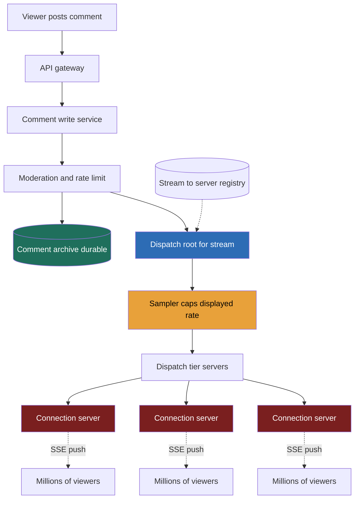

> **Why this gets asked at Director level:** This is the strongest single-company frequency signal in the course, Meta engineering managers attribute it across four independent sources. It looks like WhatsApp but is its near-opposite: messaging fans out to a handful of recipients with a **durable per-person inbox**; Live comments fan out one stream to **millions of viewers with no inbox at all**, a comment seen late is worthless, so you drop it rather than store it. The Director signal is treating the **connection-server fleet as a cost line you defend with math**, not a box on a diagram, and treating **graceful degradation as a product spec**, knowing exactly which guarantee you sacrifice first (ordering, then completeness, never the stream). The canonical failure is reaching for WebSocket and Kafka-per-viewer by reflex and never costing the fleet.

### Learning objectives

1. Run the **RESHADED** spine on a problem whose crux is **connection state at extreme fan-out**, not storage or read:write ratio, the design exists for the celebrity stream, not the average one.
2. Choose the transport, **SSE vs WebSocket vs long-poll**, as a **fleet-cost decision** with per-connection memory and dollar math, not a protocol-feature checklist.
3. Tame **hot-stream skew**: a 5M-concurrent stream is a hot partition a naive per-viewer subscription melts; fan out through a tiered dispatch tree, not an inbox.
4. Design **graceful degradation as a ladder**, sample, then drop ordering, then coalesce, and state which guarantee you shed first and why.
5. Operate at Director altitude: keep the durable surface tiny, defend a worse-but-cheaper experience with cost numbers, and delegate dispatch-tree internals and connection-server tuning with a stated prior.

### Intuition first

Picture a **live stadium event** where the broadcaster wants every comment from the crowd shown on a giant screen. With 200 people that is easy. With **5 million** shouting at once, two things become obvious. First, you cannot show every comment, the screen would be an unreadable blur, so you **sample**: show a representative trickle, silently drop the rest, and nobody minds because it was always a firehose. Second, the cost is not the *content* (a comment is 100 bytes), it is **holding 5 million open phone lines at once** so each person hears the trickle in real time. That is the whole problem: **the expense is the connections, not the data.**

Now the contrast that defines this lesson. WhatsApp is a **switchboard with mailboxes**: if Bob is offline, his message waits in a durable inbox and is delivered in order the instant he returns. Live comments have **no mailbox**, a comment seen 30 seconds late is noise. So you fan out **one stream to millions** with no per-viewer queue, **delete-by-default**, and protect only the open connection. Two consequences: the design is dominated by a **stateless connection-server fleet** you cost like a utility bill, and **degradation is a feature**, under load you ship a cheaper, lossier experience rather than dropping anyone off the stream.

---

## R: Requirements

> State the load-bearing fact out loud: this is **one-to-millions ephemeral fan-out with no durable inbox**, the opposite shape from messaging.

**Clarifying questions I would ask (with assumed answers):**

- *Real-time comments on a live video, or a chat with history?* → **Real-time ephemeral comments** under a live post; the value is *now*. A late comment is dropped, not queued. The design driver.
- *Do we guarantee every viewer sees every comment?* → **No.** On a hot stream we **sample**, best-effort delivery of a representative subset. Lossy by design.
- *Are comments durable / replayable after the stream ends?* → **A small write-path archive yes; the real-time fan-out path no.** The durable surface is tiny and off the hot path.
- *Biggest stream we must survive?* → **5M concurrent viewers** on a single celebrity/event stream, the whole architecture is built for this hot-partition case.
- *Ordering?* → **Best-effort recency, not strict order.** Under load, ordering is the *first* guarantee we drop. Causal "reply-to" can be approximated client-side.

**Functional requirements:**

1. **Post a comment** on a live stream (write path).
2. **Receive comments** in near-real-time as a viewer (the fan-out path, the hard part).
3. **Sample / rate-limit** the displayed comment stream on hot videos.
4. **Join / leave** a stream's comment channel (connection lifecycle).
5. **Light moderation hook**, drop blocked/abusive comments before fan-out.

**Explicitly CUT (scoping is the signal):** the video pipeline (ingest/transcode/CDN), durable chat history and search, threaded reply trees, reactions analytics, monetization. I scope to **post → moderate → fan out → display, sampled**. Notably I **do not** build a WhatsApp-style durable per-viewer inbox, wrong tool, and naming why is half the answer.

**Non-functional requirements:**

- **Fan-out latency**, a posted comment reaches connected viewers in **p99 < 2 s**. Live enough to feel real, loose enough to batch.
- **Connection scalability**, sustain **millions of concurrent connections per stream**, tens of millions platform-wide, **at defensible cost**. The headline NFR.
- **Graceful degradation**, under overload, shed *quality* (sampling, ordering) before *availability* (the stream stays up for everyone).
- **Availability**, high but eventual; an **AP** system end-to-end, no correctness invariant to protect (unlike Ticketmaster).
- **Cost-efficiency**, explicitly an NFR. A Director owns the fleet budget; "it scales" is banned when each connection costs money.

**The skew, stated.** This is **fan-out-on-write to live connections**, but unlike WhatsApp the recipient count per write is **millions, not ~2.5**, with **no durable inbox**, an offline viewer simply misses comments. The architecture follows: a big, cheap, stateless **connection-server fleet** fed by a **tiered dispatch tree** spraying a sampled stream outward, the only durable component a small write archive off the hot path.

---

## E: Estimation

> The adaptation: **Estimation is the connection-fleet cost math.** The headline isn't QPS, it is *how many connection servers the hot stream demands and what they cost*. That number, not taste, picks the transport.

**Assumptions:** peak ~10M concurrent live viewers platform-wide across many streams; one celebrity stream can hold **5M concurrent**; ~1% of viewers comment, each ~1 comment / 30 s while active; comment payload ~150 B with metadata.

**Comment write rate (small, not the problem):**
```
5M viewers × 1% commenting × (1 comment / 30 s) ≈ 1,700 comments/s on the hot stream
```
Even 10× headroom is ~17K writes/s, trivial. **The write path is boring**, the trap that makes people over-build the storage side.

**The fan-out amplification (the real headline):**
```
Naive: 1,700 comments/s × 5M viewers = 8.5 BILLION deliveries/s on one stream
```
Absurd on purpose, it is why you **must sample**. Cap the *displayed* rate at **~20 comments/s** regardless of arrivals:
```
Sampled: 20 comments/s × 5M viewers = 100M deliveries/s on the hot stream
```
Still enormous but now finite, delivered by the fleet, so the fleet is what we size.

**Connection-fleet math (the centerpiece, what Estimation decides):**

A connection server holds open sockets and pushes the sampled stream. Capacity is bounded by **memory per connection** and **egress bandwidth**, not CPU.
```
Assume ~60K concurrent connections per server (memory-bound; see Go-deeper)
5M viewers ÷ 60K per server ≈ 84 servers for ONE hot stream
Platform-wide 10M concurrent ÷ 60K ≈ ~170 connection servers (plus headroom → ~250)
```
**Egress sanity check** (often binds before memory):
```
Per server: 60K conns × 20 comments/s × 150 B ≈ 180 MB/s egress
```
~180 MB/s (~1.4 Gbps) sits comfortably within a 10/25 GbE NIC, so **memory binds first**, the per-connection footprint is the lever that sets the bill. Halve it, halve the fleet.

<details>
<summary>Go deeper, why ~60K connections/server, and the SSE vs WebSocket footprint (IC depth, optional)</summary>

The per-connection cost is dominated by kernel and userspace memory held *while idle*: socket send/receive buffers (tunable, but a few KB each), the file descriptor, TLS session state (~tens of KB for the session + cipher context), and per-connection application bookkeeping (which stream, last-sent cursor). SSE rides plain HTTP with a long-lived response body and **no per-message framing state** beyond the HTTP stream, so the marginal cost is buffers + TLS + a thin record of "this fd belongs to stream X." A WebSocket adds a framing layer, a full-duplex state machine, ping/pong keepalive bookkeeping, and typically a heavier per-connection object in the server framework, which is why the same box that holds ~60K SSE connections holds closer to ~30K WebSocket connections at the same memory ceiling.

The 60K figure is a planning prior, not a law: it falls out of (connection memory ceiling) ÷ (per-connection bytes), and the per-connection bytes move with TLS settings, socket-buffer tuning, and runtime (a Go/Rust event-loop server packs more than a thread-per-connection JVM). The architectural point survives any specific number: **the per-connection footprint is multiplied by millions, so halving it halves the fleet, making transport choice and connection-memory tuning the two highest-leverage cost knobs in the system.** This is exactly the boundary I'd hand to infra to benchmark, then size the fleet off their proven number.

</details>

**The cost line a Director names out loud:** ~250 connection servers running 24/7 is the dominant recurring spend, not the ~1,700 writes/s, not storage. *This is why transport is a cost decision:* if WebSocket caps a server at 30K instead of SSE's 60K, the fleet **doubles** to ~500 servers for the same audience. **That delta is why the SSE-vs-WebSocket table is this lesson's core artifact.**

**Storage (tiny, off the hot path):** all comments ≈ 1B/day × 150 B ≈ **150 GB/day raw**, a modest append-only archive, stored for moderation/audit/replay, never to serve the real-time path.

**What estimation decided:** writes trivial; raw fan-out impossible so we **sample**; the **~250-server fleet is the dominant cost**, bound by **per-connection memory**, making **transport a dollar decision**; storage small and off-path. The numbers, not preference, draw the architecture.

---

## S: Storage

> Two data classes with opposite consistency needs. Almost nothing on the hot path is durable.

**1. Live comment fan-out state (ephemeral, in-memory, AP).**
- *Access pattern:* accept a comment, fan it to millions of live sockets within ~2 s, then forget it. No re-read, no history, no per-viewer queue.
- *Choice:* an **in-memory pub/sub plane**, a topic per live stream (Redis pub/sub or a purpose-built tree) feeding the stateless connection servers. Nothing persisted; a dropped message is fine by design.
- *Rejected, a durable per-viewer inbox (the WhatsApp model):* messaging persists until the recipient pulls because **a missed message matters**. Here a missed comment is **worthless**, per-viewer queues across 5M viewers would be huge cost for negative value. **The absence of an inbox is the central design decision.**

**2. Comment archive (durable, write-path only, AP).**
- *Access pattern:* append every accepted comment for moderation, audit, and optional replay; never read on the real-time path.
- *Choice:* an **append-only wide-column / log store**, Cassandra or a Kafka topic partitioned by `stream_id`. Write-optimized, cheap, sequential.
- *Rejected, serving the live path from this store:* puts the entire hot-stream load on the database for zero product benefit, since viewers want *now*, not *all*.

**Connection registry** lives in Redis but is **far lighter than WhatsApp's**: we route *toward streams*, not individual users, so we need only *stream → set of servers*.

---

## H: High-level design

> A tiny durable write path, and a big stateless **connection fleet** fed by a **tiered dispatch tree** spraying a *sampled* stream outward.



**Happy path, compressed:** a viewer posts → the **write service** runs **moderation + rate-limit** → the comment is appended to the **durable archive** (off the hot path) *and* handed to the **dispatch root**. The **sampler** caps the displayed rate (~20/s), then the **tree** fans it out in tiers, root → tier servers → **connection servers**, so no single node fans out to 5M sockets. Each connection server **pushes over SSE** to its sockets; the rest is dropped at the sampler.

**The shape to notice:** the load-bearing wall runs between a **tiny durable write path** and a **massive stateless fan-out fleet** (connection servers + tree, the entire cost story), with fan-out **tree-structured** so the hot stream never concentrates on one node.

---

## A: API design

> The streaming verb and the sampling contract *are* the design.

```
# --- Post a comment (write path, cheap) ---
POST /v1/streams/{streamId}/comments
  body: { text, clientCommentId }
  -> 202 Accepted { commentId }          # accepted for best-effort fan-out
  -> 429 Too Many Requests               # per-user rate limit hit
  -> 451                                  # blocked by moderation

# --- Receive comments (the fan-out path: SSE stream) ---
GET /v1/streams/{streamId}/comments/live
  Accept: text/event-stream
  -> 200 (text/event-stream)             # server pushes sampled comments
     event: comment
     data: { commentId, user, text, ts }
     # connection held open; server-driven; auto-reconnect on drop
     # NO backlog replay on reconnect — you get the stream from "now"

# --- Lifecycle ---
# (implicit) closing the SSE connection = leave; no explicit unsubscribe needed
```

**Design notes (each with its rejected alternative):**
- **Receive is a one-way `text/event-stream`, not a WebSocket.** *Rejected: a bidirectional WebSocket per viewer.* Viewers overwhelmingly **read** and post via a cheap separate POST; a read-only transport costs less per connection, and at 5M connections, per-connection cost *is* the design.
- **Post returns `202 Accepted`, not `201`.** Accepted for **best-effort** fan-out; we never promise every viewer sees it. The status code encodes the no-guarantee contract honestly.
- **No backlog replay on reconnect.** A reconnecting viewer joins from *now*, *rejected: replaying missed comments*, which needs the per-viewer queue we deliberately do not build. Missing comments during a blip is correct.
- **`clientCommentId` for idempotent posting** so a double-tap doesn't post twice, the only place we bother with exactly-once.

---

## D: Data model

> Deliberately thin, the interesting state is *connections*, ephemeral not rows.

**`comments` (archive)**, primary key `(stream_id, comment_id)`, partitioned by **`stream_id`**, `comment_id` time-sortable (a single-partition scan yields chronological replay). Carries `user_id`, `text`, `ts`, `moderation_status`. Append-only, never updated, TTL'd after the replay window. The *only* durable table on the comment path.

**Connection state is not a table**, it lives in memory on the connection servers, with a light **`stream_id → {server_id}`** registry in Redis. Intentionally coarse (stream-level, not user-level) because we route toward streams, the opposite of WhatsApp's per-user session registry.

<details>
<summary>Go deeper, archive schema and the time-sortable ID (IC depth, optional)</summary>

**`comments`:**

| Field | Type | Notes |
|---|---|---|
| `stream_id` | int64 | **partition key** |
| `comment_id` | uuid/snowflake | time-sortable; clustering key for chronological replay |
| `user_id` | int64 | author |
| `text` | string | ~150 B typical |
| `ts` | timestamp | server-assigned |
| `moderation_status` | enum | `OK` / `BLOCKED` / `SAMPLED_OUT` |

Partitioning by `stream_id` colocates a stream's comments on one partition so the (rare) replay read is a single-partition range scan in `comment_id` order, no scatter-gather. A snowflake-style `comment_id` (timestamp high bits + node + sequence) gives chronological order *without* a separate sort key and dodges hot-partition issues a pure-timestamp key would create. The hot live stream is a known wide-partition risk, but since the archive is **never read on the real-time path**, write skew on one partition is tolerable, we are not serving 5M reads from it.

</details>

**The point:** the schema is thin because **the system's real state is connections held in RAM**, which is why the fleet, not the database, is the cost story.

---

## E: Evaluation

> The adaptation: **Evaluation is the degradation ladder.** Re-check the NFRs, then walk the bottlenecks, and for each overload, state explicitly *which guarantee we drop first and why*. The Director skill here is sacrificing the right thing.

**Re-check vs NFRs:** fan-out latency, dispatch tree + sampler keep it bounded; connection scalability, the stateless SSE fleet, sized by Estimation; cost, transport + sampling; graceful degradation, the ladder below; no correctness invariant to violate (fully AP). Now the bottlenecks.

**Bottleneck 1, the celebrity hot stream (5M concurrent on one topic).**
A single stream is a **hot partition**: one dispatch root cannot push 5M sockets, nor fan to 84 servers if done flat.
*Fix:* a **tiered dispatch tree**, root → ~10 tier-2 nodes → ~84 connection servers, each node fanning to a bounded set (tens), never millions; the stream spreads across many servers at ~60K viewers each. *Rejected:* flat fan-out from one node (melts) or 5M per-viewer queues (the WhatsApp model, absurd here). *Trade-off:* ~tens of ms per tier, well within the 2 s budget.

**Bottleneck 2, raw comment volume exceeds what a human can read.**
8.5B naive deliveries/s is impossible and useless, nobody reads 1,700/s.
*Fix, **sampling is the first rung of the degradation ladder**, and it is a feature.* Cap the displayed rate at ~20/s; drop the rest at the sampler, before fan-out, so the cost is paid once, not per-viewer. *Rejected:* delivering everything, pointless and ruinously expensive. *Trade-off:* viewers see a representative subset, invisible to them, enormous cost savings.

**Bottleneck 3, fleet overload / connection-server saturation.**
A bigger-than-expected stream pushes servers past their memory/egress budget.
*Fix, **the degradation ladder, in order**:*
1. **Sample harder**, drop displayed rate 20/s → 5/s. Cheapest lever; viewers barely notice.
2. **Drop strict ordering**, stop preserving per-comment order across the tree; deliver as comments arrive per server. Ordering was always best-effort; shedding it removes coordination.
3. **Coalesce / batch**, push in 1 s batches instead of individually, cutting per-message overhead.
4. **Shed new connections**, last resort: reject *new* joins with a "stream busy" message to protect *existing* viewers.
*The explicit rule:* **drop quality before availability**, sacrifice completeness, then ordering, then immediacy, and only at the very end refuse new viewers. **Never** drop an already-connected viewer. *This ordered ladder, defended out loud, is the Director signal of the whole problem.*

**Bottleneck 4, moderation / abuse on the write path.**
A spammer or abusive comment must not reach 5M screens.
*Fix:* synchronous lightweight checks (per-user rate-limit, blocklist, ML toxicity score) **before** dispatch, cheap because the write rate is tiny (~1,700/s). *Rejected:* moderating post-fan-out, too late, already on millions of screens. *Delegate the ML model to trust-and-safety* (fast classifier inline, review async).

**Bottleneck 5, thundering reconnect after a blip.**
A connection-server crash drops ~60K viewers who all reconnect at once.
*Fix:* **jittered client reconnect** with backoff and a load balancer spreading reconnects across the fleet; with **no backlog to replay**, reconnect just re-attaches to "now." *Trade-off:* viewers miss a few seconds, acceptable. The absence of an inbox makes recovery *trivial*, a quiet payoff of the no-inbox decision.

**Closing re-check:** hot stream survivable (tree + sampler); fan-out finite (sampling); overload handled by a quality-first ladder; abuse stopped pre-fan-out; reconnects cheap because nothing is durable on the read path. The fleet stays the cost center; everything that *can* be dropped *is*, gracefully.

---

## D: Design evolution

> Push each dimension up 10×, find what breaks first, and name what you'd hand to a specialist.

**At 10× (a global mega-event: 50M concurrent on one stream):**
- **The connection fleet, not the database, scales, regionally.** Push connection servers to **edge POPs per region**; the tree gains a region tier (root → region → POP → connection server). Cross-region is thin replication of the *sampled* stream, not the raw firehose. *Trade-off:* regions may see slightly different subsets, fine, since sampling was always lossy with no global order to break.
- **The fleet bill is the conversation.** 50M ÷ 60K ≈ **~840 connection servers** for one stream; at 30K/server, ~1,680. This is where the **per-connection memory number** (the SSE choice) compounds into real money, *the moment Estimation pays off in the room.*
- **Sampling becomes adaptive**, displayed rate auto-tunes to fleet headroom via telemetry, the same "live knob" as Ticketmaster's admission rate, governing display quality.

**Hardest trade-offs to defend:**
- **No durable inbox**, the most consequential decision, *why* this is cheap to run and recover and the opposite of WhatsApp. The discipline is resisting "don't lose comments"; here, losing them is correct.
- **The transport (SSE)**, defended on cost: read-only push at half WebSocket's footprint roughly halves the fleet. Risk: needing bidirectional later (live reactions), mitigated by keeping posting on a separate cheap POST path.
- **Sampling vs completeness**, a worse-but-cheaper experience defended with math, the most Director-flavored trade here. Completeness has *negative* marginal value past ~20/s yet *linear* marginal cost.

**What I'd revisit if requirements changed:** durable replayable chat (Twitch VOD-style) adds the archive read path we deferred; threaded replies add causal ordering; live reactions could justify WebSocket for high-engagement viewers.

**Where I'd delegate (the explicit Director move):**
- **Dispatch-tree internals:** *"Realtime-infra owns the fan-out tree and pub/sub plane behind `publish(streamId, sampledComment)`; my prior is a tiered tree with ~tens of fan-out per node, they own the latency SLO and rebalancing."*
- **Connection-server tuning:** *"Infra benchmarks max stable connections/server, epoll sizing, TLS-session memory, socket buffers, on real SSE traffic; my prior is ~60K/server memory-bound, and fleet sizing flexes off whatever they prove. I own the architecture; they own the per-node ceiling."*
- **Toxicity model:** *"Trust-and-safety owns the inline classifier; my prior is a fast score inline plus async human review."* What I keep, no-inbox, SSE-for-cost, the sampling-first ladder, and what I hand off with a stated prior, is the altitude.

---

## Trade-offs table: the pivotal decision (the core artifact)

| Decision | Option A | Option B | Option C | Use when... |
|---|---|---|---|---|
| **Fan-out transport** | **SSE**, one-way push, ~half the per-conn memory, auto-reconnect, plain HTTP | **WebSocket**, full-duplex, heavier per connection | **Long-poll**, request/respond, no persistent socket | **A** as default, read-mostly viewers at the lowest per-connection cost **halve the fleet** vs WebSocket (our choice). **B** when viewers need low-latency *bidirectional* (live games, collab). **C** only at small scale, it wastes connections and adds latency at millions of viewers. |
| **Delivery model** | **Best-effort sampled fan-out, no inbox** | **Durable per-viewer inbox** (WhatsApp model) | **Hybrid**, durable for featured comments, ephemeral for the rest | **A** as default, a late comment is worthless, so per-viewer queues for 5M viewers are huge cost for negative value (our choice). **B** for messaging where a missed message matters. **C** when a small subset (pinned/creator) must be reliable. |
| **Fan-out topology** | **Tiered dispatch tree**, root → tier → connection servers | **Flat fan-out**, one node pushes all servers | **Fan-out-on-write queues**, one per viewer | **A** as default, bounded fan-out per node survives the 5M hot stream (our choice). **B** fine for small streams, melts on the celebrity case. **C** is the WhatsApp model, right for messaging, ruinous here. |

*Per-connection cost footnote:* at ~60K conns/server (SSE) vs ~30K (WebSocket), a 5M stream needs ~84 vs ~168 servers, platform-wide, hundreds running 24/7. **The transport is a line item, which is why this is the core artifact.**

---

## What interviewers probe here (Director altitude)

- **"Why SSE over WebSocket, defend it with numbers."**, *Strong:* viewers are read-mostly (post via a cheap separate POST), so a one-way transport at ~half the per-connection memory **halves the fleet**, ~84 vs ~168 servers for a 5M stream; transport is a cost line, not a feature checkbox. *Red flag:* "WebSocket because it's real-time" with no per-connection cost reasoning.
- **"How is this different from WhatsApp?"**, *Strong:* WhatsApp has a **durable per-recipient inbox** because a missed message matters and fan-out is to handfuls; Live comments fan out to **millions with no inbox** because a late comment is worthless, delete-by-default, route toward *streams* not *users*, recovery trivial. *Red flag:* a per-viewer queue / Kafka-per-viewer.
- **"5M viewers on one stream, what melts?"**, *Strong:* a hot partition; flat fan-out or per-viewer queues die, so a **tiered dispatch tree** (bounded fan-out per node) spreads the stream across ~84 connection servers at ~60K each. *Red flag:* "shard it" with no tree, or treating one topic as infinitely fan-out-able.
- **"You're overloaded. What do you drop first?"**, *Strong:* a named **ladder, sample harder, drop ordering, coalesce, then (last) refuse new connections; never drop a connected viewer.** Quality before availability. *Red flag:* dropping viewers first, or no ordered plan.
- **"What does this cost, and what would you delegate?"**, *Strong:* the spend is the **~250-server connection fleet** (memory-bound), not the ~150 GB/day archive; delegates connection-server tuning and dispatch-tree internals with stated priors, owns the no-inbox / SSE / degradation-ladder calls. *Red flag:* sizing a giant database, or "it autoscales."

---

## Common mistakes

- **Building a durable inbox by reflex**, WhatsApp muscle memory on the wrong problem. A late comment is worthless; per-viewer queues for 5M viewers are huge cost for negative value. **No inbox is the central decision.**
- **Reaching for WebSocket without costing it.** Viewers are read-mostly; WebSocket roughly doubles the per-connection footprint and the fleet, for duplex you don't use. SSE is cost-correct; defend it with the number.
- **Never costing the connection fleet**, the dominant recurring spend and the entire scaling story. Drawing it as one box misses the whole point of the question.
- **Trying to deliver every comment.** Raw fan-out is 8.5B/s and unreadable. Sampling isn't degradation, it's the baseline; completeness has negative marginal value past ~20/s.
- **Flat fan-out or one dispatcher per stream.** One node cannot push 5M sockets, fan-out must be a **tree** with bounded per-node fan-out, or it melts on the celebrity stream.

---

## Interviewer follow-up questions (with model answers)

**Q1. Why no durable per-viewer inbox, when WhatsApp has one?**
> *Model:* Because the value of a comment is *now*. In WhatsApp a missed message matters and fan-out is to ~2.5 recipients, so a durable per-recipient inbox is worth its cost. Here a comment seen 30 s late is noise and fan-out is to **millions**, durable per-viewer queues across 5M viewers would be enormous cost for *negative* value. So we delete-by-default, route toward *streams* not *users*, and a small `stream_id`-partitioned archive (Cassandra/Kafka) covers moderation and replay off the hot path. Side benefit: reconnect is trivial, no backlog to replay, just re-attach to "now."

**Q2. SSE, WebSocket, or long-poll, and prove it.**
> *Model:* SSE. Viewers overwhelmingly *receive* and post via a cheap separate POST, so I don't need full-duplex. SSE runs at roughly half WebSocket's per-connection memory, so at ~60K vs ~30K connections/server a 5M stream is **~84 vs ~168 connection servers**, platform-wide, hundreds of machines running 24/7. The transport is a line item on the fleet bill; the math makes the call. Long-poll wastes connections and adds latency at millions of viewers.

**Q3. A 5M-viewer stream goes live. Walk the fan-out.**
> *Model:* One stream is a hot partition, so fan-out is a **tiered dispatch tree**, never flat. A posted comment hits moderation + rate-limit (cheap, ~1,700 writes/s), is archived, then enters the dispatch root. A **sampler caps displayed rate to ~20/s**, then root → ~10 tier-2 nodes → ~84 connection servers, each fanning to tens of downstreams. Every connection server holds ~60K SSE sockets and pushes the sampled trickle. ~Tens of ms per hop, trivial against the 2 s budget, and no single node concentrates the hot stream.

**Q4. Load spikes past fleet capacity. What's your degradation plan?**
> *Model:* A named ladder, in order: (1) **sample harder**, drop displayed rate 20/s → 5/s, barely noticeable; (2) **drop strict ordering**, deliver per-server arrival order, removing cross-tree coordination; (3) **coalesce**, batch pushes into 1 s windows; (4) **last resort, shed new connections** with a "stream busy" notice to protect existing viewers. The rule is **quality before availability**, sacrifice completeness, then ordering, then immediacy, and only at the end refuse *new* joins. I never drop a connected viewer.

**Q5. Why is the database almost an afterthought here?**
> *Model:* The write rate is tiny, ~1,700 comments/s, ~150 GB/day platform-wide, and we **don't serve the real-time path from storage**; viewers want *now*, not *all*. The archive is a cheap append-only `stream_id`-partitioned log for moderation/audit/replay, never read on the hot path. The real state is **5M live connections in RAM across ~250 servers**, that's the cost and scaling story. Sizing a giant database mistakes this for a storage problem; it's a connection-state problem.

---

### Key takeaways
- The crux is **connection state at extreme fan-out with no durable inbox**, the near-opposite of WhatsApp. A late comment is worthless, so we **delete-by-default**, route toward *streams* not *users*, and recovery is trivial.
- **Estimation is the connection-fleet cost math.** Writes are trivial (~1,700/s); raw fan-out is 8.5B/s so we **sample** to ~20/s; the **~250-server fleet is the dominant cost**, bound by **per-connection memory**.
- **The transport is a dollar decision: SSE over WebSocket**, read-mostly viewers at ~half the footprint **halves the fleet** (~84 vs ~168 servers for a 5M stream). Defend it with the number.
- **The 5M hot stream is a hot partition** handled by a **tiered dispatch tree** (bounded fan-out per node), never flat fan-out and never per-viewer queues.
- **Degradation is a designed ladder:** sample harder → drop ordering → coalesce → (last) refuse new connections; **never drop a connected viewer**. Quality before availability, a worse-but-cheaper experience defended with cost math is the Director signal.

> **Spaced-repetition recap:** Facebook Live comments = **one-to-millions ephemeral fan-out with NO durable inbox**, the inverse of WhatsApp. Writes are trivial; raw fan-out (8.5B/s) is impossible so you **sample** to ~20/s. Dominant cost is the **~250-server, memory-bound connection fleet**, making **transport a cost decision → SSE over WebSocket** (halves the fleet). The 5M-viewer hot stream fans out via a **tiered dispatch tree**. **Degradation is a designed ladder**, sample harder, drop ordering, coalesce, then refuse *new* connections last; never drop a connected viewer. See WhatsApp (durable inbox) and the multi-channel fan-out lesson.

---

*End of Lesson 5.9. Facebook Live comments inverts the messaging reflex of WhatsApp: there is no per-recipient inbox, the hard part is **connection state at extreme fan-out**, and the dominant cost is a **stateless SSE connection fleet** you size and defend with math, protected by a tiered dispatch tree and a deliberate degradation ladder that drops quality before availability. Reuses fan-out reasoning from WhatsApp and the multi-channel fan-out lesson, partition-by-key, and the live-tuning-knob pattern from Ticketmaster's admission rate.*
