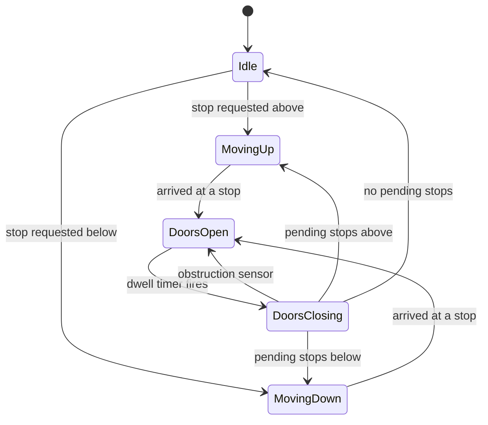

> **This is not a distributed-systems question, and treating it like one is the first way to fail it.** The elevator problem is a T1, very-high-frequency LLD curveball (Amazon, Microsoft, Uber, Google, Lyft) because it has no QPS to hide behind. Published rubrics score senior candidates on three things a junior skips: asking **"simulation or real hardware?"** before drawing anything, arguing the **dispatch trade-off** (fairness vs throughput vs predictability, including starvation), and **naming where the single-controller design breaks unprompted**. A junior writes an `Elevator` class. A Director scopes the safety boundary, picks SCAN over nearest-first *because of a starvation argument*, and volunteers that the real problem starts at the bank.

### Learning objectives
- Open with the **scoping question that is itself the scored signal**, *simulation or real hardware?*, and use it to split the dispatch brain you design from the safety firmware you delegate.
- Model one car as a crisp **UP / DOWN / IDLE state machine with door sub-states**, driven by **direction-aware request queues**, not a FIFO list.
- Argue the **dispatch trade-off**, FIFO vs nearest-first (SSTF) vs SCAN/LOOK, on fairness, throughput, predictability, and **starvation**, with numbers.
- Run **Design evolution as the star step**: where the single-car controller breaks, and the **bank-allocation problem** that replaces it.
- Adapt the RESHADED spine to an LLD problem out loud, the adaptation commentary is itself part of the answer.

### Intuition first
An elevator is a **delivery van on a one-dimensional road**. Passengers are parcels; floors are addresses. The naive driver serves parcels **in the order requested** (FIFO), and yo-yos the building: floor 2, then 29, then 3, then 28. The greedy driver serves **whatever's nearest** (SSTF), great average speed, until a steady drizzle of parcels near the depot means the far end of the street *never gets served*. That's **starvation**, the trap at the center of this problem. The driver every real elevator uses is the **postal route**: drive to the end of the street serving every address on the way, then turn around, **SCAN** (the disk-scheduling "elevator algorithm" is named after this machine). It trades a little average speed for a hard promise: *no address waits longer than one full sweep.* The whole single-car design is a state machine that remembers which way the van is driving, plus two sorted lists, stops ahead, stops behind. The hard problem, where the interview is steering, arrives with **eight vans** and a new parcel: *which van do you send?*

---

## R: Requirements

> LLD-adapted: the scope cut isn't "which features", it's **"which physical reality."** The first clarifying question is the scored one.

**The opening Director move, ask it first:** *"Are we designing a **simulation** (a software model with discrete time), or a controller for **real hardware**?"* It's on published rubrics because the answer changes the design's truth model:

- **Simulation** → your software state is the world: deterministic ticks, perfectly testable. What the interviewer almost always wants, say you'll design for it.
- **Real hardware** → your controller is **advisory, not authoritative**. Position comes from shaft encoders; door safety, overload, and emergency stop live in **safety-rated firmware/PLC** that overrides software, by elevator code (EN 81 / ASME A17.1). The Director line: *"I'll design the dispatch brain simulation-grade and name the seam, door interlocks, overload, fire mode are firmware's; my controller requests, never forces."* Scoping the safety surface **out**, explicitly, is the senior signal.

**Remaining clarifiers (assumed answers):** one building, **N = 30 floors, M = 8 cars** (single car first, bank as evolution); **hall calls** carry direction (floor button), **car calls** carry destination (button inside); capacity ~**15 persons / 1,150 kg**; out of scope, sky-lobby hardware, freight, VIP modes.

**Functional requirements:** (1) accept hall and car calls; (2) move cars and operate doors per a defined policy; (3) **no starvation**, every request served within a bounded wait; (4) respect capacity (a full car skips hall calls); (5) multi-car dispatch (evolution step).

**Non-functional requirements, *policy* properties, not scale properties:** **fairness** (bounded worst-case wait), **throughput** (passengers/hour, whether the morning rush clears), **predictability** (a rider watching the car pass their floor erodes trust), **safety** (delegated to firmware, stated), **availability** (one stuck car must not wedge the bank). There is no "scales horizontally" exit; the NFRs trade against each other *inside one machine*, exactly why the problem is asked.

---

## E: Estimation

> LLD adaptation, said out loud: we're not sizing servers, we're sizing **the problem**, to prove two things: the controller is computationally trivial (so policy, not throughput, is the work), and one car can never serve the building (so the bank problem is mandatory).

**Assumptions:** 30 floors, ~3,000 occupants, 8 cars, 15-person capacity, ~2 s/floor, ~10 s door dwell per stop.

**Up-peak demand (the design driver):** industry sizing rule, morning peak ≈ **12% of population in 5 minutes** → `3,000 × 0.12 = 360 people / 300 s ≈ 1.2 arrivals/s`.

**One car's capacity:** a round trip ≈ `30 floors × 2 s × 2 directions + ~8 stops × 10 s ≈ 200 s`, so one car moves `15 people × (300/200) trips ≈ 22 people per 5 min` against 360 demanded. **One car serves ~6% of the peak, the bank of `360 / 22 ≈ 8` cars is load-bearing.** (By Little's law, as arrival rate nears service rate, lobby queue and wait blow up nonlinearly; size the bank with headroom.)

**Controller compute (the punchline):** peak event rate ≈ 1.2 hall calls/s + 8 cars × a few state transitions/s ≈ **tens of events per second**. A single-threaded event loop at 10-60 Hz has **~10,000× headroom**. Estimation just made the architecture call: **one controller process, one thread, an event queue, no locks, nothing distributed** (if it ever saturated: shard by *bank*, which shares no state, not by adding locks). Saying "the math says concurrency machinery is unnecessary; I'm spending my time on dispatch" is reasoning in numbers at Director altitude.

---

## S: Storage

> LLD adaptation: not "which database" but **"what state exists, and what is its source of truth."** The answer is unusual and worth stating: almost nothing deserves durability.

- **Car state** (floor, direction, doors, load), **in-memory**. In the real-hardware framing the **shaft encoder is the truth**; on restart you re-read sensors, not a database.
- **Request queues** (pending hall and car calls), **in-memory**. The observation that replaces a durability design: **the system's "clients" retry idempotently, a person whose button went dark presses it again.** A crashed controller recovers its workload from humans in seconds. *Rejected: a durable queue for calls*, ~10 s of saved re-presses bought with recovery-ordering complexity, engineering a guarantee the domain gives you free.
- **Telemetry** (trips, waits, door cycles, faults), append-only to a log/metrics pipeline: dispatch tuning and maintenance run on it. The *only* durable state, and it's analytical.

One sentence to the interviewer: *"Operational state is in-memory and sensor-backed; durability is only for telemetry, the building's users are my retry mechanism."* A storage answer in 20 seconds, leaving time for dispatch.

---

## H: High-level design

> The heart of an LLD problem: **the state machine plus the data structure that feeds it**. Get these right and every dispatch strategy becomes a pluggable policy.

**The state machine.** One car is `IDLE / MOVING_UP / MOVING_DOWN`, with door sub-states gating every departure, modeled explicitly because ~10 s of dwell per stop dominates trip time, and the obstruction loop (`CLOSING → OPEN`) is why a held door stalls service.



**The data structure is the algorithm.** Each car keeps **two sorted sets of floors**: `upStops` (ascending) and `downStops` (descending). A car moving up serves `upStops` in order, the next stop is a "ceiling" lookup, and **a new request ahead of the car joins the current sweep for free.** When `upStops` drains, the car reverses into `downStops`, or goes `Idle`. This *is* SCAN (strictly LOOK, reverse at the last request, not the top floor): the policy **falls out of the data structure**. *Rejected: a FIFO queue of requests*, it forces arrival-order service, the yo-yo pattern, and makes SCAN inexpressible. "The sorted set is the design decision; the state machine just walks it" is the crisp-definition moment of this interview.

**Direction-aware hall calls:** an UP call on floor 12 goes into `upStops` only of a car that will pass 12 *moving up with capacity*. A car moving down does not stop for it, that boards a passenger wanting the opposite direction, burning 10 s of dwell to worsen their trip.

**Controller shape:** a single-threaded **event loop**, `tick(now)` advances every car's state machine; button events enqueue onto the loop. *Rejected: thread-per-elevator with shared request state*, buys nothing at tens of events/s (the E step proved it), costs lock discipline and untestable interleavings. Determinism is the feature: the same event trace replays to the same outcome, which is how you test a policy.

---

## A: API design

> LLD adaptation: the "API" is the **class/interface surface**, the seams that make the design testable and the policy swappable.

```text
interface DispatchPolicy:                    # the strategy, pluggable
    assignHallCall(call, cars) -> carId      # bank-level: which car
    nextStop(car) -> floor | None            # car-level: where next

class ElevatorController:
    requestPickup(floor, direction)          # hall call (idempotent)
    requestDropoff(carId, floor)             # car call (idempotent)
    tick(now)                                # advance all state machines

class Elevator:
    id, floor, direction                     # IDLE | UP | DOWN
    doors                                    # OPEN | CLOSING | CLOSED
    load                                     # for capacity-aware dispatch
    upStops: SortedSet                       # ascending sweep
    downStops: SortedSet                     # descending sweep
```

**Design notes (each with its rejected alternative):**
- **`DispatchPolicy` is an injected strategy.** The trade-off argument becomes *runnable*: simulate FIFO vs SCAN vs cost-function against the same trace and compare wait distributions. *Rejected: dispatch inlined in the controller*, every policy experiment becomes surgery.
- **Both request calls are idempotent**, pressing a lit button is a no-op (a set, not a queue), mirroring the physical panel. *Rejected: counting presses*, the domain has no semantics for it.
- **`tick(now)` takes time as a parameter**, the simulation-vs-hardware question answered in the interface: tests inject time and replay deterministic traces; production passes the clock. *Rejected: reading the wall clock inside*, untestable.


---

## D: Data model

> LLD adaptation: not tables, the **invariants on the in-memory structures**. Brief, because the E step bought us the right.

- **`upStops` / `downStops` (sorted sets, per car):** invariant, every floor in `upStops` will be passed *moving up*; a hall call joins the set matching **its direction**, on a car the dispatch policy chose. Membership = "button is lit"; removal happens exactly when doors open there.
- **Pending-call registry (bank level):** hall calls unassigned, or assigned to a car that went full/faulted, what lets the bank **re-dispatch** a stuck car's calls; one wedged car must not orphan its assignments.
- **Telemetry events** (append-only): `call_placed`, `car_arrived`, `doors_*` with timestamps, wait time is *derived* from the log, and feeds every tuning decision in Design evolution.

<details>
<summary>Go deeper, full class sketch with the SCAN walk (IC depth, optional)</summary>

```text
class Elevator:
    def nextStop(self):
        if self.direction == UP:
            s = self.upStops.ceiling(self.floor)      # nearest stop at/above
            if s is not None: return s
            self.direction = DOWN                      # reverse: LOOK, not SCAN
            return self.downStops.floor_entry(self.floor)
        if self.direction == DOWN:
            s = self.downStops.floor_entry(self.floor) # nearest stop at/below
            if s is not None: return s
            self.direction = UP
            return self.upStops.ceiling(self.floor)
        # IDLE: adopt direction of nearest pending stop, else stay
        return nearest_of(self.upStops, self.downStops, self.floor)

    def onArrive(self, floor):
        stops = self.upStops if self.direction == UP else self.downStops
        stops.remove(floor)
        self.doors = OPEN; start_dwell_timer()
```

Edge cases the sketch encodes: reversing direction is *only* allowed when the current sweep's set is empty (this is the no-starvation guarantee, a car cannot be lured backward by a nearer opposite-direction call); an `IDLE` car adopts the direction of its first assignment; a hall call at the car's current floor while `DoorsClosing` re-opens rather than re-queues (one dwell, not a full extra cycle).

</details>

---

## E: Evaluation

> Stress the design against its own NFRs, fairness, throughput, predictability. This is where the dispatch argument is actually scored.

**The central question: which scheduling policy?** Three candidates, judged against the up-peak numbers:

**FIFO (serve calls in arrival order).** Fair in the bookkeeping sense, terrible at everything else. The yo-yo trace: calls at floors 2, 29, 3, 28 cost FIFO `~27 + 26 + 25 ≈ 78` floor-transits where SCAN's single sweep does `~27`, throughput craters ~3×, and perceived fairness is awful too (the car visibly passes you). *Verdict: a strawman, but name it*, order-of-arrival is the wrong fairness definition for a vehicle on a line.

**Nearest-first / SSTF (always serve the closest call).** Best average wait on uniform traffic, **unbounded worst case**. The starvation trace: car at floor 3; caller at floor 28; lobby floors 1-5 generate a call every ~20 s (they do, at lunch). Nearest-first *always* finds a closer call than 28, floor 28 is **formally starved** while the average looks great. Proposing SSTF without this trace fails the senior bar; proposing it *and naming the starvation case unprompted* is what rubrics reward.

**SCAN/LOOK (sweep to the last request in one direction, then reverse).** Gives up a few percent of average wait vs SSTF and buys a **hard bound**: worst-case wait ≤ one sweep ≈ `30 floors × 2 s × 2 + ~12 stops × 10 s ≈ 4 min`, bounded, predictable, legible (a shuttle, not a tease). **Decision: SCAN/LOOK, defended on the starvation bound and predictability, accepting the small average-wait cost**, and it fell out of the H data structure for free.

**Other failure modes, fast:** **full car**, load sensor flips a flag; skip hall calls (returned to the bank registry for re-dispatch), always honor car calls; *trade-off:* skipped riders wait vs futile 10 s door cycles. **Doors held**, obstruction loop with nag-then-override, *owned by firmware* (the R seam, reasserted). **Controller crash**, humans re-press; state rebuilds from sensors. **Idle parking**, park idle cars at the lobby during up-peak; *trade-off:* deadhead energy vs the most common wait, decided by telemetry.

---

## D: Design evolution

> The star step: the single-car controller is the warm-up, **the bank is where the design earns its keep**, and where you name your own design's limit before the interviewer does.

**Where the single-controller design breaks.** Per-car SCAN is locally optimal and globally dumb. Eight cars running independent SCAN converge into **convoying**: cars cluster, arrive at the lobby together, chase the same calls, measured fleet behavior, not a theoretical worry. A hall call now poses a question no single car's state machine can answer: ***which car?*** That's the **bank-allocation problem**, and it needs a layer above the cars.

**Approach 1, cost-function dispatch (the workhorse).** The bank scores every car against a new hall call with an **estimated time to serve**: `ETA = travel distance × 2 s + intermediate stops × 10 s + penalties for direction mismatch and near-full`, assigning the min-cost car. The dwell term dominates: a car 10 floors away with 0 stops (ETA 20 s) **beats** a car 2 floors away with 3 stops (ETA 34 s), "nearest car wins" is wrong on the same arithmetic that priced our round trips. An aging term on unassigned calls restores no-starvation. *Trade-off:* greedy per-call assignment isn't globally optimal, accepted; lookahead gains are small against arrival uncertainty. **My default, and I'd say so.**

**Approach 2, zoning.** Partition floors across cars (cars 1-4 serve 1-15; cars 5-8 serve 16-30), partitioning the keyspace, the sharding move, with the same failure: **hot zones**. Up-peak makes the lobby everyone's zone; a dead car orphans its zone. *Use when* traffic is structurally segregated (sky-lobby towers, hotel service cars). *Rejected as default:* static partitions lose to a cost function that re-decides per call.

**Approach 3, destination dispatch (the modern answer, name it to show range).** Riders key their floor *before* boarding; the bank **groups passengers by destination**, cutting stops per trip. Vendor studies (Schindler, Otis) claim **~25-30% up-peak capacity improvement**, on our numbers, the 8-car bank moving ~180 people/5 min gains ~50, or a new building sheds a car or two of core shaft space (shafts are leasable floor area on every floor, a **capex argument**, the kind a Director should reach for). *Trade-offs:* no in-car control, mis-keys stranded, real retrofit cost. *Use when* building new high-rise cores or fixing chronic up-peak pain; overkill at 10 floors.

**The delegation move, stated:** *"Door mechanics, overload, and emergency modes belong to the safety-firmware team, code-mandated, not my software's job. For bank policy, I'd have the team **replay six months of hall-call telemetry through a simulator** comparing the three approaches on p50/p95 wait; **my prior is cost-function with aging**, adaptive, degrades gracefully on a car fault, and doesn't bet capex on unreproduced vendor benchmarks."* Decision, evidence plan, prior, owned risk, the step this problem exists to demonstrate.

<details>
<summary>Go deeper, cost-function terms and tuning (IC depth, optional)</summary>

A production-shaped scoring function for car *c* against hall call *(floor f, direction d)*:

`score(c) = T_travel(c→f) + 10·stops_before(c,f) + 30·[direction mismatch] + 20·[load > 80%] − 2·age(call)`

- `T_travel` uses per-floor transit (~2 s) along the car's *committed* path, not straight-line distance, a car moving away from `f` pays for the full sweep-and-return.
- The direction-mismatch penalty (not a hard exclusion) lets an empty contraflow car take a call when everything else is saturated.
- The age term is the anti-starvation knob: a call aging 15 s outbids a fresh call ~30 s closer. Tune the coefficient by replaying telemetry; too high re-creates FIFO, too low re-creates SSTF.
- Re-score on every car fault or full-car event, assignment is a *lease*, not a promise; the pending-call registry (D step) is what makes revocation cheap.

Convoying fix without a full cost function: stagger idle-parking floors so cars spread across the shaft instead of stacking at the lobby.

</details>

---

### Trade-offs table: the dispatch strategies

| Dimension | FIFO | Nearest-first (SSTF) | SCAN / LOOK |
|---|---|---|---|
| Average wait | Worst (~3× more travel on mixed traces) | Best on uniform traffic | Within a few % of SSTF |
| Worst-case wait | Bounded but huge (yo-yo) | **Unbounded, starvation** | **Bounded: ≤ 1 sweep (~4 min on 30 floors)** |
| Fairness | Arrival-order "fair," experientially poor | Starves far floors | Position-fair; no request skipped twice |
| Predictability | Low, movement looks random | Low, car visibly skips you | High, shuttle-like, legible |
| Implementation | Trivial queue | Priority queue by distance | Two sorted sets (the H design) |
| **Use when** | Never alone, the baseline | Bursty co-located traffic, worst case policed elsewhere | **Default for a real elevator**, the bound *is* the requirement |

---

### What interviewers probe here (Director altitude)

- **"Before you draw, any questions?"**, *Strong:* asks **simulation vs real hardware**, scopes safety to firmware, designs the dispatch brain. *Red flag:* starts writing an `Elevator` class into an unscoped problem.
- **"Why not always serve the nearest call?"**, *Strong:* produces the starvation trace unprompted; names SCAN's ~4 min bound as the requirement-matching property. *Red flag:* "nearest is most efficient" with no worst-case analysis.
- **"Where does your design break?"**, *Strong:* volunteers it, per-car SCAN convoys; the bank needs a dispatch layer; sketches the cost function and why nearest-car-wins is wrong. *Red flag:* has to be dragged to multi-car.
- **"What's your concurrency model?"**, *Strong:* did the math, tens of events/s, 10,000× headroom, so a single-threaded deterministic event loop, chosen *for testability*. *Red flag:* thread-per-elevator with locks, solving a throughput problem the numbers say doesn't exist.
- **"What persists?"**, *Strong:* almost nothing, sensors are truth, humans are the retry mechanism, durability only for telemetry. *Red flag:* a database of button presses with a recovery protocol.

---

### Common mistakes

- **Designing dispatch without asking simulation-vs-hardware.** The question is on the rubric; skipping it means ten minutes "designing" door safety that elevator code assigns to certified firmware.
- **Proposing nearest-first without naming starvation.** The unbounded-wait trace is the problem's central trap; falling into it silently is the clearest junior tell.
- **A FIFO request queue as the core structure.** It makes SCAN inexpressible. The two direction-aware sorted sets *are* the design; the state machine just walks them.
- **Stopping a moving-down car for an UP hall call.** Boarding someone who wants the opposite direction costs dwell and worsens their trip, the rule that most separates working designs from naive ones.
- **Scaling the controller instead of the policy.** Threads, locks, distributed coordination for tens of events/s, depth in the wrong place, the "not operating at level" failure mode.

---

### Interviewer follow-up questions (with model answers)

**Q1. Riders on floor 28 complain of five-minute waits at lunch while the lobby gets instant service. Diagnose and fix.**
> *Model:* The signature of nearest-first dispatch (or an over-greedy cost function): lunch traffic concentrates calls on floors 1-5, and a closest-call policy always finds a nearer call than 28, its wait is unbounded by construction. Car-level fix: SCAN/LOOK, which reaches 28 within one sweep (~4 min worst case). Bank-level fix: an aging term so a waiting call outbids closer fresh calls. Verify with telemetry, p95 wait *by floor*, before and after; if floor-28 p95 doesn't collapse, the bug is in assignment, not car policy.

**Q2. One of your eight cars gets stuck with twelve assigned hall calls. What happens to those riders?**
> *Model:* Nothing bad, if assignment is a lease, not a promise. Hall calls live in a bank-level pending registry; on a fault event (no movement + doors closed + timeout) the bank marks the car out of service, recycles its twelve calls, and re-scores them across the remaining seven cars, degraded ETAs rather than orphaned riders. The choice that makes this cheap is keeping hall-call ownership *above* the car; the car owns only in-car destinations (those passengers are physically inside, firmware owns that path). One wedged car degrades the bank, never deadlocks it.

**Q3. The CFO asks why the new tower's elevator consultant wants destination dispatch. Make the argument both ways.**
> *Model:* For: grouping riders by destination cuts stops per trip; vendor studies claim ~25-30% more up-peak capacity. On a 3,000-person tower moving ~360 people per 5 minutes, that's the difference between 8 shafts and 6-7, and shaft space is leasable floor area on every floor: a capex/revenue argument, not a UX nicety. Against: riders lose in-car control, mis-keys strand people, and the gains are vendor-published, I'd require the consultant to replay *our* projected traffic through a simulation, not accept brochures. My prior: yes for a 30+ floor tower with hard up-peak; no where the peak is diffuse, the gain doesn't pay for the rigidity.

---

### Key takeaways
- **The opening question is the first scored answer:** simulation or real hardware? Scope safety (doors, overload, fire mode) to certified firmware; keep the dispatch brain as your surface.
- **The data structure is the algorithm:** two direction-aware sorted sets per car make SCAN fall out naturally; a FIFO queue makes good policy inexpressible. UP/DOWN/IDLE with explicit door sub-states, dwell (~10 s/stop) dominates trip time.
- **The dispatch argument is the interview:** FIFO is the strawman; nearest-first has a starvation trace you must produce unprompted; SCAN buys a hard one-sweep bound (~4 min on 30 floors) for a few percent of average wait. The bound is the requirement.
- **Estimation kills the wrong design early:** tens of events/s → single-threaded, deterministic, testable; concurrency machinery is depth in the wrong place. One car moves ~22 people per 5 min against 360 demanded; the bank is mandatory.
- **Design evolution is the star:** per-car SCAN convoys at bank scale; cost-function dispatch with aging is the workhorse (dwell beats distance); zoning fits segregated traffic; destination dispatch is a ~25-30% capacity/capex argument. Delegate the bake-off via telemetry replay, with a stated prior.

> **Spaced-repetition recap:** Elevator = **LLD curveball**: open with *simulation vs real hardware* (safety → firmware, dispatch → you). One car = **UP/DOWN/IDLE + door states** walking **two direction-aware sorted sets**, that structure *is* SCAN/LOOK. Dispatch: FIFO (yo-yo), SSTF (**starves** far floors), SCAN (**bounded ≤ one sweep ~4 min**, pick it, say why). Tens of events/s → single-threaded event loop; humans are the retry mechanism; persist only telemetry. Evolution = the **bank**: per-car SCAN convoys → cost-function dispatch with aging (dwell dominates distance); zoning; destination dispatch for ~25-30% up-peak capacity.

---

*End of Lesson 6.2. No QPS, no shards, the same trade-off discipline applied to one machine's scheduling policy, with starvation playing the role oversell played in Ticketmaster (the invariant your policy must make impossible) and the bank cost function reprising the assignment problem on a 30-floor keyspace.*
