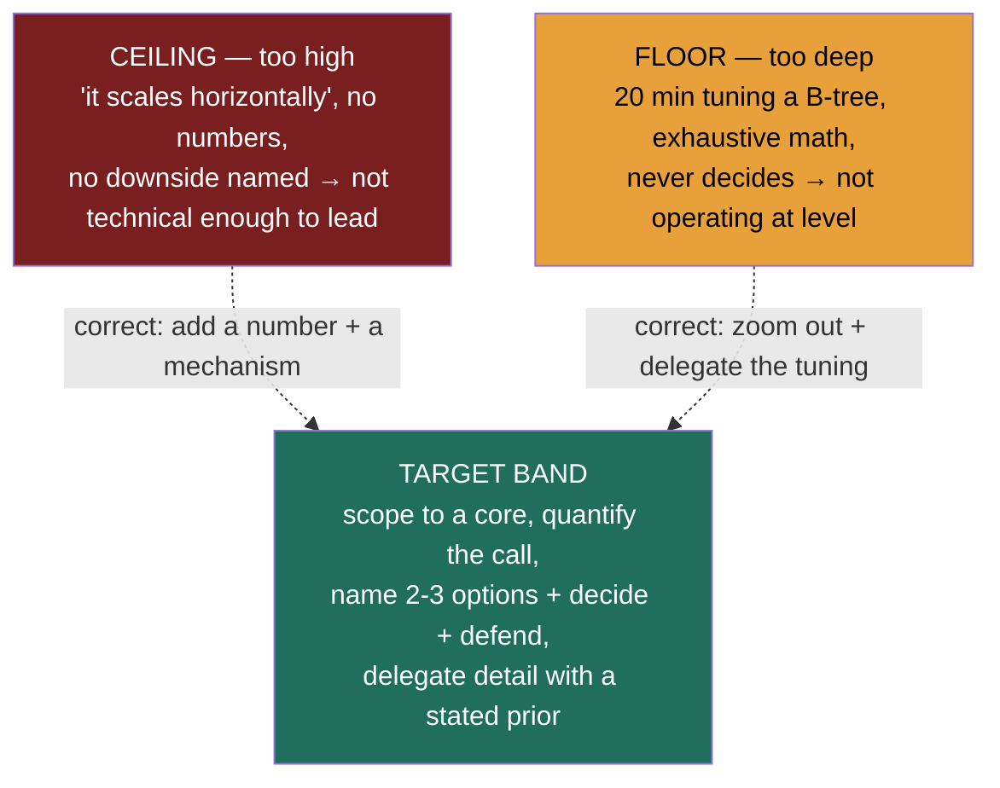

### What this is

This is the scorecard the room is using on you, written down. It is not a lesson — it is a **reference you self-assess against the night before a real loop.** Run your last mock answer through both tables; if any row lands you in the red column, that is your highest-leverage fix.

Recall the framing from Lesson 1.1: the system-design round is a **design review you've been asked to chair**, run by Staff/Principal engineers who will be your peers or reports. They are not scoring whether you can hand-derive a hash function. They are scoring whether they'd trust you to run the review when the architecture actually matters. That trust shows up as a specific texture in how you reason: you scope before you build, you quantify your claims, you name the alternative you rejected, you delegate detail with a stated prior, and you own the cost and on-call consequences of your call.

Two warnings before the tables:

- **A rubric can look complete and still be entirely IC-level.** The difference between a strong staff-IC answer and a strong Director answer is not depth — it's *delegation, cost, decisiveness, and trade-off framing*. Every strong-signal cell below carries a **Director tell**. If your answer would read identically on a staff-IC scorecard, you have not yet cleared the bar.
- **The red-flag column is usually the hand-wavy twin of the strong column.** "It scales horizontally" is the unquantified twin of "the read path saturates first at ~50k QPS; I shard the cache by URL hash." Watch for the twin.

---

## The two lenses

These two tables are **not duplicates** — they are different views of the same answer:

- **The 5 axes** are *what the interviewer is scoring.* One of them — communication & leadership — is **not** a RESHADED step at all; it runs underneath everything.
- **The 8 RESHADED steps** are *the process you walk through.* They are the spine of the answer.

The crucial relationship: **axis 4 (trade-off depth) and axis 5 (communication/leadership) are scored continuously, at every one of the 8 steps** — not in a single "trade-offs" moment near the end. Every step is a chance to name an alternative and to drive the conversation. That is why the same answer is graded twice, once per lens.

The Director weighting (from Lesson 1.1, heaviest first): **trade-offs (4) > scope (1) ≈ communication (5) > estimation (2) ≈ design (3)**. Axis 3 has *diminishing returns* — past a clean decomposition, more boxes is not more signal, and grinding mechanics there is an **active anti-signal** ("why is this Director hand-tuning a B-tree?").

---

## Table A — the 5 scoring axes

| # | Axis (weight) | Strong signal — the Director tell | Red flag — the hand-wavy twin |
|---|---|---|---|
| 1 | **Requirements & scoping** *(heavy)* | Asks 3–4 sharp clarifying questions, then **cuts to a defensible core of 3–5 features** and explicitly defers the rest ("custom aliases and expiry are stretch"). Pins the read:write ratio and an availability bar *as numbers* before designing. | Starts drawing boxes before scoping. Tries to build every feature. "Make it scalable and reliable" with no SLO and no read:write number. |
| 2 | **Estimation & quantification** *(medium)* | Reasons in **orders of magnitude** to make a call — "~700k writes/s, so ~10 TB/day, so this is a fleet not a box." Rounds aggressively, states assumptions, **uses the number to drive a decision** (cache it / shard it). | "It'll be a lot of traffic." No QPS, no storage figure. Or the opposite failure: a 5-minute exact arithmetic derivation that changes no decision. |
| 3 | **High-level design & decomposition** *(medium, diminishing)* | Clean component split with **single responsibilities** and a legible happy-path data flow. Knows when to **stop adding boxes** and move to the trade-off discussion. | Either too few (a monolith blob) or a sprawling 30-box diagram with no data flow. Lingers here because it's comfortable, burning the clock that axis 4 needs. |
| 4 | **Trade-off depth & decision-making** *(heaviest)* | Names **2–3 viable approaches**, states pros/cons of each, **commits to one**, and defends it against requirement + cost + risk. Pre-empts "why not X?" by volunteering the rejected alternative and the condition under which they'd revisit. | Lists options but never **decides**. Or decides but **cannot name a single downside of their own choice.** Presents a design as obviously correct with no critique. |
| 5 | **Communication & leadership signal** *(heavy)* | **Drives** the conversation and structures thinking out loud. Handles "why not X?" without getting defensive. **Delegates credibly with a stated prior** ("I'd have storage benchmark leveled vs size-tiered; my prior is leveled because reads dominate"). Names cost and on-call impact unprompted. | Waits to be led; answers only what's asked. Gets defensive under pushback or silently caves. Either grinds every detail personally (won't delegate) or delegates everything (no own depth). |

**How to read your own answer against Table A:** the offer is won or lost on axis 4, gated by axis 1, and textured by axis 5. A technically flawless design that never decides, or decides without a critique, fails the heaviest axis regardless of how clean the boxes were.

---

## Table B — the 8 RESHADED steps

Same answer, graded as a process. Each step has a *Director tell* distinct from the IC version of doing that step well. (Axes 4 and 5 are scored on top of every row.)

| Step | RESHADED step | Strong signal — the Director tell | Red flag — the hand-wavy twin |
|---|---|---|---|
| 1 | **R — Requirements** | Separates functional from non-functional; **scopes to 3–5 core features** with the rest explicitly parked; nails read:write ratio and a numeric SLO (e.g. 99.99%) that will *drive later choices*. | Jumps to building. No scope cut. NFRs absent or vague ("highly available") with no number to design against. |
| 2 | **E — Estimation** | "Enough math to make a defensible call" — order-of-magnitude QPS/storage/bandwidth, **rounded**, used to size the fleet and justify caching/sharding. | "It scales" with no figure — *banned* (Rule 1). Or a rabbit-hole of exact computation that changes no architectural decision. |
| 3 | **S — Storage selection** | **Matches data shape to store** and says why — "write-heavy append → LSM/Cassandra; transactional + joins → Postgres" — and names the cost of the choice (compaction tax, secondary-index expense). | "I'll use a database." No family chosen, or a default reached for with **no alternative considered and no trade-off named** (violates Rule 2). |
| 4 | **H — High-level design** | Components with clear responsibilities, happy path drawn, **read and write paths distinguished.** Stops at the altitude where the decision lives. | A diagram with no data flow, or so much detail it obscures the decision. Mistakes box-count for design signal. |
| 5 | **A — API design** | A few clean endpoints/signatures that **expose the system's real contract** (idempotency keys, pagination, auth boundary) — only as deep as the design turns on. | Either skipped, or 40 endpoints enumerated like a CRUD spec — depth with no decision in it. |
| 6 | **D — Data model** | Schema + **keys/indexes chosen for the access pattern**; names the partition key and why; flags the write tax of each secondary index. Denormalizes deliberately and says so. | Normalized tables with no thought to access pattern or partition key. Indexes added "to be safe" with no awareness they tax every write. |
| 7 | **E — Evaluation** | **Stresses their own design** — names the component that **saturates first**, *with a number*, and the specific lever (shard the hot key, add a read replica, add a cache). Re-checks the design against the Step-1 SLOs. | Surprise that anything would break. "Add more servers" with no mechanism and no named bottleneck. Never re-validates against the requirements they set. |
| 8 | **D — Design evolution** | Thinks past v1: **how it behaves at 10×**, which assumption breaks, the migration path, and the **cost/operability** of the next step. Frames it as a roadmap with trade-offs, not a rewrite. | "It already scales." No 10× story, no failure mode, no awareness that the v1 choice has a ceiling. |

**The single most repeated Director tell across Table B:** at every step where a detail is below the altitude of the decision, the move is *"state a default, delegate with a stated prior, move on"* — **not** resolve it personally. That one sentence — "I'd have the X team benchmark A vs B; my prior is B because [requirement]" — is worth more than ten minutes of correct mechanics, because it shows judgment, trust in the org, and altitude awareness simultaneously.

---

## The two fatal failure modes

Both are fatal because both break the *altitude* contract — the one thing a Director round actually tests. You can be technically right and still fail by operating at the wrong altitude. Catch yourself mid-answer and say the self-correction out loud; **naming your own altitude correction is itself a strong signal.**

| Failure mode | What it sounds like | Why it's fatal | Reads as |
|---|---|---|---|
| **Too high — hand-waving** | "It scales horizontally." "We'd add caching." Can't name a downside of own choice; no numbers; asserts outcomes without mechanisms. | Asserts conclusions with no mechanism. The mechanism *is* the leadership content; the conclusion isn't. | *Not technical enough to lead.* |
| **Too deep — rabbit-holing** | 20 minutes tuning B-tree fanout or hand-deriving a hash scheme; exhaustive estimation that changes no decision; never reaches the trade-off discussion. | Spends the clock below the altitude where the decision lives; no decision gets made; axis 4 never gets exercised. | *Not operating at level.* |

### The one-line self-correction for each

**Too high → make it concrete, attach a number and a mechanism:**

> "Let me ground that. At ~50k read QPS the redirect path saturates first, so the lever is a cache sharded by URL hash with a read replica behind it — that's the specific thing that 'scales,' and the cost is cache-stampede risk on eviction."

**Too deep → zoom out, name the key point, delegate the tuning:**

> "I'm going deeper than this decision warrants. The point is collision-free unique IDs, which I'd solve with [approach]; the exact tuning won't change the architecture, so I'd delegate it. Let me get back to the system."

The target is the **band between these two failures**: deep enough to show real judgment where the decision turns on it, high enough to keep deciding and driving everywhere else.

---

## The 60-second pre-loop self-check

Run these five questions against your last mock. A "no" on any is a red-flag row to fix before the real thing:

1. **Did I cut scope to 3–5 features** and park the rest out loud? *(axis 1 / step R)*
2. **Did every number drive a decision** — and did I refuse to say "it scales" without one? *(Rule 1 / axes 2 / step E)*
3. **Did every choice name the alternative I rejected and why** — and a downside of the choice I made? *(Rule 2 / axis 4)*
4. **Did I name the component that breaks first under load, with a number and a lever?** *(step E — Evaluation)*
5. **Did I delegate at least one below-altitude detail with a stated prior**, rather than grind it myself? *(axis 5 / altitude dial)*

> **Spaced-repetition recap:** The room scores trade-off judgment and communication over mechanics. Strong signals quantify the claim and name the rejected alternative; red flags are their hand-wavy twins. Two fatal modes — too high (add a number + mechanism) and too deep (zoom out + delegate). Aim for the band: decide everywhere, go deep only where the decision turns on it.
