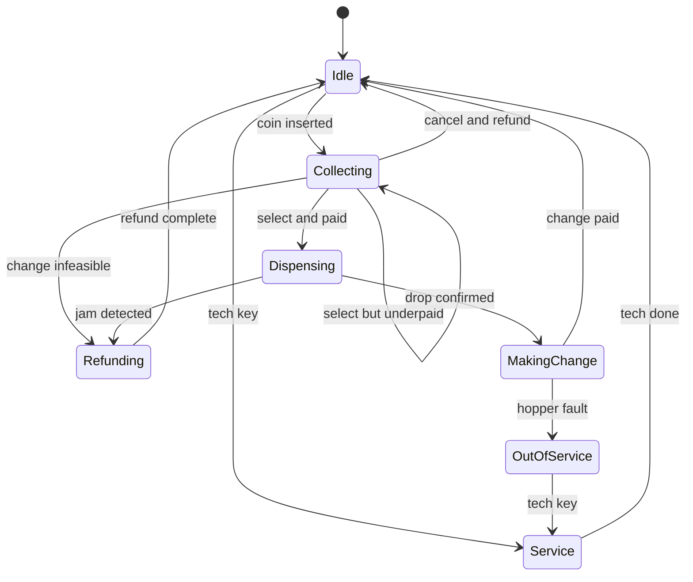

> **Why this gets asked.** The vending machine is the textbook explicit state machine, the State pattern shows up in roughly **30% of all LLD problems** (elevator, ATM, order lifecycle), and this is the cleanest specimen, which is why Google, Amazon, Microsoft, Apple, and Oracle keep asking it. A junior answer enumerates classes and gets the happy path vending. A Director answer **makes illegal state transitions unrepresentable** (no code path exists, not "an `if` guards it") and **owns the failure transitions**, motor jams *after* payment, exact change unavailable, power dies mid-dispense. The real test: would you catch the missing refund path in a design review. This is the module's **canonical State-pattern lesson**, which the other LLD lessons reference rather than re-derive.

### Learning objectives
- Run the **RESHADED** spine on an LLD problem, stating how each step adapts, H becomes the **explicit state machine**, Evaluation the **failure-mode walk**, Estimation nearly drops.
- Compare **flag soup, the State pattern, and a table-driven FSM**, defending the State pattern by maintenance cost, not taste.
- State the **money-conservation invariant** and design the refund/compensation transitions that uphold it under jams and power loss.
- Make dispense **idempotent across a power cut** with a write-ahead journal and boot-time reconciliation, the same probe the ATM variant runs.
- Extend payment methods (coins → bills → card/NFC) **behind an interface** without touching the FSM core, and notice how card payment changes which failure is cheap.

### Intuition first
A vending machine is a **tiny bureaucracy with one desk**. At any moment the clerk is in exactly one mood, *waiting*, *counting money*, *fetching the item*, *making change*, *refunding*, *closed for repairs*, and each mood has strict rules about which requests it will even hear. Shout "give me the cola" at a clerk mid-refund and the request isn't *rejected*, it's *meaningless*; the desk has no slot for it. Instead of one clerk juggling boolean sticky notes, hire **one specialist clerk per mood**: illegal situations stop being bugs you check for and become **states that cannot be expressed**.

The idea candidates miss: the prime directive is **conservation of money**, every cent inserted ends up as product price, change, or refund. The *failure* paths, jam after payment, empty hopper, power cut mid-dispense, are where the invariant dies, which is why they're first-class transitions in the diagram, not comments in the code.

---

## R: Requirements

> In LLD the non-functional requirements become **invariants and change axes** rather than nines and latency.

**Clarifying questions I'd ask (with assumed answers):**
- *Payment methods?* → **Coins first; bills and card/NFC must slot in later**, the stated evolution axis.
- *One user at a time?* → **Yes**, the panel is serial, but sensor events arrive **asynchronously**.
- *Is "take money, deliver nothing" acceptable?* → **No, the cardinal sin**, the LLD analogue of Ticketmaster's oversell.
- *Exact change?* → Detected **before committing to a vend**, not after dispensing.

**Functional requirements:** accept payment incrementally with running credit; select and vend if credit ≥ price and stock > 0; return change; cancel before dispense → full refund; jam → refund; change infeasible → block up front; service mode.

**Explicitly CUT (scoping is the signal):** multi-item carts, loyalty, telemetry, dynamic pricing, refrigeration. I scope to **insert → select → dispense → change/refund** plus the failure transitions, and say so.

**Non-functional requirements, LLD-translated:**
- **Conservation of money:** in every quiescent state, credit = 0 and every cent accounted for. The design's "no oversell."
- **Illegal transitions unrepresentable:** dispensing with zero credit should have **no code path**, not a guard clause.
- **Durability across power loss:** a vend in flight is resolvable on reboot, never silently eat money.
- **Extensibility** along the payment axis without touching state classes; **testability:** the matrix is enumerable and assertable.

---

## E: Estimation

> The adaptation said out loud: **Estimation nearly drops**, no QPS or fleet to size. What survives is the habit of *quantifying the design pressure*: how big is the state space, and how often do the "rare" failures actually fire?

**State-space math (why flags lose):** **6 states × 8 events = 48 cells** in the transition matrix, roughly **15 legal**. The other ~33 cells *are the bug surface*, each must be deliberately a no-op or an error. Model the same machine with 4 booleans and you get **16 representable combinations for 6 meaningful states**, 10 meaningless configurations that type-check.

**Failure-rate math (why the jam path is not edge-case code):** field jam rates run ~**0.1-0.5% of vends**. A fleet of **10,000 machines × 150 vends/day = 1.5M vends/day → 1,500-7,500 money-taken incidents *per day*** if the refund transition is broken. Treat the refund path with happy-path rigor.

**Change-float math:** average change ≈ 40¢/vend against a ~$40 float → exhaustion in ~100 net-outflow vends. "Cannot make change" is **routine**, hence feasibility is checked *before* the motor fires.

**Power-loss exposure:** a ~3 s dispense window × 1.5M vends/day ≈ **52 machine-days/year inside the irreversible window** fleet-wide, mid-dispense power loss is a when, not an if. Hence the journal in S.

**What estimation decided:** the matrix is exhaustively testable; the failure paths fire daily at fleet scale, spend the interview on transitions, not class names.

---

## S: Storage

> Adaptation: no database tier, "storage" becomes **what must survive a power cut**, and in what order it's written.

Three things persist in non-volatile memory (flash/EEPROM, write-ahead logging in miniature):

1. **Transaction journal (append-only, written FIRST).** Before the motor fires: `VEND_START {slot, credit, txn_id}`. On drop-sensor confirm: `VEND_OK`. On jam: `VEND_FAIL`. **The journal entry precedes the irreversible physical action**, the motor is a side effect you cannot roll back.
2. **Inventory counts** per slot, decremented on `VEND_OK`, not `VEND_START`: count what *happened*, not what was attempted.
3. **Coin float** per denomination, the truth behind `canMakeChange(amount)`.

**Boot-time reconciliation (the idempotency story):** on power-up, scan the journal tail. A `VEND_START` with no matching `VEND_OK/FAIL` is in-doubt: consult the drop sensor's latched flag; if indeterminate, **err in the customer's favor**, record and surface a refund. *Rejected: resolving in the operator's favor*, pennies saved, trust spent at 7,500 incidents/day (per E).

> **One line on the ATM variant, because interviewers run the identical probe:** power dies between the account debit and the cash-out, same answer: **journal before the irreversible action, reconcile on boot, compensate (reverse the debit) when dispense can't be confirmed.**

---

## H: High-level design

> Adaptation: H is not a box diagram, **the explicit state machine is the core artifact**. Draw it early, failure transitions visible; the interviewer is checking whether `Refunding` and `OutOfService` appear *unprompted*.



The three transitions that earn the offer: **Collecting → Refunding** (change infeasible, checked *before* the motor fires), **Dispensing → Refunding** (jam after payment, the compensation path), **MakingChange → OutOfService** (fail *safe*: a machine that can't hold the invariant refuses further business).

**Three viable implementations, then a commitment:**

**Approach A, conditional/flag soup.** One class; enums, booleans, a `switch (state)` in every handler. *Pros:* fastest to write; fine at 2-3 states. *Cons:* one state's logic smears across every handler, **adding a state touches every method** (~8 edit sites); flag combos make illegal states representable (16 for 6, per E); the matrix lives implicitly in branches nobody can audit. This version ships the missing-refund bug.

**Approach B, the State pattern (my choice).** One class per state implementing a common event interface; each handler **returns the next state**. *Pros:* each state's behavior in one file; **adding a state = adding a class**; illegal events rejected by a base-class default in *one* place; the diagram maps 1:1 to the class list. *Cons:* more classes (~8 vs 1); shared data threads through the context, mild ceremony.

**Approach C, table-driven FSM.** A literal table `(state, event) → (guard, action, nextState)` plus a tiny interpreter. *Pros:* the matrix is **data**, auditable, diffable, exhaustiveness trivially checkable. *Cons:* guards and actions with real logic degrade into named function pointers, indirection, not clarity.

**Decision and defense:** **B**, the requirement under test is illegal-transition unrepresentability plus per-state clarity. I reject A on the maintenance math, and C because at 48 cells the table's audit advantage doesn't pay for its indirection, **but I keep C's table as a test artifact**: a unit test enumerates all 48 cells and asserts each is a legal transition or an explicit rejection. The cheapest "no missing refund path" proof there is.

---

## A: API design

> Adaptation: endpoints become **the event interface the hardware fires at the FSM**, plus the ports the states call outward. The interface *is* the contract that makes illegal transitions unrepresentable.

```text
interface State {                          # every hardware/user event
  onCoin(cents)        -> State            # returns the NEXT state
  onSelect(slot)       -> State
  onDropConfirmed()    -> State            # async sensor events
  onJamDetected()      -> State
  onCancel()           -> State
  onTechKey()          -> State
}
# Base class: every handler defaults to "ignore + beep" - illegal
# events are rejected in ONE place, not guarded in forty.

class Collecting(State):
  onSelect(slot):
    if stock(slot) == 0:            return this        # stay
    if credit < price(slot):        return this        # underpaid
    if !change.canMake(credit - price(slot)):
        return Refunding(credit)    # never fire motor unfundable
    journal.append(VEND_START, slot, credit)           # WAL first
    motor.dispense(slot)
    return Dispensing(slot, credit)
```

**Outward-facing ports:** `PaymentDevice` (validates/escrows coins), `ChangeMaker { canMake(c), pay(c) }`, `DispenseUnit { dispense(slot) }`, `Journal { append(e) }`. States depend on these **interfaces only**, the seam D-evolution cashes in.

**Design notes (each with its rejected alternative):**
- **Handlers return the next state.** *Rejected: `context.setState(...)` inside handlers*, re-entrancy bugs when an async sensor event lands mid-transition; returning the successor keeps each transition atomic and testable.
- **Async sensor events are first-class interface methods.** *Rejected: a blocking dispense call*, a jam would hang the FSM with money escrowed and no path to refund.
- **One base-class rejection point.** *Rejected: per-handler guard clauses*, Approach A sneaking back in through the interface.

<details>
<summary>Go deeper, full State-pattern listing for all six states (IC depth, optional)</summary>

```text
class Idle(State):
  onCoin(c):       return Collecting(credit=c)
  onTechKey():     return Service()

class Collecting(State):                 # fields: credit
  onCoin(c):       credit += c; return this
  onCancel():      return Refunding(credit)
  onSelect(slot):  # as shown in the visible body

class Dispensing(State):                 # fields: slot, credit
  onDropConfirmed():
      journal.append(VEND_OK); inventory.dec(slot)
      return MakingChange(credit - price(slot))
  onJamDetected():
      journal.append(VEND_FAIL)
      return Refunding(credit)           # full credit back - no vend
  onCancel():      return this           # too late - motor committed

class MakingChange(State):               # fields: owed
  # entered with owed >= 0; canMake() was asserted pre-dispense
  onChangePaid():  return Idle()
  onHopperFault(): alert(); return OutOfService()

class Refunding(State):                  # fields: amount
  onRefundDone():  return Idle()
  onRefundFault(): alert(); return OutOfService()  # fail safe

class Service(State):
  onRestock(slot,n) / onCollectCash() / onTechDone(): -> Idle
```

The context object owns `journal`, `inventory`, `change`, `motor` and threads them to state constructors. The 48-cell exhaustiveness test iterates `states × events`, asserting each cell returns either a documented successor or the base-class rejection.

</details>

---

## D: Data model

> Adaptation: no shard-key story, the data model is **the value objects whose integrity carries the money invariant**.

- **`Product`**, `slot_id`, `name`, `price_cents`. **Integer cents**; floating-point money is an instant design-review flag.
- **`Inventory`**, `slot_id → count`; decremented only on `VEND_OK`.
- **`CoinFloat`**, `denomination → count`; the ground truth behind `canMake()`.
- **`JournalEntry`**, `txn_id, type {VEND_START, VEND_OK, VEND_FAIL, REFUND}, slot, credit_cents, ts`. Append-only; `txn_id` makes reconciliation idempotent, replaying the tail twice cannot double-refund.
- **`Credit`**, lives in the *state objects* (`Collecting.credit`), not machine-global: a state that shouldn't have money has no field to hold it. Unrepresentability applied to data.

<details>
<summary>Go deeper, change-making: greedy vs DP, and float-aware feasibility (IC depth, optional)</summary>

`canMake(amount)` is bounded coin change: make `amount` from the *current float*, not from unlimited coins. For **canonical denomination systems** (US: 25/10/5/1) greedy-by-largest is optimal *with unlimited coins*, but a depleted float breaks greedy: owing 30¢ with float `{25×1, 10×3}`, greedy takes 25 then dies needing 5; the answer was 10+10+10. So feasibility needs bounded-coins DP (or DFS with memo): reachable sums ≤ amount given per-denomination counts, at vending amounts (≤ 500¢, 4-6 denominations) this is microseconds, trivially affordable per keypress. Practical fleet policy on top: refuse vends that would drop any denomination below a reserve threshold, and have `Service` mode report float skew so route drivers replenish the right coins. The Director version: *"I'd have the firmware team property-test `canMake` against exhaustive small floats; my prior is bounded DP over greedy because float exhaustion is a routine state, per the E-step math."*

</details>

---

## E: Evaluation

> Adaptation: Evaluation is **the failure-mode walk**, attack each transition where the money invariant can break. This walk *is* the interview's second half.

**Failure 1, motor jams after payment (the cardinal case).** Credit escrowed, `VEND_START` journaled, motor fires, drop sensor never confirms. *Handling:* jam sensor or ~5 s timeout (name the timeout, an FSM with no timer events deadlocks on silent hardware) fires `onJamDetected` → journal `VEND_FAIL` → **`Dispensing → Refunding` with full credit** → flag the slot suspect. *Rejected: retry the motor*, a second pulse on a jammed helix can dispense **two** products once it clears. A lost sale vs a violated invariant: cheap.

**Failure 2, exact change unavailable.** *Handling:* a **guard before `VEND_START`**, `Collecting` checks `canMake(credit − price)` and routes to `Refunding` (or displays "exact change only") before anything irreversible. *Rejected: dispense, then discover the hopper can't pay 35¢*, you owe physical money you cannot produce. Order of operations *is* the correctness, Ticketmaster's "re-assert the hold inside the conversion" instinct.

**Failure 3, power dies mid-dispense (the idempotency probe).** *Handling:* journal + boot reconciliation (per S): in-doubt vend → latched drop flag → else refund, customer's favor. The `txn_id` makes reconciliation **idempotent**, a second power cut during recovery can't double-refund. The deepest probe here: Ticketmaster's idempotency keys are this journal, distributed.

**Failure 4, cancel races the dispense.** *Handling:* `Dispensing.onCancel()` returns `this`, too late, the motor committed. Handlers process events serially against one explicit state, so the race collapses to event order, flag-soup designs genuinely lose this one to interleaved boolean updates.

**Failure 5, refund itself fails** (hopper fault mid-refund). *Handling:* `Refunding → OutOfService`, journal the amount owed, alert the route driver. **Fail safe and stop trading.** *Rejected: keep vending, settle later*, every vend compounds an unaccounted liability.

**Closing re-check:** every cent exits as price, change, or refund in all five walks; illegal transitions hit the base-class rejection; the 48-cell test pins the matrix. Invariant holds.

---

## D: Design evolution

> Adaptation: not "10× the traffic", **extend along the stated change axis**: payment methods, with the FSM core untouched.

**Coins → bills:** a `BillValidator` behind the same `PaymentDevice` port, escrowed until vend commits. Zero new states.

**Coins → card/NFC (the interesting one):** card payment is **asynchronous authorization**; the right design is `authorize → dispense → capture`, **one new state** (`AuthPending`, ~10 s timeout) that inverts the cost of Failure 1: on a jam you simply **don't capture**, compensation becomes "do nothing," no hopper involved. The abstraction grows from `PaymentDevice` to a `PaymentSession { authorize, capture, release }` lifecycle; cash adapts trivially (escrow / vault-drop / return). *Rejected: capture-then-dispense*, it recreates the jam-refund problem on the rail where refunds take days. **The Director observation: the payment interface doesn't just add a method, it changes which failure mode is cheap.** And what *didn't* change, the dispense states, the journal, the invariant, is the evidence the seams were cut right.

**Fleet telemetry, mobile pre-pay, dynamic pricing:** out of LLD scope; they bolt onto the journal stream. Name them, decline to design them, scope discipline reads as seniority.

**Where I'd delegate (the explicit Director move):** *"Payments owns card/NFC behind `PaymentSession`; my prior is capture-on-dispense because it makes jam compensation free, they own PCI scope and the processor SLA. Firmware owns sensor debouncing and jam-timeout calibration; my prior is ~5 s with a latched drop flag."* I keep the state machine, the invariant, the journal ordering. That split is the altitude.

---

### Trade-offs table: the pivotal decisions

| Decision | Option A | Option B | Option C | Use when... |
|---|---|---|---|---|
| **FSM implementation** | **Flag soup**, enums + booleans + branches | **State pattern**, class per state, handlers return next state | **Table-driven FSM**, the matrix as data | **A** only ≤3 states, throwaway. **B** when per-state behavior is rich and evolving (our choice). **C** when transitions are config-like or audited, keep C's table as a *test* regardless. |
| **Jam after payment** | **Retry the motor** | **Refund + flag slot suspect** | **Dispense IOU, settle via support** | **B** (our choice), retry risks double-vend; IOUs break the invariant *now*. **C** never for cash; it *becomes* free with card capture-on-dispense. |
| **Power-loss recovery** | **No journal, trust RAM** | **Journal before motor, reconcile in customer's favor** | **Journal, operator's-favor resolution** | **B** (our choice), A silently eats money thousands of times/day fleet-wide; C saves pennies, spends trust. |
| **Payment integration** | **Coin logic inside states** | **`PaymentDevice` port, sync escrow** | **`PaymentSession`, authorize/capture/release** | **B** for cash-only v1 (ours), designed so **C** is a widening, not a rewrite. **A** never; it welds the change axis shut. |

---

### What interviewers probe here (Director altitude)

- **"Walk me through the jam-after-payment path."**, *Strong:* `Dispensing → Refunding` already on the diagram; journal `VEND_FAIL`; flag the slot; retry rejected (double-vend risk). *Red flag:* no failure transitions drawn; improvised under questioning.
- **"Power dies mid-dispense. What does the customer see after reboot?"**, *Strong:* journal-before-motor, boot reconciliation, customer's favor, idempotent via `txn_id`; connects to the ATM variant unprompted. *Red flag:* "the transaction is atomic" with no notion of where durability lives.
- **"Why the State pattern and not a switch?"**, *Strong:* maintenance math, one new class vs ~8 edited handlers; 16 flag combos for 6 states; matrix kept as a test. *Red flag:* pattern-naming without a cost argument, the LLD version of "it scales."
- **"Add card payment. What changes?"**, *Strong:* one `AuthPending` state; capture-on-dispense; the jam refund becomes free; core untouched. *Red flag:* card logic threaded through the state classes, the seam was never real.
- **"What would you check reviewing someone else's design?"**, *Strong:* the 48-cell test, integer cents, change feasibility before `VEND_START`, journal ordering, the question actually being asked of a Director. *Red flag:* reviewing class names instead of transitions.

---

### Common mistakes

- **A state diagram with only the happy path.** No `Refunding`, no `OutOfService`. The failure transitions are the question; fleet-wide they fire thousands of times a day (per E).
- **Checking change feasibility after dispensing.** You now owe money you may not be able to produce. Feasibility guards the irreversible action, ordering is the correctness.
- **Flags instead of states.** If two booleans can disagree about what state you're in, you don't have a state machine, illegal states become representable.
- **No journal, or journal written after the motor fires.** Power loss silently eats money; written-after can't distinguish "never started" from "started and lost."
- **No timeout events.** A silent drop sensor leaves the FSM in `Dispensing` forever, money escrowed. Hardware needs timer events like any distributed system.

---

### Interviewer follow-up questions (with model answers)

**Q1. The motor jams after the customer paid $2.00 for a $1.50 item. Walk the exact sequence.**
> *Model:* `Collecting` validated stock, credit, and `canMake(50¢)`, journaled `VEND_START`, fired the motor, returned `Dispensing(slot, 200¢)`. The jam sensor (or 5 s timeout) fires `onJamDetected`: journal `VEND_FAIL`, transition to `Refunding(200¢)`, **full** credit, no product moved, and flag the slot suspect. I reject retrying: a second pulse on a jammed helix can release two units. If the refund itself faults, `Refunding → OutOfService` with the owed amount journaled.

**Q2. Power dies 1 second into the dispense. How do you not eat the customer's money?**
> *Model:* The append-only journal is written **before** the motor fires, `VEND_START {txn_id, slot, 200¢}`. On boot, a `VEND_START` with no `VEND_OK/FAIL` is in-doubt: trust the latched drop flag if present, else resolve in the **customer's favor**, journal a `REFUND`, pay it. The `txn_id` makes recovery idempotent: a second power cut during reconciliation can't double-refund. Cost: an occasional free item, versus silently eating money thousands of times daily fleet-wide. The ATM variant is the identical probe, journal before the irreversible cash-out, reverse the debit if dispense is unconfirmed.

**Q3. Defend the State pattern against "just use a switch statement."**
> *Model:* By maintenance cost, not doctrine. 6 states × 8 events = 48 cells, ~15 legal. Switch-and-flags makes the other 33 *implicit*, and 4 booleans give 16 representable combinations for 6 meaningful states, illegal configurations type-check. Adding one state touches ~8 handler sites under a switch, versus one new class with illegal events rejected once in the base class. Where the alternative wins: a table-driven FSM beats both when transitions are config-like, so I keep its table as a **unit test** asserting every cell is a documented transition or explicit rejection.

**Q4. Product asks for card and NFC next quarter. What changes?**
> *Model:* One new state and a widened port, the core is untouched. Payment grows to a `PaymentSession` lifecycle: `authorize → capture → release`. Selection enters `AuthPending` (~10 s timeout → abort); on drop-confirmed we **capture**; on jam we **release the auth**, compensation becomes free, inverting which failure is expensive. I reject capture-before-dispense: it recreates the jam-refund problem on a rail where refunds take days. Cash retrofits onto the same lifecycle, so the dispense states and journal don't change. PCI scope goes to the payments team, capture-on-dispense prior stated.

---

### Key takeaways
- **The state machine is the artifact.** Six states, ~15 legal transitions out of 48 cells, with `Refunding` and `OutOfService` drawn unprompted. The failure transitions are the interview.
- **State pattern over flag soup, by arithmetic:** class per state, handlers return successors, illegal events rejected in one place; adding a state = one class, not ~8 edited handlers. Keep the matrix as the 48-cell *test*.
- **Conservation of money, enforced by ordering:** change feasibility before `VEND_START`; journal before the motor; inventory decremented on `VEND_OK`, not attempt.
- **Idempotency across power loss** = append-only journal + boot reconciliation in the customer's favor, idempotent via `txn_id`, the ATM probe is identical.
- **Extensibility is proven by what doesn't change:** card payment adds one `AuthPending` state behind `PaymentSession` and makes jam compensation free, the core stands still.

> **Spaced-repetition recap:** Vending machine = **the canonical explicit FSM**, 6 states, failure transitions first-class (jam → `Refunding`; change feasibility guarded *before* the motor; `OutOfService` fails safe). **State pattern**: class per state, handlers return next state, illegal events unrepresentable; matrix kept as a 48-cell test. **Money invariant** held by ordering: journal before motor, reconcile on boot in the customer's favor, idempotent by `txn_id`. Payments evolve behind `PaymentSession`; capture-on-dispense makes the jam refund free.

---

*End of Lesson 6.3, this module's State-pattern reference, which the other LLD lessons cite rather than re-derive. The continuity: journal-before-action, reconcile-on-boot, compensate-on-doubt is Ticketmaster's idempotency story and the exactly-once story, shrunk to one box on a wall, the altitude skill is recognizing it's the same problem.*
