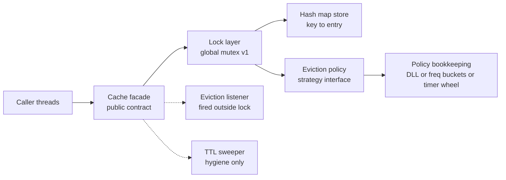

> **"Design an LRU cache" is the best-evidenced problem still asked at manager and Director level** - it sits in the EM coding banks at Google, Amazon, Microsoft, Meta, and Netflix, often dressed as "a cache with rank-based eviction." The trap: it *looks* like algorithm recall, and a junior answer plays it that way - recite HashMap + doubly-linked list, code it, done. At Director the bar has moved. The interviewer scores whether you design the **interface contract** before the data structure, make eviction **pluggable** (LRU today, LFU or TTL next quarter) without callers noticing, and choose **lock granularity by measurement, not reflex**. The HashMap+DLL trick is one sentence of your answer; the rest is API design.

### Learning objectives
- Reframe the LRU question from **algorithm recall to interface design**: a `Cache` contract whose eviction behavior is a **Strategy-pluggable policy** (LRU/LFU/TTL), swappable without touching callers.
- State the **O(1) result** (hash map + doubly-linked recency list) in one sentence and move on - mechanics are delegable; contract decisions are not.
- Choose **lock granularity** (global vs striped vs read-write) with arithmetic - including the honest admission that **a coarse lock is fine until a measurement says otherwise**.
- Adapt the **RESHADED spine** to an LLD problem - the letters survive; narrating how each step adapts is itself interview signal.
- Know **where the LLD answer ends**: two processes sharing the cache puts you in distributed-cache territory, and the distributed-cache deep-dive picks up that thread.

### Intuition first
Think of a **coat check**. The numbered tags are the hash map: hand over tag 47, get coat 47 instantly, no searching. The recency rule is the attendant re-hanging every retrieved coat at the *front* of the rack - so when the room fills, the coat at the *back* (untouched longest) goes to overflow. That is LRU: tags for lookup, rack order for eviction.

Now the part that matters at this level: management changes the rule - evict the coat *worn least often* (LFU), or any coat *past its claim date* (TTL). What does **not** change: the customer window. Check a coat, retrieve a coat, same tags. Only the attendant's *private re-hanging habit* changes. **That separation - a stable public contract over a swappable internal ordering rule - is the actual design problem.** Welding the rack into the counter is the junior version of the answer.

---

## R - Requirements

> In an LLD problem, R adapts from "scope a planet-scale product" to **"pin the contract"**: who calls this, with what concurrency, under what capacity definition. Skipping to code without these questions is the most common down-level signal.

**Clarifying questions I'd ask (with assumed answers):**
- *Single process or shared across services?* → **Single process, in-memory.** (Shared = the distributed-cache problem - a different question; I say that boundary out loud.)
- *Thread-safe?* → **Yes**, multiple application threads.
- *Capacity in entries or bytes?* → **Count for v1, but the interface must admit a byte-weigher** - ops teams budget heap in MB, not entries.
- *Strict or approximate LRU?* → **Strict for v1**; approximate recency is the standard escape hatch if the lock ever becomes the bottleneck.
- *Which policies, now and later?* → **LRU now; LFU and TTL must plug in later without changing callers.** This sentence *is* the problem statement.

**Functional requirements:** (1) `get`/`put`/`remove` in constant time; (2) **bounded capacity** - insert into a full cache evicts exactly one policy-chosen victim; (3) **pluggable eviction** selected at construction, invisible to callers; (4) optional **eviction listener** (callers may need to write back or log); (5) **stats** - hit rate, evictions: you cannot tune what you cannot see.

**Explicitly CUT (saying so is the signal):** persistence, distribution, serialization, multi-tier composition, async `get-or-load`. Each is real in production caches; each doubles the design.

**Non-functional requirements:** **O(1)** operations including the eviction decision; **thread safety** with a quantified concurrency target (next section); **predictable memory** - the cache must never blow the heap budget; **open for extension, closed for modification** - a new policy is a new class, not an edit to the cache.

---

## E - Estimation

> E adapts from planetary QPS to **the three numbers that decide this design**: the caller's ops rate, the entries' memory, and the throughput ceiling of one lock. Ten lines of arithmetic settles debates that otherwise run on vibes.

**Assumptions:** the cache backs a service doing **5K RPS**, ~10 lookups per request; 1M entries max; keys ~50 B, values ~500 B.

**Ops rate:** `5K × 10 ≈ 50K cache ops/s`, peak ~3× → **~150K ops/s**.

**Memory:** `1M × (50 B key + 500 B value + ~100 B node/entry overhead) ≈ 650 MB`. The overhead line matters: pointers, headers, and the policy's bookkeeping node add **~15-20%** over payload - a cache sized by payload alone overruns its budget. Hence the **weigher** (capacity in bytes) in the contract.

**The lock ceiling (the number that decides Evaluation).** An uncontended mutex acquire ~25 ns; a map get ~100 ns; the recency splice ~50 ns - call it **~200 ns per locked op → one global lock sustains roughly 2-5M ops/s**. Against 150K ops/s peak: **15-30× headroom**.

**What estimation decided:** at this workload **a single coarse lock is nowhere near the bottleneck** - anyone reaching for striping in minute five is optimizing a problem the numbers say doesn't exist. If the host were a 2M-ops/s hot path, the same arithmetic flips the answer; the method is the point.

---

## S - Storage

> S adapts from "pick a database" to **"what state lives where, and what happens at the memory limit."** Nothing persists - this cache *is* ephemeral state - so the storage decision is a heap-budget decision.

- **Everything on-heap, two state holders:** the **store** (hash map: key → entry) and the **policy's bookkeeping** (whatever ordering structure the policy maintains). Keeping them separately owned is the extensibility seam - see H.
- **Capacity by count *and* by weight.** Constructor takes `maxEntries` or `weigher + maxWeight`. *Rejected: count-only* - 1M tiny entries vs 1M 50 KB entries differ by 50 GB.
- **Rejected: soft/weak references ("let the GC evict").** Zero eviction code, but eviction timing becomes a GC detail: unpredictable hit rates, no policy control, undebuggable. Explicit bounded capacity costs the eviction machinery and buys deterministic behavior.
- **Expired-but-unread TTL entries** are a slow leak. Handle with **lazy expiry on access plus a cheap periodic sweep** - the same lazy-reclaim instinct as Ticketmaster's holds: correctness never depends on the sweeper; it only reclaims memory.

---

## H - High-level design

> H adapts from service boxes to a **composition diagram**: which object owns which responsibility, and where the extension seam runs - the line between the cache's *mechanism* and the policy's *decision*.



**Division of labor:** the **facade** owns the public contract, the store, capacity accounting, and *when* eviction happens (insert past capacity). The **policy** owns *who* gets evicted - and **owns its own bookkeeping structure**: a recency list for LRU, frequency buckets for LFU, an expiry ordering for TTL. The facade calls it through four narrow hooks: *recorded an access, recorded an insert, removed a key, give me a victim.*

**Why this seam and not the alternatives:**
- *Rejected: inheritance* (`LRUCache extends BaseCache`). Policies multiply (LRU×TTL? LFU with weight?) and inheritance forces a class per combination, with subclasses touching internals they shouldn't. Composition keeps the policy a sealed component - Strategy over template-method, and naming the pattern is cheap credibility.
- *Rejected: one generic ordering structure owned by the cache* ("a priority queue; policies supply a comparator"). Seductively uniform - and it forces **O(log n)** per access or **O(n)** victim scans, destroying the O(1) NFR for LRU, which needs a *splice*, not a sort. **A policy interface that dictates the data structure is a leaky abstraction; the hooks must let each policy meet O(1) its own way.** Interviewers who know the problem probe exactly here.

---

## A - API design

> A adapts from REST endpoints to **the interface contract** - in an LLD round this is the centerpiece. Every signature is a decision with a rejected alternative.

```text
interface Cache<K, V>
    get(key)            -> V or absent     # records an access
    put(key, value)     -> void            # may evict; counts as access
    put(key, value, ttl)-> void            # per-entry TTL override
    remove(key)         -> bool
    size() / weight()   -> long
    stats()             -> hits, misses, evictions

builder: capacity(maxEntries) | maxWeight(w, weigher)
         policy(LRU | LFU | TTL | custom)
         evictionListener(fn)              # invoked OUTSIDE the lock

interface EvictionPolicy<K>
    onAccess(key)        # get or put-update touched the key
    onInsert(key)        # new key entered
    onRemove(key)        # explicit remove or eviction done
    victim() -> K        # choose who dies; must be O(1)
```

**Contract decisions (each with the rejected alternative):**
- **`get` returns absent, never blocks to load.** *Rejected: read-through `get(key, loader)`* - couples the cache to I/O latency and raises cache-stampede questions; real, but it doubles the design. Scope is a decision too.
- **`put` on an existing key counts as an access** - document it; LFU visibly diverges otherwise, and "unspecified" becomes a bug report.
- **TTL `get` does *not* extend life by default** (expiry from write). *Rejected: touch-on-read* - a hot-but-stale entry lives forever, defeating why you wanted TTL. Offer touch as an explicit option.
- **The listener fires *outside* the lock.** *Rejected: user code under the lock* - a 10 ms attendee serializes the cache; one that calls back in deadlocks. Queue under the lock, invoke after release. This line is one of the strongest senior signals in the problem.
- **`victim()` is O(1) by documented contract** - otherwise someone's custom policy with an O(n) scan turns every insert into a latency cliff.

---

## D - Data model

> D adapts from schemas-and-shard-keys to **the entry record and who owns which pointer**.

The **entry** carries key, value, weight, optional expiry, and **a handle to the policy's bookkeeping node** for that key - the back-pointer that makes everything O(1): when `get` hits the map, the policy splices its node without searching for it.

**The O(1) result, in one sentence:** a hash map gives O(1) lookup, a doubly-linked recency list gives O(1) move-to-front and O(1) evict-from-tail, and the entry's node pointer ties them - **hash map for *finding*, linked list for *ordering*, neither doing the other's job.** State that, offer depth if wanted, and spend your minutes on the contract. Reciting the pointer surgery unprompted is the too-deep failure mode the altitude lesson warns of.

<details>
<summary>Go deeper, HashMap + DLL mechanics and the LFU variant (IC depth, optional)</summary>

**LRU structures:** `map: K → Node`, `Node {key, value, prev, next}` in a doubly-linked list with sentinel head/tail.

- `get(k)`: map lookup → unlink node (`prev.next = next; next.prev = prev`), re-link at head - 6 pointer writes, O(1).
- `put(k, v)` new key: create node, link at head, map insert; if over capacity, victim = `tail.prev`, unlink, map remove, fire listener. O(1).
- `put` existing key: update value in place, same move-to-front splice.
- `remove(k)`: map remove + unlink. O(1).

A singly-linked list fails because unlinking needs the predecessor - O(n) to find. The `prev` pointer is the entire trick.

**LFU in O(1)** (the standard follow-up): a map of `frequency → DLL of nodes at that frequency` plus `minFreq`; on access, move the node from list *f* to *f+1*; victim = LRU end of the `minFreq` list. All O(1). Naive LFU with a min-heap is O(log n) per access - exactly the leaky-abstraction trap from section H.

**TTL bookkeeping:** a timer wheel (a scheduler uses the same structure) or an expiry-ordered list for uniform TTLs; the lazy check on access (`expiry < now → miss, reclaim inline`) keeps correctness independent of the sweeper.

</details>

---

## E - Evaluation

> Evaluation adapts to its LLD twin: **stress the contract under concurrency.** The lock-granularity decision lives here - made with the Estimation numbers, defended with the honest admission.

**Re-check vs NFRs:** O(1) - yes, the interface mandates it of policies. Extensibility - new policy = new class. Memory - bounded, TTL leak handled lazily. Now **thread safety.**

**Option A - one global mutex.** Simple, obviously correct, and it trivially preserves the compound invariant - **map and policy bookkeeping mutate atomically together**, which is the whole concurrency difficulty. Estimation said **2-5M ops/s** capacity against **150K ops/s** peak. **This is the v1 choice, said confidently:** *"A coarse lock is correct and 20× over budget; I won't spend complexity on contention I can't measure. We profile under production load; striping is a contained refactor behind the same interface if p99 ever disagrees."* Premature striping is the LLD version of premature sharding.

**Option B - read-write lock.** The reflex ("reads dominate, let them share") - and for strict LRU it is **wrong**: **every `get` mutates the recency list.** There are no read-only operations; the rwlock degenerates into an exclusive lock with ~2× acquire overhead. The exception - policies where reads truly don't write (pure TTL, no recency) - is exactly why lock choice belongs *behind* the facade, per policy. Spotting "LRU reads are writes" is a strong-signal moment; insisting on the rwlock after a hint is a red flag.

**Option C - striped/segmented locking.** Shard the keyspace into N independently-locked segments (16 is classic - Guava's design). Throughput scales toward N× (~30-80M ops/s at 16); the costs are real: **LRU becomes per-segment approximate** (typically a point or two of hit rate - usually fine, but say it), `size()` and stats turn into racy aggregates, and a global weight budget needs cross-segment care. **Use when measurement demands it** - the escape hatch we pre-paid for by hiding locking behind the facade.

<details>
<summary>Go deeper, lock-free reads and the Caffeine design (IC depth, optional)</summary>

The production state of the art (Caffeine, successor to Guava's cache) goes past striping: `get` reads a `ConcurrentHashMap` with **no lock**, and instead of splicing the recency list synchronously, appends the access to a **lossy ring buffer** per thread-stripe; a maintenance thread drains the buffers and replays them against the ordering structure (windowed **TinyLFU** admission over segmented LRU, not plain LRU). Recency becomes *eventually accurate* - buffers may drop entries under pressure, costing a sliver of hit rate and buying reads that scale with cores (~10-30× a synchronized LinkedHashMap at 8 threads). The through-line: **strict LRU is fundamentally hostile to concurrency because reads write; every scalable design relaxes recency precision** - striping relaxes it spatially, Caffeine temporally. Choose how to be approximately-LRU; you cannot scale while being exactly-LRU.

</details>

**Other stress points, fast:** listener under the lock - already banned in A. TTL leak - lazy expiry (correctness) + sweep (hygiene), sweeping in short locked batches, never a full scan. Weight drift on mutable values - weight is captured at `put` time; *rejected: re-weighing on read*, which puts user code under the lock on every get.

---

## D - Design evolution

> Design evolution adapts from "10× the traffic" to **"10× the requirements"** - then to the question that ends the LLD frame entirely.

**Near-term, already paid for by the seams:** byte-weight capacity; LFU/TTL as new classes on the same four hooks; striping behind the facade if profiling demands; read-through loading as a *decorator* over the same `Cache` interface, not a contract change.

**The production honesty (Directors say this; juniors don't):** *in real life I would not build this.* Caffeine (JVM), `lru-cache` (Node), or an `OrderedDict` wrapper beat anything written in 40 minutes - Caffeine's TinyLFU admission alone is worth several hit-rate points over textbook LRU. The exercise tests whether you can **design what those libraries are** - then designing it anyway with full command is the strongest frame.

**The boundary question - "now two services need this cache."** Refuse the false continuity: a shared cache is **not a bigger LRU object**; it has different physics. In-process hit: ~100 ns. Cross-process: a network hop makes every hit **~0.5-1 ms - call it 5,000× slower** - and you inherit invalidation, staleness, hot keys, and cache-aside-vs-write-through topology: the **distributed caching** building block, with the caching strategies. The usual production answer is **both tiers**: this lesson's cache as a tiny hot L1 in each instance over Redis/Memcached as shared L2 - and L1 invalidation across replicas becomes the new hard problem. **The distributed-cache deep-dive picks up exactly there**; the deliverable of *this* lesson is knowing where its own answer stops.

**Where I'd delegate (the explicit Director move):** *"The platform team benchmarks coarse-lock vs 16-way striping under our replayed production trace; my prior is the coarse lock survives - we're 20× under its ceiling - and if not, striping is contained behind the facade. I also want hit-rate telemetry from day one: an unmeasured cache is a rumor, and policy choice is an empirical question, not a taste question."*

---

## Trade-offs table - the pivotal decisions

| Decision | Option A | Option B | Option C | Use when... |
|---|---|---|---|---|
| **Extensibility mechanism** | **Strategy - policy behind 4 hooks, owns its own structure** | Inheritance - subclass overrides evict | Generic ordering structure + comparator | **A** default (our choice) - new policy = new class, O(1) preserved per policy. **B** breeds a class per combo. **C** leaks - forces O(log n)/O(n) on policies that need a splice. |
| **Lock granularity** | **Global mutex** | Read-write lock | Striped 16-way | **A** until measured (our choice - 20× headroom). **B** wrong for strict LRU: every read writes. **C** when profiling shows contention; costs approximate LRU + racy stats. |
| **Capacity definition** | **Entry count** | **Byte weight via weigher** | GC-driven soft refs | **A** for uniform small entries. **B** when values vary or ops owns an MB budget - offer both (our choice). **C** rejected - hit rate becomes weather. |
| **TTL expiry** | **Lazy on access + periodic sweep** | Sweeper only | Timer per entry | **A** (our choice) - correctness sweeper-independent. **B** leaks between sweeps. **C** = 1M timers; scheduler overhead dwarfs the cache. |

---

## What interviewers probe here (Director altitude)

- **"Walk me through your design."** - *Strong:* contract and policy seam first; states the HashMap+DLL result in a sentence and offers depth. *Red flag:* opens with pointer surgery; eviction welded into the cache class.
- **"How do you make it thread-safe?"** - *Strong:* "global mutex - the arithmetic shows 20× headroom; striping is a contained refactor if profiling disagrees," and names the compound map+policy invariant. *Red flag:* reflexive striping or lock-free talk with no number attached.
- **"Why not a read-write lock?"** - *Strong:* "strict LRU has no read-only operations - every get splices the recency list; the rwlock degenerates to exclusive with extra overhead." *Red flag:* "reads can share" - never traced what `get` does.
- **"Now make eviction LFU."** - *Strong:* new policy class, same four hooks, owns frequency-bucket bookkeeping to stay O(1); callers untouched. *Red flag:* edits the cache class, or shrugs at an O(log n) heap.
- **"Now two services need it."** - *Strong:* names the 5,000× latency cliff, invalidation, and the L1-over-Redis two-tier shape; points at the distributed-caching block. *Red flag:* "wrap it in gRPC," as if the object just grew a port.

---

## Common mistakes

- **Playing it as algorithm recall.** Forty minutes of pointer surgery, zero interface decisions - the precise inversion of what an EM/Director round scores.
- **The read-write-lock reflex.** Strict LRU mutates on every read; the rwlock buys overhead, not concurrency. Trace what `get` does before picking a lock.
- **Striping on day one.** 150K ops/s against a ~2-5M ceiling makes striping complexity spent on an unmeasured problem - and it silently makes LRU approximate and stats racy.
- **Firing the eviction listener under the lock.** User code with the lock held = serialized cache at best, re-entrant deadlock at worst. Queue inside, invoke outside.
- **A policy interface that dictates the data structure.** A cache-owned priority queue with pluggable comparators forces O(log n) onto LRU's O(1) splice - the abstraction leaks exactly where the NFR lives.

---

## Interviewer follow-up questions (with model answers)

**Q1. Your teammate's design review proposes 16-way lock striping for v1. Respond.**
> *Model:* I'd ask for the number. We run ~150K cache ops/s peak; a coarse-locked cache sustains ~2-5M ops/s - 15-30× headroom, so striping solves a problem we can't measure. And it isn't free: LRU goes per-segment approximate, stats turn racy, a global byte budget needs cross-segment coordination. Locking hides behind the facade, so striping later is a contained refactor, not an API change. Decision: coarse lock, lock-wait and hit-rate telemetry from day one - if the profile ever shows a convoy, the platform team benchmarks striped-16 against our replayed trace; my prior is we never need it.

**Q2. Why does a read-write lock not help here, and when would it?**
> *Model:* Strict LRU has no read-only operations - every `get` moves the entry to the front of the recency list, so "readers" are writers and the rwlock degenerates into an exclusive lock costing ~2× per acquire. It helps only when reads genuinely don't mutate: a pure TTL policy with no recency, or an approximate-LRU design where reads append to a lossy buffer instead of splicing (Caffeine's approach - relax recency precision to buy concurrency). Which is exactly why lock choice lives behind the facade, per policy, not in the public contract.

**Q3. Add TTL as a policy. What breaks, and what do you decide?**
> *Model:* TTL plugs into the same four hooks - its bookkeeping is an expiry ordering (a timer wheel, like a scheduler) instead of a recency list - but it surfaces two contract decisions. Does `get` refresh the TTL? Default no, expiry from write: touch-on-read lets a hot-but-stale entry live forever; offer touch as explicit opt-in. And expired-but-unread entries are a leak, so expiry is checked lazily on access - an expired hit is a miss, reclaimed inline, correctness never depending on a background job - with a periodic sweep purely for hygiene, the lazy-reclaim shape from Ticketmaster. TTL *plus* LRU composes as expiry-for-validity over LRU-for-victim-choice, not two competing victim pickers.

**Q4. "Great. Now ten instances of the service need a coherent view of this cache."**
> *Model:* Then we've left this problem. An in-process hit is ~100 ns; a shared cache puts a network hop in the path - ~0.5-1 ms, roughly 5,000× - so the answer is not my object behind gRPC, it's the distributed-caching block: Redis/Memcached as the shared tier, an explicit cache-aside or write-through strategy, and an invalidation story - the actual hard part. In practice: keep this cache as a small hot L1 in each instance over the shared L2, and the new design problem is L1 invalidation across ten replicas - pub/sub invalidation or short L1 TTLs bounding staleness. That's the distributed-cache deep-dive's problem; the Director move is recognizing the LLD answer ended at the process boundary.

---

### Key takeaways
- **The question is interface design wearing an algorithm costume.** The contract and the policy seam are the answer; HashMap+DLL O(1) is one stated sentence with depth on offer.
- **Strategy-pluggable eviction, policies owning their own bookkeeping.** Four hooks - access, insert, remove, victim - each O(1) by contract. A shared generic ordering structure is the leaky abstraction that breaks the NFR.
- **Lock granularity is arithmetic, not reflex:** 150K ops/s vs a ~2-5M coarse-lock ceiling = global mutex for v1, striping as a measured, contained refactor. The rwlock is wrong because **strict LRU reads are writes**.
- **Three contract details carry senior signal:** listener outside the lock; TTL without touch-on-read by default; a byte weigher, because ops budgets heap in MB.
- **Know where the answer ends:** in production you'd adopt Caffeine and say so; across a process boundary it's the distributed problem, with a 5,000× latency cliff at the door.

> **Spaced-repetition recap:** LRU cache at Director altitude = **contract + seam, not pointer surgery**. `Cache` facade owns map, capacity, and when-to-evict; **Strategy policy** owns who-dies via four O(1) hooks and its **own** structure (DLL / freq buckets / timer wheel). O(1) = map finds, list orders. Concurrency: **coarse lock, justified by arithmetic** (150K ops/s vs ~2-5M ceiling); rwlock wrong - LRU reads write; stripe only on measurement. Listener outside the lock; TTL lazy-expire, no touch-on-read; weigher for bytes. Cross-process = the distributed-caching block, not a bigger object.

---

*End of Lesson 6.4. The LLD curveball inverts the HLD habits - no QPS planet to size - but keeps the discipline: requirements before structure, every choice with its rejected alternative, numbers before knobs. The lazy-reclaim and contention instincts came from Ticketmaster; the process-boundary handoff goes to the distributed cache and is taken up again in the distributed-cache deep-dive.*
