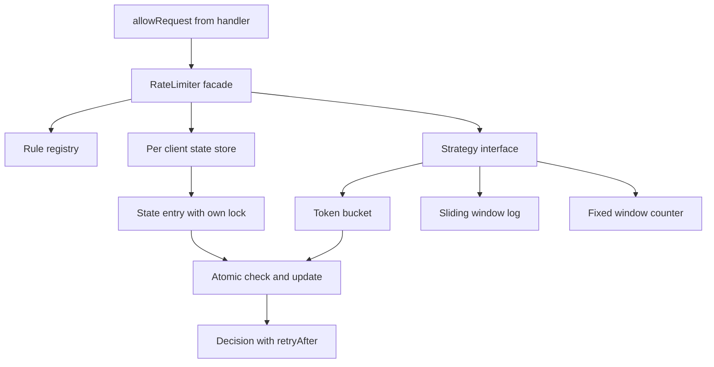

> **Why this gets asked.** The rate limiter is one of the few problems asked in *both* LLD and HLD rounds, Stripe, Google, Amazon, Meta, and Cloudflare all run it, deliberately probing the seam between the forms. The course covers the distributed half; this is the missing half: **design the `RateLimiter` class**. A junior answer recites token-bucket mechanics. A Director answer treats **algorithm selection as a requirements decision**, puts it behind a **Strategy seam**, gets **per-client concurrency** right without a global lock, and names, unprompted, **where the in-process design stops and 3.10/5.2 begins.** Interviewers ask the climb; have it ready.

### Learning objectives
- Design the **`RateLimiter` interface and Strategy hierarchy** so token bucket, sliding-window log, and fixed window are interchangeable per rule.
- Choose the algorithm **per requirement, not by reflex**: burst tolerance, memory per client, the asymmetric cost of a false reject vs a false accept.
- Make `allowRequest` correct under concurrency with **per-client locking**, naming the global-lock convoy rejected and the CAS delegated.
- Size the per-client **state store** (memory math decides bucket vs log at 1M clients) and bound it with eviction.
- Deliver the **two-altitude framing**: this class is the in-process half; 3.10/5.2 are the distributed half; the climb between them is the real question.

### Intuition first
Picture a security turnstile with three interchangeable mechanisms. A **coin dispenser** drips tokens into a cup; a coin admits you, a quiet hour banks coins, so a group can burst in. A **logbook** records every entry time; the guard counts the last hour before admitting you, exact, but the book gets thick. A **tally counter** that resets on the hour is cheap and dumb, 100 people at 9:59 plus 100 at 10:01 is 200 in two minutes, because the reset is a cliff.

The LLD question is not "which mechanism is best." It is: **design the turnstile so the mechanism is a plug-in**, different doors have different policies (the vault wants the logbook, the lobby the coin cup), and ensure two people hitting it in the same instant each get **exactly one atomic decision**, without the whole building queuing behind one guard. Interface first, mechanism second, concurrency third. That ordering *is* the answer.

---

## R: Requirements

> **The adaptation:** "scope and scale" becomes **contract and constraints**, method contract, policy surface, hot-path budget. Saying the adaptation out loud at every step is itself signal.

**Clarifying questions (with assumed answers):**
- *In-process library or network service?* → **In-process v1**; the distributed form is 3.10/5.2, and I'll name the climb at the end. Asking this first pins the altitude, the strongest opening move.
- *Per-client, per-endpoint rules?* → **Yes**, runtime-configurable: `client × endpoint → rule`.
- *Is bursting acceptable?* → **Depends on the rule**, exactly why the algorithm must be a per-rule Strategy, not hardcoded.
- *Cost of a wrong decision?* → Asymmetric: a **false reject** on Stripe's charge API is lost revenue; a **false accept** on login is a brute-force window. The expensive direction differs per endpoint.

**Functional requirements:** (1) `allow(clientId, resource)` → allowed/denied + `retryAfter` + remaining quota (the caller emits 429 headers, a decision object, not a boolean); (2) **pluggable algorithms** per rule; (3) runtime-configurable rules; (4) per-client isolation.

**Non-functional requirements:** **hot-path latency**, `allow()` runs on *every* request, budget **< 50 µs** (< 2.5% of a 2 ms handler); **thread safety**, check-and-update atomic per client; **bounded memory**, ~1M clients in heap with idle eviction; **no external dependency in v1**.

**Explicitly CUT:** distributed coordination, Redis, multi-node consistency, quota billing, admin UI. Cutting them by name, *with a forwarding address*, is the Director move.

---

## E: Estimation

> **The adaptation:** no fleet sizing, the **three numbers that decide the class design**: hot-path budget, lock utilization, memory per client.

**Hot-path budget.** One server at **5K req/s**, handler p50 ~2 ms. At 50 µs, `allow()` adds 2.5% latency and `5K × 50 µs = 0.25` CPU-sec/sec, a quarter core. At 1 ms (a careless contended implementation): 5 full cores for rate limiting alone. The budget rules out anything heavier than a map lookup plus arithmetic under a brief lock.

**Why a global lock dies.** A 10 µs critical section under one global lock: at 5K req/s the lock is 5% busy, fine. At 50K req/s (a beefy gateway box): **50% utilization**, and by the queueing math waits explode well before saturation, every request queues behind one lock. Contention must be per-client.

**Memory per client, this decides the algorithm.** Token bucket: 2 longs ≈ **50 B with overhead**; 1M clients ≈ **50 MB**, trivial. Sliding-window log: a timestamp per request in the window, at 1,000 req/min, `1,000 × 8 B = 8 KB`/client; 1M clients ≈ **8 GB**, dead as a default. The same log on *5 attempts/hour* (password resets): 40 B, fine for **low-limit, high-stakes rules.**

**What estimation decided:** no global lock, no network hop, **token bucket as default**, the log confined to low-limit rules. The numbers picked the design before taste voted.

---

## S: Storage

> **The adaptation:** "what persists, in which store" becomes **"where does counter state live, in which structure"**, the instinct, aimed at the heap.

**Choice: an in-heap concurrent map, `client:resource → StateEntry`** (a `ConcurrentHashMap`), each entry owning its algorithm state *and its own lock*. Lookup is lock-free; mutation locks only the entry.

- *Rejected, Redis in v1:* an intra-AZ round trip is ~0.5-1 ms, **20× the entire 50 µs budget**. Redis answers a *different* requirement (shared state across nodes); it arrives in Design evolution.
- *Rejected, one synchronized global map:* the convoy computed above; it poisons the box's p99.

**The eviction requirement (the leak everyone forgets).** Clients are unbounded, every new API key or IP allocates an entry forever; a scraper cycling IPs is a slow OOM. **Bound the map: TTL expiry of idle entries or an LRU cap.** Trade-off: eviction forgets history, benign for buckets (a fresh client starts full anyway), *not* for the password-attempt log, so **security rules get longer TTLs**. A the distributed-cache building block cache-eviction decision hiding inside a class design.

---

## H: High-level design

> **The adaptation:** the box diagram becomes a **class collaboration diagram**. Four pieces: facade, rule registry, state store, Strategy seam.



**The flow:** the facade resolves the **rule**, fetches-or-creates the client's **state entry**, and dispatches to the rule's **Strategy**, which checks-and-updates *under the entry's lock*, returning a `Decision`.

**The load-bearing decision, the Strategy seam.** Algorithms are objects behind one interface; the rule names which it wants.
- *Why:* requirements demand different algorithms per endpoint (burst-friendly bucket for charges, exact log for logins). Hardcoding one makes the next requirement a rewrite; the seam makes it a config line, and each strategy unit-tests against a fake clock.
- *Rejected, one über-algorithm with a strictness knob:* conflates genuinely different state shapes (two longs vs a timestamp deque) behind leaky parameters; you inherit the union of all bugs.
- *Rejected, subclassing per algorithm:* welds the algorithm to the facade, so one limiter can't serve mixed rules, our actual requirement. Composition over inheritance, chosen from the requirement.

**Second decision: strategies are stateless; state lives in the entry.** One `TokenBucketStrategy` serves a million clients. *Rejected, a strategy object per client:* a million objects duplicating identical logic, murkier locks. This factoring later lets state move to Redis while strategies stay.

---

## A: API design

> **The adaptation:** this *is* the centerpiece, endpoints become **method signatures**; the interface is the product.

```text
interface RateLimiter {
    Decision allow(String clientId, String resource);   // hot path, thread-safe
    void setRule(String resource, Rule rule);           // runtime config
}

record Decision(boolean allowed, long retryAfterMs, long remaining)

record Rule(long limit, long windowMs, long burstCapacity, StrategyType type)

interface RateLimitStrategy {                           // the Strategy seam
    Decision tryAcquire(ClientState state, Rule rule, long nowNanos);
    ClientState newState(Rule rule, long nowNanos);     // first sight of a client
}
```

**Design notes (each with its rejected alternative):**
- **`Decision`, not `boolean`.** The caller needs `Retry-After` and remaining quota for 429 headers; a bare boolean forces a second, racy query. *Rejected: `boolean allow()`*, cleaner-looking, starves the caller.
- **Time is a parameter.** Inject a **monotonic** clock: wall clock steps backward under NTP and mints free tokens; injection makes boundary tests deterministic. *Rejected: inline wall time*, untestable, subtly wrong.
- **`tryAcquire` is check-AND-consume in one call.** *Rejected: separate `check()` then `consume()`*, the gap is a TOCTOU race; two threads both pass `check`, both take the last token. The contract must make the race **inexpressible**, the single-atomic-statement instinct, applied to method design.
- **`newState` lives on the strategy**, each algorithm owns its state shape; the facade stays ignorant of internals, the property that survives the later move to Redis.

---

## D: Data model

> **The adaptation:** schema/keys/indexes become **per-client state records and the map key**.

**Map key: `clientId + ":" + resource`**, per-client *and* per-endpoint isolation in one lookup. *Rejected: keying by client alone*, a burst on a cheap endpoint drains quota for the expensive one.

**State records, per strategy:** token bucket, `tokens` + `lastRefillNanos` (~50 B); sliding-window log, a deque of timestamps (8 B × limit); fixed window, `windowStart` + `count` (~50 B). Each entry also carries **its own lock** and `lastAccessNanos` for eviction, the data model anticipates Evaluation's concurrency and Storage's TTL.

The fixed-window flaw, once: rule 100/min, 100 requests at 0:59 and 100 at 1:01 are both allowed: **200 in two seconds**, because the reset is a cliff. Fine for coarse abuse caps; unacceptable where the limit *is* the contract. (Algorithm internals are the material; here we need only state shapes and costs.)

<details>
<summary>Go deeper, full token-bucket strategy listing with per-entry locking (IC depth, optional)</summary>

```java
final class TokenBucketState implements ClientState {
    double tokens;            // fractional tokens keep refill math exact
    long   lastRefillNanos;
    long   lastAccessNanos;   // for TTL eviction
    final Object lock = new Object();
}

final class TokenBucketStrategy implements RateLimitStrategy {
    public ClientState newState(Rule r, long now) {
        var s = new TokenBucketState();
        s.tokens = r.burstCapacity();       // start full
        s.lastRefillNanos = now;
        return s;
    }
    public Decision tryAcquire(ClientState cs, Rule r, long now) {
        var s = (TokenBucketState) cs;
        synchronized (s.lock) {                       // per-client lock only
            double ratePerNano = (double) r.limit() / (r.windowMs() * 1_000_000L);
            s.tokens = Math.min(r.burstCapacity(),
                                s.tokens + (now - s.lastRefillNanos) * ratePerNano);
            s.lastRefillNanos = now;
            s.lastAccessNanos = now;
            if (s.tokens >= 1.0) {
                s.tokens -= 1.0;
                return new Decision(true, 0, (long) s.tokens);
            }
            long retryNanos = (long) ((1.0 - s.tokens) / ratePerNano);
            return new Decision(false, retryNanos / 1_000_000L, 0);
        }
    }
}
```

Facade hot path: `map.computeIfAbsent(key, k -> strategy.newState(rule, now))`, atomic on a ConcurrentHashMap, so two threads seeing a new client cannot mint two states. Lazy refill (compute elapsed tokens at read time) means **no background refill thread**, the same lazy-reclaim instinct as the hold expiry: correctness never depends on a timer.

</details>

---

## E: Evaluation

> **The adaptation:** "stress vs NFRs" becomes **concurrency on the hot path**, where LLD designs live or die. Walk the race, the three options, then decide.

**The race.** Bucket has 1 token. Threads A and B call `allow()` for the same client; naive code lets both read `tokens == 1`, both pass, both decrement, **two admits on one token**, corrupt state. Every algorithm here is read-modify-write; without atomicity the limiter *over-admits precisely under load*.

**Three options, one decision:**

1. **Global lock.** Correct, simple, and the Estimation math shows 50% utilization at 50K req/s and a box-wide convoy. *Rejected:* it works until the box grows, then fails at the worst time.
2. **Per-client lock on the entry, the choice.** Contention exists only when a client races *itself*, rare, or exactly the abuser whose requests *should* serialize; distinct clients never contend. The critical section is ~10 arithmetic ops, sub-µs. Cost: one lock per entry (~16 B; +16 MB at 1M clients).
3. **Lock-free CAS**, pack state into one atomic 64-bit word, compare-and-swap, losers retry. Fastest under extreme contention; much harder to write and extend (the log can't pack into 64 bits). *Rejected as default, kept as the named escalation:* "I'd have the platform team benchmark CAS vs per-client locks under our hottest client's profile; **my prior is the lock loses < 1 µs and wins on maintainability**."

**Re-check the NFRs:** latency, map get + entry lock + arithmetic ≈ single-digit µs; memory, 50 MB + 16 MB of locks, TTL-bounded; clock, monotonic, injected. One residual: first-sight state creation must be atomic (`computeIfAbsent` is) or two threads mint two states.

<details>
<summary>Go deeper, lock striping and the CAS packing trick (IC depth, optional)</summary>

**Lock striping:** an array of N locks, entry locked by `hash(key) % N`. With N = 1,024, unrelated clients collide with probability ~1/1,024, but per-entry locks are already cheap; striping only pays when entries are too small to carry a lock.

**CAS packing** for the bucket: encode integer `tokens` (20 bits) and a truncated refill timestamp (44 bits) into one `AtomicLong`. Acquire loop: read, compute refill + decrement into a new word, `compareAndSet`, retry on failure. Tens of millions of ops/s on a single mega-hot key vs ~5-10M lock/unlock pairs/s. Costs: fractional tokens gone, timestamp wraparound handling, and the sliding log is unpackable, so two concurrency models in one codebase. That last sentence usually ends the meeting.

</details>

---

## D: Design evolution

> **The adaptation:** "scale under new constraints" becomes **the climb from one process to 50 servers**, the seam where this lesson hands off to 3.10/5.2. Interviewers ask this climb almost every time.

**The constraint arrives:** 50 servers behind a load balancer. Each enforces 100 req/min locally → a client spraying across nodes gets **up to 5,000 req/min, 50× the limit.**

**Three responses, escalating:**

1. **Divide the limit: 100/50 = 2 per node.** Free, and broken: traffic is never uniform, so a client routed 80/20 is falsely rejected on the hot node while quota idles elsewhere; the divisor changes on every autoscale. *Only for coarse ceilings tolerating 2-3× error.*
2. **Sticky routing: consistent-hash clients to nodes**, each local limiter becomes globally correct for its clients. Elegant, fragile: node loss remaps clients with fresh state, and it hijacks LB policy. *Real when the LB already hashes by client.*
3. **Centralize: Redis-backed counters, atomic Lua, ~1 ms per request, the rate-limiter building block and 5.2**, with their race windows and fail-open/fail-closed posture. The practical winner is usually the **hybrid**: local burst allowance + async sync, hot path at local speed, global error bounded by the sync interval.

**The two-altitude framing, said out loud (memorize this move):** *"Today's design is the in-process half, and the Redis design still needs it: every node keeps local state, strategies, and thread safety; the shared store is just another state store behind the same seam. The distributed half, where shared state lives, what happens when Redis is down, what the millisecond costs, is a different problem: The rate-limiter building block/5.2."* That demonstrates what the dual-form question tests: **which problem you're solving, and where the other one starts.**

**Where I'd delegate:** the CAS-vs-lock benchmark (prior above); Redis failover posture to the platform team, *"my prior is fail-open with an alarm: fail-closed turns a Redis blip into a full outage; brief abuse exposure is the cheaper risk"*; rule governance to the API platform owner, limits are revenue policy.

---

### Trade-offs table: algorithm selection as class design

| Dimension | A, Token bucket | B, Sliding-window log | C, Fixed window | Use when… |
|---|---|---|---|---|
| Burst behavior | Bursts to bucket size, smooth average | Exact rolling limit, no forgiveness | **2× burst at boundary** | **A** when bursts are legitimate; **B** when the limit is a contract; **C** when approximate is fine |
| Memory per client | ~50 B | 8 B × limit (8 KB at 1K/min) | ~50 B | **B** only for low-limit rules, 5/hour logins, not 1K/min APIs |
| Cost of false reject | Low, burst absorbs jitter | Higher, strict edge | Spiky, boundary artifacts | **A** for revenue paths; **B** where a false *accept* is the expensive error (auth) |
| **Verdict** | **The default** | The low-limit, high-stakes specialist | The cheap coarse ceiling | The Strategy seam makes this per-rule config, not an argument |

(All three fit the 50 µs budget, memory and semantics differentiate them, not CPU.)

---

### What interviewers probe here (Director altitude)

- **"Why three algorithms behind an interface?"**, *Strong:* maps each to a requirement (burst tolerance, memory, false-reject cost); the seam is forced by per-endpoint differences. *Red flag:* "Strategy pattern is best practice", pattern as incantation.
- **"Two threads, one token left."**, *Strong:* the read-modify-write race, check-and-consume atomic *in the contract*, per-client locks, the convoy quantified. *Red flag:* `synchronized` everywhere, no cost stated.
- **"This now runs on 50 servers."**, *Strong:* "50× the limit" instantly, then the climb (divide → sticky-hash → shared store), the hybrid, fail-open, 3.10/5.2 as a distinct problem. *Red flag:* "put it in Redis" with no latency cost named.
- **"What's in memory after a month?"**, *Strong:* the unbounded-map leak, TTL/LRU eviction, eviction forgetting history (benign for buckets, not security logs). *Red flag:* never considered unbounded clients.
- **"What would you delegate, and what's your prior?"**, *Strong:* CAS benchmark (prior: lock wins), Redis failover (prior: fail open), rule governance to the platform owner. *Red flag:* ten minutes of CAS bit-packing, or nothing kept.

---

### Common mistakes

- **Leading with an algorithm instead of the interface.** Refill math before any contract exists reads as IC reflex. Interface, seam, state, the algorithm is a plug-in.
- **`check()` and `consume()` as separate methods.** The gap is a TOCTOU race the interface invites. One atomic call, make the race inexpressible.
- **One global lock.** Correct, and it convoys the box at scale; per-client locks cost 16 B per entry. Quantify, don't assert.
- **An unbounded client map.** Every new API key allocates state forever; a key-cycling scraper is a slow OOM. TTL eviction is part of the design.
- **Forgetting the climb.** Never volunteering that 50 servers makes local limits 50× wrong. The two-altitude handoff is the highest-value sentence in the interview.

---

### Interviewer follow-up questions (with model answers)

**Q1. Sketch your core interface and defend its shape.**
> *Model:* `Decision allow(clientId, resource)` on the facade; `Decision tryAcquire(state, rule, now)` on the Strategy. Three choices: **`Decision`, not boolean**, the caller needs `retryAfter` and remaining quota for 429 headers; **check-and-consume in one call**, separate check/consume is a TOCTOU gap the contract must make impossible; **time injected, monotonic**, wall clock steps backward under NTP and mints free tokens. Strategies stateless and shared; per-client state in a locked map entry, the factoring that later lets state move to Redis.

**Q2. When would you actually pick the sliding-window log, given its memory cost?**
> *Model:* When the limit is small and a false *accept* is the expensive error. At 1,000 req/min the log is 8 KB/client, 8 GB for a million clients, dead as a default. At 5 attempts/hour on password reset it's 40 B, free, and exact: no boundary burst, no burst allowance (a bucket's forgiveness is precisely wrong for brute force). Bucket as fleet default for revenue paths; the log for low-limit security rules, a per-rule config line, which is why the seam exists.

**Q3. Your limiter is correct on one node. Production runs 40 nodes behind an LB. Walk me up.**
> *Model:* Local enforcement is now globally wrong, 100/min per node is up to 4,000/min for a spraying client. Three rungs: **divide by N** (free; breaks on traffic skew and every autoscale); **consistent-hash clients to nodes** (globally correct per client; fragile on churn, hijacks LB policy); **Redis with atomic Lua**, the 3.10/the rate-limiter problem design, ~1 ms per request against my 50 µs budget, so the practical winner is the **hybrid**: local burst allowance with async sync. Posture: **fail open with an alarm**, fail-closed converts a Redis blip into a self-inflicted outage. The class survives the climb: the shared store is another state store behind the same seam.

**Q4. Why per-client locks rather than lock-free CAS?**
> *Model:* CAS is faster under contention, and the contention doesn't exist: distinct clients never share a lock; a client racing itself spends sub-µs in the critical section. CAS costs real things: bucket state must pack into 64 bits, the log can't pack at all, two concurrency models in one codebase. **Decision: per-client locks; platform team benchmarks CAS; prior: the lock loses under a microsecond and wins maintainability.**

---

### Key takeaways
- **The LLD rate limiter is algorithm selection *as class design*:** token bucket (default; 50 B/client), sliding-window log (exact; low-limit high-stakes rules only), fixed window (cheap; 2× boundary burst). Each is a requirements answer.
- **The Strategy seam is forced by per-endpoint requirements:** stateless shared strategies, per-client state records, and the seam later absorbs the Redis-backed store.
- **The interface is the correctness story:** `Decision` not boolean, check-and-consume in one atomic call (no TOCTOU), injected monotonic clock. Make races inexpressible in the contract.
- **Concurrency: per-client locks**, not a global lock (10 µs × 50K req/s = 50% utilization = convoy), not CAS by default (delegated with a prior). TTL-evict the state map or it's a slow OOM.
- **Always volunteer the climb:** 50 nodes makes local limits 50× wrong → divide → sticky-hash → shared store, hybrid in practice, fail open. Knowing where the in-process half ends is the Director signal.

> **Spaced-repetition recap:** LLD rate limiter = **interface + Strategy + per-client state under concurrency**. `Decision allow(client, resource)`; check-and-consume atomic; injected monotonic clock. Bucket default; log for low-limit security rules; fixed window = 2× boundary burst. Per-client locks; TTL-evict the map. The climb: 50 nodes = 50× the limit → divide / sticky-hash / Redis, hybrid + fail-open. Name the seam unprompted.

---

*End of Lesson 6.5. This lesson built the class inside each node, interface, Strategy seam, per-client locking under a 50 µs budget; the rate-limiter building block and the rate-limiter problem own where shared state lives and what happens when it's unreachable. The interview rewards the candidate who can stand at the seam and describe both sides.*


