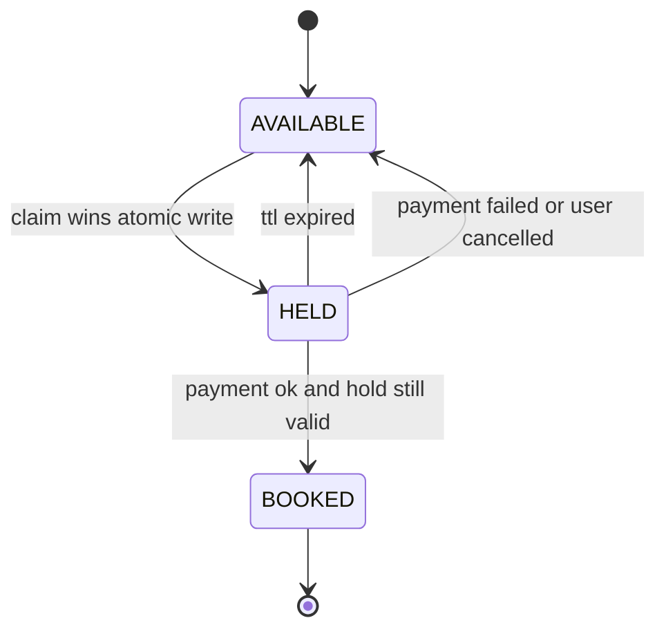

> **You already designed this system, at the other altitude.** Ticketmaster (Ticketmaster) solved seat reservation as HLD: sharded stores, waiting rooms, CDN tiers. This is the *same domain dropped to LLD*, the form Flipkart/Swiggy/Paytm loops actually ask: "design BookMyShow, two users book the same seat concurrently; exactly one succeeds." The rubric flips: **entity model, seat state machine, hold TTL, and the exact concurrency mechanism**, pressed until it holds or leaks a double-booking. A junior answer reaches for `synchronized`. A Director answer names three locking strategies, **picks one by traffic shape** (opening night ≠ Tuesday matinee), makes the payment-failure and expiry paths race-proof, and **narrates the climb to the distributed form** when one database stops being enough. Same problem, two altitudes, two rubrics, learn the climb.

### Learning objectives

- Model the domain at LLD: `Show`, `ShowSeat`, `SeatHold`, `Booking`, and why seat status lives on **ShowSeat**, never the physical seat.
- Design the seat **state machine**, `AVAILABLE → HELD(ttl) → BOOKED`, with lazy expiry and exactly-one-winner claims.
- Argue **pessimistic vs optimistic vs hold-table** by contention shape, and defend a default.
- Make the **payment-failure and TTL-expiry paths** correct: idempotent confirm, re-asserted holds, no lock across payment.
- Map every LLD element to its **5.13 distributed counterpart**, climb altitudes on demand.

### Intuition first

Picture a cinema with a paper seating chart at the box office. Point at seat F14 and the clerk **pencils your name on the square and starts a 10-minute egg timer**. Pay in time, the pencil becomes pen, sold. Timer runs out, the eraser frees the square. The entire LLD is three questions about that clipboard: **(1)** what stops two clerks penciling the same square at the same instant; **(2)** what exactly is written, the entity model; **(3)** what guarantees the eraser always runs, expiry that doesn't depend on someone remembering. The answer to (1) is the whole interview: there is **one clipboard** (one transactional database), and the pencil-down moment is **atomic**, exactly one writer wins; the loser finds the square penciled and picks another seat. Everything else, payment, cancellation, the sweeper, is plumbing around that atomic instant. And the database **is** the arbiter: the moment someone proposes a `ConcurrentHashMap` of locked seats, ask what happens at the second app instance or a restart mid-checkout. In-process memory cannot hold a business invariant, that observation kills half the wrong answers.

---

## R: Requirements

> LLD adaptation: R still scopes the build, but it *also* pins the **rubric**, say out loud that you'll deliver entities, the state machine, the concurrency mechanism, and the failure paths. Naming the deliverable is itself a senior signal.

**Clarifying questions I'd ask (with assumed answers):**
- *Reserved or general admission?* → **Reserved**; the flash-sale/GA variant gets one line in Design evolution.
- *How long to pay?* → **Hold TTL ~10 minutes**, above worst-case gateway latency, short enough that abandoned seats recycle fast.
- *Is double-booking ever tolerable?* → **No.** Exactly-one-winner per seat is the invariant the whole design serves.
- *Distributed from day one?* → **Start single-DB** (the LLD frame); I'll name the climb when the numbers force it.

**Functional requirements:** browse shows and view a show's **seat map**; **hold** a set of seats all-or-nothing with a TTL; **confirm** a hold into a booking after payment; **release** on cancel, payment failure, or expiry; concurrent claims on one seat → **exactly one succeeds**, the rest fail fast.

**Cut (and say so):** pricing/offers, recommendations, food & beverage, refunds UX, search ranking. Scope is **seat map → hold → pay → confirm/release**.

**Non-functional requirements:** correctness over availability on the claim path (a deliberate CP posture, the CAP/PACELC lesson, a 409 is fine, a double-booking is not); claim p99 < ~300 ms; hold expiry **guaranteed**, not best-effort; correct on **N app instances** from the first line of code.

---

## E: Estimation

> LLD adaptation: estimation doesn't size a fleet, it quantifies the **contention shape**, because the lock strategy is chosen by that number, not by taste.

**Two traffic shapes, same code path:**

- **Tuesday matinee:** a 250-seat screen, ~30 buyers over 3 hours → effectively **zero concurrent contention**. Anything works; simplicity wins.
- **Opening night:** ~5,000 fans hit **one show of 250 seats** in the first minute → 20:1 demand:supply, ~80 claim attempts/s, and the center seats see **10-50 contenders in the same second**. This is the shape being tested.

**The decision number is contenders-per-seat at claim instant: ~1 at matinee, ~10-50 on opening night.** That asymmetry, most days boring, some days brutal, is what the lock-strategy argument turns on in §S and §Evaluation.

**Supporting math, rounded hard:** ~10M tickets/month ≈ `10M ÷ 2.6M s ≈ 4 bookings/s` average, **~100/s at peak** platform-wide, trivial for one Postgres. At ~25% hold abandonment that's **~25 expiries/s**, also trivial, but it must be *guaranteed*. Payment gateways run 2-30 s with multi-minute worst cases → **TTL 10 min ≫ worst case**, so the expiry-vs-payment race (§Evaluation) is rare by construction. Storage: tens of GB/year, irrelevant. **Verdict: volume is a non-problem; per-seat contention on hot shows is the entire problem**, the same inversion Ticketmaster taught at scale.

---

## S: Storage

> LLD adaptation: "storage" here means **where does the arbiter live**, which component is allowed to decide who won the seat.

**Decision: one transactional relational database (Postgres/MySQL) is the single source of truth for seat state.** Row-level atomic writes and multi-row transactions are exactly the primitives the invariant needs, and at ~100 writes/s peak a single primary with replicas is loafing.

- *Rejected, in-process locks (`synchronized`, `ConcurrentHashMap<SeatId, Lock>`):* correct only on **one** JVM that never restarts; the second app instance silently breaks the invariant. Fine as a *fast-fail filter*, never as truth.
- *Rejected, a distributed lock service (Redis SETNX/ZooKeeper) as the arbiter:* a second stateful system whose lock lifetime must be reconciled with the DB transaction, two sources of truth plus a famous class of expiry-race bugs, bought to solve contention one database already handles. Wrong tool *at this scale*.
- *Seat-map reads* come from a short-TTL cache, the map is a hint; the claim transaction is the truth, exactly as in 5.13.

---

## H: High-level design

> LLD adaptation: H shrinks from a fleet diagram to **components inside one service** plus the state machine, which *is* the architecture at this altitude.

Four components: **BookingService** (orchestrates hold → pay → confirm), **SeatLockProvider** behind an interface (the swappable concurrency strategy, where the pessimistic/optimistic/hold-table argument plugs in), **PaymentService** delegated behind `charge(idempotencyKey, amount, token)` (PCI stays someone else's audit), and an **ExpirySweeper** for hygiene (correctness comes from lazy reclaim, §Evaluation).

The seat state machine carries the whole design:



**Happy path:** pick seats from a cached map → `hold()` atomically flips all requested seats `AVAILABLE → HELD` in **one transaction** (all-or-nothing; one winner per seat; losers get an instant conflict naming the seats they lost) → pay within the TTL → `confirm()` re-asserts the hold, flips `HELD → BOOKED`, inserts the booking **in one transaction**. Every `HELD` edge off the happy path lands back on `AVAILABLE`.

**The rule that makes the design senior:** the claim transaction is **milliseconds**; the *hold* is **minutes**. The hold is **data** (a status and an `expires_at` on rows), never a database lock held open across the payment call, row locks held for 10 minutes pin connections and deadlock the pool, the single worst implementation of this system and a probe interviewers run on purpose.

---

## A: API design

> LLD adaptation: the API is the **interface contract**, method signatures and their failure semantics, not REST routes. The signatures encode the correctness story.

```
interface SeatLockProvider {
  Hold acquire(showId, seatIds, userId, ttl)
      // all-or-nothing; atomic; throws SeatsUnavailable(takenSeats)
  boolean isValidAndOwned(holdId, userId)
  void release(holdId)
}

class BookingService {
  Hold hold(showId, seatIds, userId)
      // -> lockProvider.acquire(..., TTL_10_MIN)

  Booking confirm(holdId, userId, paymentRef, idempotencyKey)
      // ONE transaction:
      //   re-assert hold valid, owned, unexpired
      //   flip seats HELD -> BOOKED
      //   insert booking (idempotencyKey UNIQUE)
      // hold expired -> HoldExpired (gone)
      // duplicate key -> return existing booking

  void cancel(holdId, userId)   // release; seats -> AVAILABLE
}
```

**Design notes, each with the rejected alternative:**
- **`hold` and `confirm` are separate calls.** *Rejected: a single `book()` spanning payment*, a human plus an external gateway sits between claim and money; fusing them either holds locks across I/O or gives up the claim. The TTL hold lets checkout be slow while the claim stays atomic.
- **`confirm` carries an idempotency key, enforced by a unique index.** *Rejected: trusting clients not to retry*, double-clicks and gateway timeouts always retry; without the key they double-charge or double-book.
- **`acquire` is all-or-nothing with the losing seats named**, partial holds strand users with two of four seats; naming conflicts lets the UI re-offer instantly.
- **`SeatLockProvider` is an interface** so the locking strategy is configuration, not a rewrite, exactly how you'd run the bake-off in §Evaluation.

---

## D: Data model

> This is the step the LLD form weights heaviest, per the spec: the seat/hold/booking entity model with the hold TTL. The classic modeling bug lives here too.

**`shows`**, a screening: `show_id`, `movie_id`, `screen_id`, `starts_at`, price tier. The physical **`seats`** table (layout) is static reference data.

**`show_seats`**, **the load-bearing entity**: one row per *(show, seat)* carrying `status` (`AVAILABLE`/`HELD`/`BOOKED`), the current `hold_id`, and `expires_at`. **Seat status belongs to ShowSeat, never to Seat**, the same physical F14 sells independently for the 6 pm and 9 pm shows. Putting `status` on the physical seat is the most common modeling failure in this interview, and it's disqualifying.

**`seat_holds`**, the hold as a **first-class row**: `hold_id`, `show_id`, `seat_ids`, `user_id`, `expires_at`, `status`. Making the hold an entity (not just flags on seats) gives you one thing to validate, release, audit, and sweep, the row `confirm()` re-asserts.

**`bookings`**, `booking_id`, `hold_id`, `user_id`, `show_id`, `seat_ids`, `amount`, `payment_status`, and a **unique `idempotency_key`**, the index that makes confirm exactly-once.

The TTL lives in **two places on purpose**: on `seat_holds.expires_at` (the entity you validate) and denormalized onto `show_seats.expires_at` (so the claim query lazily reclaims expired holds without a join, §Evaluation).

<details>
<summary>Go deeper, full entity schemas and the three claim implementations in SQL (IC depth, optional)</summary>

**`show_seats`:** `(show_id, seat_id)` PK; `status` enum; `hold_id` uuid null; `expires_at` timestamp null; `version` bigint (for the optimistic variant); partial index on `status='AVAILABLE'` for map builds and sweeps.

**`seat_holds`:** `hold_id` PK; `show_id`; `seat_ids[]`; `user_id`; `status` enum (`ACTIVE`/`CONFIRMED`/`RELEASED`/`EXPIRED`); `expires_at`; index on `(status, expires_at)` for the sweeper.

**`bookings`:** `booking_id` PK; `idempotency_key` UNIQUE; `hold_id`; `payment_status` enum.

**Claim, variant A, pessimistic:** `SELECT ... FROM show_seats WHERE show_id=? AND seat_id IN (...) FOR UPDATE` → check all `AVAILABLE` (or expired-`HELD`) → `UPDATE` to `HELD` → commit. Lock held only inside this short transaction.

**Claim, variant B, optimistic conditional update:** one statement per seat inside a transaction: `UPDATE show_seats SET status='HELD', hold_id=?, expires_at=? WHERE show_id=? AND seat_id=? AND (status='AVAILABLE' OR (status='HELD' AND expires_at < now()))`, if any statement reports 0 rows updated, roll back the transaction and return the conflicting seats. No read-modify-write window; the DB serializes the row.

**Claim, variant C, hold table / unique insert:** `INSERT INTO active_seat_locks(show_id, seat_id, hold_id, expires_at)` with a UNIQUE constraint on `(show_id, seat_id)`; a duplicate-key error *is* the lost race. Expired rows are deleted lazily (`DELETE ... WHERE expires_at < now()` before insert, or an upsert conditioned on expiry). Confirm moves the claim into `show_seats.status='BOOKED'` and deletes the lock rows.

**Confirm (all variants):** one transaction: `UPDATE show_seats SET status='BOOKED' WHERE hold_id=? AND status='HELD' AND expires_at > now()` asserting rowcount = seat count; insert booking; unique `idempotency_key` absorbs retries.

</details>

<details>
<summary>Go deeper, full class model for the OOD form of the question (IC depth, optional)</summary>

`Movie`, `Cinema` ⟶ `Screen` ⟶ `Seat` (physical, static); `Show` (Movie × Screen × time) ⟶ `ShowSeat` (the stateful entity); `SeatHold` (showId, seatIds, userId, expiresAt, status); `Booking` (hold → paid outcome); `Payment` (delegated). Services: `SearchService` (read-only), `BookingService` (orchestration), `SeatLockProvider` (strategy interface with `PessimisticDbLockProvider`, `OptimisticCasProvider`, `HoldTableProvider` implementations), `PaymentService` (interface to the gateway, idempotent), `ExpirySweeper` (scheduled). Composition over inheritance throughout; the only polymorphism that earns its keep is the lock-provider strategy.

</details>

---

## E: Evaluation

> LLD adaptation per spec: Evaluation = stress the two failure paths the interviewer will actually run, the **concurrent-booking race** and the **payment-failure/expiry path**, and argue the lock strategy by traffic shape.

**Race 1, two users claim F14 in the same instant.** Three viable mechanisms; the argument is the contention number from §E:

- **Pessimistic (`SELECT ... FOR UPDATE` in the claim transaction).** Simple, obviously correct. Ideal at **matinee shape (~1 contender)**. At **opening-night shape (10-50 contenders/seat)** losers *queue on the row lock*, a convoy: waiting in line to learn a seat is gone, pinning DB connections, when they should bounce instantly.
- **Optimistic conditional update**, a single `UPDATE ... WHERE status='AVAILABLE'`; the DB serializes the row; **exactly one statement reports 1 row**, every loser sees 0 rows and fails in microseconds, no lock held. Under 20:1 demand the loser's correct behavior is *fail fast and re-pick*, optimistic makes failure cheap exactly where failure is the common case (convoy mechanics: the Go-deeper).
- **Hold table, `INSERT` with a unique constraint on `(show_id, seat_id)`.** The unique index is the arbiter; duplicate-key *is* the lost race. Same fail-fast property, and the hold is born a sweepable row. Cost: a second table to keep consistent with `show_seats`, plus delete-churn on a hot index.

**My call: optimistic conditional update on `show_seats`, hold modeled as a `seat_holds` row**, fail-fast under the shape that matters, no convoy, no second arbiter. Pessimistic is *fine for the matinee*, and the wrong default: design locks for the worst shape you must survive, not the average. I'd have the persistence team **benchmark optimistic vs hold-table on a simulated opening-night claim storm (p99 claim latency, pool occupancy)**; my prior is optimistic, one table holding both state and arbiter is one fewer consistency seam.

**Race 2, payment fails, or the user walks away.** Explicit failure → `release(holdId)`: seats back to `AVAILABLE`, hold marked `RELEASED`. Silent abandonment → **TTL expiry**, and here is the design's quiet keystone: **lazy reclaim**. The claim predicate already treats an expired `HELD` as claimable (`status='AVAILABLE' OR (status='HELD' AND expires_at < now())`), the next claimant takes the seat *even if no background job ever ran*. The **ExpirySweeper** (every ~30 s) is hygiene only: flip long-expired rows so the seat map repaints. *Rejected: sweeper-only expiry*, correctness must not depend on a scheduler being up; a crashed sweeper would strand seats `HELD` during the one show that matters.

**Race 3, payment succeeds at second 601 of a 600-second TTL.** The hold expired (the seat may already be re-held) while the gateway said yes. Defense in depth: (a) TTL ≫ gateway worst case makes this rare by construction; (b) `confirm()` **re-asserts the hold inside the booking transaction**, `WHERE hold_id=? AND status='HELD' AND expires_at > now()`, and a short rowcount fails the confirm and triggers an **automatic refund/reconcile** rather than a double-booking; (c) the idempotency key makes confirm retries harmless. The ordering is deliberate: **better to refund money than to seat two people in F14.**

**Race 4, double-click / client retry on confirm.** The unique `idempotency_key` absorbs it: the second insert hits the index and returns the existing booking.

**Re-check vs NFRs:** exactly-one-winner, the atomic claim; guaranteed expiry, lazy reclaim; N instances, truth lives only in DB rows, so instances are stateless; claim p99, milliseconds, since no lock spans I/O.

---

## D: Design evolution

> Per spec, evolution here means one thing: **the climb to Ticketmaster.** Push opening night up an order of magnitude and watch each LLD element grow its distributed counterpart.

A single Postgres serves a cinema chain comfortably. Now make it a Coldplay on-sale, 2M users, one event, one instant:

| This lesson (LLD, one DB) | Breaks when... | Ticketmaster (distributed) |
|---|---|---|
| One Postgres holds all `show_seats` | One show's claim storm exceeds a single primary's write budget | **Shard by `event_id`**, transaction locality preserved, hot-shard risk accepted |
| Anyone may call `hold()` anytime | The unthrottled spike (~33K req/s in the numbers) would melt even the *right* shard | **Virtual waiting room** caps admission (~2K/s), the queue and the shard key are co-designed |
| Optimistic conditional update | Never, it survives the climb intact | The **same CAS**, now on the event shard; the mechanism is altitude-invariant |
| `seat_holds` row + TTL + lazy reclaim | Never, survives intact | Identical: TTL holds, lazy reclaim, sweeper for repaint |
| Seat map read from the DB/short cache | Read volume swamps the core | Redis seat-map cache fed by a change stream, **map becomes a hint; claim stays the truth** |

That table is the interview move: **the atomic claim and the TTL hold are the invariant core that never changes; everything that changes is protection around it.** When the interviewer says "now it's a Coldplay concert," you don't redesign, you climb: shard for locality, queue for rate, cache for reads, keep the CAS. (The full distributed argument lives in 5.13.)

**The flash-sale / general-admission variant, in one line:** unreserved inventory collapses per-seat rows into a **bounded counter**, claim = a conditional decrement that can't go negative (`SET avail = avail - 1 WHERE avail > 0`), and at extreme contention you shard the counter trading an exact live count for N× write throughput.

**Where I'd delegate (the explicit Director move):** payments/PCI behind `charge(idempotencyKey, amount, token)`, the payments team owns gateway SLAs and the compliance surface; the lock-strategy bake-off to the persistence team with my stated prior (optimistic CAS); bot throttling on hot on-sales to platform security, my prior being per-account claim caps enforced *inside the claim transaction*, the only place a cap can't be raced.

---

### Trade-offs table: the pivotal decision

| Decision | A, Pessimistic `SELECT FOR UPDATE` | B, Optimistic conditional update (CAS) | C, Hold table, unique-constraint insert | Use when... |
|---|---|---|---|---|
| **Seat-claim concurrency** | Lock rows, check, update, commit; losers queue on the lock | One conditional `UPDATE`; loser sees 0 rows, fails fast, no lock held | `INSERT` into lock table; duplicate-key error = lost race; hold is born a row | **A** at matinee shape or when contenders must serialize on one row. **B** (our default) when contention spikes, losers bounce, no convoy, one arbiter. **C** when holds must be independently sweepable/auditable rows, accepting a second table to reconcile. |
| **Where truth lives** | DB rows | DB rows | DB rows + lock table | In-process locks: **never**, any second instance breaks the invariant. |
| **Expiry mechanism** | Sweeper-only | **Lazy reclaim in the claim predicate + sweeper for hygiene** (our choice) | TTL'd rows, lazy delete-before-insert | Lazy reclaim whenever correctness must not depend on a scheduler, i.e., always. |

---

### What interviewers probe here (Director altitude)

- **"Two requests for F14 arrive in the same millisecond, what exactly happens?"** *Strong:* the atomic conditional write, the DB serializes the row, exactly one statement updates 1 row, the loser gets 0 rows and an instant conflict; multi-seat is one all-or-nothing transaction. *Red flag:* "I'd synchronize the method" or any answer where truth lives in process memory.
- **"Where is the lock while the user types their card number?"** *Strong:* nowhere, the hold is **data with a TTL**; the claim transaction is milliseconds, the hold is minutes. *Red flag:* row locks or leases held across the payment call.
- **"Your sweeper crashes Friday night. What happens to expired holds?"** *Strong:* nothing, the claim predicate lazily reclaims at write time; the sweeper only repaints the map. *Red flag:* seats stuck until ops restarts a job.
- **"Pessimistic or optimistic, and why?"** *Strong:* argues by **traffic shape with numbers** (1 contender at a matinee vs 10-50 on opening night), names the convoy, picks fail-fast, concedes where pessimistic is fine. *Red flag:* a memorized one-word answer with no shape behind it.
- **"Now it's a stadium on-sale."** *Strong:* climbs to 5.13 in three moves, shard by event, cap admission, cache the map, stating the CAS and TTL hold survive unchanged. *Red flag:* starts redesigning the claim mechanism itself.

---

### Common mistakes

- **Status on the physical `Seat` instead of `ShowSeat`.** The same seat sells independently per show; this bug is usually fatal in the first ten minutes.
- **In-memory locks as the arbiter.** Dies at the second app instance or first restart. Truth lives in the database.
- **Holding a DB lock (or fused `book()` transaction) across payment.** Pins connections for minutes and deadlocks the pool, the claim is milliseconds; the hold is data.
- **Sweeper-only expiry.** Correctness can't depend on a scheduler; lazy reclaim is the mechanism, the sweeper is hygiene.
- **No idempotency on confirm.** Gateway timeouts and double-clicks retry; without a unique key you double-charge or double-book.

---

### Interviewer follow-up questions (with model answers)

**Q1. Walk me through the exact moment two users win and lose seat F14.**
> *Model:* Both requests hit the claim as a conditional update: `UPDATE show_seats SET status='HELD', hold_id=?, expires_at=? WHERE show_id=? AND seat_id='F14' AND (status='AVAILABLE' OR (status='HELD' AND expires_at < now()))`. The DB serializes writes to the row: the first statement reports 1 row; the second matches nothing and reports 0. Zero rows = lost race, roll back the multi-seat transaction, return the conflicting seats, the UI re-offers. No lock outlives the transaction, no read-then-write window exists, and the invariant holds on any number of app instances because the row is the single arbiter.

**Q2. Payment succeeds one second after the hold's TTL expired. What does the user experience?**
> *Model:* Three layers make this rare, then safe. The 10-min TTL sits far above gateway worst case, so it almost never happens. When it does, `confirm()` re-asserts the hold inside the booking transaction, `WHERE hold_id=? AND status='HELD' AND expires_at > now()`, and a short rowcount fails the confirm despite the successful payment, triggering an automatic refund. Deliberate ordering: refunding money is recoverable, double-booking is not. If nobody re-claimed the seat in that second, a friendlier variant re-claims and proceeds, an optimization, not a correctness requirement.

**Q3. The interviewer says: "Why not just `synchronized(seat)`, it's one service."**
> *Model:* Because "one service" is a deployment accident, not an invariant. Run two instances behind a load balancer, any production booking flow does, for availability alone, and two JVMs each hold their own monitor for F14; both claims succeed. It also evaporates on restart mid-checkout. In-process locks are fine as a fast-fail filter to shed hopeless contention cheaply, but the arbiter must be the transactional store, the only component every instance shares and the only one whose state survives a crash.

**Q4. Bookings open for the year's biggest release and one show's traffic goes 100×. What changes first?**
> *Model:* Nothing in the claim mechanism, the conditional update and the TTL hold are altitude-invariant. What changes is the protection around them, in the order things break: seat-map reads move to a cache fed by change events (the map was always a hint); if one show's claim rate exceeds the primary's write budget, shard by show/event for transaction locality; if the spike is hostile, Ticketmaster shape, 2M users at one instant, add a waiting room that caps the claim rate to what the shard sustains. That's Ticketmaster exactly, and it *contains* this design as its core: the climb adds layers, never replaces the atomic claim. For a GA flash sale, per-seat rows collapse to a bounded counter, conditional decrement while `avail > 0`, sharded if the counter becomes the hotspot.

---

### Key takeaways

- The whole LLD orbits one atomic instant: **`AVAILABLE → HELD(ttl) → BOOKED`**, one winner per seat decided by an atomic conditional write in the one store every instance shares.
- **The hold is data, never a held lock.** Claims are milliseconds; holds are minutes; nothing pins a DB connection across payment.
- **Pick the lock strategy by traffic shape:** pessimistic fine at matinee contention; optimistic/insert-wins fails losers fast at opening-night contention (10-50 contenders/seat) and is the default. Argue the shape, not the dogma.
- **Lazy reclaim is the expiry mechanism; the sweeper is hygiene.** Idempotent confirm + re-asserted holds make payment races safe, refund beats double-booking.
- **Know the climb:** shard by event, cap admission, cache the map, 5.13 wraps this core without changing it. Same problem, two altitudes; carrying both is the Director signal.

> **Spaced-repetition recap:** BookMyShow LLD = entities (`Show`, **`ShowSeat`**, status lives here, `SeatHold`, `Booking`) + `AVAILABLE → HELD(ttl) → BOOKED` + **atomic conditional claim** (one winner, losers fail fast, all-or-nothing multi-seat). Hold = a TTL'd row, never a held lock; **lazy reclaim** at claim time; idempotent `confirm` re-asserts the hold (refund > double-book). Strategy by shape: matinee → anything; opening night → optimistic/insert-wins. Climb to 5.13: shard by event + waiting room + cached map, the CAS core never changes.

---

*End of Lesson 6.8. This is 5.13 with the telescope turned around: the same invariant at entity altitude, state machines, claim predicates, TTL rows. Interviewers pick the altitude; the candidate who can climb between them owns the problem at both.*
