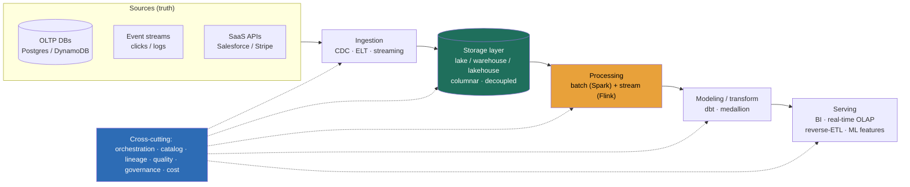

### Learning objectives
- State the **OLTP ↔ OLAP divide** as the foundational split: an operational store answers *"what is the state of this one entity right now?"*, an analytical platform answers *"what happened across all entities over time?"*, and the two access patterns force different storage, engines, and cost models.
- Describe a data platform at **architecture altitude**: a **continuously-rebuilt, append-mostly, scan-optimized, decoupled storage/compute projection of operational data** you reshape for questions, not a database of record.
- Reason in the platform's four governing quantities, **freshness, scan-cost, volume, and trust**, the way you reasoned in QPS and storage for OLTP, and know that pushing freshness costs money and complexity.
- Build the **analytical cost model**, *bytes scanned × $/TB* (or *compute-hours × cluster*), and know the lever is **how much data each query touches** (partition pruning, columnar projection), not "add a cache."
- Name the **failure modes** a data-platform designer engineers around, stale-presented-as-fresh, silently-wrong numbers, runaway cost, painful backfills, schema drift, before reaching for any tool.

### Intuition first
A data platform is the machinery between the **cash registers** and the **analyst's desk**. Every operational database in your company is a cash register: it records one transaction at a time, instantly and exactly, and answers *"what does this customer owe right now?"* It is tuned for a million tiny, precise, present-tense questions. The analyst upstairs has the opposite job: she wants *"revenue by region by month for the last two years,"* a question no single register can answer because it spans every register and all of time. So someone has to **continuously copy every receipt off every register, reshape the pile into something you can sweep through fast, and lay it on her desk fresh enough to be useful.** That copying-and-reshaping machine is the data platform.

That single image carries the design consequences. **You are working on a copy, not the original**, the platform never owns the source of truth, so it must be *rebuildable* from the registers when it drifts or breaks. **The analyst sweeps, she doesn't look up**, her queries scan millions of rows to return one number, which is the opposite of the cash register's point lookup and demands a completely different storage layout. **"Fresh enough" is a dial with a price tag**, getting last night's receipts onto her desk by morning is cheap; getting each receipt there within a second of the swipe is a different, far more expensive machine. And **the pile is only as trustworthy as the copying**, if a register quietly starts mislabeling receipts, her beautiful chart is confidently, precisely wrong, and nobody notices for a week. Get this picture right and the rest of the module is detail.

### Deep explanation

**The OLTP ↔ OLAP divide is the foundational fact, and everything else falls out of it.** the earlier modules of this course live in the **OLTP** world, *online transaction processing*: serve a user, read or write one entity (a user, an order, a message) with millisecond latency, keep it normalized and consistent, optimize for high-concurrency point access. A data platform lives in the **OLAP** world, *online analytical processing*: scan billions of rows, group and aggregate across time and dimensions, return a comparatively tiny result, optimize for throughput-over-volume rather than latency-per-row. The Director-altitude statement: *OLTP answers questions about one entity now; OLAP answers questions about all entities over time, and trying to serve one with the other's machinery is the most common and most expensive mistake on this whole topic.* You **reject** "just run the analytics query against the production Postgres" because a full-table aggregate scan competes with, and starves, the point-lookup traffic that pays the bills, and the row-oriented layout reads every column to use one. The divide is why analytical systems exist as a separate discipline.

**A data platform is a projection, not a database of record, and that word governs its architecture.** The operational stores are the source of truth; the platform holds a **derived, reshaped, denormalized copy** of their data, continuously rebuilt and optimized for questions. Four consequences a designer must internalize:

- **It is read-optimized for scans, not point lookups.** Analytical queries touch huge row counts and few columns, so the storage is **columnar** and the engines are built to stream gigabytes through aggregation, not to fetch one row fast.
- **It is append-mostly and time-partitioned.** Data arrives as a flow of events or periodic loads and is rarely updated in place; history is retained and sliced by time. The instinct "delete the old rows" is replaced by "partition by day and tier the cold partitions to cheap storage."
- **Storage and compute are decoupled.** The defining architectural shift of the modern era: data sits in cheap object storage (S3/GCS) and **elastic, ephemeral compute** is pointed at it on demand. You pay for scan and for the hours a cluster runs, not for an always-on box sized to peak. This is the opposite of the OLTP server you keep hot 24/7.
- **It must be rebuildable.** Because it is a copy, every table should be reproducible from retained raw inputs by re-running a transformation. That single property, *idempotent recomputation over retained raw*, is what makes backfills, bug fixes, and schema changes survivable.

**You design in four quantities, not in QPS alone: freshness, scan-cost, volume, and trust.** OLTP design reasons in requests/sec, latency, and storage. Analytical design adds and reweights:

- **Freshness** is how stale the served data is, the lag from an event happening to it being queryable. It is a *requirement you extract*, not a default, and every rung up the ladder (hours → minutes → seconds) costs more money and operational complexity (the batch-vs-stream trade).
- **Scan-cost** is the dominant cost axis: analytical cost scales with **bytes scanned**, not rows returned or requests served. A query that returns one number can cost dollars if it scans a terabyte.
- **Volume** grows effectively without bound, you retain history, so the design must assume TB→PB and lean on storage/compute separation, partitioning, and tiering rather than a bigger box.
- **Trust** is whether the number is *right*, the analytical analog of correctness. It is engineered with data-quality tests, contracts, and lineage, and its absence is the failure mode nobody sees until a decision is made on a wrong figure.

**The cost model is bytes-scanned, and the lever is how much data each query touches.** Two pricing shapes dominate, and you design the model, not this month's price (the same discipline you apply to LLMs):

> **On-demand / serverless** (e.g. BigQuery): cost ≈ **bytes scanned × \$/TB**. A 1 TB scan at ~\$5/TB is **~\$5 per query**; 10,000 such queries a day is **~\$50k/day** if you let every query read the whole table.
> **Provisioned compute** (e.g. Snowflake/Spark clusters): cost ≈ **cluster size × hours running**, plus **\$/TB-month** for storage, decoupled.

The headline a Director carries: **analytical cost is controlled by data layout, not by caching.** You cut the bill by making each query scan less, **partition pruning** (skip whole days/regions the query doesn't ask for), **columnar projection** (read only the columns selected), **clustering/sorting**, and **pre-aggregation**. A well-partitioned table turns that \$5 scan into a \$0.05 scan by reading 1% of the bytes. "It scales" is banned here exactly as everywhere else: you quantify the scan.

**Freshness is a lag budget you assemble from three hops.** Served freshness ≈ **ingestion lag + processing lag + serving lag**. Batch loads give hours; micro-batch gives minutes; true streaming gives seconds; a real-time OLAP store gives sub-second *queries* over seconds-fresh *data*. Each rung is a real engineering and cost step, so you set the freshness contract from the requirement, "finance reports tolerate a day, the ops dashboard needs a minute, the fraud signal needs a second", and pay only for the rung you need. This is the batch-vs-stream decision, now made per data product.

**The failure modes you design around (before any tool).** These are properties of the discipline, not edge cases:

- **Stale presented as fresh.** A pipeline silently falls hours behind and the dashboard still renders a confident, wrong-because-old number. Freshness must be *monitored and surfaced*, not assumed.
- **Silently wrong numbers (the analytical hallucination).** An upstream schema change nulls a column, a join fans out, a timezone is mishandled, and the metric is precise, beautifully charted, and wrong. This is why data quality, tests, and contracts are first-class, not polish.
- **Runaway cost.** One unpartitioned table, one accidental cross join, one `SELECT *` over a petabyte, and you get a surprise five-figure bill. Cost guards (partitioning, quotas, query limits) are a design concern.
- **Backfill and reprocessing pain.** A logic bug means recomputing months of history; if the platform isn't built to replay from retained raw idempotently, this is an outage-grade event instead of a re-run.
- **Schema and data drift.** Operational teams change a field and break every downstream consumer who didn't know. Contracts and lineage turn a silent break into a caught one.

Go deeper, why the same query is fast in an OLAP store and slow in Postgres (IC depth, optional)

- **Row vs column on disk.** A row store (Postgres, MySQL) lays out all of row 1's columns, then all of row 2's. `SELECT SUM(amount) FROM orders` must read every row's *every* column off disk just to touch `amount`. A columnar store stores all `amount` values contiguously, so the same query reads ~1/N of the bytes (N = column count) and the values compress far better because they're homogeneous.
- **Vectorized execution.** OLAP engines process columns in batches through SIMD-friendly loops rather than a tuple-at-a-time iterator, often 10–100× the per-core throughput on aggregation.
- **Pruning and zone maps.** Columnar files (Parquet/ORC) carry per-block min/max statistics, so a `WHERE day = '2026-06-01'` skips blocks whose range can't match, reading only relevant data without an index. Combined with partitioning, this is how a petabyte table answers a query by scanning gigabytes.
- **Why not just index Postgres?** Indexes accelerate selective point/range lookups; an analytical aggregate is *unselective* (it touches most rows), so the planner ignores the index and table-scans anyway, now competing with your OLTP traffic for the same buffer pool and IOPS. The fix isn't a better index; it's a different storage paradigm.

### Diagram: the modern data platform reference architecture

### Worked example: serving "daily active users by region," end to end
A product team wants a dashboard of **DAU by region**, plus the same number in the monthly board deck. One metric, and the platform's whole shape shows up in serving it.

- **Path.** App click events land in a stream (Kafka), operational user/region data lives in Postgres. **Ingestion** streams the events into the **lake** and **CDC-replicates** the Postgres `users` table alongside it. A **batch job** each hour joins events to users, rolls up distinct users per region per day, and writes a small **aggregate table**; **dbt** models it into a clean `dau_by_region` mart. BI reads the mart.
- **Freshness.** The board deck tolerates day-old data, so the hourly batch is plenty, *rejected: a streaming pipeline*, which would buy minute-freshness nobody asked for at multiples of the cost. If the team later needs a live ops view, that's a *second*, real-time path, not a rebuild of this one.
- **Scan-cost.** The raw events are ~2 TB/day. A naive dashboard query scanning raw events at \$5/TB is ~\$10 *per refresh*; partitioning by day and pre-aggregating to a daily rollup means the dashboard scans **megabytes**, well under a cent. The cost win came from **layout and pre-aggregation**, not a cache, which is the lesson.
- **Trust.** A freshness test ("the mart has today's partition by 7am") and a volume test ("row count within ±20% of yesterday") catch the silent breaks; lineage tells the analyst the number traces to those events and that table when finance asks "where does this come from?"

The number a Director brings out of this isn't "we built a pipeline"; it's *"day-fresh, traces to source, costs cents, and here's the second path if you need it live."*

### Trade-offs table: the first analytical decision, where does this query run?
| Decision | OLTP store (Postgres/Dynamo) | Cloud warehouse (Snowflake/BigQuery) | Lake + query engine (S3 + Spark/Trino) | Real-time OLAP (Druid/Pinot) |
|---|---|---|---|---|
| **Best at** | point reads/writes, ms latency | governed SQL analytics, scans | cheap PB-scale, open formats, ML | sub-second aggregates on fresh data |
| **Freshness** | real-time (it *is* the source) | minutes–hours (loads) | hours (batch) | seconds |
| **Cost shape** | always-on server | \$/TB scanned or cluster-hours | cheapest storage; compute on demand | always-on, memory-heavy |
| **Use when…** | serving the app | the default analytical store | huge volume, open/ML, cost-sensitive | live dashboards, user-facing analytics |

The Director move is matching the **query's access pattern and freshness need** to the store, and never serving analytics from the OLTP source of truth.

### What interviewers probe here
- **"They ask for analytics on your operational data, what's your first move?"**, *Strong signal:* separate OLTP from OLAP immediately, get the data into an analytical store via ingestion/CDC, and never run scan-heavy aggregates against the production DB (it starves point traffic and reads row-oriented data the wrong way). *Red flag:* "add a read replica and query it", which just moves the row-oriented full-scan problem one box over.
- **"What does this cost, and what's your lever?"**, *Strong:* cost ≈ bytes scanned × \$/TB (or cluster-hours); the lever is partition pruning + columnar projection + pre-aggregation so each query touches less data; quantify a scan. *Red flag:* "we'll cache it", with no notion that the bill is set by scan volume and data layout.
- **"How fresh does it need to be?"**, *Strong:* treats freshness as an extracted requirement with a price, picks the cheapest rung that meets it (batch vs micro-batch vs stream), and is willing to run two paths for two needs. *Red flag:* defaults to "real-time" with no requirement and no awareness of the operational tax.
- **"The dashboard number is wrong. How would you even know?"**, *Strong:* data-quality tests (freshness/volume/schema), contracts at the source boundary, and lineage to trace it, trust is engineered. *Red flag:* treats correctness as given and has no detection story, the silent-wrong-number trap.

The through-line at Director altitude: reason in **freshness, scan-cost, volume, and trust**; set those contracts per data product; and delegate the engine bake-off with a stated prior ("data platform benchmarks Snowflake vs a Trino-on-S3 lakehouse on our scan and concurrency profile; my prior is the lakehouse for our volume and open-format needs").

### Common mistakes / misconceptions
- **Running analytics on the OLTP database.** A full-scan aggregate starves point traffic and reads a row-oriented layout column-by-column; the fix is a separate analytical store, not a replica.
- **Reasoning in QPS instead of bytes scanned and freshness.** The analytical cost and latency are set by scan volume and the freshness rung, not by request rate; a request-based estimate misleads.
- **Treating a bigger context… bigger box as the answer to volume.** Volume grows unbounded; the answer is decoupled storage/compute, partitioning, and tiering, not vertical scaling.
- **Assuming the numbers are right.** Without freshness/volume/schema tests and lineage, a silent upstream change yields a confident wrong metric, the analytical hallucination.
- **Defaulting to streaming.** Most analytics tolerate hours of lag; streaming's windowing/state/exactly-once cost is only worth it where a real requirement demands seconds.

### Practice questions

**Q1.** Stakeholders ask you to "just add a dashboard" on top of the production orders database. Walk through your response.
> *Model:* I'd push back on querying production directly: an analytical dashboard runs unselective aggregate scans (`SUM`, `GROUP BY` over all orders), which on a row-oriented OLTP store reads every column of every row and competes with the point-lookup traffic that serves customers, risking latency regressions on the paying path. Instead I'd land the data in an analytical store, CDC-replicate `orders` into a columnar warehouse or lake, pre-aggregate to the dashboard's grain, and serve from there. Freshness: if a day old is fine, an hourly batch; if they need live, a separate real-time path, not this one. The cost is set by bytes scanned, so I partition by day and project only needed columns. Net: the dashboard is fast and cheap, and production is untouched.

**Q2.** Estimate the monthly cost of a dashboard that scans a 3 TB events table on every refresh, refreshed 200×/day, on serverless \$5/TB pricing. Then name the cheapest fix.
> *Model:* Per refresh: 3 TB × \$5/TB = **\$15**. Per day: 200 × \$15 = **\$3,000**. Per month: ~**\$90,000**, for one dashboard, the runaway-cost failure mode. The cheapest fix is **not** a bigger cluster or a cache; it's cutting bytes scanned: **pre-aggregate** the events into a daily rollup table the dashboard reads (megabytes, not terabytes) and **partition by day** so even ad-hoc queries prune. That turns ~\$90k/mo into tens of dollars. Layout and pre-aggregation are the lever; this is the core analytical cost discipline.

**Q3.** A VP says "the revenue dashboard and the finance report disagree by 3%, which is right?" What's actually going on and how is it prevented?
> *Model:* Almost certainly two paths computing "revenue" with slightly different logic, definitions (gross vs net, timezone of "day," late-arriving refunds), or freshness (the dashboard is a fast approximate stream; finance is the settled batch), the same speed-vs-truth split as the billing-batch problem. Neither is "wrong"; they answer subtly different questions. Prevention: a **single governed definition** of the metric (one dbt model both consume), explicit handling of late events and timezone, and **lineage** so each number's source and logic are inspectable. The Director point: this is a *governance and modeling* problem, not a query bug, and it's why a semantic layer and metric ownership exist.

**Q4.** Why is "decoupled storage and compute" the defining feature of modern data platforms, and what does it let you do that an old on-prem Hadoop cluster couldn't?
> *Model:* In the old model, storage and compute were bolted together on the same nodes (HDFS + MapReduce), so to store more you bought compute you didn't need, and to compute more you bought storage you didn't need, and the cluster ran 24/7 sized to peak. Decoupling puts data in cheap object storage (S3, pennies/GB-month) and points **elastic, ephemeral compute** at it: you scale them independently, run ten isolated warehouses on one copy of the data, spin compute to zero when idle, and pay per scan or per cluster-hour. The consequences a Director cares about: cost tracks usage not peak provisioning, teams don't contend for one cluster, and storage growth is nearly free. It's the same "pay for usage, not provisioned capacity" shift that makes serverless attractive elsewhere.

### Key takeaways
- **OLTP vs OLAP is the foundational divide:** operational stores answer "this entity now" with point access; a data platform answers "all entities over time" with scans, and serving one from the other is the classic, costly mistake. Get the data into a separate analytical store.
- **A data platform is a projection, not a database of record:** a continuously-rebuilt, append-mostly, scan-optimized, **decoupled storage/compute** copy of operational truth, and it must be **rebuildable** from retained raw (idempotent recompute) to survive bugs, backfills, and schema changes.
- **Design in freshness, scan-cost, volume, and trust**, not QPS alone. Freshness is a priced dial (pick the cheapest rung that meets the requirement); volume grows unbounded (separate storage/compute, partition, tier).
- **Analytical cost ≈ bytes scanned × \$/TB; the lever is data layout**, partition pruning, columnar projection, clustering, pre-aggregation, **not** caching. Always quantify the scan.
- **Engineer trust and surface freshness:** the signature failure is a precise, confident, *wrong-or-stale* number, so data-quality tests, contracts, and lineage are first-class, and runaway cost is guarded by design.

> **Spaced-repetition recap:** A data platform is the machine between the **cash registers** (OLTP, "this entity now," point access, row store) and the **analyst's desk** (OLAP, "all entities over time," scans, column store). It's a **projection, not a source of truth**, append-mostly, time-partitioned, **decoupled storage/compute**, and **rebuildable** from retained raw. Design in **freshness** (a priced ladder, pick the rung the requirement needs), **scan-cost** (≈ bytes scanned × \$/TB; lever is layout/pruning/pre-aggregation, not caching), **volume** (unbounded → separate storage/compute, partition, tier), and **trust** (tests + contracts + lineage; the failure is the confident wrong number). Never run analytics on the OLTP store.

---

*End of Lesson 7.1. This is the mental model the whole Data Platforms track rests on: an analytical platform is a continuously-rebuilt, scan-optimized projection of operational truth, designed in freshness, scan-cost, volume, and trust.*
