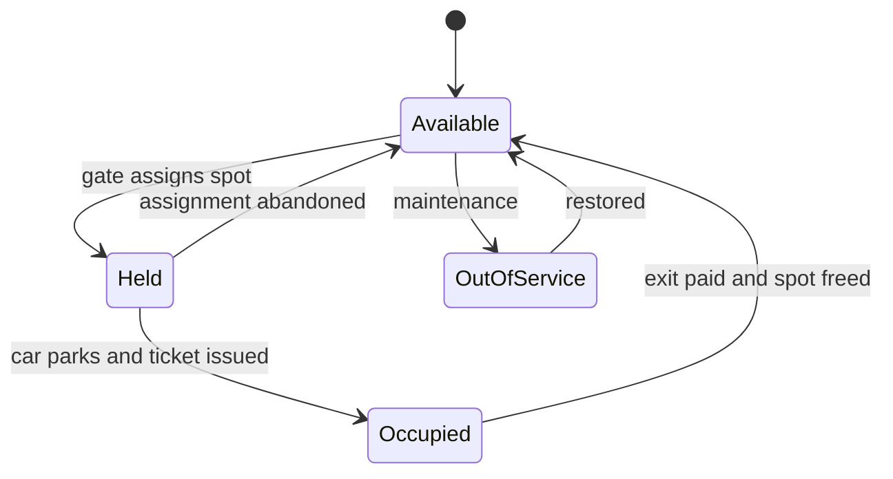

> **This is the most-asked low-level design problem in the industry, Amazon, Google, Microsoft, Uber all use it, and every OOD course opens with it, precisely because it is small.** A junior candidate fills the whiteboard with an inheritance tree and four design patterns before asking a single question. A Director answer locks scope to 2-3 clean entities, builds the boring v1 the stated requirements paid for, **volunteers the one real correctness problem (two cars racing for the last spot) unprompted**, and shows where the design would flex, without building that flexibility on spec. The interviewer is not scoring UML vocabulary. They are scoring **restraint**, a question about how you'll run an org, asked through a parking lot.

### Learning objectives
- Adapt the **RESHADED** spine to an LLD problem, say out loud which letters shrink (E becomes capacity math, not QPS) and which transform (A = class interfaces, H = class/state diagram, D = entity model).
- Practice the Director meta-skill this problem exists to test: **lock scope first**, name what you're cutting, and resist anticipatory abstraction (gold-plating) until a requirement demands it.
- Apply the **Strategy pattern exactly once, where a requirement varies** (pricing), and defend why nothing else in v1 deserves a pattern.
- Handle the **multi-threaded variant**: make spot assignment atomic so two cars racing for the last spot cannot both win, the same `AVAILABLE → HELD → OCCUPIED` shape as Ticketmaster's seat claim (Lesson 5.13), at micro scale.
- Evolve the design under new constraints (multi-floor, dynamic pricing, gate hardware, a city-wide chain) and name the point where LLD turns back into system design.

### Intuition first
Picture the lot attendant who ran parking before software: a clipboard with one row per spot, a pad of numbered tickets, and a price card taped to the booth window. Park a car → cross off a spot, tear off a ticket, write the time. Car leaves → look up the ticket, check the price card, collect, un-cross the spot. That clipboard **is** the design: spots, tickets, a pricing rule. Three things.

Everything a weak answer adds, `AbstractVehicleFactory`, a `Car`/`Truck`/`Motorcycle` hierarchy with no differing behavior, an observer bus for a lot with no observers, is something the attendant never needed. The question is deliberately undersized so the interviewer can watch what you do with the empty space. **Filling it is the failure.** The strong move is to keep the clipboard, then point at the one place it genuinely breaks: two entry gates, one spot left, two attendants crossing off the same line at the same moment. *That*, atomic assignment under contention, is the real engineering here, and you raise it before they do.

---

## R: Requirements

> Identical to HLD: scope is the first signal. In LLD the cut list matters even more, because every uncut requirement becomes a class, and classes are where gold-plating hides.

**Clarifying questions I'd ask (with assumed answers):**
- *One facility or a chain?* → **One lot, single facility.** (A chain changes S and E entirely, see Design evolution.)
- *Vehicle types?* → **Motorcycle, car, truck**, mapping to spot sizes (small/regular/large); a car may take regular or large, a truck only large.
- *Floors?* → Assume **4 floors**, but model a flat pool of spots first; add `Floor` only if a requirement (per-floor displays, nearest-to-elevator) demands it.
- *Payment?* → **Pay at exit**, fee = f(duration, vehicle type). Hourly now; "pricing may change", noted, that phrase is what will justify a Strategy later.
- *Multiple entry/exit gates?* → **Yes, 2 entry + 2 exit.** The question that smuggles in the concurrency requirement, ask it yourself.

**Functional requirements:**
1. **Park:** assign a free, size-compatible spot at entry; issue a ticket.
2. **Unpark:** accept the ticket at exit, compute the fee, free the spot.
3. **Availability:** report free spots per spot type (for the entry display).

**Explicitly CUT (say the list out loud):** reservations, valet, EV charging, monthly passes, loyalty, license-plate recognition, a mobile app, multi-lot administration. Each cut gets one sentence, *"Reservations turn spot assignment from a queue-pop into a time-indexed search, different problem; out of v1"*, so the interviewer hears you cut **knowingly**, not lazily.

**Non-functional requirements:**
- **Correctness under concurrency:** with multiple gates, the same spot must never be issued twice, even for the last spot. This is the invariant of the problem.
- **Simplicity / evolvability:** smallest model that satisfies the above; documented seams where known-likely changes (pricing, floors) would attach.
- **Auditability of money:** every ticket and payment durable, fee disputes are the operational reality of parking.

---

## E: Estimation

> Here is the first loud adaptation: **E nearly drops.** There is no QPS story, there is capacity sizing and an arrival rate, and the honest conclusion is that the numbers are tiny. Saying "the numbers are tiny, so the design is driven by correctness and maintainability, not throughput" *is* the Director estimation answer.

- **Capacity:** 4 floors × 250 spots = **1,000 spots** (say 100 small / 700 regular / 200 large).
- **Arrival rate:** 2 entry gates × ~1 car per 15 s at rush ≈ **0.13 cars/s**, about *four orders of magnitude* below anything we'd call a throughput problem.
- **State size:** 1,000 spots × ~100 B + ~1,000 active tickets × ~200 B ≈ **0.3 MB**. The whole live state fits in L2 cache, never mind memory.
- **Persistence volume:** ~2,000 tickets/day × 365 × ~300 B ≈ **0.2 GB/year**. A single small relational instance yawns at this.

**What estimation decided:** nothing scales here, so build nothing that scales, no sharding, no cache tier, no queue. The contention that matters is not rate but **occupancy**: at 99% full, every arriving car at every gate competes for the same handful of spots. Concurrency correctness is driven by *fullness*, not traffic, the bridge to the Evaluation step.

---

## S: Storage

> Adapted: "what persists" rather than "which distributed store." The LLD trap is dragging Module-3 machinery into a 0.3 MB problem.

- **Live spot state: in-memory, inside the process.** It's 0.3 MB, mutated under the assignment claim, rebuildable. *Rejected: Redis or a DB as live truth*, a network hop and a failure mode on every gate operation, buying nothing at 0.13 arrivals/s.
- **Tickets and payments: one small Postgres/MySQL instance.** Money needs durability and audit (NFR 3); a ticket row written at entry, finalized at exit, is the whole schema. *Rejected: in-memory only*, a restart that loses open tickets means free parking and fee disputes; *rejected: an event-sourced ledger*, gold-plating for 2,000 rows/day.
- **Restart story (volunteer it):** on boot, rebuild spot occupancy from open tickets, one scan, sub-second at this size. This is why tickets, not spots, are the durable record; the spot map is derivable.

---

## H: High-level design

> Adapted: the "box diagram" becomes a **class-collaboration sketch plus the spot's state machine**, in LLD, the state diagram is the architecture.

**The entities, locked to three, plus one value object:**
- **`ParkingLot`**, the facade and sole mutator of spot state: owns the free-spot pools, assigns and releases spots, issues tickets.
- **`ParkingSpot`**, id, size, status (lifecycle below).
- **`Ticket`**, spot id, vehicle plate + type, entry time; finalized with exit time and fee.
- **`Vehicle`**, a value object: plate + `VehicleType` enum. *Deliberately not a class hierarchy*, `Car`/`Truck`/`Motorcycle` subclasses would differ by zero methods; an enum mapping to allowed spot sizes carries all the behavior that exists. Inheritance with no behavioral variation is the canonical gold-plate.



Two things to narrate on this diagram. First, **`Held` exists for the same reason Ticketmaster's `HELD` does** (Lesson 5.13): assignment at the gate and the car physically occupying the spot are separate moments, and the spot must belong to exactly one car for that window, with a timeout so an abandoned assignment self-heals. Second, **`OutOfService`** is the cheap, real-world state juniors forget; one enum value now, or a display-board outage later.

---

## A: API design

> Adapted: A = **class interfaces**, not REST endpoints. One short sketch, and the discipline is the same as HLD APIs: only the calls the requirements demand.

```text
interface ParkingLot
    Ticket   park(Vehicle v)                 // assigns spot atomically
                                             // throws LotFullForType
    Receipt  unpark(TicketId id)             // fee = pricing.calculate(ticket)
                                             // frees the spot
    int      available(SpotType t)           // for the entry display

interface PricingStrategy
    Money    calculate(Ticket t)             // duration + vehicle type in,
                                             // money out

// v1 ships exactly one implementation: HourlyPricing.
```

**Design notes (each with its rejected alternative):**
- **`PricingStrategy` is the only abstraction in v1, because R surfaced a requirement that varies** ("pricing may change"; weekend rates, lost-ticket flat fee are known-likely). The seam costs one interface. *Rejected: hardcoding the fee inside `unpark`*, the one change we're told is coming would then edit core flow logic.
- **No `SpotAssignmentStrategy`.** No requirement says assignment policy varies, "first free compatible spot" is the spec. *Rejected: a pluggable assigner interface*, that's the same Strategy pattern, but applied to a requirement nobody stated. **Same pattern, opposite verdict, and the difference is the requirement.** That sentence is the lesson.
- **`park` throws on full rather than returning a nullable spot**, a full lot is a normal business outcome the gate must handle explicitly, not a null to forget to check.
- **`unpark` takes the ticket, not the spot**, the ticket is the durable record and the unit of payment audit; the spot is derivable from it.

<details>
<summary>Go deeper, fuller class listing with the concurrent free-list (IC depth, optional)</summary>

```java
enum SpotType { SMALL, REGULAR, LARGE }
enum VehicleType {
    MOTORCYCLE(EnumSet.of(SMALL, REGULAR, LARGE)),
    CAR(EnumSet.of(REGULAR, LARGE)),
    TRUCK(EnumSet.of(LARGE));
    final EnumSet<SpotType> fits;
}

final class ParkingSpot {
    final String id; final SpotType type;
    final AtomicReference<SpotStatus> status =
        new AtomicReference<>(AVAILABLE);     // CAS target
}

final class ParkingLotImpl implements ParkingLot {
    // one lock-free pool per spot type; poll() is atomic
    private final Map<SpotType, ConcurrentLinkedQueue<ParkingSpot>> free;
    private final PricingStrategy pricing;
    private final TicketStore tickets;        // backed by Postgres

    public Ticket park(Vehicle v) {
        for (SpotType t : v.type.fits) {      // smallest-fit first
            ParkingSpot s = free.get(t).poll();   // atomic claim
            if (s != null) {
                s.status.set(HELD);
                Ticket tk = tickets.open(v, s, now());
                s.status.set(OCCUPIED);
                return tk;
            }
        }
        throw new LotFullForType(v.type);
    }

    public Receipt unpark(TicketId id) {
        Ticket t = tickets.close(id, now());
        Money fee = pricing.calculate(t);
        ParkingSpot s = t.spot();
        s.status.set(AVAILABLE);
        free.get(s.type).offer(s);            // return to pool
        return new Receipt(t, fee);
    }
}
```

The correctness hinges on one line: `poll()` on `ConcurrentLinkedQueue` is an atomic dequeue (Michael-Scott CAS loop internally), two gate threads polling the last element get one spot and one `null`; no spot is ever handed out twice. The `Held` window between `poll()` and ticket persistence is bounded by a timeout sweep that `offer`s abandoned spots back. Note what's *absent*: no `synchronized` on the happy path, no global lock, no per-spot mutex map.

</details>

---

## D: Data model

> Adapted: the **entity model**, fields, relationships, and which record is authoritative.

- **`spots`**, `spot_id`, `floor`, `type`, `status`. In-memory live; persisted only as static layout (status rebuilt from open tickets on restart).
- **`tickets`**, `ticket_id`, `plate`, `vehicle_type`, `spot_id`, `entry_time`, `exit_time?`, `fee?`, `paid?`. **The authoritative, durable record.** Open ticket ⇒ spot occupied; that single derivation rule is the whole consistency model.
- **Relationships:** Ticket → Spot is many-to-one over time, one-to-one while open. A partial unique index on `spot_id WHERE exit_time IS NULL` makes "one open ticket per spot" database-enforced, the persistence-layer twin of the in-memory atomic claim. Say it out loud: **the invariant is enforced twice, in memory for speed and in the store for truth**, defense in depth for the only correctness rule the system has.

---

## E: Evaluation

> Adapted, and this is where the Director answer is won: stress your own design **unprompted**. The bottleneck here isn't load, it's a race. Volunteering it is the single strongest signal in the interview.

**The race, stated before they ask:** *"Two cars at two entry gates, one regular spot left. Both gate threads read 'one available,' both assign it, two tickets, one spot, an argument in lane 3. Two gates make this physically concurrent, so assignment must be atomic."*

**Three viable fixes, name all three, pick one, defend it:**

1. **Coarse lock:** one mutex around `park`/`unpark`. Trivially correct, fully serialized. *Quantify before sneering:* at 0.13 arrivals/s with a ~10 µs critical section, contention is ~0.0001%, a coarse lock is **not wrong here**, and saying so is itself a restraint signal.
2. **Per-spot CAS:** `status.compareAndSet(AVAILABLE, HELD)`; loser retries the next spot. Maximal concurrency, but near-full, losers scan many spots retrying: O(n) under exactly the contention you built it for.
3. **Concurrent free-list per spot type**, a lock-free queue of available spots; atomic `poll()` to claim, `offer()` to release. The claim **is** the dequeue: one winner by construction, losers get `null` in O(1) and fall through to the next size or "full."

**Decision: the concurrent free-list (option 3).** It makes the invariant structural, a spot is claimable *because* it's in the pool, rather than guarded. *Rejected: the coarse lock*, not on throughput (the math says it survives) but because the free-list is the same line count with no shared bottleneck to reason about; *rejected: per-spot CAS*, because it degrades precisely at high occupancy, the only contention regime this system has. The `Held` window between claim and ticket persistence gets a timeout sweep, so a gate crash mid-assignment self-heals, lazy reclaim, exactly as Lesson 5.13's holds.

**Re-check the other NFRs:** money durable (tickets in Postgres, fee computed at close); restart rebuilds spot state from open tickets; the DB partial index backstops the in-memory claim. The design holds.

<details>
<summary>Go deeper, why the lock-free queue wins at high occupancy (IC depth, optional)</summary>

The failure mode of per-spot CAS is the **retry storm at 99% full**: a gate thread scans the spot array CAS-ing each `AVAILABLE` it sees; with 5 free spots in 1,000 and 4 competing threads, most CAS attempts hit spots another thread just took, and each loser rescans. Expected work per park approaches O(n) exactly when the lot is nearly full, the regime the system lives in at rush hour.

The `ConcurrentLinkedQueue` (Michael-Scott algorithm) inverts this: the head pointer is the single CAS target, and a failed CAS means another thread *succeeded*, the loser's very next `poll()` attempt sees the new head. Claims are O(1) amortized regardless of occupancy, and "empty queue" is an immediate, definitive "no spots of this type" rather than the end of a scan. The structural point generalizes: **when contenders should fail fast and fall back (next size up, "lot full"), put the contended resource in a pool with an atomic take, rather than guarding each resource and making contenders hunt.** Compare Lesson 5.13's seat CAS, where contenders *want* a specific seat and per-row CAS is right, the access pattern, not fashion, picks the primitive.

</details>

---

## D: Design evolution

> The gold-plating test, inverted: everything you correctly refused to build in v1, you now show you knew how to build. Restraint is only credible if the evolution is crisp.

- **Multi-floor with per-floor displays and nearest-to-elevator assignment:** *now* `Floor` earns existence (it owns per-floor pools and a display), and *now* assignment policy varies by requirement, so `SpotAssignmentStrategy` appears, justified by the same rule that excluded it from v1. The seam was foreseen; the abstraction waited for its requirement.
- **Pricing changes (weekend rates, lost ticket, EV surcharge):** new `PricingStrategy` implementations behind the existing interface, **zero core changes**, the payoff of the one abstraction v1 did buy.
- **Gate/sensor hardware:** wrap it behind thin ports (`GateController`, `SpotSensor`) so vendor SDKs never leak into domain logic. *Delegate it:* "the embedded team owns gate firmware behind those two interfaces; my prior is dumb hardware + smart server, sensors report, the server decides, because pushing decisions into firmware makes every pricing change a fleet update."
- **From one lot to a 50-lot city chain:** the moment **LLD turns back into HLD**, say so explicitly. S grows back (a multi-tenant store, lots as partitions), E grows back (consumer-app occupancy polling is a read-QPS story), availability gets a cache tier, cross-lot search is a new product. The free-list remains correct *per lot*, concurrency was always per-facility, but the system around it becomes a Module-5-shaped problem.

**Cost/ops dimension (own it even in LLD):** v1 is one service instance + one small Postgres, **tens of dollars a month; on-call is "is the process up."** The gold-plated version costs the same to *run* but more to *change*, carried forever in maintenance, onboarding, and test surface, and change-cost is the budget a Director actually protects.

---

## Trade-offs table: the pivotal decisions

| Decision | Option A | Option B | Option C | Use when... |
|---|---|---|---|---|
| **Last-spot concurrency** | **Coarse lock on park/unpark** | **Per-spot CAS with scan-retry** | **Concurrent free-list per type, atomic poll** | **A** is defensible at gate-scale arrival rates (quantify it!). **B** when contenders want one *specific* resource (5.13 seats). **C** (our choice) when any resource of a type will do and losers should fail fast in O(1). |
| **Where patterns go** | **No abstractions, hardcode all policy** | **Strategy only where a requirement varies, pricing** | **Strategy/Factory/Observer everywhere "for flexibility"** | **A** for a true throwaway. **B** (our choice), each abstraction names the requirement that bought it. **C** is the over-engineering failure this interview exists to catch. |
| **Vehicle modeling** | **Enum + size-compatibility map** | **Class hierarchy Car/Truck/Motorcycle** | **Full type registry with metadata config** | **A** (our choice) while types differ only by data. **B** only when behavior genuinely diverges per type. **C** only for a platform where operators define vehicle types at runtime. |

---

## What interviewers probe here (Director altitude)

- **"Walk me through your classes."**, *Strong:* three entities + one value object, each justified by a requirement; cuts stated out loud. *Red flag:* ten classes in five minutes, `AbstractSpotFactory` before any clarifying question.
- **"Two cars, one spot left, two gates, what happens?"**, *Strong:* already covered it unprompted; names the atomic claim, the `Held` window, timeout reclaim, the DB partial index backstop. *Red flag:* "I'd add synchronized everywhere," or surprise that concurrency exists in an OOD question.
- **"Why is pricing an interface but spot assignment isn't?"**, *Strong:* "Pricing variation is a stated requirement; assignment variation isn't. Same pattern, opposite verdict, the requirement decides, not the pattern catalog." *Red flag:* can't articulate why one abstraction lives and the other doesn't; "Strategy is best practice."
- **"Would a global lock be wrong?"**, *Strong:* quantifies, ~0.13 arrivals/s vs a microsecond critical section, contention ~zero, "not wrong, but the free-list is no more code and has no shared bottleneck; I'd take it." *Red flag:* reflexive "locks don't scale" with no numbers (the unquantified-scaling tell, in miniature).
- **"What would you delegate?"**, *Strong:* hardware integration behind ports with a stated prior (dumb hardware, smart server); payments to the vendor; keeps the invariant and the seams. *Red flag:* wants to personally design the gate firmware protocol.

---

## Common mistakes

- **Class explosion before scope lock**, modeling valet, EV charging, and reservations nobody asked for. Scope-cutting is the first scored behavior; skipping it loses the interview in minute two.
- **Pattern-first design**, Singleton/Factory/Observer named before requirements are. Every abstraction must point at the requirement that bought it; pricing earns Strategy here, nothing else does.
- **A `Vehicle` inheritance tree with no behavioral difference**, subclasses that differ only by data are an enum wearing a costume.
- **Ignoring concurrency until prompted**, two gates make the race physical; the last-spot double-assignment is the problem's one real invariant, and volunteering it is the strongest signal available.
- **No durable ticket record**, in-memory-only tickets mean a restart loses open sessions and every fee becomes a dispute; money always gets a durable, auditable row.

---

## Interviewer follow-up questions (with model answers)

**Q1. Two cars hit two entry gates simultaneously; one compatible spot remains. Walk me through exactly why only one gets it.**
> *Model:* Spot assignment is an atomic dequeue from a lock-free free-list per spot type, both gate threads call `poll()`; the queue's internal CAS guarantees one gets the spot and the other gets `null`, falling through to the next compatible size, then "lot full." There is no check-then-act window because the claim *is* the removal. The claimed spot sits `Held` until the ticket persists, with timeout reclaim if the gate crashes mid-assignment, the `AVAILABLE → HELD → OCCUPIED` shape of a Ticketmaster seat (Lesson 5.13), shrunk to one process. Defense in depth: a partial unique index on open tickets per spot makes the database reject a double-issue even if the in-memory layer ever regressed.

**Q2. Product adds weekend rates and a lost-ticket flat fee. How much of your design changes?**
> *Model:* Two new `PricingStrategy` implementations and a selector, zero changes to `ParkingLot`, spots, or tickets. That's deliberate: R surfaced "pricing may change" as the one axis of stated variability, so v1 spent its single abstraction there. The contrast: had you asked me to change *assignment* policy, I'd be editing core code, because no requirement justified that seam, and I'd rather pay one small refactor later than carry speculative interfaces on every axis forever. Restraint plus one cheap refactor beats ten abstractions, nine never used.

**Q3. We're now a 50-lot city-wide operator with a consumer app showing live availability. What breaks?**
> *Model:* The moment the problem crosses the facility boundary it stops being LLD, and I'd say that out loud before redesigning. Per-lot concurrency is unchanged (the free-list was always per-facility). The letters that nearly dropped grow back: S becomes a multi-tenant store partitioned by lot; E becomes a read-QPS estimate, 50 lots, ~200K app users polling, ~100-500 reads/s, so availability gets a cache/push tier fed by occupancy events, eventual by design since a 5-second-stale count is harmless. Money and tickets stay strongly consistent per lot; cross-lot search is a new product surface I'd scope separately. The Director point: know which layer you're in, and rerun the spine when you change layers.

**Q4. You used one design pattern. Defend not using more.**
> *Model:* Patterns are amortized over requirement variation, and this problem states exactly one varying axis: pricing. Strategy there costs one interface and pays on the first rate change. A `SpotAssignmentStrategy`, vehicle factories, or an observer bus would each add a seam with no requirement behind it, pure carrying cost in tests, onboarding, and indirection. My rule, and what I hold design reviews to: **every abstraction names the requirement that bought it.** When floors and display boards arrive, assignment policy becomes a stated requirement and the strategy appears then, foreseen is not the same as built.

---

### Key takeaways
- **Parking Lot is a restraint test wearing an OOD costume.** Lock scope to ~3 entities (Lot, Spot, Ticket + a Vehicle value object), state the cut list, and let the interviewer watch you *not* build the airport.
- **Narrating the RESHADED adaptation is itself teaching:** E collapses to capacity math (1,000 spots, 0.13 arrivals/s, 0.3 MB state, nothing scales, so build nothing that scales); A = class interfaces; H = the spot state machine; D = the entity model with the ticket as durable truth.
- **One pattern, one requirement:** pricing varies by stated requirement → `PricingStrategy`; assignment doesn't → no strategy. Same pattern, opposite verdicts; the requirement decides.
- **Volunteer the last-spot race.** Atomic claim via a concurrent free-list (`poll()` is the claim), a `Held` window with timeout reclaim, a DB partial index as backstop, 5.13's seat machine at micro scale. Quantify why even a coarse lock survives before rejecting it.
- **Evolution proves the restraint was judgment, not ignorance:** floors bring `Floor` + assignment strategy *with* their requirements; hardware hides behind ports (delegate firmware; prior: dumb hardware, smart server); 50 lots turns the problem back into system design, say so and rerun the spine.

> **Spaced-repetition recap:** Parking Lot = the #1 LLD curveball, scored on **restraint**. Three entities (Lot/Spot/Ticket), enum not vehicle hierarchy, cuts stated aloud. E drops to capacity math, nothing scales. One Strategy (pricing, requirement varies), no others. Volunteer the race: two gates, last spot → atomic free-list claim, `Held` + timeout, partial-index backstop. Evolution: floors → `Floor` + assignment strategy *then*; chain of lots → it's system design again.

---

*End of Lesson 7.1. The parking lot inverts Module 5's instinct: there the danger was designing too small for the load; here, too big for the requirement. The atomic claim carries over from Ticketmaster (5.13) at process scale, knowing which RESHADED letters grow and which collapse is the transferable skill.*
