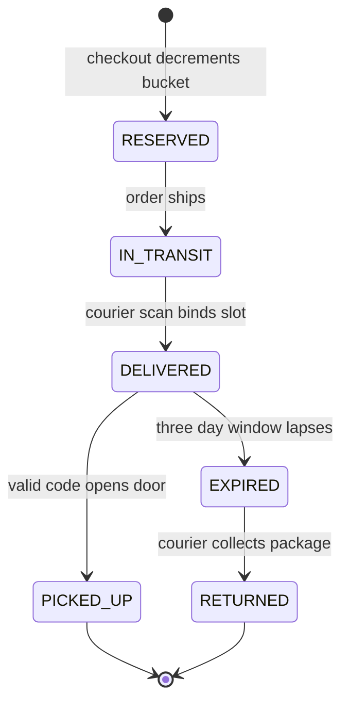

> **This problem is asked precisely because you cannot have rehearsed it.** Parking Lot and LRU Cache have canned solutions on every prep platform; Amazon Locker does not, which is why it sits at #2 in recommended practice order and in heavy rotation at Amazon-flavored loops. With no template to recall, it isolates the skills templates hide: **requirement scoping under ambiguity** and **entity judgment**. A junior answer models cabinets and doors and drowns; a Director answer scopes to the allocation decision and the expiry-and-reclaim lifecycle, argues smallest-fit vs first-fit vs assign-on-arrival **with capacity arithmetic**, and notices the trap no memorized problem contains: **expiry here does not free the resource, a human has to come take the package away.** Treat this lesson as a drill, not a read.

::tip[How to drill this, the cold-open protocol]
**Do not read past the Intuition section until you have attempted this solo.** Set a 35-minute timer, blank document, and run the RESHADED spine from memory on "Design Amazon Locker": scope it, put rough numbers on capacity, name the entities and their state machines, defend an allocation strategy against one alternative, and find at least one race or lifecycle leak unprompted. When the timer fires, stop mid-sentence, that is what the real cut-off feels like, then read on and grade yourself section by section. The gap you find *is* the prep. (Want a 10-minute low-stakes warm-up first? The Connect Four rep in Lesson 7.9 is the stretching exercise; this is the loaded set.)
::

### Learning objectives

- Run RESHADED **cold** on a problem with no circulating solution, and experience why **R dominates**: the scoping decisions *are* the test.
- Model the three load-bearing entities, **slot, package, pickup code**, each with its own lifecycle; keep cabinets, doors, and firmware out of the model.
- Argue the **allocation strategy** (smallest-fit vs first-fit vs assign-on-arrival) with **Little's-law capacity math**, not taste.
- Design the **expiry-and-reclaim lifecycle** where, unlike every seat-booking problem in this course, expiry does **not** free capacity, reclaim is a physical carrier event.
- Practice the Director moves under time pressure: cut scope out loud, quantify before choosing, delegate the kiosk edge with a stated prior.

### Intuition first

A locker bank is a **coat check with no attendant**. The system must pick a cubby **big enough but no bigger**, burn the only extra-large cubby on a scarf and the next overcoat gets turned away, and hand the owner a numbered ticket (the pickup code) that opens exactly one door, once. Two things make it interesting. First, the cubby must be **promised before the coat arrives**: you choose a locker at checkout, but the package lands two days later, so the system either reserves capacity early (and lets it sit empty in transit) or gambles space exists on arrival. Second, **unclaimed coats don't vanish at closing time**: when the three-day ticket expires, the coat occupies the cubby until a courier physically carts it away, an "expired" hold and a "free" cubby are different states, and conflating them is the bug this problem is built to catch. Everything else, steel, touchscreen, solenoids, is scenery. The system is three lifecycles (slot, package, code) and one allocation decision, at a scale so small the hard part is **judgment, not throughput**.

---

## R: Requirements

> **Adaptation, said out loud:** on an unmemorizable problem, R is not a warm-up, it is the scored event: can you carve a defensible core out of an ambiguous prompt in ~5 minutes? Spend a third of the timer here without guilt.

**Clarifying questions I'd ask (with assumed answers):**

- *Who are the actors?* → **Customer** (chooses locker, picks up), **courier** (deposits, collects returns), **system** (allocates, issues codes, expires). No staff on site.
- *When is the locker chosen?* → **At checkout**, days before delivery, the answer that creates the central tension: reserve now vs assign on arrival.
- *Slot sizes?* → **S / M / L**; a package fits any slot ≥ its size class.
- *Pickup window?* → **3 days** after delivery, then carrier return and refund.
- *One package per slot?* → **Yes**, simplifying invariant; consolidation is cut.

**Functional requirements:** (1) at checkout, offer nearby locker locations **with availability for this package size**; (2) reserve capacity for the order; (3) on courier arrival, **bind a physical slot**, open it, mark delivered, notify the customer with a pickup code; (4) **pickup**: valid code opens exactly the right door, once, freeing the slot; (5) **expiry**: after 3 days, invalidate the code, notify, queue for carrier return, the slot frees only when the courier collects.

**Explicitly cut (and say so):** courier-fleet routing, payment and refunds, hardware/firmware, fraud and lost-package disputes, multi-package consolidation. Scope is **choose → reserve → deliver → pick up or expire-and-return**. Hardware is the highest-value cut: candidates who model `Door`, `Solenoid`, and `Touchscreen` spend their 35 minutes on scenery.

**Non-functional requirements:** no double-assignment of a slot (one package per slot, the correctness invariant); a code opens one door, once; couriers are rarely turned away (target **< 2% redirects**); kiosk pickup survives brief network blips (delegated below); availability for *browsing* locations, strict consistency for *claiming* capacity, the 5.13/7.8 boundary, drawn in five seconds because you've drawn it before.

---

## E: Estimation

> **Adaptation:** estimation here sizes **capacity and dwell time, not fleets**. The decision the numbers must support is *when to bind capacity*, and Little's law (Lesson 2.9) answers it in four lines.

**Assumptions (one metro):** 300 locations × 100 slots (40 S / 40 M / 20 L) = **30K slots**. Average dwell per delivered package ≈ **1.5 days** (most pickups within 24h; the ~5% that expire sit ~5 days awaiting return and drag the mean up).

**Throughput ceiling, Little's law, L = λW:** slots = arrival rate × dwell → `λ = 30K ÷ 1.5 days ≈ 20K packages/day` for the metro. That is the system's entire capacity, the number every allocation decision must defend.

**The reserve-early tax (the headline calculation):** if checkout **hard-reserves a physical slot** and transit takes ~2 days, dwell becomes `2 + 1.5 = 3.5 days` → capacity falls to `30K ÷ 3.5 ≈ 8.5K/day`. **Hard-reserving at checkout costs ~60% of the network's throughput**, empty steel held against a package still on a truck. That one division decides the design in §S/§H: reserve a *promise* early, bind the *slot* late.

**Load is trivial, say so and move on:** 20K allocations/day ≈ 0.25/s average, ~2/s at evening peak metro-wide, ~7 reservations/hour per location. One Postgres yawns (Lesson 3.3). Storage: 20K/day × ~1 KB ≈ **7 GB/year**. Codes: 6 digits = 1M combinations vs ≤100 active packages per location, guessing is handled by kiosk rate-limiting, not longer codes. **Verdict: a capacity-management and lifecycle-correctness problem at toy QPS**, the inverse of Module 5, and noticing that inversion out loud is a senior signal.

---

## S: Storage

> **Adaptation:** as in Lesson 7.8, "storage" at LLD altitude means **where does the arbiter live**, which component decides who got the last M slot.

**Decision: one transactional relational database (Postgres) holds all three lifecycles and the per-location size-bucket counters.** At ~2 writes/s metro-wide, the only storage question is correctness of the contested transitions, last-slot reservation and single-use code redemption, both row-level atomic conditional updates, the primitive relational stores do best.

- *Rejected, in-memory allocation state:* the Lesson 7.8 argument verbatim, a second instance or a restart silently double-allocates; in-process memory cannot hold a business invariant.
- *Rejected, a distributed lock or queue per location:* infrastructure bought to solve contention measured at **7 events/hour**. A conditional `UPDATE` on a counter row is the whole mechanism; more is résumé-driven design.
- *Eligibility browsing* reads a cached, slightly stale availability view, a hint, exactly like 5.13's seat map; the reservation transaction is the truth.

---

## H: High-level design

> **Adaptation:** H shrinks to **four components inside one service plus the strategy seam**, and the design's center of gravity is the two-phase allocation that §E's math forced.

**Components:** an **AllocationService** owning reserve/bind/release; an **AllocationStrategy** interface (the swappable size-matching policy); a **LifecycleService** driving package states, codes, expiry, and return queuing (scheduled scans, Lesson 3.15 in miniature); and the **Kiosk/Courier edge** treated as a client of clean APIs, its firmware delegated.

**The two-phase allocation (the design's spine):**

1. **Checkout, reserve a promise, not a slot.** Atomically decrement the `(location, size_class)` availability counter; no physical slot is bound, so nothing sits empty during transit. *Rejected, hard slot binding at checkout:* the 60% throughput tax from §E. *Rejected, pure assign-on-arrival:* couriers hit full lockers and redirect constantly; the customer was promised nothing. The middle path holds capacity in the cheapest unit that still makes the promise, a counter.
2. **Courier arrival, bind late.** The scan picks the smallest free slot ≥ package size via the strategy, flips it `AVAILABLE → OCCUPIED`, opens the door, marks the package `DELIVERED`, issues the code, fires the notification (Lesson 5.12's pipeline, one line).



The slot has its own, deliberately separate machine: `AVAILABLE → OCCUPIED → AWAITING_RETURN → AVAILABLE`. The asymmetry between the two machines is the lesson's core trap: **`EXPIRED` is a package state, not a slot state.** When the window lapses the code dies, but the slot stays `AWAITING_RETURN`, consuming capacity until a carrier sweep physically empties it. Contrast 7.8 and 5.13, where lazy expiry frees the seat at write time for free: here reclaim has a truck in it. Flip the slot to `AVAILABLE` on expiry and you assign the next package to a door with someone else's property behind it.

---

## A: API design

> **Adaptation:** the API is small; what's scored is that each call maps to one lifecycle transition and contested ones are idempotent.

```
GET  /v1/locations?near=&size=M          -> 200 { locations:[{id, dist, avail}] }   # cached hint
POST /v1/reservations                     # atomic bucket decrement
  body: { orderId, locationId, size }    -> 201 { reservationId } | 409 FULL
POST /v1/packages/{id}/deliver            # courier scan; binds slot, idempotent
  body: { courierId }                    -> 200 { slotId, doorOpened } | 409 NO_SLOT
POST /v1/locations/{id}/pickup            # kiosk; single-use code
  body: { code }                         -> 200 { slotId, doorOpened }
                                         -> 410 EXPIRED | 429 too many attempts
POST /v1/slots/{id}/return-collect        # courier sweep frees the slot
DELETE /v1/reservations/{id}              # order cancelled in transit -> counter++
```

**Notes (each with its rejected alternative):** `deliver` is **idempotent on packageId**, couriers double-scan; without it one package eats two slots (*rejected: trusting the scan to happen once*). `pickup` redeems via an atomic single-use flip with per-kiosk attempt limits (*rejected: longer codes, usability beats entropy once guesses are capped*). Availability in `GET /locations` is a hint with the 409 as arbiter, the 5.13 pattern in one sentence.

---

## D: Data model

> **Adaptation per spec: D is the heart here, locker, package, and pickup-code lifecycles.** Four tables; the judgment is what's *absent* (no cabinet, door, or screen entities).

- **`slots`**, `(location_id, slot_id)` PK, `size_class`, `state` (`AVAILABLE / OCCUPIED / AWAITING_RETURN`), `current_package_id`. The physical truth.
- **`size_buckets`**, `(location_id, size_class)` PK, `available_count`. The checkout-time promise ledger; reserve = conditional decrement `WHERE available_count > 0`, one winner for the last M slot, loser gets 409, no lock held (the CAS reflex from 5.13, applied at 1/10,000th the QPS).
- **`packages`**, `package_id` PK, `reservation_id`, `state` (the Mermaid machine), `slot_ref`, `delivered_at`, `expires_at`.
- **`pickup_codes`**, `code` + `location_id` PK, `package_id`, `status` (`ACTIVE / USED / VOID`), single-use enforced by conditional update `WHERE status='ACTIVE'`.

**The invariant ledger, stated:** `available_count` per bucket = physical `AVAILABLE` slots − outstanding unconsumed reservations. Every capacity-touching transition, reserve, cancel, bind, return-collect, adjusts counter and slot state **in one transaction**, or the promise ledger drifts from the steel. A nightly reconciliation job (Lesson 3.15) audits drift; paging on nonzero is cheap insurance.

<details>
<summary>Go deeper, full column schemas and indexes (IC depth, optional)</summary>

**`slots`:** `location_id` (int, shard-irrelevant at this scale), `slot_id` (string, e.g. `C2-R4-S17`), `size_class` (enum S/M/L), `state` (enum), `current_package_id` (uuid nullable), `updated_at`. Index on `(location_id, size_class, state)` for the bind-time "smallest free slot" query.

**`size_buckets`:** `(location_id, size_class)` PK, `available_count` (int, `CHECK >= 0`), `total_count`. Reserve: `UPDATE size_buckets SET available_count = available_count - 1 WHERE location_id=? AND size_class >= ? AND available_count > 0 ORDER BY size_class LIMIT 1` (smallest bucket with space, strategy in SQL).

**`packages`:** `package_id` PK, `reservation_id` FK, `order_id`, `customer_id`, `state`, `slot_location_id` + `slot_id` (nullable until bind), `delivered_at`, `expires_at` (set at delivery = `delivered_at + 72h`), `returned_at`. Partial index on `(state, expires_at)` for the expiry scan.

**`pickup_codes`:** `(location_id, code)` PK, codes are unique *per location*, not globally, which keeps 6 digits comfortable; `package_id` FK, `status`, `issued_at`, `attempt_count`. Redemption: `UPDATE pickup_codes SET status='USED' WHERE location_id=? AND code=? AND status='ACTIVE'`, 1 row = open door; 0 rows = reject.

**`reservations`:** `reservation_id` PK, `order_id` unique (idempotent checkout), `location_id`, `size_class`, `state` (`HELD / CONSUMED / CANCELLED / LAPSED`), `created_at`. Lapse job releases counters for orders that never ship (cancelled upstream) after a transit-time ceiling.

</details>

**Interface seam, the strategy in ≤15 lines, language-neutral:**

```
interface AllocationStrategy {
  SizeClass reserveBucket(locationId, pkgSize)   // checkout: which bucket to promise
  SlotId    bindSlot(locationId, pkgSize)        // arrival: which physical slot
}

class SmallestFit implements AllocationStrategy   // default: tightest size >= pkg
class FirstFit    implements AllocationStrategy   // any free slot >= pkg
class NearestFallback decorates AllocationStrategy {
  // chosen location full at bind time ->
  // retry next size up, then nearest location within radius
}
```

**Smallest-fit is the default, defended in one sentence:** L slots are 20% of inventory but the only home for L packages; first-fit burns them on S packages and converts a *size* mismatch into *rejected large packages* days later. *Rejected, score-based placement across locations at checkout:* optimizing distance × fill × size when the customer already chose their location solves a problem nobody has; keep the fallback for bind-time misses only.

---

## E: Evaluation

> Hunt the leaks. On a cold open, finding two of these unprompted separates the grades.

**Leak 1, the last-bucket race.** Two checkouts grab the final M promise simultaneously. *Fix:* the conditional decrement, one statement, one winner, loser 409s to the next-nearest location. *Rejected:* read-count-then-write (TOCTOU) and per-location mutexes (a lock for 7 events/hour).

**Leak 2, courier arrives, no physical slot.** The ledger said yes at checkout, but bind-time finds the bucket physically full, expired packages awaiting return ate the slack, or a package mis-declared its dims. *Fix:* the `NearestFallback` chain (size up → adjacent location → redirect as last resort), plus the real fix upstream: **count `AWAITING_RETURN` slots as unavailable in the promise ledger**, steel you cannot promise. Redirect rate < 2% is the system's primary health metric.

**Leak 3, expiry treated as reclaim.** The classic wrong answer flips the slot `AVAILABLE` when the code expires, with a package still inside. *Fix:* expiry transitions the *package* (`DELIVERED → EXPIRED`, code `VOID`, return manifest queued); the *slot* moves `OCCUPIED → AWAITING_RETURN` and frees only at `return-collect`. The capacity model carries this dead time, it's why dwell averaged 1.5 days, not 1.0, in §E.

**Leak 4, double scans and replayed codes.** Couriers re-scan; kiosks retry on flaky networks. *Fix:* `deliver` idempotent on packageId; code redemption single-use via conditional update; kiosk attempt counter (5 tries → lockout + alert). Three one-line conditional writes, named in passing, spending five minutes here is over-engineering theater.

**Leak 5, the kiosk loses connectivity mid-pickup (delegated, with a prior).** *"The edge/device team owns offline behavior; my prior is fail-closed for code redemption, a door that opens on stale state hands out someone's package, with store-and-forward for non-contested events like return scans."* Naming fail-closed and delegating the firmware is the Director move; designing the retry buffer is not your altitude today.

<details>
<summary>Go deeper, sizing the promise ledger's overbooking margin (IC depth, optional)</summary>

The promise ledger can deliberately overbook, airline-style: some reservations never arrive (order cancellations in transit, ~5-8%) and arrivals are spread over a 2-day window, so simultaneous peak occupancy of promises is below their count. With cancellation rate `c ≈ 0.06` and arrival spreading factor `s ≈ 0.85`, a bucket of `N` physical slots can safely promise `N / ((1−c) × s) ≈ 1.25N` before bind-time misses exceed the redirect budget. The binding constraint is the redirect SLO: solve for the overbook ratio where P(arrivals in window > free slots), a Poisson tail on per-location arrival counts, stays under 2%. At 7 arrivals/hour per location the tail is fat relative to N=40, so in practice the ratio lands nearer 1.1× than 1.25×; run it per location from observed cancellation and dwell, not from a global constant. This is a tuning knob owned by ops once the `AWAITING_RETURN` accounting from Leak 2 is correct, without that, overbooking compounds the miss rate instead of harvesting slack.

</details>

---

## D: Design evolution

> **Adaptation per spec: evolution here is capacity rebalancing across locations**, the system's 10× problem is geography, not QPS.

**The pressure:** demand is lumpy, downtown lockers run 95% full and redirect couriers; suburban ones idle at 40%. The 20K/day ceiling holds *in aggregate* and is violated *locally*.

- **First lever, shape demand at checkout (software, cheap):** the eligibility API stops showing locations whose *projected* fill at expected arrival exceeds ~85% (current occupancy + in-transit promises − forecast pickups, the ledger already has the data). *Trade-off:* slightly worse customer distance for far fewer redirects, accept it; a redirect costs a courier round-trip (~$2-4) and a delivery-day slip.
- **Second lever, tune dwell (policy, cheap):** the 3-day window is a capacity dial. Cutting hot locations to 2 days raises throughput ~25% (Little's law again) at the cost of more expiries and support contacts. Run it as a per-location experiment, not a fleet-wide edict.
- **Third lever, move steel (capex, last):** re-fit size mixes (downtown skews S) and add cabinets only where the first two levers exhaust. A location runs **$15-30K capex plus rent**; levers one and two are free utilization before any purchase order, *"I'd have network planning model re-fit vs new sites from the ledger's per-size miss rates; my prior is re-fitting size mix beats new locations, because our misses are size-shaped, not location-shaped."*

**What I'd revisit if requirements changed:** multi-package consolidation breaks the one-package-one-slot invariant (a packing problem, scope it before accepting it); third-party carriers turn the courier API into a partner surface with auth and SLAs; refrigerated lockers add a slot *attribute* to matching, which the Strategy seam absorbs without redesign, say that sentence, it's why the seam earned its place.

---

## Trade-offs table: the pivotal decisions

| Decision | Option A | Option B | Option C | Use when... |
|---|---|---|---|---|
| **When capacity binds** | **Soft-reserve a size-bucket promise at checkout; bind slot on arrival** | Hard-reserve a physical slot at checkout | Pure assign-on-arrival, no reservation | **A** (our choice), keeps the promise without the 60% dwell tax. **B** only if transit ≈ 0 (same-day, locker as origin). **C** only where redirects are free, they aren't. |
| **Size matching** | **Smallest-fit** | First-fit | Score-based across locations | **A** (our choice), protects scarce L slots; defense is one sentence. **B** when sizes are uniform. **C** only as bind-time fallback, never at checkout. |
| **Expiry reclaim** | **Package expires; slot waits for physical collection** | Slot freed on expiry | Long windows, no expiry | **A** (our choice), the only physically coherent option. **B** assigns doors over someone's property. **C** lets dwell eat the network (Little's law). |

---

## What interviewers probe here (Director altitude)

- **"Walk me through checkout to pickup."**, *Strong:* narrates two-phase allocation unprompted, promise at checkout, slot bound at courier scan, and quantifies why (the 60% dwell tax). *Red flag:* binds a slot at checkout without noticing transit time, or never asks when the locker is chosen.
- **"A code expires. Is the slot free?"**, *Strong:* "No, the package is still in it. Expiry is a package transition; the slot waits in `AWAITING_RETURN` for the carrier sweep, and the ledger counts it unavailable." *Red flag:* the lazy-expiry reflex copied from seat-booking problems, memorized patterns misapplied.
- **"Two orders race for the last medium slot."**, *Strong:* conditional decrement on a counter row, one winner, 409 → next location, noting contention is ~7/hour, so anything heavier is over-engineering. *Red flag:* distributed locks or queues at toy QPS.
- **"How do you know the network is healthy?"**, *Strong:* redirect rate (<2%), per-location utilization vs the Little's-law ceiling, expiry rate, ledger-vs-steel reconciliation drift, and the dollar cost of a redirect. *Red flag:* only API latency; nothing about the physical network a Director would own.
- **"Where do you stop designing?"**, *Strong:* delegates kiosk firmware/offline with a fail-closed prior; cuts courier logistics and disputes explicitly. *Red flag:* designs the touchscreen flow.

---

## Common mistakes

- **Modeling the hardware.** `Cabinet`, `Door`, `Screen` entities burn the timer on scenery; the system is three lifecycles and a counter.
- **Conflating package expiry with slot availability**, the signature trap; reclaim has a truck in it.
- **Hard-reserving physical slots at checkout** without the dwell math, a 60% throughput tax taken silently.
- **Heavyweight concurrency at toy QPS**, distributed locks for 7 events/hour is pattern-matching, not judgment.
- **Skipping R because the timer is running.** Weak scoping compounds: every unscoped actor (returns? consolidation?) resurfaces as a mid-design ambush.

---

## Interviewer follow-up questions (with model answers)

**Q1. The courier scans in; no free slot of the right size. Now what?**
> *Model:* Bind-time fallback chain: next size up (an M in an L, wastes capacity, saves the delivery), then the nearest location in a small radius, then courier redirect, each step logged against the <2% SLO. But the real answer is upstream: this mostly happens when `AWAITING_RETURN` slots were counted as promisable, so the fix is the ledger, expired-but-uncollected packages subtract from `available_count`, and the carrier return sweep becomes a capacity-critical operation with its own SLA, not housekeeping.

**Q2. Why a 6-digit code? Couldn't someone guess it?**
> *Model:* The space is 1M codes against ≤100 active packages per location, and codes are scoped per location, so a guess must also be at the right kiosk. The defense is rate, not entropy: 5 attempts then lockout and alert makes brute force need ~2,000 visits for a coin-flip on one package; longer codes punish every legitimate customer to defend against an attack the rate limit already kills. I'd delegate the threat model to security with that prior, holding one requirement: single-use redemption via conditional update, so a shoulder-surfed code dies on first use.

**Q3. Amazon wants same-day delivery to lockers. What changes?**
> *Model:* Transit drops toward zero, collapsing the reserve-early tax, promise-to-bind shrinks from ~2 days to ~2 hours, so hard-reserving the physical slot at checkout becomes affordable (`dwell 1.5 + 0.1` vs `1.5 + 2`) and eliminates bind-time misses. The Strategy seam absorbs it: hard-bind for same-day orders, two-phase for standard. The deeper change is demand shape, same-day concentrates arrivals into evening windows, so the eligibility filter must project hour-level, not day-level, occupancy.

**Q4. 35 minutes, cold. How do you split them?**
> *Model:* ~8 on R, scoping is the scored event; every actor pinned now is an ambush avoided later. ~4 on E, Little's law and the dwell-tax division, the one number that picks the allocation design. ~15 on S/H/D, entities, the two state machines, two-phase allocation with one rejected alternative each. ~5 on Evaluation, volunteer the expiry-reclaim trap and the last-bucket race unprompted. ~3 in reserve for the curveball. Deliberately skipped: APIs beyond a sketch, hardware, any optimization I can't tie to a requirement. Saying "I'm cutting X" out loud is most of the grade.

---

### Key takeaways

- **The cold open tests scoping, not recall.** R dominates: pin the actors, the checkout-time locker choice, the 3-day window, and the cuts, out loud, before designing.
- **Capacity math decides the design:** Little's law (30K slots ÷ 1.5-day dwell ≈ 20K/day) and the 60% reserve-early tax force **promise-at-checkout, bind-on-arrival**.
- **Smallest-fit by default:** L slots are scarce and the only home for L packages; first-fit converts size waste into rejected packages.
- **Expiry is not reclaim.** The package expires; the slot waits `AWAITING_RETURN` until a carrier collects, the trap that separates pattern-matchers from designers, and dead time the capacity model must carry.
- **Contention is real but tiny:** conditional updates on a counter and a single-use code are the entire concurrency story at 7 events/hour; heavier machinery is a red flag, not rigor.

> **Spaced-repetition recap:** Amazon Locker = the **unmemorizable cold-open**, three lifecycles (slot, package, code), one allocation decision, toy QPS. **Promise at checkout (bucket counter decrement), bind the slot at courier arrival**, hard-reserving through 2-day transit costs ~60% of throughput (Little's law: slots ÷ dwell). **Smallest-fit** protects L slots. **Expiry ≠ reclaim**: the code dies at 3 days; the slot frees only when the carrier collects (`AWAITING_RETURN`), and the ledger must count that dead steel. All races fall to one-line conditional updates. Evolution = rebalance capacity: eligibility filtering, dwell tuning, then capex.

---

*End of Lesson 7.10. The locker problem closes the loop Parking Lot opened: the same restraint test, with no template to lean on, the condition the real interview always runs under. If your 35-minute attempt missed the expiry-reclaim asymmetry or the reserve-early tax, re-run the drill in a week on a cousin problem (library lockers, hotel luggage storage, EV charging bays) and check whether the* method *transferred, not the answer.*
