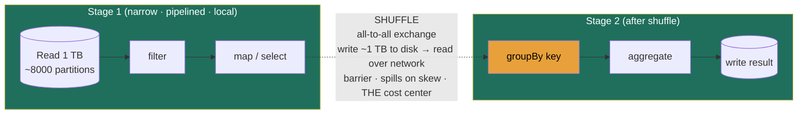

### Learning objectives
- Explain **Apache Spark** as a batch/micro-batch engine, the DataFrame/RDD abstraction, **lazy evaluation** building a DAG, the scheduler splitting that DAG into **stages at shuffle boundaries**, and why **the shuffle, the all-to-all data exchange, is the dominant cost center** (wide vs narrow transformations).
- Explain **Apache Flink** as a true per-event streaming engine, **event-time vs processing-time**, **watermarks** for out-of-order and late events, the **windowing** choices (tumbling/sliding/session), **RocksDB-backed keyed state**, and **Chandy-Lamport checkpoint barriers** that give it exactly-once recovery.
- Reason about the **two design dials that dominate cost and recovery**, shuffle minimization (broadcast joins, pre-partitioning) and the checkpoint interval (recovery speed vs steady-state overhead), each in numbers.
- Pick Spark vs Flink from the **freshness requirement set in the batch-vs-stream lesson** (you do *not* re-derive that choice here), then defend the pick by naming what the rejected engine costs you.
- Locate these engines in the platform: they are the **processing layer** that ingestion feeds and orchestration runs; the exactly-once and watermark mechanics show up applied in the ad-click aggregator, and streaming ETL pipelines are built on them.

### Intuition first
The batch-vs-stream lesson already told you *when* to batch and *when* to stream, the freshness ladder, the Lambda-vs-Kappa split. This lesson is the other half: *how the two engines that dominate that ladder actually work*, so when an interviewer asks "where's the bottleneck?" or "what does that cost?" you answer in mechanics, not adjectives. Two analogies, one per engine.

**Spark, the warehouse fulfillment center that periodically re-sorts the whole floor.** Picture a giant warehouse where workers pick and pack in parallel. Most steps are *local*, each worker filters and labels the boxes already on their own shelf, no coordination needed. But some steps force a **re-sort of the entire floor**: "group every box by destination zip code" means boxes from every shelf have to be physically carried across the warehouse to a new shelf keyed by zip. That floor-wide reshuffle is slow, it saturates the aisles (the network), spills boxes onto the loading dock when a shelf overflows (disk spill), and stalls every worker until the carrying is done. A Spark job is mostly cheap local work punctuated by a few of these expensive floor-wide re-sorts. **Knowing which operations force a re-sort, and minimizing them, is the entire performance game.** That re-sort is the *shuffle*.

**Flink, the airport baggage system that never closes.** Bags (events) arrive continuously on belts, never in a tidy batch. Each bag is tagged and routed *the instant it lands*, to a carousel keyed by flight (that per-key memory is the *keyed state*). But bags arrive **out of order**, a bag checked in first can sit on a delayed belt and show up late, so the system can't declare "flight 88's carousel is complete" the moment the last *expected* bag scans; it waits until a marker says "we've now seen everything checked in up to 9:05" (that marker is the *watermark*). And because the belts never stop, you can't shut down to take inventory; instead a clipboard photo of every carousel's state is snapped on a rolling basis without halting the belts (that rolling snapshot is the *checkpoint*), so after a power blip the system resumes from the last photo instead of re-scanning every bag from this morning. **Out-of-order arrival, per-key memory, and snapshot-without-stopping are the three problems Flink exists to solve.**

### Deep explanation

#### Spark: lazy DAG, stages, and the shuffle as the cost center

**Spark's core abstraction is a distributed, partitioned collection you transform with a functional API**, the low-level **RDD** (resilient distributed dataset) and the high-level **DataFrame/Dataset** that almost everyone writes against today. The collection is split into **partitions** (typically ~128 MB each, matching the columnar storage block size), and each partition is processed by one **task** on one core of one **executor**. A 1 TB input at 128 MB/partition is ~8,000 partitions, ~8,000 tasks scheduled across the cluster's cores; that partition count, not the row count, is what governs parallelism.

**Transformations are lazy, actions trigger execution.** Calling `.filter()`, `.select()`, `.join()`, `.groupBy()` does *no work*, it appends a node to a **logical plan**. Nothing runs until an **action** (`.count()`, `.write()`, `.collect()`) forces materialization. At that point Spark hands the plan to the **Catalyst optimizer**, which rewrites it (predicate pushdown so filters run before joins, column pruning so only referenced columns are read off columnar storage, join reordering) and then to the scheduler. Laziness is what *lets* the optimizer see the whole pipeline at once and fuse cheap operations together, the Director-relevant consequence is that **Spark optimizes the plan globally, not statement by statement**, so the order you write transformations matters far less than which operations force a shuffle.

**The DAG scheduler splits the plan into stages, and the boundary between stages is always a shuffle.** This is the single most important mechanical fact about Spark. Transformations come in two kinds:

- **Narrow transformations** (`map`, `filter`, `select`, `union`): each output partition depends on **one** input partition. No data crosses the network; the work is local to the partition, and Spark **pipelines** consecutive narrow ops into a single stage that runs in one pass. This is the cheap warehouse-local work.
- **Wide transformations** (`groupByKey`, `reduceByKey`, `join`, `distinct`, `repartition`): each output partition depends on **many** input partitions, because rows must be **regrouped by key**. All rows sharing a key have to land on the same partition, which means writing every partition's data out, partitioned by a hash of the key, and reading it back, an **all-to-all exchange across the cluster**. That exchange is **the shuffle**, and it is the stage boundary.

**The shuffle is the dominant cost center, and here is why, in numbers.** In a narrow stage, the data never leaves the executor, work proceeds at memory/CPU speed. A shuffle, by contrast:

- **Writes the entire stage's output to local disk** as shuffle files (the "shuffle write"), then **reads it back over the network** (the "shuffle read"). For a 1 TB stage, that's ~1 TB written to disk and ~1 TB pulled across the network, at maybe 1–10 GB/s of aggregate cluster bandwidth this is seconds-to-minutes of pure data movement doing *no useful computation*.
- **Is an all-to-all pattern**: M map tasks × R reduce tasks = up to M×R connections; the network, not the CPU, becomes the bottleneck.
- **Materializes a synchronization barrier**: the next stage cannot start until the shuffle write of the previous stage finishes, so a single slow ("straggler") task stalls the whole downstream stage.
- **Spills to disk when a key's group exceeds executor memory.** If the data is **skewed**, one key (say `country = 'US'`) holds 60% of the rows, that one reduce task gets a partition far larger than memory, spills repeatedly to disk, and runs 10× longer than its peers while the rest of the cluster sits idle. **Data skew is the #1 cause of a Spark job that "mostly finishes fast then hangs on the last task."**

So the performance discipline is **minimize the bytes shuffled**, and the two main levers each name a rejected alternative:

- **Broadcast join instead of a shuffle join, when one side is small.** A normal (sort-merge) join shuffles *both* tables by the join key, two full all-to-all exchanges. If one side fits in memory (Spark's default threshold is ~10 MB, commonly raised to ~100 MB–1 GB), Spark instead **broadcasts** the small table to every executor and joins locally, **zero shuffle of the large table**. A 1 TB fact table joined to a 50 MB dimension table goes from "shuffle 1 TB + 50 MB" to "ship 50 MB to N executors", often a 10–100× speedup. *Rejected alternative:* the shuffle (sort-merge) join, correct and the only option when *both* sides are large, but it pays the full all-to-all cost on both inputs; you reject it precisely when one side is small enough to broadcast.
- **Pre-partition / bucket the data so the shuffle is already done.** If two large tables are repeatedly joined on the same key, **bucketing** both by that key at write time (or keeping them co-partitioned) means the join finds matching keys already co-located, no shuffle at query time. *Rejected alternative:* re-shuffling on every join, simpler to write and fine for a one-off, but if the join runs hourly you're paying the all-to-all tax every hour instead of once at write time.

**In-memory processing is Spark's other headline, but it's caching, not magic.** Spark pipelines narrow stages through executor memory and lets you `.cache()` a DataFrame you'll reuse (an iterative ML loop, a dimension reused across joins) so it isn't re-read from storage, the win over MapReduce, which wrote every intermediate to HDFS between steps, and the reason Spark is often 10×+ faster. But memory is finite: when cached data or a shuffle exceeds it, Spark **spills to disk** and degrades toward MapReduce-like disk-bound behavior. The Director framing: "in-memory" buys speed *until you exceed memory*, after which spill and shuffle dominate, which is why you size executors and minimize shuffle rather than assume RAM speed.

#### Flink: event-time, watermarks, keyed state, and checkpoint barriers

**Flink is a true streaming engine, it processes each event as it arrives, not in batches**, which is the architectural opposite of Spark's bounded-collection model and the source of both its sub-second latency and its harder problems. A Flink job is a **dataflow graph** of operators (source → transform → keyed aggregation → sink) through which records flow continuously. The four mechanics you must be able to discuss:

**1. Event-time vs processing-time, the distinction every streaming question turns on.** *Processing time* is the wall-clock when the operator sees the event; *event time* is the timestamp embedded in the event, when it actually happened. They diverge because of network delay, queuing, and, above all, clients that go offline, a mobile click generated at 9:00 can arrive at the server at 9:05. If you bucket "clicks per minute" by *processing* time, that late click lands in the 9:05 minute and both minutes are wrong. **Correct streaming analytics is almost always computed in event time**, which immediately raises the question: if events arrive out of order, when is a given minute "complete" and safe to emit?

**2. Watermarks, the engine's answer to "when is this window complete?"** A **watermark** is a marker the engine injects into the stream meaning *"event time has now advanced to T; I believe I've seen all events with timestamp ≤ T."* Windows fire when the watermark passes their end. The watermark is generated with a **bounded-out-of-orderness** heuristic, "emit a watermark for `T = max_event_time_seen − δ`", where δ (say 5 seconds, or hours for mobile) is how late you're willing to wait. This is the core trade: **a larger δ catches more late events but delays every result by δ; a smaller δ emits faster but drops more stragglers into the "late" path.** Events arriving after the watermark has passed their window are handled by **allowed lateness** (keep the window state around a bit longer and re-fire) or routed to a **side output** for separate handling, exactly the late-event machinery the ad-click aggregator leans on. *Director-altitude statement: the watermark delay is a freshness-vs-completeness dial you set from the requirement, not a constant.*

**3. Keyed state, backed by RocksDB so it can outgrow memory.** Streaming aggregations are **stateful**, "running count per campaign," "session per user," "dedup set of seen event IDs", and that state must survive across events and across failures. Flink partitions the stream by key (`keyBy(campaignId)`) and gives each key its own state, accessed locally by the operator handling that key. The decision that matters at scale is **where that state lives**:

- **Heap (in-memory) state backend:** fastest access (nanoseconds), but the total state per task is capped by JVM heap, a few GB, and large state triggers GC pauses. Fine when keyed state is small (thousands of keys, small values).
- **RocksDB state backend:** state lives in an embedded **LSM-tree on local SSD** (the same LSM structure behind write-optimized stores), so it can hold **tens to hundreds of GB per task, far beyond RAM**, spilling to disk transparently. The cost is per-access latency, microseconds (an SSD read + possible deserialize) instead of nanoseconds, and write amplification from LSM compaction. *Rejected alternative:* keeping all keyed state on the heap, lower latency but it caps total state at a few GB and risks long GC pauses; you reject it the moment your state, millions of active sessions, a 24-hour dedup window over 100k events/sec, exceeds memory, which at platform scale is the common case. This is the "large keyed state in-memory vs RocksDB spill" decision, and the answer is almost always RocksDB once state is large, you trade a few microseconds per access for not falling over.

**4. Checkpointing via Chandy-Lamport barriers, how Flink recovers and delivers exactly-once.** Because a Flink job runs forever and holds large state, "restart from the beginning on failure" is a non-starter, replaying a month of events to rebuild a counter is an outage. Instead Flink periodically snapshots all operator state with the **Chandy-Lamport distributed snapshot algorithm**: the source injects a numbered **checkpoint barrier**; as it flows through, each operator snapshots its state the moment the barrier passes and forwards it downstream. Since the barrier separates "events before the checkpoint" from "events after," the snapshot is a **globally consistent cut** of the whole pipeline's state, *without stopping the stream* (the baggage-system clipboard photo). On failure, every operator restores from the last completed checkpoint and sources rewind their offsets to that barrier. Combined with **transactional sinks** (output and input offset committed atomically), this delivers **exactly-once** end-to-end, applied to billing-grade counting in the ad-click aggregator. Interview-grade phrasing: *exactly-once means replay after recovery is safe because the snapshot is consistent and the sink commit is atomic with the input offset*, not that every event is literally processed once.

**The checkpoint interval is the cost/recovery dial.** Snapshotting isn't free, it serializes state to durable storage (S3/HDFS), and with large RocksDB state that's real I/O and a brief throughput dip. So:

- **Frequent checkpoints** (every few seconds): **fast recovery** (on failure you replay only since the last checkpoint, seconds of events) but **higher steady-state overhead** (constant snapshot I/O eating throughput).
- **Sparse checkpoints** (every few minutes): **cheaper steady-state** (snapshot rarely) but **slower recovery and more replay** (a crash means reprocessing minutes of events, and downstream sees a longer stall).

A typical production setting is **10s–60s**, tuned so recovery time meets the SLO without the snapshot overhead crippling throughput; incremental checkpoints (RocksDB ships only changed SST files, not the whole state) make frequent checkpointing affordable even with hundreds of GB of state. *Rejected alternative on each end:* checkpoint every second, recovery is near-instant but you spend a large fraction of cluster I/O on snapshots; checkpoint every 10 minutes, almost no overhead but a failure replays 10 minutes and stalls the pipeline. You set the interval from the recovery-time requirement and the state size, and delegate the exact number to a benchmark.

**Backpressure, the property that keeps a streaming job stable.** If a downstream operator (or the sink, say a slow database) can't keep up, Flink doesn't drop events or blow up memory, the slow operator's full buffers propagate **backpressure** upstream through the dataflow, eventually slowing the source's consumption from Kafka. The system self-throttles to the speed of its slowest stage, and the lag shows up as growing Kafka consumer lag (the metric you alert on), not as data loss. The Director point: a healthy Flink job under load **slows down gracefully and recovers**, the failure mode to watch is sustained backpressure with no recovery, which means the slowest stage is permanently under-provisioned and you scale it or fix the skew.

#### The convergence: Spark Structured Streaming vs Flink

The two engines have grown toward each other, and the distinction that survives is **latency floor and the cost of state**:

- **Spark Structured Streaming** runs streaming as **micro-batches**: it executes the same Spark engine on tiny batches triggered every few hundred ms to seconds, so its latency floor is **~seconds** (a continuous-processing mode exists but is far less used). You get Spark's mature batch ecosystem and a unified API, and for "near-real-time" (seconds of lag) it's often the simpler choice because the team already runs Spark.
- **Flink** processes **per-event**, so its latency floor is **sub-second to low-ms**, and its state and watermark handling are first-class rather than bolted onto a batch model, which is why heavy stateful streaming (large keyed state, complex event-time windows, exactly-once at high throughput) leans Flink.

Both now offer **unified batch+stream APIs** (Flink treats batch as a bounded stream; Spark treats streaming as repeated batch), so the same logic can run in either mode, the Lambda-vs-Kappa code-duplication pain is partly what these unified APIs exist to reduce. But the choice between them stays a **freshness decision**: seconds of lag and batch-shop simplicity favor Spark Structured Streaming; sub-second latency and large stateful exactly-once favor Flink.

Go deeper, the shuffle write path and skew mitigation (IC depth, optional)

- **Shuffle file mechanics.** Each map task partitions its output by `hash(key) % numReducePartitions`, sorts within each partition, and writes one shuffle file plus an index to local disk. Reduce tasks then fetch their partition from every map task's file over the network (the "shuffle read"). The default `spark.sql.shuffle.partitions = 200` is a frequent footgun, too few for a large job (giant partitions, spill) or too many for a small one (scheduling overhead per tiny task); **Adaptive Query Execution (AQE)** in Spark 3+ coalesces and splits shuffle partitions at runtime based on observed sizes.
- **Skew mitigation, concretely.** When one key dominates: (1) **salting**, append a random suffix to the hot key so it spreads across N reduce tasks, then aggregate the partials, trading one extra small shuffle for an even load; (2) **AQE skew join**, Spark 3 detects an oversized partition and splits it automatically; (3) **broadcast** the other side if it's small enough, sidestepping the shuffle entirely. The tell on the Spark UI is one task with read/spill metrics 10–100× the median.
- **Why narrow stages pipeline.** Because each output partition needs exactly one input partition, Spark fuses a chain of narrow ops (`filter → map → select`) into a single task that streams a partition through all of them in one pass with no materialization between, which is the in-memory speed win over MapReduce's write-between-steps model.

### Diagram: a Spark DAG with a shuffle boundary between stages

The narrow operations (`filter`, `map`) pipeline locally inside Stage 1, no data moves. The **wide** `groupBy` forces the shuffle (dotted), the all-to-all exchange that ends Stage 1 and starts Stage 2, and that exchange is where the time and money go. A broadcast join would eliminate this boundary when one side is small.

### Worked example: the same hourly job, Spark vs Flink, and where each bottlenecks

A platform must produce **clicks-per-campaign-per-hour**, joined against a campaign dimension table, from a 2 TB/hour event firehose, the processing layer behind the DAU/ad-analytics paths and built out as streaming ETL. Run it two ways.

**Spark (the requirement is "hourly is fine").** An hourly batch job reads the 2 TB of event Parquet (~16,000 partitions), filters to billable clicks (narrow, local), and joins the campaign dimension. The dimension table is **8 MB**, so the planner picks a **broadcast join**, the 8 MB ships to every executor and the 2 TB never shuffles for the join, turning a potential 2 TB all-to-all into a tiny broadcast. Then `groupBy(campaignId, hour).count()`, *this* forces a shuffle, but it's a shuffle of the already-filtered, already-aggregated-per-partition data (Spark does a map-side `reduceByKey`-style partial aggregation first), so only partial counts move, kilobytes per campaign, not the raw 2 TB. **Where it bottlenecks:** if one campaign holds 70% of clicks, that key's reduce task spills and straggles while the cluster idles, the skew problem, mitigated by salting or AQE. **Cost shape:** cluster-hours for the run × the shuffle's disk+network time; the win came from the broadcast join (no shuffle of the fact table) and map-side pre-aggregation (tiny shuffle), not from more memory.

**Flink (the requirement is "advertisers need per-minute live counts," sub-second).** A Flink job consumes the Kafka firehose, `keyBy(campaignId)`, and maintains a **tumbling 1-minute event-time window** count per campaign in **RocksDB-backed keyed state** (millions of active campaigns × dedup IDs far exceed heap, so RocksDB, accepting ~µs access for not falling over). **Watermarks** with a δ of a few seconds decide when each minute is complete and safe to emit; late mobile events fall into allowed-lateness or a side output. **Checkpoint barriers every 30s** snapshot all that state to S3 so a crash replays only ~30s, with incremental checkpoints so snapshotting hundreds of GB doesn't cripple throughput. The campaign dimension is joined as **broadcast state** (the small table streamed to all operators and held in state), the streaming analog of Spark's broadcast join. **Where it bottlenecks:** if the sink (the OLAP store) slows, **backpressure** propagates upstream and Kafka consumer lag grows, the metric you alert on, and exactly-once holds because the checkpoint + transactional sink make replay safe. **Cost shape:** an always-on cluster sized to the firehose plus checkpoint I/O; you pay continuously for the seconds-fresh result the batch job can't give.

The Director takeaway: **same logical computation, two engines, two completely different bottlenecks and cost shapes**, Spark's is the shuffle (a periodic all-to-all you minimize with broadcast joins and pre-aggregation), Flink's is steady-state state size + checkpoint overhead + backpressure (dials you set from recovery and freshness SLOs). You pick the engine from the freshness requirement and then reason about *its* bottleneck.

### Trade-offs table: Spark vs Flink as platform components
| | **Spark (batch)** | **Spark Structured Streaming (micro-batch)** | **Flink (true streaming)** |
|---|---|---|---|
| Processing model | bounded DAG, run to completion | repeated micro-batches | per-event continuous dataflow |
| Latency floor | minutes–hours | **~seconds** | **sub-second–low-ms** |
| Dominant cost center | **the shuffle** (all-to-all, disk+network, spills on skew) | shuffle per micro-batch | **keyed state size + checkpoint I/O + backpressure** |
| State | none (bounded data, just re-run) | windowed, engine-managed | first-class keyed state, **RocksDB-backed**, can exceed RAM |
| Recovery | re-run the job (idempotent) | re-run the micro-batch | **checkpoint (Chandy-Lamport barriers)** → replay since last snapshot |
| Exactly-once | trivial (re-run) | engine-managed | checkpoint + transactional sink |
| Late / out-of-order events | irrelevant (sees all data) | event-time windows + watermarks | **watermarks + allowed lateness + side outputs** |
| Operational complexity | lowest | medium | highest (always-on, large state, tuning) |
| **Use when…** | hourly/daily freshness fine; cost & simplicity win; big joins/rollups (billing, training, reports) | seconds of lag OK and you already run Spark; near-real-time without heavy per-event state | must act in sub-second; large stateful event-time aggregations; high-throughput exactly-once (live fraud, live counters) |

The choice of *batch vs stream* is owned by the freshness requirement; this table picks the **engine** once that decision is made, and names what the rejected engine costs (Spark's shuffle/skew tax vs Flink's always-on state/checkpoint/ops tax).

### What interviewers probe here
- **"Where does a Spark job actually spend its time, and how do you make a slow join fast?"**, *Strong signal:* identifies the **shuffle** as the all-to-all cost center (writes to disk + reads over network, a barrier, spills on skew), distinguishes narrow vs wide transformations, and reaches for a **broadcast join** when one side is small (no shuffle of the big table) and pre-partitioning/bucketing for repeated joins, naming the rejected sort-merge shuffle join and when it's still required. *Red flag:* "add more memory / more executors" with no mention of shuffle or skew, throwing resources at an all-to-all or a skewed key doesn't fix it.
- **"How does Flink not lose its counters when a node dies, and what does 'exactly-once' really mean?"**, *Strong:* checkpoint barriers (Chandy-Lamport) snapshot consistent state without stopping the stream; on failure restore the snapshot and rewind offsets; exactly-once = replay is safe because the snapshot is consistent and the **sink commit is atomic with the input offset**, not "each event processed literally once." *Red flag:* thinks exactly-once means no event is ever reprocessed, or has no recovery story beyond "restart."
- **"Why event time and watermarks, what breaks if you use processing time?"**, *Strong:* late/out-of-order events (mobile offline, network delay) land in the wrong window under processing time; watermarks let the engine decide when a window is complete, with δ as the explicit freshness-vs-completeness dial, and allowed-lateness/side-outputs for stragglers. *Red flag:* doesn't see the late-event problem, or treats the watermark delay as a fixed constant rather than a requirement-driven trade.
- **"Your Flink job has huge state, 24h dedup over 100k events/sec, where does it live and what's the recovery trade?"**, *Strong:* **RocksDB** state backend (LSM on SSD, exceeds RAM, ~µs access vs heap's ns, rejected for not falling over), checkpoint interval tuned (frequent = fast recovery, more overhead; sparse = cheaper, more replay), incremental checkpoints to afford frequency. *Red flag:* assumes all state fits in memory, or doesn't connect checkpoint frequency to recovery time and overhead.
- **"Spark Structured Streaming or Flink for this?"**, *Strong:* derives it from the **freshness requirement**, seconds and batch-shop simplicity → Spark; sub-second and large stateful exactly-once → Flink, and names the rejected engine's cost. *Red flag:* picks by familiarity with no latency requirement, or thinks the two are interchangeable at any freshness.

The through-line at Director altitude: you reason about each engine's **bottleneck and cost shape** (Spark's shuffle, Flink's state+checkpoint+backpressure), set the dials from requirements (broadcast threshold, watermark δ, checkpoint interval, state backend), and **delegate the exact tuning with a stated prior** ("the data team benchmarks broadcast-threshold and shuffle-partition counts against our join profile, and the checkpoint interval against our recovery SLO; my prior is a broadcast join here and a 30s incremental checkpoint").

### Common mistakes / misconceptions
- **Ignoring the shuffle, and blaming memory for a slow Spark job.** The cost is the all-to-all exchange (disk write + network read + barrier), and a hung "last task" is almost always **skew**, not insufficient RAM. The fixes are broadcast joins, pre-partitioning, map-side aggregation, and salting/AQE for skew, not a bigger cluster.
- **Believing "exactly-once" means each event is processed exactly one time.** It means *effectively-once output*: replay after recovery is safe because the checkpoint is a consistent snapshot and the sink commit is atomic with the input offset. Events are reprocessed on recovery; the *result* is as if once.
- **Computing streaming aggregates in processing time.** Late and out-of-order events (mobile clients, network delay) land in the wrong window; correct analytics uses **event time + watermarks**, with the watermark delay set from the completeness-vs-freshness requirement.
- **Assuming all Flink keyed state fits in memory.** At platform scale (millions of keys, long dedup windows) it doesn't, you use the **RocksDB backend** (LSM on SSD), accepting microsecond access for not capping state at a few GB and not blowing up on GC.
- **Re-deriving the batch-vs-stream choice here.** That decision belongs to the freshness requirement; this lesson picks the *engine* and reasons about its mechanics. Defaulting to Flink "because real-time" when hourly Spark meets the need pays the always-on state/checkpoint/ops tax for freshness nobody asked for.

### Practice questions

**Q1.** A Spark job joins a 3 TB fact table to a 40 MB dimension table, then groups by a key. It's slow. Walk through what's happening and how you'd speed it up.
> *Model:* Two potential shuffles: the join and the `groupBy`. The 40 MB dimension is small enough to **broadcast** (raise `autoBroadcastJoinThreshold` if needed), so the join becomes a local broadcast join, the 3 TB fact table is **not shuffled** for the join at all, replacing a 3 TB all-to-all with shipping 40 MB to every executor (often a 10–100× win). The `groupBy` still shuffles, but with **map-side partial aggregation** only per-partition partial counts move (kilobytes/key), not raw rows. If it still hangs on the last task, that's **skew**, one key dominates the reduce partition and spills; mitigate with salting or AQE skew-join. Rejected alternative: a sort-merge (shuffle) join, which would shuffle both 3 TB and 40 MB, correct but needlessly expensive when one side broadcasts. The lever throughout is **bytes shuffled**, not cluster size.

**Q2.** Explain how Flink recovers from a worker crash without losing or double-counting, and what tuning knob governs the recovery-vs-overhead trade.
> *Model:* Flink periodically injects **checkpoint barriers** into the stream; as each barrier flows through the dataflow, every operator snapshots its keyed state the moment the barrier passes (Chandy-Lamport distributed snapshot), producing a **globally consistent cut without stopping processing**, written to durable storage (S3). On a crash, all operators restore from the last completed checkpoint and sources **rewind their Kafka offsets** to that barrier's position; replay is safe because the snapshot is consistent and the **sink commit is atomic with the offset** (transactional sink), so no double-count, this is what "exactly-once" means operationally. The knob is the **checkpoint interval**: frequent (every few seconds) → fast recovery but high steady-state snapshot I/O; sparse (minutes) → cheap steady-state but more replay and a longer stall on failure. Tune from the recovery SLO and state size; incremental checkpoints make frequent intervals affordable on large RocksDB state.

**Q3.** Why does a streaming "count per minute" use event time and watermarks instead of processing time, and what is the trade-off baked into the watermark delay?
> *Model:* **Processing time** buckets an event by when the operator sees it; a mobile click generated at 9:00 but delivered at 9:05 (offline, network delay) lands in the 9:05 minute, corrupting both minutes. **Event time** buckets by the embedded timestamp, the truth of when it happened, but then the engine needs to know when a minute is *complete* given out-of-order arrival. A **watermark** asserts "event time has reached T; all events ≤ T are probably in," generated as `max_seen − δ`. The trade is **δ**: larger δ waits longer, catching more late events but delaying every result by δ; smaller δ emits faster but pushes more stragglers into the late path (allowed-lateness or side output). You set δ from the completeness-vs-freshness requirement, it's a dial, not a constant, and the batch layer is the ultimate safety net for events later than any δ.

**Q4.** Your Flink job runs fine for a week, then Kafka consumer lag starts climbing steadily and never recovers. What's happening and what do you check?
> *Model:* Sustained, non-recovering lag is **backpressure**: some operator (often the sink, e.g. the OLAP store, or a skewed `keyBy` partition) can't keep up, its buffers fill, and the slowdown propagates upstream until the source consumes from Kafka slower than events arrive, so lag grows. Flink self-throttles to its slowest stage rather than dropping events or OOM-ing, so the lag is the symptom, not data loss. I'd check: (1) **which operator is backpressured** (Flink UI shows it), (2) whether it's the **sink** (slow downstream DB → scale it or batch writes), (3) **key skew** (one `keyBy` partition far hotter → re-key or salt), (4) **state growth** (RocksDB compaction or an unbounded-growing state → add TTL / windowing), (5) checkpoint duration creeping up (state too large → incremental checkpoints, more parallelism). The fix is to scale or de-skew the bottleneck stage; throwing parallelism at the *whole* job without finding the slow stage just moves the problem.

**Q5.** A team proposes building a new real-time fraud-scoring pipeline on Flink. The current need is "fraud-loss reports, accurate, by the next morning." Push back or proceed?
> *Model:* The stated requirement, "accurate, by next morning", is a **batch** requirement: hourly/nightly Spark meets it at a fraction of Flink's cost and operational burden, no always-on cluster, no checkpoint tuning, no watermark/late-event machinery, no large RocksDB state to operate, and exactly-once is trivial (re-run an idempotent job). Flink would buy sub-second freshness **nobody asked for** while adding the always-on state/checkpoint/backpressure operating tax. I'd proceed with Flink **only** if there's a concrete real-time requirement, *block* fraud before settlement, alert *now*, in which case the sub-second per-event stateful scoring with exactly-once is exactly what Flink is for, and I'd likely run **both** (the Lambda shape): Flink for the live block, Spark for the accurate nightly ground truth. The engine choice follows the freshness requirement, not the team's enthusiasm for streaming.

### Key takeaways
- **Spark is a lazy DAG over partitioned collections**, narrow transformations pipeline locally; **wide transformations force a shuffle**, the all-to-all exchange (write to disk → read over network → barrier, spills on skew) that is the dominant cost center. Minimize bytes shuffled with **broadcast joins** (small side, no shuffle of the big table) and **pre-partitioning/map-side aggregation**; the rejected sort-merge shuffle join is for when both sides are large.
- **Flink is a true per-event streaming engine** that computes in **event time**; **watermarks** (`max_seen − δ`) decide when a window is complete, with δ the freshness-vs-completeness dial and allowed-lateness/side-outputs for stragglers.
- **Flink's keyed state is RocksDB-backed (LSM on SSD)** so it exceeds RAM at the cost of ~µs vs ns access, you reject heap-only state once state is large; **checkpointing via Chandy-Lamport barriers** snapshots consistent state without stopping the stream, and the **checkpoint interval** trades fast recovery (frequent) against steady-state overhead (sparse).
- **"Exactly-once" = effectively-once output**: replay after recovery is safe because the snapshot is consistent and the **sink commit is atomic with the input offset**, not "every event processed once." **Backpressure** makes a healthy job slow down gracefully; sustained non-recovering lag means a permanently under-provisioned slowest stage.
- **Pick the engine from the freshness requirement, not familiarity**: hourly/cheap/big-joins → Spark; seconds + existing Spark shop → Spark Structured Streaming (micro-batch); sub-second + large stateful exactly-once → Flink. Then reason about *that* engine's bottleneck (Spark's shuffle/skew, Flink's state+checkpoint+backpressure) and name what the rejected engine costs.

> **Spaced-repetition recap:** Spark = warehouse that periodically re-sorts the whole floor: lazy DAG, narrow ops pipeline locally, **wide ops force the shuffle** (all-to-all, disk+network, barrier, spills on skew), the cost center, killed by **broadcast joins** + pre-partitioning + map-side aggregation. Flink = baggage system that never closes: per-event, **event-time + watermarks** (δ = freshness vs completeness), **RocksDB keyed state** (exceeds RAM, µs vs ns), **Chandy-Lamport checkpoint barriers** (consistent snapshot without stopping → restore + rewind offsets), **checkpoint interval** = recovery vs overhead, **exactly-once** = atomic sink+offset commit, **backpressure** = graceful slowdown. Pick engine from the freshness requirement: hourly→Spark, seconds→Structured Streaming, sub-second stateful→Flink; name the rejected engine's cost. These are the processing layer orchestration runs and streaming ETL builds on.

---

*End of Lesson 7.4. You now know how the two dominant engines work as platform components, Spark's shuffle and Flink's watermarks/state/checkpoints, and how to reason about their bottlenecks and cost rather than just naming them. Next: 13.5, real-time OLAP stores (Druid/Pinot/ClickHouse), where Flink's seconds-fresh output is served as sub-second user-facing aggregates.*
