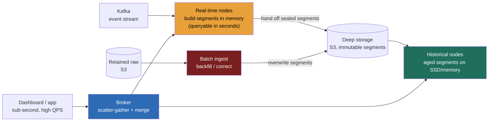

### Learning objectives
- Name the **second analytical store** as a distinct class: a warehouse/lakehouse answers *complex, flexible* queries in seconds-to-minutes at *low* concurrency; a **real-time OLAP / serving engine** (Druid, Pinot, ClickHouse) answers *simple aggregation* queries in **sub-second p99** at **hundreds-to-thousands QPS** over **seconds-fresh** data, and the gap between those two profiles is the whole reason this class exists.
- Explain the four mechanics that make sub-second-at-high-concurrency possible, **columnar time-partitioned immutable segments**, **pre-aggregation / rollup at ingest**, **inverted/bitmap indexes** for fast filtering, and **memory-resident hot data**, at decision altitude (mechanics in Go-deeper).
- Describe the **real-time + historical node split** and the **broker scatter-gather**: stream ingestion pulls fresh data from Kafka, deep storage holds the aged segments, and a broker fans a query across both tiers and merges.
- Make the load-bearing decision, **serve from a real-time OLAP store vs serve from the warehouse**, by matching the *query's concurrency and freshness need* to the store, and name the rejected alternative each time.
- Decide **pre-aggregation/rollup vs storing raw**, and frame the **Druid-vs-Pinot-vs-ClickHouse** bake-off as a delegated call with a stated prior, the Director move.

### Intuition first
Think of the difference between the **accountant's research library** and the **arrivals board at an airport**. The library (the warehouse) is where an analyst goes to answer a hard, one-off question, *"reconstruct net revenue by cohort by channel for the last three years, adjusting for refunds"*, and she's happy to wait two minutes and to be one of only a handful of people in the building. It's built for *flexibility and depth at low concurrency*. The arrivals board is the opposite: ten thousand travelers stare at it at once, each wants one simple fact (*"is flight 482 on time?"*), every one of them needs the answer in well under a second, and the board has to reflect a gate change from thirty seconds ago. Nobody asks the arrivals board to reconstruct three years of flight history, and nobody asks the research library to serve ten thousand simultaneous glances.

A real-time OLAP store is the arrivals board for analytics. It powers the **user-facing dashboard** an advertiser refreshes every few seconds, the **live ops screen** a thousand on-call engineers watch during an incident, the **"your post got 12,400 views in the last 5 minutes"** counter inside a product. The questions are deliberately simple, *count, sum, group-by-a-few-dimensions, filter-by-time*, but they must return in **sub-second p99**, at **thousands of queries per second**, over data that is **seconds old, not hours old**. The trick the board pulls off is that it **does the hard work before you look**: it pre-counts the totals at ingest, it lays the data out so a filter touches almost nothing, and it keeps the recent stuff in memory. That, not raw horsepower, is how it stays instant for everyone at once.

The mistake almost everyone makes is reaching for one analytical store for both jobs. **The warehouse cannot be the arrivals board** (it answers tens of concurrent queries in seconds, not thousands in milliseconds), and **the arrivals board cannot be the research library** (it has pre-decided which questions it answers, and pays for that with lost flexibility). Recognizing that user-facing, high-concurrency, sub-second analytics is a *different store* from internal ad-hoc analytics is the judgment this lesson trains.

### Deep explanation

**Start with the divide, because it's the whole lesson.** The data-platforms foundations lesson split the world into OLTP (one entity now, point access) and OLAP (all entities over time, scans). Real-time OLAP is a *split inside OLAP itself*. A cloud warehouse or lakehouse (Snowflake/BigQuery/Trino-on-S3) is optimized for **flexible, complex queries at low concurrency**: arbitrary joins, deep history, any group-by, and it's perfectly happy to take **2–30 seconds** and serve **tens of concurrent queries** because its users are analysts and scheduled jobs. A real-time OLAP store is optimized for the opposite corner: **simple aggregation queries at high concurrency with sub-second latency over fresh data**. The Director-altitude statement: *the warehouse answers hard questions slowly for a few people; the serving engine answers easy questions instantly for everyone, and they are two stores because no single engine sits well in both corners at once.* You **reject** "just point the user-facing dashboard at the warehouse" because a warehouse that's fine for 30 analysts melts at 3,000 QPS of dashboard refreshes, its per-query overhead and concurrency model were never built for that, and you **reject** "use the serving engine as our general analytics store" because it has traded away the flexibility (arbitrary joins, full raw granularity, ad-hoc anything) that ad-hoc analysis needs.

**The performance budget is the requirement, so quantify it.** This class earns its existence at numbers a warehouse can't hit:

- **Latency:** **sub-second p99**, often **single-digit-to-tens of milliseconds** for a pre-aggregated lookup, low-hundreds of ms for a heavier group-by, over **billions of rows**. Contrast the warehouse's **seconds-to-minutes**.
- **Concurrency:** **hundreds to low thousands of QPS**, because the queries back a product surface every user hits. Contrast the warehouse's **tens of concurrent queries** before it queues.
- **Freshness:** **seconds** from event to queryable (ingestion lag measured in single-digit seconds), because the data is fed off a stream. Contrast the warehouse's **minutes-to-hours** load cadence.

When an interviewer asks "why not the warehouse?", *those three numbers are the answer*, concurrency and latency and freshness, all an order of magnitude tighter.

**Four mechanics buy that budget. You name them at decision altitude; the internals live in Go-deeper.**

- **Columnar, time-partitioned, immutable segments.** Data is sliced by time into **segments** (Druid's term; Pinot calls them segments, ClickHouse uses parts/partitions), typically covering a time interval, holding millions of rows, stored **columnar** and **immutable** once sealed. Immutability is the unlock: a sealed segment can be memory-mapped, cached, replicated, and load-balanced freely because it never changes. Time-partitioning means a query with a time filter (almost all of them) **prunes** straight to the relevant segments and ignores the rest. *Decision consequence:* you query a few recent segments, not the whole dataset.
- **Pre-aggregation / rollup at ingest.** This is the signature move. Instead of storing every raw event, the store **rolls up** at ingest: rows sharing the same dimension values within a time bucket are collapsed into one row carrying pre-computed aggregates (count, sum, min/max, approximate distinct via HyperLogLog). A billion raw events become tens of millions of rolled-up rows. *Decision consequence:* the query reads a fraction of the data and the aggregate is **partly pre-computed**, which is most of where the sub-second comes from. The cost is stated below: you lose raw granularity.
- **Inverted / bitmap indexes for filtering.** Beyond columnar min/max pruning, serving engines build **inverted indexes** (value → which rows) and **bitmap indexes** on dimension columns, so a `WHERE country = 'US' AND device = 'mobile'` resolves by **intersecting bitmaps** rather than scanning. *Decision consequence:* high-cardinality filters stay fast, which is what user-facing slice-and-dice demands.
- **Memory-resident hot data.** Recent segments, the ones nearly every query hits, are kept **in memory or on local SSD**, not fetched cold from object storage per query. *Decision consequence:* the common case never touches the network or a cold disk, so p99 stays tight under load.

**The architecture is a real-time tier and a historical tier, fronted by a broker.** This is the structural shape to draw:

- **Real-time / ingestion nodes** subscribe to a stream (**Kafka**, Kinesis, Pulsar), build segments *in memory* as events arrive so the data is queryable within **seconds**, and periodically **hand off** sealed segments to deep storage and the historical tier.
- **Historical nodes** load sealed, immutable segments from **deep storage** (S3/HDFS) and serve queries over the aged data, the bulk of the dataset, from local SSD/memory.
- **Deep storage** (S3) is the durable system of record for segments, cheap, repl-free at the object layer, and the thing that makes the cluster **rebuildable**: lose a historical node and its segments reload from S3.
- A **broker** receives every query, uses the time range to decide **which segments live where**, **scatters** sub-queries to the real-time nodes (for the freshest minutes) and the historical nodes (for everything older), and **gathers and merges** the partial aggregates into one answer. *This scatter-gather over a fresh tier + a historical tier is the mechanism that makes "sub-second over seconds-fresh data" possible*, fresh data and aged data are served by different nodes optimized for each, and the broker hides the seam.

**There's a lambda-ish handoff where streaming ingest meets batch backfill.** The real-time tier gives you speed-of-ingest but is the weaker authority, its in-memory segments can miss very-late events or need a logic fix. So these systems also accept **batch ingestion**: a job reads the retained raw (the same S3 raw an Ad Click Aggregator keeps) and **overwrites** segments for a time range with a clean, complete, possibly-recomputed version. The streaming path keeps the board fresh; the batch path **backfills and corrects**. *This is the same speed-vs-truth handoff as the Lambda architecture*, the stream is fast and forgivably approximate at the bleeding edge, the batch re-derives the authoritative segments, just expressed inside one serving store's ingestion rather than across two separate pipelines.

**Where this is NOT the answer.** Two boundaries a Director states explicitly. First, this is **general real-time analytics OLAP**, distinct from **monitoring/observability time-series**: Prometheus and friends are purpose-built for operational metrics (regular-interval numeric series, label-set queries, alerting, downsampling/retention tiers for infra health), whereas Druid/Pinot/ClickHouse serve arbitrary high-cardinality business analytics (per-user, per-campaign, per-SKU slice-and-dice) at product-facing concurrency. They overlap in the middle, but reaching for a serving engine to do node-CPU alerting, or for Prometheus to power a customer-facing analytics product, is a mismatch. Second, this is the **concept** lesson, the full design of one of these systems (capacity, ingestion topology, segment sizing, failure modes, RESHADED end to end) is **14.2**; here you learn *what the class is and when to choose it*, and defer the build.

Go deeper, the mechanics that turn a billion rows into a sub-second answer (IC depth, optional)

- **Segment anatomy.** A Druid/Pinot segment is a self-contained columnar file: each dimension column stored as a **dictionary-encoded** integer array (the distinct values held once in a dictionary, rows referencing them by id) plus, per dimension value, a **bitmap** (often Roaring-compressed) marking which rows hold it. Metric columns (the things you sum) are stored as compressed numeric arrays. A `GROUP BY country WHERE device='mobile'` ANDs the `device='mobile'` bitmap against each country's bitmap and sums the metric over the set bits, no row scan, just bitmap intersection and a masked sum.
- **Rollup math.** Rollup is a `GROUP BY` applied *at ingest* over (truncated-timestamp, all dimensions). If your dimensions are low-cardinality relative to event volume, the compression is dramatic, **10×–100×+** fewer rows is common (1B raw events → ~10–50M rolled rows). Counts become `SUM` of partial counts; distinct counts must be **approximate** (HyperLogLog sketches stored per row and merged at query) because exact distinct can't be pre-rolled. The lever is dimension cardinality: add a high-cardinality dimension (like `user_id`) to the rollup and the ratio collapses toward 1:1, which is *why you don't roll up on raw identifiers*.
- **Why immutability matters operationally.** Sealed segments are content-addressable and never mutated, so they replicate and cache trivially, rebalance across historical nodes without coordination, and reload from deep storage (S3) on node loss. Updates/corrections aren't in-place edits; they're **segment replacement** (re-ingest a time interval as a new segment version, the broker switches to it atomically). This is what makes the batch-backfill correction path clean.
- **The broker's segment-to-node map.** The broker (with a coordinator/controller) holds the timeline of which segment versions are current and which nodes hold them. A query's time range selects a set of segments; the broker scatters to the holders (real-time nodes for the newest, historical for the rest), each node returns a *partial* aggregate, and the broker does the final merge. Concurrency scales by **replicating hot segments** across more historical nodes so thousands of QPS spread out.
- **ClickHouse's different shape.** ClickHouse isn't node-typed like Druid/Pinot; it's a columnar SQL database with a `MergeTree` engine that sorts data by a primary key and merges parts in the background. Rollup is via `AggregatingMergeTree`/materialized views rather than ingest-time rollup config. It tends to be **fewer, fatter nodes and full SQL**, trading Druid/Pinot's elastic real-time/historical separation for operational simplicity and SQL expressiveness.

### Diagram: real-time OLAP serving architecture

### Worked example: the live advertiser dashboard (the serving half of 9.7)
Recall the Ad Click Aggregator: one Kafka firehose, two paths, a fast approximate **stream** for dashboards, a slow exact **batch** for billing. That lesson named "an OLAP store, Druid/ClickHouse/Pinot" as the dashboard's serving layer and moved on. *This is that store, and here's why it's the right class.*

- **The requirement, in numbers.** ~500k campaigns; advertisers poll their dashboard every ~5–30s; assume **~1,000–3,000 dashboard QPS** at peak; each query is "clicks/impressions for *my* campaign, by minute, last N hours, sliced by region/device", and it must return in **sub-second p99** over a firehose ingesting **100k+ events/sec**, ~**8.6B events/day**. That profile, simple aggregation, product-facing concurrency, seconds-fresh, is exactly the serving-engine corner.
- **Why not the warehouse here.** A Snowflake/BigQuery-class store is the right home for the *billing* recompute and for analysts' ad-hoc revenue questions, but **rejected** for the live dashboard: at 3,000 QPS of small refreshes its concurrency model queues and its per-query latency is seconds, not milliseconds, and it loads on a minute-to-hour cadence, not seconds. The dashboard needs the arrivals board, not the research library.
- **Rollup does the heavy lifting.** The dashboard's grain is `(campaign_id, minute, region, device)`, all low-cardinality relative to 8.6B daily events. Rolling up at ingest collapses the firehose by **~10–100×** into per-minute aggregate rows; a "last 6 hours by minute" query touches a handful of recent **segments**, reads two metric columns, intersects a `campaign_id` bitmap, and returns in tens of milliseconds. *Trade-off named:* the store no longer holds individual click rows, so "show me this one user's exact click sequence" isn't answerable here, that's what the **retained raw in S3** is for. Rollup bought sub-second-at-scale and cost raw granularity, deliberately.
- **Fresh tier + batch correction.** The **real-time nodes** ingest Kafka so a click is on the dashboard within seconds; the **batch** path re-derives authoritative segments from the retained raw (folding in late mobile events, applying the fraud verdict) and **overwrites** the corresponding segments, so the dashboard *converges to truth* exactly as the batch back-corrects the OLAP store. Same speed-vs-truth handoff, expressed inside the serving store.

The number a Director carries out: *"the live dashboard is a real-time OLAP serving store, rolled-up segments off the Kafka stream, sub-second at a few thousand QPS, seconds-fresh, with a batch backfill correcting it, and it is deliberately a different store from the warehouse we bill and analyze from."*

### Trade-offs table: real-time OLAP vs the warehouse, and the choices within
| Decision | Option A | Option B | Use when… |
|---|---|---|---|
| **Where to serve the analytics** | **Real-time OLAP / serving engine** (Druid/Pinot/ClickHouse) | **Cloud warehouse / lakehouse** (Snowflake/BigQuery/Trino) | **A** for user-facing or live-ops dashboards, *high concurrency* (100s–1000s QPS), *sub-second* p99, *seconds-fresh*, *simple* aggregations. **B** for internal ad-hoc, flexible/complex queries, deep history, *low concurrency*, seconds-to-minutes is fine. *Reject A for B's job* (it lacks join flexibility/raw granularity); *reject B for A's job* (it queues at high QPS and is seconds-slow). |
| **Pre-aggregation / rollup vs raw** | **Roll up at ingest** (pre-computed aggregates, 10–100× smaller) | **Store raw events** (full granularity) | **A** when queries hit known low-cardinality grains and need to be fast and cheap, *loses* per-event granularity and locks the queryable dimensions. **B** when you need arbitrary drill-down to the individual event, *dearer storage, slower scans*. Common answer: **roll up in the serving store, keep raw in S3** for the rare deep query and for backfill. |
| **Druid vs Pinot vs ClickHouse** (delegated bake-off) | Druid / Pinot (node-typed: real-time + historical + broker, built for streaming ingest + high-QPS scatter-gather) | ClickHouse (columnar SQL DB, MergeTree, fewer/fatter nodes, full SQL) | **Druid** when you want mature streaming ingest, time-partitioned rollup, and elastic concurrency at scale (classic Netflix/analytics-product shape). **Pinot** for the lowest-latency user-facing queries with rich indexing (the LinkedIn profile-view shape). **ClickHouse** when you want **SQL + operational simplicity** and fat-node raw-ish speed over strict real-time/historical separation. Delegate with a stated prior (below). |
| **Serve from stream-fed OLAP vs from the warehouse output** | **Stream → real-time OLAP** (seconds-fresh, self-correcting) | **Batch → warehouse → BI** (minutes-to-hours fresh) | **A** when the surface is live/interactive and freshness is a stated requirement. **B** when day-or-hour-old is fine, *don't pay the streaming-ingest + always-on-memory tax* for freshness nobody asked for. |

The Director move is matching the **query's concurrency, latency, and freshness profile** to the store, and never forcing one analytical engine to cover both the arrivals-board and research-library corners.

### What interviewers probe here
- **"Why not just serve this dashboard from your warehouse / Snowflake?"**, *Strong signal:* names the three numbers, the warehouse does **tens** of concurrent queries in **seconds** on a **minute-to-hour** load cadence; a user-facing dashboard needs **thousands of QPS, sub-second p99, seconds-fresh**, which is a different store's corner. *Red flag:* "we'll add warehouse compute / a BI cache" with no grasp that the concurrency and latency model, not horsepower, is the wall.
- **"How does it return a group-by over billions of rows in milliseconds?"**, *Strong:* pre-aggregation/rollup at ingest shrinks the data 10–100×, columnar time-partitioned segments prune to a few recent segments, bitmap/inverted indexes resolve filters without scanning, and hot segments are memory-resident, names the mechanics at decision altitude. *Red flag:* "it's columnar so it's fast" with no mention of rollup, pruning, or the concurrency story.
- **"What does rollup cost you?"**, *Strong:* you lose **raw, per-event granularity** and you pre-decide the queryable dimensions, so arbitrary drill-down to a single event isn't possible, which is exactly why you **keep raw in S3** alongside and can backfill from it. *Red flag:* treats rollup as free, or stores raw in the serving engine and wonders why it's expensive and slow.
- **"How is the data only seconds old, and how do you keep it correct?"**, *Strong:* real-time nodes build segments in memory off Kafka (queryable in seconds) and hand sealed segments to historical nodes; a **batch path re-derives and overwrites** segments from retained raw to fold in late events and corrections, the lambda-ish speed-vs-truth handoff, with the broker scatter-gathering across both tiers. *Red flag:* assumes streaming ingest is exact, or has no correction/backfill path.
- **"Druid or Pinot or ClickHouse?"**, *Strong:* gives the distinguishing traits and **delegates with a prior**, "Druid/Pinot for node-typed streaming ingest + high-QPS scatter-gather, Pinot for the tightest user-facing latency, ClickHouse for SQL + operational simplicity; data-platform benchmarks the final two on our concurrency/freshness profile, my prior is the one the org already runs." *Red flag:* a brand-name pick with no traits and no bake-off.

The through-line at Director altitude: real-time OLAP is the **second analytical store**, chosen by *concurrency + latency + freshness*, paid for with **rollup at ingest** (sub-second-at-scale in exchange for raw granularity), kept fresh by a **stream-fed real-time tier** and correct by a **batch backfill**, and the engine bake-off is delegated with a stated prior (the real-time-OLAP-serving problem builds one end to end).

### Common mistakes / misconceptions
- **Serving a high-concurrency, user-facing dashboard from the warehouse.** It's built for tens of concurrent, seconds-slow, flexible queries, it queues and misses sub-second at thousands of QPS. The serving engine exists precisely for that corner; match the store to the concurrency/latency/freshness profile.
- **Storing raw events in the serving engine for flexibility.** That throws away rollup's 10–100× win, balloons storage and latency, and still won't match the warehouse's join flexibility. Roll up in the serving store; keep raw in cheap object storage for the rare deep query and for backfill.
- **Assuming streaming ingest is exact.** The real-time tier is fast but the weaker authority on very-late events and logic fixes; without a **batch backfill that overwrites segments**, the board drifts. Speed comes from the stream, truth from the batch re-derive.
- **Confusing this with a metrics/observability time-series store.** Prometheus-class systems are for operational/infra metrics, alerting, and regular-interval series; real-time OLAP serves arbitrary high-cardinality *business* analytics at product concurrency. Using one for the other's job is a mismatch.
- **Picking Druid/Pinot/ClickHouse by brand instead of profile.** They differ on node model (typed real-time/historical vs fat SQL nodes), ingest, indexing, and SQL surface; the right answer states the distinguishing traits and delegates the final bake-off with a prior (and reaches for the warehouse, not any of them, when the workload is actually low-concurrency ad-hoc).

### Practice questions

**Q1.** A product team wants an in-app "your store's orders in the last hour, by minute, sliced by region" panel that every seller sees on login, call it ~2,000 QPS at peak, must feel instant, data no more than a few seconds stale. They propose querying the analytics warehouse you already run. What do you tell them, and what do you build instead?
> *Model:* I'd reject the warehouse for this surface: it's tuned for tens of concurrent, seconds-to-minutes, flexible queries, at 2,000 QPS of small refreshes it queues and its per-query latency is seconds, not the sub-second this needs, and it loads on a minute-to-hour cadence, not seconds-fresh. This is the arrivals-board corner, so I'd serve it from a **real-time OLAP store** (Druid/Pinot/ClickHouse): ingest the order stream from Kafka into **real-time nodes** (queryable in seconds), **roll up at ingest** to the `(store_id, minute, region)` grain so a billion events become tens of millions of rows, and let columnar time-partitioned **segments** + a `store_id` bitmap return the panel in tens of milliseconds. The warehouse stays the home for the team's ad-hoc and historical analysis, two stores, matched to two query profiles. Trade-off I'd name: rollup means I can't drill to an individual order from this store, so I keep raw in S3 for that and for backfill.

**Q2.** Your real-time OLAP dashboard shows ~3% more events for the last hour than the same figure once it's a day old. Bug or expected? Explain the mechanism.
> *Model:* Expected, and it's the lambda-ish handoff. The **real-time tier** ingests off the stream and is fast but the weaker authority at the bleeding edge, it can't have seen very-late events (an offline mobile client flushing an hour later) and may include things a later rule excludes. The **batch path** re-derives authoritative segments from the **retained raw**, folding in late arrivals and applying corrections (e.g. a fraud/validity filter), and **overwrites** the segments for that time range; the broker switches to the corrected version atomically. So the recent number is fast-and-approximate, the settled number is the batch re-derive, and the dashboard *converges to truth*, the same speed-vs-truth split as 2.9/9.7, just inside one serving store's ingestion. It's a bug only if it *never* converges, which would point at a broken backfill.

**Q3.** A staff engineer wants to add `user_id` to the rollup dimensions so the team can drill into any individual user from the serving store. What breaks, and what's the right design?
> *Model:* Rollup is a `GROUP BY` over (time-bucket, dimensions) at ingest, and its compression depends on dimensions being **low-cardinality** relative to event volume. `user_id` is high-cardinality, adding it collapses the rollup ratio toward **1:1**, so you've effectively gone back to storing raw: storage balloons, segments stop being small, and the sub-second-at-high-QPS budget evaporates. The right design keeps the serving store rolled up on low-cardinality grains (region, device, campaign, minute) for the fast dashboard, and answers per-user drill-down from the **retained raw in S3** via the warehouse/lakehouse or a targeted scan, a query that's rare, low-concurrency, and tolerant of seconds-to-minutes, which is the *other* store's corner. Don't put a high-cardinality drill-down workload on the arrivals board.

**Q4.** Distinguish a real-time OLAP serving engine (Druid/Pinot/ClickHouse) from a metrics/observability time-series store (Prometheus-class). When would you reach for each?
> *Model:* Different jobs that look similar because both are "fast and time-indexed." A **metrics/observability** store is purpose-built for *operational* telemetry: regular-interval numeric series keyed by label sets, alerting/rules, downsampling and retention tiers for infra health, you reach for it to watch CPU/error-rate/latency and page on-call. A **real-time OLAP** store serves *arbitrary high-cardinality business analytics*, per-user, per-campaign, per-SKU slice-and-dice, at product-facing concurrency and sub-second latency, powering customer-facing dashboards and live product counters. They overlap in the middle, but I wouldn't drive node-level alerting from Druid, nor power a customer analytics product from Prometheus. Reach for observability for *system health*, real-time OLAP for *user-facing analytics over fresh business events*.

**Q5.** You've decided on a real-time OLAP store but the team is split on Druid vs Pinot vs ClickHouse. How do you resolve it at Director altitude, and what's your prior?
> *Model:* I resolve it as a delegated bake-off with a stated prior, not a brand preference. The distinguishing traits: **Druid**, mature streaming ingest, time-partitioned rollup, node-typed (real-time/historical/broker) for elastic high-QPS scatter-gather; **Pinot**, the tightest user-facing query latency with rich indexing (the LinkedIn profile-view shape); **ClickHouse**, full SQL and operational simplicity on fewer, fatter nodes, trading the strict real-time/historical separation for ease. My prior: *whichever the org already runs*, because the operational cost of a second specialized store usually dominates the per-query delta; absent that, Druid/Pinot for a streaming-ingest, high-QPS user-facing shape and ClickHouse if SQL ergonomics and fewer moving parts matter more than elastic separation. Then: "data-platform benchmarks the final two on our concurrency, freshness, and rollup-ratio profile; I own the *decision criteria* and keep the architectural choice (rollup at ingest, stream-fed real-time tier, batch backfill), and delegate the head-to-head." The full design is 14.2.

### Key takeaways
- **Real-time OLAP is the second analytical store.** The warehouse/lakehouse answers *complex, flexible* queries in *seconds-to-minutes* at *low* concurrency; a serving engine (Druid/Pinot/ClickHouse) answers *simple aggregation* queries in **sub-second p99** at **hundreds-to-thousands QPS** over **seconds-fresh** data. Choose by concurrency + latency + freshness, and never force one store into both corners.
- **Four mechanics buy sub-second-at-scale:** columnar **time-partitioned immutable segments** (prune to a few), **pre-aggregation/rollup at ingest** (10–100× fewer rows, partly pre-computed), **bitmap/inverted indexes** (filters without scans), and **memory-resident hot data** (the common case never goes cold).
- **The architecture is a real-time tier + a historical tier behind a broker:** streaming nodes build segments off Kafka (queryable in seconds) and hand sealed, immutable segments to historical nodes loading from **deep storage (S3)**; the **broker scatter-gathers** across both tiers and merges, and a **batch path overwrites segments** to backfill and correct, the lambda-ish speed-vs-truth handoff.
- **Rollup is the signature trade-off:** it buys sub-second-at-high-QPS and cheap storage, and it **costs raw granularity** and locks the queryable dimensions, so roll up in the serving store and **keep raw in S3** for the rare deep query and for backfill; never roll up on high-cardinality identifiers.
- **Distinct from observability time-series**, this is general business analytics, not infra metrics/alerting, and the **Druid/Pinot/ClickHouse** pick is a delegated bake-off with a stated prior (often "whichever the org runs"). The full RESHADED design is **14.2**.

> **Spaced-repetition recap:** Real-time OLAP / serving engines (Druid, Pinot, ClickHouse) are the **arrivals board** of analytics, *simple aggregations, sub-second p99, hundreds-to-thousands QPS, seconds-fresh*, vs the warehouse's **research library** (*complex, flexible, low-concurrency, seconds-to-minutes*). Sub-second-at-scale comes from **columnar time-partitioned immutable segments + rollup at ingest (10–100×) + bitmap indexes + memory-resident hot data**. Shape: **real-time nodes** ingest Kafka (queryable in seconds) → hand off sealed segments to **historical nodes** loading from **deep storage (S3)**; a **broker scatter-gathers** across both; a **batch path overwrites segments** to backfill/correct (the lambda-ish speed-vs-truth handoff, 2.9/9.7). Rollup costs **raw granularity** → keep raw in S3 for drill-down. Choose this **over the warehouse** for user-facing/live high-QPS; choose the **warehouse over this** for ad-hoc/flexible/low-concurrency. Distinct from observability time-series. Delegate Druid-vs-Pinot-vs-ClickHouse with a prior. The build is 14.2.

---

*End of Lesson 7.5. A real-time OLAP / serving engine is the second analytical store, sub-second, high-concurrency, seconds-fresh aggregation, bought with columnar segments, ingest-time rollup, and a stream-fed real-time tier fronted by a scatter-gather broker, chosen over the warehouse whenever the surface is user-facing and live (and the reverse for ad-hoc flexibility), reusing the Lambda speed-vs-truth handoff from 2.9/9.7. Next: 13.6, ingestion and CDC, how operational data actually flows into the analytical platform in the first place.*
