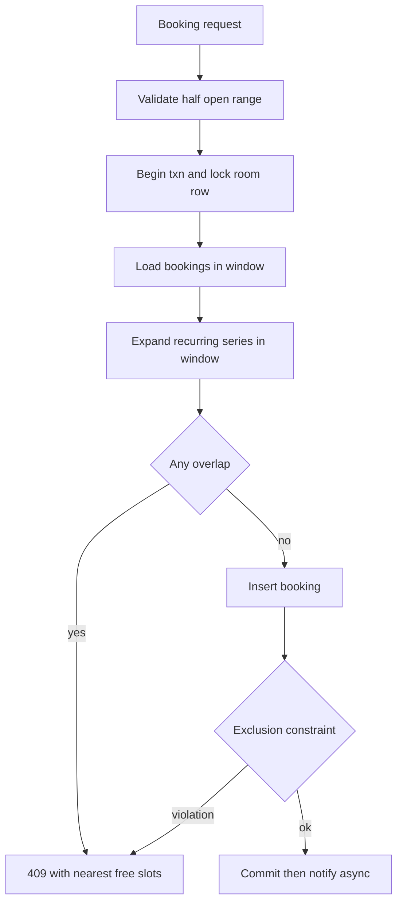

> **Why this gets asked, and what separates a Director answer.** The meeting-room scheduler is a T2, high-frequency LLD/OOD question (Microsoft, Google, Amazon, Meta), rising because it *resembles real work*. A junior candidate writes `Room`, `Booking`, `Scheduler` classes and calls it done. A Director answer does three things in the first ten minutes: makes **interval overlap a first-class abstraction** with boundary semantics stated; names the **check-then-book race** and picks a serialization point on purpose; and - the best move in the OOD set - spots the **recurrence trap**, names RRULE's complexity in one breath, *bounds it* (a generator, never materialized rows), and moves on. The question is small on purpose; what's measured is whether you find the places it bites.

### Learning objectives
- Run the RESHADED spine on an **LLD problem**, saying out loud how each step adapts - `D` becomes the interval/booking model, Evaluation becomes the double-booking race, the final `D` becomes "now make it Google Calendar."
- Make **`TimeRange` a value object** owning the half-open overlap predicate, so back-to-back meetings never false-conflict and the rule is defined exactly once.
- Prevent double-booking by **choosing a serialization point** - and defend *pessimistic* locking here when Ticketmaster chose optimistic CAS, because the contention shape is 1,000× different.
- Execute the **recurrence move**: store the rule, generate occurrences into a query window, edits as exceptions - and quantify why materializing is a trap.
- Sketch the scale-out honestly: shard by calendar, keep the room invariant single-shard, federate free/busy.

### Intuition first
Picture a **paper sign-up sheet taped to each meeting-room door**. Three properties of that sheet *are* the design. First, each line is a **time range**, and two lines conflict only if they genuinely overlap - a meeting ending at 10:00 and one starting at 10:00 share an instant but not the room, so the boundary rule must be explicit. Second, there is **one sheet and one pen per door**: the sheet itself serializes bookings for that room. Software must *recreate* that serialization deliberately, or two requests both read "3pm is free" and both write - the check-then-book race. Third, the weekly staff meeting is **not 52 pre-written lines** - it's a sticky note saying *"every Tuesday 10-11"* that you expand when checking a date. Recurrence is a **rule you evaluate, not rows you store**. Hold those three: explicit interval semantics, a per-room serialization point, rules-not-rows.

The contrast to pocket: this is the check-then-book race at **1/1,000th the contention** - which flips the right answer from optimistic CAS to a plain pessimistic lock. Same race, different shape, opposite choice.

---

## R - Requirements

> Adaptation: in an LLD problem, R is where you negotiate *which traps are in scope*. Asking "do meetings recur?" isn't scoping trivia - it's flushing out the deliberate ambiguity the interviewer planted.

**Clarifying questions I'd ask (with assumed answers):**
- *One building or a global company?* → **One company, single region**; "make it Google Calendar" is the evolution step.
- *Do meetings recur?* → **Yes** - the planted trap. Weekly standups, "every 2nd Thursday," edits to "this and all following." Scoped in, depth bounded.
- *Is double-booking a room ever acceptable?* → **No - the core invariant.** A room is physical. (Attendees double-booking *themselves* is allowed - calendars warn, they don't forbid.)
- *Back-to-back meetings?* → Must work - 9-10 and 10-11 in one room is the normal case, not a conflict. This forces the interval-boundary decision immediately.
- *Approvals, features, check-in/auto-release?* → Real; **cut**. Scope is book/find/cancel.

**Functional requirements:**
1. **Book** a room for a time range (single or recurring), atomically conflict-checked.
2. **Find** available rooms for a range, filtered by capacity/features.
3. **Cancel/edit** - for recurring series: *this occurrence*, *this and following*, or *all*.
4. **Free/busy view** of a room or person over a window.

**Explicitly cut (and said out loud):** invite fan-out and RSVP state, working-hours preferences, video-conf integration, approvals, check-in sensors. The core is **interval booking with recurrence under a no-double-booking invariant**.

**Non-functional requirements:**
- **Correctness over scale:** the no-double-book invariant holds under concurrency - a *correctness* problem wearing a small-scale costume.
- **Read-heavy, latency-sensitive reads:** availability queries dominate; sub-200 ms p99 so "find me a room" feels instant.
- **Recurrence must be unbounded:** "every Tuesday forever" is legal input; the design can't require an end date.
- **Time-zone and DST sane:** a 9am Mumbai weekly stays 9am Mumbai across DST changes elsewhere.

---

## E - Estimation

> Adaptation: in LLD, estimation's job is *inverted* - the math proves the problem is **small**, which tells you where the difficulty actually lives (invariants and model, not throughput) and licenses simple infrastructure. Skipping it means you can't justify why one Postgres is the right answer.

**Assumptions:** 50K employees, 2K rooms, each room booked ~12×/day, 250 working days/yr.

**Write QPS:** `2K rooms × 12 ÷ 86,400 ≈ 0.3 bookings/s`; even a 20× Monday-9am peak is **~6 writes/s**. A laptop handles this.

**Read QPS:** ~5 availability checks per booking plus passive views ≈ 50× writes → **~15 reads/s, peak ~300/s**. One replica absorbs it.

**Storage:** `24K bookings/day × 250 days × ~300 B ≈ 1.8 GB/yr` - ten years fits in RAM. **There is no scale problem.**

**The number that matters - the recurrence explosion.** Say 30% of meetings are recurring series with no end date. Materialize "weekly forever" just 10 years out: **520 rows per series**; 100K active series → **~50M phantom rows**, most edited or cancelled before they occur - and a true no-`UNTIL` rule can't be fully materialized *at all*. The rule itself is **~100 bytes**. That ratio is the entire argument for rules-not-rows, and the one estimation result this problem turns on.

**What estimation decided:** single relational primary + one replica; no sharding, no queue, no cache cleverness for v1. The hard parts are the **race** (rare per slot, certain at fleet scale) and the **model**. Spend the interview minutes there.

---

## S - Storage

> Adaptation: for LLD, S shrinks to one decision - *where does the invariant live?* - because volume already told us the store is small.

**Choice: a single relational store (Postgres).** Three reasons, each tied to a requirement: (1) the no-double-book invariant wants **transactions and row locks** - the serialization point comes free; (2) availability queries are **range scans over time**, served natively by a B-tree on `(room_id, start_time)`; (3) Postgres can express **interval-overlap exclusion as a database constraint** - a tripwire no application bug can route around.

- *Rejected - in-memory object model only:* the interview toy. The invariant then lives in application memory - two app instances silently double-book. One sentence covers it: "the in-memory `ConflictChecker` is a cache of the truth; the database holds the invariant."
- *Rejected - NoSQL KV:* nothing needs its scale (1.8 GB/yr), and you'd hand-build the transactions, range scans, and constraint Postgres gives free. Fashion over fit.

---

## H - High-level design

> Adaptation: H in an LLD problem is the **module decomposition plus the one critical path drawn end-to-end** - here, the check-and-reserve path, because that's where the race lives.

Modules, one job each: **Availability** (query free/busy), **Booking** (the transactional reserve path), **RecurrenceEngine** (rule → occurrences generator - the only code that understands RRULE), **Notification** (async).



**The path, compressed:** validate the range (half-open, end > start); open a transaction and **lock the room's row** - the pen-on-the-door, the deliberate serialization point; gather concrete bookings in the window *and* generated occurrences of any recurring series touching it; run the overlap predicate; insert or reject. The **exclusion constraint** is a second, independent tripwire at commit. Notifications go async after commit - a booking must never fail because email is slow.

**The shape to notice:** correctness is concentrated in one short transactional path; everything read-only (find rooms, free/busy) runs lock-free against a replica. That separation keeps the locked section cheap enough that pessimistic locking is a non-event.

---

## A - API design

> Adaptation: in LLD, A is the **interface sketch** - and the types in the signatures *are* design decisions. `TimeRange` and `RecurrenceRule` appearing as first-class types is the point.

```
interface RoomScheduler {
  findRooms(range: TimeRange, minCapacity, features) -> List<Room>
  book(roomId, organizer, range: TimeRange,
       rule?: RecurrenceRule) -> Booking | Conflict   // Conflict carries alternatives
  cancel(bookingId, scope: THIS | FOLLOWING | ALL)
  freeBusy(roomId, window: TimeRange) -> List<TimeRange>
}

value TimeRange {                    // half-open [start, end), UTC instants
  start, end
  overlaps(o) = start < o.end && o.start < end   // defined ONCE, here
}

value RecurrenceRule {               // freq, interval, byDay, until|count
  occurrencesIn(window, anchorTz) -> Iterator<TimeRange>   // a GENERATOR
}
```

**Design notes (each with the rejected alternative):**
- **`TimeRange` is a value object owning `overlaps()`.** *Rejected: raw `(start, end)` pairs compared inline.* The half-open predicate `a.start < b.end && b.start < a.end` is famously easy to fumble (`<=` makes back-to-back meetings conflict); one definition makes the boundary rule a *decision*, not a scattered accident.
- **`book` returns `Conflict` with alternatives.** *Rejected: boolean failure.* The caller's next question is always "then when/where?" - nearest free slots turn a retry loop into one round-trip.
- **`cancel` takes an explicit scope enum.** *Rejected: separate endpoints per case.* THIS/FOLLOWING/ALL is the canonical recurrence-edit semantics; the parameter forces the series-edit design now, not in production.
- **`occurrencesIn` is an iterator, never a full list.** *Rejected: `materialize() -> List`.* The signature itself encodes the recurrence decision - an unbounded rule can only be sampled through a window.

---

## D - Data model

> Adaptation: per the LLD framing, D *is the centerpiece* - the interval/booking model, and inside it, the recurrence decision.

**`rooms`** - `room_id`, capacity, features, floor. Static, tiny.

**`bookings`** - one row per **concrete** booking: `booking_id`, `room_id`, `range` (half-open timestamp range), `organizer`, nullable `series_id`. Indexed on `(room_id, start)`; carries the **exclusion constraint** - no two rows share a `room_id` with overlapping ranges. The store enforces the invariant even if every line of application code is wrong.

**`series`** - `series_id`, the **RRULE string**, the anchor occurrence's *local* start/end plus a **named time zone**. ~100 bytes representing infinity.

**`series_exceptions`** - `(series_id, occurrence_date, action)`: *cancelled* or *moved-with-new-range*. Single-occurrence edits are **overrides on the rule**, not mutations of materialized rows.

**The recurrence decision - the centerpiece, in one paragraph.** Recurring meetings are stored as a **rule plus exceptions; occurrences are generated on demand** into whatever window a query needs - never materialized as rows. Estimation made the case (one rule ≈ 100 bytes vs. 50M phantom rows; infinite rules can't be materialized at all), and edits seal it: "move all following Tuesdays to 11am" is a **series split** - terminate the old rule at the cut date, create a new series after it - two row writes instead of rewriting hundreds of materialized occurrences under concurrent readers. Full RRULE (RFC 5545) is a genuinely deep spec - BYSETPOS, week-start subtleties, DST edges - and the Director move is to **name that depth, bound it, delegate it**: *"I'd mandate a vetted RRULE library rather than hand-rolling expansion; my prior is the platform team wraps one library behind `occurrencesIn()` so exactly one module in the company understands RFC 5545."* Then move on. Fifteen minutes on BYDAY semantics is the too-deep failure mode.

**Time zones, the quiet sub-trap:** concrete bookings store UTC instants, but the series anchor stores **local wall-clock time + a named zone** - "9am every Tuesday" must stay 9am across DST shifts, so expansion converts to UTC per occurrence. Storing the anchor in UTC is the bug every homegrown calendar ships first.

<details>
<summary>Go deeper, RRULE mechanics and the expansion algorithm (IC depth, optional)</summary>

RFC 5545 RRULE grammar (the parts that matter): `FREQ` (DAILY/WEEKLY/MONTHLY/YEARLY), `INTERVAL` (every n-th period), `BYDAY` (e.g. `MO,WE`; with ordinals in monthly rules - `2TH` = second Thursday), `BYMONTHDAY`, `BYSETPOS` (select the n-th candidate after BY-filters - "last weekday of month" = `BYDAY=MO,TU,WE,TH,FR;BYSETPOS=-1`), `UNTIL` or `COUNT` (absence = infinite), `WKST` (week-start, changes `BYWEEKNO`/interval-weekly results). `EXDATE` lists skipped instants; real systems extend this with override rows (a moved occurrence = EXDATE + a standalone booking linked to the series).

Expansion sketch: start from the anchor (`DTSTART` in its named zone); iterate period-by-period applying FREQ/INTERVAL; within each period generate candidates from BY-rules; filter by BYSETPOS; convert each local candidate to UTC using the zone's rules *at that date* (this is where DST is handled - the local time is fixed, the UTC offset floats); subtract exceptions; yield occurrences intersecting the query window; stop at window end, `UNTIL`, or `COUNT`. Cost: a weekly rule over a 2-week availability window yields ≤2 occurrences in microseconds - expansion is never the bottleneck; correctness of the edge cases is, which is why you buy the library (e.g. lib-recur, rrule.js, dateutil) instead of writing it.

Why materialization also fails *operationally*, beyond row count: a horizon job that pre-writes N months of occurrences must re-run on every series edit (delete-then-rewrite under concurrent bookers), drifts when the job lags, and turns "what does this series mean?" into two sources of truth. If you ever do materialize (see the Evaluation), the rule stays canonical and rows are a disposable cache.

</details>

---

## E - Evaluation

> Adaptation: for LLD, evaluation means **attack your own design's invariant** - and here that means the double-booking race, plus the interaction between the race fix and unmaterialized recurrences.

**The race, stated precisely.** Two requests for Room 4, Tuesday 3-4pm, arrive 10 ms apart. Both check; both see "free"; both insert. Classic TOCTOU - and at fleet scale not rare: thousands of booking pairs per day land within seconds of each other on hot rooms, so "unlikely" is a guarantee of corruption. Check and reserve must be **one atomic unit** at some serialization point. Three candidates:

**Option A - pessimistic per-room lock (chosen).** The booking transaction locks the room's row first; check and insert happen inside the lock. Cost: bookings for one room serialize. Run the number: the locked section is ~5 ms of indexed reads against ~25 bookings/room/day - **contention is effectively zero**, so the lock convoy that disqualified pessimistic locking in Ticketmaster (Ticketmaster, 33K req/s on one event) cannot form at 6 writes/s across 2,000 rooms. Same race, contention three orders of magnitude apart, **opposite choice** - making that contrast explicit is the strongest single sentence in this interview.

**Option B - optimistic insert + constraint detection.** Insert blind; the exclusion constraint rejects overlaps; map the violation to a 409. Correct and lock-free - but it only sees **materialized** rows. A rule-only occurrence is invisible to it, so optimistic-only either forces materialization (the trap we refused) or leaves a hole.

**Option C - application-level mutex (in-service or Redis).** Works on one node; wrong the moment you run two instances - or it adds a distributed-lock dependency to dodge a row lock the database already offers. Complexity without benefit.

**Decision: A as the mechanism, B's constraint as a tripwire.** The lock serializes check-and-reserve *including expansion of recurring series in the window*, so unmaterialized occurrences are checked correctly; the constraint independently guards concrete rows against any path that forgets the lock (a migration, a bulk importer). Each layer covers the other's blind spot. *Trade-off accepted:* per-room serialization caps per-room throughput - irrelevant here; I'd revisit only if a "room" became a virtual high-contention resource, where the CAS is the escape hatch.

**Second-order check - recurring-vs-recurring conflicts:** expand both rules over a **bounded validation horizon** (say 12 months) and intersect. Two weekly rules either collide within weeks or never; "beyond the horizon I accept the residual risk and re-validate as it rolls" beats pretending to check infinity.

**Remaining NFR re-check:** availability reads hit a replica lock-free; recurrence edits are 2-row series splits; DST handled at the anchor; the invariant lives in two independent layers. The design holds.

<details>
<summary>Go deeper, the Postgres mechanics of the lock and the tripwire (IC depth, optional)</summary>

Range type and constraint: store the interval as `tstzrange(start_ts, end_ts, '[)')` - the `[)` half-open bound encodes the back-to-back rule in the type itself. The tripwire: `ALTER TABLE bookings ADD CONSTRAINT no_double_book EXCLUDE USING gist (room_id WITH =, range WITH &&);` - a GiST index where any two rows with equal `room_id` and overlapping (`&&`) ranges reject the second insert with a serialization-safe error you map to 409.

The lock: `SELECT ... FROM rooms WHERE room_id = $1 FOR UPDATE` at the top of the booking transaction pins the room row; concurrent bookers for the same room queue (millisecond waits at this contention), while bookings for *different* rooms proceed in parallel - the lock granularity is exactly the invariant's granularity. The conflict scan inside the lock: `SELECT 1 FROM bookings WHERE room_id = $1 AND range && $2 LIMIT 1` (GiST-indexed), plus expansion of series rows whose rule could intersect the window (filter series by `room_id`, expand via the library, intersect in app code). Keep the transaction free of network calls - notification fan-out strictly after commit - so the lock hold time stays ~5 ms.

If you ever migrate to a store without exclusion constraints (MySQL), the lock remains the mechanism and you emulate the tripwire with a post-insert overlap re-check inside the transaction; the design's correctness never depended on the constraint alone.

</details>

---

## D - Design evolution

> Adaptation: the LLD curveball's evolution step is the altitude test in reverse - "now make it Google Calendar." Show you know **where the single-node design stops working**, evolve it without panic, and refuse to gold-plate v1 for a scale it doesn't have.

**What breaks first, in order:**

**1. One company → millions of tenants: shard by calendar.** A room's bookings are a calendar; a person's are a calendar. **Partition by `calendar_id`** - every hard operation (conflict-check a room, render a week view) stays **single-shard**, and the per-room lock survives sharding untouched. *Rejected: sharding by time* - it splits every calendar across shards and makes "current week" a hot partition under all load.

**2. Meetings span calendars: refuse the distributed transaction.** A 10-person meeting touches 11 calendars on many shards; the junior reflex is 2PC across all of them. The Director observation: **only the room carries a hard invariant.** Book the room transactionally on its shard (the v1 path, unchanged), then **fan out attendee copies asynchronously** via a queue - attendee calendars may show conflicts, so eventual consistency there is *semantically correct*, not a compromise. Small CP core, everything else AP - the boundary discipline in a new place.

**3. "Find a time for these 10 people": federated free/busy.** Each shard serves a compact **free/busy projection** (busy intervals only - privacy comes free); an aggregator intersects 10 small interval lists in memory, cached for hot users. Staleness of seconds is fine because **the room booking re-validates transactionally anyway** - projection is a hint, transaction is the truth (the seat-map pattern, verbatim). *Rejected: scatter-gather for full calendars* - slow, and over-shares meeting details.

**4. Scale numbers, to stay honest:** 500M users × ~15 events/week ≈ **12K bookings/s sustained** - a real write load, but trivial per calendar-shard; ~300 B/event ≈ **100+ TB/yr**, finally justifying the distributed store v1 didn't need. The *model* - TimeRange, rules-not-rows, per-resource serialization - survives unchanged; only the deployment grows.

**Where I'd delegate (the explicit Director move):** RRULE expansion to a vetted library wrapped by the platform team; the free/busy aggregation SLA to the serving team - *"my prior is precomputed projections refreshed on write, since meeting-time suggestions tolerate seconds of staleness"*; offline/mobile sync (a CRDT-adjacent problem - the capstone) to a dedicated effort rather than hand-waving it in.

---

## Trade-offs table - the pivotal decisions

| Decision | Option A | Option B | Option C | Use when... |
|---|---|---|---|---|
| **Booking concurrency** | **Pessimistic per-room row lock** | **Optimistic insert + exclusion-constraint catch** | App-level / distributed mutex | **A** when contention is low and unmaterialized state (recurrences) must join the check - our case. **B** as the tripwire layer, or primary when all state is concrete rows. **C** rarely - only when no transactional store sits under you. |
| **Recurrence storage** | **Rule + exceptions, generate on read** | Full materialization to rows | Bounded-horizon materialization + roller job | **A** as default - 100 B vs. unbounded rows, 2-row edits (our choice). **B** never at scale. **C** when a downstream consumer (search, constraint) genuinely needs concrete rows - keep the rule canonical, rows disposable. |
| **Conflict-check structure** | **DB range index + overlap scan** | In-memory interval tree per room | Time-slot bitmap per room-day | **A** - the index *is* the interval structure, shared with the invariant (our choice). **B** the classic whiteboard answer; fine as a cache, never as truth. **C** when slots are fixed-granularity (15-min grid) and you want O(1) checks - loses arbitrary-precision ranges. |

---

## What interviewers probe here (Director altitude)

- **"Two requests book the same room for the same slot."** - *Strong:* names TOCTOU unprompted; the serialization point (room-row lock), the check inside it, the constraint as independent tripwire; contrasts 5.13 - same race, 1,000× less contention, so pessimistic wins. *Red flag:* check-then-insert with no atomicity, or a distributed lock service at 6 writes/s.
- **"The CEO books a daily standup with no end date. What do you store?"** - *Strong:* ~100 bytes - the rule and a zone-anchored start; occurrences generated through query windows; edits as exceptions or series splits; names RRULE's depth and delegates it. *Red flag:* inserting N rows, or a cron pre-writing occurrences forever.
- **"9-10 and 10-11 in the same room - conflict?"** - *Strong:* no - half-open intervals, predicate stated, owned by `TimeRange`, decided once. *Red flag:* hesitation, or `<=` in the predicate.
- **"Now make it Google Calendar."** - *Strong:* shard by calendar; room invariant stays single-shard; attendee copies async because only the room is CP; free/busy as a federated hint with transactional re-validation. *Red flag:* 2PC across every attendee's shard, or "the single Postgres scales horizontally."
- **"What does this cost, and where's the operational risk?"** - *Strong:* a few hundred dollars/month of managed Postgres - the risk isn't infra, it's correctness bugs (boundaries, DST) and the on-call burden of a hand-rolled RRULE engine, which is why the library is mandated. *Red flag:* a multi-region fleet for 1.8 GB/yr.

---

## Common mistakes

- **Closed intervals.** `start <= other.end` makes every back-to-back meeting a conflict. Half-open `[start, end)`, predicate defined once in a value object.
- **Materializing recurrences.** Pre-writing occurrence rows explodes storage, can't represent infinite rules, and turns one edit into hundreds of row mutations. Store the rule; generate.
- **Check-then-book without a serialization point.** A read followed by a write is a race regardless of QPS; at fleet scale "rare" means "daily."
- **Treating attendee calendars like room calendars.** Only the physical room carries a hard invariant; forcing strong consistency across 10 attendees' shards builds a distributed transaction nobody asked for.
- **UTC-anchored recurrence.** A recurring meeting follows *wall-clock* time in its home zone; storing the anchor as a UTC instant shifts it an hour at every DST boundary.

---

## Interviewer follow-up questions (with model answers)

**Q1. Concretely, what stops two assistants double-booking the boardroom for Friday 3pm?**
> *Model:* The booking transaction locks the boardroom's row before checking - check and insert are atomic per room; the second assistant's transaction waits ~5 ms, re-checks, sees the conflict, gets a 409 with alternative slots. Inside the lock I check concrete bookings *and* expand any recurring series intersecting the window, so rule-only occurrences are protected too. Independently, an exclusion constraint on `(room_id, overlapping range)` rejects overlaps at the storage layer - a tripwire for any path that bypasses the lock. Pessimistic was deliberate: at ~25 bookings/room/day there's no convoy to fear - the opposite of Ticketmaster, where 33K req/s made optimistic CAS mandatory. Same race; the contention shape picks the tool.

**Q2. A user edits a weekly series: "move this and all following meetings to 11am." What happens in the data?**
> *Model:* A series split, two writes: terminate the existing rule with an UNTIL at the cut date; create a new series anchored at the first moved occurrence at 11am. Past occurrences keep their history; future ones follow the new rule. Single-occurrence edits are lighter - an exception row (cancelled, or moved with an override range). The alternative, mutating materialized occurrence rows under concurrent readers, doesn't exist because we never materialized; the worst edit in the product is two rows. One flag: the new anchor stores local time plus the named zone, so the series still tracks wall-clock time across DST.

**Q3. Your single Postgres is now serving a 500M-user calendar product. First three changes?**
> *Model:* (1) Shard by `calendar_id` - rooms and people are calendars; every invariant-bearing operation stays single-shard and the room lock carries over unchanged. (2) Split the meeting write path: book the room transactionally on its shard, fan out attendee copies through a queue - only the room is CP; attendee views are eventually consistent *by product semantics*. (3) Federated free/busy: each shard exposes a compact busy-intervals projection; an aggregator intersects them for "find a time," re-validated at booking. At ~12K writes/s and 100+ TB/yr the deployment changes completely - but TimeRange, rules-not-rows, and per-resource serialization survive intact: the evidence the v1 model was right.

---

### Key takeaways
- **Interval overlap is a first-class abstraction:** half-open `[start, end)`, predicate `a.start < b.end && b.start < a.end`, owned by a `TimeRange` value object, defined exactly once - back-to-back meetings are the test case.
- **The double-booking race needs a chosen serialization point:** per-room row lock around check-and-reserve, exclusion constraint as independent tripwire. Pessimistic wins *here* because contention is ~zero; the CAS wins under a flash crowd - the contention shape picks the tool.
- **The recurrence trap is the Director move:** name RRULE's depth, bound it - rule (~100 B) + exceptions, generator expansion into query windows, edits as series splits - delegate the engine to a vetted library, move on. Never materialize the infinite.
- **Estimation proves smallness:** ~6 writes/s peak, ~2 GB/yr - the difficulty is invariants and model, not throughput, so one Postgres is the *defensible* choice, not the lazy one.
- **Evolution to Google Calendar keeps the model:** shard by calendar, room invariant stays single-shard CP, attendee fan-out and free/busy go async/AP - small strong core, big eventual edge, again.

> **Spaced-repetition recap:** Meeting scheduler = **intervals + a race + a trap**. `TimeRange` half-open, overlap predicate defined once. Check-then-book is TOCTOU: serialize per room (row lock) + exclusion-constraint tripwire - pessimistic because contention ≈ 0 (contrast 5.13). Recurrence: **rule + exceptions, generator, never materialized rows**; edits = series splits; anchor in local time + zone. Scale-out: shard by calendar; only the room is CP; attendees fan out async; free/busy is a federated hint re-validated at booking.

---

*End of Lesson 7.6. The scheduler is Ticketmaster inverted: the same check-then-book race at a contention level where the "wrong" answer there (a plain pessimistic lock) becomes the right answer here - proof that the framework, not the cached answer, transfers. Its signature move: recognize a bounded-depth trap (RRULE), name it, contain it behind a generator interface, and spend the reclaimed minutes on the invariant that matters.*
