### Learning objectives
- State the three **ingestion modes**, full batch load, incremental load, and **change data capture (CDC)**, and pick the right one from the data's volume, mutability, and freshness requirement rather than reaching for streaming by default.
- Explain why **log-based CDC** (reading the database's WAL/binlog/redo log, e.g. Debezium) is the load-bearing technique: it captures *every* insert, update, and delete at sub-second-to-seconds lag with **near-zero source impact**, and reject **query-based CDC** (polling an `updated_at` column) because it misses deletes and adds load to the very database you're trying not to disturb.
- Defend **ELT over ETL** at architecture altitude: land the **raw** copy first and transform *in-warehouse*, because cheap object storage plus a powerful warehouse make the raw layer **rebuildable** and decouple the source from your business logic, where transform-first throws the raw away and couples the two.
- Make the **buy-vs-build connector** call with numbers: managed connectors (Fivetran/Airbyte Cloud) are fast to stand up but priced per **monthly active row (MAR)** that balloons at high volume; self-hosted Debezium + Kafka Connect is cheap per row at scale but you operate it.
- Design the **ingestion contract**: idempotent loads, schema-drift handling at the boundary, and ordering, so a re-run or a late batch never corrupts the landing zone, the property that makes everything downstream survivable.

### Intuition first
Getting data **into** the platform is the loading dock, not the warehouse floor. The foundations lesson gave you the whole building, the cash registers (OLTP) up front, the analyst's desk (OLAP) upstairs. This lesson is about the one job that breaks most often in practice: **getting every receipt off every register and onto the dock, reliably, without slowing the registers down.** It sounds like the boring part. It is the part that pages you at 3 a.m.

There are three ways to do it. **Full load** is "photocopy the entire register tape every night", simple, but at a million receipts it's wasteful and slow, and last night's photo is a day stale. **Incremental load** is "only copy receipts newer than the last one I grabbed", you ask the register *"what changed since 2 a.m.?"* every few minutes. Cheaper, but it has a quiet, fatal blind spot: if a cashier **voids** a receipt, there's no "newer" receipt to copy, the void is a *deletion*, and your dock never hears about it. Your analyst keeps counting a sale that no longer exists. The third way fixes exactly this: **change data capture** taps the register's own internal audit roll, the tape every register already writes to recover itself after a crash, and **every** event, every sale, every correction, every void, flows off that tape in order, the instant it happens, without anyone asking the register anything.

That audit roll is the database's **write-ahead log**, and tapping it is **log-based CDC**. The register doesn't slow down because you're reading a tape it was writing anyway, not interrogating it. You catch deletes because deletes are *on* the tape. And it's fresh because you're reading the tape as it's written, not polling on a timer. Hold that image, **read the log the database already keeps, don't interrogate the database**, and the central decision of this lesson is made.

### Deep explanation

**Ingestion is the "EL" of ELT, and it is where platforms bleed.** The foundations lesson framed the platform as a continuously-rebuilt projection; this lesson is the *rebuild's* first hop, **Extract** from the source and **Load** into the landing zone, before any **Transform**. The Director-altitude statement: *ingestion is the most common source of operational pain in a data platform, not because the idea is hard, but because it sits on the boundary between two teams' systems and fails silently, a stale connector, a missed delete, an unhandled schema change, and the dashboard stays confidently wrong (the analytical-hallucination failure mode).* You design ingestion for **completeness, low source impact, and rebuildability**, in that order, and everything below is in service of those three.

**The three ingestion modes, and how to choose.** This is the first decision, made per source from volume, mutability, and freshness:

- **Full load (snapshot).** Copy the entire table every run. *Use when* the table is small (a few hundred MB, a `countries` or `product_categories` dimension) or has no reliable change-marker. *Cost:* re-reads everything every time, so it's linear in table size and gives at-best run-interval freshness (nightly = a day stale). At a 500 GB orders table, a nightly full load is hours of scan and a day of staleness, untenable.
- **Incremental (query-based / batch delta).** Pull only rows changed since a high-water mark, `WHERE updated_at > :last_run`. *Use when* the source has a trustworthy, indexed `updated_at` and you can **tolerate missing hard deletes**. *Cost:* runs a query against the **source database** on every poll (load you didn't want), and, the fatal gap, a row physically `DELETE`d leaves no trace for the next poll to find, so deletes silently desync. This is *query-based CDC* and it's the seductive trap, simple to write, wrong in a way you discover months later.
- **Change data capture (log-based).** Stream every row-level change, insert, update, **and delete**, by reading the database's transaction log. *Use when* you need completeness (deletes matter), low source impact, and seconds-fresh data, which, for any mutable transactional table feeding the platform, is most of the time. *Cost:* operational complexity, you run (or buy) a connector, manage offsets, and handle schema changes, and you re-teach yourself the log's quirks per engine.

**Log-based CDC is the technique, and it works by reading the same log replication already reads.** Every durable database writes a **write-ahead log** before it touches the table, Postgres calls it the **WAL**, MySQL the **binlog**, Oracle the **redo log**, SQL Server its transaction log. This log is the database's own crash-recovery and *replication* mechanism: a follower replica becomes consistent precisely by replaying the leader's log. **CDC is just another reader of that log.** A tool like **Debezium** (running on Kafka Connect) connects as a logical-replication client, reads the stream of committed changes, and emits one structured event per row change, `{op: "u", before: {...}, after: {...}, source: {lsn, ts}}`, onto a Kafka topic. The headline properties, each the reason you pick it:

- **Completeness.** Inserts, updates, *and* deletes are all in the log because the database needed them there to recover, so CDC sees the void the poller misses. Even hard deletes appear as a delete event.
- **Low source impact.** You're reading a log the database writes regardless, not running aggregate `SELECT`s that compete with production traffic. The marginal cost to the source is the log reader's connection and retained log segments, not query load. Contrast the poller, which adds a real query to the OLTP box every interval (the "never starve point traffic" rule).
- **Freshness.** Changes flow as they commit, so lag is **sub-second to a few seconds** end to end, set by the connector's batching and the transport, not a poll interval.
- **Ordering and offsets.** The log is ordered (per the engine's LSN/GTID), and the connector tracks its **offset** (the LSN it last read), so a restart resumes exactly where it left off, the same durable-position idea as a Kafka consumer's committed offset.

**Reject query-based CDC for completeness and source impact; reject it *not* for simplicity.** The honest trade: query-based polling is genuinely simpler to stand up (a `SELECT … WHERE updated_at >` and a saved timestamp, no replication slot, no log reader). You **reject** it anyway when the source has hard deletes or mutable rows that matter, because (a) it *cannot* see physical deletes, the single most common silent-desync bug in ingestion, (b) it leans on a perfectly-maintained `updated_at` that application bugs and bulk updates routinely break, and (c) it adds query load to the database you were told not to disturb. You **keep** it only for genuinely append-only sources (an immutable events table that never deletes) or tiny dimensions where a full load is even simpler. The Director framing: *query-based CDC trades a fatal correctness gap for a small setup saving, so it's acceptable only where the gap provably can't occur.*

**ELT beat ETL because storage got cheap and warehouses got powerful, and the win is rebuildability.** The old pattern, **ETL**, **E**xtract, **T**ransform (in a separate engine), **L**oad the *finished* result, made sense when warehouse storage was expensive: you couldn't afford to keep raw data, so you transformed it down to just what BI needed and threw the rest away. Two consequences hurt: you **lost the raw** (a new question or a logic bug meant re-extracting from a source that may have changed), and you **coupled business logic to the ingestion path** (the transform lived in brittle, hard-to-test pipeline code). **ELT** inverts the last two letters: **L**oad the **raw** copy first into cheap object storage (S3/GCS, pennies/GB-month), **then T**ransform *in the warehouse* with SQL. Why it won, at architecture altitude:

- **The raw layer is rebuildable.** Because you retain the untransformed landing copy, every downstream table is reproducible by re-running SQL over raw, *idempotent recomputation over retained raw*, the exact property the foundations lesson made non-negotiable. A transform bug is a re-run, not a re-extraction from a moved source.
- **Source and logic decouple.** Ingestion's only job becomes "land raw faithfully"; all business meaning moves to versioned, tested, in-warehouse transforms (dbt). The two evolve independently.
- **Cheap storage makes "keep everything" the default.** Object storage at pennies/GB-month removes the original reason to transform-on-the-way-in. You keep raw history and let elastic warehouse compute do the T on demand.

You **reject ETL (transform-first)** for new analytical platforms because it discards the rebuildable raw and couples logic to pipelines; you'd still reach for transform-on-ingest only when you're *legally required* to drop raw (PII you may not land) or the raw is so enormous that landing it is genuinely uneconomical, both narrow.

**The EL tooling layer is a buy-vs-build call, and the numbers decide.** Two ways to run the EL:

- **Managed connectors, Fivetran / Airbyte Cloud.** Hundreds of pre-built source connectors, schema-drift handling, and CDC included; you configure a source and a destination and it runs. *Cost shape:* priced per **monthly active row (MAR)**, a row that changed in the month, so the bill scales with **change volume**. Cheap at low/medium volume and fast to value (days, not a quarter); it **balloons at high volume**, a few hundred million changed rows/month can run into five or six figures monthly, and you don't control the unit economics.
- **Self-hosted, Debezium + Kafka Connect.** Open-source log-based CDC onto Kafka, then a sink into the lake. *Cost shape:* roughly fixed **infrastructure + engineering operations**, the connect cluster, the Kafka it rides on, and the on-call to run them. Cheap per row at scale (you're paying for boxes, not rows), but you own replication slots, connector failures, schema-registry, and upgrades.

The Director-altitude call: *buy connectors to get to value fast and while change volume is modest, build (Debezium) when per-row pricing crosses your fully-loaded ops cost, typically at high and steady change volume.* You **reject "build everything from day one"** because it spends scarce platform-engineering time re-implementing solved connectors before you know which sources matter; you **reject "buy forever"** once MAR pricing on a high-churn source exceeds what a small CDC team costs to operate. The crossover is an arithmetic question (MAR × rate vs. infra + a fraction of an engineer), not a religious one, and you compute it.

**Schema drift is an ingestion concern, and the contract handles it.** The source team adds a column, renames one, widens a type, and a brittle pipeline breaks (the 13.1 schema-drift failure). At ingest you decide the **drift policy** explicitly: additive changes (new column) **auto-propagate** into the landing schema (managed tools and lake formats handle this); breaking changes (drop/rename/type-narrow) should **fail loud or quarantine**, not silently null a downstream metric. The deeper fix is a **schema contract** at the source boundary, but at minimum ingestion must *detect* drift and surface it rather than absorb it wrongly.

**Idempotent loads are the property that makes re-runs safe.** Ingestion *will* re-run, a connector restart replays from the last offset, a batch is re-triggered after a failure, a backfill replays a month. If a re-run **duplicates** rows or **double-applies** a delete, the landing zone is corrupt and every downstream number is wrong. So the load is **idempotent by design**: CDC events carry the source position (LSN) and a primary key, and the landing layer applies them as an **upsert/merge keyed on (pk, position)**, so replaying the same event is a no-op. The append-only "bronze" pattern (land every raw event immutably, dedupe in the T) is the common shape; the contract is *the same input produces the same landing state no matter how many times it's applied*, the idempotent-recompute discipline from 13.1 and 9.7, now at the ingest boundary. The full exactly-once streaming pipeline that builds on this is **the** job, not this lesson's.

Go deeper — log-based CDC mechanics and the snapshot-plus-stream handoff (IC depth, optional)

- **Logical decoding / replication slots (Postgres).** Debezium creates a **replication slot** and reads the WAL via logical decoding, which emits row-level change events (not physical page diffs). The slot guarantees Postgres **retains WAL** until the consumer has read past it, which is the operational trap: if the connector is down for a long time, the slot pins WAL and the **source disk fills**. You monitor slot lag and set retention bounds. MySQL's analog is a replication client reading the **binlog** in `ROW` format (not `STATEMENT`, which logs the SQL, not the row changes); Oracle uses LogMiner / redo, and historically needed supplemental logging enabled.
- **The initial snapshot problem.** CDC only has changes *from now on*; the existing table state isn't in the recent log. So a connector does an **initial snapshot** (a consistent full read of the table) and then **switches to streaming** from the LSN captured at snapshot start, stitching the two so no change is lost or double-counted at the boundary. Getting this handoff exactly-once is the connector's hard part, and a reason to buy rather than re-implement it. Incremental/concurrent snapshots (Debezium's signal-based approach) let large tables snapshot without one giant blocking read.
- **Tombstones for deletes.** A delete emits a change event with `after: null` plus, in Kafka, an optional **tombstone** (null-value record on the key) so a log-compacted topic actually drops the key. Downstream merge logic must treat a delete event as a delete, not ignore a null `after`.
- **Transaction boundaries and ordering.** Events carry transaction metadata and a monotonic source position (LSN/GTID); ordering is guaranteed **per source position**, and if you key the Kafka topic by primary key you preserve per-row order (the per-partition ordering of 9.13). Cross-table transactional consistency at the consumer is harder and usually deferred to the T layer.

### Diagram: log-based CDC flow, WAL → Debezium → Kafka → lake

```mermaid
flowchart LR
    subgraph SRC["Source OLTP (truth)"]
      DB[("Postgres / MySQL")]
      WAL["WAL / binlog<br/>(write-ahead log)"]
      DB -->|writes log<br/>before tables| WAL
    end
    WAL -->|logical replication<br/>reads the log| DBZ["Debezium<br/>(Kafka Connect)<br/>insert · update · DELETE"]
    DBZ -->|one event per<br/>row change, ordered| K["Kafka topic"]
    K -->|sink connector<br/>idempotent upsert| BRZ[("Bronze / raw lake<br/>S3 · retained · rebuildable")]
    BRZ -->|T happens here| DBT["dbt transforms"]
    POLL["Query-based poller<br/>SELECT … WHERE updated_at >"]:::bad -.->|adds query load<br/>MISSES deletes| DB
    style WAL fill:#1f6f5c,color:#fff
    style DBZ fill:#e8a13a,color:#000
    style K fill:#2d6cb5,color:#fff
    classDef bad fill:#7a1f1f,color:#fff
```

### Worked example: Netflix-style CDC off the operational store
Take a streaming service's **operational Postgres** holding the `subscriptions` table, plan changes, upgrades, cancellations, and the platform needs a fresh, *complete* picture for revenue, churn, and entitlement analytics. One source table, and every decision in this lesson surfaces.

- **Mode.** Subscriptions are **mutable and deletable** (a cancellation may be a status update; a GDPR erasure is a hard `DELETE`), and churn analytics is wrong if it misses a cancellation. So **log-based CDC**, not a poller. *Rejected: query-based on `updated_at`*, a hard-deleted row for a GDPR request would never appear, leaving a "live" subscriber who legally no longer exists, the exact missed-delete trap, and a *rejected full nightly load* of a large table is both day-stale and a heavy scan.
- **Pipeline.** **Debezium** on Kafka Connect reads the Postgres **WAL** via a logical replication slot, emits an event per row change to a Kafka topic keyed by `subscription_id` (per-row ordering), and a sink connector lands raw events **idempotently** (merge on `subscription_id` + LSN) into the **bronze** lake (S3). **dbt** builds the `subscriptions_current` and `churn_daily` marts from bronze.
- **Freshness.** CDC gives **seconds** of lag, so entitlement and near-real-time churn views are live; the board's monthly revenue number tolerates a day and reads the same bronze, *one ingestion path, two freshness consumers*, no second pipeline needed (contrast the 13.1 example where two *freshness needs* warranted two paths, here one CDC stream serves both).
- **Buy vs build.** At, say, **50M subscription changes/month**, Fivetran's MAR pricing is real money and rising with the subscriber base; the team already runs Kafka for the product, so **self-hosted Debezium** is the cheaper steady state, and the operational cost (slot monitoring, connector on-call) is justified by the volume. Had this been a low-churn internal app, *buy Fivetran* would win on speed-to-value, the call flips with volume.
- **The traps handled.** A **replication slot** left pinned by a stalled connector would fill the Postgres WAL disk, so slot lag is monitored and alerted; an **initial snapshot** seeds existing subscribers before streaming begins, stitched at the snapshot LSN so nothing is lost or doubled; **schema drift** (a new `promo_code` column) auto-propagates additively, while a column drop fails loud rather than nulling churn silently.

The number a Director carries out: *complete (deletes included), seconds-fresh, one CDC path feeding both live and board views, rebuildable from retained raw, and self-hosted because at 50M changes/month we're past the buy crossover.*

### Trade-offs table: ingestion mode and tooling

| Decision | Option A | Option B | Option C | Use when… |
|---|---|---|---|---|
| **Ingestion mode** | **Log-based CDC** (every change incl. deletes; seconds-fresh; low source impact; operationally complex) | **Query-based / incremental** (`updated_at` poll; simple; *misses deletes*; adds DB load) | **Full load / snapshot** (copy all; simplest; wasteful; run-interval stale) | **A** for any mutable transactional table where deletes matter and you need freshness (the common case). **B** only for genuinely append-only sources or where deletes provably can't occur. **C** for small dimensions or sources with no change-marker. |
| **Transform placement** | **ELT** (land raw first, transform in-warehouse; rebuildable; decoupled) | **ETL** (transform-first, load finished; loses raw; couples logic) | — | **A** as the default for analytical platforms with cheap storage. **B** only when legally barred from landing raw, or raw is uneconomical to store. |
| **EL tooling** | **Managed (Fivetran/Airbyte Cloud)** (fast, hundreds of connectors; per-MAR pricing that balloons at volume) | **Self-hosted (Debezium + Kafka Connect)** (cheap per row at scale; you operate it) | **Hybrid** (buy long-tail SaaS sources, build high-volume DB CDC) | **A** to get to value fast and while change volume is modest. **B** when per-row pricing crosses fully-loaded ops cost (high, steady volume). **C** the common real-world steady state. |

The Director move is choosing the mode from **mutability + deletes + freshness**, defaulting to **ELT** for rebuildability, and treating buy-vs-build as **MAR × rate vs. infra + ops** arithmetic, not dogma.

### What interviewers probe here
- **"How do you get this operational data into the platform?"**, *Strong signal:* names the three modes, picks **log-based CDC** for mutable tables because it captures deletes at low source impact and seconds-freshness, and explicitly says why polling `updated_at` is wrong (misses hard deletes, adds DB load). *Red flag:* "nightly batch dump" with no thought to deletes, freshness, or the load it puts on production, or "just query the source", the 13.1 starve-the-OLTP mistake.
- **"Why CDC instead of polling a timestamp column?"**, *Strong:* completeness (deletes are *in* the log), low source impact (reading a log replication reads anyway, 2.4, not running queries), and freshness; concedes polling is simpler and acceptable only for append-only sources. *Red flag:* doesn't know deletes are the gap, or thinks CDC and `updated_at` polling are interchangeable.
- **"ETL or ELT, and why?"**, *Strong:* ELT, land raw first so the platform is **rebuildable** and business logic decouples from ingestion into versioned transforms; ties the shift to cheap object storage + powerful warehouses. *Red flag:* transform-on-ingest by reflex, with no awareness that it discards the rebuildable raw.
- **"Build CDC yourself or buy a connector?"**, *Strong:* a numbers answer, buy (Fivetran) for speed and modest volume, build (Debezium) when MAR pricing crosses ops cost at high steady volume; states the crossover as arithmetic and often lands on hybrid. *Red flag:* an absolute ("always build", "always buy") with no volume or cost reasoning, the unquantified-decision tell.
- **"Your connector restarts and replays events, what happens to the data?"**, *Strong:* idempotent loads, events keyed on (pk, LSN) applied as an upsert/merge so a replay is a no-op, plus the rebuildable bronze; defers the full exactly-once pipeline to the end-to-end design. *Red flag:* assumes replay is harmless or, worse, that it duplicates rows and corrupts downstream.

The through-line at Director altitude: ingestion is the failure-prone boundary, so you design it for **completeness, low source impact, and rebuildability**, default to log-based CDC + ELT, and delegate the connector internals (replication-slot tuning, snapshot stitching) with a stated prior, *"the data-eng team owns Debezium slot monitoring and the snapshot handoff; my prior is self-hosted CDC given our change volume, and we benchmark the Fivetran bill against it quarterly."*

### Common mistakes / misconceptions
- **Polling `updated_at` and calling it CDC.** Query-based incremental load **cannot see hard deletes** and leans on a perfectly-maintained timestamp; it silently desyncs the moment a row is physically deleted, and it adds query load to the source you were told not to disturb. Log-based CDC reads the change log itself and catches deletes.
- **Defaulting to a full nightly load.** It re-scans the whole table every run (linear cost, day-stale) and ignores deletes-vs-updates entirely; reserve it for tiny dimensions or sources with no reliable change-marker, not a 500 GB orders table.
- **Transform-on-ingest (ETL) by reflex.** Transforming before you land **throws away the raw**, so a logic bug or a new question means re-extracting from a source that may have moved, and couples business logic to brittle pipeline code. Land raw (ELT), transform in-warehouse, stay rebuildable.
- **Treating buy-vs-build as a belief.** "Always build" wastes platform-engineering time re-implementing solved connectors; "always buy" lets MAR pricing balloon past a small CDC team's cost at high volume. It's `MAR × rate` vs. `infra + ops` arithmetic, computed per source, and usually lands on hybrid.
- **Non-idempotent loads.** If a connector replay or a re-triggered batch duplicates rows or double-applies a delete, the landing zone is corrupt and every downstream metric is wrong. Make loads idempotent (merge on pk + source position) so a replay is a no-op.

### Practice questions

**Q1.** A team proposes ingesting the production `orders` table into the warehouse by running `SELECT * FROM orders WHERE updated_at > :last_run` every five minutes. What breaks, and what would you do instead?
> *Model:* Two failures. First, **hard deletes are invisible**, a cancelled or GDPR-erased order is physically `DELETE`d, has no newer `updated_at`, and never appears in the delta, so the warehouse keeps counting an order that no longer exists, the silent-desync trap. Second, every poll runs a **query against the production OLTP database**, adding load to the box serving customers (the 13.1 "never starve point traffic" rule) and leaning on an `updated_at` that bulk updates and app bugs routinely break. Instead I'd use **log-based CDC** (Debezium reading the Postgres WAL): it captures inserts, updates, *and* deletes from the log the database writes anyway, at seconds-freshness and near-zero source impact, lands them idempotently in a raw bronze layer, and transforms in-warehouse (ELT). Polling is acceptable *only* if `orders` were genuinely append-only (no deletes, no in-place updates), which it isn't.

**Q2.** Estimate when self-hosted Debezium beats Fivetran for a source with 200M changed rows/month, and name the rejected option on each side.
> *Model:* Fivetran prices per **monthly active row**; 200M MAR is well into volume-pricing territory, plausibly tens of thousands of dollars/month and rising with the business (exact rate varies, but it's clearly five-figures-plus at this scale). Self-hosted Debezium + Kafka Connect costs roughly fixed **infra + ops**, a small connect/Kafka footprint plus a fraction of a data engineer's on-call, call it a few thousand dollars/month all-in if the team already runs Kafka. At 200M MAR the arithmetic favors **build**: per-row pricing has crossed fully-loaded ops cost. *Rejected on the buy side:* staying on Fivetran lets the bill scale linearly with a growing change volume you don't control. *Rejected on the build side:* building at low volume (say 2M MAR) would burn scarce platform-engineering time to save little, there Fivetran's speed-to-value wins. The decision is the crossover, computed per source, and the real answer is often **hybrid**, build the high-volume DB CDC, buy the long-tail SaaS connectors.

**Q3.** Why did the industry shift from ETL to ELT, and what architectural property does ELT buy you?
> *Model:* The shift was driven by **cheap object storage** (S3/GCS at pennies/GB-month) plus **powerful elastic warehouses**. ETL transformed data *before* loading because storage was once too expensive to keep raw, but that **discarded the raw** and **coupled business logic to the ingestion pipeline**. ELT loads the **raw copy first**, then transforms in-warehouse with SQL. The property it buys is **rebuildability**: because the untransformed landing copy is retained, every downstream table is reproducible by re-running SQL over raw, *idempotent recomputation over retained raw*, so a transform bug is a cheap re-run, not a re-extraction from a source that may have changed, and the source and the business logic evolve independently. You'd still transform-on-ingest only when legally barred from landing raw or when raw is genuinely uneconomical to store.

**Q4.** A CDC connector was down for six hours, then restarted and replayed every change it missed. Two concerns: did it corrupt the warehouse, and did it endanger the source? How do you design against each?
> *Model:* **Warehouse corruption** is prevented by **idempotent loads**: each CDC event carries a primary key and a source position (LSN), and the landing layer applies it as an **upsert/merge keyed on (pk, LSN)**, so replaying an already-applied event is a no-op, no duplicate rows, no double-applied delete. (The full exactly-once end-to-end guarantee is the pipeline design; here the load just has to be idempotent.) **Source danger** is the **replication-slot trap**: while the connector is down, Postgres **retains WAL** for the slot's unread position, and six hours of pinned WAL can fill the source disk and take down the production database. Design against it by **monitoring slot lag** and alerting before disk pressure, bounding WAL retention, and, for very long outages, being willing to drop and re-snapshot rather than let the slot pin the source. The Director point: CDC's low-impact promise holds *only* if you operate the slot, which is exactly the kind of internal you delegate with a prior and a monitor, not ignore.

### Key takeaways
- **Three ingestion modes, chosen per source:** full load (small/no-change-marker tables), incremental/query-based (append-only only), and **change data capture** (the default for any mutable table where deletes matter and freshness counts). Choose from mutability, deletes, and the freshness requirement, not by reaching for streaming reflexively.
- **Log-based CDC is the technique:** read the database's WAL/binlog/redo, the same log replication reads, with a tool like Debezium, to capture **every insert/update/delete** at **sub-second-to-seconds** lag with **near-zero source impact**. Reject query-based polling because it **misses hard deletes** and adds load to the source, accepting it only for genuinely append-only data.
- **ELT beat ETL because storage got cheap:** land the **raw** copy first and transform in-warehouse, keeping the platform **rebuildable** and decoupling business logic from ingestion. Reject transform-first for new platforms; it discards the rebuildable raw.
- **Buy-vs-build is arithmetic:** managed connectors (Fivetran/Airbyte) are fast but priced per **MAR** that balloons at volume; self-hosted Debezium is cheap per row at scale but you operate it (slots, snapshots, schema). Build when per-row pricing crosses fully-loaded ops cost; the real answer is often **hybrid**.
- **The ingestion contract is idempotent loads + drift handling:** merge on (pk, source position) so a connector replay is a no-op, auto-propagate additive schema changes and fail-loud on breaking ones, and watch the **replication slot** so a stalled connector can't fill the source disk. The full exactly-once pipeline is the job.

> **Spaced-repetition recap:** Ingestion is the **EL of ELT** and the most common source of platform pain, design it for **completeness, low source impact, rebuildability**. Three modes: full load (tiny dims), query-based polling (`updated_at`, append-only only, **misses deletes**, adds DB load), and **change data capture** (the default). **Log-based CDC** reads the WAL/binlog/redo, the same log replication reads, via **Debezium** → Kafka → bronze lake, capturing every insert/update/**delete** at **seconds**-freshness with near-zero source impact. **ELT > ETL**: land **raw** first (cheap object storage), transform in-warehouse, stay **rebuildable**. **Buy-vs-build** = `MAR × rate` vs. `infra + ops`; buy for speed/modest volume, build (Debezium) at high steady volume, often **hybrid**. **Idempotent loads** (merge on pk + LSN) make replays safe; mind the **replication slot** filling the source disk. Full exactly-once pipeline → 14.3. Next: 13.7.

---

*End of Lesson 7.6. Reliable ingestion is the platform's loading dock, and its central technique is **log-based change data capture**: read the WAL/binlog the database already writes for replication, and you capture every insert, update, and delete, including the hard deletes a `updated_at` poller silently misses, at seconds-freshness with near-zero source impact. Default to **ELT** (land raw first, transform in-warehouse) so the platform stays rebuildable; decide **buy-vs-build** by arithmetic (Fivetran's per-MAR bill vs. self-hosted Debezium's infra + ops), often landing hybrid; and make loads **idempotent** so a connector replay can't corrupt the landing zone. This is the conceptual building-block; the end-to-end exactly-once pipeline rides Kafka transport and is designed in **14.3**. Next: 13.7, orchestration, the scheduler that makes these ingestion and transform jobs run, retry, and depend on each other reliably.*
