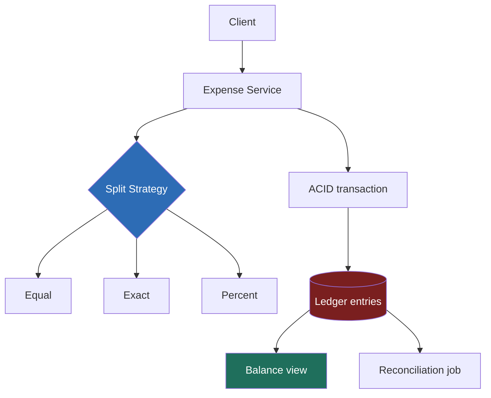

> **Why this gets asked:** Splitwise is the machine-coding staple of Flipkart/Uber/Swiggy/Ola loops and a common US "design a real product" LLD prompt - the cleanest vehicle for **invariant-first design**. A junior writes `User`, `Expense`, `Split` classes and mutates a balance map. A Director states the invariant first - **all balances sum to zero, always** - builds a structure where violating it is *impossible by construction*, handles money in integer cents with a deterministic remainder rule, and names the min-cash-flow rabbit hole only to **defer it as an optimization**. The separation happens in the first five minutes.

### Learning objectives
- Lead with the **invariant**: every expense posts ledger entries summing to zero; balances are **derived views**, never mutable truth - the ledger thinking at LLD scale.
- Handle money correctly: **integer cents**, no floats ever, and a **deterministic rule** for who eats the remainder in a 1/3 split.
- Use the **Strategy pattern** for split types (equal / exact / percent), with validation owned by the strategy and a contract that *enforces* the invariant.
- Stress the invariant under **concurrent expense adds**, and show why an append-only ledger makes the race disappear.
- Execute the Director move on **debt simplification**: name it, classify it as a read-side optimization, state its complexity, defer it.

### Intuition first
Splitwise is a tiny **accounting system wearing a consumer-app costume**. Accountants solved it 600 years ago with double-entry bookkeeping: every transaction records debits and credits in equal measure, so the books balance **by construction, not by audit**. The junior instinct is the opposite: keep a cell saying "Alice owes Bob $20" and mutate it per expense. Mutable cells drift - a bug, a retry, a crash between two updates - and corrupted state looks exactly like valid state. The accountant records **immutable journal entries** and *derives* balances by summing; the worst failure becomes a stale cache you recompute, never a corrupted truth. Everything here is that one idea applied: **make the invariant structural, so no code path - correct or buggy - can violate it.**

Two more traps frame the hour. Money: `$20.00 / 3` in floating point is `6.666…`, and three of those don't sum back to 20 - money is integer cents plus a stated rule for the leftover cent. And the shiny algorithm - "settle the group in fewest payments" - is a 15-minute rabbit hole producing zero working code. Name it, defer it.

---

## R - Requirements

> **LLD adaptation:** in a machine-coding round, R scopes the **object model** and - critically - promotes the **invariants to first-class requirements**. Correctness properties *are* the non-functional requirements here; there is no QPS story to hide behind.

**Clarifying questions I'd ask (with assumed answers):**
- *Split types?* → **Equal, exact, percentage** - designed so a fourth (shares/weights) drops in without touching existing code.
- *Multiple payers?* → Yes in the model (the ledger handles it for free); single-payer in the demo path.
- *Edit/delete?* → Yes - as **reversal entries**, never in-place mutation.
- *Simplify debts?* → Acknowledged, **explicitly out of v1** (see Design evolution).
- *Currency?* → Single in v1; stored per expense so multi-currency is additive.

**Functional requirements:**
1. **Add expense:** payer(s), total, participants, split strategy.
2. **View balances:** per user ("owed ₹540 net") and per pair ("Alice owes Bob ₹200").
3. **Settle up:** record a payment that reduces a pair balance.
4. **Groups:** expenses scoped to a group; per-group balances.
5. **Expense history:** an auditable, ordered log.

**Invariant requirements (the real NFRs):**
- **Sum-to-zero:** across any group - and the whole system - signed balances sum to exactly 0, at all times, including mid-failure.
- **Conservation of cents:** an expense's shares sum to *exactly* the total. Not within a cent - exactly.
- **Determinism:** the same input always produces the same allocation (retries and reconciliation depend on it).
- **Auditability:** every balance is explainable as a sum of immutable entries.

**Cut:** receipt OCR, notifications, recurring expenses, currency conversion, simplify-debts. Scoping to *add expense → derive balances → settle* and saying so is itself the signal.

---

## E - Estimation

> **LLD adaptation:** estimation shrinks to a two-minute proof that **this is not a scale problem** - quantified, so the rest of the hour is spent where the difficulty actually lives: correctness.

**Load:** ~10M MAU × ~5 expenses/month ≈ 50M/month ≈ **20 writes/s** average, ~100/s peak; balance reads ~10× → **~1K reads/s**. A single Postgres yawns at this.

**Storage:** ~700 B/expense (header + ~4 ledger lines) → **~35 GB/year** with indexes. Years of headroom on one primary + replica; sharding is a someday-by-`group_id` footnote.

**The numbers that actually matter are money numbers.** ₹2,000.00 split 3 ways: as floats, `666.67 × 3 = 2000.01` - the books are off by a paisa and the invariant is dead. As integers: `200000 / 3 = 66666` remainder `2` → shares `[66667, 66667, 66666]`. **Two cents must be deliberately assigned by a stated rule.** That arithmetic - not QPS - is this problem's estimation step, and saying so out loud is the altitude signal.

**What estimation decided:** one relational DB, ACID transactions, no distributed-systems machinery - 100% of the design budget goes to the invariant and the object model.

---

## S - Storage

> **LLD adaptation:** S becomes "**what is the source of truth?**" - the single most consequential decision in the problem.

**Truth = the immutable journal.** Two tables: an `expenses` header (immutable) and `ledger_entries` - one row per participant per expense with a **signed `amount_cents`**: the payer positive (what they fronted minus their own share), each ower negative. By construction, **entries for one expense sum to zero**. A settlement payment is *not a special case* - just another expense type posting two entries. One concept, uniform.

**Balances = a derived view.** `SUM(amount_cents)` grouped by user (and by pair for "who owes whom"), **cached in a `balances` table updated in the same ACID transaction** - but rebuildable from the journal at any time, with a cheap **nightly reconciliation** asserting cache = journal and global sum = 0.

- *Rejected - a mutable pairwise balance map as the truth:* every expense becomes a read-modify-write on N cells; a crash between updates corrupts silently; no audit trail; concurrent adds race. The design most candidates write first - and the one the interviewer is waiting to attack.
- *Rejected - full event-sourcing/CQRS infrastructure:* Kafka, projections, snapshots - pure ceremony at 20 writes/s. The insight worth keeping: **the journal table already *is* event sourcing at table scale**. Take the idea, skip the infra.
- *Store:* **Postgres** - the design leans on multi-row ACID transactions, exactly the workload relational stores exist for. A KV store would make us hand-build the atomicity the invariant needs.

This is the payment-ledger discipline at LLD scale: same invariant, same append-only posture, one process instead of a distributed system.

---

## H - High-level design

> **LLD adaptation:** H is not a service-box diagram - it's the **object collaboration**: which component owns which responsibility, and where the Strategy seam sits.



**Flow, compressed:** `ExpenseService.addExpense` hands the request to the chosen **SplitStrategy**, which *validates* (percents sum to 100; exact amounts sum to total) and *allocates* - integer-cent shares summing **exactly** to the total, remainder assigned deterministically. The service converts shares to signed ledger entries (payer positive, owers negative - net zero by arithmetic) and appends header + entries + cached-balance updates in **one ACID transaction**. Reads hit the cache; reconciliation is cheap insurance against silent drift.

**Why Strategy and not an enum-switch:** split types are the *axis of change* - interviews routinely add "now support split-by-shares" mid-round. A `SplitStrategy` interface makes that a new class with zero service edits; a switch makes it a shotgun edit. *Rejected - subclassing `Expense` per type:* couples the split *algorithm* to the expense *record*, which only cares that shares balance.

---

## A - API design

> **LLD adaptation:** A is the **interface contract** - and the contract is where the invariant gets enforced. The strategy's return type *is* the correctness story.

```text
interface SplitStrategy {
  validate(totalCents, participants, params) -> ok | errors
  allocate(totalCents, participants, params) -> shares: int[]
  // CONTRACT: sum(shares) == totalCents, exactly.
  //           Deterministic: same input -> same output.
}

class ExpenseService {
  addExpense(groupId, payerId, totalCents, participants,
             strategy, idempotencyKey) -> expenseId
  reverseExpense(expenseId, idempotencyKey) -> expenseId
  settle(fromId, toId, amountCents, idempotencyKey) -> expenseId
  getBalance(userId) -> netCents
  getPairBalances(groupId) -> [{from, to, cents}]
}
```

**Design notes (each with its rejected alternative):**
- **`allocate` returns integer cents summing exactly to total - by contract.** The invariant is enforced once, at the seam. *Rejected: strategies returning fractions for the service to round* - rounding (the hard part) gets duplicated in callers and the contract is unenforceable.
- **Validation lives in the strategy.** Percent-sums-to-100 is a fact about percent splits; the service shouldn't know it exists. *Rejected: a god-validator in the service* - every new split type reopens it.
- **`idempotencyKey` on every write.** Mobile clients retry; a double-posted dinner corrupts balances exactly like a race would (same defense as the purchase path). *Rejected: trusting clients not to retry* - they always retry.
- **`reverseExpense`, not edit/delete.** Edit = reversal + repost; the journal stays append-only, the audit trail intact. *Rejected: in-place UPDATE* - destroys auditability and reintroduces the read-modify-write race we designed away.

---

## D - Data model

> **LLD adaptation - and the dominant step.** The spec said it: in this problem, D *is* the design. Everything above exists so these two tables can hold the invariant.

**`expenses`** - immutable header: `expense_id`, `group_id`, `type` (`EXPENSE` / `SETTLEMENT` / `REVERSAL`), `total_cents`, `currency`, `created_by`, `idempotency_key` (**unique** - the exactly-once mechanism), `reverses` (nullable FK).

**`ledger_entries`** - the truth: `expense_id`, `user_id`, **`amount_cents` (signed int64)**. Every expense, settlement, and reversal is rows in this one table, netting to **0** per expense.

**`balances`** - derived cache: `(group_id, user_id, net_cents)` plus a pair-level view, updated in the posting transaction, rebuildable by `SUM` over entries.

**Three layers of defense for sum-to-zero, in order of importance:**
1. **Construction:** entries are generated from `allocate()` output, which sums to total by contract; signed entries then net to zero by arithmetic. No code path exists that writes unbalanced entries.
2. **Atomicity:** header + entries + cache update commit in **one transaction** - no observable half-expense, even mid-crash.
3. **Detection:** a post-time assertion (sum the entry set, reject ≠ 0) and the nightly reconciliation. Belt, suspenders - both cheap at 20 writes/s.

**The remainder rule (state it explicitly).** `200000 / 3` leaves 2 cents. Rule: **sort participants by user id; the first `remainder` participants get one extra cent.** Which rule is *almost* irrelevant - payer-eats-it is equally fine - but it must be **deterministic and stated**: retries, reconciliation, and "why does Alice owe one cent more?" tickets all depend on same input → same allocation. *Rejected: random assignment or float-then-round* - non-determinism breaks idempotent retries; rounding breaks conservation. **Percent splits** get the same discipline via **largest remainder**: floor every share, give leftover cents to the largest fractional remainders (tie-break by id). Exact-amount splits don't allocate - they *validate* that the amounts sum to total, and reject otherwise.

<details>
<summary>Go deeper, full schema DDL and strategy class sketches (IC depth, optional)</summary>

```sql
CREATE TABLE expenses (
  expense_id      BIGSERIAL PRIMARY KEY,
  group_id        BIGINT NOT NULL,
  type            TEXT NOT NULL CHECK (type IN ('EXPENSE','SETTLEMENT','REVERSAL')),
  total_cents     BIGINT NOT NULL CHECK (total_cents > 0),
  currency        CHAR(3) NOT NULL DEFAULT 'INR',
  created_by      BIGINT NOT NULL,
  created_at      TIMESTAMPTZ NOT NULL DEFAULT now(),
  idempotency_key TEXT NOT NULL UNIQUE,
  reverses        BIGINT REFERENCES expenses(expense_id)
);

CREATE TABLE ledger_entries (
  expense_id   BIGINT NOT NULL REFERENCES expenses(expense_id),
  user_id      BIGINT NOT NULL,
  amount_cents BIGINT NOT NULL,            -- signed; + = is owed, - = owes
  PRIMARY KEY (expense_id, user_id)
);
CREATE INDEX ON ledger_entries (user_id);

CREATE TABLE balances (
  group_id  BIGINT NOT NULL,
  user_id   BIGINT NOT NULL,
  net_cents BIGINT NOT NULL DEFAULT 0,
  PRIMARY KEY (group_id, user_id)
);
```

Equal-split strategy (language-neutral):

```text
class EqualSplit implements SplitStrategy:
  validate(total, users, _):
    return users.nonEmpty and total > 0

  allocate(total, users, _):
    n     = users.size
    base  = total / n          // integer division
    rem   = total % n          // 0..n-1 leftover cents
    sorted = users.sortBy(id)  // determinism
    return [ base + (i < rem ? 1 : 0) for i, u in sorted ]
```

Percent-split allocation (largest remainder):

```text
allocate(total, users, pcts):           // validate: sum(pcts) == 10000 bps
  raw    = [ total * p / 10000 for p in pcts ]      // floor
  rem    = total - sum(raw)
  order  = users.sortBy(fractionalPart desc, id asc)
  give 1 cent to first `rem` users in order
```

Posting pseudocode: `BEGIN; INSERT expenses; INSERT entries (assert sum==0); UPDATE balances += entry per user; COMMIT;`, the idempotency key's unique index turns a retried `addExpense` into a clean conflict you map to "already posted, here's the id".

</details>

---

## E - Evaluation

> **LLD adaptation:** Evaluation = attack the invariant. The designated stress test: **two expenses added concurrently between the same users.** Then retries, crashes, and edits.

**Threat 1 - the concurrent add.** Alice posts a ₹900 dinner while Bob posts a ₹600 cab, same group, same instant. In the mutable-balance design this is a classic lost update: both read `bob_owes_alice = 0`, both write their delta, one vanishes. In our design **the race does not exist at the truth layer**: both transactions *append disjoint rows*. The only shared state is the `balances` cache, updated with `net_cents = net_cents + ?` - a commutative increment the DB serializes per row, rebuildable from the journal even if botched. **That is the payoff of derived balances, stated in one sentence.**

**Threat 2 - the retried request.** Client times out, re-sends. The unique `idempotency_key` turns the second insert into a clean conflict → return the original `expense_id`. Without it, a double-posted dinner is invariant-preserving but *fact-corrupting*.

**Threat 3 - crash mid-post.** One ACID transaction → nothing visible. This is exactly the failure that silently corrupts the mutable-balance design (one cell updated, the other not - books off forever, no error anywhere).

**Threat 4 - edit/delete.** Reversal entries (negate the original set, which sums to zero, so the reversal does too) keep the journal append-only; "edit" = reverse + repost.

**Threat 5 - drift anyway.** The nightly reconciliation re-derives balances and asserts global sum = 0 - a minutes-long query at 35 GB/year. *"My prior is it never fires; at this price I run it anyway - the day it fires it's the most valuable job we own."* Cheap detection behind structural prevention is the Director operational instinct.

**Re-check:** sum-to-zero - structural; conservation of cents - the `allocate` contract + post-time assert; determinism - sorted allocation + idempotency keys; auditability - append-only journal. All four hold by *design*, not by discipline.

---

## D - Design evolution

> **LLD adaptation:** evolve along the product axes - groups, settlement UX, currencies - and execute the deferral of the one famous algorithm.

**Groups & scale-out (boring, say so fast):** `group_id` is already on every row. If the product 100×'s, shard by `group_id` - expenses never span groups, so transactions stay single-shard. Multi-currency: store `currency` per expense, **never convert inside the ledger** (a ledger holds facts, not exchange-rate opinions); convert at display. Reminders and feeds are read-side features off the journal.

**The min-cash-flow deferral (the Director move, scripted).** The interviewer will ask: *"Six people, 14 pairwise debts - minimize the settlement payments?"* The trap is diving in. The answer:

> *"That's the min-cash-flow problem - find a minimal set of transfers that settles everyone's net balance. Two things make me defer it: it's a **read-side optimization over derived balances** - it never touches the ledger or the invariant, so it bolts on later with zero schema change; and truly minimizing the transfer **count** is NP-hard, while the standard greedy - match the largest debtor with the largest creditor - gives at most n−1 transfers and is what's actually shipped. v2, behind `suggestSettlements(groupId)` - and suggestions are advisory; only a recorded payment changes the books."*

Four signals in one breath: the algorithm, its complexity class, its severability, and suggestion ≠ posting.

<details>
<summary>Go deeper, min-cash-flow greedy and why exact-minimum is NP-hard (IC depth, optional)</summary>

Compute net balance per user from the ledger (sum of signed entries). Creditors (net > 0) and debtors (net < 0) go into two max-heaps by magnitude. Loop: pop the largest creditor C and largest debtor D, transfer `m = min(|C|, |D|)` from D to C, push back whichever has residue. Each iteration zeroes out at least one participant, so it terminates in ≤ n−1 transfers, O(n log n). Note the greedy operates only on *net* balances - pairwise history is irrelevant to settlement, which is itself an insight: simplification may route Alice's repayment to Carol even though Alice's debt was "to" Bob.

Minimizing the *number* of transfers exactly is NP-hard: the core subproblem is finding subsets of debtors and creditors whose sums match (each zero-sum subset that settles internally saves a transfer), which reduces from subset-sum / set partition. n−1 is the greedy's guarantee; the optimum can be lower when such subsets exist, and finding them is the hard part. For a 6-person trip, exhaustive search is feasible; nobody bothers - the greedy's output is already psychologically acceptable.

Production wrinkle: simplification suggestions go stale the moment a new expense posts. Treat them as a pure function of a balance snapshot, recomputed on read - never stored, never authoritative.

</details>

---

## Trade-offs table - the pivotal decisions

| Decision | Option A | Option B | Option C | Use when... |
|---|---|---|---|---|
| **Source of truth** | **Immutable ledger entries, balances derived** | Mutable pairwise balance map | Full event-sourcing + CQRS infra | **A** - invariant by construction, auditable, race-free appends (our choice). **B** never - drift is silent and unauditable. **C** when you genuinely need replay at scale; here it's ceremony. |
| **Split-type handling** | **Strategy interface per type** | Enum + switch in the service | Subclass Expense per type | **A** - split types are the axis of change; new type = new class (our choice). **B** acceptable for a throwaway script. **C** couples algorithm to record - rejected. |
| **Money + remainder** | **Integer cents, deterministic remainder** | Decimal type, round half-even | Floats | **A** - exact conservation, idempotent retries (our choice). **B** workable but rounding rules still needed, easier to get wrong. **C** banned - conservation fails. |

---

## What interviewers probe here (Director altitude)

- **"What stops balances from drifting?"** - *Strong:* nothing *needs* to - balances derive from entries that sum to zero by construction; reconciliation is cheap insurance, not the mechanism. *Red flag:* "we carefully update both balances in a transaction" - discipline where structure should be.
- **"Split ₹100 three ways."** - *Strong:* `10000 → [3334, 3333, 3333]` cents, extra cent by a stated deterministic rule, largest-remainder for percents, floats banned with the one-line reason. *Red flag:* "₹33.33 each" with the lost cent unaccounted.
- **"Two expenses post concurrently between the same users."** - *Strong:* appends to disjoint rows - no read-modify-write on truth; the cache increment is commutative and rebuildable. *Red flag:* reaching for locks to protect a balance cell.
- **"Can you minimize settlement payments?"** - *Strong:* names min-cash-flow, classifies it as read-side, states greedy ≤ n−1 vs NP-hard exact, defers to v2, notes suggestions never touch the ledger. *Red flag:* ten minutes of graph algorithm, no working expense flow.
- **"A user edits last week's dinner."** - *Strong:* reversal + repost; journal append-only. *Red flag:* `UPDATE expenses SET ...`.

---

## Common mistakes

- **Floats for money.** `0.1 + 0.2 ≠ 0.3`; three thirds of ₹20 don't make ₹20. Integer minor units, full stop.
- **Mutable pairwise balances as truth.** The drift is silent, the race is real, there's no audit trail. Balances are views.
- **An undefined remainder.** "Roughly a third each" is not an allocation. Name the deterministic rule - retries and reconciliation depend on it.
- **Special-casing settlement.** A payment is just another zero-sum posting; a second code path is a second place for the invariant to break.
- **Chasing simplify-debts in the core hour.** Candidates who fail this problem usually fail it *while implementing the most interesting part*.

---

## Interviewer follow-up questions (with model answers)

**Q1. ₹2,000 dinner, split equally among 3, payer included. Show the exact ledger rows.**
> *Model:* Total `200000` cents; equal-split shares `[66667, 66667, 66666]` (sorted by user id, first two take the remainder cents). Payer (user 1, share 66667) fronted 200000 and consumed 66667 → entry **+133333**; users 2 and 3 get **−66667** and **−66666**. Sum: `133333 − 66667 − 66666 = 0`. Deterministic, so a retry with the same idempotency key reproduces - and dedups to - the identical posting.

**Q2. Two roommates add expenses against each other at the same millisecond. Why is nothing lost?**
> *Model:* Each `addExpense` is one transaction appending its own header + entry rows - disjoint writes, nothing read-then-written at the truth layer, so no interleaving can lose data. The shared touch point is the cached balance row, updated as a relative increment (`net += x`) the DB serializes per row; both land commutatively in either order - and the cache is derived, rebuildable if ever doubted. In the mutable-balance design both writers read 0 and one delta silently overwrites the other. The race wasn't *handled*; it was *deleted by the data model*.

**Q3. Percent split: 33.33% / 33.33% / 33.34% of ₹999.99. What goes wrong naively?**
> *Model:* Two failures hide here. Validation: take percents as integer basis points (3333+3333+3334 = 10000) so the sums-to-100 check is exact, not float-fuzzy. Allocation: `99999 × 3333 / 10000 = 33332.66…` - floor each share, and the floors undershoot the total by a few cents; distribute them by **largest remainder** (tie-break by user id). The `allocate` contract - integer shares summing exactly to total, deterministically - catches both, which is why validation and allocation live inside the strategy.

**Q4. "Our 8-person Goa trip ended with 19 IOUs. Build debt simplification into v1?"**
> *Model:* No - and here's the shape of the no. Min-cash-flow operates on *net balances*, already a derived view, so it's a pure read-side feature: a v2 `suggestSettlements` endpoint with zero schema or ledger impact. The greedy (largest debtor ↔ largest creditor) guarantees ≤ n−1 transfers - 7 payments instead of 19 - while the exact minimum is NP-hard and not worth chasing at trip-sized n. Suggestions are advisory - only a recorded settlement posting moves the books - and they go stale on every new expense, so compute on read, never store. I'd have product validate whether users accept net routing (paying Carol for a debt "to" Bob surprises people); my prior is yes with clear UX - Splitwise shipped exactly this.

---

### Key takeaways
- **State the invariant first, then make it structural:** every posting is signed entries summing to zero; balances are derived views. No code path - buggy or not - can write unbalanced truth. the ledger discipline at LLD scale.
- **Money is integer cents with a stated, deterministic remainder rule** (sorted-order extra cents; largest-remainder for percents). Floats fail conservation; non-determinism breaks retries and reconciliation.
- **Strategy is the seam:** split types validate and allocate behind one contract - shares sum exactly to total - so a new type is a new class and the invariant is enforced once.
- **Concurrency is solved by the data model, not locks:** adds append disjoint rows; the balance cache is a commutative, rebuildable increment; idempotency keys make retries exactly-once; edits are reversals.
- **Name and defer min-cash-flow:** a read-side optimization over derived balances - greedy ≤ n−1 transfers, exact minimum NP-hard, suggestions never touch the ledger. Deferring it crisply *is* the Director signal.

> **Spaced-repetition recap:** Splitwise = **invariant-first LLD**. Truth is an **append-only ledger of signed integer-cent entries summing to zero per expense**; balances are derived (cached, rebuildable, reconciled nightly). **Strategy** per split type owns validate + allocate; contract: shares sum *exactly* to total, **deterministic remainder**. Settlement = another posting; edit = reversal; concurrent adds append disjoint rows - no race by construction. **Min-cash-flow: name it, call it read-side (greedy ≤ n−1, exact NP-hard), defer it.**

---

*End of Lesson 7.7. Splitwise is Ticketmaster's quiet sibling: there the invariant was one-seat-one-owner, held by an atomic CAS; here it's books-balance, held by making unbalanced writes structurally impossible. Same lesson at two scales - choose designs where the invariant cannot be violated, then spend a few cheap cycles verifying it anyway.*
