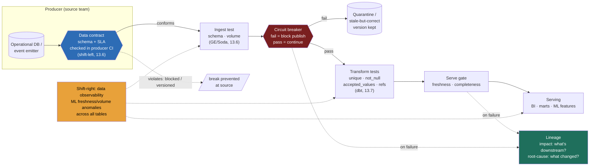

### Learning objectives
- Name the **seven data-quality dimensions** a designer engineers around, freshness, volume, schema, distribution/values, uniqueness, referential integrity, completeness, and state which failure each one catches, so "is the data good?" becomes a set of quantified, testable assertions instead of a vibe.
- Treat **tests in the pipeline** (dbt tests, Great Expectations, Soda) as the **regression suite for data**, the exact analog of the eval gate for LLMs: a fixed set of assertions every model run must pass before its output is trusted downstream.
- Make the **shift-left vs shift-right** decision explicitly, a **data contract** at the producer boundary that prevents a break at the source, versus **observability/anomaly detection** that catches a break after the fact, and know that you almost always need both, at different boundaries.
- Make the **circuit-break vs alert-and-continue** decision per data product: block bad data from propagating (protects consumers, can halt the pipeline on a false positive) versus let it flow and alert (keeps data fresh, risks serving a wrong number).
- Reason in the numbers that make trust real, freshness SLA windows, volume-anomaly thresholds (±X%), the **detection lag** that separates a week-long silent break from a five-minute caught one, and the dollar cost of the wrong decision that lands downstream.

### Intuition first
13.1 named the signature failure of a data platform: a **precise, confident, wrong number that nobody notices for a week.** Not a crash, not an error page, a chart that renders beautifully and is simply false, because an upstream team renamed a column, a join quietly fanned out, or a timezone flipped a day's worth of events into yesterday. The dashboard doesn't know it's lying. The analyst doesn't know. The VP who reprices a product off that chart doesn't know. That is the **analytical hallucination**, and engineering against it is a first-class discipline, not polish.

Think of it like a **factory's quality-control line versus a smoke detector**, both protect you, at different places, for different reasons. The **QC station on the assembly line** is shift-left: before a part moves to the next stage, an inspector checks it against a spec sheet and pulls an out-of-tolerance part *off the line then and there*, so a defect never reaches the customer, at the cost of a line stoppage when the inspector is wrong, and of the supplier agreeing on the spec in the first place. The **smoke detector** is shift-right: it prevents nothing, it watches the whole building and screams *after* something's already burning, broad coverage, no cooperation needed, but the fire has started by the time it goes off. A serious data platform runs both: a QC station at the producer boundary (the contract) and a smoke detector over the warehouse (observability). The design questions, *where do I put each inspector, what spec does each check, and when a part fails do I stop the line or just sound the alarm*, are each a trade-off with a number attached.

### Deep explanation

**Data quality is not one property, it's seven dimensions, and each catches a different break.** "Is the data good?" is unanswerable until you decompose it. The discipline is to turn each dimension into a quantified assertion you can test:

- **Freshness**, *is the data recent enough?* The lag from event to queryable, checked against an SLA window. Assertion: *"the `orders` mart has today's partition by 07:00, max `event_time` within 90 min of now."* Catches stale-presented-as-fresh: a pipeline falls behind and the dashboard renders a confident, wrong-because-old number.
- **Volume**, *did the expected amount arrive?* Row counts per load against a range. Assertion: *"today's partition is 80–120% of the trailing-7-day median row count."* Catches a half-loaded file, a dropped source, a missing partition, or a double-load.
- **Schema**, *is the shape what we agreed?* Column presence, names, types, nullability. Assertion: *"`amount` exists, is non-null `DECIMAL`, no unannounced new columns."* Catches the classic silent break: a rename of `user_id` to `userId`, a dropped column, a type change, and every downstream join breaks or nulls out.
- **Distribution / values**, *do the values look sane?* Ranges, accepted enums, percentile drift. Assertion: *"`status` ∈ {pending, paid, refunded}; `amount` ∈ [0, 100k]; daily mean within 3σ."* Catches a unit change (dollars→cents), a bad transform, a new enum silently mis-bucketed.
- **Uniqueness**, *are the keys unique where they must be?* Assertion: *"`order_id` is unique; zero duplicates."* Catches a fan-out join (the commonest cause of inflated metrics) or a double-ingested batch, why "revenue" suddenly reads 2× with nobody touching the logic.
- **Referential integrity**, *do the joins hold?* Every foreign key resolves to a parent. Assertion: *"every `order.user_id` exists in `users`; zero orphans."* Catches late-arriving dimensions or an upstream deletion, rows that silently drop out of an inner join and shrink your totals.
- **Completeness**, *is anything missing that should be present?* Null rates on required fields, all expected segments present. Assertion: *"`region` non-null on >99.5% of rows; all 12 regions appear today."* Catches a partial extract that looks fine in aggregate while a whole slice is missing.

The Director-altitude statement: **data quality is not a single check, it's a small battery of quantified assertions across these seven dimensions, placed at the boundaries where a break would otherwise pass unnoticed, and "we'll eyeball the dashboard" is the failure mode the battery kills.** Most real breaks are one of four: a schema change, a fan-out (uniqueness), a unit/timezone error (distribution), or a partial load (volume/completeness). Cover those four and you catch the overwhelming majority of analytical hallucinations.

**Tests in the pipeline are the regression suite for data, the exact analog of the LLM eval gate.** There, every prompt/model/RAG change must pass a golden set before it ships, because "looked fine in a demo" is how quality silently regresses. Identical structure here: every model run must pass a fixed assertion set before its output is trusted downstream, because "the query ran without error" is how a wrong number silently ships. The tooling:

- **dbt tests**, assertions on your transformation models, declared in YAML beside the model. Built-ins cover `unique`, `not_null`, `accepted_values`, `relationships` (referential integrity); packages (`dbt-utils`, `dbt-expectations`) add ranges, freshness, row-count anomalies. They run *as DAG nodes*, so a downstream model can be configured not to build on a failed upstream test.
- **Great Expectations / Soda**, standalone frameworks that validate a dataset against a declared "expectation suite" (GE) or config checks (Soda). More expressive for distribution/statistical checks, and they validate *in flight* (at ingest) as well as at rest, so you can gate raw data before it enters the warehouse.

The decision, **dbt tests vs a dedicated framework**, is mostly *where the data is when you check it.* dbt tests are deterministic, version-controlled beside the transform, and free if you already run dbt; the default for modeled tables in the warehouse. **Reject** "do everything in Great Expectations" for simple table-level assertions on dbt models, it adds a second tool and config surface for expressiveness you didn't need. **Reach for** GE/Soda when you must validate *before* data lands (gating ingest) or when checks are statistically rich (distribution drift) beyond dbt's built-ins. Same philosophy, different insertion point.

**Shift-left vs shift-right is the central architectural choice, and it's about *where you catch the break.*** Two philosophies, and a serious platform runs both at different boundaries:

- **Shift-left, the data contract at the producer boundary.** A **data contract** is an explicit, enforced agreement: the source team commits to a schema, semantics, and an SLA (freshness, volume), and a violating change is *blocked or versioned at the source* before it reaches you, checked in the producer's CI (a breaking schema change fails their build) and/or at the ingestion boundary (where a non-conforming event is rejected or quarantined). The win is enormous: the break is **prevented at source**, so detection lag is *zero*, there's nothing to detect. The cost is **organizational, not technical**, the producing team, who often gets no direct benefit from your analytics, must sign the contract, wire it into CI, and treat a breaking change as a coordinated migration. That buy-in is the hard part, and at Director altitude it's an org problem you own, not a tooling task you delegate.
- **Shift-right, observability and anomaly detection.** You instrument the data *after* it lands and watch for anomalies: ML-based freshness/volume anomaly detection, distribution drift, schema-change alerts, computed continuously across hundreds of tables (the Monte Carlo / "data observability" category). The win is **broad coverage with no producer dependency**, it monitors tables whose owners will never sign a contract and catches breaks you didn't write a test for. The cost is that **the damage has already flowed**: by the time the anomaly fires, the wrong number may already be on a dashboard. It's the smoke detector, it says the building's on fire, it doesn't stop the fire.

The Director-altitude statement: **shift-left prevents but needs producer buy-in; shift-right catches but only after the break flowed, so you shift-left on the high-value, high-blast-radius sources where a silent break is expensive, and shift-right everywhere else for coverage.** You **reject** "contracts everywhere" (you can't get every producer to sign and maintain one) and **reject** "observability only" on your critical feeds (catching the payments-revenue break *after* the board deck shipped is too late). Nested inside shift-right is the **explicit-thresholds vs ML** choice: explicit assertions (`±20%` volume, freshness `< 90 min`) are precise, debuggable, and yours, but catch only what you thought to write; ML detection auto-learns normal across many tables and catches unknown-unknowns, but is less precise (false-positives on a legit campaign spike). Explicit tests on the metrics that matter, ML for broad coverage, the same shape as the "explicit eval cases plus mined production traces." (Architecting that ML layer end-to-end is 14.6; here it's one option in the decision.)

**Circuit-break vs alert-and-continue, what happens *when* a check fails.** A test isn't enough; you must decide its consequence, per data product:

- **Circuit-break (block).** A failed check *halts the pipeline*, the bad partition is not published, downstream models don't build on it, the stale-but-correct previous version keeps serving. Protects consumers absolutely: a wrong number never reaches a dashboard. The cost is that a **false positive halts a healthy pipeline**, a legitimate 30% volume spike from a real campaign trips a `±20%` threshold and now finance's report is stale because your guard was too tight. Use it where **serving a wrong number is worse than serving a stale one**: anything that feeds a financial decision, a customer-facing number, an ML feature in production.
- **Alert-and-continue.** A failed check *fires an alert but lets the data flow.* Keeps the pipeline fresh and avoids false-positive stoppages; the cost is that **bad data is now live** while a human investigates. Use it where **freshness matters more than perfection** and a human will catch a genuine problem quickly, an internal exploratory dashboard, a low-stakes operational metric.

The Director-altitude statement: **circuit-break where a wrong number is more expensive than a late one; alert-and-continue where freshness wins and the blast radius is small, and the threshold you set is itself the false-positive/missed-break trade-off (tighter catches more but halts more).** You **reject** "circuit-break everything" (over-tight gates turn every legit spike into an outage, and the team learns to disable them) and **reject** "alert on everything" for critical financial data (an alert that fires while the wrong number is already on the CFO's screen has failed at its one job). Concretely, this *is* the detection-lag dial: circuit-breaking drives lag toward *zero damage* (caught before publish) at the cost of false-positive stoppages; alerting accepts *minutes-to-hours of bad data live* to never falsely halt.

**The tie to lineage, tests tell you *something* broke; lineage tells you *what's affected* and *why*.** A failed freshness test is only half the answer. The questions that follow, *which 40 downstream dashboards consume this? which exec report is now wrong? what upstream change caused it?*, are **lineage** questions: impact (downstream, "what do I alert?") and root-cause (upstream, "what change broke this?"). A test without lineage is a smoke detector with no building map: you know there's a fire, not which rooms to evacuate. The pairing is the point, **tests detect, lineage scopes the blast radius and finds the cause** (mechanics are 13.10; here, the test result feeds it).

Go deeper, dbt test mechanics, GE expectation suites, and contract enforcement points (IC depth, optional)

- **dbt test anatomy.** A dbt "test" is a SQL query that's expected to return **zero rows**, `not_null` compiles to `select * from model where column is null`; if it returns rows, the test fails. Generic tests (`unique`, `not_null`, `accepted_values`, `relationships`) are declared in YAML; singular tests are arbitrary `.sql` files. Severity is configurable: `severity: error` fails the run (circuit-break), `severity: warn` logs but continues (alert-and-continue), that single knob *is* the circuit-break-vs-alert decision in dbt. `dbt build` interleaves model builds and tests so a model can be configured to skip if its upstream test errored.
- **Freshness as a first-class dbt check.** `dbt source freshness` checks `loaded_at_field` against `warn_after` / `error_after` thresholds declared on the source, a dedicated freshness gate separate from row tests.
- **Great Expectations suites.** An "expectation suite" is a JSON-serialized set of expectations (`expect_column_values_to_be_between`, `expect_column_values_to_not_be_null`, `expect_table_row_count_to_be_between`, `expect_column_values_to_be_in_set`). A "checkpoint" runs a suite against a batch and emits a validation result + Data Docs (an HTML report). GE can auto-profile a dataset to *propose* an initial suite, which you then prune, the data-equivalent of bootstrapping a golden set.
- **Where a contract is actually enforced.** Three common points, often combined: (1) **producer CI**, a schema-registry check (e.g. a Protobuf/Avro schema compatibility check, or a JSON-schema diff) fails the producer's build on a breaking change; (2) **ingestion boundary**, a schema/quality gate at write time rejects or dead-letter-queues non-conforming events; (3) **the warehouse**, a dbt/GE test on the landed table as a backstop. The further left the enforcement, the smaller the blast radius and the lower the detection lag, but the more producer cooperation required.
- **The dead-letter quarantine pattern.** Circuit-breaking doesn't have to mean *drop the data*. The robust pattern routes failing rows to a **quarantine/dead-letter table** while clean rows proceed, so you halt propagation of the bad rows without losing them and can replay after a fix, the data-quality analog of a DLQ on a message queue (3.x).

### Diagram: data-quality gates across a pipeline

The diagram is the lesson: **a contract gates the producer boundary (shift-left, prevents), tests gate ingest → transform → serve (the regression suite), a circuit breaker decides block-vs-continue at the critical hop, observability watches everything after the fact (shift-right, detects), and a failure feeds lineage to scope the blast radius.** Remove the contract and breaks flow in; remove the circuit breaker and a caught break still publishes; remove lineage and you know there's a fire but not which floors.

### Worked example: a renamed column that should have wiped out a week of revenue reporting

A payments team owns the `transactions` table; the platform CDC-replicates it into the lake, dbt models it into a `revenue_daily` mart, and both the finance dashboard and the monthly board deck read that mart. One Tuesday a payments engineer ships a refactor renaming `txn_amount_usd` to `amount_usd`. The failure with no quality discipline, then with it:

- **The silent-hallucination path (no discipline).** The CDC pipeline doesn't error, it just starts landing `amount_usd` and stops populating `txn_amount_usd`. The dbt model still references `txn_amount_usd`, now mostly null, so `SUM(txn_amount_usd)` returns a confident, precise, **40%-low** revenue figure. No error anywhere; finance reports it up. **Detection lag: ~6 days**, until someone notices revenue "looks light" and a multi-team fire drill traces it back, by which point a pricing decision was already made on the wrong number. Exactly the 13.1 analytical hallucination: cost is a wrong business decision plus days of senior-engineer firefighting.

- **The engineered-trust path.** Three gates fire:
  1. **Shift-left contract (best case, break never happens).** The high-blast-radius `transactions` table is under a **data contract** checked in the payments team's CI against a registered schema. The rename fails their build: *"breaking change: `txn_amount_usd` removed; consumer `revenue_daily` depends on it, version or coordinate migration."* The engineer keeps the old column, adds the new one additively, or runs a versioned migration. **Detection lag: zero. The break is prevented**, why you pay the org cost of a contract on your most critical feeds.
  2. **Circuit-breaking test (if no contract).** A **dbt schema test** (`not_null` on amount + expected-column check) and a **volume/distribution test** (`SUM(amount)` within ±20% of the trailing-7-day median) run in the DAG at `severity: error`. The all-null amount and the 40% drop both trip. Because this mart is **circuit-broken**, the bad partition is **not published**, the dashboard keeps serving yesterday's correct number and pages the team. **Detection lag: ~5 minutes** (next run), **zero bad data served.**
  3. **Lineage scopes it instantly.** The on-call's lineage traces *upstream* to the CDC change (root cause) and *downstream* to the finance dashboard and board deck (impact), seconds, not a half-day of archaeology.

The number a Director carries out: *"a renamed column is a confident 40%-low figure on the board deck for six days, or a blocked producer build, or a five-minute page with stale-but-correct data still serving, the difference is entirely whether you engineered the contract, the test, and the circuit breaker."* The whole discipline in one incident.

### Trade-offs table: where and how to engineer trust

| Decision | Shift-left: **data contract** | Shift-right: **observability / anomaly detection** | In-pipeline **dbt tests** | **Circuit-break** on failure | **Alert-and-continue** on failure |
|---|---|---|---|---|---|
| **What it does** | Producer commits to schema + SLA; breaking change blocked/versioned at source | ML-detects freshness/volume/distribution anomalies after data lands | Declarative assertions (unique, not_null, ranges, refs) run in the DAG | Failed check halts publish; consumers protected | Failed check fires alert; data keeps flowing |
| **Detection lag** | **Zero** (prevented at source) | Minutes–hours (after the fact) | Minutes (next run) | Caught **before publish** (zero bad data served) | Minutes–hours of bad data **live** |
| **Coverage** | Only contracted sources | **Broad**, all tables, unknown-unknowns | Tables you wrote tests for | The hop you gate | The hop you gate |
| **Main cost** | **Producer buy-in** (org effort) | Less precise; false positives on legit spikes | You only catch what you thought to assert | **False positive halts a healthy pipeline** | **Bad data served** while a human investigates |
| **Precision** | Highest (exact schema/SLA) | Lower (ML thresholds) | High (explicit assertions) | n/a | n/a |
| **Use when…** | High-value, high-blast-radius sources where a silent break is expensive | Broad coverage across many tables, producers who won't sign a contract | Validating modeled tables in the warehouse (the default) | Wrong number ≫ stale number (finance, customer-facing, prod ML features) | Freshness wins, blast radius small (internal/exploratory) |

The Director move is **matching the mechanism to the blast radius**: contract + circuit-break on the feeds where a wrong number costs a business decision, in-pipeline tests as the everyday regression suite, observability for broad coverage, and alert-and-continue where a late number is worse than a briefly-wrong one. No single mechanism is "the answer"; you place each where its cost is acceptable.

### What interviewers probe here
- **"The dashboard number is wrong. How would you even know, and how fast?"**, *Strong:* names the **seven dimensions** (at least freshness/volume/schema/uniqueness) as quantified tests, places them as a **regression suite** in the pipeline (dbt/GE), and gives a **detection-lag** number, five-minute circuit-break vs the week-long silent break, as what the design optimizes. *Red flag:* "we'd notice eventually" / correctness treated as given / no detection story, the analytical-hallucination trap.
- **"Shift-left or shift-right, which, and why?"**, *Strong:* both, at different boundaries, a **contract** on high-blast-radius sources (prevents, zero lag, costs producer buy-in) and **observability** elsewhere (catches, broad coverage, damage already flowed); names the org cost of contracts as the real obstacle, not the tooling. *Red flag:* "we'll add Great Expectations" with no notion of *where* the check sits or that prevention beats detection on the feeds that matter.
- **"A test fails at 3am. Does the pipeline stop or keep running?"**, *Strong:* depends on the data product, **circuit-break** where wrong ≫ stale (finance, customer-facing), **alert-and-continue** where freshness wins and blast radius is small; names the **false-positive-halts-a-healthy-pipeline** cost and that the threshold is itself the trade-off. *Red flag:* one blanket policy with no per-product reasoning.
- **"How's this like LLM eval, and what happens after a test catches a break?"**, *Strong:* identical shape to 11.7, a fixed assertion set every change must pass before it's trusted, "ran without error" as the failure mode, incidents folded back as permanent tests; and a caught break feeds **lineage** for impact (which consumers to alert) and root-cause (which upstream change). Tests detect, lineage scopes. *Red flag:* treats eval as unrelated, or the test is the end of the story with no blast-radius path.

The through-line at Director altitude: **trust is engineered, not assumed, you own the *policy* (which feeds get contracts, what's circuit-broken, the SLA windows and thresholds) and delegate the *plumbing* with the policy stated.** "I want our top-five revenue-critical sources under enforced contracts in the producers' CI, dbt tests as the default regression suite on every mart with faithfulness-grade gates (unique/not_null/freshness) circuit-breaking the financial marts, and a data-observability layer for broad coverage, have the platform team stand it up; my prior is the contracts on those five feeds buy back more incident-hours than they cost within a quarter."

### Common mistakes / misconceptions
- **Treating "the query ran" as "the data is right."** A pipeline that completes without error routinely produces a confident wrong number (renamed column, fan-out, unit error). Success of the *job* says nothing about correctness of the *data*; that's what the seven-dimension test battery is for.
- **Observability-only, no contracts on critical feeds.** Catching the revenue break *after* it hit the board deck has already failed. Shift-left a contract on the high-blast-radius sources; detection is not prevention.
- **Circuit-breaking everything with tight thresholds.** Over-tight gates turn every legitimate traffic spike into a pipeline outage, and the team's first move becomes disabling the gate, now you have neither freshness nor protection. Reserve hard blocks for where a wrong number truly beats a stale one; size thresholds to real variance.
- **Tests without lineage.** A failed test with no downstream map is a smoke alarm with no building plan: you know something's wrong but not what's affected or what caused it. Pair detection (tests) with scoping (lineage).
- **A one-off audit instead of a standing gate.** Checking data quality once during a migration, then never again, is the "eval as a report, not a gate" mistake, quality rots the moment it stops being enforced on every run.

### Practice questions

**Q1.** Your revenue dashboard silently showed numbers 30% low for a week because an upstream team changed a column. Walk through how you'd make this class of failure impossible-to-miss, and quantify the improvement.
> *Model:* This is the analytical hallucination, and the fix is layered by blast radius. **Shift-left:** put the upstream `transactions` table under a **data contract** enforced in the producer's CI, a schema change that removes/renames a depended-on column fails their build, so the break is *prevented at source* with **zero detection lag**. **In-pipeline regression suite:** if no contract, dbt schema + distribution tests on the mart (`not_null` on amount, `SUM(amount)` within ±20% of the trailing-7-day median) catch the all-null/low total on the next run. **Circuit-break:** because a wrong revenue number is worse than a stale one, configure these tests `severity: error` so the bad partition **doesn't publish**, the dashboard serves yesterday's correct number and pages the team. **Lineage** scopes impact (which reports) and root cause (the CDC change) instantly. Quantified: detection lag goes from **~6 days with a wrong number live** to **~5 minutes with zero bad data served** (circuit-break) or **zero, break prevented** (contract). The cost traded in is a possible false-positive stoppage on a legitimate spike, acceptable on a financial mart.

**Q2.** Why is a data-quality test suite the analog of an LLM eval gate, and what does that analogy tell you to do?
> *Model:* Identical structure. In 11.7 every prompt/model/RAG change must pass a **fixed golden set** before shipping ("looked fine in a demo" is how quality silently regresses); here every model run must pass a **fixed assertion battery** before its output is trusted ("the job ran without error" is how a wrong number silently ships). Both are non-negotiable *gates*, not reports, the value is **blocking** before the damage propagates. Concrete moves the analogy prescribes: (1) run tests as **CI** on every change/run, not a one-off audit; (2) make every **production incident a permanent test**, the renamed-column break becomes a standing schema assertion (the "fold failures back into the golden set"); (3) gate hard on the dimensions that matter (faithfulness ↔ uniqueness/referential-integrity/freshness on financial marts), warn on the rest; (4) version tests with the models.

**Q3.** When would you *not* circuit-break on a failed quality check, and what's the risk you're accepting?
> *Model:* **Alert-and-continue** when **freshness matters more than perfection and the blast radius is small**, an internal exploratory dashboard, a low-stakes operational metric, an early-stage pipeline where a human eyeballs anomalies anyway. You let data flow and fire an alert rather than halt. The risk is explicit: **bad data is live** while a human investigates, a wrong number sits on that internal dashboard for minutes to hours, tolerable precisely because nobody's repricing a product off it. You'd *also* lean this way when thresholds are still noisy and circuit-breaking would cause frequent false-positive stoppages that erode trust in the gate (the "team disables the over-tight gate" failure). The decision is per-data-product: cost of stale vs cost of briefly-wrong. Circuit-break when wrong ≫ stale; alert when stale ≫ wrong.

**Q4.** Design the quality gates for a new `daily_active_users_by_region` mart that feeds both a live ops dashboard (needs minute-freshness) and the monthly board deck (needs to be exactly right). How do your choices differ for the two consumers?
> *Model:* Two consumers, two correctness/freshness profiles, so **two serving paths off shared upstream tests**, not one gate. **Shared dbt tests** on the base table for the seven-dimension basics: `region` non-null and all regions present (completeness), `user_id`-grain uniqueness (no fan-out double-counting DAU), `event_time` freshness, row-count ±20% (volume). **Board-deck path:** circuit-break, `severity: error`, so a bad partition never reaches the deck; stale-but-correct beats wrong for a board, plus a stricter DAU-within-3σ check since it's a reported metric. **Live-ops path:** alert-and-continue, minute-freshness is the point, so I don't halt on a soft anomaly; alert and let ops see live data, accepting a brief blip. **Shift-left:** the shared event source is high-value, so a **contract** on its schema (region enum, user-id presence) prevents the upstream break for both paths at once. **Lineage** tells me which consumer a failure hits. The Director point: the *same data* gets *different failure policies* by consumer, because the cost of wrong-vs-stale differs between a live glance and a board number.

### Key takeaways
- **The signature failure is a precise, confident, wrong number nobody catches for a week (the analytical hallucination); trust is a first-class discipline.** "Is the data good?" decomposes into seven quantified tests, **freshness, volume, schema, distribution/values, uniqueness, referential integrity, completeness**, and most real breaks are a schema change, a fan-out, a unit/timezone error, or a partial load.
- **Tests in the pipeline (dbt tests, Great Expectations, Soda) are the regression suite for data, the exact analog of the LLM eval gate:** a fixed assertion set every run must pass *before* its output is trusted, because "the job ran without error" is how a wrong number silently ships. Run them in CI; fold every incident in as a permanent test.
- **Shift-left vs shift-right, and you need both:** a **data contract** at the producer boundary *prevents* a break (zero detection lag) but costs **producer buy-in**, an org problem you own; **observability/anomaly detection** *catches* a break with broad coverage and no producer dependency, but only **after the damage flowed**. Contract the high-blast-radius feeds, observe everywhere else.
- **Circuit-break vs alert-and-continue, per data product:** **block** where a wrong number is worse than a stale one (finance, customer-facing, prod ML), caught before publish, zero bad data served, at the cost of false-positive stoppages; **alert** where freshness wins and blast radius is small, fresh data, at the cost of bad data live. The threshold you set *is* the false-positive-vs-missed-break trade-off.
- **Detection lag is the scoreboard, and tests pair with lineage:** the design moves the silent break from **a week with a wrong number live** to **minutes (alert), zero bad data served (circuit-break), or zero/prevented (contract)**, and a failed test feeds **lineage** to scope the blast radius (impact) and find the cause (root-cause). Tests detect; lineage tells you what's affected.

> **Spaced-repetition recap:** The signature failure is a **confident wrong number nobody catches for a week**; trust is engineered. Decompose "good data" into **seven testable dimensions** (freshness, volume, schema, distribution, uniqueness, referential integrity, completeness); those tests are the **regression suite for data**, the LLM-eval-gate analog, pass before trust, run in CI, fold incidents in. **Shift-left** = a **contract** at the producer boundary (prevents, zero lag, needs producer buy-in); **shift-right** = **observability** (catches, broad coverage, damage already flowed), use both, contract the critical feeds. On failure, **circuit-break** (wrong ≫ stale) vs **alert-and-continue** (stale ≫ wrong); the threshold *is* the trade-off. **Detection lag** is the scoreboard: week → minutes → zero. Pair with **lineage**: tests detect, lineage scopes impact + root cause. Cross-ref: 13.1, 13.6 (contracts at ingest), 13.7 (dbt tests in the DAG), 13.10 (lineage), 11.7 (eval-as-regression), 14.6 (observability platform).

---

*End of Lesson 7.9. Trust is not a property a data platform has by default, it's a discipline you engineer with seven-dimension tests as a regression suite, contracts that shift detection left to the source, a circuit-breaker decision matched to each data product's blast radius, and lineage to scope what broke. The scoreboard is detection lag: a week-long silent wrong number versus a five-minute caught one. Next: 13.10, lineage and the data catalog, how you trace a number back to its source for root-cause and forward to its consumers for impact, the other half of why the renamed column gets caught and scoped instead of silently shipped.*
