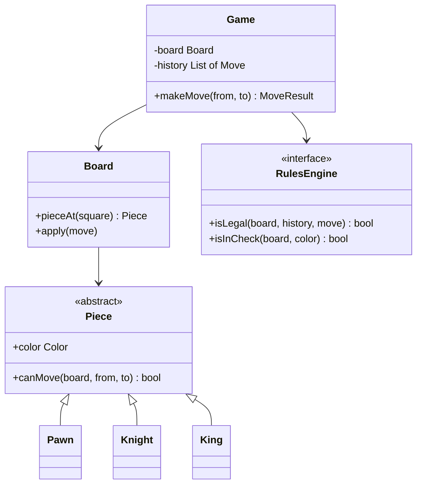

> **This problem is a trap with a scoreboard attached.** Amazon, Adobe, Meta, and Microsoft keep "design a chess game" in rotation because it runs two tests at once. Test one is the OOD judgment call: polymorphic `Piece.canMove()` versus a rules engine, when a pattern adds clarity vs abstraction theater. Test two is sneakier: full chess legality is **400+ lines and hours of work**, and the session is 45 minutes. A junior starts coding the Knight and dies in the weeds. A Director **negotiates scope out loud in the first five minutes**, splits piece geometry from game-state legality, implements the cheap layer, stubs the expensive one, and is scored on the negotiation itself. Connect Four and Tic-Tac-Toe are this family's screener variants, same Board/Player/win-check skeleton, no piece taxonomy; chess is the senior version because it tests the judgment.

### Learning objectives

- Run the **scope negotiation as a deliverable**: separate piece geometry (~150 lines, in scope) from game-state legality (400+ lines, stubbed behind an interface), and say the script out loud.
- Decide **inheritance vs composition by the shape of variation**, not dogma: a closed 6-type taxonomy with type-varying behavior is the textbook case where inheritance earns its keep.
- Place every rule by one litmus test: *decidable from the piece's own movement shape alone?* Geometry → `Piece`; board or history context → `RulesEngine`.
- Evolve under follow-ups, **undo via Command**, network play via a server-authoritative move log, without restructuring.

### Intuition first

Chess rules come in two boxes, and the whole interview is noticing the boxes are different sizes. Box one: **how each piece moves**, a bishop slides diagonally, a knight jumps in an L. Six shapes, unchanged for five centuries, each a few lines; a piece can answer "can I move there?" from the board alone. Box two: **what the game permits**, no move may leave your own king in check; castling has five preconditions; en passant depends on *what the previous move was*. Every box-two rule needs context a single piece doesn't have: the whole board, the history, or both. Box one is an afternoon; box two is why chess engines are careers. The senior move: box one in the piece classes (polymorphism, behavior varies by type over a closed taxonomy), box two behind a `RulesEngine` interface; implement one, stub two, and *tell the interviewer that's the plan and why*. The negotiation is not a dodge: it shows you can size work, sequence it, and protect an architecture under time pressure, the actual job.

---

## R: Requirements

> LLD adaptation, said out loud: in HLD problems R cuts scope to a defensible core; here **R is the score**, seniors are graded on negotiating what 45 minutes can hold, not on knowing chess. Spend five real minutes here.

**The scope-negotiation script, say something close to this, verbatim:**

> *"Chess has two layers of rules. Layer one is piece geometry, how each of the six types moves, about 150 lines, and it's where my object model shows. Layer two is game-state legality, check, checkmate, castling, en passant, promotion, draws, easily 400+ lines; castling alone has five preconditions. Implementing layer two would consume the session and show you nothing about my design judgment. So I propose: I design the full structure so every rule has a named home, **implement the six piece geometries**, and **stub game-state legality behind a `RulesEngine` interface**, then we deep-dive whichever rule you pick with the time left. Does that split work for you?"*

That paragraph quantifies the work, proposes a contract instead of asking permission, and leaves the interviewer a control knob. Most accept, and the one who says "no, do castling" has just *told you the rubric*.

**In scope (the contract):** two-player, local, turn-alternating 8×8 game; **move validation for all six piece types**, the geometry layer, fully implemented; move execution (capture, turn switch, basic status); **structure** for check/checkmate/castling/en passant/promotion, a `RulesEngine` interface with named methods, stubbed.

**Negotiated out (with the reason stated):** check *detection* only if time permits (the one legality rule that cheaply reuses geometry); checkmate (needs move generation + simulation); draw rules (threefold repetition needs full history); clocks; AI; persistence; networking, the last two return in Design evolution, because the follow-ups are predictable.

**Non-functional requirements, yes, an LLD has them:** every piece geometry **unit-testable in isolation** (no `Game` needed to test a knight); new rules attach without modifying piece classes; the model survives the two standard follow-ups, undo and network play, **without restructuring**. That last NFR quietly drives the data model.

---

## E: Estimation

> LLD adaptation: no QPS to compute, estimation becomes **time-budget math**, and it's what makes the scope negotiation defensible rather than lazy. Numbers, not vibes.

**The state is trivial, say so in one breath:** 64 squares, ≤32 piece objects, a packed board ~32 bytes; a move encodes in ~4 bytes; average legal moves per position ≈ 35. Nothing is a scale problem; the only scarce resource is **interview minutes**.

**The line-count asymmetry that justifies the split:**
- *Geometry:* rook/bishop/queen share one ray-sliding helper (~15 lines); knight and king are offset-table lookups (~5 each); the pawn is the diva, direction asymmetry, two-square first move, diagonal-only capture, ~25 lines. **Total ≈ 150 lines, ~20 minutes.**
- *Legality:* castling = **5 preconditions** (king unmoved, rook unmoved, path empty, king not in check, king doesn't cross an attacked square, two need history or attack maps); en passant needs the *previous move*; checkmate needs generate-all-moves-and-simulate; threefold repetition needs the full game log. **Total 400+ lines, hours**, 3:1 the work for the layer with the *least* design signal.

**The 45-minute budget:** ~5 min scope negotiation, ~10 min object model + diagram, ~20 min geometry code, ~10 min in reserve for the interviewer's chosen deep-dive. Announcing the budget is itself signal.

---

## S: Storage

> LLD adaptation: "storage" means **where state lives and who owns it**, board representation, and which object is allowed to know what.

**Decision: `Board` owns an 8×8 grid of `Piece` references; pieces do not know their own position.** A piece is asked `canMove(board, from, to)`, position is an argument, not a field. *Rejected, pieces storing their own position:* two sources of truth (grid and field) that desynchronize on every capture and undo, the most common bug-source in submitted chess designs. One owner per fact.

**Rejected, bitboards** (one 64-bit word per piece type, what real engines use): a 10-100× move-generation speedup buying nothing at 1 move per several seconds of human thought, at the cost of the readable object model the interview exists to evaluate. Right answer, wrong altitude, naming and declining it beats using it.

**Rejected, `Square` objects holding piece logic:** a fat `Square` smears movement rules across 64 objects. Squares are coordinates; keep them values.

**Game state beyond the board:** turn, castling rights, en-passant target, and status live on `Game`, **plus the move history**, which earns its keep twice in Design evolution.

---

## H: High-level design

> LLD adaptation: H shrinks from a fleet diagram to a class diagram, and the diagram *is* the inheritance-vs-composition argument, drawn.



(Bishop, Rook, Queen complete the hierarchy; sliding pieces share a ray helper.)

**The load-bearing decision, polymorphic `Piece.canMove()` for geometry.** Composition-over-inheritance is good dogma *because* most taxonomies are open and most behaviors combine. Chess geometry is the counter-case: a **closed taxonomy** (six types, fixed for 500 years), behavior that **varies entirely by type**, **zero combination** (no piece is "a bishop that also jumps"). Exactly the conditions where inheritance is the clearest tool, one class per type, independently unit-testable, no indirection tax. *Rejected, a `MoveValidator` strategy per piece type:* it buys runtime-swappable movement rules, what you'd want for fairy-chess variants, and is pure ceremony when variants aren't a requirement. The Director sentence: *"I'd use Strategy the day variants enter the requirements; today it's an abstraction with no second implementation."* *Rejected, one centralized `validateMove` switch:* how engines do it for speed, but it collapses six testable units into one 200-line conditional and erases the OO signal being scored.

**The second load-bearing decision, game-state legality does *not* live in pieces.** The litmus test, stated out loud: *can this rule be decided from the piece's own movement shape alone?* Check, castling, en passant, and promotion all fail it, they need the board, the history, or both, so they live behind `RulesEngine`. This is why "check detection in `King.canMove()`" is the classic wrong answer: check is a predicate over *every enemy piece's* geometry, not a property of the king's movement.

**Move flow, compressed:** `Game.makeMove(from, to)` → bounds/turn/ownership guards → `piece.canMove(board, from, to)` (geometry) → `rulesEngine.isLegal(board, history, move)` (stubbed true, structure shown) → `board.apply(move)` → append to history → flip turn.

---

## A: API design

> LLD adaptation: the API is the interface contract, signatures and failure semantics. ≤25 lines, every line defensible.

```
enum MoveResult { OK, ILLEGAL_GEOMETRY, ILLEGAL_RULE,
                  WRONG_TURN, OUT_OF_BOUNDS }

abstract class Piece {
  final Color color
  abstract bool canMove(Board b, Square from, Square to)
  // geometry only -- no game state, no history
}

interface RulesEngine {
  bool isLegal(Board b, List<Move> history, Move m)
  bool isInCheck(Board b, Color c)
  GameStatus status(Board b, List<Move> history)
  // stub returns legal / not-in-check / IN_PROGRESS;
  // every future rule already has a home
}

class Game {
  MoveResult makeMove(Square from, Square to)
  List<Move> history()
  GameStatus status()
}
```

**Design notes (each with its rejected alternative):** `canMove` takes the board as a parameter, *rejected: pieces holding board references*, which couples pieces to game lifecycle and breaks isolated testing. `RulesEngine.isLegal` takes `history`, *rejected: a stateless signature*, because en passant and castling are **history-dependent**; **stub the behavior, never the contract**. `makeMove` returns a result enum rather than throwing, illegal moves are expected domain outcomes, not exceptions.

---

## D: Data model

> LLD adaptation: not tables, the **value objects**, and one decision that quietly pre-pays for both follow-ups.

- **`Square`**, immutable file/rank pair. **`Color`**, **`PieceType`**, **`GameStatus`**, enums.
- **`Move`**, the consequential one: `{from, to, piece, captured, flags}`, flags marking promotion/castle/en-passant. A move record is **~4 bytes encoded**; a board snapshot is 64+ bytes and loses *intent*.

**Decision: `Game` keeps `List<Move>`, the move log, as first-class model state, even in v1.** Three rules *require* it (en passant, castling rights, threefold repetition), and it is the seam both follow-ups attach to: undo pops it, network play ships it. *Rejected, board snapshots per turn:* a 100-move game is only ~25 KB, so memory isn't the argument, **intent is**. A move log is replayable, validatable, and transmittable; a pile of board states is none of those. Event sourcing in miniature.

---

## E: Evaluation

> LLD adaptation: no NFR re-check against QPS, instead, stress the model against the **probes interviewers actually run**, and show the structure absorbs each without surgery.

**Probe 1, "Where does check detection live?"** In `RulesEngine`, and the cheap version if time permits: `isInCheck(board, color)` = *does any enemy piece's `canMove` reach this king's square*, ~10 lines that **reuse the geometry layer verbatim**. The expensive-sounding rule is a loop over the cheap layer. Full legality ("no move may leave your own king in check") then needs apply-test-undo simulation, name it, stub it, don't write it.

**Probe 2, "Your pawn is wrong."** It usually is, the pawn carries 5 special behaviors and is where geometry bugs cluster. Direction asymmetry, double-step, diagonal-only capture: pure geometry → inside `Pawn`. En passant and promotion **fail the litmus test** → `RulesEngine`. Drawing that line through one piece beats six perfect classes.

**Probe 3, "Isn't an interface with one stub implementation over-engineered?"** No: `RulesEngine` is **negotiated scope made structural**, the receipt for the deal cut in R, with check/castling/en passant as *named, certain* future implementations. Abstraction with named clients is design; with imagined clients, theater, and the Strategy-per-piece you *declined* on those grounds shows the judgment is a policy, not a coin flip.

**Probe 4, "Test the knight."** `new Knight(WHITE).canMove(board, e4, f6)` → true; no `Game`, no `RulesEngine`, no fixtures. Six classes × a handful of cases ≈ a test suite in minutes, the testing NFR from R, cashed.

<details>
<summary>Go deeper, geometry implementations and the ray-sliding helper (IC depth, optional)</summary>

Rook/bishop/queen share one helper: `slides(board, from, to, directions)`, confirm the from→to delta matches an allowed direction, then walk square-by-square checking emptiness until `to`; the destination must be empty or enemy-occupied. Rook directions = 4 orthogonal unit vectors, bishop = 4 diagonal, queen = all 8. Knight and king validate the delta against a fixed offset set ({±1,±2} L-shapes; the 8 unit neighbors) plus the same destination check, no path walk, since neither slides. Pawn: `dir = (color == WHITE ? +1 : -1)`; forward 1 requires empty destination; forward 2 requires start rank and both squares empty; capture requires |Δfile| == 1, Δrank == dir, and an enemy on the destination. Promotion and en passant are *not* here, they mutate state beyond the move or need history, so they belong to `RulesEngine`. Each class is 5-25 lines; the whole layer fits in ~150.

</details>

<details>
<summary>Go deeper, check, legal-move filtering, and checkmate (IC depth, optional)</summary>

`isInCheck(board, color)`: locate the king; for each enemy piece, ask `canMove(board, itsSquare, kingSquare)`; any true → check. Cost: ≤16 geometry calls, microseconds. Full legality filter: a candidate move is legal iff geometry passes AND applying it doesn't leave the mover in check, implement as apply → `isInCheck` → undo (this is where the Command pattern's `undo` gets reused *inside* the engine, a nice unification to mention). Checkmate: in check AND no legal move exists, generate all pseudo-legal moves (~35 average) and run the filter on each; stalemate is the same loop without the check precondition. Castling preconditions check the history for king/rook moves (or cache `hasMoved` flags updated from the log) plus path emptiness and the three attack checks. En passant: the previous move in `history` must be an enemy pawn double-step landing adjacent.

</details>

---

## D: Design evolution

> The follow-ups are predictable; the data model already paid for them. Walk each one in two minutes, naming the pattern and its trade-off.

**Undo / move history → Command pattern.** `Move` graduates from record to command: `execute(board)` / `undo(board)`, the captured piece stored on the move so undo can restore it. Undo = pop the history, call `undo`. *Trade-off vs board snapshots:* snapshots are simpler and the memory difference trivial (~25 KB/game), but commands **unify three consumers**: undo, the check-simulation inside `RulesEngine`, and network replay. One abstraction, three buyers, a pattern earning rent. *Redo* is a second stack, free.

**Network play → ship moves, not boards.** Client-server, **server-authoritative**: clients *propose* moves; the server runs the same `Game` validation and broadcasts accepted moves with a **sequence number** (the problem in miniature, both clients must apply in identical order). Never trust client validation, a hacked client is just an HTTP client. A move is ~4 bytes vs 64+ for a board, but the real win is replayability: reconnect = replay from last sequence number; spectators = subscribe to the log (the shape); persistence = the append-only log itself. The move log *is* the wire protocol *is* the storage format, one decision in D, three payouts.

**Where I'd delegate (the Director move, even in an LLD):** *"For production I'd wrap an open-source rules engine for validation and hints, my prior is wrap-don't-build, because chess legality is a solved, brutally testable domain where custom code is pure liability. I keep the object model, the move-log contract, and the server-authority boundary."*

**If the taxonomy opens**, fairy-chess variants, user-defined pieces, the inheritance decision flips on its own terms: movement becomes data/strategy (`MoveRule` objects composed per piece), exactly the design declined in H. Requirements changed, so the answer changes; that's the point.

---

## Trade-offs table: the pivotal decision

| Decision | A, Polymorphic `Piece.canMove` | B, Strategy `MoveValidator` per type | C, Centralized rules engine for everything | Use when… |
|---|---|---|---|---|
| **Where movement rules live** | One class per piece type; geometry only | Generic `Piece` + injected validator object | One `validateMove` switch / move tables | **A** when the taxonomy is closed and behavior varies by type, chess exactly (our choice). **B** when variants are a *requirement* (fairy chess), otherwise indirection with no second client. **C** when raw speed rules (engines, bitboards), wrong altitude for an OOD interview. |
| **Cost** | New piece type = new class (fine: closed set) | Extra layer on every call; more files | One giant conditional; untestable in units |, |
| **What it signals** | Judgment: pattern fits the variation shape | Pattern fluency, possibly pattern reflex | Engine knowledge, OO indifference |, |

The meta-decision framing the table: **geometry in pieces, game-state legality in `RulesEngine`**, hybrid by litmus test, not purity.

---

## What interviewers probe here (Director altitude)

- **"What will you build in 45 minutes?"**, *Strong:* the negotiation script, quantified split (150 vs 400+ lines), geometry implemented, legality stubbed behind an interface with the *right signature*. *Red flag:* opens an editor and starts typing `class Knight`.
- **"Why inheritance? Isn't composition preferred?"**, *Strong:* closed taxonomy + type-varying behavior + no combination = inheritance's home turf; names the requirement change (variants) that flips it to Strategy. *Red flag:* dogma in either direction.
- **"Where does check live?"**, *Strong:* `RulesEngine`, via the litmus test; sketches the 10-line reuse of geometry. *Red flag:* check inside a piece class, or a `Board` that has quietly become God.
- **"Isn't the stub interface over-engineering?"**, *Strong:* abstraction with *named certain clients* (check, castling, coming) vs the speculative Strategy they declined; the interface is negotiated scope made structural. *Red flag:* can't defend their own abstraction, or a history-free signature they'd have to break.
- **"Two follow-ups: undo, then network."**, *Strong:* Command from the existing `Move` + history; server-authoritative move log with sequence numbers; notices one decision serves both. *Red flag:* board snapshots over the wire, or trusted client validation.

---

## Common mistakes

- **Coding before negotiating.** Ten minutes into the Knight with no scope contract, the outcome is decided. The negotiation *is* the senior deliverable; the code is evidence.
- **Check detection inside `King` (or `Board`).** Check is a whole-board predicate over enemy geometry, it fails the litmus test. The most reliable junior tell on this problem.
- **Pieces that know their own position.** Two sources of truth that desync on every capture and undo. Board owns placement; position is an argument.
- **Promising checkmate.** Move generation + simulation, the most expensive rule in the game, offered casually in minute 30. Name its cost; stub it.
- **Stubbing with the wrong contract.** A history-free `isLegal(board, move)` can never host en passant or castling, stub behavior, never the signature.

---

## Interviewer follow-up questions (with model answers)

**Q1. "Forget the stub, implement castling, now."**
> *Model:* First, the receipt: castling is exactly why `RulesEngine` takes `history`. Five preconditions: king unmoved, rook unmoved (both from the log, or `hasMoved` flags maintained from it), path empty, king not currently in check, king doesn't cross an attacked square. Implement as a guard list in `RulesEngine.isLegal` for the castle-flagged move; `Move.execute` moves both king and rook, the one move touching two pieces, which is why castling lives at the rules layer, not in `King.canMove`. Cost: ~30 lines, and nothing in the piece classes changed, the open-closed claim from my NFRs, demonstrated.

**Q2. "Where does check detection live, and what does it cost?"**
> *Model:* `RulesEngine.isInCheck(board, color)`: find the king, loop over ≤16 enemy pieces, ask each one's existing `canMove(board, from, kingSquare)`, geometry reused verbatim, ~10 lines, microseconds. It can't live in `King` because it's a predicate over *other pieces'* movement; "may I move?" and "does the game permit it?" are different questions with different owners. Full legality adds apply-simulate-undo per candidate move, that's where I'd stop and name the next step rather than write it.

**Q3. "Make it two players over a network."**
> *Model:* Client-server, server-authoritative: the server owns the only trusted `Game`; clients send proposed moves (~4 bytes + framing); the server validates with the same two-layer pipeline and broadcasts accepted moves with sequence numbers so both clients apply in identical order, the ordering problem in miniature. Never trust client validation: a hacked client is just an HTTP client. Reconnect = replay from the last acked sequence number; spectators subscribe to the same log; persistence is the log itself. The decision that made this a two-minute answer was made in the data model: keep moves, not snapshots.

**Q4. "Your next interview is Connect Four. What carries over?"**
> *Model:* The family skeleton, `Board`, `Player`, `Game.makeMove`, status check, move history, is identical. What disappears is the piece taxonomy: one move type, so polymorphic pieces would be pure ceremony; the design collapses to `Game` + grid + a win-checker (four-in-a-row scan from the last drop, ~20 lines, only the new disc can complete a line, so check locally). The judgment is symmetric: chess earns inheritance because behavior varies over a closed taxonomy; Connect Four earns *none* because nothing varies. Same principle, opposite designs, exactly what the family tests.

---

### Key takeaways

- **The scope negotiation is the score.** Quantify the split, geometry ≈ 150 lines vs legality 400+, propose the contract out loud, implement the cheap layer, stub the expensive one. Coding before negotiating is the losing opening.
- **Inheritance vs composition is decided by the shape of variation, not dogma.** Closed 6-type taxonomy + type-varying behavior + no combination → polymorphic `Piece.canMove`; when variants become a requirement, the same reasoning flips to Strategy.
- **One litmus test places every rule:** decidable from the piece's own movement shape → `Piece`; needs board or history (check, castling, en passant, promotion) → `RulesEngine`. Check in `King.canMove` is the junior tell.
- **Keep the move log from v1.** Three rules require history anyway, and the log is simultaneously the Command/undo stack, the network protocol, and the persistence format.
- **Stub behavior, never contracts**, defend the stub interface as negotiated scope with named future clients. For production: wrap an existing rules engine; keep the model, the log contract, and the server-authority boundary.

> **Spaced-repetition recap:** Chess = the games family's **judgment test under a scope trap**. Negotiate first: geometry (~150 lines) in, legality (400+) stubbed behind `RulesEngine(board, history, move)`. Polymorphic `Piece.canMove` because the taxonomy is closed and behavior varies by type, Strategy only when variants are required. Litmus test: shape-only → piece; board/history → rules engine. Move log from day one: undo stack (Command), wire format (server-authoritative + sequence numbers), and save file. Tic-Tac-Toe/Connect Four = same skeleton, no taxonomy, opposite (and equally correct) pattern answer.

---

*End of Lesson 7.9. the seat-locking tested whether your concurrency mechanism holds under contention; chess tests whether your **abstractions are sized to the time and the requirements**, inheritance where variation is closed, an interface where scope was negotiated, a move log because three futures need it. The pattern that fits the variation, and the scope you can defend out loud, is the whole rubric.*
