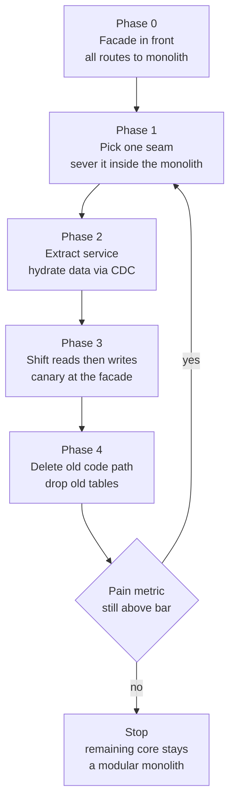

> **The single most-cited architecture-strategy prompt in Director loops** - asked as a design case ("this monolith is slowing 100 engineers down") and again behaviorally. It is not a technology question. The junior answer draws microservice boxes and starts extracting. The Director answer **resists the migration by default**, makes it clear a quantified business case, sequences it in reversible increments under live traffic, and - the strongest signal in the genre - names a **stopping condition**: what will *never* be extracted, and why stopping there is success, not failure.

### Learning objectives
- Run an **adapted RESHADED** spine on a strategy problem: R becomes the *business pain*, E becomes *deploy-velocity math*, and Evaluation/Design evolution carry the lesson - **the migration sequence IS the design**.
- Frame the load-bearing tension: **decompose vs don't** - strangler-fig increments with a named business reason per extraction, vs the big-bang rewrite and the shared-database **distributed monolith**.
- Quantify the monolith's tax (deploys/week per team, coordination cost, blast radius) and the migration's price (engineer-years, platform team, infra multiple) - proceed only if the first dwarfs the second.
- Apply **seam-selection heuristics** - domain boundaries, data ownership, change frequency - and run the **shared-DB breakup**, the genuinely hard part.
- Name the stopping condition and kill criteria, and delegate platform depth credibly.

### Intuition first
The pattern is named after a real plant. A **strangler fig** doesn't fell the host tree - it grows *around* the living tree, root by root, until the host is hollow and the fig stands on its own. The canopy never falls. That is the only safe way to replace a system 100 engineers ship into and the business runs on: grow the new thing **around** the old one, route by route, while the old one keeps serving traffic - and at every step you can stop, because each increment stands alone.

The big-bang rewrite is the opposite move: fell the tree, plant a sapling, and ask the business to live without shade for two years. It fails so reliably it has a name - the **second-system effect**: the rewrite chases a moving target (the business won't freeze), the cutover is one irreversible bet, and at month 18 you have two half-systems and zero shipped features.

And there is a third character, worse than the monolith: the **distributed monolith** - twenty services sharing one database, deploying in lockstep. Every microservice tax, every coupling you had. It is the most common *actual outcome* of these migrations, and the shared database is how you get there. Hold that: **the database breakup, not the code breakup, is the hard part.**

---

## R: Requirements

> **Adaptation, said out loud:** in a product design, R scopes features. Here R is the **pain inventory**, demanded quantified - "the monolith is slow" is not a requirement. If the pain can't be measured, the answer is *don't migrate*.

**Clarifying questions I'd ask (with assumed answers):**
- *What exactly hurts?* → **Deploy velocity and blast radius.** 100 engineers in ~12 teams ship through one weekly release train; one bad commit rolls back everyone; a checkout bug takes down search.
- *Architecture or code quality?* → Worth pressing: a **modular monolith** with a clean build and module ownership fixes 60-70% of this pain for ~10% of the cost. Assume here it's been tried and the coupling is structural.
- *Is headcount growing?* → Yes, 100 → 160 over two years. Coupling cost grows superlinearly with team count - this tips the math.
- *Can we freeze features?* → **No.** Revenue platform. This single answer **eliminates the big-bang rewrite** before we discuss its other flaws.
- *Appetite?* → ~18-24 months, ≤ ~20% of engineering capacity at any time.

**The pain, quantified (this is the requirements list):**
1. **Deploy frequency:** 2 org-wide deploys/week → **0.17 deploys/week per team** (elite teams do daily-plus, DORA); a finished change waits a median ~3 days to ship.
2. **Change failure + blast radius:** ~15% of release trains roll back, each reverting **~30 unrelated changes** from 12 teams. Every incident has 100% blast radius.
3. **Coordination cost:** one shared 4-hour regression suite, a merge queue, a release-captain rotation; ~20-30% of sprint capacity lost to cross-team coordination.
4. **Team coupling:** 12 teams = up to **66 pairwise coordination paths** through one codebase and one schema.

**Explicitly NOT requirements (scoping is the signal):** "industry best practice," "Netflix does it," runtime scale. At this size, **the monolith almost never has a scale problem - it has an organizational problem.** It handles the traffic fine behind a load balancer; what it can't handle is 12 teams.

**Non-functional constraints:** no feature freeze; every increment **reversible**; user-visible behavior unchanged during migration; flat infra budget growth tolerated to ~2×; the org must build observability and on-call maturity *before* the first extraction, not after.

**The case the migration must clear (the resist-by-default test):** the velocity tax must exceed the migration cost *plus* the permanent new costs (platform team, infra multiple, distributed-systems failure modes) - **and** a modular monolith must have been tried or credibly ruled out. State this gate before drawing a single box.

---

## E: Estimation

> **Adaptation, said out loud:** no QPS here - E becomes **velocity and cost math**: before/after deploy numbers, coordination cost, the migration's price tag. Same estimation discipline: round aggressively, let the numbers make the call.

**The tax, today.**
- Throughput: 12 teams × 0.17 deploys/week ≈ **2 deploys/week org-wide**; merge-to-production lead time ~3-5 days.
- Coordination drag at ~25% of capacity: **~25 engineer-equivalents ≈ $5M/year** fully loaded (~$200K/engineer) - spent on merge queues and release trains, not features.
- Trend: at 160 engineers (~20 teams), coordination paths grow to ~190 vs 66 today - **~3× the interference for 1.6× the people**. The tax compounds; doing nothing is the expensive option *if* growth is real.

**The target, after.**
- Each team owns 1-3 services, deploys independently: 12 teams × ~5 deploys/week = **~60 deploys/week** (~30×); lead time in hours.
- Blast radius: a bad deploy takes down **one team's surface (~8%)**, not 100%; rollback reverts one service, not 30 changes.

**The price.**
- Migration: ~20% of 100 engineers × 24 months ≈ **40 engineer-years ≈ $8M** one-time.
- Permanent: a platform team (~6 engineers, **$1.2M/year**); infra typically **1.5-2×**; an observability bill that grows with service count.
- **Break-even:** $8M one-time + ~$2M/year permanent vs a ~$5M/year coordination tax *growing toward ~$10M+* at 160 engineers. Payback ≈ 2-3 years - **defensible only because headcount is growing.** At a flat 40-engineer org the same math says *modular monolith and stop*; say that version too - showing where the answer flips is the Director signal.

**What estimation decided:** the driver is team scaling, not traffic; the migration clears the bar at this growth rate and not at half of it; ~20% capacity for ~24 months is the spend envelope.

---

## S: Storage

> **Adaptation, said out loud:** S picks databases in a product design. Here it is the **shared-database breakup** - the hardest, most-skipped step, and the one that decides whether you get microservices or a distributed monolith. Code is easy to move; **data ownership is the migration.**

**The invariant:** an extracted service **owns its data exclusively** - no other service, including the monolith, touches its tables. Every shared writable table is a hidden coupling: a schema change forces lockstep deploys, and you have rebuilt the release train over the network.

**The breakup sequence per seam (each step reversible):**
1. **Draw ownership on paper first.** Map tables to owning modules; every cross-module `JOIN` on the boundary is future work - count them before committing.
2. **Sever in-place.** Inside the monolith, replace cross-boundary joins and direct table reads with internal interfaces. No services yet - cheap, reversible, and *is* the modular-monolith step. Much of the value lands here.
3. **Extract the service, reads first.** The service gets its own store, hydrated from the monolith's tables via **change-data-capture** through a log (Kafka). Reads cut over behind a flag; writes still hit the monolith. Fully reversible: flip the flag back.
4. **Cut over writes.** The service becomes the writer; the *monolith* consumes the CDC stream for legacy read paths until those die. The **outbox pattern** keeps the DB write and the published event atomic.
5. **Drop the old tables.** Only now is the seam done. A seam stuck at step 3 for a year is a smell worth naming.

**Rejected, keep the shared DB "temporarily":** the temporary becomes permanent, and it *is* the distributed-monolith trap - independent deploys in name only. **Rejected, app-level dual writes:** no atomicity, guaranteed drift; the outbox/CDC pattern exists precisely to avoid this. **Rejected, 2PC across seams:** availability coupling on hot paths; cross-service workflows become **sagas** - local transactions with compensations - and you accept eventual consistency at seams (the CAP trade, made at the org level). A workflow that truly can't tolerate that is evidence the seam is misplaced - move the boundary, don't add 2PC.

<details>
<summary>Go deeper, outbox, CDC, and backfill mechanics (IC depth, optional)</summary>

**Outbox:** the service writes its business row and an event row to an `outbox` table *in the same local transaction*; a relay (or Debezium tailing the WAL/binlog) publishes outbox rows to Kafka and marks them sent. Consumers are idempotent (event IDs deduped), because the relay guarantees at-least-once.

**CDC hydration of a new store:** snapshot the source tables (consistent read), record the log position, replay the change stream from that position into the new store, then keep tailing. Verify with continuous row-count and checksum comparisons before any cutover.

**Write cutover with a safety net:** cut writes to the new service but keep reverse-CDC (new store → old tables) running for a sunset window, so a rollback is a config change, not a data-recovery incident. Kill the reverse stream only after N clean weeks.

**Cross-boundary joins that survive:** replace with either (a) API composition at read time (adds a hop - fine for low-QPS paths), or (b) a local read model maintained from the other service's events (fast reads, eventual staleness - fine for display, wrong for invariants).

**Counting the seam cost up front:** before committing to a seam, grep the codebase for cross-boundary joins and direct table reads on the candidate boundary; the count is a usable proxy for the breakup effort (10 joins ≈ a quarter of severing work for one team; 200 ≈ pick another seam or split the boundary differently).

</details>

---

## H: High-level design

> **Adaptation, said out loud:** the "architecture diagram" here is not the end-state service mesh - it's the **strangler-fig facade and the phase machine**. The end state is an output, not a blueprint.

**The facade:** a routing layer in front of the monolith - usually the API gateway or L7 load balancer you already run, not new infrastructure. All traffic hits the monolith on day one; each extraction claims routes (`/notifications/*` → new service). Cutover and rollback are **routing config changes** - percentage-based, canaried, instant to revert.

**An anti-corruption layer** sits between each new service and the monolith: a thin translation boundary so the clean new model doesn't import the monolith's tangled one. *Rejected: new services speaking the monolith's internal types* - it silently re-couples everything you just paid to separate.



**Which seam first - the selection heuristics (name all three):**
1. **Domain boundaries:** extract along bounded contexts - business-language seams (notifications, billing, search), never technical layers. A shared "data-access service" is a layer, not a seam, and every extraction will couple to it.
2. **Data ownership:** prefer seams whose tables are touched mostly by one module - the S-step cost is proportional to the cross-boundary joins you must sever.
3. **Change frequency:** extract what changes often (where the release-train pain concentrates); leave what's stable - a module that deployed twice a year gains nothing.

The first extraction should be **deliberately low-stakes** - high churn, low data coupling, eventual-consistency tolerant (notifications is the classic: async by nature). Its real job is **building the org's muscle** - CDC pipeline, runbooks, deploy tooling - where failure is cheap. *Rejected: starting with checkout because "it matters most"* - highest data coupling, lowest error tolerance, zero learning banked: the worst first patient.

---

## A: API design

> **Adaptation, said out loud:** no public API to design - the deliverable is the **seam contracts**: each service's interface treated with public-API discipline (versioned, backward-compatible, owned), because its consumers are the monolith and every future service.

```
# Seam contract: notifications service (first extraction)
POST /v1/notifications            # enqueue; idempotency-key required
GET  /v1/notifications/{userId}   # read model, eventually consistent

# Events consumed from the monolith outbox (Kafka):
OrderPlaced{orderId, userId, total, v1}
UserUpdated{userId, fields, v1}
```

**Rules that prevent re-coupling (each with its rejected alternative):**
- **Versioned, additive-only changes** within a major version. *Rejected: lockstep schema changes coordinated over Slack* - the release train again, with extra steps.
- **Events carry facts, not commands** ("OrderPlaced", not "SendEmail") - the consumer decides its own reaction. *Rejected: command-style events*, which invert dependency and recreate coupling.
- **Synchronous calls are a budget, not a default.** Each hop adds ~1-5 ms and failure surface; a chain of 5 sync calls at 99.9% each is ~99.5% - every hop spends availability. Prefer async events; where sync is unavoidable, timeouts + retries with backoff + circuit breakers from day one.

---

## D: Data model

> **Adaptation, said out loud:** the "schema" here is the **ownership map** - which team owns which tables, services, and pager. This is Conway's law as a design tool: **the service boundaries you can sustain are the team boundaries you have.** Design the org chart and the architecture together or watch them fight.

The working artifact is a matrix - every monolith table × owning domain, with cross-boundary access counts:

| Table cluster | Owner (target) | Cross-boundary joins | Verdict |
|---|---|---|---|
| notifications, templates | Notifications team | 2 | **Extract first** - cheap seam, async-tolerant |
| search index, query logs | Search team | 3 | Extract second - already read-only-ish |
| orders, payments, ledger | Checkout team | 25+ | Extract **late** - after the muscle exists |
| users, auth, permissions | Identity | touched by everyone | Extract carefully or **never** - highest fan-in |
| catalog core | Catalog | 40+ joins, stable, low change rate | **Never extract** - the stopping condition lives here |

Two readings matter. **Fan-in is destiny**: a table everyone joins (users, catalog) is either a deliberately designed platform service or it stays in the core - extracting it casually puts a network hop in everyone's hot path. And **the verdict column is the migration plan** - sequencing falls out of ownership + join-count + change frequency, not architectural taste.

---

## E: Evaluation

> **Adaptation, said out loud:** you stress the **migration** against its failure modes, not an architecture against NFRs - this step and the next carry the lesson, because a strategy answer is judged on how it fails.

**Failure mode 1, the distributed monolith (the most likely outcome).**
*Symptom:* services that deploy together, share a database, or break together. *Detection:* track **% of deploys touching exactly one service** (target >90%) and lockstep changes per quarter. *Fix:* stop extracting, fix the seams you have. *Rejected: pushing on to a service-count milestone* - service count is a cost, not a KPI.

**Failure mode 2, operational immaturity.**
The monolith debugged with a stack trace; 15 services need distributed tracing, centralized logs, per-service dashboards and pagers - **none of which exist yet**. *Fix:* the platform investment lands **before** extraction #2, not after incident #5. *Trade-off:* ~6 engineers of spend producing zero features - name it in the budget; hiding it is how migrations get cancelled at month 9.

**Failure mode 3, the latency and consistency tax.**
In-process calls (~1 µs) become network calls (~1-5 ms); transactions become sagas; read-your-own-write stops being free at seams. *Fix:* sync-call budgets per request path, async-first seams, seams placed where eventual consistency is tolerable. *Rejected: 2PC across services* - if you need it, the seam is wrong, as argued in S.

**Failure mode 4, the stalled migration (half-out is the worst state).**
Two systems, double cognitive load, CDC pipelines as permanent infrastructure. *Fix:* **finish or revert each seam** - phase 4 (delete the old path) is part of the work; a seam parked at phase 3 for two quarters triggers an explicit finish-or-roll-back decision. *Trade-off:* slower starts on new seams; accepted - three finished seams beat eight half-done ones on every R-metric.

**Re-check vs R:** deploys/week per team is measured quarterly, not asserted; blast radius shrinks per finished seam; coordination cost is re-surveyed. Two quarters without movement means the plan - not the teams - is wrong.

---

## D: Design evolution

> **Adaptation, said out loud:** not "what if 10× traffic" - design evolution here is the **migration sequence itself**, the stopping condition, and the kill criteria. An interviewer who hears a static end-state diagram with no path to it has heard nothing.

**The sequence (each gate is a go/no-go with a metric):**
- **Quarter 0, prerequisites:** in-monolith severing of the first seams (step-2 work from S); platform basics. *Gate:* a walking-skeleton service through the real pipeline.
- **Quarters 1-2, first seam (notifications):** full lifecycle through phase 4, including deleting monolith code. *Gate:* the team deploys daily, independently, for a quarter.
- **Quarters 3-6, the paying seams:** the high-churn domains where the release-train pain lives (per the D-matrix). *Gate per seam:* deploys/week up, lockstep changes near zero.
- **Quarters 7-8, the hard seam (checkout):** only with proven muscle, the 25-join breakup pre-paid by in-monolith severing.
- **Then: stop.**

**The stopping condition (say it unprompted - the strongest signal in the answer):** catalog, identity, and every stable low-change module **stay in the monolith permanently** - perhaps 50-60% of today's code. They change rarely, so they pay no release-train tax; extracting them buys nothing R asked for. The end state is **8-12 services around a modular-monolith core**, not 100 services. Stop when the R-metrics are under the bar, not when the monolith is gone. **The monolith's death is not the goal; the deploy-velocity number is.**

**Kill criteria:** if after two seams the deploy metrics haven't moved, or lockstep deploys dominate, pause extraction - the failure is more likely seam placement or platform gaps than strategy, but the budgeted answer to "it isn't working" must exist before month 1.

**Where I'd delegate (the explicit Director move):**
- **Platform/CDC tooling:** *"The platform team owns the CDC pipeline and deploy tooling; my prior is Debezium + Kafka with the outbox pattern - log-tailing keeps producers honest. They own the bake-off and the SLA."*
- **Seam-by-seam migration:** *"Each owning team runs its breakup against the S-checklist; my prior is reads-first cutover with reverse-CDC as the rollback net."*
- **What I keep:** the sequence, the gates, the stopping condition, the budget - where the org bets, not where it benchmarks.

---

## Trade-offs table: the pivotal decisions

| Decision | Option A | Option B | Option C | Use when... |
|---|---|---|---|---|
| **Overall strategy** | **Modular monolith** - enforce boundaries, one deploy | **Strangler-fig extraction** - incremental, reversible | **Big-bang rewrite** | **A** first, always - and the *end state* for the stable core. **B** when team growth makes the math win (our choice). **C** effectively never under live pressure - irreversible, target drifts. |
| **Data during extraction** | **Shared DB "temporarily"** | **CDC + outbox, reads-first** | **App-level dual writes** | **B** (our choice) - reversible, atomic. **A** is the distributed-monolith trap. **C** drifts without atomicity. |
| **Cross-service consistency** | **2PC** | **Sagas + eventual consistency** | **Move the seam so the txn stays local** | **C** first - a seam needing 2PC is misplaced. **B** for genuine cross-domain workflows (our choice). **A** couples availability on hot paths. |
| **First extraction** | **Highest-value domain (checkout)** | **Low-risk high-churn domain (notifications)** | **A technical layer** | **B** (our choice) - builds muscle where failure is cheap. **A** is the worst first patient. **C** is a layer, not a seam - everything couples to it. |

---

## What interviewers probe here (Director altitude)

- **"Would you actually do this migration?"** - *Strong:* resists by default; demands the quantified pain; offers the modular monolith first; shows where the math flips (growing vs flat headcount). *Red flag:* starts drawing services immediately, or argues from "best practice" / scale the monolith doesn't lack.
- **"What do you extract first, and why?"** - *Strong:* the three heuristics (domain boundaries, data ownership, change frequency); a low-stakes high-churn seam whose job is building organizational muscle. *Red flag:* "the most important domain," or a technical layer.
- **"How do you split the database?"** - *Strong:* ownership map, sever joins in-monolith, CDC reads-first, outbox, reversible at every step; names the distributed monolith as what this prevents. *Red flag:* "each service gets its own DB" with no path from here to there - hand-waving the hardest part.
- **"When do you stop?"** - *Strong:* a named stopping condition - the stable core stays a modular monolith forever; success = R-metrics under the bar, not monolith death; kill criteria exist. *Red flag:* "when everything is a microservice."
- **"What does it cost?"** - *Strong:* engineer-years, a permanent platform team, 1.5-2× infra, the observability bill - and a payback argument. *Red flag:* treats the migration as free velocity. Directors own this budget.

---

## Common mistakes

- **Justifying the migration by scale instead of organization.** At 100 engineers the problem is 12 teams in one release train, not QPS. Argue traffic and you've signaled you don't know why this hurts.
- **Splitting the code but sharing the database.** The distributed monolith: lockstep deploys over a network. Data ownership is the migration.
- **No stopping condition.** "Everything becomes a service" turns a targeted intervention into a permanent tax. The stable core staying a monolith is success.
- **Starting with the crown jewels.** Checkout first = maximum data coupling, zero organizational muscle. First seams are for learning cheaply.
- **Counting services as progress.** The metric is deploys/week per team and blast radius; service count is a cost line.

---

## Interviewer follow-up questions (with model answers)

**Q1. The CEO read that Amazon uses microservices and wants the migration started this quarter. You have 40 engineers and flat headcount. What do you say?**
> *Model:* I'd bring numbers, not philosophy. At 40 engineers (~5 teams) the coordination tax is modest, while the migration costs ~$8M-equivalent effort plus a permanent platform team and 1.5-2× infra - double-digit percent of all engineering, forever. Most of the velocity outcome comes from a **modular monolith**: enforced module boundaries, module ownership, a parallelized suite, trunk-based deploys with flags - ~10% of the cost, reversible. Measure deploys/week and blast radius for two quarters; if pain persists *and* headcount scales, the strangler-fig case writes itself - and the modular-monolith work is its mandatory first phase anyway, so nothing is wasted. I won't start a 2-year migration to satisfy an article.

**Q2. Two years into a migration you inherit: 40 services, shared Postgres, and deploys still go out in a coordinated weekly batch. Diagnose and prescribe.**
> *Model:* A **distributed monolith** - the architecture changed, the coupling didn't: microservice costs (network hops, 40 pagers, infra multiple) for monolith outcomes. Root cause is the shared database: schema coupling forces lockstep releases regardless of service boundaries. Prescription: **stop extracting** - more services deepen the hole. Measure which service pairs always change together, run the S-step breakup on the 2-3 worst seams, and **merge** services that always co-change - consolidation is cheaper than fixing a wrong boundary. Success metric: % single-service deploys, quarter over quarter. Service count may go *down*; fine - it was never the KPI.

**Q3. How do you extract checkout when its tables have 25+ cross-boundary joins, without a feature freeze?**
> *Model:* Late and pre-paid - it's last in my sequence for exactly this reason. First, **sever in-monolith**: the checkout team replaces cross-boundary joins with internal interfaces *inside* the monolith - shipped continuously, no freeze, each PR reversible. That work *is* the extraction; what remains is relocation. Then the standard ladder: CDC-hydrate checkout's own store, cut reads behind a flag with checksum verification, cut writes with reverse-CDC as the rollback net, drop the old tables. Cross-domain workflows (order → payment → inventory) become **sagas**, not distributed transactions - any invariant that can't tolerate that means the boundary is misdrawn; keep those pieces together. Payments/PCI I delegate behind a tokenized interface; my prior is its own service with the smallest possible surface.

**Q4. What will you never extract, and how do you defend leaving it?**
> *Model:* The stable, high-fan-in core - in our map, catalog and identity. Two reasons from the R-metrics. **Change frequency:** the release-train tax is proportional to change rate; a module shipping twice a year pays ~zero tax, so extraction buys ~zero velocity. **Fan-in:** everything joins catalog and users; extracting them puts a network hop and a new failure mode in every hot path - spending availability to gain nothing. The defense is the success metric itself: deploys/week up, blast radius down, with those modules in place. The end state - 8-12 services around a modular-monolith core - isn't an unfinished migration; it's the design. If identity later becomes a real bottleneck, it gets extracted *deliberately*, as a designed platform service - not as cleanup.

---

### Key takeaways
- **Resist by default.** The migration must clear a quantified case: deploys/week per team (0.17 → ~5), blast radius (100% → ~8%), a ~$5M/yr coordination tax compounding with headcount vs ~$8M migration + ~$2M/yr permanent. Growing org: defensible. Flat org: modular monolith and stop.
- **Strangler-fig, never big-bang:** facade in front, extract route by route, every increment reversible, business never freezes. The rewrite fails by irreversibility and a moving target.
- **The database breakup is the migration.** Ownership map → sever joins in-monolith → CDC reads-first → outbox write cutover → drop tables. A shared DB makes a distributed monolith - the most common real outcome.
- **Seam selection = domain boundaries × data ownership × change frequency.** First seam low-stakes and high-churn (notifications) to build muscle; crown jewels last; technical layers never.
- **Name the stopping condition.** The stable high-fan-in core stays a modular monolith forever; success is the R-metrics under the bar, not the monolith's death. Service count is a cost, not a KPI.

> **Spaced-repetition recap:** Monolith → microservices = an **org-velocity problem, not a scale problem**. Gate it: quantified pain must beat migration + permanent costs; modular monolith first. Then **strangler-fig**: facade routes; seams by domain / data-ownership / change-frequency; **DB breakup via CDC + outbox, reads-first, reversible**; sagas not 2PC. Stop when the metrics clear - the stable core stays a monolith **permanently**. Distributed monolith = split code + shared DB; detect via % single-service deploys.

---

*End of Lesson 8.1. This problem inverts the product-design habits: the "load" is 100 engineers and the "latency" is a 3-day lead time. The discipline is identical - quantify, choose against alternatives, keep the risky surface small (one reversible seam at a time, the way a strong CP design keeps its consistent core small), and know what you're deliberately not building. The migration sequence is the design.*
