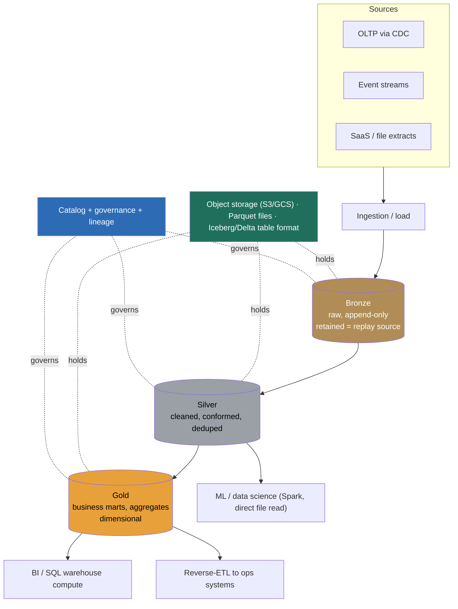

> **This is the flagship data-platform question: "design our analytical store," and it is the one most often answered at the wrong altitude.** A weak answer names a vendor ("we'll use Snowflake") and starts drawing tables. A Director-level answer opens by separating the two things the question conflates, *the storage of the data* from *the compute that queries it*, and recognizes that the central decision of the last decade was **decoupling them**: cheap object storage holding one copy of the data, elastic compute pointed at it on demand. From there the real fork appears, **a managed warehouse (turnkey, governed SQL, proprietary) versus an open lakehouse (object storage + an open table format, one copy of data for BI *and* ML, lowest storage cost, more to assemble)**, and the signal is reasoning about that trade on cost, lock-in, workload, and operational maturity rather than reciting a product. The mistake almost everyone makes is treating this as a database-selection question. It's a platform-architecture question: where does the data live, in what format, how does it get there, how is it modeled, and who is allowed to query it.

### Learning objectives
- Run the **RESHADED** spine on a **platform-architecture** problem (E becomes data-volume and scan-cost sizing; A becomes the SQL/table-format/catalog interface; D becomes the medallion data model), and surface the load-bearing tension: **decoupled storage/compute, and managed-warehouse vs open-lakehouse.**
- Open with the **"governed-SQL warehouse or open lakehouse?"** clarifying question and show how the answer flips storage format, ops model, and cost.
- Justify the **open table format** (Iceberg/Delta/Hudi) as the thing that makes a data *lake* behave like a *warehouse*, ACID commits, schema evolution, time travel, concurrent writers, and reject both raw-Parquet-directories and proprietary-warehouse-storage with reasons.
- Design the **medallion architecture** (bronze→silver→gold) and **ELT** so the platform is rebuildable from retained raw, the same idempotent-recompute property as the data-platform foundations and the billing-batch problem.
- Treat **scan-cost** as the headline budget line (bytes scanned × \$/TB, or cluster-hours) and name the layout levers, partitioning, clustering/Z-order, compaction, pre-aggregation, that control it.

### Intuition first
Think of the analytical store as a **library**, and the decade's big idea as **separating the books from the readers.** The old way (on-prem Hadoop) bolted them together: every reading room came with its own copy of every book welded to the desks, so to add a reader you bought books you already had, and to add a book you bought desks you didn't need, and the whole building stayed lit and staffed 24/7 whether anyone was reading or not. The modern way keeps **one master copy of every book in a vast, cheap basement** (object storage) and lets **reading rooms spin up and vanish on demand** (elastic compute), each room seeing the same books, none contending with the others, the lights off when empty. That separation is the lakehouse and warehouse's shared foundation.

The remaining choice is *how the basement is run.* A **managed warehouse** is a turnkey library: the vendor owns the building, shelves the books in their own proprietary system, and hands you a beautiful SQL catalog, you just read. An **open lakehouse** is a library you assemble on a public-storage basement: the books are in an **open format** (Parquet files) with an **open card catalog** (a table format like Iceberg or Delta) that any reader, your BI tool, your Spark jobs, your ML training, can use directly, no single vendor between you and your own books. The warehouse is less work and beautifully governed; the lakehouse is cheaper at scale, lock-in-free, and the *same one copy* serves the SQL analyst and the ML model. The whole problem is choosing, and assembling, the right library for who's reading and how much.

The mistake to avoid is the one that predates the separation: thinking "analytical store" means "a big database." It doesn't. It means *a place data lands, a format it lands in, layers it's refined through, and engines you point at it*, and the art is in those choices, not in a product name.

---

## R: Requirements

> Pin who queries, how fresh, how big, and, the architecture-flipping question, **governed SQL or open/multi-engine.** The spine is standard; R does double duty by extracting the warehouse-vs-lakehouse drivers.

**The opening Director move, the question I ask first:** *"Is this a governed-SQL analytics warehouse, mostly BI, finance, and analysts on SQL, where turnkey ops and governance matter most? Or is it an open lakehouse that has to serve BI **and** data science / ML on one copy of the data, at the lowest storage cost and without vendor lock-in?"* The answer flips the design:
- **Governed-SQL, BI-first, moderate scale** → a **managed cloud warehouse** (Snowflake / BigQuery / Redshift): proprietary columnar storage, turnkey, best-in-class SQL and governance, least to operate.
- **BI + ML, PB-scale, open/cost-sensitive** → an **open lakehouse**: Parquet on object storage under an open table format (Iceberg/Delta), queried by many engines (Spark, Trino, the warehouses themselves), lowest storage cost, no lock-in, more assembly.

I'll design for the **harder, increasingly-standard case: the lakehouse**, because a company at the engineering-and-data intersection has both BI and ML on the same data at scale, and I'll name explicitly when the managed warehouse is the right, simpler call (smaller scale, BI-only, ops-light teams).

**Clarifying questions I'd ask (with assumed answers):**
- *Warehouse or lakehouse?* → **Lakehouse**, BI + ML on one open copy at PB scale. The central decision.
- *Freshness?* → **Hourly batch for most marts**; some near-real-time (minutes) tables; truly live dashboards are a *separate* path, not this store's job.
- *Who queries?* → Hundreds of analysts (SQL/BI), scheduled transforms (dbt), and ML/data-science reading raw and curated data, **mixed, concurrent, isolation-sensitive** workloads.
- *Governance bar?* → Real: PII columns, row/column-level access, audit, lineage (delegated depth to the governance/catalog lesson) — table stakes for a central store.
- *Source data?* → OLTP DBs via CDC, event streams, and SaaS extracts.

**Functional requirements:**
1. **Land** raw data from many sources (CDC, events, files) reliably and replayably.
2. **Store** it cheaply at PB scale in an **open, queryable** format with ACID guarantees.
3. **Transform** raw into clean, conformed, business-ready tables (the medallion layers).
4. **Serve** SQL analytics (BI) **and** direct file access (ML/Spark) from the *same* copy.
5. **Govern**, catalog, access control, lineage, audit, over all of it.

**Explicitly CUT (scoping is the signal):** the BI tool itself, the ML training platform, sub-second user-facing analytics (that's a separate real-time OLAP store), the source systems, and the CDC mechanics (a separate problem owns those). I scope to **land → store → transform → serve + govern.**

**Non-functional requirements:**
- **Low storage cost at PB scale**, the lakehouse's whole economic premise; storage is the volume line.
- **Scan-cost efficiency**, queries must prune so cost tracks data-touched, not data-stored.
- **Workload isolation**, a heavy ML scan must not starve the finance dashboard; the decoupled-compute payoff.
- **Open format / no lock-in**, data readable by any engine, a deliberate strategic constraint.
- **ACID + schema evolution on the lake**, concurrent writers and changing schemas without corrupting readers.
- **Rebuildable**, every curated table reproducible from retained raw (idempotent recompute).

**The skew, stated:** this is **write-once-read-many, scan-heavy, concurrency-mixed.** The hard parts are *storage economics, query cost control, workload isolation, and governance*, not write throughput. That shapes every downstream choice.

---

## E: Estimation

> Enough math to make a defensible call; here the load-bearing numbers are **retained volume** (the storage bill) and **bytes scanned per query** (the compute bill), the two halves of decoupled cost.

**Assumptions:** **~10 TB/day** ingested raw (events + CDC + extracts); retain **~3 years** hot-ish; medallion layering (bronze raw + silver cleaned + gold marts) adds ~2× the raw footprint; columnar compression ~3–5×.

**Storage volume (the decoupled "storage" bill):**
- Raw in: `10 TB/day × 365 × 3 ≈ 11 PB` over three years, *before* compression and layering.
- Compressed (~4×) and with bronze/silver/gold (~2× raw): on the order of **~5–8 PB stored.**
- On object storage at ~\$23/TB-month (hot tier): `~6 PB × \$23 ≈ ~\$140k/month` if all hot. **The lever:** tier cold partitions (older than ~90 days, rarely scanned) to infrequent-access/archive at ~\$4–1/TB-month, cutting the bill **5–20×** for the cold majority. *Trade-off named:* archived data is slower/pricier to read on the rare scan, accepted because cold analytical data is read seldom. **Tiering is the storage-cost lever**, and it's why open formats on object storage beat proprietary warehouse storage at this volume.

**Scan-cost (the decoupled "compute" bill), where the real money and the real design live:**
- Say **2,000 analytical queries/day** plus **hourly transforms** over ~thousands of tables.
- A *naive* dashboard scanning a 2 TB table at ~\$5/TB = **\$10/query**; 2,000 such = **\$20k/day ≈ \$600k/month.** Unacceptable, and avoidable.
- *Pruned*: partition by day + project ~5 of 50 columns + cluster on the filter key → a typical query scans **~5–20 GB, not 2 TB**, i.e. **~\$0.025–0.10/query**, a **50–400× cut.** Per month that \$600k becomes **single-digit thousands.**
- **What estimation decided:** the storage bill is real but tier-able; **the compute bill is dominated by bytes scanned and is controlled by layout (partitioning + clustering + pre-aggregation), not by buying bigger clusters.** This is the number a Director defends, and it points straight at the medallion model and file-layout design below.

**Concurrency / isolation:** hundreds of concurrent analysts + ML reads + transforms. Decoupled compute lets us run **separate, independently-sized compute pools** (a BI warehouse, an ML/Spark pool, an ETL pool) over **one copy** of the data, so workloads don't contend, the architectural payoff of separating storage from compute.

---

## S: Storage

> This is the heart of the problem. Three nested decisions: **object storage** (where), **file format** (how each file), **table format** (how files become an ACID, evolvable table), and then warehouse-vs-lakehouse falls out.

**1. Object storage as the substrate (decoupled storage).**
- *Choice:* **S3 / GCS / ADLS** holds every byte, one copy, cheap, durable (11 nines), infinitely scalable, tier-able. Compute is separate and elastic.
- *Rejected, coupled storage+compute (classic Hadoop/HDFS or a warehouse that owns its disks):* you scale the two together and pay for an always-on cluster sized to peak; decoupling is the entire modern premise.

**2. File format: columnar Parquet (or ORC).**
- *Choice:* **Parquet**, columnar, compressed, with per-block min/max statistics that enable pruning. Reads touch only the columns and row-groups a query needs.
- *Rejected, row formats (CSV/JSON/Avro) for the query layer:* they force full-row reads and compress poorly; fine as a landing/interchange format, wrong as the analytical store.

**3. Table format: an open table format (Iceberg / Delta Lake / Hudi), the decision that makes a lake a lakehouse.**
- *The problem it solves:* a directory of Parquet files is **not a table**, no atomic multi-file commits, no schema evolution, no concurrent-writer safety, no time travel, and a metadata nightmare as files pile up. An **open table format** adds a metadata layer over the Parquet files that delivers exactly those: **ACID commits, snapshot isolation, schema and partition evolution, time travel, and concurrent readers/writers**, on open files any engine can read.
- *Choice:* **Apache Iceberg** (engine-neutral, strong partition/schema evolution, broad multi-engine support) as the default, with **Delta Lake** equally valid (especially Databricks-centric shops); the *category* is the decision, the specific format is a delegated bake-off.
- *Rejected, raw Parquet directories:* you reinvent transactions and metadata badly (the "hive table" era's pain). *Rejected, proprietary warehouse storage:* it gives all this turnkey but **locks the data inside one vendor's engine**, so your ML/Spark workloads can't read it without export, and you pay warehouse storage prices at PB scale. The open table format is what lets **one copy serve every engine.**

**4. Catalog: a central metastore.**
- *Choice:* a **catalog** (Iceberg REST catalog / Polaris, Unity Catalog, AWS Glue) tracks table metadata, schemas, and snapshots, and is the natural **governance and access-control chokepoint**.
- *Rejected, no catalog / per-engine metadata:* engines disagree about what tables exist and who may read them; governance has nowhere to live.

**The warehouse-vs-lakehouse resolution:** the managed warehouse bundles all four layers into one proprietary product (simplest, governed, lock-in, pricier at scale). The **lakehouse** assembles them from open parts (object storage + Parquet + Iceberg/Delta + a catalog), more assembly, but lowest cost, no lock-in, and **one copy for BI and ML.** I choose the lakehouse for this scale-and-ML profile and name the warehouse as the right call for a smaller, BI-only, ops-light shop.

---

## H: High-level design

> The shape to make visible: **sources → land raw → refine through medallion layers → serve many engines from one copy**, with a catalog/governance plane across it.



**Happy path, compressed:** data lands from CDC/events/extracts into **bronze**, raw, append-only, schema-on-read, *kept forever-ish* as the replay source. A scheduled transform (Spark/dbt, 13.4/13.8) cleans, dedups, types, and conforms bronze into **silver** (the trustworthy, query-ready base tables). Business transforms roll silver into **gold**, the dimensional marts and aggregates BI consumes. All three layers are **Iceberg/Delta tables on Parquet in object storage**, one physical copy; the layers are logical refinements, not separate systems. **Consumers fan out from one store:** BI/SQL compute reads gold; ML/data-science reads silver (or bronze) directly as files, no export; reverse-ETL pushes gold metrics back to operational tools. The **catalog** governs and tracks lineage across every layer.

**The shape to notice:** the load-bearing walls are (1) **decoupled storage/compute**, one copy in object storage, many independent compute pools, and (2) **the medallion refinement**, raw is retained so everything downstream is rebuildable. This is a *projection that's continuously refined and always replayable*, not a monolithic database.

---

## A: API design

> The "API" of an analytical store is three interfaces: the **SQL/query** surface, the **table-format operations** (commit, snapshot, time-travel), and the **ingestion contract.** The table-format semantics *are* the correctness story.

```sql
-- 1) Query surface: standard SQL over governed tables (any engine)
SELECT region, count(distinct user_id) AS dau
FROM gold.daily_active_users
WHERE day = DATE '2026-06-22'        -- partition prune: scans one day, not the table
GROUP BY region;

-- 2) Table-format operations (Iceberg/Delta): ACID + time travel + evolution
MERGE INTO silver.users t                  -- atomic upsert (CDC apply), snapshot-isolated
  USING staged_changes s ON t.id = s.id
  WHEN MATCHED THEN UPDATE SET ...
  WHEN NOT MATCHED THEN INSERT ...;

SELECT * FROM gold.revenue
  FOR SYSTEM_TIME AS OF '2026-06-01';       -- time travel: query a past snapshot (audit / repro)

ALTER TABLE silver.orders ADD COLUMN currency string;   -- safe schema evolution, no rewrite
```

```
# 3) Ingestion contract (write path; replayable into bronze)
POST /load   { source, dataset, files:[...], schema_ref, load_id }
  -> 202 Accepted        # idempotent on load_id: re-running a load doesn't duplicate
```

**Design notes (each with its rejected alternative):**
- **Plain SQL is the query API**, the same query runs on any engine because the data is open. *Rejected: an engine-proprietary API*, which re-locks the data you chose an open format to free.
- **`MERGE`/upsert is an atomic, snapshot-isolated table-format operation**, this is how CDC changes apply to silver without readers seeing half-written state. *Rejected: rewrite-the-partition or delete-then-insert on raw Parquet*, which has no isolation and corrupts concurrent reads.
- **Time travel** (`AS OF`) makes audits and reproducible ML training trivial, train on exactly the snapshot you can name later. *Rejected: manual dated copies of tables*, expensive and error-prone.
- **Schema evolution is metadata-only** (add/rename/reorder columns without rewriting files). *Rejected: rewriting the whole table on every schema change*, prohibitive at PB scale.
- **Loads are idempotent on `load_id`**, re-running a failed load doesn't double-count, the rebuildability invariant.

---

## D: Data model

> Two consequential decisions: the **medallion layering** (how data refines) and the **physical layout** (partitioning + clustering, which *is* the scan-cost control).

**Medallion layers (logical refinement on one copy):**
- **Bronze**, raw, append-only, source-faithful, minimal schema. *Retained as the replay source*, the whole platform's rebuildability rests here.
- **Silver**, cleaned, typed, deduped, conformed (consistent keys, timezones, currencies). The trustworthy base; most ML reads here.
- **Gold**, business-level: **dimensional models** (star schema, conformed dimensions, SCDs) and pre-aggregated marts BI reads. Denormalized for scan, not normalized for writes.

**Physical layout (the scan-cost lever, the most consequential modeling choice):**
- **Partition** large tables by a low-cardinality, frequently-filtered key, almost always **date** (`day`), so time-bounded queries prune to a few partitions. *Rejected: partition by a high-cardinality key (user_id)*, which explodes into millions of tiny partitions (the small-files problem) and prunes nothing for time queries.
- **Cluster / sort / Z-order** within partitions on the next-most-common filter (e.g. `region`, `customer_id`) so row-group min/max stats skip irrelevant blocks. This is what turns a multi-GB partition scan into a few-hundred-MB read.
- **Compaction**, periodically rewrite many small files into fewer large ones (the table format manages this), because **the small-files problem**, thousands of tiny Parquet files, destroys scan performance via per-file metadata and I/O overhead. *Rejected: never compacting*, which is the single most common lakehouse performance failure.

<details>
<summary>Go deeper, the small-files problem and copy-on-write vs merge-on-read (IC depth, optional)</summary>

- **Small files.** Streaming or frequent micro-loads produce many tiny Parquet files. Query planning must open and read the footer of each, and the engine schedules a task per file, so 100,000 × 1 MB files are far slower to scan than 1,000 × 100 MB files holding the same data. Table formats provide **compaction** (a.k.a. `OPTIMIZE`) to coalesce them, and ingestion should target ~100 MB–1 GB files.
- **Copy-on-write (CoW) vs merge-on-read (MoR)** for upserts/deletes (Iceberg/Hudi/Delta all offer variants):
  - **CoW**: on update, rewrite the affected data files. Reads are fast (no merge); writes are heavy. Best for read-heavy tables updated in batches.
  - **MoR**: on update, write small delta/delete files and merge at read time. Writes are cheap and fast (good for frequent CDC/streaming upserts); reads pay a merge cost until compaction. Best for write-heavy/freshness-sensitive tables.
  - The choice is a **read-vs-write-cost trade per table**, and a credible Director names it and delegates the per-table tuning.
- **Partition evolution** (Iceberg): change a table's partitioning *without* rewriting history, because partitioning is metadata. This is impossible with Hive-style directory partitioning and is a concrete reason to prefer a modern table format.

</details>

---

## E: Evaluation

> Re-check against the NFRs and hunt the bottlenecks, naming each trade-off.

**Re-check vs NFRs:** low storage cost, object storage + tiering; scan-cost efficiency, partitioning + clustering + pre-aggregation; isolation, independent compute pools on one copy; open/no-lock-in, Parquet + Iceberg/Delta; ACID + evolution, the table format; rebuildable, retained bronze + idempotent transforms. Now the bottlenecks.

**Bottleneck 1, runaway scan cost (the cardinal money risk).**
An analyst runs `SELECT * ... WHERE` with no partition filter and scans a petabyte; the bill spikes.
*Fix:* **partitioning + clustering so queries prune**, plus **guardrails**, per-query bytes-scanned limits, cost attribution per team, and `SELECT *` discouraged in BI tools. *Rejected: a bigger cluster*, it makes the wrong-shaped query *faster* and *more expensive*, not cheaper. The fix is always "scan less," never "scan harder."

**Bottleneck 2, the small-files problem.**
Frequent micro-loads (CDC, streaming) litter the table with tiny files; query planning and scans crawl.
*Fix:* **compaction** (`OPTIMIZE`) on a schedule, target ~100 MB–1 GB files, and MoR for write-heavy tables with periodic compaction. *Trade-off:* compaction spends compute to buy read speed; you schedule it against the read SLA. The most common real-world lakehouse failure, and a strong-signal thing to raise unprompted.

**Bottleneck 3, slow/unsafe updates on the lake.**
CDC needs to apply updates and deletes (GDPR erasure, late corrections), which raw Parquet can't do safely.
*Fix:* the **table format's `MERGE` with snapshot isolation**, MoR for cheap frequent upserts, CoW for read-heavy tables. *Rejected: rewriting partitions by hand*, no isolation, corrupts concurrent readers. This is precisely why the open *table format* (not just open files) is non-negotiable.

**Bottleneck 4, workload contention.**
A heavy ML scan or a runaway transform starves interactive BI.
*Fix:* **separate compute pools** sized per workload (interactive BI, batch ETL, ML), all on one data copy, the decoupling payoff. *Trade-off:* more pools to manage vs guaranteed isolation; cheap insurance for a central store.

**Bottleneck 5, metadata and catalog scaling / governance.**
Thousands of tables, millions of files, many teams, who can read PII, what's authoritative, where did this number come from?
*Fix:* a **central catalog** as the single source of table truth, access-control chokepoint, and lineage anchor. *Rejected: tribal knowledge + per-engine config*, which fails audit and breaks discovery at scale.

**Closing re-check:** cost is controlled by layout + guardrails; small-files by compaction; safe updates by the table format; isolation by separate pools; governance by the catalog. The store is cheap, open, governed, and rebuildable.

---

## D: Design evolution

> Push the dimensions and find what breaks; here the central evolution argument is **managed warehouse vs open lakehouse**, and how to migrate without a big-bang bet.

**The headline trade-off, warehouse vs lakehouse (and why not just buy Snowflake).** The managed warehouse is genuinely better on *time-to-value and governance ergonomics*; the lakehouse wins on *cost at scale, openness, and one-copy-for-ML.* The honest Director position:
- **Stay/Start managed** when scale is moderate, the workload is BI/SQL-first, the team is small or ops-light, and time-to-value dominates, the warehouse's turnkey governance and zero assembly are worth the premium and the lock-in.
- **Move to / start lakehouse** when storage volume reaches PB scale (storage cost dominates and open object storage + tiering wins decisively), when **ML/data-science must read the same data** (open files, no export), and when **lock-in is a strategic risk** you're chartered to avoid.
- **My prior:** for this Eng×Data, BI-and-ML, PB-scale profile, the **lakehouse**, but I'd *start* many teams on a managed warehouse for speed and migrate the high-volume, ML-adjacent workloads to open tables as scale and cost justify it. The two even converge: warehouses increasingly **read external Iceberg tables**, so you can run a managed query engine *over the open lakehouse storage*, getting warehouse ergonomics on open data, which is the pragmatic end-state I'd steer toward.

**At 10× (100 TB/day, tens of PB):** storage leans harder on **tiering** (most data cold and archived); scan-cost discipline becomes existential (a single un-pruned query is now a four-figure mistake), so **pre-aggregation and partitioning move from best-practice to enforced policy**; the catalog and governance plane is the binding complexity, not the storage. Compute scales horizontally and independently per pool, the design's whole point.

**Hardest trade-offs to defend:**
- **Lakehouse assembly vs warehouse turnkey.** You take on more moving parts (catalog, compaction, file layout) to win cost and openness; defending *why that complexity is worth it for this scale* is the senior tell.
- **One copy, many engines vs purpose-built stores.** The lakehouse serves BI and ML adequately from one copy; a truly sub-second user-facing query still wants a *separate* real-time OLAP store, don't force the lakehouse to be that.
- **Open-format bet.** Betting on Iceberg/Delta is betting the ecosystem stays open and interoperable; the upside is no lock-in, the risk is format/community churn.

**Where I'd delegate (the explicit Director move):**
- **Table-format bake-off:** *"Data platform benchmarks Iceberg vs Delta on our CDC-upsert and multi-engine read profile; my prior is Iceberg for engine neutrality, Delta if we're Databricks-centric, the category is decided, the pick isn't load-bearing."*
- **Warehouse-vs-lakehouse cost model:** *"I want the crossover modeled, our PB storage + scan profile vs a managed warehouse's all-in price; my prior is the lakehouse past our current volume, and I'll see it in the numbers."*
- **Compaction / CoW-vs-MoR tuning:** *"Per-table, owned by the platform team against each table's read/write ratio; I own the policy that every streaming table has a compaction schedule."* What I keep, **decoupled storage/compute, open table format, medallion + retained raw, and scan-cost-by-layout**, is the altitude.

**Handoff:** this store is the *batch/curated* half of the platform; the **sub-second, user-facing** read path is a separate real-time OLAP store, and the **reliable ingestion** that feeds bronze is the CDC/streaming-ETL problem.

---

### Trade-offs table: the pivotal decisions

| Decision | Option A | Option B | Option C | Use when… |
|---|---|---|---|---|
| **Store type** | **Open lakehouse** (object storage + Iceberg/Delta) | **Managed warehouse** (Snowflake/BigQuery) | **Warehouse over external Iceberg** (hybrid) | **A** for PB-scale + BI&ML + no lock-in (our choice). **B** for BI-first, moderate scale, ops-light, time-to-value. **C** the converging end-state, managed engine on open storage. |
| **Table format** | **Iceberg** (engine-neutral) | **Delta Lake** (Databricks-centric) | **Raw Parquet dirs** | **A** default for multi-engine. **B** in a Databricks shop. **C never** for a managed table, no ACID/evolution. |
| **Load pattern** | **ELT** (load raw → transform in-store) | **ETL** (transform before load) | Streaming-only | **A** default, retains raw, rebuildable, dbt-friendly (our choice). **B** legacy/compliance-strip-before-land. **C** for the freshness-critical subset only. |
| **Upsert mode** | **Merge-on-read** (cheap writes) | **Copy-on-write** (fast reads) | Append-only | **A** for write-heavy/CDC tables + compaction. **B** for read-heavy batch-updated tables. **C** for immutable event logs. |

---

### What interviewers probe here (Director altitude)

- **"Warehouse or lakehouse, and why?"**, *Strong:* separates storage from compute first, then chooses on scale/workload/lock-in, lakehouse for PB + ML + openness, warehouse for BI-first/ops-light, and knows they're converging (managed engines over Iceberg). *Red flag:* names a vendor with no trade-off, or thinks "lakehouse" is just a buzzword for "data lake."
- **"What makes a data *lake* safe to query like a warehouse?"**, *Strong:* the **open table format** (Iceberg/Delta), ACID commits, snapshot isolation, schema/partition evolution, time travel, over open Parquet; raw directories can't do this. *Red flag:* "it's just Parquet on S3", missing the table-format layer entirely.
- **"This query costs \$40 every time it runs. Fix it."**, *Strong:* cut bytes scanned, partition by day, cluster on the filter key, project fewer columns, pre-aggregate to a gold mart; never "bigger cluster." Quantifies the scan reduction. *Red flag:* reaches for more compute or a cache without addressing layout.
- **"Why keep the raw bronze layer if you've got clean silver/gold?"**, *Strong:* rebuildability, retained raw + idempotent transforms means you can fix a logic bug, evolve a schema, or backfill by re-running, not by panicking. *Red flag:* loads straight to curated tables and can't recover from a transform bug.
- **"How do you stop one team's ML job from taking down everyone's dashboards?"**, *Strong:* **separate compute pools** on one data copy, the decoupling payoff; size each to its workload. *Red flag:* one shared cluster everyone contends for, the pre-decoupling failure.

---

### Common mistakes

- **Treating it as database selection.** "Use Snowflake/Databricks" is a product, not a design. The design is storage/compute decoupling, format choices, the medallion model, and cost control; the vendor is a delegated bake-off.
- **Raw Parquet directories as "tables."** No ACID, no schema evolution, no concurrent-writer safety, a metadata mess. The open *table format* is the non-negotiable layer that makes a lake a lakehouse.
- **No partitioning / clustering strategy.** The single biggest scan-cost and performance miss; an un-pruned PB table is a runaway bill and a slow query. Layout *is* the cost control.
- **Ignoring the small-files problem.** Streaming/CDC loads litter tiny files; without scheduled compaction, scans crawl. The most common real-world lakehouse failure.
- **Loading straight to gold (no raw retention).** Kills rebuildability, one transform bug or schema change becomes an unrecoverable mess instead of a re-run.

---

### Interviewer follow-up questions (with model answers)

**Q1. Walk me through how data gets from a production Postgres table to a finance dashboard.**
> *Model:* CDC streams Postgres row changes into **bronze** as raw, append-only, retained, idempotent on a load id. A scheduled transform (Spark/dbt) applies those changes with an atomic `MERGE` into a **silver** `customers`/`orders` table, snapshot-isolated so analysts never see half-applied state, cleaning types, timezones, and dedup along the way. Business logic rolls silver into a **gold** `finance.revenue` dimensional mart, partitioned by day, clustered by region. The BI tool queries gold over a right-sized compute pool, pruning to the requested days so it scans MBs. Everything is Iceberg/Delta on Parquet in object storage, one copy; the catalog governs access and records lineage so finance can trace the number to its source. If a transform bug is found, I re-run from retained bronze, no data loss.

**Q2. Snowflake is turnkey and great. Justify the extra complexity of a lakehouse.**
> *Model:* At moderate scale and BI-first, I'd *use* Snowflake, the turnkey governance and zero assembly are worth it. The lakehouse earns its complexity at *this* profile: PB-scale storage where open object storage + tiering is multiples cheaper than warehouse storage; **ML/data science that must read the same data as files** without a costly export; and a strategic mandate to avoid lock-in. Crucially the choice is converging, Snowflake and BigQuery now query external Iceberg tables, so I can keep data in open lakehouse storage and still point a managed engine at it, getting warehouse ergonomics on open, cheap, ML-readable data. The complexity (catalog, compaction, layout) is real, and it's the price of cost + openness + one-copy-for-ML at scale. Below that scale, I wouldn't pay it.

**Q3. A streaming source is creating millions of tiny files and queries got slow. What happened and what do you do?**
> *Model:* The small-files problem: frequent micro-commits each write tiny Parquet files, and query planning must open every file's footer and schedule a task per file, so I/O and metadata overhead dominate. Fixes: schedule **compaction** (`OPTIMIZE`) to coalesce into ~100 MB–1 GB files; use **merge-on-read** for the write-heavy streaming table so writes stay cheap, with periodic compaction to keep reads fast; and tune ingestion to buffer toward larger files. The table format manages this safely (compaction is an atomic commit). It's the most common lakehouse performance failure, and the fix is operational hygiene, not a bigger cluster.

**Q4. How do you handle a GDPR "delete this user's data" request across a petabyte lake?**
> *Model:* Raw Parquet can't delete a row; the **table format can**. A `DELETE FROM ... WHERE user_id = ?` (or a `MERGE`) is an atomic, snapshot-isolated operation, merge-on-read writes delete files merged at read time, then compaction physically removes the data. I'd also ensure the data is **partitioned/clustered** so the delete touches few files, not the whole table, and use **lineage** to find every table derived from that user's data (bronze, silver, gold) and propagate the deletion. Time-travel snapshots must be expired past the compliance window so the deleted data doesn't linger in old snapshots, a real gotcha. This is exactly the kind of update raw-file lakes can't do and the table format makes tractable.

**Q5. What does this platform cost, and what would you delegate?**
> *Model:* Two bills: **storage** (~PB on object storage, controlled by tiering cold partitions, on the order of tens of thousands/month, not the naive all-hot figure) and **compute** (dominated by **bytes scanned**, controlled by partitioning/clustering/pre-aggregation, the difference between \$600k/mo naive and single-digit-thousands pruned). I own the *policies*, every large table partitioned and compaction-scheduled, per-team cost attribution, query guardrails. I delegate, with priors, the **table-format bake-off** (Iceberg unless Databricks-centric), the **warehouse-vs-lakehouse crossover model** (prior: lakehouse past our volume), and **per-table CoW/MoR + compaction tuning** (platform team). What I keep is the architecture, decoupled storage/compute, open table format, medallion + retained raw, and scan-cost-by-layout.

---

### Key takeaways
- **It's a platform-architecture problem, not database selection.** The decisions are **decoupled storage/compute**, file/table format, the medallion model, and scan-cost control, not "which vendor." Open with **"governed-SQL warehouse or open lakehouse?"**, it flips storage, ops, and cost.
- **The open table format (Iceberg/Delta) is what makes a lake a lakehouse:** ACID commits, snapshot isolation, schema/partition evolution, and time travel over open Parquet, so **one copy serves BI and ML** with no lock-in. Raw Parquet directories are not tables.
- **The medallion model + retained raw makes the platform rebuildable** (bronze raw → silver clean → gold marts), the same idempotent-recompute property as 13.1/9.7; never load straight to gold.
- **Cost is two decoupled bills: storage (tier cold data) and compute (bytes scanned).** The compute lever is **layout**, partitioning, clustering/Z-order, compaction, pre-aggregation, not bigger clusters or caches. Quantify the scan; an un-pruned PB query is a four-figure mistake.
- **Warehouse vs lakehouse is a real, converging trade:** managed for BI-first/ops-light/time-to-value, lakehouse for PB-scale/BI+ML/no-lock-in, and managed engines over external Iceberg are the pragmatic end-state. Delegate the format and crossover with stated priors.

> **Spaced-repetition recap:** "Design the analytical store" = **separate the books from the readers** (decoupled storage/compute), then choose **managed warehouse** (turnkey, governed, lock-in, BI-first) vs **open lakehouse** (object storage + Parquet + **Iceberg/Delta table format** + catalog; one copy for BI&ML, cheapest at scale, no lock-in). The **table format** brings ACID/snapshots/schema-evolution/time-travel that make a lake queryable like a warehouse. Refine through **medallion** (bronze raw-retained → silver clean → gold marts), **ELT** not ETL, everything rebuildable from raw. **Cost = storage (tier cold) + compute (bytes scanned)**; control scan by **partition + cluster + compaction + pre-aggregate**, never a bigger cluster. Watch the **small-files problem** (compact) and **upserts/deletes** (table-format MERGE, CoW vs MoR). Isolate workloads with **separate compute pools on one copy**. Sub-second user-facing reads are a *separate* store; reliable ingest is 14.3. Delegate format + crossover + compaction with priors; keep decoupling, open format, medallion, scan-cost-by-layout.

---

*End of Lesson 8.1. The data warehouse/lakehouse is the platform's spine: a decoupled-storage-compute, open-table-format, medallion-refined projection of operational truth, where the load-bearing decisions are format, layout, and scan-cost, not vendor. Next: 14.2, real-time OLAP serving, the separate sub-second read path this batch store deliberately doesn't try to be.*
