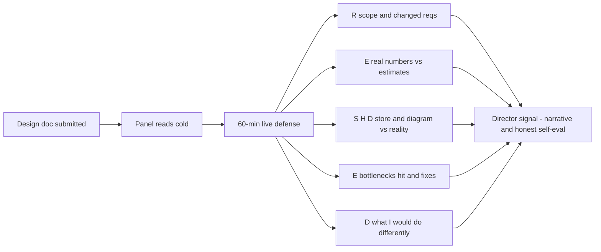

> **This is not a toy problem.** The Netflix Director system-design round, and variants at Databricks and Google Director loops, skips the whiteboard prompt. You submit a write-up of a real system you led and defend it for 60 minutes to Staff/Principal engineers who have read it cold. There is no hypothetical to hide behind. Two failure modes: **over-defending** (acting like a trial lawyer protecting a past verdict, reads as low learning agility) and **over-apologizing** (pre-emptively trashing your own design, reads as low conviction). The Director move is neither: **lead the narrative, name the hard calls, quantify the trade-offs, and offer 'what I'd do differently' before they ask**.

### Learning objectives

- Use the **RESHADED spine as a prep tool**, rehearse 2-3 real systems you led through all 8 steps before the round, weighting Evaluation and Design evolution where the hardest questions will land.
- Build a **pre-submission doc structure** that forces hostile questions into territory you've already prepared for.
- Develop 10 **self-interrogation questions**, the questions a skeptical Staff engineer will ask, and have crisp answers for each before you walk in.
- Use the **"what I got wrong" section** as a credibility asset, not a liability: a Director who narrates their own mistakes before being asked signals exactly the learning agility and self-awareness the role demands.
- Distinguish **defending a decision** (the right posture for choices made correctly under the information available then) from **updating a decision** (the right posture when the information has changed or the original call was genuinely suboptimal), conflating them is where most candidates lose.

### Intuition first

Picture a surgeon presenting a case at Grand Rounds, a hospital meeting where specialists review each other's decisions in public. The bad surgeon defends every incision as the only conceivable choice. The worse surgeon apologizes for every incision before anyone asks. The respected surgeon walks the room through the situation at each decision point, *"here's what we knew, here were two viable approaches, here's why I chose this one"*, and then, for the one incision that didn't go cleanly, says: *"in retrospect I'd have made a different call here, and here's what I'd do now."* The room trusts that surgeon because the narrative is honest and the reasoning is legible.

The Netflix format is Grand Rounds for systems. The panel has read your notes. Your job is to make the reasoning legible, quantified, and self-aware, and to arrive already knowing which incision you'd redo.

---

## RESHADED as a prep tool: the adaptation, said out loud

> In a live whiteboard round, RESHADED is the order you *execute* in. Here it is the **prep checklist**, the sequence in which you stress-test your own system before the round. The most common failure is skipping to H and D because those are what you remember building; R and E always surface the inconvenient facts that anchor every hard question that follows. Work through all 8 steps in writing.

---

## R: Requirements: re-derive them, honestly

Write the original requirements *as they were stated when the design locked*, then write them *as you understand them today*. The gap is where the hardest questions live.

**Self-interrogation:** What did you scope out, and do you still agree? Which NFRs, latency budget, availability target, consistency model, were stated explicitly vs. inherited informally? ("We needed it to be fast" is not a requirement; "p99 < 500 ms" is.) Which requirement changed mid-build and how did it affect the design?

**Hostile question:** *"You scoped out multi-region. Two months post-launch the business asked for it. Did you build migration seams, or was it an expensive retrofit?"*

**Director answer:** name what you knew, what you didn't, what would have had to be true for multi-region to be in scope at v1, and quantify the retrofit cost. Don't claim you anticipated what you didn't.

---

## E: Estimation: quantify your own system honestly

You built this system. You have real numbers. Use them. Before the round, fill in the table below from dashboards and incident reports, not memory:

| Metric | V1 assumption | Actual at launch | Peak observed |
|--------|--------------|-----------------|---------------|
| Write QPS |, |, |, |
| Read QPS |, |, |, |
| p99 latency (critical path) |, |, |, |
| Storage (hot tier) |, |, |, |
| Monthly infra cost |, |, |, |

If you don't know a cell, that is itself important to surface, "we didn't instrument this until month 6" previews a mistake you'll own in the Evaluation step. Being off by 2× is fine; being off by 10× without an explanation signals you didn't understand your own system's load.

---

## S: Storage: defend your store selection, name what you'd change

**Self-interrogation:** What 2-3 stores did you actually consider? What is the primary failure mode of the store you chose, and have you hit it? If you were starting today with the same requirements, would you make the same call?

**Hostile question:** *"Why Postgres and not Cassandra for the event log? You said you had write-heavy append workloads."*

**Director answer:** name access patterns, consistency requirements, team operational familiarity, and the trade-off explicitly. "Cassandra would have given better write throughput at the cost of operational complexity a three-engineer team couldn't carry. At 20K writes/s peak, Postgres with a hot-standby was right. At 200K writes/s I'd revisit, here's the migration path."

---

## H: High-level design: your diagram must match reality

> The most common doc mistake is submitting a diagram of the *intended* architecture, not the *actual* architecture. Interviewers probe the delta.

**Before the round:** walk your diagram against the running system; every box that doesn't exist, every arrow that represents an async queue you drew as sync, write it down. Know the SLA and blast radius of every external dependency.



**Hostile question:** *"Your diagram shows the notification service as an async consumer. What actually happens when it's down? Does the order fail, queue, or silently drop?"* Know your failure modes at every edge, candidates who drew an arrow without understanding the other end are caught here.

---

## A: API design: find the seams that caused pain

**Self-interrogation:** What versioning strategy held (or didn't) under real client evolution? Did any caller misuse your API in a way the design invited, that's usually an API design mistake, not a caller mistake. What breaking changes did you make and what was the migration cost?

**Hostile question:** *"You had three teams consuming this API within a year. What did you break?"* Honest quantified answer: "We renamed `userId` to `accountId` in month 8 for identity-service consistency. Two consumer teams each needed ~two weeks to update. In retrospect I'd have used a field alias and deprecated, a two-hour change that avoids two weeks of consumer work."

---

## D: Data model: own the schema regrets

**Self-interrogation:** What indexes did you add post-launch that should have been at design time? What query patterns emerged that your data model handled poorly, and what was the performance impact? What would migrating to a better schema cost today?

<details>
<summary>Go deeper, common data model regrets and their migration cost estimates (IC depth, optional)</summary>

These are the three data model regrets that come up most often in design-doc rounds, with rough migration cost estimates:

**1. Missing a compound index for a common query pattern.**
Typical cost: 1-2 engineer-days to add the index, plus a table-scan migration that may require a maintenance window on large tables (> 50M rows). If online DDL tools (pt-online-schema-change, gh-ost) were available but not used, say so.

**2. Using a natural key (email, username) as a primary key.**
Typical cost: full table migration to add a surrogate key, update every foreign key reference, and update every API consumer that passed the natural key as a stable ID. On a 10-table schema this is typically 2-4 engineer-weeks plus a coordinated cutover. The trap: natural keys feel convenient at v1 and become anchors at v2.

**3. Storing JSON blobs for "flexibility" on fields that became query predicates.**
Typical cost: schema migration to extract the fields, plus rewriting queries. On Postgres, a `GENERATED ALWAYS AS` column on a JSON field can defer the migration for simple cases. The Director answer: "I'd have made this a typed column from the start; the flexibility argument is almost always premature."

</details>

---

## E: Evaluation: the bottlenecks you actually hit

The evaluation step in a live whiteboard round stress-tests a hypothetical design; here it narrates **real production failures**, with numbers, timelines, and honest ownership. For each significant incident, pre-write: (1) user-visible impact in numbers, (2) root cause at the architectural level ("no circuit breaker between A and B", not "disk was full"), (3) the fix, (4) the design change it drove, (5) what you'd do differently at design time.

**Pre-answer the 10 hostile questions in writing before the round:**

| # | Question | What it's probing |
|---|----------|-------------------|
| 1 | What was the hardest trade-off you made, and do you still agree with it? | Self-awareness, trade-off depth |
| 2 | What did you get wrong, and what did it cost? | Learning agility, intellectual honesty |
| 3 | What is the biggest risk in this system right now? | Risk posture, operational awareness |
| 4 | What would this system look like at 10× current load? What breaks first? | Scalability reasoning |
| 5 | What would you do differently if you started today? | Judgment update, not just regret |
| 6 | Where did you violate your own design and why? | Pragmatic decision-making under pressure |
| 7 | What did you delegate, and how did you verify the delegated work was correct? | Delegation + verification pattern |
| 8 | What is your single point of failure, and what is the blast radius? | Failure-mode depth |
| 9 | What did the system teach you that the design review didn't catch? | Production wisdom |
| 10 | What was the cost, infra and engineering, and was it the right investment? | Business and cost judgment |

---

## D: Design evolution: the "what I'd do differently" section

> Every candidate describes what they built. The Director stands outside their own design, evaluates it against what they now know, and articulates a specific actionable alternative, with the trade-off named.

**Pre-write this section with the structure below, 3 items max:**

```
1. [Decision X] — I chose [approach A] because [constraint at the time].
   [What changed or what I misread], so I'd now choose [approach B].
   Cost of the mistake: [quantified — engineering time, latency, incidents].
   Migration path today: [specific, with effort estimate].
```

**The discipline:** more than 3 items signals the design shouldn't have shipped, or you conflate regret with failure. The filter: name decisions where you **had the information to make a better call at the time**, not decisions where requirements changed unpredictably. Distinguishing those two is the test.

**Hostile question:** *"You'd use event-driven now instead of synchronous. What would have had to be true at design time for that to be the right call then?"*

**Director answer:** "Two engineers, deep Postgres/REST experience, zero Kafka production exposure. Event-driven required three months longer and queue-platform familiarity, neither was true. Six months later two engineers have Kafka production experience; it's the right call for v2. The argument isn't that I made the wrong call, it's that the conditions changed."

---

## Trade-offs: defense posture options

| Posture | When to use | Risk |
|---------|-------------|------|
| **"Right call then, still right now"** | Requirements unchanged, decision correct given what you knew | Only use when you can fully quantify why the alternative was worse |
| **"Right call then, different call now"** | Requirements changed, team capability changed, new tooling viable | Correct posture for most "what I'd do differently" items; shows learning without repudiating original judgment |
| **"Mistake, here's the cost and the fix"** | You had the information to make a better call and didn't | Highest-credibility move for the right decisions; one, maybe two per round; more reads as a broken design |
| **"I'd delegate with a prior"** | Question goes below Director altitude (tuning numbers, vendor internals) | Must include: "my expectation is X because Y; the team would benchmark Z", delegation without a prior reads as not technical enough |

---

## What interviewers probe here (Director altitude)

**"Walk me through the hardest trade-off."**
*Strong:* Names a specific decision, 2-3 alternatives considered with rejection reasons, cost of the chosen path in numbers (engineering time, latency budget, availability impact). "The hardest part was alignment" is process, not architecture.
*Red flag:* Technical complexity described ("sharding was hard") with no trade-off named.

**"What did you get wrong?"**
*Strong:* One or two bounded mistakes, schema regret, over-coupled boundary, missing circuit breaker, production cost quantified, "what I'd do differently" stated.
*Red flag:* "Nothing major" (no self-awareness) or a flood of regrets (design shouldn't have shipped).

**"Your design doesn't handle [X]. Did you consider it?"**
*Strong:* "Yes, scoped out because [constraint], migration path is [specific]" or "No, that's a gap, here's how I'd address it and the effort estimate." Neither defensive nor self-flagellating.
*Red flag:* "That wasn't in scope" with no engagement with the critique.

**"What breaks first at 10×?"**
*Strong:* Names a specific component with the load at which it saturates in numbers. "The primary Postgres WAL saturates at ~8× current peak (~160K writes/s); I'd shard by tenant, 10× headroom at the cost of cross-tenant queries becoming scatter-gather." References Lessons 2.5-2.6 without re-teaching.
*Red flag:* "We'd scale horizontally", no saturation point, no trade-off.

**"Was this the right investment?"**
*Strong:* Knows infra cost per month and engineering investment in person-months, and the business outcome unlocked. "The alternative was a managed service at $2X/month with worse SLA control; the build was justified." Directors own budgets.
*Red flag:* No cost data.

---

## Common mistakes

- **Submitting the intended design, not the actual design.** Every delta between your diagram and the running system is a credibility risk if you haven't pre-acknowledged it.
- **Over-defending mistakes as inevitable.** The probe isn't "did you make mistakes?", it's "do you have the self-awareness to identify them and the judgment to know which ones you'd have avoided with the information available at the time?"
- **No cost data.** Directors own budgets. Not knowing infra spend per month or engineering investment in person-months is a Director-level gap.
- **Narrating 'what I'd do differently' as regret, not a judgment update.** "The conditions changed, here's the updated call" builds credibility; "I wish I'd done it differently" reads as rumination.
- **Delegating without a prior.** "I'd have the team investigate" is a non-answer. The Director version: "I'd delegate the Kafka vs Kinesis benchmark to the platform team; my prior is Kafka given our existing tooling, here's what would change my mind."

---

## Practice questions with model answers

**Q1. "Your doc says you chose a monolithic deploy. Six months later you decomposed it. Was the original decision wrong?"**

> *Model answer:* No. Three-engineer team, no service-mesh experience, six-week window, a monolith removed real blockers. At six months: four engineers with microservice experience joined, the load profiles had diverged (ingest 40K events/s vs query 2K QPS steady), two months of observability data made the boundary obvious. The decomposition took three weeks. Starting with microservices would have added six weeks to delivery and drawn the boundary before we had data to draw it correctly, monolith-first made the decomposition faster and lower-risk, not slower.

**Q2. "You said you'd use a read replica for analytics. Your incident report shows replica lag caused a two-hour reporting outage. What would you do differently?"**

> *Model answer:* Separate analytics and operational read paths entirely, they're different workload tiers. I expected replica lag to stay under 30 seconds; at peak ingest (40K events/s) it hit 12 minutes, breaking a 2-hour reporting SLA. Fix: a dedicated analytics replica with async CDC into a columnar store (Redshift; I'd use BigQuery given our current footprint), two engineer-weeks to migrate. Greenfield, I'd draw that boundary day one: the analytics SLA (fresh within 15 min) stated explicitly, never inherited from the operational replica's lag behavior.

**Q3. "What was the biggest architectural risk you didn't fix before launch, and why?"**

> *Model answer:* No circuit breaker between the order service and the payment PSP. We had exponential retry backoff but no fallback, a degraded PSP would fan out retries and exhaust the connection pool, taking down unrelated order operations. We knew; we deprioritized it given a 99.95% PSP SLA. Four months post-launch: 45-minute PSP degradation, p99 latency spiked to 30 seconds, ~2% of orders dropped. The circuit breaker took three days to add the following sprint. In retrospect it should have been in the launch definition of done, a 45-minute PSP degradation is not a tail event. The rule I'd enforce: any external dependency on the critical path needs a circuit breaker or explicit degradation mode at launch.

**Q4. "If you had to hand this system to a new team next week, what would they need to know that isn't in the doc?"**

> *Model answer:* Three things. First, schema migration must precede service deploy, we have a pre-deploy hook but it's undocumented; a new team finds out the hard way. Second, a silent assumption: the ingest pipeline expects monotonically increasing sequence numbers; producer restarts that reuse sequence numbers cause the dedup logic to drop events silently, happened once with a partner integration; fix is a secondary dedup key. Third, the runbook covers steady-state failures but not quota exhaustion on the enrichment API, which manifests as a processing hang rather than an error; I'd add an alert at 80% quota.

---

### Key takeaways

- **RESHADED is a prep tool**, rehearse 2-3 real systems through all 8 steps before the round; weight Evaluation and Design evolution where the hardest questions land.
- **"What I got wrong" is a credibility asset**, one or two bounded mistakes, quantified and pre-narrativized, builds more trust than a flawless defense.
- **Every decision needs a rejected alternative and a stated trade-off**, "I'd use a dedicated analytics replica fed by CDC because the operational replica's lag model doesn't hold under batch load" is defensible; "I'd use a read replica" is not.
- **Cost data is a Director requirement**, know infra spend per month and engineering investment in person-months. Directors own budgets.
- **Delegation without a prior is a non-answer**, delegate with a stated prior and a tripwire condition for changing it.

> **Spaced-repetition recap:** Netflix format = defend a real system, no toy problem. Use RESHADED as a self-interrogation checklist, R/E expose the inconvenient facts; Evaluation narrates real production failures with numbers; Design evolution is "what I'd do differently" (3 items max, framed as judgment update not regret). Pre-answer the 10 hostile questions in writing. Know your cost data. Delegate with a prior.

---

*End of Lesson 8.10. The pre-submitted design-doc round tests the same trade-off fluency as the live whiteboard format but with no place to hide: your design is already on record, and the session scores whether your reasoning is legible and self-aware. Cross-references: Lesson 6.1 (capstone rubric, what strong vs weak Director answers look like end-to-end), Lesson 6.2 (self-evaluation against the rubric), Lesson 8.9 (competing proposals, related format for architectural decision-making under social pressure). Next: 8.11.*
