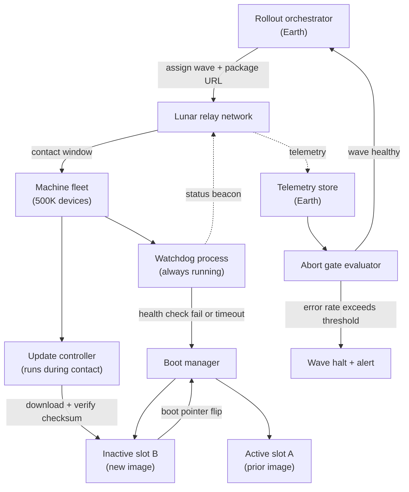

> **The whimsical framing is the test.** Anyone with an OTA prep answer can recite "canary, then waves." The question forces you to reason from first principles under constraints you've never memorized: 1.3-second one-way signal delay, intermittent Earth contact windows, machines you can never physically touch. A junior answer copies an Android rollout playbook. A **Director answer** defines what "bricked" means for this fleet, quantifies the blast radius at each wave size, places abort gates where they can actually stop a cascade, and explains how to recover a stuck 10% cohort when you can't drive to the data center. The real skill on display: **attacking an unfamiliar problem by naming constraints, deriving invariants, and building a staged plan**. Every real fleet problem, IoT sensors, self-driving vehicles, k8s node pools, Android updates, has a version of this same tension.

### Learning objectives
- Apply the **constraints-first habit** to a novel problem: name every physical and operational constraint before drawing a single box.
- Design a **canary / wave rollout ladder** with quantified blast radius, explicit abort gates, and a real decision criterion at each gate.
- Size the rollout math: wave duration, bandwidth budget, and communications-window constraints that dictate your minimum safe wave size.
- Build a **watchdog-based auto-revert** that works without real-time Earth contact, and distinguish it from a server-side kill-switch.
- Map the moon scenario to its real-world cousins, IoT/vehicle OTA, Android rollouts, k8s node-pool upgrades, and explain which constraints each shares.

### Intuition first

Think about deploying a software update to a submarine that surfaces for radio contact **twice a day for 20 minutes each time**. You can push the update during a contact window. You won't hear back about success or failure until the next window, 12 hours later. And if the update bricks the navigation system, you cannot send a diver.

Now multiply by 500,000 submarines.

The governing intuition: **your blast radius is not "how many machines could break", it is "how many machines can break before you can observe it and stop the next wave."** On Earth with continuous telemetry you can catch a bad deploy in 5 minutes and halt it before wave 2 starts. On the moon, with a 1.3 s one-way signal delay and contact windows measured in hours, your observation latency is fundamentally different. The entire design, wave sizing, gate duration, watchdog revert, follows from that one constraint.

---

## R: Requirements

> **RESHADED adaptation:** R in a curveball problem means **constraints first, then invariants**. There are no product features here, there are physical facts you cannot negotiate, and failure modes you refuse to allow. Define those before touching architecture.

**Clarifying questions I'd ask (with assumed answers):**

- *What does "success" mean for a machine?* → The machine boots, passes a health check suite (services up, sensor reads valid, safety interlocks functional), and reports `HEALTHY` status within N minutes of install.
- *What does "bricked" mean?* → Machine becomes unresponsive (no status beacon) OR reports a critical fault that disables core function. Distinguish **soft-brick** (recoverable via software revert) from **hard-brick** (requires physical intervention, never acceptable).
- *What is the communications window model?* → Each machine has a contact window with Earth (direct link or lunar relay) averaging **2 × 20-minute windows per 24 hours** (~40 min/day of reachability). Between windows, machines operate autonomously.
- *Can we roll back to the previous version?* → Yes. Each machine carries a **dual-partition layout**: slot A (running) and slot B (previous version). Revert = set boot pointer to slot B, reboot. Assume revert always succeeds (prior version is known-good, stored immutably on-device).
- *How many machines, and what are their connectivity and compute profiles?* → **500,000 machines**. Bandwidth per machine from Earth: assume **10 Mbps** per machine during contact (shared uplink from a relay station; realistic aggregate ceiling ~**1 Gbps** for a relay, so ~**100 machines downloading simultaneously**). Package size: **500 MB** per update.
- *What is the acceptable fleet-level risk?* → Tolerate **at most 1% of the fleet** (5,000 machines) in a degraded state at any time. A bricked wave must never propagate beyond the current wave without a human go decision.

**Non-functional constraints (the load-bearing ones):** one-way signal latency ~1.3 s (real-time debugging impossible; all revert logic must be edge-autonomous); contact window ~40 min/day per machine (gate soak must span ≥1 full window); no physical access (hard-brick = total loss; soft-brick must auto-recover); blast radius tolerance ≤1% fleet degraded at once (wave ceiling); package 500 MB (bandwidth math); revert must work without Earth contact.

**Scope:** rollout policy, wave structure, abort gate logic, watchdog auto-revert. Not in scope: package CDN internals, health-check suite specification, lunar relay network, those are owned by separate teams; I interface via contracts.

---

## E: Estimation

> **RESHADED adaptation:** E here is rollout math, wave duration, bandwidth budget, and the communications-window constraint that sets a floor on safe wave size. The numbers drive every architectural decision that follows.

**Assumptions:** 500K machines; 500 MB package; 10 Mbps per-machine download; relay aggregate ceiling ~1 Gbps; ~40 min/day contact per machine; abort threshold: 5% error rate in a wave.

**Download time per machine:** `500 MB × 8 ÷ 10 Mbps = 400 s ≈ 7 min`, fits inside a single 20-minute contact window.

**Relay parallelism:** 1 Gbps ÷ 10 Mbps = **100 machines/relay in parallel**; across multiple relays assume **~1,000 simultaneous fleet-wide downloads**.

**Blast radius per wave, derived from tolerance (≤1% = 5,000 machines):**
- Wave 1 (canary): **500 machines** (0.1%). If all brick: 500 auto-reverted, well inside tolerance.
- Wave 2: **2,500** (0.5%). Wave 3+: **5,000** (1% ceiling). Widen to 10K, 25K, 50K as confidence builds.
- Gate soak: minimum **24 hours**, enough for every machine in the wave to have at least one contact window.

**Rollout calendar:** `500K ÷ 5K per wave × 1 day/wave ≈ 100 days` for the full fleet. That is the risk-management plan. You accelerate by widening waves, never by shortening gate soaks.

**What estimation decided:** max wave size = 5,000 machines (blast-radius ceiling); min gate soak = 24 hours (contact-window observation floor). Both are derived from physical constraints, not policy preferences.

---

## S: Storage

> **RESHADED adaptation:** S covers two distinct storage domains, Earth-side orchestration state and on-device partition layout.

**Earth-side:** rollout roster + status in Postgres (`500K rows × ~200 B ≈ 100 MB`, trivial); beacon telemetry in a time-series store (InfluxDB / TimescaleDB), 90-day retention; package artifacts in an S3-compatible object store, content-addressed and append-only.

**On-device, dual-partition layout (the critical design choice):** slot A (active, known-good) and slot B (inactive, receives the new image). The rollout controller writes to slot B, verifies checksum, then flips the boot pointer. Revert = flip pointer back to slot A. No network path needed, the invariant holds even if the machine goes permanently dark mid-update.

**Why dual-partition over patch-based delta updates:** delta patches save bandwidth but cannot guarantee a clean revert if the running OS is partially corrupt. Dual-partition revert is a single atomic boot-pointer swap to a verified prior image. Trade-off: 2× flash storage per machine (~$1-5 at scale, acceptable). Rejected: delta-only, because revert reliability in a no-access environment outweighs bandwidth savings.

---

## H: High-level design

> The shape to make visible: an Earth-side **orchestrator** managing a wave ladder, machines that are **autonomous between contact windows**, and a **watchdog on every device** that reverts without waiting for Earth.



**Happy path:** During a contact window, the rollout orchestrator pushes a wave assignment to a batch of machines via the relay. Each machine's update controller downloads the package, verifies the SHA-256 checksum, writes it to slot B, and flips the boot pointer. On the next reboot (scheduled or commanded), the machine boots from slot B. It runs the health check suite autonomously. The watchdog observes the health check result and, if healthy, sends a `HEALTHY` beacon on the next contact window. The Earth-side gate evaluator aggregates beacons from the wave and computes the error rate. If below threshold, it promotes the wave and opens the next one.

**Abort path:** If the gate evaluator sees error rate > 5% at wave close, it halts the rollout, sets wave state to HALTED, fires an alert, and does not open the next wave. No additional machines receive the update until a human reviews.

**Auto-revert path (no Earth contact needed):** The on-device watchdog runs continuously, independent of the contact window. If the new image fails the health check within its boot-confirmation window (e.g., 10 minutes post-boot), or if critical services fail to come up, the watchdog writes `REVERT` to the boot manager config and reboots into slot A, the prior known-good image. On the next contact window, the machine sends a `REVERTED` beacon. Earth learns about it within a contact cycle, not in real time.

**The key architectural insight:** Earth-side abort gates stop the *next wave*. Device-side watchdogs stop the *current machine*. These are different failure modes requiring different mechanisms, and most candidates conflate them.

---

## A: API design

> Keep to the contracts that matter: orchestrator → relay, machine → relay, and the gate evaluation signal.

```
# --- Orchestrator → relay (push during contact) ---
POST /v1/waves/{waveId}/assignments
  body: { machineIds: [...], packageUrl, packageSha256, installDeadline }
  -> 202 { assignmentId }

# --- Machine → Earth (beacon, sent during contact window) ---
POST /v1/telemetry/beacon
  body: { machineId, waveId, status: DOWNLOADING|INSTALLED|HEALTHY|BRICKED|REVERTED,
          softwareVersion, healthCheckScores: {...}, timestamp }
  -> 200

# --- Gate evaluator (internal, runs on Earth after each gate soak) ---
GET /v1/waves/{waveId}/gate-evaluation
  -> 200 { totalAssigned, beaconsReceived, healthyCount, brickedCount,
            revertedCount, noBeaconCount, errorRate, decision: PASS|FAIL|INCONCLUSIVE }

# --- Operator commands ---
POST /v1/waves/{waveId}/halt           -> 200  # manual abort
POST /v1/waves/{waveId}/promote        -> 200  # manual advance after INCONCLUSIVE
POST /v1/rollouts/{rolloutId}/pause    -> 200  # pause entire rollout
```

**Design notes:** `installDeadline` prevents a missed contact window from silently leaving machines at old version, STALE machines get re-assigned. `noBeaconCount` is a first-class gate metric: silence is suspicious in this environment. INCONCLUSIVE triggers when fewer than 80% of the wave has beaconed, human decides whether to wait one more cycle rather than promote blindly.

---

## D: Data model

> The machine state machine is the load-bearing schema. Everything else is supporting.

Two tables on the Earth-side orchestrator: **machine_update_state** (`machine_id, rollout_id, wave_id, status, last_beacon_at, revert_reason`) and **wave_state** (`wave_id, rollout_id, size, gate_open_at, gate_close_at, error_rate, status`). Status enums are the design: machine states are `NOT_ASSIGNED / ASSIGNED / DOWNLOADING / INSTALLED / HEALTHY / BRICKED / REVERTED / STALE`; wave states are `PENDING / ACTIVE / PASSED / HALTED / PROMOTED`. Shard / access pattern: machine state is a point lookup by `machine_id`, range-scanned by `(rollout_id, wave_id)` for gate evaluation. A Postgres with one compound index on `(rollout_id, wave_id)` handles 500K rows without drama.

<details>
<summary>Go deeper, full column schemas and sharding options (IC depth, optional)</summary>

**machine_update_state**, one row per `(machineId, rolloutId)`:

| Field | Type | Notes |
|---|---|---|
| `machine_id` | string | device identifier |
| `rollout_id` | uuid | which rollout |
| `wave_id` | int | wave number within rollout |
| `assigned_at` | timestamp | when wave assignment pushed |
| `status` | enum | NOT_ASSIGNED / ASSIGNED / DOWNLOADING / INSTALLED / HEALTHY / BRICKED / REVERTED / STALE |
| `last_beacon_at` | timestamp | last telemetry received |
| `current_version` | string | version currently running |
| `target_version` | string | version being installed |
| `revert_reason` | string | watchdog error if REVERTED |

**wave_state**, one row per `(rolloutId, waveId)`:

| Field | Type | Notes |
|---|---|---|
| `wave_id` | int | |
| `rollout_id` | uuid | |
| `size` | int | machines assigned |
| `gate_open_at` | timestamp | when wave started |
| `gate_close_at` | timestamp | minimum soak end |
| `error_rate` | float | computed at gate eval |
| `status` | enum | PENDING / ACTIVE / PASSED / HALTED / PROMOTED |

Sharding by `rollout_id` makes sense if running many concurrent rollouts across product lines; otherwise a single Postgres partition is sufficient for a single-product fleet of 500K machines.

</details>

<details>
<summary>Go deeper, watchdog implementation patterns (IC depth, optional)</summary>

Two dominant watchdog patterns, each with different guarantees:

**Hardware watchdog timer (WDT):** a hardware register the running OS must "kick" (reset) periodically. If the OS crashes or hangs without kicking, the WDT fires a hard reset. Survives a kernel panic. Requires no software. Downside: it only detects liveness, not correctness, a machine that boots but runs a bad version that keeps the WDT kicked but doesn't serve correctly will pass the WDT and fail only at the health-check level.

**Software health-check watchdog:** a privileged daemon that runs the health check suite (services up, sensor reads valid, safety interlocks OK) and triggers revert if checks fail. More expressive but depends on the OS kernel being alive. Combine with a hardware WDT: the software watchdog kicks the hardware timer only after passing health checks, if the software watchdog itself crashes, the hardware WDT fires.

**Boot confirmation window pattern:** the boot manager marks slot B "unconfirmed" on first boot. The software watchdog has N minutes (say 10) to mark it "confirmed" by passing all health checks. If the window expires without confirmation, the boot manager reverts to slot A on next reboot. Android uses this pattern ("successful boot" API). Embedded Linux systems (U-Boot with `bootcount`) do the same. The key: revert is triggered by *expiry of the confirmation window*, not by an active fault signal, so a machine that simply hangs (no fault, no confirmation) still reverts. This is the right invariant for a no-access environment.

</details>

---

## E: Evaluation

> Re-check against the constraints and stress-test the three failure modes that matter.

**Failure mode 1, bad update bricks wave 1:** Wave 1 = 500 machines (0.1%). If all 500 brick, watchdogs revert autonomously. Earth learns at the next contact window (≤12 h): 500 REVERTED beacons, gate error rate = 100% → HALTED. Zero cascade; the 5,000-machine tolerance is not approached. This is why the first wave is small: even a total failure is fully recoverable.

**Failure mode 2, silent failure (no beacon):** A machine reboots but never contacts Earth. Earth cannot distinguish "healthy, unreachable" from "bricked, unreachable." Fix: if more than 20% of a wave's machines haven't beaconed at gate close, the gate returns INCONCLUSIVE, not PASS. A human decides whether to wait one more contact cycle or promote with acknowledged risk. Trade-off: potential one-cycle stall; accepted, because blind promotion into ambiguity is how a small brick becomes a fleet incident.

**Failure mode 3, revert failure (slot A corrupt):** The watchdog attempts revert but the prior image is also bad. Mitigations: (a) slot A is write-protected once a version is confirmed, only an explicit OTA update can overwrite it; (b) a factory-reset partition (slot 0) holds a minimal OS capable of downloading a clean image as the final backstop. Trade-off: hardware write-protection adds firmware complexity. I'd delegate the slot-protection contract to the firmware team with a stated invariant: *slot A is immutable after the confirmation window closes.*

**Re-check:** blast radius ≤1%? ✓ (5K wave ceiling). Revert without Earth? ✓ (watchdog + dual-partition). Gate soak ≥ one contact cycle? ✓ (24h minimum). Package fits in contact window? ✓ (7 min < 20 min).

---

## D: Design evolution

> Push the constraints harder and name what breaks first.

**Scenario A, urgency (security patch):** widen waves faster (5K → 25K → 100K after clean passes), never shorten soaks. Operator-approved expedited mode can override minimum soak with an explicit risk acknowledgment, but the system doesn't do it automatically. Cost = operational risk, not infra spend.

**Scenario B, degraded connectivity (5% fleet reachable per day):** orchestrator tracks "last reachable," prioritizes assignment to machines with upcoming windows, flags machines STALE after N days (hardware issue, not software). Rollout stretches; that is correct behavior.

**Scenario C, multi-region/multi-product fleets (the real-world generalization):**
The moon scenario is an extreme version of every embedded/IoT fleet problem: vehicle OTA (intermittent cellular = contact windows), Android OTA (A/B partition + staged rollout pause = watchdog + INCONCLUSIVE gate), AWS EC2 host upgrades (AZ blast-radius budget = wave ceiling). The constraints differ in degree, not in kind.

**Hardest trade-off to defend:**
The 24-hour gate soak with no auto-promotion on INCONCLUSIVE feels slow. The defense is: **your observation latency is determined by the contact window, not by your impatience**. A gate soak shorter than one full observation cycle means you are promoting waves based on partial data, the machines that happened to have a contact window, not the machines that had a problem. The gate soak is a signal quality guarantee, not bureaucratic caution.

**Where I'd delegate:**
- *Watchdog firmware + slot protection:* firmware team owns dual-partition layout and boot-confirmation protocol; my invariant is "slot A write-locked after confirmation, slot 0 factory-reset capable"; I want timing benchmarked on the slowest hardware SKU.
- *Relay capacity:* relay team owns the bandwidth ceiling; my wave size and download-time math scales proportionally with it.
- *Health check suite:* safety team defines HEALTHY per machine type; my update controller invokes a standardized binary with a pass/fail exit code.

---

## Trade-offs table: the pivotal decisions

| Decision | Option A | Option B | Option C | Use when... |
|---|---|---|---|---|
| **Revert mechanism** | **Dual-partition (slot A/B) boot pointer flip**, atomic, unconditional, no network | **Delta patch rollback**, smaller on-disk footprint | **Full re-download from Earth**, always gets latest known-good | **A** always in no-access environments. **B** fragile if running OS is corrupt. **C** requires contact window at exactly the wrong moment. |
| **Abort gate trigger** | **Error rate threshold (5%)**, auto-halt, human review to resume | **Total-brick threshold (absolute count)**, halt when N machines brick | **Manual-only gate**, operator decides at each wave | **A** as default, scales with wave size; **B** as secondary check for small canaries where 5% = 1 machine; **C** only for the first canary wave where human review is always warranted anyway. |
| **Silence handling at gate** | **INCONCLUSIVE state**, require 80% beacon before auto-promote | **Assume silent = healthy**, promote if brick rate low | **Assume silent = bricked**, conservative; block on silence | **A** balances false-positive blocks vs false promotions. **B** promotes into ambiguity, unacceptable in a no-access fleet. **C** can stall indefinitely if contact windows are poor. |
| **Wave size growth** | **Geometric: 500 → 2.5K → 5K → 10K → 25K → 50K → 100K** | **Fixed wave size throughout** | **Percentage-based (e.g., 0.1%, 0.5%, 1%, 5%)** | **A**, fast early ramp once confidence builds; **B** wastes time on large fleets; **C** equivalent to A, stated differently, use whichever is easier to communicate. |

---

## What interviewers probe here (Director altitude)

- **"What prevents a bad update from bricking the whole fleet?"** *Strong:* wave 1 = 500 machines (0.1%); watchdogs revert autonomously; gate sees 100% error → HALTED before wave 2; cascade is structurally blocked. Names the distinction: abort gates stop the *next wave*, watchdog stops the *current machine*. *Red flag:* "monitoring catches it", no mechanism; no blast-radius math.

- **"How long does the full fleet rollout take?"** *Strong:* ~100 days at 5K/wave + 24h soaks; that calendar *is* the plan; accelerate by widening waves, not shrinking soaks. *Red flag:* "a few weeks" with no math; doesn't mention the contact window as the gate-soak floor.

- **"Machine reverts but you don't hear about it for 12 hours, problem?"** *Strong:* no, watchdog revert is autonomous; REVERTED beacon arrives next window; 12-hour lag is the known cost of the contact-window model. *Red flag:* assumes continuous telemetry.

- **"Machine downloaded the update but never beaconed, what do you do?"** *Strong:* silence is a first-class gate metric; >20% non-beaconing → INCONCLUSIVE, not PASS; human decides whether to wait one more cycle. *Red flag:* treats silence as success.

- **"How is this different from a k8s node pool upgrade?"** *Strong:* same wave/gate pattern; continuous telemetry shrinks soaks to minutes; PodDisruptionBudgets + drain replace watchdog; silence is unambiguous. Same problem, tighter feedback loop. *Red flag:* treats moon framing as exotic.

---

## Common mistakes

- **Treating the queue as the safety mechanism.** Admission control (metering how many machines start downloading) is useful for relay bandwidth management, but it does not prevent a bricked machine. Blast-radius control comes from **wave size + abort gates**, not from download throttling.
- **Relying on Earth-side abort to stop a bricked machine.** Earth learns about a brick at the next contact window, potentially 12 hours later. The device-side watchdog must revert without waiting. Conflating these two mechanisms is the most common error.
- **Compressing gate soaks for speed.** The gate soak floor is the contact-window observation cycle, not a policy preference. Promoting a wave before you have beacons from all machines means promoting on incomplete data, you are not seeing the machines that had a problem, you are seeing the machines that happened to have a good contact window.
- **Ignoring the "no beacon" state.** Treating silent machines as healthy is optimistic in an environment where connectivity is inherently intermittent. INCONCLUSIVE is a required gate state, not an edge case.
- **Forgetting that slot A must be immutable.** If the rollout process overwrites slot A before the new version is confirmed healthy, the fallback disappears. Write-protection on the confirmed slot is a hard invariant, not a nice-to-have.

---

## Practice questions (with model answers)

**Q1. Your wave 2 (2,500 machines) has a 7% error rate at gate close. What do you do?**

> *Model:* 7% > 5% threshold → halt wave 2, open no new waves, fire P1. The 175 bricked machines are already reverting via watchdog; I expect REVERTED beacons next contact window. Triage `revert_reason` to determine whether it's a bad package (yank + block re-assignment), a specific hardware SKU (filtered exclusion for wave 3), or a transient install error. Do not promote wave 3 until root cause is understood.

**Q2. How does the design change with continuous telemetry (no contact windows)?**

> *Model:* Gate soak shrinks from 24h to minutes; INCONCLUSIVE goes away (silence is immediately a network alert, not an ambiguous state); you can auto-ramp (1% → 10% → 100% with SLO-breach halt). Blast-radius invariant stays identical; the feedback loop compresses. This is Android staged rollouts and AWS host fleet upgrades, same wave structure, tighter timing. Moon is the degenerate case with the slowest possible feedback loop.

**Q3. Operations wants to compress gate soaks to 4 hours for an urgent security patch. Do you agree?**

> *Model:* Push back. The soak floor is a signal-quality guarantee: 4 hours covers only machines with a contact window in that window, roughly half the wave. Promoting on half the data means you're not seeing the machines with the problem. The right urgency lever is widening wave sizes as confidence builds, not shrinking soaks. If the business risk is genuinely acute, accept a 4-hour soak with an explicit operator risk acknowledgment and surface the INCONCLUSIVE rate prominently, the decision-maker should know exactly how much data they're acting on.

**Q4. The firmware team says slot B writes are corrupted on 0.5% of machines. How does this affect rollout?**

> *Model:* 0.5% of 500K = 2,500 machines that fail at install, not at boot. This is inside the 5K wave tolerance but changes how I read gate signals, I'd split the error-rate metric into `INSTALL_FAILED` (write error, firmware issue) vs `HEALTH_CHECK_FAILED` (bad update) vs `WATCHDOG_REVERTED` (runtime failure). Different root causes, different responses. I'd exclude affected machines from the rollout pending a firmware fix, continue on the healthy population, and add a pre-install storage self-test to the update controller, fail fast before corrupting the slot.

---

### Key takeaways

- **Constraints-first is the meta-skill:** before any design, name every physical and operational constraint (latency, contact windows, no physical access). Invariants and wave sizing follow directly from the constraints, they are not guesses.
- **Blast radius is a calculation, not a feeling:** wave size is bounded by the fleet-level tolerance (≤1% degraded = ≤5,000 machines). The first canary wave is 500 machines (0.1%) so a total failure is recoverable without breaching tolerance.
- **Device-side watchdog and Earth-side abort gates solve different failure modes:** the watchdog reverts a bricked machine autonomously within its boot window; abort gates stop the next wave once Earth receives beacons. Conflating them leaves one failure mode unaddressed.
- **Gate soak duration is set by the contact window, not by impatience:** the minimum soak is one full observation cycle (24 hours) so that all machines in the wave have had a chance to beacon. Promoting earlier means promoting on incomplete data.
- **The moon scenario maps directly to real fleets:** IoT sensors, autonomous vehicles, Android OTA, k8s node pools, all share the same tension between rollout velocity and blast-radius control. The moon extremifies the constraints but does not change the design pattern.

> **Spaced-repetition recap:** Moon fleet OTA = **canary/wave ladder with blast-radius math**: wave ceiling = fleet tolerance ÷ 1 (≤5K machines at ≤1% fleet); gate soak = 1 full contact cycle (≥24 h); promote only when ≥80% of wave beacons are HEALTHY. **Two separate mechanisms**: device-side **watchdog** (dual-partition slot flip, no Earth needed) for in-flight machines; Earth-side **abort gate** (error rate > 5% → HALT) for stopping the next wave. Silence = INCONCLUSIVE, not PASS. Meta-skill: **constraints → invariants → staged plan**, works for IoT, vehicle OTA, Android, k8s node upgrades.

---

*End of Lesson 8.11. This lesson closes Module 8. The constraints-first habit, naming physical and operational limits before drawing boxes, is the Director move that separates a prepared answer from a memorized one. It applies to every curveball problem in Module 8, and to every novel problem you'll face on the job. Next: Module 9 covers business-domain problems (9.1-9.14) where the constraints come from business rules, compliance, and org dynamics rather than physics.*
