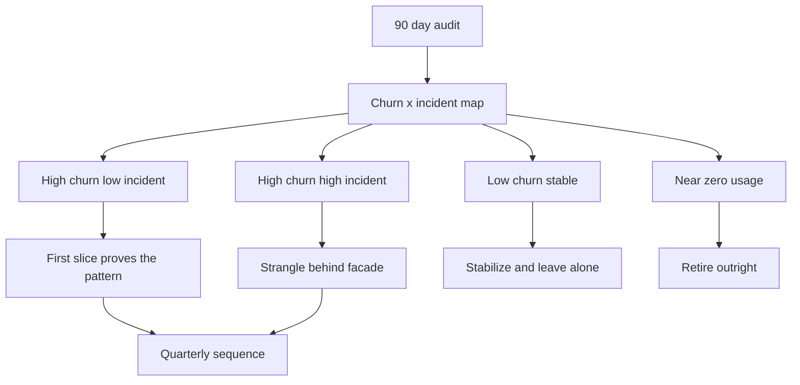

> **This question appears nearly verbatim in Director and architect interview banks because it is the job:** "You've inherited a 15-year-old system that runs the business. Nobody fully understands it. The CEO wants features. What do you do?" It doubles as the behavioral "re-platforming you led" story. A junior answer reaches for the rewrite — new stack, clean slate, two years — and fails on the spot. A Director answer **measures before touching anything**, names the modules it will deliberately *leave alone*, sequences a strangle so **every quarter ships business-visible value**, and sells it to the CEO in capacity and risk dollars, not architecture diagrams. The interviewer is scoring whether you can run a multi-quarter change program without stopping the business.

### Learning objectives
- Run a **first-90-days assessment** — revenue map, risk map, churn-×-incident hotspots, test coverage, KTLO burn — before changing a line of code.
- Defend **stabilize-then-strangle** against the rewrite instinct with numbers: rewrite cost, historical failure rates, and the feature-freeze the CEO will never grant.
- Adapt the **RESHADED** spine to an architecture-strategy problem — R becomes business-continuity constraints, E becomes a risk and coverage audit, Design evolution becomes the quarter-by-quarter sequence that *is* the deliverable.
- Apply **feature-parity discipline**: scope parity to measured usage, not the legacy spec — and make the explicit case for "leave it alone" where migration buys nothing.
- Sell the program upward as **bought-back capacity and retired risk**, with value milestones a CEO can see each quarter.

### Intuition first
You've bought a 90-year-old house the family still lives in. The wiring is a fire hazard, the foundation has one worrying crack, and three rooms were added by builders who never met. The rewrite instinct says: demolish, rebuild, move the family into a hotel for two years. But the family can't leave — they run a business from the kitchen. **Inspect first**: which walls are load-bearing, where the damage actually is, which rooms just look dated. **Then stabilize**: the foundation and the wiring — the things that can kill you. **Then renovate room by room**, each room usable when finished, the family in the house the whole time. And the guest bedroom nobody uses? **You don't touch it.** Renovation risk is real and the room earns nothing.

That is the entire lesson: inspect (the 90-day audit), stabilize (observability, deploys, backups), strangle room by room (Lesson 8.1 has the mechanics), and leave the guest bedroom alone. The interview tests whether you can resist the demolition instinct *and* articulate why — "I'd rewrite it properly this time" is the most expensive sentence in software.

---

## R — Requirements

> **Adaptation, said out loud:** in a build-from-scratch problem, R scopes features. Here R scopes **business-continuity constraints** — what must keep working while you operate, and the political requirements that decide whether the program survives its second quarter.

**The scenario, made concrete (state your assumptions):** a 14-year-old order-management monolith — ~1.5M lines of Java 8, one shared Oracle schema with ~800 tables, quarterly big-bang deploys that take a weekend, **100% of ~$200M annual revenue flowing through it**. 45 engineers; the two who understand billing have one foot out the door. The CEO's stated requirement is a feature roadmap, not a re-platforming.

**Clarifying questions I'd ask (with assumed answers):**
- *The actual pain — velocity, reliability, or cost?* → **All three, but velocity is what the CEO feels**: features that took 2 weeks now take 2 months.
- *Forcing functions?* → **Java 8 and the Oracle version go end-of-support in 18 months**; a PCI/SOC 2 audit lands next year. Deadlines are leverage — use them.
- *My real budget?* → **No dedicated re-platforming budget** — everything comes out of feature capacity. This constraint *is* the design: it forces incremental delivery and kills the rewrite on arrival.
- *Revenue seasonal?* → **40% lands in Q4.** Therefore: a money-path change freeze every Q4, planned into the sequence, not discovered in October.

**Functional requirements (of the *program*, not the system):**
1. The business keeps running — zero revenue-impacting regressions attributable to the modernization.
2. Feature delivery continues every quarter — no freeze longer than a sprint.
3. Each migrated slice reaches **measured parity** (see A) before legacy retirement.
4. Key-person risk on billing retired within two quarters.

**Non-functional requirements:** deploys quarterly → weekly within 2 quarters; change-failure ~25% → <10%; MTTR hours → <30 min on the money path; EOL/compliance deadlines met with a quarter of slack.

**Explicitly CUT (scoping is the signal):** no stack migration for its own sake; no microservices-by-default ("a modular monolith plus 3–5 extracted services" is the honest target); no UI re-skin riding along; and — load-bearing — **no migration of modules the audit shows stable and low-churn.** "Leave it alone" is a first-class disposition, not a failure to finish.

---

## E — Estimation

> **Adaptation, said out loud:** there is no QPS to estimate. E becomes the **first-90-days assessment** — a risk map and a coverage audit. Same discipline as Lesson 1.3's envelope math: a few load-bearing numbers, measured not guessed.

**The first-90-days framework — what to measure before touching anything:**

1. **Revenue map (weeks 1–2).** Which code paths carry money: checkout + billing carry ~$550K/day (~$200M ÷ 365); one hour of checkout downtime ≈ **$23K direct**. This number prices every risk decision that follows.
2. **Risk map (weeks 2–5).** Twelve months of incidents mapped to modules; MTTR; **bus factor per module** (billing: 2 people, both flight risks — the scariest finding); EOL dependencies with dates; whether backup *restore* has ever been tested (assume no until proven).
3. **Change map (weeks 3–6).** Git churn × incident density per module — the **hotspot quadrant** that drives all sequencing. Typical finding: ~80% of commits land in ~15% of modules (here: pricing, checkout, billing). High + high = strangle first; low + low = leave alone.
4. **Coverage and deployability audit (weeks 4–8).** Line coverage (assume ~10–15%, concentrated in easy modules, not the money path); whether *anything* deploys independently (no); time-to-rollback ("restore the weekend deploy" ≈ 8+ hours — a finding worth escalating by itself).
5. **Cost and capacity baseline (weeks 6–10).** Run cost including licenses (Oracle: ~$500K–1M/yr — a savings line for the CFO); and the **KTLO number**: % of engineering time spent keeping the lights on. Assume **~60% KTLO** — the CEO's 45 engineers are really 18. *This is the number that sells the program.*

**The strategic math the audit enables (round aggressively):**
- **Rewrite:** 1.5M lines, ~45 engineers → realistically 2+ years and ~$15–18M loaded cost, *with* a feature freeze the CEO already refused, *and* the well-documented second-system record putting big-bang rewrite failure (late, over budget, or abandoned) **north of 50%** — stated as an assumption.
- **Strangle:** a **~20% capacity tax** (≈9 engineers) for ~8 quarters ≈ $5–6M over two years, no freeze, value shipping each quarter — and if killed at quarter 4, **everything shipped still works.** Rewrite value is all-or-nothing at the end; strangle value is cumulative.
- **Payback:** KTLO 60% → ~35% recovers ~11 engineers — ~$2.5M/yr, before the Oracle line item. Modernization framed as **buying back a quarter of the engineering org** is a sentence a CEO acts on.

Go deeper — running the audit mechanically (IC depth, optional)

**Churn map:** `git log --since="24 months" --name-only` aggregated by top-level package; normalize by module size. **Incident density:** tag 12 months of postmortems/pages by module (expect to do this by hand from the ticket tracker; the tagging discipline you institute here becomes permanent). **Bus factor:** per-module distinct-author count over 24 months, weighted by share — a module where one author owns >70% of recent commits is bus-factor-1 regardless of headcount. **KTLO measurement:** two sprints of coarse time-tagging (feature / KTLO / migration) across all teams — resist the urge for finer categories; you need one defensible ratio, not a timesheet system. **Coverage:** run JaCoCo/coverage per module, but weight by the revenue map — 10% coverage on a cold admin module is fine; 10% on billing is the headline. **Dead-feature instrumentation:** access-log analysis per endpoint over 60–90 days (include batch/cron callers before declaring anything dead — monthly jobs hide for 29 days).

---

## S — Storage

> **Adaptation, said out loud:** S compresses. There's no store to select — there's a store to *escape*: **the shared database, not the code, is the real monolith.**

Anyone can split code into services; if they all still read and write the same 800 Oracle tables, you've built a **distributed monolith** — every schema change still coordinates every team, plus network hops you didn't have before. So: **data ownership follows the strangle** — an extracted domain gets its own store, populated by **CDC from the legacy schema** (Lesson 2.4's replication machinery, pointed at Oracle), reads cut over first, writes second, legacy tables dropped via **expand–contract**. *Rejected — extract services now, split data later:* "later" never comes; you carry the monolith's coupling plus microservices' latency indefinitely. *Rejected — one big migration weekend:* an 800-table cutover is the rewrite in disguise. Lesson 8.1 covers the dual-write/CDC mechanics; the Director-level point is the *ownership boundary*, not the pipe.

---

## H — High-level design

> **Adaptation, said out loud:** H is two pictures — the target end-state (brief; 8.1 owns the façade mechanics) and the **disposition map**: which module gets which treatment. The disposition map *is* the high-level design of a modernization.

**Target end-state, one sentence:** a routing façade in front of the monolith (the strangler fig — Lesson 8.1), 3–5 extracted services for the hot domains each owning its data, and the cold remainder as a smaller, stabilized modular monolith that may live for years — deliberately.

**The disposition map — every module gets one of four treatments, decided by the audit:**

- **Strangle** (pricing, checkout, billing — the hotspot 15%): highest churn, highest incident density, highest payoff. Billing goes early for bus-factor reasons, *especially* because it's scary.
- **First slice** (a high-churn, *low-risk* edge module — notifications): the cheapest place to prove the façade, the CDC pipe, the parity harness, and the team's muscle memory before betting the money path on them.
- **Leave alone** (the cold half): stable, low-churn, off the money path — gets observability and a deploy pipeline, then nothing. **Migration risk is real and these modules earn nothing from it.** Saying this list out loud, with data, is a top-three Director signal here.
- **Retire** (the dead ~third): instrumentation will show a surprising fraction of endpoints get near-zero traffic. Deleting them is the cheapest modernization there is — parity with nothing.

**Sequencing principle:** stabilize → prove → strangle → decommission. You cannot strangle safely at a 25% change-failure rate with quarterly deploys — **stabilization makes the strangle survivable**. Foundation: observability on the money path (Lessons 3.13–3.14), CI and a weekly deploy train, tested restores, **characterization tests** pinning current behavior — bugs included — on the modules about to move.

---

## A — API design

> **Adaptation, said out loud:** A compresses to two strategic artifacts — the **seam inventory** and the **parity contract**. The interfaces that matter are the ones between old and new.

**The seam inventory.** Before extracting anything, define the contract *at the seam*: each strangle target gets an explicit interface (REST/gRPC — Lesson 2.10) with an **anti-corruption layer** translating between the legacy schema's tangled vocabulary and the new domain model. *Rejected — new services speaking the legacy schema's language:* that exports the monolith's worst abstractions into the systems meant to replace them.

**The parity contract — feature-parity discipline.** "Full parity" kills modernizations, because the legacy spec is 14 years of accreted behavior nobody can enumerate. The discipline: **parity is defined against measured usage, not the spec.** Instrument first; features below a usage floor (<1 call/day over 90 days, batch callers checked) go to the retire list with named business sign-off. What remains is *verified*, not asserted — shadow traffic through old and new with response diffing, then a canaried cutover with instant rollback at the façade. Observed behavior is the spec; the diff harness is the compliance test.

Go deeper — shadow-traffic parity harness (IC depth, optional)

Mirror production requests at the façade to the new implementation (fire-and-forget; new path's responses discarded, never user-visible). Diff old-vs-new on normalized responses — strip timestamps, generated IDs, ordering where contractually irrelevant; a naive byte-diff drowns you in false positives. Bucket diffs by endpoint and field; burn down top buckets weekly. Target: <0.1% unexplained diff rate sustained for 2 weeks before canary. Caveats: read paths shadow safely; **write paths cannot be naively shadowed** (double side effects) — for writes, use dual-write with the new side dark (written, compared, not served) or replay sanitized production traffic in staging against a CDC-synced copy. The harness is ~2–3 engineer-months to build and pays for itself on the first prevented checkout regression (~$23K/hr exposure).

---

## D — Data model

> **Adaptation, said out loud:** D compresses to one decision — how data moves per strangled slice — because the schemas are ordinary and the migration choreography is what fails in practice.

Per slice: **expand–contract over CDC.** Expand (new store populated via CDC, continuously checksum-verified) → cut reads → cut writes (brief dual-write window, legacy now the dark copy) → contract (freeze, then *actually drop* the legacy tables; every "temporarily kept" table becomes a decade of accidental reads). *Rejected — long-lived dual-write:* two writable sources of truth drift; reconciliation becomes a permanent team. *Rejected — cutover without the dark-read phase:* you find the checksum mismatch in production, on the money path, in Q4. One schema rule: the new domain model is designed from the domain and mapped to legacy via the ACL — never reverse-engineered table-for-table from the 800, or you've re-platformed the mess.

---

## E — Evaluation

> Stress the *program* the way 5.x lessons stress an architecture. None of the fatal failure modes are technical.

**Failure mode 1 — the half-migrated forever-state.** Funding dies at quarter 5; you run a monolith *and* four services *and* a façade, forever. *Mitigation:* **every completed slice is independently done** — façade + slice + retired legacy code, no slice >1 quarter. The strangle's defining property is stable intermediate states; protect it when scoping. A program killed early keeps everything shipped.

**Failure mode 2 — parity regression on the money path.** One missed legacy behavior in checkout costs $23K/hr and, worse, the program's political capital. *Mitigation:* parity harness + canary + façade-level rollback; checkout migrates only after the pattern is proven twice on lower-stakes slices; Q4 freeze honored.

**Failure mode 3 — the CEO's patience.** Quarter 3, no visible features, a competitor ships something shiny: the program gets cut. *Mitigation is structural:* the value-milestone rule — **no quarter ships only migration** — plus a one-page scorecard the CEO actually reads: deploy frequency, change-failure rate, KTLO %, features shipped, dollars retired.

**Failure mode 4 — org fatigue and the bus.** The billing engineers leave in month 4; teams burn out on the 20% tax. *Mitigation:* billing knowledge-extraction starts in the *stabilize* phase; strangle work rotates through product teams. *Rejected — the dedicated re-platforming team:* concentrates knowledge, detaches from product, easiest line item to delete.

**Re-check vs R:** revenue protected (harness, canary, Q4 freeze) ✓; features every quarter ✓; parity measured ✓; bus factor retired in stabilize ✓; EOL met by sequencing Oracle-dependent domains first ✓.

---

## D — Design evolution

> **Adaptation, said out loud:** Design evolution *is* the deliverable — the quarter-by-quarter sequence with value milestones, the slide the CEO sees. Numbers are illustrative; the audit re-prices them.

**Q1 — Assess + stabilize.** The 90-day audit (in parallel with delivery); observability on the money path; CI + weekly deploy train; tested restores; billing knowledge extraction starts. *Milestone:* deploys quarterly → weekly; change-failure 25% → ~15%; the audit deck itself — the first time the system's risk has been priced in dollars.
**Q2 — Prove the pattern.** Façade up; first slice (notifications) strangled end-to-end including its data and *deletion* of the legacy module; parity harness built; dead-feature retirement begins. *Milestone:* a customer-visible feature ships **on the new path**; first Oracle tables dropped.
**Q3–Q4 — The hotspot, half one.** Pricing strangled (highest churn, biggest velocity payoff); billing knowledge work completes; **Q4 = money-path freeze** — teams work cold-module stabilization and harness hardening, planned not improvised. *Milestone:* pricing changes ship in days, not the 2-month legacy cycle — the velocity proof the CEO has been waiting for.
**Q5–Q6 — The money path.** Checkout, then billing, behind the proven harness; their data decomposed via expand–contract. *Milestone:* change-failure <10% on the money path; MTTR <30 min; bus-factor-1 modules: zero.
**Q7–Q8 — Decommission + accept the end-state.** Oracle license retired or shrunk (~$500K+/yr); dead code deleted at scale; the **leave-alone list formally accepted** as end-state, not backlog. *Milestone:* KTLO 60% → ~35% — ~11 engineers returned to the roadmap, the number the program was sold on.

**The rule underneath:** every quarter ships something the business can see, *and* every quarter retires risk. The ordering logic — foundation first, prove on cheap slices, money path only behind a proven harness, freeze when revenue peaks — survives any re-pricing of the specifics.

**The post-acquisition variant (sidebar).** "We acquired a company; consolidate the platforms" is the same playbook plus a political dimension. The audit gains a step — *which* platform wins per domain, decided by the same churn/risk/cost evidence, **never by which side has more VPs** — and leave-alone gets more valuable: two billing systems can run behind one façade for years if integration earns less than it costs. The extra failure mode is talent flight from the "losing" platform — another reason to decide per domain rather than declare a wholesale winner.

**Where I'd delegate (the explicit Director move):**
- **CDC/data tooling:** *"Data-platform owns the CDC pipeline and checksum verification; my prior is log-based CDC (Debezium-style) over dual-write-first, because dual-write puts the consistency burden in application code where it will be forgotten."*
- **Parity harness:** *"A senior pair owns the diff harness; my prior is shadow-reads with normalized diffing and a <0.1% threshold before any canary."*
- **Audit instrumentation:** *"Teams self-report churn, coverage, and KTLO against a template my staff engineer owns."* What I keep — disposition, sequence, the leave-alone list, the CEO narrative — and what I hand off, with priors, is the altitude.

---

## Trade-offs table — the pivotal decisions

| Decision | Option A | Option B | Option C | Use when... |
|---|---|---|---|---|
| **Modernization strategy** | **Stabilize-then-strangle** — incremental, value every quarter | **Big-bang rewrite** — clean slate, all-or-nothing | **Lift-and-shift only** — rehost, change nothing | **A** default (our choice): cumulative value, survivable cancellation. **B** only small (<~100K lines) or truly unsalvageable *and* a freeze is tolerable — rare. **C** when the only forcing function is infra EOL and velocity isn't the pain. |
| **Data migration per slice** | **CDC + expand–contract** — dark reads, verified, then cut | **Dual-write from day one** — app writes both stores | **Big-bang cutover weekend** | **A** default (our choice): consistency burden in infrastructure, verifiable before cutover. **B** when no CDC tooling reads the legacy store — accept app-level complexity. **C** only small, cold, low-risk datasets. |
| **Who does the work** | **Product teams rotate strangle work** ~20% tax | **Dedicated migration team** | **Outsource the migration** | **A** default (our choice): knowledge spreads, program survives budget cuts. **B** when a hard deadline demands focus — accept the silo and political fragility. **C** almost never for the money path — the knowledge *is* the asset. |

---

## What interviewers probe here (Director altitude)

- **"Why not just rewrite it?"** — *Strong:* the asymmetry — rewrite value is all-or-nothing after 2 years and >$15M with failure odds north of 50%; strangle value is cumulative, survivable at any cancellation point — and names the rare case where rewrite *is* right (small, unsalvageable, freeze tolerable). *Red flag:* either instinct as dogma.
- **"What do you do in your first 90 days?"** — *Strong:* measure before touching — revenue map, churn-×-incident hotspots, bus factor, KTLO %, tested restores — while shipping stabilization quick wins; ends the quarter with a disposition map priced in dollars. *Red flag:* drawing the target microservice architecture in week 1.
- **"The CEO wants features, not plumbing. Sell it."** — *Strong:* sells capacity — "60% of your engineers' time is keep-the-lights-on; this returns ~11 engineers to your roadmap and retires $500K/yr of licenses, while features ship every quarter." *Red flag:* "technical debt" and "best practices" — vocabulary that loses the room.
- **"What won't you migrate?"** — *Strong:* the cold, stable, off-money-path half — data behind the call, observability added, the list *formally accepted* as end-state; the dead third retired outright. *Red flag:* an implicit plan to eventually migrate everything — it signals never having paid for a migration.
- **"How do you know the new checkout behaves like the old one?"** — *Strong:* parity measured, not asserted — usage-scoped contract, shadow-traffic diffing below a stated threshold, canary with façade-level rollback, money path last. *Red flag:* "comprehensive testing" with no mechanism, or trusting the legacy spec to be enumerable.

---

## Common mistakes

- **Architecting before auditing.** The week-1 target diagram is always wrong — hotspots, dead features, and bus factors aren't where intuition says.
- **Treating "leave it alone" as failure.** Migrating a stable, cold module is pure risk with no return. The data-backed, formally accepted leave-alone list is a deliverable.
- **Full feature parity against the spec.** The legacy spec is unenumerable; parity against *measured usage* plus retiring the dead third is achievable. Parity-with-everything is how programs go two years over.
- **The dedicated migration team.** Silos knowledge, detaches from product, first line item cut. Rotate the work through product teams at a stated capacity tax.
- **All migration, no milestones.** A quarter that ships only plumbing is a quarter the sponsor can't defend. Every quarter ships business-visible value — structural rule, not aspiration.

---

## Interviewer follow-up questions (with model answers)

**Q1. Six months in, your sponsor (the CTO) leaves. The new CTO asks why the company is paying a 20% tax. Your answer?**
> *Model:* I show the scorecard, not the architecture: deploys quarterly → weekly, change-failure 25% → 12%, two completed slices live with their legacy code deleted, first Oracle tables gone, KTLO trending toward ~11 recovered engineers by Q8. Then the asymmetry: cancel today and we keep everything shipped — stable intermediate states are why I chose strangle over rewrite. If it's still cut, I descope to finishing the in-flight slice — never abandon one mid-cutover. Surviving sponsor loss is why value lands quarterly instead of at the end.

**Q2. The two billing engineers resign in month 2, before stabilization finishes. What changes?**
> *Model:* Knowledge extraction becomes the quarter's P0: paired characterization-test writing during their notice period (pinning observed behavior, bugs included — the tests *are* the knowledge transfer), recorded walkthroughs of the incident-map hotspots, and a retention conversation I should have had in week 3 — the audit flagged bus-factor-1; acting late is on me. What I *don't* do is accelerate billing's migration: migrating the least-understood module with its experts gone is maximum risk. Stabilize, test-pin, then strangle on schedule.

**Q3. Post-acquisition: you own your platform *and* the acquired company's. The CEO wants "one platform" in a year. Respond.**
> *Model:* Same playbook, plus politics. Audit both estates and decide *per domain* on churn/risk/cost evidence — their billing might beat ours even though "we won." Then reframe the deadline: a façade presents one platform to customers in ~2 quarters while back-ends consolidate domain-by-domain behind it; domains where integration earns less than it costs stay separate indefinitely. The per-domain split also mitigates talent flight by giving both orgs meaningful ownership. I commit to the customer-facing deadline, not the data one.

**Q4. Your first strangled slice has run shadow traffic for a month and the diff rate is stuck at 2% — twenty times your threshold. Ship or hold?**
> *Model:* Neither, yet — decompose the 2% first; diff rate aggregates three things: harness noise (timestamps, ordering — fix the normalizer), *intentional* divergence (legacy bugs we chose not to reproduce — document, exclude with sign-off), and true regressions (burn down before any canary). Usually the bulk is the first two. If true regressions persist after a burn-down sprint, the slice was cut too wide — shrink it rather than extend the deadline; slice size is the variable I control. I won't ship on "it's only 2%": this slice sets the parity bar for the money path, and that discipline is its real deliverable.

---

### Key takeaways
- **Measure before touching.** The first 90 days buy the right to an opinion: revenue map, churn-×-incident hotspots, bus factor, coverage, KTLO %. The disposition map (strangle / first-slice / leave-alone / retire) falls out of data, not instinct.
- **Stabilize-then-strangle beats the rewrite on asymmetry:** strangle value is cumulative with stable intermediate states; rewrite value is all-or-nothing after ~$15M and a freeze, with failure odds north of 50%. Foundation first — you can't strangle at a 25% change-failure rate.
- **"Leave it alone" is a first-class disposition.** Cold, stable, off-money-path modules get observability and nothing else. The formally accepted leave-alone list is a deliverable.
- **Feature parity is measured, not asserted:** scope to instrumented usage (retire the dead third), verify with shadow-traffic diffing, cut over by canary behind a façade with instant rollback — money path last, Q4 frozen.
- **Sell capacity, not architecture:** ~20% tax for 8 quarters returns ~11 engineers of KTLO capacity plus the Oracle line item, with a value milestone every quarter — the rule that keeps the program funded through sponsor changes.

> **Spaced-repetition recap:** Inherited legacy = **audit → stabilize → strangle → leave-alone**, never rewrite-by-default. 90-day audit: revenue map, churn×incidents, bus factor, KTLO % (the selling number). Disposition per module: strangle the hot 15%, retire the dead third, formally leave the cold rest. Parity = measured usage + shadow-diff harness, money path last. Sequence quarter-by-quarter, **every quarter ships visible value** — the program must survive its sponsor leaving. Acquisition variant: same playbook, decide per domain on evidence, façade gives customer-facing unity first.

---

*End of Lesson 8.2. The inherited-legacy question is architecture strategy in its purest form: almost no new components — the grade rides on sequencing, evidence, and the discipline not to touch what doesn't need touching. It reuses 8.1's strangler façade, and it is where the line between "system design round" and "how you'd run the org" disappears.*
