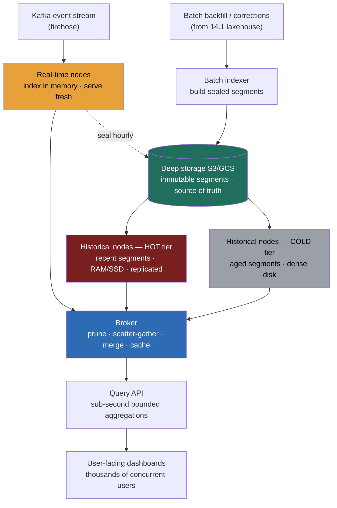

> **This is the question behind every "your post got 12,400 views by region this hour" counter and every live operational dashboard, and it's the one people answer by reaching for the wrong tool.** A weak answer points the user-facing dashboard at the warehouse or a generic OLTP database and waits four seconds per query under a thousand concurrent users. A Director-level answer opens by separating two query workloads the question conflates, *user-facing* (high concurrency, sub-second p99, bounded query shapes) from *internal ad-hoc* (low concurrency, flexible arbitrary SQL), and recognizes they want **two completely different stores.** User-facing analytics at scale is not "a fast database"; it's a **purpose-built real-time OLAP serving store** (Druid/Pinot-class) whose entire architecture, pre-aggregated immutable segments, a real-time path that merges with a historical path, a broker that scatter-gathers across nodes, hot/cold tiering, exists to make a bounded aggregation over billions of rows return in tens of milliseconds to thousands of concurrent callers. The mistake almost everyone makes is treating sub-second-at-high-concurrency as a tuning problem on a general store. It's an architecture problem, and the architecture is the answer.

### Learning objectives
- Run the **RESHADED** spine on a **real-time serving** problem (E becomes concurrency, freshness-lag, and segment sizing; A becomes the bounded-query and ingest interface; D becomes the segment + rollup model), and surface the load-bearing tension: **sub-second p99 at thousands of QPS over fresh, billions-of-rows data forces pre-aggregation, immutable segments, and a real-time/historical split.**
- Open with the **"user-facing or internal ad-hoc?"** clarifying question and show how the answer flips the store choice, the ops model, and the whole architecture.
- Justify **pre-aggregation / rollup at ingest** (fast, cheap, *loses raw granularity and query flexibility*) against storing raw, and **a real-time OLAP store** against serving from the warehouse or a Redis precompute, each with its rejected alternative and why.
- Design the **real-time-node + historical-segment split** so data is queryable seconds after it lands *and* served cheaply from deep storage once aged, the handoff that must not double-count.
- Treat **bytes-scanned-per-query and ingestion lag** as the two load-bearing budgets, and name the levers, time-partitioned columnar segments, bitmap/inverted indexes, the scatter-gather broker, hot/cold tiering, that hold p99 sub-second as concurrency and cardinality climb.

### Intuition first
Think of the difference between a **librarian answering one scholar's open-ended research question** and a **stadium scoreboard the whole crowd watches at once.** The warehouse is the librarian: ask anything, however weird, and she'll go find it, but she serves one patron at a time and a deep question takes minutes. That's perfect for the analyst writing a novel SQL query nobody's run before. It is hopeless for fifty thousand fans who all want the *same small set of numbers* refreshed every few seconds, because the librarian can't be in fifty thousand reading rooms at once, and re-deriving each answer from raw shelves every time is far too slow.

A **real-time OLAP serving store is the scoreboard.** Because the questions are *known and bounded* ("clicks by region this hour," "views per minute today"), you don't keep re-deriving them from raw events on every glance. You **pre-tally as the data arrives**, the moment a sale rings up, the running totals for the relevant buckets tick up, so the board can be read instantly by anyone, millions of times, because reading a posted number is nearly free. And the board has **two halves wired together**: a live ticker for *the last few minutes* (events still streaming in, counted in memory) and the *settled totals* for everything older (frozen, compacted, stored cheaply, read fast). A reader sees one seamless number; underneath, "the last five minutes" and "the last three years" are served by different machinery, and stitching them without double-counting the boundary is the whole trick.

The mistake to avoid is the one that confuses the two roles: thinking "the dashboard is slow, let me tune the database" or "let me cache it in Redis." A general database tuned hard is still a librarian wearing running shoes, and a Redis cache is a scoreboard that can only show the exact handful of numbers you hardcoded, the moment a user picks a filter you didn't precompute, it's blank. The serving store is a scoreboard you can *slice*, fast on any of the bounded questions, fresh to the second, and readable by everyone at once. That, not raw speed alone, is what the design buys.

---

## R: Requirements

> Pin who queries, how fresh, how concurrent, and, the architecture-flipping question, **user-facing or internal ad-hoc.** The spine is standard; R does double duty by extracting the workload that decides the store.

**The opening Director move, the question I ask first:** *"Is this powering a user-facing feature, dashboards shown to millions, where I need sub-second p99 at high concurrency over bounded, known query shapes? Or is it internal ad-hoc analytics, a handful of analysts running flexible arbitrary SQL at low concurrency where a few seconds is fine?"* The answer flips the design:
- **User-facing, high concurrency, bounded queries, fresh** → a **purpose-built real-time OLAP serving store** (Druid / Pinot / ClickHouse-class): pre-aggregated, time-partitioned immutable segments, a scatter-gather broker, a real-time path for freshness. This is the hard, interesting case.
- **Internal ad-hoc, low concurrency, arbitrary SQL** → the **warehouse / lakehouse**: flexible, cheap, handles any query, but seconds-to-minutes latency and tens of concurrent queries, *not* thousands. Wrong tool for the scoreboard.

I'll design for the **harder, increasingly-standard case: the user-facing serving store**, because "show every user their own live analytics" is now table stakes (creator dashboards, seller consoles, ops monitoring), and I'll name explicitly when the warehouse is the right, simpler call (an internal analyst team, no concurrency or freshness pressure).

**Clarifying questions I'd ask (with assumed answers):**
- *User-facing or internal ad-hoc?* → **User-facing.** Millions of users, sub-second p99, bounded query shapes. The central decision; it picks the store.
- *Freshness bar?* → **Seconds.** A "views this hour" counter that's 30 minutes stale is broken; design for **ingestion lag of a few seconds**, data queryable almost as soon as it's produced.
- *Query shapes, bounded or arbitrary?* → **Bounded.** Group-by over a known handful of dimensions (region, device, time bucket) with time-range filters. *Not* arbitrary joins across the schema, that's the warehouse's job, and bounded shapes are what make pre-aggregation possible.
- *Concurrency?* → **Thousands of QPS**, spiking with usage; many users hitting their own slice simultaneously.
- *Exact or approximate?* → **Approximate is fine for the dashboard** (a count-distinct off by 1% is invisible to a user glancing at "views"); exactness, if ever needed for billing, is a *separate* batch path, not this store's job.

**Functional requirements:**
1. **Ingest** a high-volume event stream (from Kafka) and make it queryable within **seconds**.
2. **Serve sub-second aggregations**, group-by over bounded dimensions with time-range filters, at **high concurrency**.
3. **Backfill / batch-load** historical data (corrections, re-derivations, bulk imports) into the same query surface.
4. **Pre-aggregate (roll up)** at ingest so common queries read pre-tallied numbers, not raw rows.
5. **Tier** data hot (recent, in memory, fast) and cold (aged, deep storage, cheaper) transparently behind one query.

**Explicitly CUT (scoping is the signal):** the dashboard UI itself; arbitrary ad-hoc SQL / data-science exploration (that's 14.1); exact-for-billing counting (that's the batch source-of-truth path); the stream pipeline that *produces* the events (the ingest, the CDC); and infrastructure-monitoring time-series (Prometheus/Mimir-class, 9.12, is a *different* shape, optimized for many low-cardinality metric series and alerting, not high-cardinality user-facing slices). I scope to **ingest fresh + batch backfill → pre-aggregated immutable segments → broker scatter-gather → sub-second bounded query.**

**Non-functional requirements:**
- **Sub-second p99** on the bounded query shapes, at thousands of QPS, the cardinal latency invariant; "fast on average" is not the bar, the tail is.
- **Seconds-fresh ingestion lag**, the real-time premise; data is useful *because* it's current.
- **High read concurrency**, thousands of users on their own slices without contention.
- **Horizontal scalability** on data volume *and* QPS independently, more data → more segments/nodes; more readers → more replicas/brokers.
- **Cost-efficiency via tiering**, recent data hot (expensive, fast), old data cold (cheap, slower), behind one query interface.
- **Approximate-OK**, exactness is deliberately traded for speed where a user-facing glance tolerates it.

**The skew, stated:** this is **append-heavy ingest + read-heavy bounded queries, latency-and-concurrency-bound, freshness-critical.** The hard parts are *holding sub-second p99 at high concurrency over fresh, billions-of-rows data*, not write durability or query flexibility. That inverts the warehouse's shape (the warehouse optimizes flexible cheap scans at low concurrency) and shapes every downstream choice toward pre-aggregation, immutable segments, and the real-time/historical split.

---

## E: Estimation

> Enough math to make a defensible call; here the load-bearing numbers are **bytes scanned per query** (which decides whether p99 is sub-second) and **ingestion lag** (which decides whether the data is fresh), plus the **rollup compression** that links them.

**Assumptions:** **500k events/sec** ingested (user-activity events: views, clicks, plays); each raw event ~**200 bytes** with ~6 query-relevant dimensions (user/content id, region, device, type, timestamp); **3,000 dashboard QPS** at peak, each query a group-by over a bounded dimension set with a time-range filter; retain **~1 year** queryable.

**Ingest throughput:** `500k/sec × 200 B ≈ 100 MB/s` sustained, `~8.6B events/day`. This is a partitioned-stream-consumption problem; the store reads from Kafka (the firehose), it does not accept 500k random writes/sec itself.

**Rollup compression (the lever that makes everything else work):** raw events at full granularity would be `~8.6B rows/day`. But user-facing queries don't need per-event rows, they need *per-(content, region, device, minute)* tallies. **Rolling up to a 1-minute grain at ingest** collapses many raw events into one pre-aggregated row. If a popular content item gets thousands of views per minute per region, the rollup ratio is large; realistically across the mix, **rollup compresses ingested rows ~10–100×** (Druid/Pinot routinely report this on real workloads). Take a conservative **~20×**: `8.6B → ~430M rolled-up rows/day`. *This is the single most consequential number on the problem*, it shrinks both storage and bytes-scanned-per-query by the same factor, and it's why pre-aggregation is the headline decision, not an optimization.

**Storage (segments):**
- Rolled-up, columnar-compressed (~4× on top of rollup): on the order of **~5–10 GB/day** of segment data after rollup + columnar compression, vs ~1.7 TB/day raw, the rollup + columnar stack is a **~100–300× footprint reduction**.
- One year hot-ish: **~2–4 TB of segments.** Small enough that the *recent* slice (last days/weeks, the hot tier most queries touch) fits in cluster memory/SSD across nodes; the long tail lives in deep storage (S3) and is pulled to historical nodes on demand.

**Bytes scanned per query (the latency budget, where p99 is won or lost):**
- A query is "content X, views by region, this hour." With **time-partitioned segments**, the broker prunes to the segments covering *this hour* (a handful), not the year. With **rollup**, those segments already hold per-minute-per-region tallies, not raw events. With a **bitmap index on `region`/`content_id`**, the scan skips to matching rows.
- Net: a query touches **~tens of MB across a few segments, not GBs**, and because segments are pre-aggregated and indexed, the work is *aggregating thousands of pre-tallied rows*, not scanning billions of raw ones. That's the difference between **~20–50 ms** (sub-second p99 achievable at 3,000 QPS) and the multi-second warehouse scan. *What estimation decided:* sub-second p99 is not a tuning outcome, it's a structural consequence of **time-partitioning + rollup + indexes** shrinking bytes-scanned by ~100×.

**Concurrency:** 3,000 QPS, each scattered by the broker across the few relevant segments on multiple historical/real-time nodes and gathered. Capacity scales two independent ways: **more data → more segments spread over more historical nodes** (parallelism per query); **more readers → more broker and historical-node replicas** (each segment replicated, queries load-balanced across replicas). The decoupling lets QPS and data volume scale separately, the architectural payoff.

**Ingestion lag (the freshness budget):** events flow Kafka → **real-time nodes** that index incoming events in memory and *serve queries over them immediately*. Lag from event-produced to query-visible is **~seconds** (Kafka hop + in-memory indexing), meeting the freshness bar without waiting for the periodic handoff to historical segments. *What estimation decided:* freshness comes from the **real-time path serving in-memory data**, not from making the batch/historical path faster, the two-path split is forced by the numbers.

---

## S: Storage

> This is the heart of the problem. The store is built from one idea, **pre-aggregated, time-partitioned, columnar, immutable segments**, served by two tiers (real-time + historical) over a deep-storage backbone, with the broker stitching them. Pick each layer by the latency-and-freshness contract.

**1. The segment: pre-aggregated, columnar, time-partitioned, immutable, the atomic unit of everything.**
- *Choice:* data lives in **segments**, each covering a **time range** (e.g. one hour), holding **columnar** data that's been **rolled up** (pre-aggregated to a grain) and carries **bitmap/inverted indexes** on the filter dimensions. Segments are **immutable** once sealed, written once, never updated, only replaced.
- *Why immutable:* immutability is what makes the store fast, cheap, and concurrent. Immutable segments need no locking (any number of readers, no write contention), can be **freely replicated and cached** across nodes (more replicas = more read throughput, the concurrency answer), and can be **memory-mapped** for near-RAM-speed scans. Updates happen by writing a *new* segment and atomically swapping it in, not by mutating in place.
- *Rejected, mutable row storage (an OLTP table):* per-row locking and B-tree maintenance kill both the high-concurrency reads (writers block readers) and the columnar scan speed; you cannot serve 3,000 QPS of group-bys from a mutable row store. *Rejected, raw (non-rolled-up) columnar segments:* you keep full flexibility but pay the ~20× bytes-scanned penalty on every query, sub-second at high concurrency slips away. The segment's pre-aggregation is the deliberate flexibility-for-speed trade.

**2. The real-time tier: freshness.**
- *Choice:* **real-time nodes** consume the Kafka stream, **index events in memory** as they arrive, and **serve queries over that in-memory data immediately**, so data is queryable seconds after it's produced. Periodically (e.g. each hour), a real-time node **seals its in-memory data into an immutable segment, hands it to deep storage, and the historical tier takes over serving it.**
- *Rejected, wait for batch to make data queryable:* the warehouse/batch path has minutes-to-hours latency; it cannot meet a seconds freshness bar. The real-time tier exists precisely to serve the *just-arrived* window the historical tier doesn't have yet.

**3. The historical tier + deep storage: cheap, fast reads on aged data.**
- *Choice:* **historical nodes** load sealed immutable segments from **deep storage (S3/GCS)** onto local SSD/memory and serve the bulk of queries (everything older than the real-time window). **Deep storage is the durable source of truth for segments**, cheap, durable (11 nines), and the thing that makes the store rebuildable, lose a historical node and you just reload its segments from S3 onto another.
- *Rejected, keep all data in memory forever:* prohibitive at TB-and-growing scale. *Rejected, query straight from deep storage (S3) per request:* S3 per-request latency (tens of ms+ per object, no indexes) blows the sub-second budget at high QPS; historical nodes are the **hot cache** of segments in front of cold deep storage.

**4. Hot/cold tiering (the cost lever).**
- *Choice:* **tier historical nodes** by data age, recent segments (the vast majority of queries, "this hour/today") on **fast, expensive nodes** (lots of RAM/SSD, high replication); old segments (rarely queried) on **cheap, dense nodes** (more disk, less RAM, lower replication) or left in deep storage and pulled on demand. One query interface spans both.
- *Rejected, one uniform tier:* you either overpay (everything on fast hot nodes) or underperform (everything on cheap cold nodes); usage is heavily skewed to recent data, so tiering by age tracks the access pattern and cuts cost multiples on the cold majority. *Trade-off named:* a rare query for old data is slower (cold node or a deep-storage pull); accepted because old user-facing data is queried seldom.

**5. The broker: scatter-gather.**
- *Choice:* a **broker** receives each query, uses segment metadata to **prune to the relevant segments** (time-range + dimension), **scatters sub-queries to the real-time and historical nodes holding them**, and **gathers + merges** the partial aggregates into the final answer. The broker is also the natural **caching point** for hot results and the **load-balancer** across segment replicas.
- *Rejected, query nodes directly:* the client would need to know segment placement and merge partials itself; the broker centralizes pruning, fan-out, merge, and result caching, and is what makes "the last 5 minutes + the last year" one seamless answer.

**The store's resolution:** immutable pre-aggregated segments (fast, concurrent, cheap) + a real-time tier (freshness) + a historical tier over deep storage (cheap aged reads) + tiering (cost) + a scatter-gather broker (one fast answer). This *is* the Druid/Pinot/ClickHouse architecture; the category, a purpose-built real-time OLAP serving store, is the decision, and the specific engine is a delegated bake-off (below).

---

## H: High-level design

> The shape to make visible: **one event stream + a batch backfill → two ingest paths (real-time in-memory, batch into segments) → immutable segments in deep storage, tiered hot/cold → a broker that scatter-gathers real-time + historical → a sub-second query API.**



**Happy path, compressed:** user-activity events flow off **Kafka** into **real-time nodes**, which index them in memory, **rolling up to the configured grain**, and immediately serve queries over the just-arrived window, so a "views this minute" counter is fresh to the second. Periodically each real-time node **seals its window into an immutable, pre-aggregated, indexed segment**, writes it to **deep storage (S3)**, and hands off serving to the **historical tier**. Separately, a **batch indexer** builds segments from the **lakehouse**, for backfills, corrections, or bulk historical loads, and writes them to the same deep storage, one query surface over both. **Historical nodes** pull segments from deep storage onto local SSD/RAM, tiered **hot** (recent, heavily replicated, the bulk of traffic) and **cold** (aged, dense, cheap). A query hits the **broker**, which **prunes** to the segments covering the requested time range and dimensions, **scatters** sub-queries to the real-time and historical nodes holding them, and **gathers and merges** the partial aggregates, seamlessly stitching "the last few minutes" (real-time tier) with "everything older" (historical tier) into one sub-second answer for the **dashboard**, served to thousands of users concurrently because immutable segments replicate freely.

**The shape to notice:** the load-bearing walls are (1) **the real-time/historical split**, freshness from the in-memory real-time tier, cheap fast bulk reads from historical segments, stitched by the broker; and (2) **immutable pre-aggregated segments as the atomic unit**, which is simultaneously the freshness handoff, the concurrency answer (free replication), the cost lever (tiering), and the speed answer (columnar + indexes + rollup). This is **not** the warehouse (the flexible-but-slow scan) and **not** a cache (Redis's rigid precompute); it's a *sliceable scoreboard*, the concept lesson frames the category, this builds it.

---

## A: API design

> The "API" is two surfaces: the **bounded query interface** (the read contract that p99 is measured against) and the **ingestion + segment contract** (stream + batch into immutable segments). The *bounded* shape of the query is the performance story, an arbitrary-SQL surface would break the contract.

```
# --- Query (read path; sub-second, bounded shapes, high concurrency) ---
GET /v1/query
  body / params: {
    table: "content_events",
    metrics: ["views", "uniqueViewers"],     # pre-aggregated measures (uniqueViewers = approx, sketch)
    dimensions: ["region"],                    # group-by over BOUNDED, indexed dims
    filters: { contentId: "abc", device: "ios" },
    timeRange: { from: "2026-06-23T10:00Z", to: "2026-06-23T11:00Z" },
    granularity: "minute"                      # roll-up grain of the answer
  }
  -> 200 {
       series: [{ region, window, views, uniqueViewers }],
       asOf: <ts>,                             # freshness: includes real-time window
       approximate: true                       # honest: uniqueViewers is a sketch estimate
     }

# --- Ingest (stream; real-time, seconds-fresh) ---
# Not a write API: the store CONSUMES a Kafka topic.
ingest_spec: { topic: "content_events", timestampColumn, dimensions:[...],
               metrics:[...], rollup: { granularity: "minute" } }

# --- Batch backfill / correction (re-derivable from the lakehouse) ---
POST /v1/segments/build
  body: { source: "s3://lakehouse/gold/...", timeRange, rollupSpec, segmentGranularity: "hour" }
  -> 202 Accepted   # builds immutable segments, atomically swaps them into the query surface
```

**Design notes (each with its rejected alternative):**
- **The query surface is deliberately bounded**, group-by over pre-declared, indexed dimensions with a time-range filter and pre-aggregated metrics. This *is* what makes sub-second-at-high-concurrency achievable. *Rejected: a full arbitrary-SQL surface (joins across the schema, ungrouped raw scans)*, that's the warehouse; offering it here invites the un-prunable query that blows the p99 budget for everyone. The bounded contract is a feature, not a limitation.
- **Ingestion is stream consumption, not a write endpoint.** The store pulls from Kafka and serves the just-arrived window from the real-time tier. *Rejected: a synchronous write API the producers call*, no store absorbs 500k random writes/sec cheaply, and you'd lose the replay/rebuildability the log gives.
- **`approximate: true` is surfaced honestly** for sketch-based metrics (count-distinct via HyperLogLog/Theta sketch, quantiles via t-digest). *Rejected: silently returning an exact-looking number*, the user-facing glance tolerates ~1% on uniques, but the API must not pretend a sketch is exact; exactness is a separate batch path.
- **`asOf` reflects the real-time window**, the response includes data from seconds ago because the broker merged the real-time tier. *Rejected: an `asOf` that only reflects the last sealed segment*, that would understate freshness and defeat the real-time tier's purpose.
- **Batch segment-build is idempotent and atomic-swap**, rebuilding a time range from the lakehouse produces new segments that atomically replace the old, no double-count, no half-state. *Rejected: in-place mutation of live segments*, immutability is the whole concurrency model; you replace, never mutate.

---

## D: Data model

> Two consequential decisions: the **rollup grain** (how aggressively to pre-aggregate, the flexibility-vs-speed-and-cost dial) and the **segment layout** (time-partitioning + dimension indexing, which *is* the bytes-scanned control).

**The rolled-up fact row (the stored unit):** `(timestamp_bucket, dimension_tuple) → measures`. For example `(2026-06-23T10:31, content=abc, region=EU, device=ios) → {views: 4120, uniqueViewers_sketch: <HLL>}`. Many raw events collapse into this one row, the ~20× compression. **Measures are pre-aggregated** (sums, counts) or **sketches** (HLL for count-distinct, t-digest for quantiles) so they're *mergeable* across segments at query time, the broker sums partials, the property that makes scatter-gather correct.

**Segment layout (the bytes-scanned lever, the most consequential modeling choice):**
- **Time-partition** segments by the primary time dimension (e.g. one segment per hour), so a time-range query **prunes to a few segments**, never the year. This is the first and biggest scan reduction. *Rejected: partition by a non-time key (e.g. region)*, time-range filtering (every user-facing query has one) would scan all of time; time is the universal filter, so it's the partition key.
- **Columnar within the segment**, so a query reading 2 of 6 dimensions touches only those columns.
- **Bitmap / inverted indexes** on the filter dimensions (`region`, `content_id`, `device`), so `WHERE region='EU' AND device='ios'` resolves to a bitmap intersection that **skips straight to matching rows**, no scan of non-matching data. Bitmaps are tiny, compress superbly on low-to-medium-cardinality dimensions, and ANDs are just bitwise intersections, this is what makes filtered group-bys near-instant.
- **Replication** of each segment across multiple historical nodes (and across the hot tier especially), so concurrent queries load-balance across replicas, the concurrency answer is "replicate the immutable unit," trivial precisely because it's immutable.

**The rollup-grain decision (the headline data-model trade-off):**
- **Aggressive rollup (coarse grain, e.g. 1-minute, few dimensions):** maximal compression (cheap storage, tiny scans, fastest queries), but you **lose the ability to query below the grain or by a dimension you didn't keep**, no per-event drill-down, no "by a dimension we rolled away." Best when query shapes are truly bounded and known.
- **Light/no rollup (fine grain, all dimensions, or raw):** full flexibility (any slice, drill to the event), but you pay the storage and bytes-scanned cost, p99 and \$ both rise. Best when query shapes are uncertain.
- **The Director call:** roll up to the **finest grain the user-facing queries actually need** (here, 1-minute × the known dimension set), and keep the **raw events in the lakehouse** for the rare deep drill-down or to *rebuild* segments at a finer grain later, the rebuildability invariant means the rollup choice isn't a one-way door. *Trade-off explicitly named:* I'm trading raw granularity and ad-hoc flexibility in the serving store for sub-second-at-high-concurrency, and recovering flexibility, when rarely needed, from the lakehouse, not by bloating the serving store.

<details>
<summary>Go deeper, the real-time→historical handoff and avoiding double-count (IC depth, optional)</summary>

The boundary between the **real-time tier** (serving the just-arrived, in-memory window) and the **historical tier** (serving sealed segments) is where correctness lives, get it wrong and the boundary minute is either counted twice or dropped.

- **The handoff:** a real-time node accumulates events for a time chunk (e.g. the 10:00–11:00 segment). When the chunk closes (plus a grace period for stragglers, watermark-style), it **builds an immutable segment, publishes it to deep storage, registers it in the metadata store, and only then stops serving that window from memory**. The broker, reading the metadata, now routes 10:00–11:00 queries to the *historical* segment instead of the real-time node.
- **Avoiding double-count at the boundary:** the broker uses the **segment metadata as the single source of truth for "who serves which time range."** A time range is served by *exactly one* of {a real-time node, a historical segment}, never both, because the handoff atomically flips ownership in the metadata. The real-time node keeps serving until the historical segment is *registered and queryable*, then yields, so there's no gap (drop) and no overlap (double-count). This is the analog of the stream/batch reconciliation, but *inside one query* rather than across two systems.
- **Late events after sealing:** an event arriving after its segment sealed is handled by the grace period if close, or folded in via a **batch re-build of that segment from the lakehouse** if very late, the same idempotent-recompute-and-atomic-swap that makes the store rebuildable. The user-facing dashboard tolerates the brief approximation; if exactness ever matters, it comes from the batch path, not this store.
- **Exactly-once on ingest:** real-time consumption commits Kafka offsets with segment publication (transactional, Flink/Druid-style) so a real-time-node crash replays without double-counting into the in-memory aggregate, the same effectively-once mechanics as the stream path.

The reusable idea: **immutability + a metadata-driven ownership flip** is how you serve "now" and "history" as one number without a reconciliation bug.

</details>

---

## E: Evaluation

> Re-check against the NFRs and hunt the bottlenecks, naming each trade-off.

**Re-check vs NFRs:** sub-second p99, time-partitioning + rollup + bitmap indexes shrink bytes-scanned ~100×; freshness, the real-time tier serves in-memory data seconds after arrival; concurrency, immutable segments replicate freely + the broker load-balances; scalability, segments over more historical nodes (data) and more replicas/brokers (QPS), independently; cost, hot/cold tiering by age; approximate-OK, sketches for count-distinct/quantiles. Now the bottlenecks.

**Bottleneck 1, high-cardinality dimensions / rollup explosion (the cardinal cost-and-latency risk).**
Add a high-cardinality dimension (e.g. `user_id`, or `session_id`) to the rollup, and the number of distinct `(dimension_tuple)` rows explodes, **rollup stops compressing** (every event is its own group), segments bloat, and scans slow toward raw-data speed, the whole pre-aggregation premise collapses.
*Fix:* **keep only bounded, low-to-medium-cardinality dimensions in the serving store's rollup**; for high-cardinality needs, use **sketches** (HLL/Theta for "unique users," which is mergeable and tiny) rather than storing the raw id, and push genuine high-cardinality drill-down to the **lakehouse**. *Rejected: rolling up by every dimension someone might want*, it destroys compression and is the most common real-world Druid/Pinot cost blowup. *Trade-off:* you lose the ability to slice by the excluded high-cardinality dimension in the serving store, accepted because that slice is rare and belongs in the warehouse. This is the dimension-modeling discipline that *is* the design.

**Bottleneck 2, hot segments (the skewed-read problem).**
One content item goes viral; every query hits the *same recent segments* for that item, overloading the few historical nodes holding them, p99 spikes for everyone on those segments.
*Fix:* **replicate hot (recent) segments across many nodes** so reads load-balance, and **cache hot query results at the broker** (a viral item's "views by region this minute" is requested identically thousands of times, cache it for a few seconds). *Rejected: a single replica per segment*, it serializes the hot read. *Trade-off:* more replicas and a freshness-bounded result cache cost memory and add seconds of result staleness; cheap insurance against a viral hot spot. (This is 9.7/the hot-key shape, applied to segment replicas.)

**Bottleneck 3, the real-time→historical handoff (double-count / freshness gap).**
The boundary window is counted twice (real-time *and* historical both serve it) or dropped (neither does) during the seal-and-handoff.
*Fix:* **metadata-driven atomic ownership flip**, the real-time node serves a window until its historical segment is registered and queryable, then yields; exactly one tier owns any time range (Go-deeper). *Rejected: time-based "real-time serves the last hour" with no coordination*, races at the boundary cause exactly the double-count/gap. The metadata store is the arbiter, this is the in-one-query analog of the stream/batch reconciliation.

**Bottleneck 4, ingestion lag vs query freshness (the freshness budget).**
Ingest throughput can't keep up (a 3× traffic spike), real-time nodes fall behind Kafka, and "views this minute" goes stale, the freshness NFR breaks.
*Fix:* **scale real-time-node parallelism on Kafka partitions** (the partitioned firehose, more partitions → more real-time consumers), and **buffer in Kafka** so a spike doesn't drop events, it just briefly extends lag, which recovers. *Rejected: a single real-time consumer*, it caps ingest throughput and is the freshness bottleneck. *Trade-off:* more partitions/consumers add coordination; the cost of meeting a seconds-fresh bar under spikes.

**Bottleneck 5, concurrency scaling / the broker as a fan-out chokepoint.**
At 3,000+ QPS, the broker's scatter-gather fan-out and merge becomes the bottleneck, or a single broker is overwhelmed.
*Fix:* **run multiple stateless brokers behind a load balancer**, **cache hot results at the broker**, and **keep queries prunable** (time-partitioning) so each scatters to *few* segments, not all, fan-out width is bounded by good partitioning. *Rejected: one broker, or un-prunable queries that scatter to every segment*, both turn the broker into the wall. *Trade-off:* result caching trades a few seconds of staleness for a large QPS multiplier on repeated hot queries; for a user-facing dashboard that's a clear win.

**Closing re-check:** cost-and-latency held by bounded-cardinality rollup + sketches; hot segments by replication + result cache; handoff correctness by metadata-driven ownership; freshness by real-time parallelism on Kafka; concurrency by stateless brokers + caching + pruning. The store is fast, fresh, concurrent, cheap, and rebuildable from the lakehouse.

---

## D: Design evolution

> Push the dimensions and find what breaks; here the central evolution argument is **the serving store vs the alternatives that look cheaper**, and how the rollup choice ages.

**The headline trade-off, why a purpose-built real-time OLAP store and not the obvious alternatives.** The instinct under "the dashboard is slow" is to reach for something you already have. The honest Director position names each and rejects it with a reason:
- **vs the warehouse / lakehouse:** the warehouse is *flexible and cheap* but *seconds-to-minutes latency at tens of concurrent queries*, structurally wrong for sub-second-at-thousands-of-QPS user-facing serving. It's the right tool for *internal ad-hoc*; pointing a million-user dashboard at it is the most common and most expensive mistake on this problem. **Use the warehouse for the analyst, the serving store for the user.**
- **vs a precomputed cache in Redis (1.x):** a Redis precompute is *blazing fast* but **rigid**, it can only serve the *exact* aggregations you precomputed; the moment a user picks a filter combination you didn't materialize, it's a miss with no fallback. It also doesn't solve freshness (you'd re-precompute constantly) or high-cardinality slicing. Redis is a great *result cache in front of the broker* (Bottleneck 2/5), not the serving store, it can't be *sliced*. **Cache the hot answers, don't try to cache the whole cube.**
- **vs storing raw (no rollup) in a fast columnar store (e.g. ClickHouse used raw):** raw gives full flexibility but pays the ~20× bytes-scanned tax; viable at smaller scale or when queries are genuinely unpredictable, but at billions of rows and sub-second-at-high-concurrency, rollup is what makes the budget. *The trade is flexibility for speed-and-cost*, and at this scale and bounded-query profile, speed-and-cost wins.
- **My prior:** for user-facing, high-concurrency, bounded-query, seconds-fresh analytics at scale, a **purpose-built real-time OLAP serving store with rollup**, with the **lakehouse behind it** for the raw, the rare drill-down, and segment rebuilds. The serving store and the warehouse are *complementary, not competing*: The warehouse/lakehouse problem is the source of truth and the flexible-query store; the real-time-OLAP-serving problem is the fast-serving projection of the bounded slices users actually look at.

**At 10× (5M events/sec, tens of thousands QPS):** ingest scales on Kafka partitions and real-time-node parallelism (the design's whole point); the **rollup ratio becomes existential**, at this volume an un-bounded high-cardinality dimension is a cost catastrophe, so **rollup-dimension discipline moves from best-practice to enforced schema policy**; hot/cold tiering carries more (the cold tail dominates volume), and the binding complexity becomes **broker fan-out and segment placement**, both horizontal (more brokers, more historical nodes, smarter segment-to-node assignment). The real-time/historical split and immutable segments don't change, they're what *lets* it scale.

**Hardest trade-offs to defend:**
- **Rollup granularity (flexibility vs speed-and-cost).** Coarser rollup is cheaper and faster but forecloses slices and drill-down; defending *which grain and dimensions* against the actual query shapes, and recovering flexibility from the lakehouse rather than bloating the serving store, is the senior tell.
- **Serving store vs warehouse (two stores for one "analytics").** You run a *second* analytical system (the serving store) alongside the warehouse; defending *why one store can't be both* (the user-facing latency/concurrency contract is structurally incompatible with flexible cheap ad-hoc) is the architectural judgment being scored.
- **Approximate-by-default.** Sketches make count-distinct fast and mergeable but approximate; defending *why ~1% error is correct for a user glance* (and where exactness must instead come from the batch path) shows you're matching the guarantee to the use, not defaulting to exact everywhere.

**Where I'd delegate (the explicit Director move):**
- **Engine bake-off, Druid vs Pinot vs ClickHouse:** *"Data platform benchmarks the three on our 500k/sec ingest + 3,000-QPS bounded-query + seconds-freshness profile. My priors: **Pinot** for the lowest-latency high-QPS user-facing serving with rich indexing (it was built at LinkedIn for exactly this); **Druid** for the most mature real-time-ingest + time-series operational tooling; **ClickHouse** when raw-data flexibility and raw scan speed matter more than turnkey rollup/real-time and the team will operate SQL-first. The *category*, a real-time OLAP serving store, is decided; the pick isn't load-bearing and turns on our exact freshness/cardinality/ops fit."*
- **Rollup schema + sketch choices:** *"Analytics owns the per-table rollup grain and dimension set against the actual dashboard query shapes, and the sketch types (HLL vs Theta for uniques, t-digest for quantiles). I own the *policy*, no unbounded high-cardinality dimension enters the serving-store rollup; high-cardinality drill-down lives in the lakehouse."*
- **Tiering and retention thresholds:** *"Platform tunes the hot/cold age boundary and replication factors against the observed access skew and the latency SLA; I own the principle, recent data hot and heavily replicated, aged data cheap, rebuildable from deep storage."* What I keep, **the real-time/historical split, immutable pre-aggregated segments, scatter-gather, bounded-cardinality rollup, and the serving-store/warehouse complementarity**, is the altitude.

**Handoff:** this serving store is the **fast, bounded, user-facing read path**; the **flexible, cheap, ad-hoc batch store it complements and rebuilds from** is the warehouse/lakehouse; the **exact-for-money counting** of the same kind of event stream is the batch source-of-truth path; and **infrastructure-metric time-series + alerting** is a deliberately *different* store, optimized for many low-cardinality metric series, not high-cardinality user-facing slices.

---

### Trade-offs table: the pivotal decisions

| Decision | Option A | Option B | Option C | Use when… |
|---|---|---|---|---|
| **Serving store** | **Purpose-built real-time OLAP** (Druid/Pinot) | **Warehouse / lakehouse** | **Redis precompute** | **A** for user-facing, sub-second p99, high QPS, bounded queries, fresh (our choice). **B** for internal ad-hoc, flexible SQL, low concurrency. **C** only as a *result cache* in front of A, never as the sliceable store. |
| **Pre-aggregation** | **Roll up at ingest** (coarse grain) | **Store raw / no rollup** | **Light rollup, fine grain** | **A** when query shapes are bounded/known, maximal speed+cost win (our choice). **B** when queries are unpredictable and scale is modest. **C** middle ground when some drill-down is needed in-store. |
| **Ingest path** | **Real-time + historical split** | **Batch-only segments** | **Stream-only (no deep store)** | **A** when freshness (seconds) *and* cheap aged reads both matter (our choice). **B** when minutes-stale is fine (then it's nearly 14.1). **C** loses rebuildability and the cheap historical tier. |
| **Count-distinct** | **Sketch (HLL/Theta), approximate** | **Exact (store raw ids)** | **Batch-exact** | **A** for user-facing uniques where ~1% is invisible (our choice, mergeable + tiny). **B never** in the serving store (kills rollup via cardinality). **C** when exactness is required, in the separate batch path. |

---

### What interviewers probe here (Director altitude)

- **"User-facing or internal ad-hoc?"**, *Strong:* asks it *first*, then picks the store, a real-time OLAP serving store for user-facing/high-concurrency/bounded/fresh, the warehouse for ad-hoc/flexible/low-concurrency, and states the answer flips the architecture. Knows they're *complementary*, not competing. *Red flag:* points the user-facing dashboard at the warehouse (or "just use Postgres with indexes") and never distinguishes the workloads.
- **"How do you serve a sub-second group-by over billions of rows at thousands of QPS?"**, *Strong:* it's structural, **time-partitioned + rolled-up + bitmap-indexed immutable segments** shrink bytes-scanned ~100×, a broker prunes and scatter-gathers, segments replicate for concurrency; quantifies the scan reduction. *Red flag:* "add a cache" or "bigger machine" without the segment/rollup architecture.
- **"What does rollup cost you, and when does it blow up?"**, *Strong:* rollup trades **raw granularity and ad-hoc flexibility** for speed-and-cost, and **blows up on high-cardinality dimensions** (every event becomes its own group, compression dies); the discipline is bounded dimensions + sketches in-store, raw drill-down in the lakehouse. *Red flag:* rolls up by `user_id`/`session_id` and doesn't see the cardinality explosion, or doesn't know rollup loses anything.
- **"How is data queryable seconds after it arrives *and* cheap to store for a year?"**, *Strong:* the **real-time tier** serves in-memory just-arrived data for freshness; it **seals into immutable segments handed to a historical tier over deep storage** for cheap aged reads; the broker stitches them, with a metadata-driven ownership flip so the boundary isn't double-counted. *Red flag:* one tier for both, missing either freshness or the cost story, or hand-waving the handoff.
- **"Why not Redis, it's faster than any of this?"**, *Strong:* Redis precompute is rigid, it serves only the exact aggregations you materialized and dies on any unmaterialized filter; it's a great *result cache in front of the broker*, not a *sliceable* store, and doesn't solve freshness or high-cardinality slicing. *Red flag:* proposes precomputing "all the dashboards" in Redis without seeing the combinatorial explosion of filter combinations.

---

### Common mistakes

- **Serving user-facing dashboards from the warehouse.** Flexible and cheap, but seconds-to-minutes latency at low concurrency, structurally wrong for sub-second-at-thousands-of-QPS. Use a purpose-built serving store for the user, the warehouse for the analyst; they're complementary.
- **Rolling up by a high-cardinality dimension.** Putting `user_id`/`session_id` in the rollup makes every event its own group, compression collapses, segments bloat, and you've rebuilt a slow raw store. Keep bounded dimensions in-store; use sketches for uniques; drill down in the lakehouse.
- **Trying to cache the whole cube in Redis.** A precompute serves only the exact slices you materialized; real users pick filter combinations you didn't. Cache *hot results* at the broker (seconds-fresh), don't try to make a key-value store a sliceable OLAP store.
- **Mutable storage / ignoring immutability.** Mutable rows mean locking (writers block the thousands of concurrent readers) and no free replication. Immutable segments are what make the store concurrent, replicable, cacheable, and tier-able, the whole model rests on it.
- **Hand-waving the real-time→historical handoff.** "Real-time serves the last hour" with no coordination races at the boundary and double-counts or drops it. The metadata store must atomically flip ownership so exactly one tier serves any time range.

---

### Interviewer follow-up questions (with model answers)

**Q1. Walk me through a single "views by region this hour" query for a viral post.**
> *Model:* The request hits a **broker**, which uses segment metadata to **prune** to the segments covering *this hour* for that content, a handful, not the year, and recognizes the most recent minutes are still in the **real-time tier** while the rest are sealed **historical segments**. It **scatters** sub-queries: the real-time nodes aggregate their in-memory rolled-up rows for the latest window; the historical nodes (hot tier, the recent segments are heavily replicated, so a viral item's load spreads) use **bitmap indexes on `region`/`content_id`** to skip straight to matching rows and aggregate the pre-rolled per-minute-per-region tallies. The broker **gathers and merges** the partials (sums are mergeable; uniques merge via HLL sketches) into one answer, stitching real-time + historical seamlessly, and may **serve it from its result cache** for a few seconds since thousands of users request this identical slice. Net: tens of MB scanned across a few segments, ~20–50 ms, fresh to the second. The viral hot spot is handled by replication + result caching, not by a bigger machine.

**Q2. Your CEO wants to add a "by individual user" breakdown to the live dashboard. What happens, and what do you do?**
> *Model:* `user_id` is **high-cardinality**, adding it to the rollup makes nearly every event its own group, so **rollup stops compressing** (segments bloat ~20×, scans slow toward raw speed, cost spikes), it would break the sub-second-at-high-concurrency contract for *every* query, not just that breakdown. So I would *not* add it to the serving-store rollup. Instead: keep **bounded dimensions** (region, device, content) in the serving store; serve **"unique users" via an HLL/Theta sketch** (mergeable, tiny, ~1% error, invisible on a glance); and push genuine **per-user drill-down to the lakehouse**, which is built for high-cardinality flexible queries at low concurrency, exactly where a "show me this one user's activity" query belongs. The principle I hold: no unbounded high-cardinality dimension enters the serving-store rollup; flexibility lives in the warehouse, speed lives in the serving store.

**Q3. The dashboard counter and the billing report disagree on this campaign's number. Which is right, and is that a bug?**
> *Model:* Not a bug, **different guarantees by design.** The serving store is *approximate and seconds-fresh*: rolled up, sketch-based for uniques, with a brief real-time window that may include or just-miss boundary events, perfect for a user glance, deliberately not exact. The **billing number comes from the batch source-of-truth path**: exactly-once over complete deduped raw, late events folded in, fraud filtered. So the serving store answers "roughly, right now," the batch answers "exactly, settled." You **never bill from the serving store**, just as you never bill from the stream. If a user-facing number ever *must* be exact, it reads the batch result, not this store. Holding two reconcilable numbers, fast-approximate and slow-exact, is the same speed-vs-truth split as 9.7, here one is a serving store and one is a batch table.

**Q4. Druid, Pinot, or ClickHouse, pick one and defend it.**
> *Model:* The *category*, a real-time OLAP serving store, is the decision; the pick is a delegated bake-off with priors. My priors: **Pinot** if the dominant need is lowest-latency, highest-QPS *user-facing* serving with rich indexing, it was built at LinkedIn for member-facing analytics at exactly this concurrency, and its indexing (sorted, bitmap, star-tree) is strong for bounded slices. **Druid** if mature real-time-ingest tooling and time-series operational ergonomics matter most, it's the most battle-tested on the real-time/historical split. **ClickHouse** if raw-data flexibility and raw scan speed matter more than turnkey rollup/real-time and the team wants SQL-first operation, it's a phenomenal raw columnar engine but you assemble more of the real-time serving story yourself. I'd have data-platform benchmark all three on *our* 500k/sec-ingest, 3,000-QPS-bounded, seconds-fresh profile and decide on the numbers; the architecture (segments, real-time/historical split, scatter-gather, bounded rollup) is identical across them, so the pick isn't load-bearing.

**Q5. What does this cost, and what would you delegate?**
> *Model:* Two budgets. **Latency** is won structurally, time-partitioning + rollup (~20×) + bitmap indexes cut bytes-scanned ~100×, so p99 is sub-second *by architecture*, not by spend. **Dollar cost** concentrates in the **hot tier** (recent segments in RAM/SSD, heavily replicated for the high-QPS recent traffic) and **real-time nodes** (sized for 500k/sec ingest); the **cold tier and deep storage are cheap** (aged segments, dense disk / S3). Tiering by age tracks the access skew, so cost follows usage. I own the **policies**, bounded-cardinality rollup (no high-cardinality dimension in-store), hot/cold tiering, result caching, rebuild-from-lakehouse. I delegate, with priors, the **engine bake-off** (Pinot for user-facing latency, Druid for real-time maturity, ClickHouse for raw flexibility), the **rollup schema and sketch choices** (analytics, against the real query shapes), and the **tiering thresholds and replication factors** (platform, against observed skew and SLA). What I keep is the architecture: real-time/historical split, immutable pre-aggregated segments, scatter-gather, and the serving-store/warehouse complementarity.

---

### Key takeaways
- **It's a serving-architecture problem, not a fast-database problem.** Open with **"user-facing or internal ad-hoc?"**, user-facing (sub-second p99, high QPS, bounded queries, seconds-fresh) flips you to a **purpose-built real-time OLAP serving store** (Druid/Pinot); ad-hoc/flexible/low-concurrency stays in the warehouse. They're **complementary, not competing**, the serving store is the fast projection of the bounded slices; the warehouse is the flexible source of truth behind it.
- **Pre-aggregation (rollup) at ingest is the headline decision:** it shrinks rows ~10–100× (storage *and* bytes-scanned), making sub-second-at-high-concurrency structural, and it **costs raw granularity and ad-hoc flexibility**, recovered, when rarely needed, from the lakehouse, not by bloating the serving store. It **blows up on high-cardinality dimensions**; keep dimensions bounded and use **sketches** (HLL) for uniques.
- **Immutable, time-partitioned, columnar, bitmap-indexed segments are the atomic unit**, simultaneously the freshness handoff, the concurrency answer (free replication), the cost lever (hot/cold tiering), and the speed answer (prune + columnar + index). A **broker** prunes, scatter-gathers, merges, and caches.
- **The real-time/historical split delivers freshness *and* cheap aged reads:** real-time nodes serve in-memory just-arrived data (seconds-fresh), seal into immutable segments handed to historical nodes over deep storage (cheap, rebuildable). The **handoff must atomically flip ownership** in metadata so the boundary isn't double-counted, the in-one-query analog of the stream/batch reconciliation.
- **Reject the cheaper-looking alternatives with reasons:** the **warehouse** is too slow/low-concurrency for user-facing; **Redis precompute** is rigid (only materialized slices) and belongs as a *result cache in front of the broker*, not as the sliceable store; **raw/no-rollup** pays the bytes-scanned tax at scale. Delegate the **engine bake-off** (Pinot/Druid/ClickHouse) and **rollup/tiering tuning** with stated priors; keep the architecture.

> **Spaced-repetition recap:** Real-time OLAP serving = the **sliceable scoreboard** for *user-facing* analytics. Ask **"user-facing or internal ad-hoc?"** first, it picks the store: user-facing/sub-second/high-QPS/bounded/fresh → a **purpose-built real-time OLAP store** (Druid/Pinot); ad-hoc/flexible/low-concurrency → the **warehouse**, they're complementary. Build it from **immutable, time-partitioned, columnar, bitmap-indexed, pre-aggregated (rolled-up) segments**: rollup compresses ~10–100× (storage + bytes-scanned), making sub-second p99 *structural*, but **loses raw granularity** and **blows up on high-cardinality** dims (use **sketches/HLL** for uniques; drill down in the lakehouse). Two tiers stitched by a **scatter-gather broker**: **real-time nodes** serve in-memory just-arrived data (seconds-fresh), seal into **immutable segments** handed to **historical nodes** over **deep storage (S3)** (cheap, rebuildable), with a **metadata-driven ownership flip** so the boundary isn't double-counted (the reconciliation, in one query). **Hot/cold tiering** by age tracks the access skew. Reject the **warehouse** (too slow/low-concurrency for user-facing), **Redis precompute** (rigid; use as a broker *result cache*), and **raw/no-rollup** (bytes-scanned tax). **Never serve exact-for-money from here**, that's the batch path. Delegate **engine bake-off** (Pinot=user-facing latency, Druid=real-time maturity, ClickHouse=raw flexibility) + **rollup/tiering** with priors; keep real-time/historical split, immutable segments, scatter-gather, bounded rollup, warehouse complementarity.

---

*End of Lesson 8.2. Real-time OLAP serving is the sub-second, high-concurrency, seconds-fresh read path the batch warehouse deliberately isn't: a sliceable scoreboard built from immutable pre-aggregated segments, a real-time/historical split stitched by a scatter-gather broker, where the load-bearing decisions are rollup (speed-and-cost vs flexibility), the serving-store/warehouse complementarity, and the freshness handoff, reusing the streaming firehose and speed-vs-truth split from 9.7 and the columnar/freshness foundations from 13.1/13.2/13.5. Next: 14.3, change data capture and streaming ETL, the reliable ingestion that feeds both the warehouse and this serving store.*
