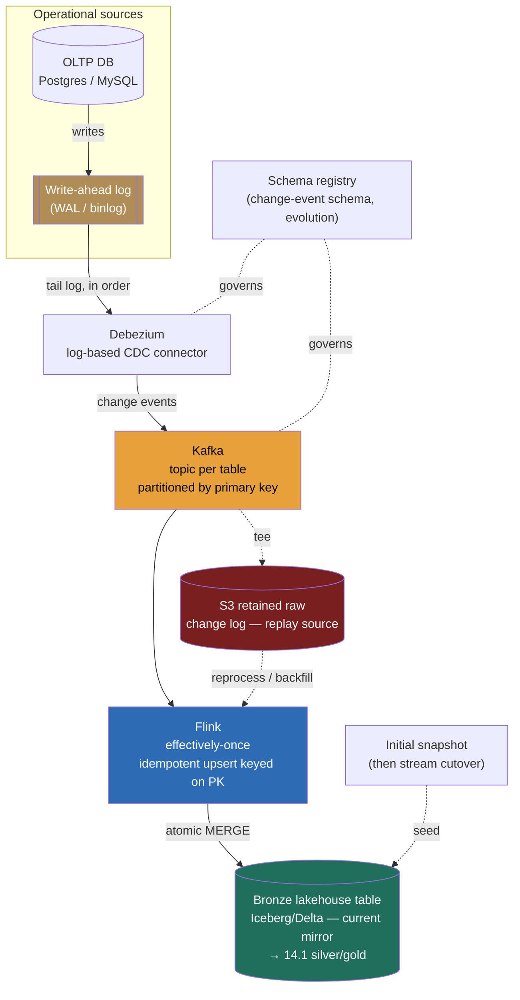

> **This is the unglamorous backbone question, "get our operational data into the lakehouse, continuously and correctly," and it is the one whose failure mode is silent.** A weak answer wires a nightly job that `SELECT *`s from the source database and calls it a pipeline. A Director-level answer opens by recognizing that this is a *correctness* problem wearing a *plumbing* costume: every number downstream, the finance dashboard, the ML feature, the executive metric, is only as trustworthy as the bytes this pipeline lands, and the two ways it corrupts them silently are **missed deletes** (a polling query never sees a row that was deleted) and **double-counting** (a retried event applied twice). The opening move is one question, *what freshness does the destination actually need, and where is exactly-once mandatory versus where is at-least-once-plus-dedup tolerable?*, because that single answer sets streaming-vs-micro-batch and decides how much exactly-once machinery you pay for. The signal is treating CDC, ordering, idempotency, and schema drift as load-bearing design decisions, not as a connector you switch on. This pipeline *lands* data into the bronze layer; everything downstream rests on this getting it right.

### Learning objectives
- Run the **RESHADED** spine on an **ingestion-pipeline** problem (E becomes events/sec, CDC lag, and exactly-once overhead sizing; A becomes the CDC-event contract and the idempotent-MERGE interface; D becomes the change-event envelope and the bronze landing table), and surface the load-bearing tension out loud: **the pipeline's job is correctness, not throughput, and the freshness requirement decides how much exactly-once machinery to buy.**
- Open with the **"freshness, and exactly-once where?"** clarifying question and show how the answer flips **streaming (Flink, seconds) versus micro-batch (minutes)** and the cost of the delivery guarantee.
- Justify **log-based CDC** (Debezium reading the WAL/binlog) over query-based polling, and explain why polling silently misses deletes and loads the source database, the cardinal correctness trap.
- Place **effectively-once** correctly: idempotent **upserts keyed on the primary key** + Kafka transactions/checkpoints (reusing the billing-batch machinery), so a replayed change applies once; reject at-least-once-without-dedup with reasons.
- Handle the two silent killers, **schema drift** (a schema registry + additive evolution into the evolvable table) and **backfill** (Debezium's initial-snapshot-then-stream cutover), so the bronze landing is idempotent and replayable (the rebuildability invariant).

### Intuition first
Picture keeping a **mirror copy of a busy ledger in another building.** The ledger clerk makes hundreds of entries an hour, new accounts, corrections, the occasional struck-out line. You have two ways to keep your copy current. The **naive way** is to walk over every hour and photograph the whole ledger (or the pages that *look* changed) and re-transcribe, query-based polling. It's simple, but it has a fatal flaw: when the clerk *strikes out* a line, your photograph of "the current pages" never shows you what was removed, you just stop seeing it, and you have no idea it was ever there, so your mirror keeps a line the real ledger deleted. And photographing the whole ledger every hour exhausts the clerk (loads the source database) and still misses everything that happened between photos.

The **right way** is to read the clerk's **carbon-copy log** of every single pen-stroke, the append-only record the clerk already writes for their own audit: "inserted row 4471," "updated row 88 city to Berlin," "**deleted** row 12." This is log-based CDC, reading the database's own write-ahead log (the WAL in Postgres, the binlog in MySQL), the same replication log every replica already consumes. You see *every* change in order, including deletes, you impose almost no extra load on the clerk (the log is written anyway), and you can replay it. The whole pipeline is: **read the log, ship the changes through a durable ordered pipe, apply them to your mirror exactly once.**

Two things make the mirror trustworthy rather than subtly wrong. First, **order per account**: if "set city = Berlin" and then "set city = Paris" arrive out of order, your mirror ends up wrong, so all changes to one row must stay ordered (you ship them through one ordered lane, keyed by the primary key). Second, **apply each change once**: if the pipe hiccups and re-delivers "deposit $100," you must not deposit twice, so you apply changes as **idempotent upserts keyed on the primary key**, replaying the same change is harmless. The mistake almost everyone makes is the photograph, treating ingestion as "copy the current state on a timer," which silently loses deletes and corrupts every downstream number. The art is reading the log, keeping per-row order, and applying once.

---

## R: Requirements

> Pin the sources, the freshness, and, the architecture-flipping question, **where exactly-once is mandatory.** The spine is standard; R does double duty by extracting the freshness-and-guarantee drivers that set streaming-vs-micro-batch and how much exactly-once machinery to pay for.

**The opening Director move, the question I ask first:** *"What freshness does the destination actually need, minutes or seconds, and where is exactly-once mandatory versus where is at-least-once-with-dedup tolerable?"* The answer flips the design:
- **Seconds-fresh, exactly-once mandatory** (the lakehouse mirror of operational tables that feed finance, billing, or ML features) → **streaming** (Flink), with **effectively-once** upserts keyed on the primary key, the full machinery, paid for deliberately.
- **Minutes-fresh, at-least-once-plus-dedup tolerable** (most analytical marts, where a dedup pass cleans duplicates downstream) → **micro-batch** (Spark Structured Streaming or scheduled batch), simpler and cheaper, dedup handled at read or compaction.

Most real platforms are **mixed**, and the honest answer is *per-source*: the orders and payments tables get seconds-fresh effectively-once; the marketing-events table is fine at minutes with dedup. I'll design the **harder, increasingly-standard case, seconds-fresh effectively-once streaming CDC**, and name explicitly where micro-batch is the right, cheaper call.

**Clarifying questions I'd ask (with assumed answers):**
- *Freshness, and exactly-once where?* → **Seconds-fresh, effectively-once for the operational mirror** (orders, users, payments); minutes-fresh with dedup acceptable for analytical-only sources. The central decision.
- *What sources?* → **OLTP databases** (Postgres, MySQL) via their replication log, plus **application event streams** already on Kafka. SaaS/file extracts are a separate, simpler batch path, not this pipeline.
- *Do deletes matter?* → **Yes, definitively.** GDPR erasure, order cancellations, and corrections must propagate; this alone rules out query-based polling.
- *Schema change frequency?* → Source schemas evolve continuously (columns added, occasionally renamed); the pipeline must **not break** when a column appears, and must surface drift, not silently drop it.
- *Initial load?* → Tables already hold **billions of historical rows**; the pipeline must do an **initial snapshot then cut over to streaming** without missing changes in between (the backfill problem).

**Functional requirements:**
1. **Capture** every change (insert/update/**delete**) from operational sources, in order per row, with low source impact.
2. **Transport** changes durably and replayably through an ordered pipe, decoupling capture from apply.
3. **Apply** changes into the **bronze lakehouse tables** as effectively-once upserts/deletes, so the lakehouse mirrors the source.
4. **Evolve** with source schema changes (added/dropped/renamed columns) without breaking consumers.
5. **Backfill / reprocess**: load history via an initial snapshot, and re-run any period from retained raw without double-applying.

**Explicitly CUT (scoping is the signal):** the source OLTP systems themselves; the lakehouse storage, table format, and downstream silver/gold transforms (the lakehouse lesson owns those, this pipeline *lands into* bronze); the SaaS/file extract path; the BI and ML consumers; and the real-time-OLAP serving path. I scope to **capture → transport → apply-into-bronze + evolve + backfill.**

**Non-functional requirements:**
- **Correctness over throughput, the headline NFR.** No missed deletes, no double-applied changes, no silent column drops; a wrong number is worse than a slow one.
- **Effectively-once apply** for the operational mirror, each change reflected once in bronze despite retries and replays.
- **Low CDC lag** (sub-second-to-seconds, streaming tier) and **low source impact** (capture must not load the production database, the polling trap).
- **Schema-drift tolerance** (additive changes flow automatically; breaking changes surfaced, not swallowed) and **replayability** (bronze rebuildable from retained raw, the rebuildability invariant).

**The skew, stated:** this is **write-driven, correctness-critical, ordering-and-idempotency-sensitive.** The hard parts are *delivering deletes, keeping per-key order, applying exactly once, and surviving schema drift*, not raw volume. That asymmetry, *correctness dominates throughput*, shapes every downstream choice, and is the opposite of the read-fan-out problems elsewhere in the course.

---

## E: Estimation

> Enough math to make a defensible call; here the load-bearing numbers are **change events/sec** (sizes the pipe), **CDC lag** (sets streaming-vs-micro-batch), **exactly-once overhead** (the price of correctness), and **snapshot+stream backfill time** (the cutover cost).

**Assumptions:** a fleet of OLTP databases generating **~50k change events/sec** sustained, peak ~3× → **~150k/sec**; each change event ~**500 bytes–1 KB** (the row's new image plus before-image and metadata, fatter than a raw click because it carries column values); the largest table to backfill holds **~5 billion rows**.

**Change throughput (sizes the pipe):** `50k/sec × ~750 B ≈ 38 MB/s` sustained, **~110 MB/s peak.** Per day: `50k × 86,400 ≈ 4.3B change events/day`. This is a partitioned-log problem, Kafka, not a "write to a database" problem; the same firehose shape as 9.7, but the payload is a change record, not a click.

**Partition count (ordering + parallelism):** sizing ~110 MB/s peak at ~10 MB/s per partition → **~16–32 partitions** for a high-volume table's topic, keyed on the source **primary key** so a row's changes stay ordered. Partition count also caps apply-side (Flink) parallelism, a sized decision, not "crank it up."

**CDC lag (the freshness number that sets the architecture):** for **log-based streaming**, Debezium reads the WAL within milliseconds of commit and Kafka adds single-digit ms, so **Flink's checkpoint interval is the dominant term**: at a **~10s checkpoint**, end-to-end **commit-to-bronze lag is ~seconds to ~10s** (the MERGE lands on checkpoint); tightening to ~1s cuts lag but raises overhead. **Query-based polling**'s lag is the poll interval (minutes) and it *still* misses intra-interval changes and all deletes, so the lag math alone favors log-based for the seconds tier.

**Exactly-once overhead (the price of correctness, the number to defend):** effectively-once costs **checkpoint frequency**, Flink commits the Kafka offset + the bronze write atomically, and a tighter interval (lower lag) means more checkpoints, each a coordination + state-snapshot cost. Rule of thumb: **~10–30% throughput overhead** versus at-least-once, with the checkpoint interval as the lag-vs-overhead dial. *The decision this forces:* pay it only where it earns out, ~20% to never double-count a payment is trivially worth it; an analytical-only source is fine on at-least-once + a dedup pass. **This is the per-source call the freshness question set up.**

**Snapshot + stream backfill (the cutover cost):** an initial snapshot of a **5B-row table** at ~200k rows/sec → `5B / 200k ≈ ~7 hours`, chunked to bring it down. Crucially, Debezium **streams WAL changes concurrently** during the snapshot and reconciles, so no changes are missed in the snapshot window (the cutover correctness property). *Trade-off:* a long snapshot loads the source, so run it against a **replica, not the primary**, chunked, accepting longer wall-clock for lower impact. *Rejected:* lock-the-table snapshot (blocks production) or stream-only (misses all history).

**Managed vs self-host crossover:** a managed connector (Fivetran, Airbyte) prices **per row**, which at 4.3B changes/day runs **five-to-six figures/month**; self-hosted Debezium + Kafka + Flink is a fixed infra + ops cost that **wins decisively at this volume** (developed in Design evolution).

**What estimation decided:** ~110 MB/s peak is a partitioned-log firehose (Kafka); seconds-CDC-lag needs log-based streaming, not polling; effectively-once costs ~10–30%, paid per-source; the 5B-row backfill is a ~hours snapshot-then-stream cutover against a replica; and at this volume self-hosting beats per-row pricing. The numbers point straight at the log-based-CDC → Kafka → Flink → idempotent-MERGE architecture below.

---

## S: Storage

> This pipeline mostly moves data rather than owning a final store, but it has three storage decisions with different durability and consistency needs: **the capture source** (where changes come from), **the transport log** (the ordered, replayable pipe), and **the landing table** (bronze, owned by 14.1). Plus the small but critical **apply-side state**.

**1. The capture source: the database's own replication log (WAL/binlog), via Debezium.**
- *Access pattern:* tail the write-ahead log from a committed offset (the LSN/GTID), in commit order, with near-zero extra load on the source.
- *Choice:* **log-based CDC with Debezium**, reading the Postgres WAL / MySQL binlog, the *same* log the database's replicas consume. It captures inserts, updates, **and deletes** with before- and after-images, in order, and tracks its position to resume after a restart.
- *Rejected, query-based polling* (`SELECT * WHERE updated_at >`): it **silently misses deletes** (a deleted row just stops appearing), **misses intra-poll changes**, and **loads the production database** with repeated scans, trading correctness for simplicity, fatal when deletes matter. *Rejected, trigger-based CDC:* captures everything but adds write-path latency to every production transaction; the log is free because it's written anyway.

**2. The transport log: Kafka, partitioned by primary key.**
- *Access pattern:* append change events at ~110k/sec peak, partitioned so a row's changes stay ordered, retained so both the apply and reprocessing can replay (the 9.13 substrate).
- *Choice:* **Kafka**, one topic per source table, **partitioned by the source primary key** so all changes to a row land on one partition in commit order (the per-key ordering contract). Retain ~7–30 days so a failed apply or a logic fix can replay, and tee to **object storage (S3)** as long-term retained raw, the replay source for full reprocessing (the 9.7 / 14.1-bronze property).
- *Rejected, push CDC straight into the lakehouse* with no log between: you lose decoupling (a slow apply backpressures capture and risks falling behind the WAL's retention, which truncates and *loses changes forever*) and replay. The log is the buffer that makes both effectively-once and reprocessing possible, as in 9.7.

**3. The landing table: bronze, an open table format (Iceberg/Delta), owned by 14.1.**
- *Choice:* changes land in **bronze Iceberg/Delta tables on object storage** via the table format's atomic, snapshot-isolated **MERGE** (the A-step). This is *why* 14.1 insisted on an open table format: raw Parquet can't apply updates/deletes safely; the table format's MERGE can.
- *Rejected, append-only bronze that never applies updates:* valid as the *raw change log* (we keep that in S3), but the *queryable* bronze mirror needs current state per row, which requires MERGE. We do both, append-only raw for replay, merged bronze for query.

**Apply-side dedup/order state** lives in the **Flink keyed state store** (RocksDB-backed), keyed by primary key, holding the last-applied version/offset per row so an out-of-order or replayed change is detected and dropped, the same keyed-state machinery as the dedup, applied to CDC.

---

## H: High-level design

> The shape to make visible: **source WAL → Debezium captures → Kafka transports (ordered per key) → Flink applies effectively-once → bronze lakehouse**, with a **schema registry** governing the change envelope and **retained raw** enabling replay.



**Happy path, compressed:** a transaction commits on the source, writing to the **WAL**; **Debezium** tails it (the same log a replica reads), turns each row change into a structured **change event** (op, before/after-image, source LSN, table, primary key), and produces it to **Kafka**, **partitioned by primary key** so a row's changes stay strictly ordered, with a **schema registry** governing the envelope so additive evolution doesn't break consumers. From Kafka, two consumers fan out (the 9.7 shape): **Flink** applies the changes to the **bronze** Iceberg/Delta table via an **atomic, snapshot-isolated MERGE** keyed on the primary key, effectively-once (idempotent upsert + transactional checkpoint), making bronze a current, query-ready mirror; and the raw change log is **tee'd to S3** retained, the replay source for reprocessing. From bronze, the silver/gold take over. For a new table, an **initial snapshot** seeds bronze while Debezium concurrently streams WAL changes and cuts over without a gap.

**The shape to notice:** two load-bearing walls. (1) **The log is the buffer**, Kafka decouples bursty WAL capture from the apply and retains changes, so nothing is lost if the apply lags (lose this and a stalled apply lets the source WAL truncate, losing changes *permanently*). (2) **Apply is effectively-once and idempotent**, the PK-keyed MERGE makes replaying a change harmless, which is what makes the pipeline correct under retries and reprocessing. This is a *continuously-refined, always-replayable projection* of operational truth (the medallion / the recompute property), not a one-shot copy.

---

## A: API design

> The "API" of an ingestion pipeline is three contracts: the **change-event envelope** (what Debezium emits, the correctness payload), the **idempotent apply** (the MERGE that lands it once), and the **schema-evolution contract** (how drift is handled). The envelope and the idempotency *are* the correctness story.

```json
// 1) Change-event envelope (what Debezium produces to Kafka) — the correctness payload
{
  "op": "u",                         // c=create, u=update, d=delete, r=snapshot read
  "before": { "id": 88, "city": "Lagos" },     // pre-image (null for inserts)
  "after":  { "id": 88, "city": "Berlin" },     // post-image (null for deletes)
  "source": {
    "table": "users",
    "lsn": 32985761,                 // source log position — the ordering + idempotency key
    "ts_ms": 1719072000123,          // source commit time (drives ordering, late handling)
    "txId": 55123
  },
  "key": { "id": 88 }                // primary key → Kafka partition key (per-row order)
}
```

```sql
-- 2) Idempotent apply into bronze (Flink → Iceberg/Delta MERGE) — effectively-once
MERGE INTO bronze.users t
USING changes s ON t.id = s.id
  WHEN MATCHED AND s.op = 'd'  THEN DELETE                     -- propagate deletes (polling can't)
  WHEN MATCHED AND s.source_lsn > t._source_lsn                -- apply only NEWER changes
                               THEN UPDATE SET t.* = s.after, t._source_lsn = s.source_lsn
  WHEN NOT MATCHED AND s.op != 'd' THEN INSERT *;              -- new row
-- replaying the same change is a no-op: s.source_lsn is not > the already-applied t._source_lsn
```

```
# 3) Schema-evolution contract (registry-mediated)
register_schema(table="users", schema=v2)   # additive: new nullable column 'country'
  -> 200 COMPATIBLE      # backward-compatible → flows automatically into the evolvable bronze table
  -> 409 BREAKING        # column drop/rename/type-narrow → surfaced for review, NOT silently applied
```

**Design notes (each with its rejected alternative):**
- **The change event carries `before`, `after`, `op`, and the source `lsn`/`ts_ms`**, the complete, ordered truth including deletes. *Rejected: emitting only the after-image* (the new row state), which can't express a delete and can't detect ordering, you'd be back to the polling trap.
- **The MERGE is keyed on the primary key and guarded by `source_lsn`**, applying a change only if it's *newer* than what's landed, so replays and out-of-order arrivals are idempotent no-ops, the effectively-once spine (the `eventId` dedup as a version guard on upsert; `lsn`/`ts_ms` plays the `event_time` role for ordering + watermarks). *Rejected: blind upsert without the lsn guard*, which lets a re-delivered older change clobber a newer one (lost-update corruption), or delete-then-insert on raw Parquet, which has no snapshot isolation and corrupts concurrent reads.
- **Deletes are first-class** (`WHEN MATCHED AND op='d' THEN DELETE`), the thing query-based polling structurally cannot do, and the reason log-based CDC is non-negotiable when deletes matter.
- **Schema evolution is registry-mediated and additive-by-default**, a new nullable column flows automatically into the table format's evolvable schema (the metadata-only `ALTER`); a drop/rename/type-narrow returns `BREAKING` and is **surfaced for review, never silently applied**. *Rejected: schema-on-read with no registry*, where a renamed column silently lands nulls and corrupts every downstream number with no alarm, the silent-drift killer.

---

## D: Data model

> Two consequential decisions: the **change-event envelope and partition key** (how changes flow, ordered and idempotent) and the **bronze landing shape** (how the mirror is stored and made replayable).

**Change event (the transport record), keyed by primary key, partitioned in Kafka by that key.** Carries `op` (c/u/d/r), `before`, `after`, and the **source `lsn` + `ts_ms`** (the ordering + idempotency basis). Retained raw in S3 for reprocessing.

**Partition key = the source primary key.** This is the single most consequential modeling decision, it puts all changes to one row on one Kafka partition in commit order, so the apply sees `set city=Berlin` then `set city=Paris` in the right sequence and the mirror ends correct. *Rejected: partition by table only / round-robin*, which scatters one row's changes across partitions, so two updates to the same row can be applied out of order, the silent corruption this whole design exists to prevent. *Hot-key caveat:* a single hot row (a counter, a celebrity account) overloads one partition (the hot-shard shape); for genuine hotspots, accept that per-row order *must* hold and instead scale the apply, or, if the row is a contended aggregate, push the aggregation downstream rather than sub-sharding the key (sub-sharding would break per-row order, the one thing we can't trade here).

**Bronze landing table (the queryable mirror).** An Iceberg/Delta table keyed on the primary key, holding **current state per row** plus a hidden `_source_lsn` column (the version guard) and ingestion metadata (`_ingested_at`, `_op`). Updates and deletes apply via MERGE; the table format gives ACID + snapshot isolation so analysts never see a half-applied batch (the table-format guarantee).

<details>
<summary>Go deeper — effectively-once mechanics and copy-on-write vs merge-on-read for CDC (IC depth, optional)</summary>

**Effectively-once on a CDC stream** is the same three-legged construction as 9.7, specialized to upserts:
- **Idempotent apply via PK + version guard:** the MERGE applies a change only if `source_lsn > _source_lsn` already stored. A replayed or duplicated change has an `lsn` not greater than what's landed, so it's a no-op. This makes the *output* idempotent regardless of how many times a change is delivered, the upsert analogue of the `eventId` dedup.
- **Transactional sink + checkpoint:** Flink checkpoints its keyed state and commits the Kafka consumer offset atomically with the bronze write (Kafka transactions + the table format's atomic commit). On failure it rewinds to the last checkpoint and replays; because the MERGE is idempotent *and* the commit is atomic with the offset, replay produces no duplicates and no loss, exactly the operational meaning of effectively-once from 9.7/9.13.
- **Watermarks for out-of-order changes:** within a partition Kafka preserves order, but across the snapshot/stream boundary and under reprocessing you can see out-of-order `ts_ms`; the `source_lsn` guard handles it structurally (older never overwrites newer), and watermarks bound how long to wait for stragglers before considering a window settled.

**Copy-on-write (CoW) vs merge-on-read (MoR)** for the bronze MERGE (the per-table trade, now driven by CDC frequency):
- **MoR** suits high-frequency CDC, each change writes a small delta/delete file and merges at read time, so writes stay cheap and lag stays low; reads pay a merge cost until compaction. This is usually right for a streaming CDC mirror.
- **CoW** rewrites affected data files on each change, fast reads, heavy writes, better for low-frequency, read-heavy tables.
- The choice is a **read-vs-write-cost trade per table**, and a credible Director names it and delegates the per-table tuning, with the prior: MoR + scheduled compaction for streaming CDC tables, because the small-files problem is otherwise guaranteed by frequent micro-merges.

**Snapshot-then-stream cutover (Debezium's mechanism):** on first connect to a table, Debezium takes a consistent **initial snapshot** (reading the table, often against a replica, in chunks) emitted as `op=r` ("read") events, *while concurrently* recording the WAL position at snapshot start and streaming subsequent changes. It reconciles so every row is represented exactly once, snapshot for the baseline, then WAL changes from the recorded position, with no gap and no double-apply (the `lsn` guard de-dups any overlap). This is why you don't lose the changes that happen *during* the hours-long snapshot.

</details>

---

## E: Evaluation

> Re-check against the NFRs and hunt the bottlenecks, naming each trade-off. On this problem the bottlenecks are almost all *correctness* failure modes, the silent ones.

**Re-check vs NFRs:** correctness, log-based capture (incl. deletes) + PK ordering + idempotent MERGE; effectively-once, idempotent upsert + transactional checkpoint; low CDC lag, streaming (seconds); low source impact, log-based not polling; drift-tolerance, registry + additive evolution; replayability, retained raw. Now the bottlenecks.

**Bottleneck 1, missed deletes (the cardinal silent-corruption risk).** An after-image-only or polling pipeline never propagates deletes, so the lakehouse keeps rows the source erased, every count and GDPR-erasure claim wrong, no alarm.
*Fix:* **log-based CDC** captures deletes as `op=d` events, and the **MERGE's `WHEN MATCHED AND op='d' THEN DELETE`** applies them. *Rejected:* polling, which structurally cannot see a deleted row. The single most important correctness property here, and the strongest reason to reject the "simple nightly SELECT."

**Bottleneck 2, double-apply / out-of-order changes (lost-update corruption).** A retried change applies twice, or two updates to one row arrive out of order, and the mirror lands on the wrong value.
*Fix:* **partition by primary key** (per-row order) + **idempotent MERGE guarded by `source_lsn`** (apply only newer; replays are no-ops) + **Flink's transactional checkpoint**. *Rejected:* blind upsert with no version guard, which lets an older re-delivered change clobber a newer value. This is the effectively-once as a version-guarded upsert. *Trade-off:* the ~10–30% exactly-once overhead, paid because a double-applied payment is a correctness incident, not a cosmetic one.

**Bottleneck 3, schema drift (the second silent killer).** The source adds, renames, or drops a column; a naive pipeline silently lands nulls, drops data, or crashes the consumer, corrupting downstream with no alarm.
*Fix:* a **schema registry** mediates the change-event schema, **additive changes** flow automatically into the table format's evolvable schema (the metadata-only `ALTER`), and **breaking changes** (drop/rename/type-narrow) are **surfaced for review, not silently applied**. *Trade-off:* the compatibility gate occasionally blocks a deploy pending review, cheap insurance against silent corruption. *Director note:* renames are the nastiest, they look additive (new column, old goes null) but mean a column moved; flagging them is the senior tell.

**Bottleneck 4, capture falls behind / the source log fills (the permanent-loss risk).** If the apply stalls and Debezium's read position lags past the WAL's finite retention, **those changes are lost forever** and the mirror silently diverges.
*Fix:* **the log is the buffer**, Kafka absorbs bursts so a lagging apply doesn't immediately threaten the WAL; monitor **WAL/replication-slot lag** as a first-class alert. *Rejected:* pushing CDC straight to the lakehouse with no buffer. *Trade-off:* a slot that never advances (a dead consumer) *itself* blocks WAL cleanup and can fill the source disk, so slot health is a two-sided alert, the failure mode Directors who've run CDC have scars from.

**Bottleneck 5, backfill correctness / the snapshot-stream gap.** Loading billions of historical rows while changes keep flowing risks missing or double-applying changes during the snapshot.
*Fix:* **Debezium's snapshot-then-stream cutover**, a chunked snapshot emits the baseline while the WAL position is recorded and changes stream from it; the **`lsn` guard de-dups** any overlap, so every row appears exactly once, no gap. *Trade-off:* the hours-long snapshot loads the source, so run it off-peak against a **replica**, chunked. *Rejected:* lock-and-copy (blocks production) or stream-only (no history).

**Closing re-check:** deletes propagate (log-based + MERGE-delete); double-apply and reordering are neutralized (PK partition + lsn-guarded idempotent MERGE + transactional checkpoint); schema drift is surfaced not swallowed (registry + additive evolution); permanent loss is guarded (Kafka buffer + slot-lag alerting); backfill is gap-free (snapshot-then-stream + lsn de-dup). The pipeline is correct first, and fast where it needs to be.

---

## D: Design evolution

> Push the dimensions and find what breaks; here the central evolution argument is **streaming-vs-micro-batch per source** and **self-host-vs-managed**, and how to grow without a big-bang bet.

**The headline trade-off, streaming (Flink) vs micro-batch, decided per source by freshness.** Streaming buys seconds-fresh effectively-once at the cost of operating Flink, checkpoint overhead, and more moving parts; micro-batch (Spark Structured Streaming on a ~minutes trigger over the same Kafka topics) is simpler and cheaper but minutes-fresh and typically at-least-once-plus-dedup. The honest Director position: **stream** the operational mirror (orders, payments, users, anything feeding finance/billing/ML features) where the guarantee is a requirement; **micro-batch** the analytical-only long tail where minutes is fine and a dedup/compaction pass cleans duplicates. **My prior:** stream the handful of correctness-critical tables, micro-batch the rest, and *don't* pay streaming's tax uniformly. Both share the same Debezium→Kafka front half, only the apply tier differs, so it's a per-topic apply choice, not two pipelines (the 2.9 argument referenced, not re-derived).

**The self-host-vs-managed trade.** A managed connector (Fivetran, Airbyte) is fastest to value but prices **per row**, five-to-six figures/month at 4.3B changes/day, and puts a vendor between you and your replication log; self-hosted Debezium + Kafka + Flink is a **fixed infra + ops cost** that wins decisively at this volume but demands the ops muscle (slot monitoring, registry discipline, Flink ops). *My prior:* **start managed** for low-volume sources and fast value, **self-host the high-volume, correctness-critical tables** where per-row pricing and the strategic dependency don't pencil, the same start-managed-migrate-to-open pattern 14.1 takes.

**At 10× (500k events/sec, ~43B changes/day):** Kafka and Flink scale horizontally (the design's point); the binding constraints become **(1) per-key hot rows** (a contended row can't be sub-sharded without breaking order, so the fix is pushing aggregation downstream, not re-keying), **(2) WAL/slot management at fleet scale** (hundreds of databases, each a slot that must stay healthy, operational not architectural), and **(3) schema-drift volume** (more tables, more drift, so the registry gate becomes a staffed process). Retained raw grows linearly (tier + compress).

**Hardest trade-offs to defend:**
- **Correctness machinery vs simplicity.** Log-based CDC + Kafka + Flink is genuinely more to operate than a nightly `SELECT`; defending *why it's mandatory* is the senior tell, because the failure mode is silent (missed deletes, double-counts) and the output is trusted numbers.
- **Per-row order vs hot-key spread.** Unlike 9.7 (sub-shard a hot campaign and sum on read), here per-row order is sacred, you *cannot* sub-shard a hot primary key without risking out-of-order apply. The fix is downstream aggregation or apply-side scaling, not re-keying, a subtle but important difference.
- **Schema-evolution automation vs review.** Auto-applying additive changes is convenient, but a rename masquerades as additive; the line between "flow automatically" and "surface for review" is a judgment call with real correctness stakes.

**Where I'd delegate (the explicit Director move):**
- **CDC connector + WAL ops:** *"Platform owns Debezium config, slot health, and WAL-retention sizing; my prior is log-based against a replica with slot-lag as a first-class SLO. I own the contract, every operational table captured log-based with deletes, not the tuning."*
- **Stream engine + exactly-once tuning:** *"Benchmark Flink's checkpoint interval against our lag-vs-overhead target; my prior is Flink for mature event-time + exactly-once, ~10s checkpoint, tightened only where sub-second is needed."*
- **Per-table CoW/MoR + compaction:** *"Platform owns it against each table's CDC frequency; my prior is MoR + scheduled compaction for streaming CDC tables."*
- **Schema-registry policy:** *"Owned as a process; my prior is additive auto-flows, drop/rename/type-narrow gated."* What I keep, **log-based capture with deletes, PK-ordered transport, effectively-once idempotent apply, and drift-surfaced-not-swallowed**, is the altitude.

**Handoff:** this pipeline *lands* operational data into **bronze**, which refines it through silver/gold; the **sub-second user-facing** read path is a separate real-time-OLAP store, not this batch/streaming mirror; the **CDC concept** itself is developed in 13.6, the **Flink exactly-once/watermark** mechanics in 13.4, and the **exactly-once + late-event + idempotent-reprocessing** machinery this reuses is 9.7.

---

### Trade-offs table: the pivotal decisions

| Decision | Option A | Option B | Option C | Use when… |
|---|---|---|---|---|
| **Capture method** | **Log-based CDC** (Debezium reads WAL/binlog) | **Query-based polling** (`SELECT WHERE updated_at >`) | **Trigger-based** (DB triggers → audit table) | **A** when deletes matter and source impact must be low, the real case (our choice). **B** only for append-only tables with no deletes and lax freshness. **C** when you can't access the log but can add triggers, accepting write-path load. |
| **Apply freshness** | **Streaming** (Flink, seconds, effectively-once) | **Micro-batch** (Spark, minutes, at-least-once + dedup) | Scheduled batch (hours) | **A** for the operational mirror feeding finance/billing/ML (our choice for those). **B** for analytical-only sources where minutes + dedup is fine. **C** for slow-moving dimension tables. |
| **Delivery guarantee** | **Effectively-once** (idempotent PK upsert + transactional checkpoint) | **At-least-once + downstream dedup** | At-most-once | **A** where a double-apply corrupts money/counts (our default for the mirror). **B** cheaper, where a dedup/compaction pass cleans duplicates. **C** essentially never for a mirror. |
| **Build vs buy** | **Self-host** Debezium + Kafka + Flink | **Managed** (Fivetran/Airbyte, per-row) | Hybrid (managed low-volume, self-host high) | **A** at high volume where per-row pricing doesn't pencil and you have ops muscle (our choice at scale). **B** for fast time-to-value, low volume, ops-light. **C** the pragmatic start, managed first, self-host the firehose. |

---

### What interviewers probe here (Director altitude)

- **"How do you get data from the source into the lake, and why not just poll?"**, *Strong:* **log-based CDC** (Debezium on the WAL), because polling **silently misses deletes** and **loads the source**; treats this as a correctness decision, not a connector choice. *Red flag:* a nightly `SELECT *` with no awareness that it loses deletes and corrupts downstream silently.
- **"A change gets delivered twice. What lands in the lake?"**, *Strong:* **effectively-once via idempotent MERGE keyed on PK and guarded by `source_lsn`** + transactional checkpoint, replays are no-ops, older never overwrites newer; cites the machinery. Quantifies the ~10–30% overhead and says where it's worth paying. *Red flag:* "exactly-once, Kafka handles it" with no idempotency or version guard, the lost-update trap.
- **"The source team renames a column. What happens to your pipeline?"**, *Strong:* a **schema registry** gates it, additive changes auto-flow into the evolvable table; a **rename is surfaced for review, not silently applied** (it looks additive but isn't), so downstream isn't silently corrupted. *Red flag:* schema-on-read that lands nulls with no alarm.
- **"You need to load 5 billion historical rows but the table is live. How?"**, *Strong:* **snapshot-then-stream cutover**, chunked snapshot against a replica while concurrently recording the WAL position and streaming changes, `lsn`-guarded so there's no gap and no double-apply; quantifies the ~hours snapshot. *Red flag:* lock-the-table copy, or stream-only that misses history.
- **"Streaming or micro-batch?"**, *Strong:* **per source, by freshness**, stream the correctness-critical operational mirror, micro-batch the analytical long tail; same Debezium→Kafka front half, only the apply differs. Doesn't pay streaming's tax uniformly. *Red flag:* one global answer with no freshness reasoning.

---

### Common mistakes

- **Query-based polling for a table with deletes.** It structurally cannot see a deleted row, so the lake keeps data the source erased, corrupting every count and breaking GDPR erasure, silently. Log-based CDC is the only correct capture when deletes matter.
- **At-least-once with no idempotency.** A re-delivered change applied twice, or an older change clobbering a newer one, is lost-update corruption. The apply must be an **idempotent PK upsert guarded by the source LSN**; "Kafka gives exactly-once" without a version guard is the trap.
- **Ignoring schema drift.** A renamed or dropped column silently lands nulls or drops data with no alarm. A **schema registry + additive-auto / breaking-surfaced** policy is non-negotiable; renames are the nastiest because they masquerade as additive.
- **No log buffer between capture and apply.** Pushing CDC straight to the lake means any apply slowdown lets the source WAL truncate unread changes, **permanent, silent loss**. Kafka is the buffer; replication-slot lag is a first-class alert (and a stuck slot can fill the source disk, a two-sided risk).
- **Stream-only or lock-and-copy backfill.** Stream-only misses all pre-existing history; lock-and-copy blocks production. Use **snapshot-then-stream cutover** with LSN de-dup so it's gap-free and non-blocking.

---

### Interviewer follow-up questions (with model answers)

**Q1. Walk me through how a single UPDATE on a production Postgres row ends up correctly reflected in the lakehouse.**
> *Model:* The UPDATE commits to the **WAL**; **Debezium** tails it (the same log a replica reads) and emits a change event, `op=u` with before/after-images, source `lsn`, and primary key, to **Kafka**, **partitioned by primary key** so this row's changes stay strictly ordered. **Flink** applies an **atomic MERGE** into the **bronze** Iceberg table keyed on the primary key, guarded by `source_lsn` (apply only if newer), committing the offset transactionally with the write (effectively-once). The bronze row now mirrors the source; the silver/gold take it from there, and a re-delivery is a no-op by the `lsn` guard. Seconds end-to-end, correct under retries because the apply is idempotent.

**Q2. Polling is so much simpler than running Debezium and Kafka. Justify the complexity.**
> *Model:* For an append-only table with no deletes and lax freshness, I'd *use* polling. The complexity earns out the moment **deletes matter** or **freshness is tight**: polling structurally cannot see a deleted row (it just stops appearing, so the lake silently keeps data the source erased, breaking counts and GDPR erasure), it misses intra-interval changes, and it loads the production database with repeated scans. Log-based CDC reads the WAL the database writes anyway, so it captures every change including deletes, in order, with near-zero source impact, and it's replayable. The complexity is the price of *correctness and low source impact*, preventing a silent failure: every downstream number quietly wrong. Below the bar (no deletes, minutes-fresh OK) I wouldn't pay it; for the operational mirror it's non-negotiable.

**Q3. A duplicate change arrives, and separately, two updates to the same row arrive out of order. Walk me through why the lake still ends correct.**
> *Model:* Two mechanisms. **Order**: Kafka is partitioned by **primary key**, so a row's changes land on one partition in commit order and Flink applies them in sequence, no cross-partition reordering. **Idempotency**: the MERGE applies a change only if its `source_lsn` is *newer* than what's landed, so a duplicate (same `lsn`) is a no-op and an out-of-order *older* change is rejected rather than clobbering the newer value, no lost update. The transactional checkpoint commits the offset atomically with the write, so crash-replay re-applies safely. This is the effectively-once as a version-guarded upsert: idempotent regardless of delivery count or order, ~10–30% overhead, worth it for a mirror that feeds money.

**Q4. The source adds a column one week and renames another the next. What does each do to your pipeline?**
> *Model:* Different outcomes by design. The **added (nullable) column** is backward-compatible, the schema registry marks it `COMPATIBLE` and it **flows automatically** into the table format's evolvable bronze schema (a metadata-only `ALTER`), existing rows read null for it, no break. The **rename** is the dangerous one: it *looks* additive (a new column appears, the old goes null) but it actually moved data, so the registry's compatibility check flags it `BREAKING` and it's **surfaced for human review, not silently applied**. That gate is exactly what prevents the silent corruption where a rename lands nulls and every downstream aggregation quietly drops the column's data. The discipline is: additive auto-flows, drop/rename/type-narrow gates, drift is never swallowed.

**Q5. What does this pipeline cost, and what would you delegate?**
> *Model:* The spend concentrates in the **Kafka + Flink tier** (~110 MB/s peak, ~16–32 partitions per high-volume topic, effectively-once adding ~10–30% overhead) and **retained raw** in S3. At 4.3B changes/day, **self-hosting beats per-row managed pricing** (five-to-six figures/month), so I self-host the firehose and keep managed connectors for low-volume sources. I own the **contracts**, log-based capture with deletes, PK-ordered transport, effectively-once idempotent apply, drift-surfaced-not-swallowed, slot-lag as an SLO, and delegate with priors: **connector + WAL ops**, **Flink checkpoint tuning** (~10s), **per-table CoW/MoR + compaction** (MoR for streaming CDC), and the **registry policy** (additive auto, breaking gated). I keep the architecture; I hand off the tuning with a prior.

---

### Key takeaways
- **This is a correctness problem in plumbing's clothing.** The pipeline's job is to land operational data into the **bronze** lakehouse reliably; done wrong it silently corrupts every downstream number. Open with **"what freshness, and where is exactly-once mandatory?"**, it sets streaming-vs-micro-batch and how much exactly-once machinery to buy.
- **Log-based CDC (Debezium on the WAL/binlog) beats query-based polling**, because polling **silently misses deletes** and **loads the source**; the WAL is the same replication log a replica already reads, so capture is complete (incl. deletes), ordered, and near-zero-impact. This is non-negotiable when deletes matter.
- **Effectively-once is the correctness spine:** **partition Kafka by primary key** (per-row order) + **idempotent MERGE guarded by `source_lsn`** (replays and out-of-order changes are no-ops) + **Flink transactional checkpoint** (the machinery). It costs ~10–30% overhead, paid where a double-apply corrupts money.
- **The two silent killers are schema drift and the snapshot-stream gap.** A **schema registry** with additive-auto / breaking-surfaced (renames masquerade as additive) stops drift corruption; **snapshot-then-stream cutover** with LSN de-dup makes backfilling billions of live rows gap-free. And the **Kafka buffer** prevents the WAL truncating unread changes, permanent loss, so slot-lag is a first-class SLO.
- **Decide streaming-vs-micro-batch per source** and **self-host-vs-managed by volume**, stream and self-host the correctness-critical firehose, micro-batch and managed the analytical long tail; the Debezium→Kafka front half is shared. Delegate connector ops, checkpoint tuning, CoW/MoR, and registry policy with stated priors; keep log-based-capture-with-deletes, PK-ordered transport, effectively-once apply, and drift-surfaced.

> **Spaced-repetition recap:** CDC ingestion = **get operational data into the bronze continuously and *correctly***. Ask **freshness + exactly-once-where** first (sets streaming vs micro-batch, per source). Pipe: **WAL → Debezium (log-based, not polling, 13.6/2.4) → Kafka (partitioned by PK for per-row order) → Flink → idempotent MERGE into bronze Iceberg/Delta**, raw tee'd to S3 for replay. **Effectively-once** = PK partition + **MERGE guarded by `source_lsn`** (replays/out-of-order = no-ops) + transactional checkpoint, ~10–30% overhead. Polling **misses deletes**; the **Kafka buffer** stops the WAL truncating unread changes (slot-lag is an SLO); the two silent killers are **schema drift** (registry: additive auto, rename/drop surfaced) and the **snapshot-stream gap** (snapshot-then-stream + LSN de-dup). Keep log-capture-with-deletes, PK order, effectively-once, drift-surfaced; delegate connector ops / checkpoint / CoW-MoR / registry with priors.

---

*End of Lesson 8.3. CDC ingestion & streaming ETL is the unglamorous backbone of the data platform: a log-based-capture → Kafka → Flink → idempotent-MERGE pipeline whose real job is correctness, not throughput, because its silent failures, missed deletes, double-applied changes, swallowed schema drift, corrupt every number the warehouse/lakehouse problem builds on top. The load-bearing decisions are log-based-over-polling, effectively-once-by-PK-upsert, and drift-surfaced-not-swallowed, reusing the exactly-once machinery and the Kafka over the replication log of 2.4. Next: the data platform's governance and lineage plane, knowing where every number came from.*
