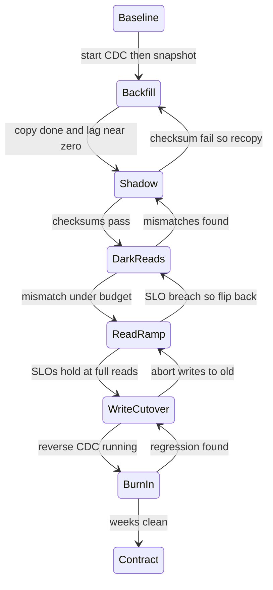

> **This question has no textbook answer and no hiding place.** It shows up as the *only* technical question in real Director loops, and as the standard follow-up inside every other problem ("your shortener outgrew Postgres, migrate it live"). A junior answer describes a copy job. A Director answer describes a **risk-management program**: two systems provably in sync while traffic runs, a cutover ladder with a rehearsed way back at every rung, abort criteria written *before* the migration starts, a dual-run budget with an owner and an end date. The plumbing is the easy 30%; verification, sequencing, and go/no-go discipline are the 70%.

### Learning objectives
- Frame any live migration, re-shard, engine swap, vendor exit, as one problem: **keep two systems provably in sync under traffic, then move trust one increment at a time.**
- Choose between **CDC + backfill** and **application dual-write**, defending the choice on ordering, failure-atomicity, and blast radius.
- Prove the data matches with **dark reads and partition checksums** against a quantified mismatch budget.
- Run the **expand → migrate → contract** ladder: reads ramp before writes flip, reverse replication keeps the old system warm, every phase has abort criteria and one go/no-go owner.
- Size the **risk window and dual-run cost**, two fleets plus a pipeline ≈ 2× infra spend; the cutover schedule is a budget line you own.

### Intuition first
You're moving a busy restaurant across the street, and it **never closes**. So you build the new kitchen fully (**expand**), then run *both* for weeks: every order cooked in the old kitchen and shadow-cooked in the new, a tester comparing the plates (**parallel-run with verification**). When the plates match for days, you serve a few tables from the new kitchen, then half, then all (**shift, incrementally**). The old kitchen stays staffed and warm, if the new stove fails on a Saturday night, you walk every table back in minutes (**rollback, rehearsed**). Only after weeks of flawless service do you sell the old building (**contract**). Paying two kitchens at once isn't waste, **it's the price of zero downtime, and deciding how long you pay it is the actual leadership decision.** The anti-pattern this kills: the big-bang weekend cutover, close, move, pray.

---

## R: Requirements

> Adaptation, said out loud: R scopes the **migration scenario and its invariants**, not product features. The functional requirements are the things you refuse to break.

**Anchor scenario (concrete numbers beat abstractions):** the TinyURL system outgrew its single Postgres, **10 TB, 5K writes/s, 100K reads/s**, and must move live to a sharded store (the partitioning choice is its own problem; here we migrate *to* it). The same spine covers an engine swap or vendor exit; only the translation layer changes.

**Clarifying questions I'd ask (with assumed answers):**
- *What's forcing the move, and by when?* → Write/storage headroom; **~6 months of runway**, which must include the parallel-run, not just the build.
- *What does "zero downtime" mean?* → No write outage beyond the SLO error budget; latency blips during cutover are negotiable, **data loss and silent corruption are not**.
- *Mutation rate?* → Mostly append, some updates (counters, expiry). Mutation rate decides how hard verification is.
- *Brief read-only window allowed?* → Assume **no**; if the business later grants 10 minutes, that's a bonus, never the plan.

**Functional requirements (the invariants):** (1) **no data loss**, every existing row and in-flight write lands in the new store exactly once; (2) **no correctness regression**, both stores return the same answers within a stated staleness bound; (3) **zero (budgeted) downtime**; (4) **reversibility**, until decommission, a tested path back.

**Explicitly CUT:** the new store's own design, feature work during the window (**freeze schema changes** on migrating tables, a moving target makes verification unprovable), org-wide replatforms (same playbook, per system).

**Non-functional:** verification is **quantitative**, a mismatch rate with a threshold, not vibes; the dual-run window is bounded and budgeted; rollback at each phase completes in **minutes**; a pipeline crash mid-flight corrupts neither side.

---

## E: Estimation

> Adaptation: E sizes the **risk window** (how long are we exposed?) and the **dual-run cost** (what does safety cost per week?), this problem's QPS-and-storage.

**Backfill, the floor of the risk window.** 10 TB at an effective **200 MB/s** (throttled, the source is serving 100K reads/s) is `10 TB ÷ 200 MB/s ≈ 14 hours`. Call it **a day**; plan two with retries.

**Change rate vs copy rate, the feasibility check.** 5K writes/s × ~1 KB ≈ **5 MB/s** of change traffic, 2.5% of backfill bandwidth, trivially absorbed by CDC; post-snapshot catch-up is minutes. Inverted ratio = backfill never converges, check it first.

**Verification volume.** Row-by-row over 10 TB at 50K compares/s ≈ 2.5 days/pass, too slow to iterate. So: **partition checksums** (thousands of comparisons) for coverage, plus **dark reads** for the hot path, sampling **1%** of 100K reads/s = 1K compares/s ≈ **86M/day** on exactly the rows users touch.

**Dual-run cost, the Director's number.** Old fleet ~$50K/mo + new fleet ~$50K/mo + pipeline and verification ~$10K/mo → **~$110K/mo, call it 2.2×** steady state. A 6-week parallel run is a **~$80K premium** plus 3-4 engineers. That's why "dual-run until we feel good" is not a plan: **the exit criteria define the end date, and the budget forces you to write them.**

**What estimation decided:** copying takes a day, so the calendar is **verification and trust-ramping**; the pipeline absorbs the change rate (feasible); verification = checksums + sampled dark reads; at ~$13K/week, every week of parallel-run must buy a named reduction in risk.

---

## S: Storage

> Adaptation: S characterizes the **delta between the guarantees** of source and target. The store *choice* was made by whatever forced the move; the work here is the gap analysis.

**The danger is never the data, it's what the application silently leans on.** Moving Postgres → a sharded/NoSQL target, audit for: **transactions** (multi-row atomic updates don't exist the same way, restructure the write or document the non-atomicity); **read-after-write** (free on single-primary Postgres, absent on an eventually-consistent target; unfound write-then-read paths surface in dark reads as "mismatches" that are really staleness); **auto-increment IDs** (they don't shard, the shortener already uses a sequencer; a system that doesn't needs that swap as a *prerequisite* migration); **sort order, collation, triggers**, each a behavior diff that surfaces at 2 a.m.

**One new piece of infrastructure: the CDC log.** The source's write-ahead log (Postgres WAL via logical decoding, MySQL binlog) exposed as an ordered change stream, typically **Debezium into Kafka**, partitioned by primary key so per-key ordering holds. Replication machinery, pointed *across* engines.

*Rejected, snapshot-and-diff without a change stream:* at 5K writes/s the diff never converges. The change stream is what makes "two systems, one truth" possible.

---

## H: High-level design

> Adaptation: the "architecture" is a **process with machinery**, the sync pipeline plus the phase ladder it enables. The diagram that matters is the ladder; every rung has a rollback arrow.

**The sync mechanism, the load-bearing decision.**

**Option A, CDC + backfill (my default).** Mark the log position, snapshot-copy the 10 TB, replay the captured stream until the target is seconds behind. The application **doesn't change until cutover**. *Pros:* source of truth untouched, zero new risk on the live write path; per-key ordering inherited from the log; failure-atomic, a pipeline crash resumes from its offset. *Cons:* real infrastructure to operate; lag to monitor; the apply path must be idempotent (the stream redelivers on recovery).

**Option B, application dual-write.** The app writes old-then-new on every request. *Pros:* conceptually simple, near-zero lag. *Cons, disqualifying as the primary mechanism:* **not atomic**, old succeeds, new fails, and the stores silently diverge with no record to repair from; concurrent writers can land in **different orders** on the two stores; and it still needs backfill *plus* a reconciliation job, CDC's hard parts anyway, with new failure modes injected into every production write path. *Where B is right:* no usable change log (a closed vendor API you're exiting), one write choke point, continuous reconciliation mandatory.

**Decision:** CDC + backfill; dual-write only where no log exists. *(Option C, managed tools like DMS or pglogical: Option A, operated by someone else.)*

**The phase ladder, expand → migrate → contract:**



**Reading the ladder:** every forward edge has a backward edge, and each backward edge is **cheap until write cutover**, flipping reads back is a config change measured in minutes. Reads ramp first (1% → 10% → 50% → 100%) because a bad read is detectable and recoverable; a lost write is forever. Writes flip last, in one switch at the data-access layer, **with reverse CDC (new → old) started at the same moment**, write-rollback stays possible through weeks of burn-in. Contract happens only when rollback has provably not been needed for weeks: **the only irreversible rung.**

<details>
<summary>Go deeper, CDC pipeline mechanics and the snapshot-consistency problem (IC depth, optional)</summary>

The classic race: rows changed *during* the snapshot are captured by both the copy and the change stream, in either order. The standard fix: record the log position (LSN/GTID) *before* the snapshot, replay from that position after, and make the apply path idempotent last-writer-wins, UPSERTs keyed on primary key, optionally guarded by a per-row version/timestamp so an older event never clobbers a newer row. Debezium's snapshot modes implement exactly this dance.

Apply-worker requirements: idempotent UPSERTs (the stream is at-least-once, not exactly-once), per-key ordering (partition the Kafka topic by primary key, never round-robin), schema translation in one place, and dead-letter queues for rows that fail translation rather than stalling the stream. Monitor lag end-to-end (source write timestamp vs target apply timestamp), not just consumer offsets.

Throughput sanity: 5K writes/s × 1 KB = 5 MB/s, one Kafka partition handles 10× that; the bottleneck is usually target write amplification, not the stream.

</details>

---

## A: API design

> Adaptation: the "API" is the **seam inside your own application**, the choke point all reads and writes pass through, carrying the migration switches. If it doesn't exist, building it is phase zero, often the longest phase.

```
interface LinkStore {
  put(link)            // routed by write-flag: OLD | NEW
  get(shortCode)       // routed by read-flag: 0-100% to NEW, per-tenant override
  delete(shortCode)
}

migrationControl:
  setReadPercent(pct, tenantFilter)   // ramp dial — changes in seconds, no deploy
  setWriteTarget(OLD | NEW)           // the one-way-ish door; flips with reverse CDC on
  darkReadMode(on)                    // read both, serve OLD, log diffs
```

**Design notes (each with the rejected alternative):**
- **Flags flip at runtime, not deploy time.** *Rejected: routing via deployment*, rollback becomes a 30-minute deploy during an incident; a flag flip is seconds.
- **One choke point, not N call sites.** *Rejected: `if (migrated)` sprinkled through the codebase*, you can't atomically flip a switch that lives in forty places. If services bypass the layer with raw SQL, **funneling them is the real first milestone**, scope it honestly.
- **Dark-read mode is part of the interface,** not a bolted-on script, comparison happens where reads happen, tenant and key on every logged mismatch.

---

## D: Data model

> Adaptation: D is the **translation map** between old and new shapes, plus the data the migration itself owns.

**The translation map.** Re-shard, same engine: near-identity, the work is the partition key and verifying no query relies on single-node features. Engine swap: an explicit per-table mapping, types, nullability, collation, denormalization for the target's access patterns. **Rule: do not redesign the schema mid-migration.** *Rejected: "while we're at it" remodeling*, differences might now be *intended*, and the diff signal drowns. Redesign is a second migration after this one is stable.

**Keys must survive the crossing.** The short code stays the primary key on both sides, dark reads compare by key, rollback needs no ID remapping. If the target forces a different key shape, maintain an explicit mapping table; never let the two sides hold different identities for the same row.

**Migration-owned data:** the CDC checkpoint (the recovery story), the **verification ledger** (per-partition checksums, dark-read mismatch log), and flag state with an audit trail. Tiny in bytes; it's the evidence the go/no-go decision reads.

---

## E: Evaluation

> Adaptation, said plainly: **here Evaluation isn't a final re-check, it's the product.** "How do you *know* the data matches while both systems run?" is the question actually being asked.

**Layer 1, completeness: partition checksums.** Carve the keyspace into ~10K ranges; compute a per-range digest on both sides (count + hash, bucketed by last-modified time so hot ranges re-check cheaply); compare continuously; a mismatched range → re-copy just that range. This audits **all 10 TB**, including cold data nobody reads. *Rejected: row counts alone*, counts match while contents diverge; a smoke alarm, not an audit.

**Layer 2, correctness under traffic: dark reads.** For a 1% sample of live reads, query both stores, **serve the old**, log diffs. This catches what checksums can't: hot-path translation bugs, CDC-lag staleness, the read-after-write gaps from S. At ~86M comparisons/day, a 0.01% defect rate is visible within minutes.

**Layer 3, the mismatch budget and abort criteria, written before phase one.** Numbers decided in advance, owned by one person: enter read-ramp only after a clean full-checksum pass and dark-read mismatch **< 0.01% sustained 7 days**, every mismatch class root-caused, an *understood* lag artifact can be waived; an *unexplained* mismatch stops the program by definition. Abort read-ramp on a 15-minute p99 SLO breach → flip back, diagnose, re-enter. Enter write cutover only after **2+ weeks at 100% reads**, reverse CDC tested end-to-end, and write-rollback **rehearsed in staging with a measured time-to-restore**. Pre-written matters because at 2 a.m. sunk-cost pressure says "push through", pre-committed thresholds plus a named owner are the only known defense.

**The residual hard window: the write flip itself.** In-flight writes straddle the switch. Fix: a **2-5 second write-pause drain** at the data-access layer, quiesce, let CDC lag hit zero, flip, resume; a latency blip well inside the error budget. *Rejected: dual-writing through the flip*, it reintroduces every ordering problem CDC was chosen to avoid, at the most dangerous moment.

**Pipeline failure:** CDC crash → resume from checkpoint; lag spikes and recovers. Lag is therefore a first-class dashboard with an alert tied to the rollback SLO: lag beyond what reverse replication can absorb takes cutover off the table that day.

<details>
<summary>Go deeper, checksum design for live, mutating data (IC depth, optional)</summary>

Naive table checksums never match on a live system, the sides are read at different instants. Three workable patterns: (1) **time-bucketed digests**, hash rows with `last_modified < T` for T safely older than max replication lag; recent buckets re-verify next pass; (2) **Merkle trees over key ranges** (the Cassandra/DynamoDB anti-entropy approach, cousin of read repair), log-depth drill-down to the exact divergent range; (3) **snapshot-pinned comparison** where both engines support point-in-time reads. In practice: (1) for bulk, (2) to localize failures, (3) where available. Use order-independent digests (sum of per-row hashes) to dodge cross-engine sort-order traps, and normalize types, timestamps, float precision, collation, *before* hashing, or you'll chase phantom mismatches for a week.

</details>

---

## D: Design evolution

> Adaptation: evolution is the **cutover sequencing itself**, trust moving in increments, plus the 10× variant and the ownership shape. This step and Evaluation *are* the question.

**The trust ramp as a timeline (anchor scenario):**
- **Weeks 0-2, expand:** stand up the target, build the seam, start CDC, backfill (~1 day), converge. Nothing user-visible; rollback = turn the pipeline off.
- **Weeks 2-4, prove:** checksums to clean, dark reads 1% → 10%, burn down mismatch classes. The calendar lives or dies here, *this* is what the $13K/week buys.
- **Weeks 4-5, shift reads:** ramp to 100%, internal tenants first, marquee customer last; each step holds for days against SLOs; rollback is a flag.
- **Week 6, shift writes:** drain-and-flip, reverse CDC on; the *old* store is now the replica.
- **Weeks 6-8, burn-in:** new store is system of record; the escape hatch stays warm.
- **Week 8+, contract:** stop reverse CDC, snapshot to S3 (~$230/mo for 10 TB; keep a quarter, the rollback of last resort), decommission, **delete the migration scaffolding**, a half-dead seam is how the *next* migration becomes unreasonable.

**At 10× (100 TB, 50K writes/s):** backfill is ~a week even at 1 GB/s, so **migrate shard-by-shard**, the ladder runs per shard, blast radius shrinks to 1/N, shard 1 teaches the org what shards 2-N reuse. Change-rate-vs-copy-rate now has teeth, and dual-run at ~$500K/mo of overlap makes the schedule a CFO conversation, precisely why a Director, not a tech lead, owns the end date.

**Ownership and staffing (the question behind the question):** one accountable go/no-go owner at every rung, me or a named delegate, never "the team"; 2-3 engineers on pipeline + seam; one on verification tooling (the under-staffed role on every failed migration); cutovers in low-traffic hours, both stores' owners on the bridge. **Delegation with priors:** *"Data-infra owns the Debezium/Kafka pipeline and benchmarks apply throughput against our change rate; my prior is one key-partitioned topic is ample at 5 MB/s. The DBA team owns the backfill throttle; my prior is 200 MB/s off a replica, not the primary. I keep the ladder, the abort criteria, the budget, the flip decisions."*

**The generic playbook, the reusable template.** Strip the scenario away and six phases govern *any* migration, vendor exit, regionalization, 10× replatform, monolith-to-services data split:

1. **Assess**, inventory data, dependencies, silent guarantees (S); run the feasibility math, copy rate vs change rate, dual-run cost, rollback SLO (E).
2. **Stabilize**, freeze schema churn; build the seam (A); verification tooling working *before* moving data.
3. **Parallel-run**, backfill + CDC, both systems live; checksums + dark reads burn mismatches below budget (H, Eval).
4. **Shift**, trust moves in increments: reads ramp, writes flip last, reverse-sync keeps the old side warm; every increment's abort path cheaper than continuing.
5. **Verify**, burn-in as system of record, the old system now the shadow; exit criteria written, one owner says "go."
6. **Decommission**, archive, kill reverse sync, delete scaffolding, retro. The only irreversible step, last, deliberately.

Vendor exit swaps the CDC source (no log → API-level dual-write + reconciliation, per H's exception); regionalization runs the ladder per region; re-shard per shard. **The phases never change; only the machinery inside phase 3 does**, and that invariance is your answer to "how would you migrate X?" for any X.

---

## Trade-offs table: the pivotal decisions

| Decision | Option A | Option B | Option C | Use when... |
|---|---|---|---|---|
| **Sync mechanism** | **CDC + backfill**, log-ordered, app untouched, resumable | **App dual-write**, simple, near-zero lag, but non-atomic + needs reconciliation anyway | **Managed tool** (DMS, pglogical) | **A** default (our choice). **B** only when no change log exists (vendor exit) and writes have one choke point. **C** when homogeneous and it fits. |
| **Cutover style** | **Incremental ramp**, reads by %, writes last, burn-in | **Big-bang window**, one flip, maintenance downtime | **Per-shard / per-tenant waves** | **A** default (our choice). **B** only with real granted downtime *and* a dataset verifiable offline, rare. **C** at 10× or multi-tenant scale, to shrink blast radius. |
| **Verification** | **Checksums + dark reads**, full coverage + hot-path truth, quantified budget | **Row counts + spot checks**, cheap, blind to content divergence | **Full row-by-row diff**, airtight, days per pass, stale on arrival | **A** default (our choice). **B** never sufficient alone. **C** for small/frozen datasets, or the one-time final audit before contract. |

---

## What interviewers probe here (Director altitude)

- **"How do you know the two systems match?"**, *Strong:* layered proof, checksums for all data, dark reads for live truth, a numeric budget with a sustained-clean window; unexplained mismatches block. *Red flag:* "compare row counts," "run both and watch for errors."
- **"Dual-write or CDC? Defend it."**, *Strong:* CDC, dual-write is non-atomic (partial failure = silent divergence, no record), unordered, and needs backfill + reconciliation anyway; names the vendor-exit exception. *Red flag:* dual-write "for simplicity" without naming divergence.
- **"Walk me through rollback after write cutover."**, *Strong:* reverse CDC from the flip keeps the old store current; rollback is a rehearsed flip-back with a measured time-to-restore; contract deferred because it's the only irreversible step. *Red flag:* "we wouldn't need to by then," or rollback = restore a stale backup.
- **"How long do you run both, and who decides?"**, *Strong:* quantifies the premium (~2.2×, ~$13K/week), ties the window to pre-written exit criteria, names one owner, treats schedule pressure as a risk input, never a verification override. *Red flag:* open-ended "until we're confident"; no cost awareness; decision diffused to "the team."
- **"What breaks this plan in practice?"**, *Strong:* schema churn, raw-SQL paths bypassing the seam, read-after-write gaps masquerading as mismatch noise, under-staffed verification, sunk-cost pressure at the thresholds. *Red flag:* only technical failures, the people and process failures are the common ones.

---

## Common mistakes

- **Big-bang cutover**, converting a reversible program into one bet. The ladder exists so no single moment carries the whole risk.
- **Dual-write as the primary sync**, non-atomic, unordered, silently divergent; you build CDC's hard parts anyway, after the divergence is in production.
- **Verification as an afterthought**, counts and vibes instead of checksums + dark reads against a numeric budget. If you can't *prove* match, you have a hope, not a migration.
- **No rehearsed rollback past write cutover**, without reverse replication, "rollback" means restoring a stale backup and losing writes. Rehearsed = run in staging with a stopwatch, not described in a doc.
- **Migrating a moving target**, schema churn and "while we're at it" remodeling make the diff signal meaningless. Freeze, migrate, then evolve.

---

## Interviewer follow-up questions (with model answers)

**Q1. Your TinyURL Postgres is at 80% capacity, 5K writes/s. Sketch the live migration to a sharded store.**
> *Model:* Six phases. **Assess:** backfill ≈ a day at a throttled 200 MB/s; the 5 MB/s change rate is trivial for CDC, the calendar is verification, not copying. **Stabilize:** freeze schema; funnel all access through one seam with runtime flags. **Parallel-run:** Debezium off the WAL into Kafka keyed by short code; mark the log position, snapshot, replay to convergence; verify with partition checksums plus 1% dark reads against a < 0.01% budget sustained a week. **Shift:** reads ramp 1→10→50→100% behind flags; writes flip last via a 2-5 s drain with reverse CDC started at the flip. **Verify:** 2+ weeks of burn-in, old store as warm replica, flip-back rehearsed. **Decommission:** archive to S3, kill reverse sync, delete scaffolding. Dual-run ≈ $13K/week, why the exit criteria are written before phase one and I own go/no-go.

**Q2. A teammate proposes dual-writing from the application "because it's simpler than a CDC pipeline." Your response?**
> *Model:* Three failure modes it buys. **Non-atomicity:** old write succeeds, new fails or the process dies between, silent divergence with no record to repair from; a log-based pipeline resumes from its checkpoint. **Ordering:** concurrent writers can land in opposite orders on the two stores; CDC inherits the source's per-key commit order. **It isn't simpler:** you still need backfill *plus* a reconciliation job to catch the divergence dual-write creates, CDC's hard parts, with new failure modes injected into every production write path. My prior: CDC + backfill whenever a change log exists; dual-write only on a log-less vendor exit, through one choke point, with continuous reconciliation mandatory.

**Q3. Mid-ramp at 50% reads, dark reads show 0.4% mismatches. The deadline is in two weeks. What do you do?**
> *Model:* 0.4% is 40× budget, so the pre-written criteria answer for me: **reads flip back**, a flag, minutes, invisible to users, and we diagnose. That's exactly why abort criteria predate sunk-cost pressure. Then bucket the mismatch ledger by pattern. CDC-lag staleness clustered on recently-written keys is an *understood* artifact, likely a read-after-write path missed in the guarantee audit; fix or route those reads old-side and re-enter quickly. *Unexplained* mismatches, scattered keys, content diffs, are potential corruption; nothing moves until root-caused. On the deadline: two more weeks of dual-run is ~$26K; silent corruption at 100% of reads is unbounded. That trade defends itself.

**Q4. When is the old system actually safe to turn off?**
> *Model:* Three gates. (1) The new store has been **sole system of record through real events**, a traffic peak, an on-call incident, for weeks, with zero rollback invocations. (2) A **final full checksum audit** passes immediately before severing reverse CDC, the last cheap moment to catch anything. (3) **No residual readers:** the old store's access logs show zero queries for a defined window, there's always a forgotten cron job, and logs find it before deletion does. Then "off" is staged: stop reverse CDC, snapshot to cold storage, decommission compute, delete the scaffolding. Decommission is the only irreversible rung, which is why it's last, and deliberately boring.

---

### Key takeaways
- Every live migration is one problem: **two systems provably in sync under traffic, then trust moved one increment at a time**, expand → migrate → contract, a rollback arrow at every rung, the irreversible step last.
- **CDC + backfill beats dual-write** as the default sync: log-ordered, failure-atomic, resumable, production write path untouched. Dual-write diverges silently on partial failure and still needs backfill + reconciliation, reserve it for log-less vendor exits.
- **Verification is the product:** partition checksums over all the data, dark reads on ~1% of traffic, a numeric budget (< 0.01% sustained), and *unexplained* mismatches block by definition.
- **Reads ramp first, writes flip last**, through one runtime-flagged seam, and reverse CDC at the write flip keeps rollback a rehearsed, minutes-long flag flip through burn-in.
- **The dual-run window is a budget line with an owner:** ~2.2× infra (~$13K/week here), exit criteria written before phase one, one named go/no-go decider, abort thresholds pre-committed against 2 a.m. sunk-cost pressure.

> **Spaced-repetition recap:** Zero-downtime migration = **assess → stabilize → parallel-run → shift → verify → decommission**, for any variant. Sync via **CDC + backfill** (dual-write only when no log exists); prove match with **checksums + dark reads against a numeric mismatch budget**; ramp **reads first, writes last** through one flag-controlled seam; **reverse CDC** keeps rollback alive through burn-in; dual-run ≈ **2× cost**, so exit criteria are pre-written and one person owns go/no-go.

---

*End of Lesson 8.3. Where a strongly-consistent core is protected with a queue, this lesson protects a* **transition** *with a ladder, replication, partitioning, and pub-sub machinery repurposed so two stores can be one system of record, briefly and provably, while trust moves. The playbook is the takeaway: six phases that survive any migration an interviewer can invent.*
