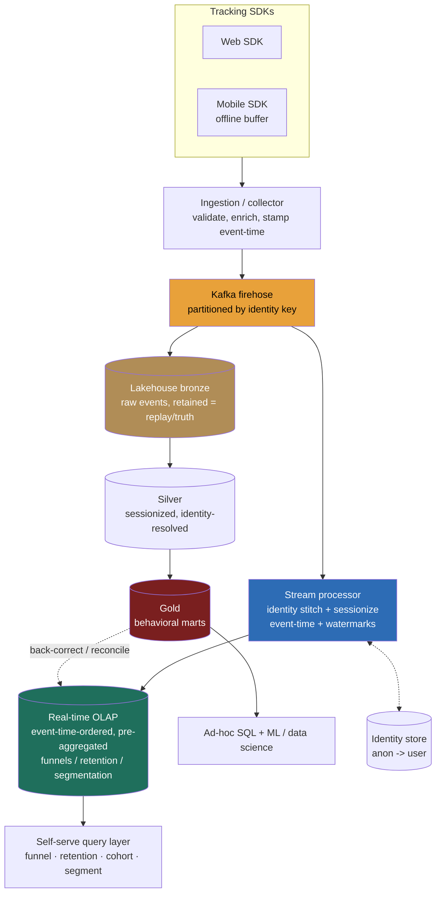

> **This is the track's synthesis question: "design a product-analytics platform like Amplitude or Mixpanel," and it is the one that rewards remembering that the pieces already exist.** A weak answer builds one event pipeline into one database and starts writing SQL for a funnel. A Director-level answer opens by separating the two question shapes the product conflates, *fast self-serve exploration* (a PM dragging events into a funnel and expecting an answer in under a second) from *deep ad-hoc and ML analysis* (a data scientist joining behavioral events against revenue and churn over years), and recognizes that **these are two stores, not one query engine flexed two ways.** The load-bearing insight is that this problem doesn't introduce new machinery; it *composes* the track's machinery: the ingestion firehose, the real-time OLAP serving store, the lakehouse as source of truth, and the event-time/speed-vs-truth discipline of the ad-click aggregator. The signal is recognizing that a single warehouse is too slow for sub-second self-serve and a precomputed-cube is too rigid to explore, so you run a **dual path** and reconcile it, and that the genuinely hard parts are sessionization, identity stitching, and high-cardinality funnel cost, not "ingest events into a table."

### Learning objectives
- Run the **RESHADED** spine on the track's **end-to-end synthesis** problem, and surface the load-bearing tension out loud: **interactive self-serve exploration (sub-second, bounded query shapes) and deep ad-hoc/ML analysis (flexible, years of history) are two stores**, a real-time OLAP path and a lakehouse path, reconciled from one ingestion firehose.
- Open with the **"interactive self-serve, or deep ad-hoc/ML, or both?"** clarifying question and show how the answer forces the dual-path architecture rather than a single store.
- Decide where **event-time + watermarks** is mandatory (funnels, retention, sessionization over late mobile events) versus where processing-time is tolerable, reusing the 9.7 machinery rather than re-deriving it.
- Treat **funnel scan-cost over high-cardinality user/event dimensions** as the headline budget line, and name the levers (pre-aggregation, the event-time-ordered columnar layout, the bounded query grammar) that keep self-serve from being a runaway bill.
- Justify **schema-flexible events behind a governed semantic layer** (flexible at the edge, contracted in the middle) and reject both rigid schema-on-write and ungoverned free-for-all, with reasons.

### Intuition first
Think of a product-analytics platform as a **detective agency with a live wiretap of everything every user does**, and the whole design problem is that the agency answers **two completely different kinds of question.** A junior detective at the front desk needs **fast, bounded answers all day**, "of the people who saw the signup screen last week, what fraction reached the paywall, by country?", expects it while standing there, and asks forty variations before lunch. A senior investigator in the back room runs a **deep, open-ended case**, "join three years of behavior against revenue and churn, train a propensity model, tell me what predicts a power user", and will wait an hour but needs *every* scrap of evidence and the freedom to ask anything.

You cannot serve both from one filing system. The front desk needs a **fast, pre-arranged index** tuned for the handful of shapes it asks constantly, that's a **real-time OLAP store**: events laid out columnar and time-ordered so a funnel over millions of users returns in under a second, but only for the bounded grammar of funnels, retention, and segmentation. The back room needs the **complete, immutable evidence vault**, every event ever, in open files any tool can read, that's the **lakehouse**: the source of truth, slower per query, but infinitely flexible and the only place a data scientist can join behavior against everything else. **One wiretap feeds both** (the firehose): the same stream lands in the fast index *and* the vault, and the vault is authoritative when they disagree.

The mistake almost everyone makes is forcing one store to be both: a single warehouse is too slow to feel interactive, and precomputed funnels are too rigid to explore. The art is running both deliberately from one stream, and getting the un-glamorous middle right, **stitching an anonymous visitor to the account they later create, cutting an event stream into sessions, and folding in the mobile event that arrives three hours late** (the event-time discipline from 9.7), because a funnel on mis-stitched, mis-sessionized, mis-ordered events is confidently wrong, which is worse than slow.

---

## R: Requirements

> Pin who queries, how fresh, how flexible, and, the architecture-flipping question, **interactive self-serve or deep ad-hoc/ML.** The spine is standard; R does double duty by extracting the dual-path drivers and naming the two question shapes that don't fit one store.

**The opening Director move, the question I ask first:** *"Is this for fast interactive self-serve exploration, a PM building funnels and retention charts and expecting sub-second answers over a bounded set of question shapes? Or for deep ad-hoc and ML analysis, a data scientist joining years of behavior against revenue with arbitrary SQL? Or both?"* The answer forces the architecture:
- **Interactive self-serve only** → a **real-time OLAP store**: events laid out for sub-second funnel/retention/segmentation queries over a *bounded grammar*. Fast, but it can't answer arbitrary joins or feed ML.
- **Deep ad-hoc / ML only** → a **lakehouse / warehouse**: every event in open columnar files, arbitrary SQL, ML reads the same copy. Flexible, but a cold scan over billions of events is seconds-to-minutes, not interactive.
- **Both** → a **dual path** from one ingestion firehose: the OLAP store serves the interactive product surface, the lakehouse is the source of truth and the ad-hoc/ML substrate, and the two reconcile.

I'll design for the **real, and standard, case: both**, because that *is* what Amplitude and Mixpanel are, an interactive product surface backed by a complete behavioral history, and this is the problem where the track's pieces compose. I'll name explicitly when the single-store call is right (an early-stage product with low volume and no ML can start on a warehouse alone, 14.1, and add the real-time path only when self-serve latency hurts).

**Clarifying questions I'd ask (with assumed answers):**
- *Interactive, ad-hoc/ML, or both?* → **Both.** Interactive funnels from real-time OLAP; deep analysis and ML from the lakehouse. The central decision.
- *Freshness bar?* → **Seconds-to-a-minute for the interactive surface** (a PM watching a launch wants near-live funnels); the lakehouse settles in **minutes-to-hourly** as the authoritative copy. Not sub-second-streaming-alerting, that's a separate path.
- *Query shapes for self-serve?* → **Funnels, retention/cohort curves, segmentation, and event-property breakdowns**, a *bounded grammar*, not arbitrary SQL. This is what makes the OLAP store tractable.
- *Identity?* → Events arrive **anonymous** (device/cookie) and later **logged-in** (user id); the same person must be stitched across both. Non-negotiable, a funnel that double-counts a person as two users is wrong.
- *How late can events arrive?* → Mobile clients offline for minutes-to-hours; design for **late events up to ~24h** (the 9.7 number), folded in correctly by event time.

**Functional requirements:**
1. **Ingest** behavioral events (`button_clicked`, `page_viewed`, with arbitrary properties) at high volume from web/mobile SDKs.
2. **Stitch identity**, merge anonymous activity into the account it later resolves to.
3. **Sessionize**, cut each user's event stream into sessions for session-scoped metrics.
4. **Serve interactive self-serve queries** (funnel, retention, cohort, segmentation) at sub-second-to-low-second latency.
5. **Serve deep ad-hoc / ML** over the complete, authoritative event history (arbitrary SQL, training reads).

**Explicitly CUT (scoping is the signal):** the SDK's client-side internals and offline-buffering library (acknowledged, delegated), the BI/charting UI itself, A/B-test assignment and the experimentation stats engine (a sibling product surface), the marketing-automation/reverse-ETL activation layer, and sub-second *alerting* on event streams (a separate streaming path). I scope to **ingest → resolve identity + sessionize → dual store (real-time OLAP + lakehouse) → self-serve query + ad-hoc/ML.**

**Non-functional requirements:**
- **Sub-second-to-low-second interactive latency** on the bounded funnel/retention/segmentation grammar, the self-serve product's whole reason to exist; this is what the real-time OLAP store buys.
- **Flexible, complete history** for ad-hoc and ML, every event, queryable by any engine, the lakehouse's job.
- **High write availability at ingest**, never drop a behavioral event; a dropped event is a hole in a funnel.
- **Schema-flexible events**, product teams add new events and properties without a schema-migration ticket, behind a governed semantic layer so the chaos stays queryable.
- **Correctness under late + out-of-order mobile events**, event-time attribution so a funnel step isn't mis-dated (the 9.7 discipline).
- **Bounded query cost at self-serve scale**, a funnel over billions of events by hundreds of PMs must prune and pre-aggregate, not full-scan; cost can't grow with curiosity.

**The skew, stated:** this is **write-heavy at ingest, read-heavy-but-bounded at the interactive surface, read-flexible-but-patient at the ad-hoc surface.** The hard parts are *the dual-path reconciliation, sessionization and identity stitching over late events, and funnel scan-cost over high-cardinality user/event dimensions*, not raw write throughput (the firehose is a solved 14.3 problem). That shapes every downstream choice.

---

## E: Estimation

> Enough math to make a defensible call; here the load-bearing numbers are **event volume** (the ingest firehose and the lakehouse storage bill) and **the scan-cost of a funnel** (the interactive-OLAP compute bill), the two halves of the dual path.

**Assumptions:** **~50M MAU** at **~40 events/day** → `≈ 2B events/day`, sustained `≈ 23k events/sec`, peak ~3× → **~70k events/sec** (a 200M-MAU product lands at ~200k/sec peak, ~20B/day). Each raw event ~**500 bytes** (event name, identity, timestamp, flexible property bag).

**Ingest throughput (the firehose, sized in 14.3):** `~70k/sec × 500 B ≈ 35 MB/s` sustained, ~100 MB/s peak, a partitioned-log problem (Kafka), exactly the 9.7 firehose / 14.3 ingestion shape; I delegate the mechanics there and carry the number.

**Event storage in the lakehouse (the source-of-truth bill):**
- `2B events/day × 500 B ≈ 1 TB/day raw` (the 200M case ~10 TB/day). Retain **~2 years** for retention/cohort analysis, you literally cannot compute a 12-month retention curve without 12+ months of history: `1 TB/day × 730 ≈ 730 TB` raw, columnar compression on a repetitive event stream ~5–10× → **~75–150 TB stored** with cold partitions tiered (the 14.1 lever), low-thousands/month, not the naive all-hot figure.
- **The decision this forces:** the lakehouse is the *cheap, complete* half, retain everything in open columnar files, the only place a 2-year retention curve or an ML training set can come from. *Rejected:* keep only the real-time OLAP store, which holds a *bounded recent window* for speed and can't answer "12-month retention" or feed a model.

**Funnel scan-cost (the interactive-OLAP compute bill, where the real design lives):**
- A funnel is *"of users who did A, how many later did B, then C, within 7 days?"*, naively a scan of every event for every user in the range, joined in sequence.
- *Naive on the lakehouse:* a 5-step funnel over 30 days touches `~60B events`. Even at columnar speeds that's a **multi-second-to-minute** scan, fine for the back room, **fatal for the front desk** where a PM expects sub-second and asks forty variants.
- *On the real-time OLAP store, event-time-ordered and columnar:* the same funnel scans only the cohort's relevant events, pruned by date partition and event-name dimension, and evaluates the ordered sequence near-single-pass over a far smaller set, **tens-to-hundreds of milliseconds**. Pre-aggregating the common funnels (daily per-step counts by key dimensions) drops the hot ones to a **lookup**.
- **What estimation decided:** the interactive surface *cannot* be the lakehouse (seconds-to-minutes); it needs the **real-time OLAP store** with event-time-ordered layout and pre-aggregation, while the lakehouse holds the complete cheap truth and serves patient ad-hoc/ML. **Two decoupled bills: lakehouse storage is the volume line (tier it); interactive funnel latency is the layout-and-pre-aggregation line (the OLAP store's job).** This is the dual path, justified by the numbers.

**Cardinality / cost at self-serve scale:** hundreds of PMs each running many funnels/day over high-cardinality dimensions (millions of users, thousands of event types, arbitrary property values). Unbounded, this is a runaway scan bill, which is why the self-serve grammar is **bounded** (funnel/retention/segmentation, not arbitrary SQL) and the hot shapes are **pre-aggregated**, the levers that make hundreds-of-curious-PMs affordable.

---

## S: Storage

> The heart of the synthesis: **one firehose feeds two stores with different contracts.** A real-time OLAP store for the bounded interactive grammar and a lakehouse as the complete, flexible source of truth, plus the durable log that feeds both and the state stores for sessionization and identity.

**1. The durable event log (ingest buffer + replay source), the spine that feeds both paths.**
- *Choice:* **Kafka** (partitioned, durable, replayable), the 14.3 ingestion substrate, tee'd to both consumers and partitioned by a **stable identity key** so one user's events land in order on one partition, which is what makes in-stream sessionization and ordered-funnel correctness possible.
- *Rejected, write events straight into the OLAP store or the lakehouse:* no single store absorbs a 200k/sec firehose *and* serves both query shapes; the log decouples bursty ingest from the two downstream contracts and is the enabler of replay/rebuild.

**2. Real-time OLAP store (the interactive self-serve surface), 14.2.**
- *Choice:* a **columnar real-time OLAP engine** (Druid / ClickHouse / Pinot, the 14.2 store), fed from the stream, events laid out **event-time-ordered and partitioned by day** with the common funnels **pre-aggregated**, serving sub-second funnel/retention/cohort/segmentation over the bounded grammar.
- *Rejected, serve the interactive surface from the lakehouse:* a cold scan over billions of events is seconds-to-minutes, not the sub-second the product promises; the lakehouse is flexible, not interactive. *Rejected, an OLTP row store:* high-cardinality per-step funnel group-bys are exactly what columnar OLAP does well and OLTP does badly.

**3. Lakehouse (the source of truth + ad-hoc/ML substrate), 14.1.**
- *Choice:* the **open lakehouse** of 14.1, every event in **bronze** (raw, retained, replay source) refined to **silver** (cleaned, sessionized, identity-resolved) and **gold** (behavioral marts: per-user event tables, daily funnel/retention aggregates) as Iceberg/Delta tables. Arbitrary SQL and ML read silver/gold directly; this is the **source of truth** that back-corrects the OLAP store.
- *Rejected, make the OLAP store the source of truth:* it holds a bounded window in a speed-tuned layout, not the complete open history, so you can't run a 2-year retention curve or feed a model from it, and it's not the place to reconcile.

**4. State stores for the un-glamorous middle.** An **identity store** (key-value/graph `anonymous id → resolved user id`, plus the union-find of merged identities) read on the hot path to stamp a stable identity, *rejected: batch-only resolution* double-counts an anonymous-then-logged-in user until the next run; and **sessionization keyed state** (RocksDB-backed Flink state, the 9.7 mechanism) holding each user's last-event-time to decide session boundaries by inactivity gap.

**The dual-path resolution:** one firehose, two stores with deliberately different contracts, the OLAP store for the *bounded, fast* interactive grammar and the lakehouse for the *flexible, complete* truth (authoritative; the OLAP store is a fast projection the batch back-corrects). This is the stream-vs-batch split generalized: *fast bounded projection for the product, complete flexible truth in the lake.*

---

## H: High-level design

> The shape to make visible: **SDK events → one ingestion firehose → resolve identity + sessionize → dual path (real-time OLAP for interactive, lakehouse for deep/truth) → query/serving**, with the lakehouse authoritative over the fast projection.



**Happy path, compressed:** a `button_clicked` event leaves the **SDK** (web, or mobile with an offline buffer) and hits the **ingestion collector**, which validates, enriches (geo/device), stamps **event time**, and appends to the **Kafka firehose**, partitioned by a stable identity key so one person's events stay ordered. From the log, **two consumers fan out**:
- **The interactive path:** a **stream processor** (Flink) resolves identity (anonymous → user, against the identity store) and sessionizes by inactivity gap, using **event time + watermarks** so late mobile events land in the right window, then writes the resolved, sessionized events into the **real-time OLAP store**, event-time-ordered, day-partitioned, hot funnels pre-aggregated. The **self-serve query layer** reads this for sub-second funnels, retention, cohorts, and segmentation.
- **The truth path:** the same events land in **lakehouse bronze** as retained raw. Scheduled transforms sessionize and identity-resolve into **silver**, then roll behavioral marts into **gold**. **Ad-hoc SQL and ML read silver/gold directly**, the complete, authoritative history. The batch **back-corrects** the OLAP store so the fast projection converges to truth when late events or re-stitched identities change the picture.

**The shape to notice:** the load-bearing walls are (1) **the dual path**, a fast bounded OLAP projection for the product and a complete flexible lakehouse truth, fed by one firehose; and (2) **the resolve-and-sessionize stage in the middle**, identity stitching and event-time sessionization that both paths depend on, computed once on the stream and re-derivable in batch. This is *the track's pieces composing*: the firehose, the serving store, the lakehouse, the event-time discipline, assembled, not reinvented.

---

## A: API design

> Three interfaces: the **event-tracking contract** (write, schema-flexible but governed), the **self-serve query API** (the bounded funnel/retention grammar, *not* arbitrary SQL), and the **identity-resolution call.** The bounded query grammar and the event-time field *are* the design.

```
# --- 1) Event tracking (write path; high-volume, schema-flexible, never drop) ---
POST /v1/track
  body: {
    eventName,          # "button_clicked"  -> governed against the semantic event catalog
    anonymousId,        # device/cookie id, present pre-login
    userId,             # present once logged in -> triggers identity stitch
    eventTime,          # CLIENT event timestamp (drives windowing + late handling)
    properties: { ... } # flexible bag: button_id, screen, plan, ...  (schema-on-read)
    sessionHint         # optional client session id; server re-derives authoritative sessions
  }
  -> 202 Accepted       # durably logged to the firehose; processed async

# --- 2) Identity resolution (stitch anonymous -> user) ---
POST /v1/identify  { anonymousId, userId }
  -> 202 Accepted       # merges the anonymous history into the resolved user (union-find)
```

```sql
-- 3) Self-serve query API: a BOUNDED grammar, not arbitrary SQL.
-- Funnel: of users who did step 1, how many reached each later step within a window?
FUNNEL
  STEPS [ "viewed_signup", "started_trial", "reached_paywall", "subscribed" ]
  WITHIN 7 DAYS
  WHERE country = 'US'
  BREAKDOWN BY properties.plan
  DATE_RANGE 2026-06-01 .. 2026-06-22;     -- partition + event-name prune; OLAP single-pass

-- Retention: of a cohort defined on day 0, what fraction return on day N?
RETENTION
  COHORT did "subscribed"
  RETURN did "opened_app"
  GRANULARITY day  HORIZON 30;
```

**Design notes (each with its rejected alternative):**
- **The self-serve API is a bounded grammar (`FUNNEL`/`RETENTION`/`SEGMENT`), not raw SQL.** Bounding the question shapes is what lets the OLAP store lay out data and pre-aggregate for sub-second answers. *Rejected: expose arbitrary SQL on the interactive surface*, you can't pre-optimize for arbitrary queries, and a careless join becomes a full-scan that blows the latency budget and the cost ceiling. Arbitrary SQL lives on the *lakehouse* (ad-hoc path), where patience is allowed.
- **`eventTime` is the client's event timestamp, not arrival time.** Funnels, retention, and sessionization key off *event* time so a late mobile event isn't mis-attributed to the wrong day or session. *Rejected: processing-time windows*, they misdate a 3-hour-late event and silently corrupt a funnel step, the exact 9.7 failure.
- **`/identify` stitches anonymous → user**, merging pre-login behavior into the resolved account so a funnel that starts anonymous (viewed signup) and ends logged-in (subscribed) counts *one* person, not two. *Rejected: treat anonymous and logged-in as separate users*, every signup funnel double-counts and under-reports conversion.
- **Events are schema-flexible (a property bag, schema-on-read) but `eventName` is governed** against a semantic catalog. *Rejected: strict schema-on-write*, every new event needs a migration and product teams route around the platform; *rejected: ungoverned free-for-all*, the event space rots into `btn_click`, `button_clicked`, `ButtonClick` and no funnel is trustworthy.
- **Tracking returns 202, not 200**, the event is durably logged, not yet processed/sessionized/resolved. Honest about the async pipeline.

---

## D: Data model

> Three consequential decisions: the **event model + semantic layer** (flexible at the edge, governed in the middle), **sessionization** (how a stream becomes sessions), and the **physical layout** that makes funnels fast (event-time-ordered, partitioned by day).

**Event model (schema-flexible, governed).**
- A raw event is `(eventName, identity, eventTime, properties{})`, the properties a flexible bag (schema-on-read) so teams add events without migrations. *Governance* lives in a **semantic event catalog**: an approved event/property dictionary the collector validates against (warn-or-block on unknown events), so the flexible space stays queryable. This is the **13.8 modeling discipline applied to events**, the catalog is the conformed layer that turns chaotic events into a coherent analytical model.

**Identity model (anonymous → user).**
- A `device/anonymous id → resolved user id` mapping, with merges handled as **union-find** (when `/identify` ties an anonymous id to a user, all that anonymous history joins the user's identity). The resolved identity is stamped on each event so every metric counts *people*, not devices. *The hard case, stated:* identities merge *retroactively* (a user logs in today, retro-claiming a week of anonymous events), so the lakehouse must be able to **re-resolve and back-correct** historical aggregates, which is exactly why retained raw (bronze) matters.

**Session model.**
- A **session** is a maximal run of a user's events with no inactivity gap longer than a threshold (e.g. 30 min). Sessionization assigns each event a `session_id` and derives session-scoped metrics (session length, events-per-session). *Rejected: trust the client's session id*, clients clock-skew, crash, and define sessions inconsistently; the server re-derives authoritative sessions from event-time ordering (the client hint is advisory).

**Physical layout (the funnel scan-cost lever, the most consequential modeling choice in the OLAP store):**
- **Partition by day** and lay events out **event-time-ordered per user/identity**, so a funnel (an ordered sequence per user within a window) evaluates in a near-single pass over a date-pruned, sequence-friendly set, and the **event-name dimension prunes** to just the steps' events. This is what turns a multi-second scan into tens of milliseconds.
- **Pre-aggregate the hot funnels and retention curves** (daily per-step counts by the few high-traffic breakdown dimensions) so the most-run charts are a lookup, not a scan, the 14.1 pre-aggregation lever applied to the funnel grammar. *Rejected: compute every funnel from raw every time*, fine for the rare ad-hoc shape (that's the lakehouse), fatal for the hot shapes hundreds of PMs run hourly.

<details>
<summary>Go deeper, sessionization and the retroactive-identity-merge problem (IC depth, optional)</summary>

- **In-stream sessionization (Flink session windows).** A session window groups a user's events and closes after a gap of inactivity (the *gap*, e.g. 30 min, is the parameter). Event-time + watermarks let a late event re-open or extend the correct session rather than spawn a spurious new one, within the allowed-lateness grace. This is why sessionization rides on the same event-time machinery as the funnels: a processing-time session would cut sessions at arrival boundaries, not behavioral ones.
- **The retroactive-merge correction.** When `/identify` merges an anonymous id into a user *after* events were already aggregated, the live OLAP counts are momentarily wrong (the anonymous and user activity were counted as two). The stream applies the merge going forward; the **batch re-resolves over retained bronze** and back-corrects the affected cohorts/funnels in the OLAP store, the same back-correction shape as the batch fixing the dashboard. The retained raw is what makes the retro-correction possible at all, aggregate-only could never re-stitch history.
- **In-stream vs batch sessionization, the trade.** *In-stream* gives the interactive surface fresh, sessionized events (a PM watching a launch sees sessions live) but pays keyed-state cost and is bounded by the watermark's lateness window. *Batch* sessionization over the lakehouse is the authoritative version: it sees *all* events (including very-late ones) and re-derives sessions exactly. So sessions, like counts, follow the speed-vs-truth split, fast-in-stream for the product, exact-in-batch for the truth, and the batch reconciles. A credible Director names this and delegates the gap-tuning.

</details>

---

## E: Evaluation

> Re-check against the NFRs and hunt the bottlenecks, naming each trade-off.

**Re-check vs NFRs:** sub-second interactive, the real-time OLAP store with event-time-ordered layout + pre-aggregation; flexible complete history, the lakehouse; never-drop ingest, the durable firehose; schema-flexible-but-governed, the property bag + semantic catalog; correct under late events, event-time + watermarks; bounded query cost, the bounded grammar + pre-aggregation. Now the bottlenecks.

**Bottleneck 1, funnel scan-cost over high-cardinality dimensions (the cardinal money/latency risk).**
A PM runs a 5-step funnel over 30 days broken down by a high-cardinality property; naively this scans tens of billions of events and misses the latency budget or spikes the bill.
*Fix:* serve it from the **real-time OLAP store** (not the lakehouse), where events are **event-time-ordered and date-partitioned** so the funnel evaluates near-single-pass on a pruned set, and **pre-aggregate the hot funnels** to a lookup. *Rejected: a bigger lakehouse cluster*, it makes the wrong-store query *faster and more expensive*, not interactive; the fix is the right store + layout + pre-aggregation, never "scan harder", the 14.1 scan-cost lesson applied to funnels.

**Bottleneck 2, late and out-of-order mobile events corrupting funnels (the offline-mobile problem).**
A phone offline for hours floods in events with old `eventTime`s after the window closed, mis-dating a funnel step or splitting a session.
*Fix:* **event-time + watermarks with a grace period** on the stream (moderately-late events land right), and definitively the **lakehouse batch sees them in retained raw and re-attributes correctly**, back-correcting the OLAP projection. *Trade-off:* event-time + allowed-lateness is more complex than processing-time, accepted because a mis-dated funnel step is a wrong business conclusion, not a cosmetic glitch. Reused wholesale from 9.7.

**Bottleneck 3, identity stitching, especially retroactive merges.**
A user is anonymous, then logs in and retro-claims a week of activity; until stitched, the funnel double-counts them as two people.
*Fix:* resolve identity **on the stream** for the live surface, and **re-resolve in batch over retained raw** to back-correct historical cohorts when a merge arrives late. *Rejected: batch-only*, the interactive surface double-counts until the next run; *rejected: stream-only*, it can't cleanly fix a merge that retro-claims already-aggregated history. Both paths, the dual-path payoff again.

**Bottleneck 4, the dual-path divergence (two stores, one truth).**
The fast OLAP projection and the lakehouse can disagree (late events, re-stitched identities), and a PM may see a funnel the data-science team's query contradicts.
*Fix:* declare the **lakehouse authoritative**, have the batch **back-correct** the OLAP store, and expose as-of metadata so the interactive number is honestly "live, converging to truth", the same display-vs-truth contract as the dashboard-vs-bill. *Trade-off:* two stores to operate and reconcile, accepted because no single store is both sub-second-interactive and complete-flexible.

**Bottleneck 5, schema chaos eroding trust (the governance failure).**
Hundreds of teams emitting free-form events produce `btn_click` / `button_clicked` / `ButtonClick`, and no funnel is trustworthy because nobody knows which event is "the" click.
*Fix:* the **semantic event catalog** as the governance chokepoint, validate at ingest, warn/block unknowns, curate a conformed event dictionary (the conformed layer). *Rejected: fully open tracking*, fast to adopt but the event space rots into untrustworthy analytics, the most common real-world product-analytics failure. *Trade-off:* governance adds friction to adding events, the price of a trustworthy funnel.

**Closing re-check:** funnel cost is controlled by the right store + layout + pre-aggregation; late events by event-time + watermarks + batch authority; identity by stream-resolve + batch-re-resolve; divergence by lakehouse-authoritative back-correction; schema chaos by the semantic catalog. The interactive surface is fast and bounded; the ad-hoc/ML surface is flexible and complete; both are fed by one firehose and reconciled.

---

## D: Design evolution

> Push the dimensions and find what breaks; here the central evolution argument is **dual path (real-time OLAP + lakehouse) vs a single store**, and how to grow into it without over-building on day one.

**The headline trade-off, dual path vs a single store (and why not just one warehouse, or just precomputed cubes).** Three shapes, honest Director position on each:
- **Single warehouse / lakehouse only.** Flexible, complete, one store, cheapest to operate, but a funnel over billions of events is seconds-to-minutes, **not interactive**. *Right when* volume is low and there's no interactive self-serve promise; an early product starts here and adds the fast path later.
- **Precomputed cubes only.** Blazing fast for the funnels you pre-built, but **rigid**, the moment a PM explores a funnel or breakdown you didn't precompute there's no answer; it can't satisfy the "ask forty variants" reality. *Right when* the question set is genuinely fixed (a static exec dashboard), wrong for exploration.
- **Dual path (real-time OLAP + lakehouse), my choice.** OLAP serves the bounded interactive surface at sub-second; the lakehouse is the complete, arbitrary-SQL, ML-feeding source of truth and reconciliation authority. **My prior:** for a real platform (interactive self-serve *and* deep analysis at tens-to-hundreds of millions of MAU), the dual path, but I'd *start* a smaller product on the lakehouse alone and stand up the OLAP path only when self-serve latency demonstrably hurts, an earned evolution, not a day-one bet.

**At 10× (200M+ MAU, ~20B events/day, ~200k/sec peak):** the firehose and stream tier scale horizontally on partitions (the 14.3 point); lakehouse storage grows linearly (~10 TB/day, leaning hard on **tiering**); the binding constraints become **funnel scan-cost discipline** (pre-aggregation moves from best-practice to enforced policy, the bounded grammar gets stricter) and **the OLAP store's high-cardinality memory/compute** (more pre-aggregation, tighter retention in the fast store while the lakehouse keeps the long tail). The hardest-scaling piece is **identity at scale**, a global union-find over hundreds of millions of users with retroactive merges, which I delegate the data structure for while owning the requirement that merges back-correct history.

**Hardest trade-offs to defend:**
- **Two stores vs one.** You take on dual-path operational cost and reconciliation to win *both* sub-second-interactive and complete-flexible; defending *why one store can't be both* (the funnel-latency-vs-flexibility numbers) is the senior tell.
- **Bounded query grammar vs arbitrary SQL on the fast path.** Bounding the interactive surface is what makes it fast and cheap; the cost is that genuinely novel questions must go to the slower lakehouse. Defending the bound (you *can't* pre-optimize arbitrary SQL) rather than apologizing for it is the level.
- **Schema flexibility vs governance.** Flexible events drive adoption; governance keeps funnels trustworthy. The conformed semantic catalog is the deliberate middle, and defending *why neither extreme works* is the judgment being tested.

**Where I'd delegate (the explicit Director move):**
- **OLAP engine bake-off:** *"Analytics benchmarks Druid vs ClickHouse vs Pinot on our funnel/retention/segmentation read shape at our cardinality; my prior is whichever the org already runs, the funnel-grammar layout and pre-aggregation matter more than the engine pick."*
- **Identity-resolution data structure:** *"Data platform owns the union-find/identity-graph implementation and its retroactive-merge correctness; I own the requirement, merges must back-correct historical aggregates over retained raw, and the prior that resolution runs both on-stream (live) and in-batch (authoritative)."*
- **Sessionization gap + stream-engine choice:** *"Flink for mature event-time + session windows (reused from 9.7); the inactivity-gap value and per-event-type session rules are a product-owned tuning, I own that sessions are event-time-derived server-side, not client-trusted."* What I keep, **the dual path, one-firehose-feeds-both, event-time correctness, identity-back-correction, and funnel-cost-by-layout-and-pre-aggregation**, is the altitude.

**Handoff:** this platform *composes* the track, ingestion is 14.3, the interactive store is 14.2, the source-of-truth lakehouse is 14.1, the event-time/speed-vs-truth discipline is 9.7, and the "top-K events / trending features" read shape over this same firehose is 9.8. The natural next surfaces are experimentation (A/B assignment + stats over these events) and activation/reverse-ETL, both deliberately cut here.

---

### Trade-offs table: the pivotal decisions

| Decision | Option A | Option B | Option C | Use when… |
|---|---|---|---|---|
| **Serving architecture** | **Dual path** (real-time OLAP + lakehouse) | **Single warehouse/lakehouse** | **Precomputed cubes only** | **A** for interactive self-serve *and* deep/ML at scale, the real case (our choice). **B** for early/low-volume, no interactive promise, start here. **C** only when the question set is genuinely fixed (static dashboard); can't explore. |
| **Time basis** | **Event-time + watermarks** | **Processing-time** | **Ingest-time** | **A** when late mobile events must be attributed correctly to the right funnel step/session, they must (our choice, reused from 9.7). **B** when late events are rare and approximate is fine. **C** a cheap middle for tolerant analytics. |
| **Self-serve query surface** | **Bounded grammar** (funnel/retention/segment) | **Arbitrary SQL on the fast store** | **Fixed precomputed reports** | **A** for fast, cheap, explorable self-serve (our choice); arbitrary SQL goes to the lakehouse. **B never** on the fast path, can't pre-optimize, blows latency+cost. **C** for static exec dashboards only. |
| **Event schema** | **Flexible + governed catalog** | **Strict schema-on-write** | **Ungoverned free-form** | **A** flexible at the edge, conformed in the middle, the trustworthy-and-adoptable middle (our choice). **B** kills adoption, teams route around. **C** kills trust, event space rots. |
| **Sessionization** | **In-stream (live) + batch (authoritative)** | **Batch-only** | **Client-provided** | **A** fresh sessions for the product, exact sessions in the lake (our choice). **B** no live sessions for the interactive surface. **C never** authoritative, clients clock-skew and crash. |

---

### What interviewers probe here (Director altitude)

- **"Interactive self-serve, deep ad-hoc/ML, or both, and how does that change the architecture?"**, *Strong:* asks it *first*, then designs a **dual path** (real-time OLAP for bounded interactive funnels, lakehouse for flexible complete truth), fed by one firehose and reconciled; names that one store can't be both (funnel latency vs flexibility). *Red flag:* builds one event pipeline into one database and never distinguishes the two question shapes.
- **"A PM's funnel takes 40 seconds. Fix it."**, *Strong:* it's running on the wrong store, serve it from the **real-time OLAP store** with **event-time-ordered, date-partitioned layout** and **pre-aggregate the hot funnels**; quantifies the scan reduction; never "bigger cluster." *Red flag:* reaches for more lakehouse compute or a generic cache without addressing store choice and layout.
- **"An anonymous user signs up halfway through a funnel. Do you count them as one person or two?"**, *Strong:* **one**, via identity stitching (anonymous→user), resolved on the stream for the live surface and **re-resolved in batch** to back-correct when the merge arrives retroactively; explains why aggregate-only can't fix history. *Red flag:* treats anonymous and logged-in as two users and silently halves conversion.
- **"A mobile event arrives 3 hours late. Where does it land on the funnel?"**, *Strong:* **event-time + watermarks** give the stream a grace window; definitively the **lakehouse batch sees it in retained raw and re-attributes it to the correct day/session**, back-correcting the OLAP projection (reuses 9.7). *Red flag:* processing-time windows that silently mis-date it.
- **"How do you keep tracking flexible without the analytics becoming garbage?"**, *Strong:* **schema-flexible events behind a governed semantic catalog**, flexible property bag at the edge, conformed event dictionary validated at ingest (the 13.8 conformed layer); names the `btn_click`/`button_clicked` rot as the failure both extremes cause. *Red flag:* picks fully-strict (kills adoption) or fully-open (kills trust) without the governed middle.

---

### Common mistakes

- **One store for both question shapes.** A single warehouse is too slow for sub-second self-serve; precomputed cubes are too rigid to explore. The design is a **dual path** (real-time OLAP + lakehouse) from one firehose, deliberately, the synthesis the problem is testing.
- **Ignoring identity stitching.** Treating anonymous and logged-in activity as separate users double-counts people and wrecks every signup funnel; resolve identity (stream + batch back-correction), and handle retroactive merges over retained raw.
- **Processing-time instead of event-time.** Late mobile events get mis-dated to the wrong funnel step or split a session; use **event-time + watermarks** with the lakehouse batch as the authority (reused from 9.7), don't re-invent it.
- **Unbounded self-serve / arbitrary SQL on the fast path.** You can't pre-optimize arbitrary queries; the interactive surface must be a **bounded grammar** (funnel/retention/segment) with the hot shapes pre-aggregated. Arbitrary SQL belongs on the patient lakehouse.
- **Flexible events with no governance.** Free-form tracking rots into inconsistent event names and untrustworthy funnels; a **governed semantic catalog** (conformed layer) is the non-negotiable middle between rigid and chaotic.

---

### Interviewer follow-up questions (with model answers)

**Q1. Walk me through a single `button_clicked` event from the SDK to a funnel a PM sees.**
> *Model:* The SDK stamps **event time** and POSTs to the collector, which validates the event name against the **semantic catalog**, enriches geo/device, and appends to the **Kafka firehose** partitioned by a stable identity key. Two consumers fan out. The **stream processor** resolves identity (anonymous→user against the identity store) and sessionizes using **event-time + watermarks**, then writes the resolved, sessionized event into the **real-time OLAP store**, event-time-ordered and date-partitioned. The same event lands in **lakehouse bronze** as retained raw, refined by batch into sessionized/identity-resolved silver and gold marts. When the PM runs a funnel, the **self-serve query layer** hits the OLAP store, which prunes by date partition and event-name and evaluates the ordered sequence near-single-pass in tens of milliseconds (or hits a pre-aggregate for a hot funnel). If late events or a retroactive identity merge change the picture, the lakehouse batch back-corrects the OLAP store, so the PM's number is "live, converging to truth."

**Q2. Why not just put everything in Snowflake/BigQuery and run funnels with SQL?**
> *Model:* At low volume with no interactive promise, I would, that's the 14.1 single-store call, and I'd add the fast path later. But this product *is* sub-second self-serve: a funnel over tens of billions of events in a warehouse is seconds-to-minutes, and a PM asks forty variants before lunch. That latency, repeated by hundreds of PMs, is both a bad product and a runaway scan bill. So I run a **dual path**: the **real-time OLAP store**, event-time-ordered with pre-aggregated hot funnels, serves the interactive surface at sub-second; the **lakehouse** is the complete, arbitrary-SQL, ML-feeding source of truth and the reconciliation authority. The warehouse/lakehouse is exactly right for the *ad-hoc and ML* half, it's just too slow to be the *interactive* half. One store can't be both; the numbers force two.

**Q3. Funnels and retention need correct event ordering, but mobile events arrive hours late and out of order. How do you stay correct?**
> *Model:* This is the 9.7 problem and I reuse it wholesale. Events carry **client event time**, and the stream uses **watermarks with a grace period** so moderately-late events still land in the right window and session. Definitively, the **lakehouse batch sees every event in retained raw, including the very-late ones, and re-attributes them to the correct day and session**, then back-corrects the OLAP projection, so the interactive number converges to truth. Sessions follow the same split: fast in-stream sessions for the live surface, exact batch-re-derived sessions in the lake. The retained raw is the enabler, without it I could never re-attribute a late event or re-derive a session after the fact.

**Q4. A user browses anonymously, signs up, and you want their pre-signup behavior in the conversion funnel. How?**
> *Model:* Identity stitching. Pre-login, events carry an `anonymousId`; on login the SDK calls `/identify(anonymousId, userId)`, and I **merge the anonymous history into the resolved user** (union-find in the identity store). The stream resolves identity going forward so the live funnel counts one person; the hard case is the **retroactive merge**, the user retro-claims a week of already-aggregated anonymous activity, so the **batch re-resolves over retained bronze and back-corrects** the affected cohorts and funnels in the OLAP store. The result: a signup funnel that starts anonymous (viewed signup) and ends logged-in (subscribed) counts a single person end-to-end, not two. Aggregate-only systems can't do this, they've thrown away the raw needed to re-stitch.

**Q5. What does this platform cost, where's the risk, and what would you delegate?**
> *Model:* Two decoupled bills. **Lakehouse storage** (~1–10 TB/day raw, ~75–150 TB retained after compression and tiering, low-thousands/month, the 14.1 tiering lever keeps it bounded) is the complete-truth cost. **Interactive funnel compute** is dominated by **scan layout, not cluster size**, controlled by the event-time-ordered OLAP layout and pre-aggregating hot funnels (the difference between a 40-second scan and tens of milliseconds). The cardinal risks are funnel scan-cost at self-serve scale (mitigated by the bounded grammar + pre-aggregation) and trust erosion from ungoverned events (mitigated by the semantic catalog). I delegate, with priors, the **OLAP engine bake-off** (whichever the org runs; layout matters more), the **identity-resolution data structure** (owning that merges back-correct history), and **sessionization gap-tuning + the stream engine** (Flink, reused from 9.7). What I keep is the architecture: dual path, one-firehose-feeds-both, event-time correctness, identity-back-correction, and funnel-cost-by-layout-and-pre-aggregation.

---

### Key takeaways
- **This is the track's synthesis problem, and it composes rather than invents:** the **ingestion firehose**, the **real-time OLAP store**, the **lakehouse source of truth**, and the **event-time/speed-vs-truth discipline** assemble into one platform. The opening Director move is asking **"interactive self-serve, deep ad-hoc/ML, or both?"**, it forces the dual path.
- **One store can't be both, so run a dual path from one firehose:** a **real-time OLAP store** for the *bounded* interactive grammar (sub-second funnels/retention/segmentation, event-time-ordered + pre-aggregated) and a **lakehouse** for the *flexible, complete* ad-hoc/ML truth, with the lakehouse authoritative and the batch back-correcting the fast projection.
- **Funnel scan-cost over high-cardinality dimensions is the headline bill, controlled by store choice + layout + pre-aggregation, never a bigger cluster.** Quantify it: the same funnel is 40 seconds on the lakehouse and tens of milliseconds on the event-time-ordered OLAP store; pre-aggregating hot funnels makes them a lookup.
- **The un-glamorous middle is the correctness story:** **identity stitching** (anonymous→user, with batch re-resolution to back-correct retroactive merges over retained raw) and **event-time sessionization** (server-derived, not client-trusted), both reusing the 9.7 late-event machinery. A funnel on mis-stitched, mis-sessionized, mis-ordered events is confidently wrong.
- **Schema-flexible events behind a governed semantic catalog** is the deliberate middle, flexible at the edge for adoption, conformed in the middle for trustworthy funnels, rejecting both rigid schema-on-write and ungoverned free-for-all. Delegate the engine, identity structure, and gap-tuning with stated priors; keep the dual path, event-time correctness, and scan-cost-by-layout.

> **Spaced-repetition recap:** Product/behavioral analytics (Amplitude/Mixpanel) = the **track's synthesis problem**, it *composes* 14.3 (firehose) + 14.2 (real-time OLAP) + 14.1 (lakehouse truth) + 9.7 (event-time/speed-vs-truth). Ask **"interactive self-serve, deep ad-hoc/ML, or both?"** first, it forces the **dual path**: a **real-time OLAP store** for the *bounded grammar* (sub-second funnel/retention/segment, event-time-ordered + pre-aggregated hot funnels) and a **lakehouse** for *flexible complete* ad-hoc/ML truth, one firehose feeding both, lakehouse authoritative and back-correcting the fast projection. Hard middle: **identity stitching** (anon→user, batch re-resolves retroactive merges over retained raw) and **event-time sessionization** (server-derived, watermarks, reused from 9.7). **Funnel scan-cost** is controlled by **store + layout + pre-aggregation**, not bigger clusters, 40s on the lake vs tens of ms on the OLAP store. Events **schema-flexible + governed catalog**. Self-serve is a **bounded grammar**, not arbitrary SQL (that goes to the lake). Delegate engine/identity-structure/gap with priors; keep the dual path, event-time correctness, identity-back-correction, scan-cost-by-layout.

---

*End of Lesson 8.4. The product-analytics platform is where the data-engineering track composes: one behavioral firehose feeding a fast real-time-OLAP projection for interactive self-serve and a complete lakehouse truth for ad-hoc and ML, reconciled, with identity stitching, event-time sessionization, and funnel scan-cost as the load-bearing decisions, not "ingest events into a table." It reuses the lakehouse, the serving store, the ingestion, and the event-time discipline wholesale. Next: the module's remaining synthesis and the cheat sheet that compresses the whole track into decision references.*
