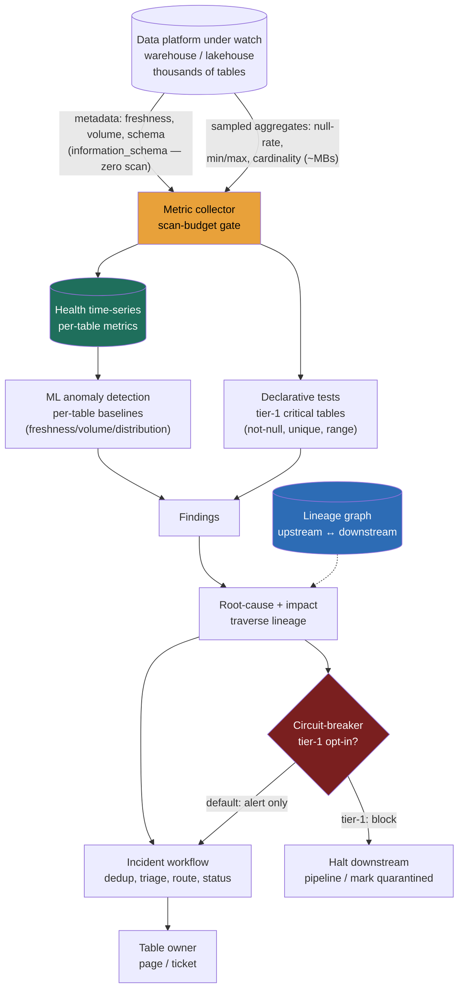

> **This is the meta problem: a data platform that monitors data platforms, and it gets asked because the failure it prevents is the one that silently costs the most.** A weak answer reaches for "we'll write tests on every table" and stops. A Director-level answer opens by separating the two ways to detect a problem, **declarative tests** (explicit, deterministic, high-precision, but you must know what to check and someone must maintain them) versus **ML anomaly detection** (auto-coverage of thousands of tables, catches the unknowns, at the cost of false positives and opacity), and recognizes the design must do **both**: ML auto-monitors the long tail broadly, explicit tests guard the handful of critical tables where a wrong number is a board-level event. From there the real engineering constraint appears, and it is the one nobody expects: **the monitoring itself must not cost more than the platform it watches.** You cannot scan a petabyte to check whether a petabyte is healthy. The whole design pivots on collecting health from **metadata and cheap metric queries**, not full scans, and on a **lineage graph** that turns "a table is wrong" into "*this upstream* broke and *these dashboards* are affected." This is the platform-design of the data-quality discipline taught as a concept in the data-quality lesson, and it reuses the time-series, anomaly, and alerting machinery of the metrics-platform problem, pointed at *data* instead of *infra metrics*.

### Learning objectives
- Run the **RESHADED** spine on an **observability-of-data** platform, and surface the two load-bearing tensions: **ML anomaly detection vs declarative tests** for the detection core, and **metadata/sampling-based checks vs full-data scans** for the collection layer (the cost constraint that defines the system).
- Open with the **"declarative tests or ML anomaly detection?"** clarifying question, and show why the answer is *both*, scoped by table criticality, not one or the other.
- Treat **the scan cost of monitoring** as the headline budget line: thousands of tables checked every interval, where a naive "run a profiling query on every table hourly" detonates the warehouse bill, and the lever is **metadata first, sampled metrics second, full scans almost never.**
- Reuse the **time-series anomaly detection, retention, and alerting** machinery on per-table health metrics, and add what's unique to data: a **lineage graph** for root-cause and impact analysis, and a **circuit-breaker** that can block bad data from propagating.
- Decide **circuit-break vs alert-and-continue** and **push (in-pipeline assertions) vs pull (external observer)** as explicit trade-offs, each with its rejected alternative and the cost of getting it wrong (a false positive that halts every downstream pipeline).

### Intuition first
A data-observability platform is a **hospital's patient-monitoring system for a ward of thousands of patients**, and the trap is thinking you can run a full body scan on every patient every hour.

You can't. A full scan (reading every row of every table to check it) is an MRI, accurate, total, and ruinously expensive at scale; do it hourly on thousands of tables and the monitoring machine costs more than the patients it watches. So a real ward does what this platform must do: it reads the **vitals that are already being taken** (the chart at the foot of the bed, the metadata the warehouse already records, when a table was last written, how many rows, what the schema is) and takes a **cheap finger-prick sample** (a lightweight aggregate query, a `min`/`max`/`null-rate` over the table) rather than drawing all the blood. Most monitoring is free, it reads metadata the platform already keeps; the rest is a sample, not an MRI.

Then there are **two ways to know a patient is sick.** A **declarative test** is a thermometer with a written rule: "fever above 38°C → alert." Precise, deterministic, trustworthy, but it only catches what you thought to measure, and a nurse must write and maintain every rule. **ML anomaly detection** is a seasoned attending who has watched ten thousand patients and *notices* when one looks wrong even when no single vital crosses a threshold, this patient's heart rate is normal for everyone else but abnormal *for them, at this hour.* It covers the whole ward automatically and catches the unknowns, but it cries wolf sometimes and can't always tell you *why* it's worried. A real hospital uses both: thermometers with hard rules on the ICU patients who'll die if you're wrong, the attending's pattern-sense across the whole ward to catch what the thermometers miss.

And the thing that makes it a *system* and not a pile of alarms is the **chart of who-depends-on-whom.** When a patient crashes, you don't ask "what's wrong with this bed" in isolation, you trace it: the bad reading came from a faulty upstream monitor (root cause), and three other displays at the nurses' station are now showing that patient's bad data (impact). That dependency map, the **lineage graph**, is what turns a thousand independent alarms into "*this* broke, and *these* are affected, page *this* owner." Hold the picture: cheap vitals from metadata, two detectors (rules + the attending), and a dependency chart that makes the whole thing diagnosable.

The mistake to avoid is the one that bankrupts the ward: thinking quality means "scan everything and test everything." It means *collect health cheaply, detect with the right mix of rules and ML, and use lineage to make it actionable*, and the art is in keeping the monitoring an order of magnitude cheaper than the thing it monitors.

---

## R: Requirements

> Pin what "health" means, which tables matter most, and the architecture-flipping question: **declarative tests or ML anomaly detection.** The spine is standard; R does double duty by extracting the detection-core decision and the cost constraint that defines the whole system.

**The opening Director move, the question I ask first:** *"Do you want **declarative tests**, explicit, deterministic checks an engineer authors and maintains, high-precision but only catching what we thought to check, or **ML anomaly detection** that auto-monitors thousands of tables and catches the unknowns, at the cost of false positives and opacity?"* The honest answer is **both, scoped by table criticality**, and saying so is the signal:
- **ML anomaly detection as the broad default** over *all* thousands of tables: freshness, volume, and distribution baselines learned per table, so the long tail gets coverage no human will ever write tests for. This catches the *unknown* failures.
- **Declarative tests as the guard on the critical few** (the ~50–200 tables feeding revenue, regulatory reports, ML training, exec dashboards): explicit assertions (`not null`, `unique`, `accepted_range`, referential integrity, custom SQL) where a wrong number is a board-level event and a false negative is unacceptable. These catch the *known* failures deterministically.

I'll design for **both detection modes on one collection layer**, and the load-bearing constraint I state up front: **the monitoring must cost an order of magnitude less than the platform it watches**, which forces metadata-and-sampling collection over full scans.

**Clarifying questions I'd ask (with assumed answers):**
- *Tests, ML, or both?* → **Both**, ML broad, tests on the critical few. The central decision.
- *How many tables, and how skewed is criticality?* → **~5,000 tables**, of which **~100–200 are tier-1** (revenue, regulatory, exec). The skew matters: spend the expensive checks where the blast radius is largest.
- *What does "health" mean?* → **The five pillars**: **freshness** (did it update on time?), **volume** (right number of rows?), **schema** (did columns change unexpectedly?), **distribution** (did the data's shape drift, null rates, ranges, category mix?), and **lineage** (what's upstream/downstream?).
- *Detection-latency bar?* → The headline win is turning the **week-long silent break** into **minutes-to-an-hour**, freshness/volume anomalies detected within one or two check intervals.
- *Circuit-break or alert-only?* → **Alert-only by default**, **circuit-break only on tier-1 tables with explicit opt-in**, because halting pipelines on a false positive is its own outage. A deliberate, scoped call.

**Functional requirements:**
1. **Collect** per-table health metrics (the five pillars) from **metadata and cheap metric queries**, across thousands of tables, cheaply.
2. **Detect** anomalies two ways: **ML baselines** broadly (freshness/volume/distribution) and **declarative tests** on critical tables.
3. **Root-cause and impact** via a **lineage graph**: "which upstream broke?" and "which dashboards/models are affected?"
4. **Run an incident workflow**: alert, dedup, triage, route to the table's owner, track status to resolution.
5. **Circuit-break** (optionally, scoped) to block bad data from propagating downstream.

**Explicitly CUT (scoping *is* the signal):** the warehouse/lakehouse itself (the warehouse/lakehouse problem, this monitors it, doesn't replace it), the lineage *capture* mechanics (the governance-and-mesh lesson owns extracting lineage from query logs; I *consume* the graph), the BI tool, data *cataloging/discovery* as a product, and remediation/auto-fix (we detect and route, humans fix). I scope to **collect → detect → diagnose (lineage) → incident → circuit-break.**

**Non-functional requirements:**
- **Monitoring cost ≪ platform cost**, the defining NFR; checks run on metadata and samples, never full scans, so observing the platform is a small fraction of running it.
- **Low detection latency**, freshness/volume anomalies surfaced within one or two check intervals (minutes), not the days a silent break currently hides for.
- **Low false-positive rate**, alert fatigue is the failure mode that kills the platform (a muted data-quality alert is worse than none); precision is an explicit budget.
- **Scale to thousands of tables**, collection and detection horizontal in table count.
- **Heterogeneous-source lineage**, the graph must span warehouse, lake, and transform engines (dbt, Spark, Airflow), which is the hard part of lineage.

**The skew, stated:** this is **metadata-read-heavy, scan-cost-constrained, precision-sensitive.** The hard parts are *keeping monitoring cheap (metadata not scans), keeping false positives low (alert fatigue), and capturing lineage across heterogeneous engines*, not write throughput or query latency. The volume is *thousands of tables × a handful of checks per interval*, modest in QPS, brutal in scan cost if done naively. That shapes every downstream choice.

---

## E: Estimation

> Enough math to make a defensible call; here the load-bearing number is **the scan cost of monitoring itself**, the constraint that forces metadata-and-sampling over full scans, plus the **check rate** and the **detection-latency** the design must deliver.

**Assumptions:** **~5,000 tables** monitored; **~100–200 tier-1** with explicit tests; the five pillars checked per table; default check interval **hourly** for most, **every 15 min** for tier-1; tables average ~100M rows / ~50 GB, the big ones are multi-TB.

**Check rate (the operational load, modest):**
- 5,000 tables × ~5 pillar checks ÷ 3,600 s (hourly) ≈ **~7 checks/sec** steady-state, bursting at the top of each hour. Plus tier-1 at 4×/hour. This is **low QPS**, the system is not request-bound. The cost is not *how many* checks but *what each check scans*.

**The scan cost of monitoring (the headline constraint, where the design lives):**
- **Naive, the trap:** profile every table fully each interval, scan all rows to compute null rates, distributions, row counts. At 5,000 tables × ~50 GB avg = **~250 TB scanned per interval**; hourly = **6 PB/day**. At ~\$5/TB that's **~\$30k/day ≈ \$900k/month**, *just to check the data is healthy.* The monitoring would cost **more than the warehouse it monitors.** Unacceptable, and the entire reason the naive design fails.
- **Metadata-first (free):** freshness (last-modified time), volume (row count), and schema come straight from the warehouse's **`information_schema` / system tables / table metadata**, which the platform already maintains. **Zero scan.** This covers three of the five pillars for *all* 5,000 tables at **~\$0.**
- **Sampled metrics (cheap):** distribution checks (null rate, min/max, cardinality, category mix) run as **lightweight aggregate queries** (`SELECT count(*), count(col), approx_distinct(col) ... `) that the engine answers from **column statistics or a sampled subset** (`TABLESAMPLE`), scanning **~MBs, not the whole table.** Say ~100 MB effective scan per distribution check × 5,000 × hourly ≈ **~12 TB/day ≈ \$60/day ≈ \$1,800/month**, a **~500× cut** from naive. *Trade-off named:* a sample can miss a defect concentrated in unsampled rows, accepted for the broad tier, and tier-1 tables get exact checks where it matters.
- **What estimation decided:** **monitoring cost is dominated by bytes scanned, and the lever is metadata-first + sampling, not bigger compute.** Three pillars are free (metadata); distribution is cheap (sampled); full scans are reserved for the rare tier-1 exact assertion. This is the number a Director defends, and it points straight at the collection layer below.

**Detection latency (the value proposition, quantified):**
- The failure this prevents: a pipeline silently breaks, a dashboard shows a wrong number, and **nobody notices for a week** until finance reconciles. 
- With hourly metadata-based freshness checks, a table that *should* update hourly and doesn't is flagged within **~1–2 intervals (1–2 hours)**; tier-1 at 15-min intervals catches it in **~30 min.** The week becomes **minutes-to-an-hour**, a **100–300× reduction in detection lag**, the headline win.

**False-positive / alert-fatigue budget (the precision constraint):**
- 5,000 tables × 5 checks × 24/day ≈ **~600k checks/day.** Even a **1% false-positive rate is 6,000 false alerts/day**, instant alert fatigue, the platform gets muted and dies. The design target is **< 0.1% effective alert rate after dedup and grouping**, achieved by lineage-based grouping (one root cause = one incident, not 50), seasonality-aware baselines, and tiered severity. **Precision is a first-class budget**, not an afterthought.

**Storage (the health time-series, reusing 9.12):** per-table pillar metrics are a **time series** (row count, freshness lag, null rate per column, over time). 5,000 tables × ~20 tracked metrics × hourly × 13 months ≈ a few billion points, **single-digit TB compressed** in a TSDB, trivial next to the platform it watches. Downsampling/retention tiers apply exactly as in 9.12.

---

## S: Storage

> Three data classes with different access patterns; pick stores by what each is read for. The health metrics reuse the TSDB; the lineage graph is the new, load-bearing store.

**1. Health metrics time-series (write-moderate, append-only, range-scanned).**
- *Access pattern:* per-table pillar metrics written every interval; read as ranges (`this table's row-count over the last 30 days`) to fit baselines and detect anomalies. This is **exactly the time-series shape of the metrics-platform problem**, just with *tables* as the entity instead of *hosts*, and ~100k series instead of 10M.
- *Choice:* a **TSDB** (Prometheus/Mimir, VictoriaMetrics, or a columnar store), reusing the compression, downsampling, and retention-tier machinery. The series key is `(table, metric)`.
- *Rejected, a relational row-per-measurement table:* no delta-of-delta compression and clumsy range scans; the TSDB is purpose-built for this and we already operate one. *Rejected, recompute baselines from raw warehouse each time:* defeats the cost constraint, the whole point is to *not* re-scan the data.

**2. Lineage graph (the diagnosis store, the new piece).**
- *Access pattern:* given a broken table, traverse **upstream** ("what feeds this?", for root cause) and **downstream** ("what consumes this?", for impact); both are multi-hop graph traversals over thousands of nodes (tables, columns, dashboards, models, jobs) and their edges (derivation, dependency).
- *Choice:* a **graph store** (a property graph like Neo4j, or an adjacency model in Postgres/a wide-column store for moderate scale) holding the lineage DAG, populated by the lineage-capture system. Traversal queries answer root-cause and impact directly.
- *Rejected, recomputing lineage on demand by parsing query logs at incident time:* far too slow when on-call needs the impact set *now*; lineage is captured continuously and stored as a queryable graph. *Rejected, flat foreign-key tables for a deep DAG:* multi-hop impact analysis becomes a pile of self-joins; a graph store is the right model for transitive reachability.

**3. Checks, incidents, and SLO/quality state (small, strongly-consistent).**
- *Access pattern:* test definitions, table criticality tiers, anomaly thresholds, and **open incidents** (status, owner, severity), small, slow-changing, but must be correct and durable (a lost incident is an unrouted failure).
- *Choice:* a **relational store** (Postgres) for check/test definitions and the incident workflow state machine; strongly consistent, transactional status transitions.
- *Rejected, co-locating incident state in the TSDB:* couples slow-changing control state to the metric firehose; keep the control plane (definitions, incidents) separate from the data plane (metrics), the same split as 9.12.

**Collection enforcement** lives at the **metric-collector tier**: it reads `information_schema` for the free pillars and issues sampled aggregate queries for distribution, with a **per-warehouse scan budget** so monitoring can never exceed its cost ceiling, the analog of the cardinality gate (here the gate is *bytes scanned*, not series count).

---

## H: High-level design

> The shape to make visible: a **metadata/metric collector** (the cost choke point) feeds **two detectors** (ML anomaly + declarative tests), whose findings hit the **lineage graph** for root-cause/impact, producing **incidents** routed to owners and, optionally, tripping a **circuit-breaker** that blocks bad data downstream.



**Happy path, compressed:** the **metric collector** (the cost choke point) pulls the three free pillars, **freshness, volume, schema**, from the warehouse's `information_schema`/system tables (zero scan), and issues **sampled aggregate queries** for the distribution pillar (~MBs each), enforcing a per-warehouse **scan budget** so monitoring stays an order of magnitude below platform cost. Metrics land in the **health TSDB** (the machinery). Two detectors read them: **ML anomaly detection** fits per-table baselines and flags freshness/volume/distribution deviations across *all* tables (catching unknowns), while **declarative tests** run hard assertions on the **tier-1 critical tables** (catching knowns deterministically). Findings flow into **root-cause + impact analysis**, which traverses the **lineage graph** to answer "*which upstream* table broke first?" (root cause) and "*which dashboards/models/tables* are downstream?" (impact). That feeds the **incident workflow**, which **dedups** (one root cause = one incident, not 50 downstream symptoms), triages by severity, and **routes to the table's owner**. For **tier-1 tables with circuit-breaking opted in**, a confirmed defect **halts the downstream pipeline** (or marks the data quarantined) so bad data can't propagate; everything else is **alert-only** so a false positive never silently stops the business.

**The shape to notice:** the load-bearing walls are (1) **the collector's scan budget**, monitoring reads metadata and samples, never full tables, so it stays cheap; and (2) **the lineage graph as the diagnosis layer**, which turns a flood of independent symptoms into one root-caused, impact-scoped, routed incident. The detection split (ML broad + tests on the critical few) sits on top of one cheap collection layer.

---

## A: API design

> The "API" of this platform is three interfaces: the **monitor/check definition** surface, the **lineage query** (root-cause/impact), and the **incident** lifecycle. The collection contract, and the scan budget enforced at it, is the cost-correctness story.

```
# --- Monitors & checks (control plane) ---
# Declarative test on a critical table
PUT  /v1/monitors/{table}
  body: { tier: 1, checks: [
            {type:"freshness", max_lag:"1h"},
            {type:"row_count", expect:"anomaly"},     # ML baseline, not a fixed number
            {type:"not_null", column:"order_id"},
            {type:"accepted_range", column:"amount", min:0, max:1e6},
            {type:"custom_sql", sql:"SELECT count(*) FROM t WHERE amount<0"} ],
          circuit_break:true }                          # tier-1 opt-in only
  -> 200

# ML auto-monitoring is ON by default for all tables (no per-table config)
GET  /v1/monitors/{table}/health
  -> 200 { freshness:"ok", volume:"anomaly", schema:"ok", distribution:"ok",
           detail:{ volume:{expected:[9.8e7,1.02e8], observed:4.1e7, z:-7.2} } }

# --- Lineage: root-cause and impact (the diagnosis API) ---
GET  /v1/lineage/{table}/upstream?failed=true
  -> 200 { root_cause:"raw.payments_cdc", broke_at:"2026-06-23T03:14Z",
           path:["raw.payments_cdc","silver.payments","gold.revenue"] }
GET  /v1/lineage/{table}/downstream
  -> 200 { impacted:[ {type:"dashboard", id:"finance.daily_revenue"},
                      {type:"model", id:"churn_v3"}, ... ], count:37 }

# --- Incidents (lifecycle) ---
POST /v1/incidents        { table, pillar, severity, root_cause, impact }
  -> 201 { id, status:"triage", owner, dedup_key }       # idempotent on dedup_key
PATCH /v1/incidents/{id}  { status:"resolved", resolution:"upstream backfilled" }
  -> 200

# --- Collection contract (internal; the cost gate) ---
POST /v1/collect          { table, pillars:["freshness","volume","schema"] }
  -> 200 { source:"information_schema", bytes_scanned:0 }    # free pillars
POST /v1/collect          { table, pillars:["distribution"], sample:0.01 }
  -> 200 { bytes_scanned: 9.4e7 }                            # sampled, bounded
  -> 429 Scan budget exceeded                                # monitoring cost ceiling hit
```

**Design notes (each with its rejected alternative):**
- **Row-count and freshness default to `expect:"anomaly"` (ML baseline), not a fixed threshold.** *Rejected: require a hand-set numeric threshold per table*, nobody will write 5,000 of them, and a fixed number can't follow seasonality (Monday volume ≠ Sunday). ML baselines give broad coverage no human maintains.
- **Declarative tests are reserved for tier-1 and opt-in `custom_sql`.** *Rejected: force explicit tests on every table*, unmaintainable at 5,000 tables and exactly why the platform exists, ML covers the tail, tests guard the critical few.
- **Lineage exposes `upstream?failed=true` (root cause) and `downstream` (impact) as first-class calls.** *Rejected: a generic "show lineage" graph dump*, on-call needs the *answer* ("payments_cdc broke; 37 things affected"), not a graph to read manually at 3 a.m.
- **Incidents are idempotent on a `dedup_key` derived from root cause.** *Rejected: one incident per failing table*, a single upstream break would open 50 incidents (the downstream symptoms); dedup by lineage root means **one incident, one owner, one page.** This is the alert-fatigue fix made concrete.
- **The collection API returns `bytes_scanned` and can 429 on a scan budget.** *Rejected: unbounded profiling queries*, by the time the bill arrives, monitoring has out-cost the platform. The budget is a hard gate, the analog of the cardinality cap.

---

## D: Data model

> Two consequential decisions: how a **health metric** is keyed as a time-series (reusing 9.12), and how the **lineage graph** models nodes and edges so root-cause and impact are single traversals.

**Health metric (time-series, per 9.12):** keyed by **`(table, pillar/metric, [column])`** → a compressed stream of `(timestamp, value)`. Examples: `(gold.revenue, freshness_lag_seconds)`, `(gold.revenue, row_count)`, `(gold.revenue, null_rate, amount)`. ~5,000 tables × ~20 metrics ≈ **~100k series**, two orders of magnitude below the 10M, so cardinality is *not* the constraint here (the scan cost of *collecting* the metrics is). Delta-of-delta compression, downsampling, and retention tiers apply unchanged.

**Anomaly baseline (per series):** a learned model of expected value, **seasonality-aware** (hour-of-day, day-of-week), with a band; an observation outside the band by a confidence margin is an anomaly. The detail returned (expected range, observed, z-score) is what makes the alert *explainable* enough to act on, partially answering the "ML is opaque" critique.

**Lineage graph (the diagnosis model):**
- **Nodes:** tables, columns (column-level lineage is the gold standard for precise impact), dashboards, ML models/features, and jobs (dbt models, Spark jobs, Airflow tasks).
- **Edges:** `derives_from` (silver.payments ← raw.payments_cdc), `feeds` (gold.revenue → finance.dashboard), each annotated with the producing job and last-run time.
- **Why a graph:** root cause = "walk **upstream** from the failing table to the *first* node that's itself anomalous"; impact = "walk **downstream**, collect every reachable consumer." Both are transitive-reachability queries a graph store answers natively.

**Incident (the workflow state machine):** `(id, dedup_key, table, pillar, severity, root_cause_node, impact_set, owner, status)` where `status ∈ {open → triage → routed → ack → resolved}`. The **`dedup_key` is derived from the lineage root cause**, so all downstream symptoms of one break collapse into one incident, the data-model expression of the alert-fatigue fix.

<details>
<summary>Go deeper, the five pillars as concrete checks and how each is collected cheaply (IC depth, optional)</summary>

- **Freshness** — "did the table update on schedule?" Collected from **metadata** (`information_schema` last-modified / max-partition timestamp / max `updated_at`). **Zero scan.** Check: `now - last_update > expected_interval × tolerance`. The pillar that catches the silent-pipeline-break fastest and cheapest.
- **Volume** — "right number of rows / right size?" Collected from **metadata row counts / partition sizes** the warehouse already tracks. **Zero scan.** Check: row count vs ML baseline (seasonality-aware); a 60% drop is the classic "upstream half-loaded" signal.
- **Schema** — "did columns/types change unexpectedly?" Collected from **`information_schema.columns`.** **Zero scan.** Check: diff current schema against last-seen; an unannounced column drop/type change is a top breakage cause and a contract violation.
- **Distribution** — "did the *shape* of the data drift?" Collected via **sampled aggregate queries** (`null_rate`, `min`/`max`, `approx_distinct`, category frequencies) over `TABLESAMPLE` or from column statistics. **~MBs scanned, not the table.** Check: distribution distance (PSI / KS-style) vs baseline; catches subtler corruption a row count misses (e.g., a currency field that silently switched units).
- **Lineage** — not a "check" but the **context** that makes the other four actionable: it's how a freshness anomaly on `gold.revenue` becomes "`raw.payments_cdc` stopped at 03:14, and these 37 consumers are affected."

The collection-cost ladder is the whole game: **3 of 5 pillars are free (metadata), 1 is cheap (sampled), and only rare tier-1 exact assertions touch full data.** That ordering is what keeps monitoring an order of magnitude below platform cost.

</details>

---

## E: Evaluation

> Re-check against the NFRs and hunt the bottlenecks, naming each trade-off.

**Re-check vs NFRs:** monitoring cost ≪ platform, metadata-first + sampling + scan budget; low detection latency, hourly (15-min tier-1) metadata checks turn a week into minutes; low false-positive rate, lineage dedup + seasonality baselines + tiered severity; scale to thousands of tables, horizontal collection, ~100k series; heterogeneous lineage, a graph populated by 13.10. Now the bottlenecks.

**Bottleneck 1, the scan cost of monitoring (the cardinal money risk).**
Profiling thousands of tables fully each interval scans petabytes and makes monitoring cost more than the platform, the naive design's fatal flaw.
*Fix:* **metadata-first collection** (freshness/volume/schema free from `information_schema`), **sampled aggregates** for distribution (~MBs, not full tables), and a **hard per-warehouse scan budget** that 429s overflow, a ~500× cost cut vs naive. *Rejected: full profiling on a schedule*, accurate but self-defeating, the monitor out-costs the monitored. *Trade-off:* sampling can miss a defect concentrated in unsampled rows, accepted on the broad tier, with exact checks reserved for tier-1 where it matters. **The fix is always "scan less," never "scan harder."**

**Bottleneck 2, false-positive alert fatigue (the platform-killer).**
600k checks/day at even 1% false positives = 6,000 alerts/day; on-call mutes the platform and it dies, the same dynamic as the pager-muting, but for data.
*Fix:* **lineage-based dedup** (one root cause = one incident, collapsing 50 downstream symptoms into one), **seasonality-aware ML baselines** (so a normal Monday spike isn't an anomaly), and **tiered severity** (tier-1 pages, the long tail tickets or digests). *Rejected: a fixed threshold per metric*, can't follow seasonality and fires constantly. *Trade-off:* dedup can mask a *second, independent* failure hiding behind the first, mitigated by re-evaluating after the root cause resolves. **Precision is a first-class budget, not an afterthought.**

**Bottleneck 3, lineage capture across heterogeneous engines (the hard part).**
Lineage must span the warehouse, the lake, dbt, Spark, and Airflow; if the graph is incomplete, root-cause and impact are wrong, and a wrong impact set is worse than none (false confidence).
*Fix:* consume lineage from the **capture system**, which parses warehouse query logs (column-level where available) and dbt/Spark job manifests, and **degrade gracefully**, where lineage is missing, fall back to table-level and flag the gap rather than assert false completeness. *Rejected: hand-maintained lineage*, stale the day it's written. *Trade-off:* query-log parsing lags real-time by minutes and misses lineage that never touches SQL (e.g., a Python job), accepted, with the gaps surfaced so on-call knows the impact set may be partial.

**Bottleneck 4, circuit-breaking on a false positive (the self-inflicted outage).**
If a tier-1 circuit-breaker trips on a *false* anomaly, it halts a critical pipeline, the monitoring tool causes the outage it's meant to prevent.
*Fix:* **circuit-break only on tier-1 + explicit opt-in**, require **declarative-test confirmation** (not a bare ML anomaly) to trip, and prefer **quarantine-and-alert** (mark the partition suspect, hold propagation, page a human to confirm) over a hard pipeline kill. *Rejected: auto-circuit-break on any anomaly anywhere*, one ML false positive becomes a company-wide pipeline halt. *Trade-off:* requiring confirmation adds minutes before blocking, accepted, because a wrongly-halted revenue pipeline is a worse outcome than a few minutes of bad data flowing while a human confirms.

**Bottleneck 5, opaque ML anomalies on-call can't action (the trust problem).**
An ML model says "anomaly" with no *why*; on-call can't tell a real break from drift and learns to ignore it, the opacity critique of ML detection made real.
*Fix:* **return explainable detail** with every anomaly (expected range, observed value, z-score, which pillar), and **pair ML coverage with declarative tests on tier-1** so the highest-stakes alerts are deterministic and self-explaining. *Rejected: ML-only with a black-box score*, untrustworthy at the moment of an incident. *Trade-off:* explainability constrains model choice toward interpretable methods over the most accurate black box, accepted, an alert you can't act on has zero value regardless of its accuracy.

**Closing re-check:** monitoring stays cheap (metadata + sampling + budget); alerts stay actionable (lineage dedup + seasonality + tiers); diagnosis works (lineage graph, degrading gracefully); circuit-breaking is safe (tier-1, confirmed, quarantine-first); ML stays trustworthy (explainable + tests on the critical few). The monitor costs an order of magnitude less than the monitored, and turns a week-long silent break into a minutes-long routed incident.

---

## D: Design evolution

> Push the dimensions and find what breaks; here the central evolution argument is **how far to trust ML vs tests, and whether to circuit-break**, and how the platform earns the right to block data rather than just alert.

**The headline trade-off, ML anomaly detection vs declarative tests (and why it's both, not either).** ML wins on *coverage* (it monitors 5,000 tables no human will write tests for, and catches unknowns); tests win on *precision and trust* (deterministic, explainable, no false positives, but they only catch what you anticipated and someone must maintain them). The honest Director position:
- **Lead with ML for breadth** across the whole estate, because the alternative, hand-writing checks on thousands of tables, is the unmaintainable status quo that lets silent breaks through; ML is the only way to cover the long tail.
- **Guard the critical few with declarative tests**, because on a revenue or regulatory table a false negative is a board-level event and an opaque ML score isn't enough to bet on; here you *want* the deterministic, explainable check.
- **My prior:** ML auto-monitoring on by default for all tables (freshness/volume/distribution baselines), declarative tests authored for the ~100–200 tier-1 tables, and **circuit-breaking only where a test confirms a defect on a tier-1 table.** The mix is scoped by blast radius: cheap broad coverage everywhere, expensive deterministic guarantees where being wrong is catastrophic.

**At 10× (50,000 tables, a large multi-org data platform):** collection scales horizontally (it's metadata reads and bounded samples, embarrassingly parallel), and the scan budget becomes *more* central, at 50,000 tables, an unbudgeted profiling job is a five-figure mistake per run. The binding complexity shifts to **lineage at scale** (a graph of hundreds of thousands of nodes spanning many engines) and **alert routing** (with 50k tables, ownership metadata and per-team incident routing become the bottleneck, an unrouted alert is a missed failure). ML baseline training becomes a fleet job in itself. *Trade-off:* more aggressive sampling and coarser default check intervals on the long tail to hold the cost line, accepted, tier-1 keeps tight intervals and exact checks.

**Hardest trade-offs to defend:**
- **Sampling vs exactness.** Sampled distribution checks keep monitoring cheap but can miss a defect in unsampled rows; defending *why broad-cheap-approximate beats narrow-exact-expensive* for the long tail (and where you draw the tier-1 exact line) is the senior tell.
- **Circuit-break vs alert-only.** Blocking bad data protects consumers but risks a false positive halting the business; defending the *scoped, confirmed, quarantine-first* posture, rather than either extreme, is the judgment call.
- **ML coverage vs ML trust.** Broad ML coverage is the platform's reason to exist, but ML's opacity and false positives are exactly what erode the trust the platform depends on; holding both (explainability + tests on the critical few) is the balance.

**Where I'd delegate (the explicit Director move):**
- **Anomaly-detection model choice:** *"Data platform benchmarks the per-table anomaly approach, seasonal-decomposition vs a learned forecaster vs simple robust-z-score, on our freshness/volume/distribution history; my prior is start with interpretable seasonal baselines for explainability, escalate to learned models only where false-positive rate justifies the opacity. The category (per-table ML baselines) is decided; the specific model isn't load-bearing."*
- **Lineage capture depth:** *"The lineage team owns table- vs column-level capture across engines; my prior is column-level for the tier-1 critical paths (precise impact where it matters) and table-level for the tail, and I own the requirement that the impact set flags its own completeness so on-call never trusts a partial graph."*
- **Tier-1 designation and test authoring:** *"Data owners and governance designate the ~100–200 tier-1 tables and author their declarative tests against the contracts; I own the policy that every revenue/regulatory/exec table is tier-1 with tests and circuit-breaking, and that ML covers everything else by default."* What I keep, **metadata-first collection under a scan budget, the ML-broad + tests-on-the-critical-few split, lineage-based dedup and impact, and scoped/confirmed circuit-breaking**, is the altitude.

**Handoff:** this platform *monitors* the data platform it sits beside; it *consumes* lineage from the capture system rather than building it; it *implements* the quality discipline taught conceptually in the data-quality lesson (the five pillars, contracts, circuit-breaking); and it *reuses* the time-series, anomaly, and alerting machinery of the metrics platform, pointed at data instead of infra. The failure it exists to kill is the silent-wrong-number of the data-platforms foundations lesson.

---

### Trade-offs table: the pivotal decisions

| Decision | Option A | Option B | Option C | Use when… |
|---|---|---|---|---|
| **Detection core** | **ML anomaly detection** (broad, auto, catches unknowns) | **Declarative tests** (precise, deterministic, maintained) | **Both, scoped by tier** | **C** in practice (our choice): **A** as the default over all tables, **B** on the ~100–200 tier-1 critical tables. **A** alone = false positives + opacity on what matters; **B** alone = unmaintainable at 5,000 tables, misses unknowns. |
| **Collection method** | **Metadata only** (freshness/volume/schema — free) | **Sampled aggregates** (distribution — ~MBs) | **Full-data scans** (exact — expensive) | **A** for 3 of 5 pillars on all tables (zero scan). **B** for distribution on the broad tier. **C** *only* for rare tier-1 exact assertions. Naive "C everywhere" makes monitoring cost more than the platform. |
| **Response to a defect** | **Alert-and-continue** (data flows, route to owner) | **Circuit-break** (halt/quarantine downstream) | **Quarantine-and-confirm** (hold, page human) | **A** as the default (a false positive never halts the business). **B/C** *only* tier-1, opt-in, on a confirmed (test-backed) defect, **C** preferred over a hard kill. |
| **Collection model** | **Pull** (external observer scans/queries) | **Push** (in-pipeline assertions emit results) | **Hybrid** | **C** in practice: **A** (external) gives coverage of tables no one instrumented and catches what pipelines don't self-report; **B** (in-pipeline, dbt tests / assertions) gives in-context, pre-publish blocking. Pull for breadth, push for the critical write path. |

---

### What interviewers probe here (Director altitude)

- **"Tests or ML anomaly detection, and why?"**, *Strong:* **both, scoped by blast radius**, ML broad over all 5,000 tables (coverage of the unknown, no human maintains 5,000 tests), declarative tests on the ~100–200 tier-1 tables (deterministic, explainable, where a false negative is a board-level event); names ML's false-positive/opacity cost and tests' maintenance/blind-spot cost. *Red flag:* "write tests on every table" (unmaintainable, misses unknowns) or "ML detects everything" (false positives and opacity on the tables that matter most).
- **"How do you monitor thousands of tables without the monitoring costing more than the platform?"**, *Strong:* **metadata-first** (freshness/volume/schema free from `information_schema`, zero scan), **sampled aggregates** for distribution (~MBs, not full tables), and a **hard scan budget**, a ~500× cut vs naive full profiling; quantifies it (naive ~\$900k/mo → governed low thousands). *Red flag:* "profile every table each run" without realizing it scans petabytes and self-defeats.
- **"A table is wrong. Walk me through finding the cause and the blast radius."**, *Strong:* traverse the **lineage graph**, upstream to the *first* anomalous node (root cause), downstream to every consumer (impact), and **dedup** all downstream symptoms into one incident routed to the root cause's owner. *Red flag:* checks tables in isolation, opens an incident per failing table, drowns on-call in 50 symptoms of one break.
- **"Should the platform block bad data, or just alert?"**, *Strong:* **alert-and-continue by default** (a false positive must never halt the business), **circuit-break only on tier-1, opt-in, test-confirmed**, and **quarantine-and-confirm over a hard kill**; weighs the false-positive-halts-revenue risk against the bad-data-propagates risk explicitly. *Red flag:* "auto-block any anomaly" (one false positive halts the company) or "always just alert" (ignores that some tier-1 data must not propagate wrong).
- **"What's your false-positive strategy?"**, *Strong:* **precision is a first-class budget**, 600k checks/day means even 1% is 6,000 false alerts; fixes are lineage dedup (one root cause = one incident), seasonality-aware baselines, and tiered severity; the failure mode is a muted platform (the pager-muting, for data). *Red flag:* no notion of alert fatigue, or fixed thresholds that fire on every normal weekly spike.

---

### Common mistakes

- **Full-scanning tables to check them.** Profiling thousands of tables fully each interval scans petabytes and makes monitoring cost more than the platform it watches. Three pillars are free (metadata), distribution is sampled, full scans are rare, that ordering *is* the design.
- **Tests-only or ML-only.** Tests-only is unmaintainable at thousands of tables and misses the unknowns; ML-only is too opaque and false-positive-prone for the revenue tables that matter most. The answer is ML broad + tests on the critical few, scoped by blast radius.
- **Ignoring alert fatigue.** 600k checks/day at 1% false positives floods on-call and the platform gets muted, the worst outcome. Lineage dedup, seasonality-aware baselines, and tiered severity are the precision budget, not optional polish.
- **Checking tables in isolation (no lineage).** Without the lineage graph, one upstream break becomes 50 independent alerts and on-call can't find the cause or the blast radius. Root-cause and impact analysis is the difference between a system and a pile of alarms.
- **Auto-circuit-breaking on any anomaly.** A bare ML false positive that halts a pipeline makes the monitoring tool the cause of the outage. Circuit-break only on tier-1, opt-in, test-confirmed, and prefer quarantine-and-confirm over a hard kill.

---

### Interviewer follow-up questions (with model answers)

**Q1. How do you detect a problem across thousands of tables without the monitoring bill exceeding the warehouse bill?**
> *Model:* By never scanning what I can read for free. Three of the five pillars, **freshness** (last-modified time), **volume** (row count), and **schema** (column list) come straight from the warehouse's `information_schema`/system tables, **zero scan**, for all 5,000 tables. The **distribution** pillar (null rates, ranges, cardinality) runs as **sampled aggregate queries** over `TABLESAMPLE` or column statistics, scanning ~MBs, not the whole table, and I put a **hard per-warehouse scan budget** in front of it that 429s overflow. Naive full profiling would scan ~250 TB/interval, ~\$900k/month, more than the platform itself; metadata-first + sampling lands it in the low thousands, a ~500× cut. Full scans are reserved for the rare tier-1 exact assertion. The principle is the same as the metrics platform: the cost is bytes scanned, and the lever is scanning less, not buying more compute.

**Q2. You catch an anomaly with ML and a hard test disagrees. How do you think about trusting each?**
> *Model:* They're scoped to different jobs by blast radius. **ML anomaly detection** is my *broad* net, on by default across all 5,000 tables, because no team will hand-write checks for the long tail, and ML catches the *unknown* failures and seasonality-aware drift. But it has false positives and it's opaque, so I don't bet a revenue pipeline on a bare ML score. **Declarative tests** are my *deep* guarantee on the ~100–200 tier-1 tables (revenue, regulatory, exec), deterministic, explainable, no false positives, but they only catch what I anticipated. So I trust ML for *coverage and early warning*, and I trust tests for *the decision to block or escalate on a critical table.* When they disagree on a tier-1 table, the **test wins for action** (it's deterministic and the stakes are highest) and the ML signal becomes context, and that disagreement itself is a useful signal that my baseline or my test needs tuning. On the long tail, ML is all I have, and I keep it actionable by returning the expected-range/observed/z-score so on-call can judge it.

**Q3. A dashboard is showing a wrong number. Walk me through what the platform does.**
> *Model:* First, **detect**, a freshness or volume anomaly on the table behind the dashboard fires (caught within ~1–2 hourly intervals, or ~30 min if it's tier-1), instead of nobody noticing for a week. Then **root-cause via lineage**: traverse **upstream** from the dashboard's table to the *first* node that's itself anomalous, say `raw.payments_cdc` stopped loading at 03:14, so the cause is one upstream node, not the dashboard. Then **impact via lineage**: traverse **downstream** from that root, collecting every affected consumer, 37 dashboards, two ML models, a regulatory extract. Then **dedup and route**: all 37 downstream symptoms collapse into **one incident** keyed by the root cause, routed to the *owner of `payments_cdc`*, not 37 separate pages. If `payments_cdc` is tier-1 with circuit-breaking on and a test confirms the defect, downstream propagation is **quarantined** until a human confirms. On-call gets one actionable incident: "payments_cdc broke at 03:14, here's the blast radius, here's the owner," not a flood of symptoms.

**Q4. Should this platform block bad data from flowing downstream, or just alert? Defend it.**
> *Model:* **Alert-and-continue by default; circuit-break only tier-1, opt-in, test-confirmed, quarantine-first.** The risk on each side is real: alert-only lets bad data propagate to dashboards and ML training before a human reacts; circuit-breaking on a **false positive** halts a pipeline, the monitoring tool *causes* the outage it exists to prevent. I resolve it by blast radius and confidence. For the long tail, **alert** (a false positive must never halt the business; the cost of bad data flowing for an hour is bounded). For the **tier-1 critical few**, I allow circuit-breaking, but only on an **explicit, test-confirmed** defect (not a bare ML anomaly), and I prefer **quarantine-and-confirm**, mark the partition suspect, hold propagation, page a human, over a hard pipeline kill. So the highest-stakes data *can* be stopped before it poisons the regulatory report, but a single ML false positive can never silently halt the company. The posture is scoped, not absolute, and that scoping is the judgment.

**Q5. What does this platform cost to run, and what would you delegate?**
> *Model:* The dominant cost is **the scan cost of collection**, governed to the low thousands/month by metadata-first (three free pillars) + sampling (distribution at ~MBs) + a scan budget, versus ~\$900k/month naive. The TSDB for health metrics is single-digit TB (the metrics-platform problem machinery, ~100k series), and the lineage graph and incident store are small. So the platform is an *order of magnitude cheaper than the data platform it watches*, which is the whole point, and the line I own is the **scan budget** that keeps it that way. I delegate, with priors: the **anomaly-detection model** (prior: interpretable seasonal baselines first, learned models only where false-positive rate justifies the opacity), the **lineage capture depth** (prior: column-level on tier-1 paths, table-level on the tail, with completeness flagged, owned by the 13.10 team), and **tier-1 designation + test authoring** (owned by data owners and governance against the contracts of the data-quality lesson). What I keep is the architecture: **metadata-first collection under a scan budget, ML-broad + tests-on-the-critical-few, lineage-based dedup and impact, and scoped/confirmed circuit-breaking.**

---

### Key takeaways
- **It's an observability-of-data platform, and the defining constraint is that monitoring must cost an order of magnitude less than the platform it watches.** You cannot full-scan thousands of tables to check them, naive profiling is ~\$900k/month, more than the warehouse. The lever is **metadata-first** (freshness/volume/schema free from `information_schema`) + **sampled aggregates** (distribution at ~MBs) + a **hard scan budget**, a ~500× cut.
- **The detection core is both ML and tests, scoped by blast radius**, not one or the other. **ML anomaly detection** on by default across all ~5,000 tables (coverage of the unknown, no human maintains 5,000 checks), **declarative tests** on the ~100–200 tier-1 tables (deterministic, explainable, where a false negative is catastrophic). Open with **"tests or ML?"**, the answer is *both*.
- **The lineage graph is the diagnosis layer that makes it a system, not a pile of alarms**, traverse upstream for root cause ("which upstream broke first?"), downstream for impact ("which dashboards/models are affected?"), and **dedup** all downstream symptoms of one break into a single routed incident.
- **Precision is a first-class budget; alert fatigue is the platform-killer.** 600k checks/day at 1% false positives = 6,000 false alerts/day and a muted platform (the pager-muting, for data). Fix with lineage dedup, seasonality-aware baselines, and tiered severity.
- **Circuit-break vs alert-and-continue is a scoped judgment:** alert-only by default (a false positive must never halt the business), circuit-break only on **tier-1, opt-in, test-confirmed**, with **quarantine-and-confirm** preferred over a hard kill. The win is turning the **week-long silent break into a minutes-long routed incident**, a 100–300× cut in detection lag.

> **Spaced-repetition recap:** Data Quality & Observability = **a data platform that monitors data platforms**, the hospital ward of thousands of patients. Defining constraint: **monitoring must cost ≪ the platform**, so collect health from **metadata** (freshness/volume/schema, *free*) + **sampled aggregates** (distribution, ~MBs), never full scans (naive = ~\$900k/mo, ~500× too expensive); enforce a **scan budget**. Detection is **both**: **ML anomaly detection** broad over all 5,000 tables (catches unknowns, false positives, opaque) + **declarative tests** on the ~100–200 tier-1 critical tables (deterministic, you must author + maintain, misses unknowns), scoped by blast radius. The **five pillars**: freshness, volume, schema, distribution, lineage. **Lineage graph** does root-cause (upstream → first anomalous node) + impact (downstream → all consumers) and powers **dedup** (one root cause = one incident, not 50 symptoms), the alert-fatigue fix. **Circuit-break** only tier-1/opt-in/test-confirmed, **quarantine-first**; **alert-and-continue** by default (a false positive must never halt the business). Reuses **9.12**'s TSDB/anomaly/alerting (~100k series, cardinality is *not* the constraint here, scan cost is); implements **13.9**'s discipline; kills **13.1**'s silent-wrong-number, turning a week into minutes (100–300× detection-lag cut). Delegate model choice (interpretable baselines first), lineage depth (column-level on tier-1), and tier-1 designation; keep metadata-first collection + the ML/tests split + lineage dedup/impact + scoped circuit-breaking.

---

*End of Lesson 8.6. The data quality & observability platform is the meta system, a monitor for the data platform itself, where the load-bearing decisions are keeping the monitoring cheaper than the monitored (metadata-first, not full scans), splitting detection between broad ML and deterministic tests on the critical few, and using lineage to turn a flood of symptoms into one root-caused, impact-scoped, routed incident. It implements the discipline, reuses the machinery, consumes the lineage, and exists to kill the silent wrong number. Next: the platform's remaining surface, continuing the data-platform build.*
