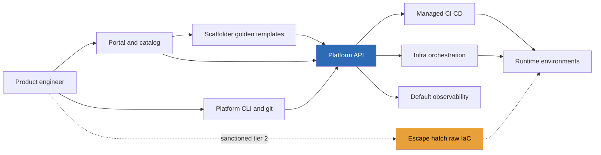

> **Platform engineering is now a defined interview genre**, and the documented prompt is concrete: *"8 product teams on a crumbling Jenkins. Design the platform and the migration."* It is a change-management question wearing a technical costume. The junior answer designs a beautiful Kubernetes abstraction and says "and then teams migrate." The Director answer starts from the uncomfortable truth: **your developers are customers who can refuse the product**, a mandate produces compliance theater and shadow infrastructure, and the only metrics that count are **adoption rate and time-to-first-deploy**, feature count is vanity. The platform earns migration; it doesn't decree it.

### Learning objectives
- Run an **adapted RESHADED** spine on a platform-strategy problem: R = **developer-customer discovery**, E = the **toil-removal and adoption math**, A = the **platform contract**, the golden-path API that *is* the product.
- Frame the load-bearing tension, **golden path vs mandate**: adoption is voluntary, so the path must beat the status quo, with **escape hatches** so the paved road never becomes a cage.
- Make the **Backstage/Humanitec vs in-house** call with the Lesson 8.6 build-vs-buy rule: buy the undifferentiated chassis, build the paths that encode *your* opinions.
- Sequence the **8-team Jenkins migration** so no release is ever blocked, pilots, dual-running, the deadline arriving last.
- Operate the platform as a **Team Topologies platform team** (Lesson 8.8): a product org with a roadmap, support SLAs, and a budget defended in toil-hours returned.

### Intuition first
A city wants people off a dangerous dirt road. Option one: barricade it by decree, drivers are furious, half cut through farm fields (shadow IT). Option two: **build a highway that is faster than the dirt road**, and watch traffic move on its own. The dirt road empties because the highway *wins*; only then do you decommission it. An IDP is the highway: the **golden path** is the paved, opinionated route from "I have code" to "running in production with logs, metrics, and rollback," so much faster than hand-rolled Jenkins-plus-Terraform that choosing it is self-interest, not obedience. And highways have **exits**: a team with a genuinely unusual workload (GPU training, an embedded toolchain) must be able to leave the paved road *without leaving the city*, a sanctioned escape hatch at a lower support tier. Platforms without exits don't get compliance; they get covert off-roading you can no longer see, secure, or budget.

The math that makes this real: in a 400-engineer org, infrastructure toil, pipeline babysitting, Terraform copy-pasta, "how do I get a database" Slack archaeology, plausibly eats **15% of engineering time: 60 engineer-years/yr, ~$15M at $250K loaded**. A 7-person platform team costs ~$1.75M/yr. If the golden path claws back a third of the toil, ~$5M/yr returned, **but only at high adoption**. Adoption *is* the metric; everything below is engineered toward it.

---

## R: Requirements

> **Adaptation, said out loud:** in a product design, R scopes user features. Here the users are **internal developers**, and R is literally **customer discovery, interview the 8 teams before drawing boxes**. Skip it and you build the platform the platform team wants. The artifact is a ranked pain inventory, not a feature list.

**Anchor scenario:** ~400 engineers, ~50 services, 8 product teams (stream-aligned, in Team Topologies vocabulary, Lesson 8.8) on a self-hosted Jenkins: ~200 hand-written Jenkinsfiles, plugins two years behind on CVEs, **~1.5 FTE of informal labor** keeping it alive, and **2-3 days** from repo creation to first production deploy.

**What the team interviews surface (assumed answers):**
- *Top pain?* → **Time-to-first-deploy** (days of yak-shaving) and **flakiness** (Jenkins stalls block releases ~2×/month).
- *What do teams NOT want?* → To learn Kubernetes internals, write Terraform, or be migrated mid-quarter. Two teams: "don't touch my release dates."
- *Outliers?* → One GPU/ML team, one mobile team. **The golden path will not fit everyone, plan for it now.**
- *Who pages?* → Teams own their services' on-call (keep that), but everyone pages *the Jenkins guy*, an informal SPOF that is itself part of the case for change.

**Functional requirements (golden path, v1):**
1. **Scaffold**: new service from a template, repo, pipeline, infra, observability wired, in minutes.
2. **Build & deploy**: push-to-deploy CI/CD with staged rollout and one-command rollback.
3. **Self-serve infrastructure**: the 3-4 most-requested resources (Postgres, Redis, queue, bucket), no tickets.
4. **Golden observability**: logs, metrics, dashboards, alerts by default (Lessons 3.13-3.14 mechanics; here a *product feature*).
5. **Service catalog**: who owns what, what's on the path, production-readiness at a glance.

**Explicitly CUT from v1:** multi-cloud abstraction, a PaaS for every workload shape (GPU and mobile go to sanctioned hatches), cost dashboards, preview environments, all real, all behind adoption of the core path. **Five things 8 teams use beats 25 things 2 teams use.**

**Non-functional requirements, unusual ones:**
- **Adoption is voluntary.** No VP edict in year one; the path wins on merit or the design has failed. (The security baseline is the one legitimate mandate, and the platform makes compliance *free*.)
- **Never block a product team's release.** The migration NFR; any cutover that risks a date is rejected by construction.
- **Metrics pinned up front:** % of services on the golden path (target 70% by month 12), **time-to-first-deploy < 1 hour**, support tickets per service trending *down*, DORA deploy frequency trending up. Not feature count.
- **The platform is a product:** a named owner, a public roadmap, a support SLA (< 4h first response), quarterly developer-NPS. Directors fund products, not projects.

---

## E: Estimation

> **Adaptation, said out loud:** no QPS. Estimation is two ledgers, **platform-team cost vs toil removed**, plus the **adoption arithmetic** that decides whether they ever balance. Same Lesson 1.3 discipline: round aggressively, state assumptions.

**Cost.** Heuristic: platform teams run **~5-8% of engineering**. At 400 engineers, 7 × $250K ≈ $1.75M/yr + ~$300K infra/tooling ≈ **$2M/yr all-in**.

**Return.** 400 × 15% toil ≈ 60 eng-yr ≈ **$15M/yr**. The path removes a third *for adopted services*: **$5M/yr at full adoption**; ~$2.5M at 50%, barely break-even; underwater at 20%. **The business case is linear in adoption**, which is why adoption is the number reported to the CFO, and why mandates that produce fake adoption corrupt the only number that justifies the spend.

**Throughput sanity check:** 50 services × ~4 deploys/day ≈ **200 deploys/day**, a few thousand CI jobs, trivially served by autoscaled managed runners at ~$15-20K/month. The hard part of an IDP is **never** infrastructure load; it is product-market fit with 8 picky internal customers. Saying that sentence in the interview is itself signal.

**The Jenkins ledger:** ~1.5 informal FTE (~$375K/yr) + 2 release-blocking outages/month × ~4 engineer-days ≈ ~$250K/yr + an unpatched CVE surface: **~$600K/yr to keep the dirt road open**, the number that anchors the decommission case *later*, not the opening move.

**What estimation decided:** a 7-person team; the case lives or dies on adoption (70%/12 months); deploy volume is a non-problem; time-to-first-deploy (2-3 days → **< 1 hour**) is the flagship metric because every team feels it viscerally.

---

## S: Storage

> **Adaptation, said out loud:** "what persists" is the **platform's sources of truth**, and the rule is **everything as code, in git**, the platform's own changes ride the discipline it sells.

Three stores: **golden-path templates and infra modules** in git (the platform team's product code); each service's **`platform.yaml` manifest** (next section) in *that service's* repo, the team owns the declaration, the platform owns the machinery; and the **service catalog** in a small Postgres (Lesson 2.2 posture, tiny data, relational queries like "services owned by team X failing readiness check Y"), hydrated *from* git and org metadata. *Rejected, a hand-maintained catalog/wiki:* stale within a quarter; a catalog that ingests from the repos stays true because lying to it would require lying to your own deploy.

---

## H: High-level design

> The shape to make visible: **two front doors** (portal for discovery, CLI/git for daily flow) converging on **one platform API**, with the **escape hatch drawn as a first-class, sanctioned route**, not omitted in embarrassment.



**The flow, compressed:** scaffold from a template (portal or CLI, same API) → a repo with code skeleton, `platform.yaml`, and a working pipeline. Daily loop is git-native: push → managed CI → staged deploy with canary and one-command rollback; declared infra is reconciled from the manifest; logs, metrics, dashboards, paging exist on day one. The **catalog** reads it all back: every service, owner, tier, readiness score.

**The build-vs-buy call, quantified once (Lesson 8.6's rule: build only where you differentiate).** The portal/catalog/scaffolder chassis is **undifferentiated**, adopt **Backstage** (open source, ~1-1.5 engineers of ongoing operation ≈ $300-400K/yr) or a SaaS portal (Port/Cortex-class, ~$50-100K/yr, less control). Building an in-house portal is **~8-10 engineer-years ≈ $2.5M** to reproduce a commodity, rejected without ceremony. The **golden-path templates, pipeline opinions, and infra modules are the differentiation**, they encode *your* stack, compliance posture, and on-call model, built in-house. My prior: **Backstage chassis + in-house paths**; I'd have the platform lead spike one SaaS alternative for the operating-cost delta, but the buy-the-chassis/build-the-paths split survives either vendor.

**Team shape (Lesson 8.8, one line):** a **platform team** serving stream-aligned teams via self-service, not a gatekeeping ops team, not a visiting enabling team, though during migrations it temporarily adds enabling-team mode (pairing on the first cutover).

---

## A: API design

> **Adaptation, said out loud:** in a product design, A lists endpoints. Here A is **the platform contract**, and its design carries the adoption strategy: declarative, versioned, small, with the escape hatch defined *in* the contract.

```yaml
# platform.yaml — the whole contract a team writes
apiVersion: platform/v1
service: checkout
owner: team-payments        # catalog + paging route
tier: golden                # golden | hatch (support level differs)
runtime:
  type: web                 # web | worker | cron
  size: m                   # t-shirt sizes, not CPU/mem tuning
  autoscale: { min: 2, max: 20 }
deploy:
  strategy: canary          # canary | rolling
  rollback: auto            # on SLO breach during rollout
resources:
  - kind: postgres          # the 3-4 blessed kinds, v1
    name: orders-db
  - kind: queue
    name: order-events
observability: default      # logs + metrics + dashboard + paging, free
```

```
# CLI verbs — thin wrappers over the same platform API
platform create --template service-go     # scaffold, < 1 min
platform deploy | rollback | status | logs
```

**Design notes (each with its rejected alternative):**
- **Declarative manifest, not imperative pipelines.** Teams state *what*; the platform owns *how*. *Rejected: exposed pipelines-as-code for everyone*, that's Jenkins with better fonts; 200 bespoke Jenkinsfiles was the disease.
- **T-shirt sizes and a blessed resource list.** Every exposed knob is a knob you support forever. *Rejected: pass-through to raw Kubernetes/Terraform*, leaky-by-design means teams still need the expertise the platform was funded to remove.
- **`tier: hatch` is in the schema.** The hatch is *contracted*: raw IaC allowed, security baseline still enforced, support drops to best-effort, catalog shows it honestly. *Rejected: no hatch*, the GPU and mobile teams defect covertly and you lose visibility and trust. *Rejected: a fully supported hatch*, then the hatch is free and the golden path has no gravity.
- **`apiVersion` from day one; breaking changes only by major version with platform-run codemods.** Breaking your customers' deploys twice is how adoption dies, treat the manifest like a public API (Lesson 2.10, internal edition).

---

## D: Data model

> **Adaptation, said out loud:** the data model is the **service catalog**, small, relational, operationally load-bearing: it answers "who owns this," measures the platform's own adoption, and turns production-readiness into a glanceable score.

Four entities: **Component** (service: repo, runtime type, `tier`, lifecycle), **Team** (owner, paging route), **Resource** (a provisioned Postgres/queue/bucket linked to its component, the edge that answers "what breaks if this DB dies"), **Scorecard** (per-component readiness checks). Adoption rate and time-to-first-deploy are *queries over the catalog*, not a separate analytics project, the success metrics fall out of the system of record.

<details>
<summary>Go deeper, catalog schema and scorecard checks (IC depth, optional)</summary>

**`components`**: `name` (pk), `repo_url`, `owner_team` (fk), `runtime_type` (web/worker/cron), `tier` (golden/hatch), `manifest_version`, `created_at`, `first_deploy_at` (with `created_at`, yields time-to-first-deploy per service), `lifecycle` (experimental/production/deprecated).

**`teams`**: `name` (pk), `pager_route`, `slack_channel`, `org_unit`.

**`resources`**: `id` (pk), `component` (fk), `kind` (postgres/redis/queue/bucket), `size`, `state` (requested/ready/failed), the reconciliation target for the infra orchestrator.

**`scorecard_results`**: `component` (fk), `check_id`, `status`, `checked_at`. Typical v1 checks: manifest on current `apiVersion`; SLO + dashboard exist; paging route verified; rollback exercised in last 90 days; no direct-to-prod side-door deploys detected (the fake-adoption detector, compare platform-API deploy events against running image digests).

Adoption rate = `count(tier='golden' AND no side-door flag) / count(*)` over production-lifecycle components. Publish weekly, per team, *to the platform team first*, public per-team shaming dashboards are a mandate in disguise and poison the customer relationship.

</details>

---

## E: Evaluation

> **Adaptation, said out loud:** Evaluation here is a **pre-mortem: the five ways internal platforms actually fail**, every one organizational, none a scaling bottleneck, each with its countermeasure designed in.

**Failure 1, the mandate.** Leadership decrees migration by Q3; teams comply on paper, keep side-door deploy scripts, the catalog fills with fake-golden services; the adoption metric corrupts and the CFO case collapses. *Countermeasure:* voluntary adoption + the side-door detector + selling teams on *their* metrics (TTFD, flake rate). The only mandate is the security baseline, enforced equally on the hatch tier, so it never reads as platform protectionism.

**Failure 2, the golden cage.** No hatch; the GPU workload genuinely doesn't fit; the team forks infrastructure covertly; six months later security finds an unmanaged AWS account. *Countermeasure:* `tier: hatch` as a contracted, visible, baseline-compliant state, supported less (or it drains golden-path gravity) but sanctioned fully (or it goes underground).

**Failure 3, platform-as-project.** The team ships v1 and is reassigned; templates rot, the manifest breaks on an upgrade, tickets sit a week; customers churn back to hand-rolled, and the second attempt pays an institutional-distrust tax. *Countermeasure:* fund a **product line with permanent headcount** ($2M/yr defended annually with the toil ledger), a roadmap, the support SLA. A platform you won't staff forever is a platform you shouldn't build (8.6's maintenance-tail rule, applied internally).

**Failure 4, building for the architect, not the customer.** The team ships multi-cloud abstraction and a service mesh while TTFD is still two days, because infra engineers build what's interesting. *Countermeasure:* the R-step interviews set the roadmap; adoption and TTFD, not feature count, set the goals; quarterly developer-NPS keeps it honest.

**Failure 5, the migration blocks a release.** One cutover slips a launch; the story metastasizes ("the platform cost us Q3"); the next four teams refuse their windows. *Countermeasure:* the dual-run rule and team-chosen windows below, the single most important operational policy in the design.

**Closing re-check vs NFRs:** adoption voluntary and honestly measured; no release gated on migration; metrics pinned; platform funded as product. The design survives its own pre-mortem.

---

## D: Design evolution

> **Adaptation, said out loud:** evolution isn't 10× traffic, it's the **8-team migration sequencing**, the part of the prompt that actually gets asked. Principle: **diffusion, not decree**, pilots prove value, the middle adopts self-serve, the front door closes before any pressure, and the deadline arrives *last*.

**Phase 0 (months 0-2), build the wedge, not the platform.** The thinnest golden path that fully serves *one* common shape (stateless web + Postgres). Two teams delighted by a narrow path beats two teams waiting on a complete one.

**Phase 1 (months 2-4), two pilots, chosen deliberately.** Criteria: **high Jenkins pain + mainstream workload + an enthusiastic tech lead**, not the hardest team (visible failure), not the easiest (proves nothing). The platform team migrates the first service *with* them, enabling-team mode, paving by doing, and the pipeline **dual-runs**: Jenkins stays the release path until the team itself flips the switch. *Rejected: hard cutovers*, they convert every platform bug into a release blocker, violating the prime NFR; dual-run costs a few weeks of duplicate CI (~$2-3K/team), the cheapest insurance in the program. Exit criteria: both pilots shipping through the platform, TTFD < 1 hour demonstrated, and **a pilot tech lead willing to demo to the other six**, peer testimony converts; platform-team demos market.

**Phase 2 (months 4-8), close the front door, serve the middle.** Announce: **all *new* services scaffold on the platform**, a cheap, defensible mandate (no existing workflow touched; new services get 1-hour TTFD as pure gift). Teams 3-6 migrate self-serve with office hours and a guide, each in its own window between releases. The platform team's job this phase is **support latency**, the < 4h SLA separates "product" from "abandonware." Watch tickets-per-migrated-service: if it isn't falling by the third migration, the templates have a gap, fix the product, don't blame the customer.

**Phase 3 (months 8-12), holdouts, with air cover and a date.** Two remain: the GPU team (legitimately different, lands on `tier: hatch` with a compliant CI shell, *counted as success*; the goal was never 100% golden) and a team that's simply busy. Now, at >70% adoption, with the $600K/yr Jenkins carrying cost and CVE exposure documented, announce the **decommission date 6 months out**, with pairing offered for the final migration. *Rejected: announcing the deadline in month 0*, a date before demonstrated value is a mandate, and you'd spend political capital buying resistance. The deadline comes last because by then it formalizes a fait accompli.

**Phase 4, decommission Jenkins; redeploy the 1.5 informal FTE; report the ledger** (adoption %, TTFD delta, ticket trend, toil-dollars returned vs $2M) to the CFO. Then the next wedge, preview environments or cost visibility, chosen the same way: by interviewing the customers.

**Where I'd delegate (the explicit Director move):**
- **Portal chassis bake-off:** *"Platform lead runs a 2-week Backstage-vs-SaaS spike; my prior is Backstage at our size because $300-400K/yr of operating cost buys template control we'll use, but I'll take the data."*
- **Pipeline/runtime internals:** *"The platform team owns the CI engine and rollout mechanics behind the manifest contract; my prior is managed runners + canary-by-default; I hold them to TTFD and deploy success rate, not implementation choices."*
- **Security baseline on the hatch tier:** *"AppSec defines the non-negotiable floor for both tiers; my prior is image signing + centralized secrets, applied evenly so the baseline never reads as platform politics."*

What I keep: the metrics, the voluntary-adoption posture, the hatch contract, the sequencing, and the budget defense. That's the altitude.

---

## Trade-offs table: the pivotal decisions

| Decision | Option A | Option B | Option C | Use when... |
|---|---|---|---|---|
| **Adoption model** | **Voluntary golden path** + new-services mandate + late deadline | **Top-down mandate, date first** | Laissez-faire, no platform | **A**, adoption is the metric and mandates corrupt it (our choice). **B** only under an acute forcing function (security incident, audit), expect compliance theater. **C** is the $15M/yr toil status quo. |
| **Portal & chassis** | **Backstage + in-house paths** (~$300-400K/yr to operate) | **SaaS portal** (~$50-100K/yr, less control) | **Full in-house** (~$2.5M to build) | **A** at 300+ engineers wanting template control (our choice). **B** below ~200 engineers or no platform headcount. **C** ~never, the chassis is undifferentiated (8.6 rule). |
| **Abstraction level** | **Declarative manifest, t-shirt sizes, blessed resources** | Raw pipelines + IaC pass-through | Full PaaS, zero knobs | **A**, hides toil, keeps a hatch (our choice). **B** reproduces Jenkins sprawl. **C** only for truly homogeneous workloads; at 8 diverse teams it forces defections. |
| **Migration cutover** | **Dual-run, team-chosen window** | Hard cutover on a schedule | Indefinite parallel operation | **A**, never blocks a release; ~$2-3K/team of duplicate CI (our choice). **B** turns platform bugs into release blockers. **C** never realizes the $600K/yr savings, set the date once adoption passes ~70%. |

---

## What interviewers probe here (Director altitude)

- **"Why would teams adopt this at all?"**, *Strong:* it wins on their metrics, TTFD days → < 1 hour, flake rate down, observability free, proven by pilots whose tech leads evangelize peer-to-peer. *Red flag:* "leadership will mandate it" as the opening move.
- **"A team refuses. What do you do?"**, *Strong:* segment the refusal, genuinely different workload → `tier: hatch`, sanctioned and counted as success; merely busy → wait, keep shipping value, bring the deadline only after ~70% adoption with the $600K/yr carrying cost documented. *Red flag:* escalate to their VP in week one, or let them run an invisible stack.
- **"How do you know it's working?"**, *Strong:* adoption % (side-door-verified), time-to-first-deploy, tickets per service trending down, DORA deploy frequency up, developer-NPS, reported against the $2M/yr spend as toil-dollars returned. *Red flag:* features shipped, "Jenkins turned off."
- **"Build or buy the platform?"**, *Strong:* split the question, buy/adopt the undifferentiated chassis (~$300K/yr vs ~$2.5M to rebuild), build the golden-path templates that encode our opinions; cites the 8.6 rule, delegates the bake-off with a prior. *Red flag:* monolithic "build it all" (résumé-driven) or "just buy Humanitec and we're done" (no vendor ships your opinions).
- **"Walk me through the Jenkins migration."**, *Strong:* wedge → 2 pilots dual-running, paved by doing → new-services-only mandate → self-serve middle on a support SLA → holdouts with air cover and a 6-month deadline announced *after* 70% adoption → decommission and report the ledger. *Red flag:* a Gantt chart of simultaneous hard cutovers with a date chosen before the first pilot.

---

## Common mistakes

- **Treating it as a pure infrastructure problem.** The prompt is change management in a technical costume; a beautiful Kubernetes abstraction with no adoption strategy answers the wrong question.
- **Mandate-first migration.** A decreed date before demonstrated value produces compliance theater, side-door deploys, and a corrupted adoption metric, the only number that justifies the spend.
- **No escape hatch (or a free one).** Without a sanctioned hatch, outliers defect covertly; with a *fully supported* hatch, the golden path has no gravity. Sanctioned *and* second-tier.
- **Measuring feature count instead of adoption and TTFD.** Ship 5 things 8 teams use, not 25 things 2 teams use.
- **Funding it as a project.** A platform team that disbands after v1 leaves rotting templates and institutional distrust that taxes the next attempt. Permanent headcount or don't start.

---

## Interviewer follow-up questions (with model answers)

**Q1. Your CEO says "just mandate it, we're not a democracy." Respond.**
> *Model:* Agree on the goal, push back on the mechanism with the metric: the business case is **linear in real adoption**, $5M/yr returned at full adoption, underwater below ~40%, and mandates produce *fake* adoption: services flagged golden that still deploy through side doors. I'd offer the two cheap, legitimate mandates, **all new services on the platform** (touches no existing workflow) and the **security baseline on every tier**, and commit to a decommission date *once pilots prove the path and adoption passes ~70%*. Same destination, with the teams' trust and an honest number. An acute forcing function (an active Jenkins CVE, an audit) compresses the sequence; absent that, the decree costs more than it buys.

**Q2. Six months in: adoption is 35% against a 50% target, tickets rising. Diagnose.**
> *Model:* Rising tickets per migrated service plus stalled adoption almost always means **product gaps, not customer resistance**, the path fits the pilots' shape but not the middle teams'. Read the ticket corpus as customer research, re-interview the stalled teams; expect a missing blessed resource or a manifest limitation forcing workarounds. Fixes in order: redirect the roadmap to the top gap (pause new features), audit support-SLA compliance (slow support kills platforms faster than missing features), verify the pilots are still healthy, a regretful pilot is anti-marketing. What I would *not* do: escalate for a mandate, pushing a product with known gaps converts quiet skeptics into vocal enemies. Adoption is a *thermometer for product quality*; treat the fever, not the reading.

**Q3. The GPU/ML team says the golden path will never fit them. Are they right?**
> *Model:* Probably yes, for training, GPU scheduling, giant artifacts, experiment-shaped pipelines are a different product, and stretching v1 to cover them slows the path for the seven teams it fits. They land on **`tier: hatch`**: raw IaC freedom, the security baseline still enforced, catalog-visible, best-effort support, sanctioned, not exiled. I count that as *success*: the goal was never 100% golden, it's an honest catalog and zero shadow infrastructure. Two follow-ons: their *serving* services are often plain web services, migrate those; and recurring hatch usage with a common shape is exactly how the roadmap learns what to pave next. The hatch is the platform's product-discovery channel, not its failure log.

**Q4. How is your platform team measured, and what does it cost?**
> *Model:* Cost: ~7 engineers + infra ≈ **$2M/yr**, sized at the 5-8%-of-engineering heuristic for 400 engineers. Measured on four numbers, none of which is feature count: **adoption rate** (side-door-verified, target 70% by month 12), **time-to-first-deploy** (2-3 days → < 1 hour), **tickets per service** (the product-quality proxy), and the org's **DORA deploy frequency**, the platform exists to make *other teams* faster, so their delivery metrics are its outcomes. Annually I defend the budget with the toil ledger: ~$15M/yr of org toil, a third removed at current adoption ≈ $3-5M/yr returned against $2M spent, plus Jenkins's $600K/yr retired. If the numbers stop clearing the bar, the platform shrinks, product lines earn their headcount.

---

### Key takeaways
- **Internal developers are customers; adoption is voluntary**, the golden path must beat the status quo on *their* metrics, because the business case ($5M/yr toil returned vs $2M/yr team cost at 400 engineers) is **linear in honest adoption**.
- **The platform contract is the product:** a small, declarative, versioned manifest (t-shirt sizes, blessed resources) with **`tier: hatch` in the schema**, sanctioned escape at a lower support tier, so outliers stay visible instead of going underground.
- **Buy the chassis, build the paths** (Lesson 8.6): Backstage/SaaS for the undifferentiated portal (~$300K/yr vs ~$2.5M in-house); the golden-path templates encoding your opinions are the differentiation.
- **Migration is diffusion, not decree:** two well-chosen pilots, paved by doing and dual-running → new-services-only mandate → self-serve middle on a support SLA → deadline announced *last*, after ~70% adoption, and **no team's release is ever blocked**.
- **Measure adoption, time-to-first-deploy, tickets/service, DORA trend, never feature count**, and fund the platform as a permanent product line (Team Topologies platform team, Lesson 8.8), not a project that ships and disbands.

> **Spaced-repetition recap:** IDP = **a product whose customers can refuse it**. Golden path over mandate (mandates → compliance theater + shadow infra); escape hatch contracted in the manifest (`tier: hatch`, sanctioned, baseline-compliant, second-tier support). Buy the chassis (Backstage ~$300K/yr), build the paths. Migrate 8 teams by diffusion: 2 pilots dual-run → new-services-only mandate → self-serve middle → deadline *after* 70% adoption; never block a release. Success = **adoption % + TTFD** (days → < 1 hr), defended yearly as toil-dollars returned (~$5M vs $2M), never feature count.

---

*End of Lesson 8.7. The IDP problem inverts Module 5's instincts: the load is trivial (200 deploys/day), and the entire difficulty is product-market fit with internal customers plus the change management of migration, 8.6's build-vs-buy rule applied to your own tooling, executed by the platform-team shape that 8.8 makes precise. Next: 8.8, org design and Conway's law, where the team boundaries themselves become the architecture.*
