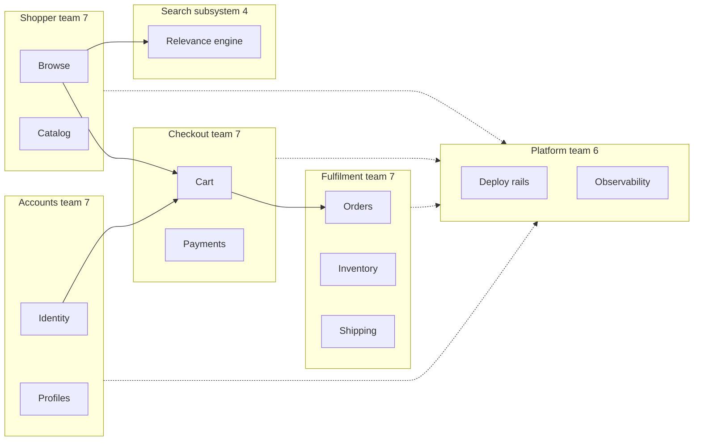

> **This is the most Director-distinctive question in the loop, no IC can fake it.** The documented prompt is blunt: *"You have 40 engineers and this architecture, draw the org,"* or its growth twin, *"the team is going from 15 to 50, reorganize ownership."* It is asked as an org-design case precisely because it tests something no coding round can: whether you know that **the org chart is an architectural input, not an HR artifact**. Conway's law says your system will copy your communication structure whether you like it or not; the junior answer draws the services first and staffs them afterward, then watches the seams land wherever the existing teams already talk. The Director answer draws **both diagrams as one artifact**, and treats the human cost as a first-class constraint: a reorg that loses three senior engineers has destroyed more architecture than it created. Shaping teams to induce the target system (**inverse Conway**) while managing that cost is the entire question.

### Learning objectives
- Run an **adapted RESHADED** spine where the system is the *organization*: H becomes the **service diagram and team topology drawn together**, E becomes **cognitive-load and headcount math**, D becomes the **ownership map**.
- Apply the 2024-26 expected vocabulary, **Team Topologies'** four team types and three interaction modes, in one tight table, and use it instead of inventing terms.
- Draw ownership boundaries **on system seams, with at most one owning team per boundary** (two only during an explicit, dated handover), and predict where boundaries will leak.
- Quantify the **human cost**: communication paths, reorg productivity dips, and **attrition risk as part of the architecture decision**, with dollar figures, not vibes.
- Sequence a reorg **against migration milestones** (the Lesson 8.1 strangler-fig timeline), not against a calendar, and defend the sequencing against the big-bang alternative.

### Intuition first
Four families share one big farmhouse kitchen and you ask them to cook four separate dinners. Whatever the recipe cards say, dinner will come out the way the *kitchen* is laid out: whoever stands next to the stove ends up stirring everyone's pots, the family nearest the fridge becomes the de-facto ingredients service, and every dish converges on the same spice profile because everyone reaches into the same rack. That is **Conway's law**: a system's structure copies the communication structure of the people building it, not because anyone decides this, but because designing across a chatty boundary is easy and designing across a silent one is hard. Now invert it. If you *want* four genuinely independent dinners, you don't write stricter recipes, **you build four kitchen stations**, each with its own stove, fridge shelf, and spice rack. The food follows the floor plan. That is the **inverse Conway maneuver**: choose the architecture you want, then shape the teams so that the easy communication paths are exactly the seams you intend, and the system grows into them.

The catch the analogy must also carry: families are people. Reassign the grandmother who has cooked at that stove for a decade to a station she didn't choose, and she may leave, taking the only working knowledge of half the recipes with her. **An org design that induces the right architecture but bleeds the people who hold the system in their heads has failed both tests.** Attrition risk is not an HR footnote to the design; it is a term in the design's cost function, and we will price it.

---

## R: Requirements

> **Adaptation, said out loud:** in a product design, R scopes features. Here R scopes the *organization*: what must this org be able to deliver, at what change rate, with what failure modes? The clarifying questions are about business flows, growth, and constraints on people, and they are exactly the questions a junior candidate forgets to ask before drawing boxes around names.

**Anchor scenario (used throughout):** a **40-engineer e-commerce company**, ~$150M GMV, a modular monolith mid-decomposition (Lesson 8.1) into domain services, currently organized **by layer**: a frontend team (10), a backend team (16), a data/search team (6), an ops/DBA team (8). Classic Conway: a 3-tier org has produced a 3-tier system, and every feature, "add gift wrapping", crosses three team backlogs and two sprint boundaries.

**Clarifying questions I'd ask (with assumed answers):**
- *What does the business need the org to do faster?* → **Ship vertical features end-to-end.** Today a one-week feature takes 6-8 weeks of cross-team queuing. Flow, not raw output, is the complaint.
- *What's the target architecture?* → The Lesson 8.1 end-state: domain services around **browse/search, cart/checkout, payments, orders/fulfilment, customer accounts**, on shared platform rails. Roughly **15-20 services**.
- *Growth plan?* → Headcount roughly flat this year; the 15→50 variant is treated in Design evolution.
- *On-call model?* → You-build-it-you-run-it is the goal; today ops pages for everything (a Conway symptom: a separate ops team produces a system only ops can run).
- *People constraints?* → Two irreplaceable domain experts (payments, search relevance); the frontend team has strong identity and a beloved manager. **These are design inputs**, the same way a legacy protocol you can't change is.

**Functional requirements (of the org):**
1. Each major business flow (browse → cart → pay → fulfil) has a team that can change it **end-to-end without a ticket to another team**.
2. Every service in the target architecture has **exactly one owning team**, build, run, page.
3. Shared infrastructure (deploy, observability, data platform) is consumed **self-service**, not by request queue.
4. The org supports the migration itself: someone must own the monolith *while it shrinks*.

**Non-functional requirements (the load-bearing ones):**
- **Team cognitive load stays within budget**, no team owns more domains than it can hold; this is the org's equivalent of a latency SLO, and we quantify it in E.
- **≤ 1 owning team per system boundary.** Two teams per boundary only during an explicit, end-dated handover; three or more is a design error, not a compromise.
- **Regrettable attrition through the reorg < ~5%** (2 of 40). Above that, the reorg is destroying the asset it's reorganizing.
- **No feature freeze.** The business doesn't stop; the reorg sequences around delivery, like the Lesson 8.3 migrations sequence around live traffic.

**Explicitly CUT (scoping is the signal):** compensation bands, performance management, hiring pipeline mechanics, and the manager-selection question, real, owned with the HR partner, but not this design. I scope to **team boundaries, ownership, interaction modes, and sequencing**, and say so.

---

## E: Estimation

> **Adaptation, said out loud:** no QPS. Estimation here is **communication-path math, cognitive-load budgets, headcount arithmetic, and the dollar cost of the reorg itself**, the same Lesson 1.3 discipline (round aggressively, state assumptions) applied to people.

**Communication paths, why team boundaries exist at all.** 40 people fully meshed is `40 × 39 ÷ 2 = 780` potential pairwise channels. Six teams of ~7 cuts that to ~21 high-bandwidth channels *inside* each team plus **15 inter-team channels**, and the entire design question is *which 15*. Conway's law says the system's seams will land on whichever channels stay chatty; inverse Conway means choosing them deliberately.

**Team size:** 5-8 engineers (the two-pizza band, small enough to mesh internally, large enough to carry on-call). `40 ÷ 7 ≈ 6 teams`.

**Team-type mix (Team Topologies heuristic, most of the org should sit in stream-aligned teams):** at 40 engineers that yields **4 stream-aligned teams (~28), 1 platform team (~6), and ~2 engineers of enabling capacity** (fractional, senior ICs who rotate, not a standing department). A complicated-subsystem team only if a genuine deep specialism exists; here, **search relevance** is the one candidate.

**Cognitive-load budget, the org's capacity number.** A rough, defensible heuristic: a stream-aligned team can own **2-3 bounded domains, ~5-8 services** before quality of ownership degrades (on-call depth, roadmap attention, willingness to refactor). Target architecture: ~15-20 services ÷ 4 stream teams ≈ **4-5 services each**, inside budget, with the platform team carrying the rails. If the service count were 40, the same math would say *don't build 40 services with 40 engineers*, **the architecture must fit the org's load budget, which is exactly the co-design point.**

**What the reorg costs.** Payroll is `40 × $200K loaded = $8M/yr`, so engineering time prices at ~$150K/week. A well-sequenced reorg costs each affected team ~20-30% productivity for ~4-6 weeks (new domains, new rituals, ownership handovers): roughly **$400-700K of slowed delivery**. A big-bang reorg roughly doubles the dip and adds the tail risk: each regrettable senior departure costs **~$300-500K** (backfill recruiting + 6-9 months of ramp + the unwritten system knowledge), three departures ≈ **$1-1.5M**, comparable to the entire sequenced-reorg cost. **This asymmetry is the quantitative case for sequencing**, and it's the number to say out loud in the interview.

**What estimation decided:** 6 teams (4 stream + 1 platform + fractional enabling); 4-5 services per stream team fits the load budget; the reorg itself is a ~$0.5M project whose dominant risk term is attrition, which is why sequencing, not speed, is optimized.

---

## S: Storage

> **Adaptation, said out loud:** "what persists, and who owns it" is the sharpest boundary-drawing tool in the problem. In Team Topologies language you choose **fracture planes**; the most reliable plane is **data ownership**, a team boundary that splits a database is a boundary that will leak.

The rule, stated once: **each stream-aligned team owns its domain's data outright**, schema, store choice, migrations, and the only write path. Other teams get an API or an event stream, never a JDBC connection. This is the org-level restatement of Lesson 8.1's database-decomposition step, and it's where Conway bites hardest in reverse: if checkout and fulfilment share a table, the two teams *must* coordinate every schema change, the chatty channel persists, and the services never actually separate, the shared database silently reassembles the monolith regardless of what the service diagram claims.

Applied to the anchor: the orders tables go to the fulfilment team, cart/session state to checkout, the catalog to shopper experience, payment instruments (PCI-scoped) to whichever team owns payments, and the migration is **not done** until each store has exactly one writing team. *Rejected, a central data team owning all schemas:* it recreates the layer org inside the data tier; every product change queues on one team, which is the 6-8-week feature lead time we were hired to kill. The data *platform* (warehouse, pipelines, tooling) is platform-team property; the domain *data* is not.

---

## H: High-level design

> **Adaptation, said out loud, and this is the lesson's core artifact:** H is not a service diagram with an org chart stapled behind it. It is **one drawing**: services *inside* team boundaries, so every box visibly has an owner and every arrow visibly crosses (or doesn't cross) a team seam. In the interview, draw this; it is the single highest-signal artifact the question admits.

First, the expected vocabulary, the **four Team Topologies team types**, in one table, because interviewers in 2024-26 assume this frame:

| Type | Owns | Default interaction | In our 40-eng org |
|---|---|---|---|
| **Stream-aligned** | A slice of business flow, end to end, build, run, page | Consumes platform as a service | 4 teams, ~28 eng (~70-85% of the org, the load-bearing heuristic) |
| **Platform** | Self-service internal services: deploy, observability, data rails (Lesson 8.7) | **X-as-a-service** to stream teams | 1 team, ~6 eng |
| **Enabling** | Capability uplift (testing, perf, migration patterns), visits, teaches, **leaves** | **Facilitating**, time-boxed | ~2 fractional senior ICs, not a department |
| **Complicated-subsystem** | A deep-specialism component the stream teams shouldn't carry | X-as-a-service behind a narrow API | 0-1; search relevance is the only candidate here |

And the three **interaction modes**, one line each: **collaboration** (two teams working jointly, high bandwidth, deliberately temporary), **X-as-a-service** (one consumes the other's product through an interface, the cheap steady state), **facilitating** (one uplifts the other, then exits). The Director move is treating modes as *designed and dated*, not emergent: collaboration that never ends is a boundary that never formed.

**The co-designed diagram for the 40-engineer e-commerce org:**



**Reading the artifact:** every service sits inside exactly one team boundary, the **≤ 1-owner rule made visible**. Solid arrows are runtime dependencies that cross team seams: each one is a **contract** (next section) and a predicted communication channel; if the diagram showed a service needing arrows from three teams to change, the boundary is wrong *on this drawing*, before any code moves. Dotted arrows are X-as-a-service consumption of the platform. The search relevance engine is carved out as a **complicated-subsystem team** (4 engineers including the irreplaceable expert) because ranking depth would blow the shopper team's cognitive-load budget, and it hides behind one narrow query API, so the specialism doesn't leak.

**The three viable org shapes, name them, then choose:**
- **A. Component/layer teams (the status quo):** teams own technical layers. *Pro:* deep technical specialism, no reorg cost. *Con:* every feature crosses every team; Conway delivers a layered monolith forever. Rejected, it is the failure we were asked to fix.
- **B. Pure feature/matrix teams:** transient squads assembled per project from a pool. *Pro:* maximal staffing flexibility. *Con:* **nobody owns anything**, services have no long-term steward, on-call decays, and Conway, given no stable communication structure, produces a big ball of mud. Rejected for ownership.
- **C. Stream-aligned domain teams on the target seams (chosen):** stable teams owning business flows, platform underneath. *Pro:* flow, ownership, and inverse-Conway pressure toward the target architecture. *Con:* a real reorg with real human cost, and seams chosen now are expensive to redraw. **Chosen because the requirement is end-to-end flow and the migration needs owners**, and the cost is managed by sequencing (Design evolution), not denied.

**Who owns the shrinking monolith?** No standing "monolith team", that creates a team whose mission is to disappear and whose attrition risk is total (nobody stays to steward a melting iceberg). Instead each stream team owns *its domain's code inside the monolith* from day one, and extraction is part of their roadmap. *Trade-off:* fuzzier short-term ownership of shared monolith plumbing, accepted, with the platform team holding the build/deploy spine of the monolith itself.

---

## A: API design

> **Adaptation, said out loud:** the interfaces here are **team APIs**, the contract each team publishes to the rest of the org. A team's API is its services' endpoints *plus* how to engage the humans: what's self-service, what needs a conversation, what the support SLA is. Inter-team arrows on the H diagram are exactly the things this step specifies.

```yaml
# Team API — Fulfilment team (the org-design analogue of an interface)
owns:
  services: [orders, inventory, shipping]
  data: [orders_db, inventory_db]        # sole write path
  oncall: 24x7 for owned services
provides:
  - api: POST /v1/orders                  # versioned, consumer-driven contract tests
  - events: order.created, order.shipped  # via the platform event bus
engage:
  self_service: API + event docs, sandbox
  consult: schema or contract changes — 1 week notice via RFC
  collaboration: by agreement, time-boxed, with an end date
```

**Design notes (each with the rejected alternative):**
- **Inter-team dependencies are versioned APIs and events, not shared code or shared tables.** *Rejected: a shared domain library all teams co-edit*, it couples release cadences and quietly re-merges the teams; Conway will reassemble the monolith through the library.
- **Contract changes carry notice and consumer-driven tests**, the org-level idempotency key: it makes cross-team change safe to retry. *Rejected: "we'll coordinate on Slack"*, that is the chatty channel inverse Conway exists to eliminate.
- **Collaboration mode requires an end date.** Checkout and fulfilment may pair for a quarter while the order-flow seam settles; the date forces the boundary to actually form. *Rejected: open-ended "virtual teams"*, permanent collaboration is a missing boundary wearing a costume.

---

## D: Data model

> **Adaptation, said out loud:** the data model is the **ownership map**, the org's authoritative table of *service → owning team → on-call → data owned*. It lives in the service catalog (Lesson 8.7), not a wiki, and the invariant it enforces is the one NFR worth a uniqueness constraint: **one owner per boundary.**

| Boundary | Owner | Data owned | Consumers | Mode |
|---|---|---|---|---|
| Browse / catalog | Shopper (7) | catalog_db | Checkout, Search | X-as-a-service |
| Search relevance | Search subsystem (4) | ranking models | Shopper | X-as-a-service |
| Cart / payments | Checkout (7) | cart_db, payments (PCI) | Fulfilment | X-as-a-service |
| Orders / inventory / shipping | Fulfilment (7) | orders_db, inventory_db | Checkout, Accounts | X-as-a-service |
| Identity / profiles | Accounts (7) | users_db | All | X-as-a-service |
| Deploy / observability / data rails | Platform (6) | the rails | All teams | X-as-a-service |
| Test + migration capability | Enabling (2, fractional) | none | rotating | Facilitating, time-boxed |

Two structural notes. **Payments stays inside Checkout** rather than getting its own team: 40 engineers won't sustain a 7th team, the PSP integration is mostly bought (Lesson 8.6), and the PCI scope is contained behind a tokenization boundary, *revisit at 60+ engineers or if in-house risk/fraud is built.* **The 4-person search subsystem is deliberately under two-pizza size**, the price of carving out a specialism; mitigated by pairing it with the shopper team for on-call backup, an explicit, named exception rather than an accident.

<details>
<summary>Go deeper, fracture planes: where to cut when the seam isn't obvious (IC depth, optional)</summary>

Team Topologies' checklist of viable fracture planes, in rough order of preference for product orgs: **business domain / bounded context** (the default, align with DDD contexts); **regulatory or compliance scope** (PCI, HIPAA, isolate the audited surface, as we did with payments tokenization); **change cadence** (split fast-moving experimentation from slow-moving core); **risk profile** (the part that can never go down vs the part that A/B tests daily); **performance isolation** (a hot path with its own scaling law); **technology** (last resort, mobile/embedded toolchains justify it; "frontend vs backend" does not, which is exactly the layer-org anti-pattern); **geography/time zones** (only when overlap is < ~4 hours, a seam forced by physics). A boundary that doesn't sit on *any* of these planes will leak no matter how clean the diagram looks.

</details>

---

## E: Evaluation

> **Adaptation, said out loud:** stress-test the org the way you'd stress-test a design: re-check against the NFRs, then hunt for **where the boundaries will leak**, because they will, and predicting the leak sites is the strongest signal in the question.

**Re-check vs NFRs:** end-to-end flow, each business stream has one team (gift wrapping is now one backlog); one owner per boundary, by the ownership map; cognitive load, 2-3 services per stream team now, 4-5 at end-state, inside budget; self-service rails, the platform team per Lesson 8.7. Now the leaks.

**Leak 1, the cross-cutting feature that spans three teams.** "Buy online, return in store" touches shopper, checkout, and fulfilment. *The wrong fix is a standing cross-team committee* (a permanent chatty channel, the boundary dissolves). *Fix:* one team **leads** with the others consuming via their published APIs; if a feature class keeps recurring across the same three teams, that recurrence is **data telling you the seams are wrong**, redraw rather than coordinate harder. The Director instinct: treat repeated cross-team coordination as an architecture smell, not a process gap to be meeting'd away.

**Leak 2, the platform team drifts into a gatekeeping ops team.** Symptom: ticket queues, "platform approval" steps, stream teams routing around it (shadow infra). *Fix:* hold platform to product metrics, adoption and time-to-first-deploy per Lesson 8.7, and keep its interaction mode X-as-a-service. *Trade-off:* self-service rails cost more to build than a ticket queue costs to staff; accepted, because the queue re-serializes every team's delivery through one team's sprint.

**Leak 3, the shared-table remnant.** Mid-migration, checkout and fulfilment still share `orders_db` for a quarter. This is a **two-owner boundary, legal only because it's end-dated**: named in the migration plan, with the Lesson 8.3 dual-write/backfill pattern retiring it. The leak becomes a failure only if the end date silently slips, so it's tracked like an SLO breach, not a TODO.

**Leak 4, the hero dependency.** The payments expert is a one-person bus factor inside Checkout; the relevance expert *is* the search subsystem. *Fix:* enabling-mode pairing with an explicit knowledge-transfer goal, and the search team's on-call pairing with Shopper. *Rejected: promoting each hero into a one-person team*, it formalizes the bus factor and maximizes their attrition blast radius.

**Leak 5, identity and morale through the reorg (the attrition NFR).** The frontend team dissolves into four stream teams; its members lose a beloved manager and a shared identity. This is where the < 5% attrition budget is spent or blown. *Fixes:* **choice within structure** (engineers rank preferred streams; most get their first pick), the manager moves *with* a team rather than out of line management, and the change is narrated as scope *growth* (own a business stream end-to-end), because for most engineers it genuinely is. *Trade-off:* preference-based allocation means imperfect skill distribution for a quarter; accepted, skills transfer faster than trust rebuilds.

<details>
<summary>Go deeper, why Conway's law actually holds (IC depth, optional)</summary>

Conway's 1968 argument is structural, not sociological: for two modules to interface correctly, their designers must communicate; therefore the set of feasible system designs is constrained to those whose interfaces map onto existing communication channels, a homomorphism from org graph to system graph. The empirical anchor most interviewers know is the Harvard Business School study (MacCormack, Rusnak & Baldwin, "Exploring the Duality between Product and Organizational Architectures"), which compared matched-pair software products and found distributed/loosely-coupled orgs produced significantly more modular codebases than co-located/integrated orgs building equivalent products. The practical corollary for this lesson: the law is an *optimization pressure*, not destiny, it operates through thousands of small "who do I ask?" decisions, which is why inverse Conway works through team boundaries and fails through memos.

</details>

---

## D: Design evolution

> **Adaptation, said out loud:** evolution here is **sequencing**, the reorg is delivered in waves keyed to migration milestones, not announced on a Monday, plus the growth case (15→50) the question's other variant asks for.

**Why sequenced, not big-bang (decide and defend):** a big-bang reorg moves all 40 people while the architecture is still the old one, so for months, teams own target domains that don't exist yet as services, every boundary is a two-owner boundary, and the productivity dip and attrition risk peak together (~$1-2M downside per the E math). *Rejected.* The alternative, reorganize *nothing* until the migration finishes, leaves layer teams running a domain migration they're shaped wrong for; Conway pressure actively fights the decomposition. *Also rejected.* **Chosen: wave the org with the architecture**, each wave forming a team as its seam becomes real:

- **Wave 0 (month 0-1):** stand up the **platform team** first, rails before tenants (Lesson 8.7's sequencing, same logic). Publish the target diagram and the preference survey. *No ownership changes yet.*
- **Wave 1 (month 1-3):** form **Fulfilment** around the first extracted seam (orders, typically the cleanest bounded context). It takes its monolith code, its data, its pager. One team learns the playbook; the org watches it work.
- **Wave 2 (month 3-6):** form **Checkout** and **Shopper** as the cart and catalog seams extract; the search subsystem carves out behind its query API.
- **Wave 3 (month 6-9):** **Accounts** forms; the layer teams are now empty by *graduation*, not decree; remaining shared monolith plumbing is platform-owned until retired.

Each wave is an explicit checkpoint: attrition, delivery metrics, and boundary-leak symptoms reviewed before the next wave fires. **The reorg ships incrementally for the same reason the migration does**, reversibility and bounded blast radius.

**The 15→50 growth variant (the other interview prompt).** Same principles, opposite direction: at 15 engineers you are 2 stream teams + a fractional platform *person*, **do not build the 6-team structure early**; cognitive-load budgets at 15 can't fund a platform team, and premature boundaries are as costly as late ones. The sequencing rule: **split a team when its cognitive load breaches budget** (services owned, on-call depth, roadmap sprawl), not when a headcount plan says so; **hire into the seams you intend** (inverse Conway via the hiring plan, staffing the future fulfilment team before formally creating it); and stand up the real platform team around **25-30 engineers**, when 3+ stream teams duplicating rails makes it pay (the Lesson 8.7 ROI math). From 15→50 expect to redraw boundaries **twice**, not once, and say so up front, so the second redraw is a plan, not a betrayal.

**Where I'd delegate (the explicit Director move):**
- **Domain seam validation:** *"I'd have the principal engineers run an event-storming pass over the order and catalog flows before Wave 1; my prior is the five domains above, and I'd change the team map if the bounded contexts genuinely disagree, the org follows the seams, not vice versa."*
- **People risk:** *"The HR partner and the line managers own retention conversations with the flight-risk seniors before anything is announced; my prior is preference-based allocation plus keeping managers attached to teams, and I want a named retention plan for the two domain experts."*
- **Platform scope:** *"The platform lead owns the Lesson 8.7 golden-path scope; my prior is deploy + observability + one database rail in v1, and adoption rate decides what's next."*

---

## Trade-offs table: the pivotal decisions

| Decision | Option A | Option B | Option C | Use when... |
|---|---|---|---|---|
| **Org shape** | **Stream-aligned domain teams** + platform (inverse Conway) | Component/layer teams | Feature/matrix squads from a pool | **A** when the goal is flow and end-to-end ownership (our choice). **B** only for genuinely layer-shaped work (rare). **C** never as steady state, no ownership; acceptable only as a time-boxed tiger team. |
| **Reorg rollout** | **Waves keyed to migration milestones** | Big-bang announcement | Reorg only after migration completes | **A**, bounded dip, checkpoints, attrition managed (our choice). **B** when the org is on fire and speed beats cost. **C** never, layer teams will fight the migration via Conway pressure. |
| **Deep specialism (search, ML)** | **Complicated-subsystem team** behind a narrow API | Embed specialists in each stream team | Outsource/buy (Lesson 8.6) | **A** when the depth is real and the API can be narrow (our choice for relevance). **B** when the specialism is thin enough to commoditize. **C** when it isn't your differentiation. |
| **Cross-team feature** | **One lead team**, others consumed via APIs | Standing cross-team committee | Redraw the seams | **A** for occasional features (our default). **B** never, a permanent chatty channel. **C** when the *same* teams keep colliding, recurrence is data. |

---

## What interviewers probe here (Director altitude)

- **"You have 40 engineers and this architecture, draw the org."**, *Strong:* draws services and team boundaries as **one diagram**; ~6 teams of 5-8; mostly stream-aligned on business seams + one platform team; states the one-owner rule and the cognitive-load budget; carves a specialism out only with a named reason. *Red flag:* maps teams to layers or to the existing managers, or produces an org chart with no services on it.
- **"Why not just tell the teams what architecture to build?"**, *Strong:* explains Conway as an optimization pressure, thousands of "who do I ask" decisions, so the durable lever is the communication structure itself; mandates decay, boundaries persist. *Red flag:* treats Conway as a slogan, or believes architecture review boards outrun it.
- **"What's the human cost of your design, in numbers?"**, *Strong:* prices the dip (~$0.5M), prices senior attrition ($300-500K each), states the < 5% attrition budget, and names the mitigations (choice within structure, managers move with teams, waves with checkpoints). *Red flag:* "people will adapt", the answer of someone who has never run a reorg.
- **"Team is going 15→50, when do you split, and when does platform form?"**, *Strong:* split on cognitive-load breach, not calendar; hire into intended seams; platform team at ~25-30 when duplication pays for it; expects to redraw twice. *Red flag:* designs the 50-person end-state org on day one, or scales by adding people to existing teams until they're 15 strong.
- **"Where will your boundaries leak first?"**, *Strong:* names specific seams (the shared orders table, the recurring tri-team feature, platform drifting to gatekeeping) and the detection signal for each; treats recurring coordination as an architecture smell. *Red flag:* believes the drawn boundaries will hold because they're well-drawn.

---

## Common mistakes

- **Drawing the org around current people instead of target seams**, "Priya's team keeps payments because Priya knows payments." Inputs, yes; the design driver, no. Inverse Conway dies here.
- **Boundaries with 2-3 standing owners** ("checkout and fulfilment co-own orders"). Co-ownership without an end date is no ownership; the seam never forms and the pager game begins.
- **Ignoring cognitive load**, assigning a 6-person team 12 services because the boxes fit on the slide. The org's capacity number is as real as a node's write budget.
- **Big-bang reorg announced before any seam exists**, peak dip, peak attrition, target domains with no services to own. Wave it against migration milestones.
- **Treating attrition as HR's problem.** The people who leave during a botched reorg are precisely the ones holding the undocumented system; their exit *is* an architecture event.

---

## Interviewer follow-up questions (with model answers)

**Q1. Your CEO wants the reorg announced Monday, company-wide, done in one shot. Talk them out of it, or don't.**
> *Model:* I'd show the cost asymmetry. Sequenced: ~$0.5M of managed productivity dip over three quarters with checkpoints. Big-bang: roughly double the dip, *plus* the attrition tail, every team changes at once, nobody's new domain exists yet as a service (so every boundary starts as a two-owner boundary), and each regrettable senior exit is $300-500K plus unwritten system knowledge; three exits and the big bang costs 2-3× the sequenced plan while delivering a worse org. The exception I'd grant: if the current structure is actively hemorrhaging people *now*, speed can beat sequencing, then I'd announce the **target and the wave plan** Monday (clarity is cheap and calming) but move ownership in waves regardless. Announce big-bang, *execute* in waves.

**Q2. Two teams keep colliding on the same boundary every quarter. Process fix or architecture fix?**
> *Model:* Once is a feature; every quarter is data. Recurring cross-team coordination on the same seam means the boundary contradicts how the business actually changes, Conway is telling me where the real seam is. I'd resist the standing sync meeting (a permanent chatty channel that dissolves the boundary while keeping its costs) and instead run a short event-storming pass on that flow, then either move the contested service to one owner or redraw the two domains. The trade-off I accept: redrawing costs a mini-reorg (~weeks of dip for two teams); the committee costs forever. One caveat, if the collisions trace to one in-flight migration with an end date, hold the line and let the dual-ownership expire on schedule.

**Q3. With 40 engineers, the payments expert wants a dedicated payments team with herself as lead. Yes or no?**
> *Model:* No, at this size. A payments team would be 2-3 people (we can't fund 7 without starving a stream), which formalizes a bus factor and maximizes her attrition blast radius; and our PSP integration is mostly bought (Lesson 8.6), so the in-house surface is thin. Payments stays inside Checkout behind a tokenization boundary that contains the PCI scope. What I *would* give her: explicit tech-lead ownership of the payments domain within Checkout, an enabling-mode mandate to spread the knowledge, and a revisit trigger, at 60+ engineers or if we build in-house risk/fraud, a complicated-subsystem payments team becomes the right call. The decision is reversible; the retention conversation happens this week either way.

**Q4. How do you know, six months in, whether the inverse Conway maneuver is working?**
> *Model:* Three measurable signals. First, **flow**: lead time for a vertical feature, the 6-8-week cross-team queue should be trending toward team-local weeks; I'd track what fraction of changes ship without a blocking dependency on another team (target: > 80%). Second, **boundary integrity**: contract-breaking changes between teams, shared-table count (must hit zero on the dated plan), and recurring cross-team collisions per quarter. Third, **the people NFR**: regrettable attrition against the < 5% budget and team-health surveys. The anti-signal I'd watch hardest: stream teams routing around the platform team, shadow infra means the platform drifted to gatekeeping, and the org is quietly reverting to the architecture of its old communication paths.

---

### Key takeaways
- **Conway's law is an input, not trivia:** the system copies the org's communication structure. The Director move is the **inverse Conway maneuver**, choose the target architecture, then shape teams so the easy channels are exactly the intended seams.
- **Draw one artifact:** services inside team boundaries. **One owning team per boundary** (two only with an end date); a service needing three teams to change is a design error visible before any code moves.
- **Use the Team Topologies frame:** ~80% stream-aligned teams of 5-8 on business seams, one platform team (X-as-a-service, not gatekeeping), fractional enabling capacity, complicated-subsystem teams only for real depth. **Budget cognitive load like QPS**, 2-3 domains, ~5-8 services per team.
- **Price the human cost:** ~$0.5M dip for a sequenced reorg; $300-500K per regrettable senior exit; < 5% attrition as a stated NFR. **Attrition risk is part of the architecture decision.**
- **Sequence the reorg against migration milestones**, platform first, then one team per extracted seam, with checkpoints; in growth (15→50), split on load breach, hire into intended seams, expect to redraw twice.

> **Spaced-repetition recap:** Org + architecture are **one design**. Inverse Conway: pick the target seams, shape teams onto them, 40 engineers ⇒ ~6 teams (4 stream-aligned of ~7 on business domains, 1 platform, fractional enabling; specialism subsystems only when real). **One owner per boundary; data ownership is the sharpest fracture plane** (a shared table re-merges the teams). Cognitive load is the org's capacity number. Reorg in **waves keyed to migration milestones**, never big-bang: dip ~$0.5M, senior exit $300-500K, attrition < 5% is an NFR. Recurring cross-team collisions = redraw the seam, don't add meetings.

---

*End of Lesson 8.8. The org-design case closes the strategy module's loop: 8.1's strangler-fig migration needs teams shaped for the target seams, 8.6's build-vs-buy decides which teams exist at all, 8.7's platform team is one of the four types deployed here, and Conway's law is the reason all of them are architecture decisions wearing org-chart clothes. No IC can fake this question; after this lesson, you shouldn't have to.*
