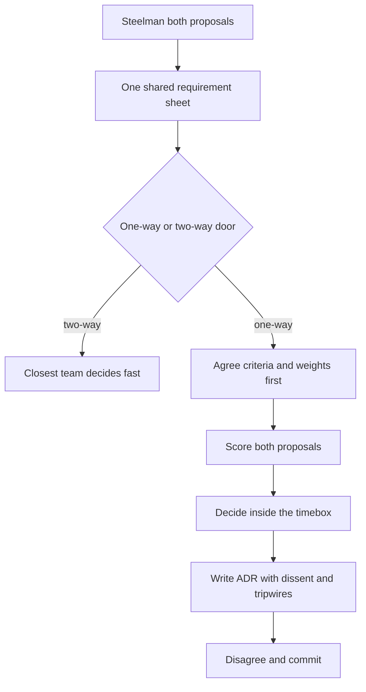
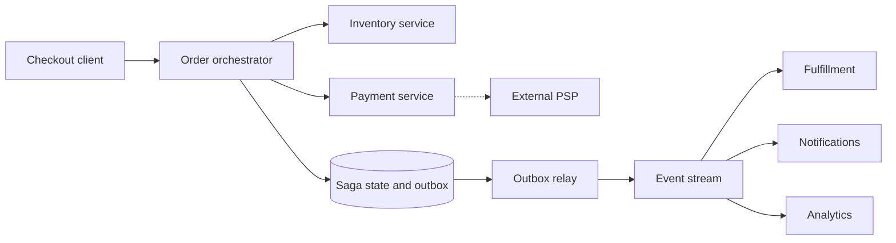

> **This is a named round now.** The documented Stripe EM prompt is *"two of your engineers disagree on architecture — resolve the deadlock"*; Director banks phrase it *"evaluate competing proposals from senior engineers"*; and the standard closer is the 10x / requirements-changed twist. It is not a design question — both proposals are competent, and the interviewer wrote them that way. It scores **how you decide**. Two failure modes, both instant: picking a side in the first five minutes on technical taste ("event-driven is more modern") reads as an IC with a title; refusing to decide ("I'd empower the team to align") reads as a manager who has never carried a one-way door. The Director answer is a **decision process** — extract the shared requirements, agree criteria *before* scoring, classify the door, decide inside a timebox, write the ADR with the dissent recorded, and **name the chosen design's breaking points before the follow-up asks for them**. The verdict matters less than the machinery; run it well and either verdict is defensible.

### Learning objectives
- Run an **adapted RESHADED** spine on a decision, not a system: R extracts the one requirement sheet both proposals must serve, E scores cost and risk in numbers, Evaluation becomes the **weighted criteria matrix**, and Design evolution becomes the **10x stress against pre-named breaking points**.
- Classify decisions as **one-way vs two-way doors** and spend process proportional to reversibility — and learn the highest-leverage move in the genre: **converting a one-way door into a two-way door by buying the migration seam now**.
- Operate the social machinery: **steelmanning**, decision rights (who is the D), the **timebox**, **disagree-and-commit** with the dissent recorded as a named risk with a tripwire metric, and the **ADR** as the durable artifact.
- Adjudicate a genuinely contested worked example — **event-driven choreography vs synchronous orchestration for an order pipeline** — where the loser is right about the future and the winner is right about this team, this year.
- Quantify what a deadlock costs and why "decide fast, record dissent, revisit on tripwires" beats both "decide by seniority" and "wait for consensus."

### Intuition first
Two respected surgeons disagree on how to treat a patient. The bad hospital lets the louder surgeon win, or the senior one, or the one whose technique is newer. The good hospital does something duller: it makes both surgeons agree on **the patient's actual condition and constraints first** — age, comorbidities, urgency — because half of all such disputes turn out to be two doctors treating *different imagined patients*. Then it weighs the options against agreed criteria (survival rate, recovery time, what this team has actually performed before), decides, **writes the reasoning in the chart**, and schedules the follow-up scan that would trigger a change of course. The losing surgeon signs the chart too — not because they agree, but because their objection is *in* the chart, with the symptom that would prove them right.

That's the whole lesson. Architectural deadlocks are rarely technical disagreements; they are **requirements disagreements wearing architecture costumes** (one engineer is designing for the traffic you have, the other for the traffic you might have in three years), or **risk-appetite disagreements** (one prices operational novelty at zero, the other prices it at infinity). The Director's job is not to know which architecture is better — it's to build the room in which the better-*for-us* answer becomes obvious, decide on a clock, and leave a written trail so the decision survives re-litigation, departures, and the 10x day. The chart matters more than the verdict.

And the deadlock itself has a price tag, so the process needs a clock: two staff engineers at $250K loaded spending half their time on a six-week argument is ~$30K of salary — trivial. The real bill is the **blocked workstream**: eight engineers who can't start the pipeline rewrite for a quarter is ~$500K of stalled capacity plus a quarter of market time. An imperfect decision in two weeks beats a perfect one in twelve.

---

## R — Requirements

> **Adaptation, said out loud:** in a product design, R scopes features. Here R is the deadlock-dissolving move itself — **force both proposals onto one shared requirement sheet, with numbers, before any design talk is allowed.** In my experience and in the interview, a third of deadlocks die in this step: the proposals were never answering the same question.

**Anchor scenario (the worked example for the rest of the lesson).** A commerce company, ~120 engineers, 24 of them across four backend teams on the order path. The order pipeline — checkout → inventory → payment → fulfillment → notifications — is a five-year-old monolith being decomposed. Two senior engineers bring proposals:

- **Proposal A — synchronous orchestration.** An order-orchestrator service drives the steps via REST/gRPC calls: reserve inventory → authorize payment → hand to fulfillment; saga state in Postgres; failures compensated by the orchestrator. Familiar stack, explicit control flow.
- **Proposal B — event-driven choreography.** A Kafka backbone; services react to events (`OrderPlaced` → inventory reserves and emits `InventoryReserved` → payment reacts → …). No central coordinator; teams decoupled; downstream consumers (analytics, notifications, search) subscribe for free. (Mechanics of queues and pub-sub are Lessons 3.8–3.9; we don't re-teach them — this lesson is about choosing.)

Both are real architectures running at real companies. That's the point. Now the requirement sheet both must serve, extracted by asking each author *"what requirement does your design serve that the other fails?"* and writing the answers down with numbers:

**Functional:** place order, reserve inventory, authorize payment, route to fulfillment, notify customer; new downstream consumers of order data expected (analytics now, loyalty and search within a year).

**Non-functional — the ones the decision actually turns on:**
- **Volume:** 600K orders/day ≈ 7/s average, daily peak ~35/s, **Black Friday ~140/s**. Write this on the board — Proposal B's author, asked directly, was sizing for 1,400/s "eventually."
- **Latency:** checkout confirmation **p99 < 2s**, of which the external PSP eats 300–800ms — the long pole is not ours.
- **Correctness:** no double-charge, no oversell — idempotency and a consistent money path are non-negotiable (the same invariant discipline as Lesson 5.13).
- **Team capability — a first-class requirement, not a soft factor:** four teams deep in Postgres/REST; **zero production Kafka experience**; on-call is already stretched. A design the team can't operate at 3 a.m. fails an NFR exactly the way a missed latency budget does.
- **Evolvability:** 3-year plan says 5–10× order volume and 3+ new consumer teams of order data.

**What R dissolved:** half the fight. A was designing for 140/s now; B was designing for 1,400/s in three years. Both were *right about their own question*. Now there is one question.

---

## E — Estimation

> **Adaptation, said out loud:** no QPS to derive — E becomes **costing both proposals honestly**, Lesson 1.3 discipline applied to engineering time, run cost, and operational risk. Rough numbers, stated assumptions, no false precision; the matrix in Evaluation consumes these.

**Proposal A — synchronous orchestration:**
- *Build:* 2 engineers × ~6 weeks on the existing stack ≈ **0.25 eng-years (~$60K loaded)**.
- *Run:* rides existing Postgres + service fleet; marginal infra ≈ $0; **no new on-call surface** — the failure modes (timeouts, retries, a saga table) are ones this team already debugs.
- *Throughput sanity:* 140/s peak writing saga state to Postgres is a non-event — a single primary handles thousands of writes/s (Lesson 3.3). At this scale, **neither proposal has a throughput problem; whoever claims otherwise is arguing taste with a capacity costume.** Saying that sentence in the interview is signal.

**Proposal B — event-driven choreography:**
- *Build:* 4 engineers × ~3.5 months — the pipeline *plus* the platform work (topic design, schema registry, DLQs, replay tooling, consumer scaffolding) ≈ **1.2 eng-years (~$300K)**.
- *Run:* managed Kafka (MSK/Confluent tier) **~$4–6K/month**, plus realistically **0.5–1 FTE of streaming-platform ownership** (~$125–250K/yr) — Lesson 8.6's rule: the subscription is never the cost; the operating competence is.
- *Risk premium:* first production Kafka deployment, on the **money path**, under a Black Friday deadline, by a team that has never debugged consumer-group rebalances or event-ordering bugs. Price the first year of incidents honestly: industry pattern for "new paradigm on the critical path" is **2–4 serious incidents in year one**; at ~$50K per revenue-impacting order-path incident, that's a **$100–200K expected risk cost** A doesn't carry.

**The asymmetry, stated:** B costs roughly **5× to build, ~$200–300K/yr more to run, and carries a six-figure first-year risk premium** — and buys decoupling and 10x headroom the requirement sheet says we don't need for ~2 years. A is **~4× faster to production** and lands on existing operational muscle — and creates a central orchestrator that every new consumer must ask for changes, which the 3-year plan says will hurt. Estimation has framed the real trade: **certain cost now vs probable cost later.** That's what the criteria matrix is for.

---

## S — Storage

> **Adaptation, said out loud:** "what persists" here is not order data — it's **the decision itself**. The durable artifact of this entire problem is the **Architecture Decision Record**, and where it lives is a design choice.

ADRs live **in the repo, in git, next to the code they govern** — numbered, immutable, superseded rather than edited. *Rejected — wiki/Confluence pages:* they rot, they're invisible at the moment an engineer is about to violate the decision, and they get edited in place until the original reasoning is gone. A decision record's value is exactly its immutability: eighteen months later, when someone says "why on earth is there a synchronous orchestrator here?", the answer is a two-minute read — context, the options weighed, the dissent, and the tripwires — instead of a re-litigation meeting at ~$2K/hour of staff-engineer time. **Chesterton's fence, with the plaque attached.** The decision log is also the onboarding curriculum and, as we'll see in Design evolution, the script for the 10x conversation: you wrote the answer to the follow-up the day you decided.

---

## H — High-level design

> **Adaptation, said out loud:** the "architecture" of this problem is the **decision process** — the live script you run in the room (and narrate in the interview). Six moves, in order; the order is the design.



**Move 1 — Steelman in writing.** Each author restates the *other* proposal in its strongest form until its owner signs off: "yes, that's my design." One meeting. This kills strawmen ("his design can't handle failures") and, crucially, separates the proposals from the people — from here on the room debates two documents, not two reputations. *Rejected alternative — open-floor debate:* it selects for rhetoric and stamina, optimizes for winning, and burns the relationship you need for commit later.

**Move 2 — One requirement sheet** (the R step above). No design talk until both authors agree on the numbers the design must serve. This is where requirements-disagreements-in-costume die.

**Move 3 — Classify the door.** Bezos's frame, operationalized: a **two-way door** (reversible in weeks at tolerable cost — a library choice, an internal API shape, a caching strategy) gets decided *fast, by the team closest to the work*, and the Director's correct involvement is **none** — running the full process on a two-way door is itself a failure mode that teaches the org that every decision needs a committee. A **one-way door** (a primary datastore, a paradigm on the money path, a public API contract — anything with data gravity or org-wide coupling) gets the full machinery. Our worked example is one-way-*ish*: events on the money path are expensive to retreat from. Hold that thought — Evaluation converts the door.

**Move 4 — Criteria and weights agreed *before* any scoring.** This sequencing is the integrity of the whole process. If the room scores first, the matrix becomes decoration for a decision already made on taste — everyone reverse-engineers weights to make their favorite win. Get both authors to sign the criteria and weights *while they still don't know which design wins*. It's the engineering version of cut-the-cake: one cuts, the other chooses.

**Move 5 — Score, decide, inside a timebox.** Two weeks of structured process for a one-way door, then the designated decider decides **even without consensus**. The deadlock math from the intuition section is the justification: the blocked workstream costs ~$40K/week; consensus is a luxury good.

**Move 6 — ADR + disagree-and-commit.** The dissenter's objection goes *into* the ADR as a named risk with a **tripwire metric** — the observable signal that would prove them right and trigger a revisit. This is what makes commit honest rather than performed: dissent isn't suppressed, it's **scheduled**.

---

## A — API design

> **Adaptation, said out loud:** the "interface" of a decision is **decision rights and the disagreement protocol** — who decides, who's consulted, what escalation looks like, and what "commit" contractually means. Ambiguity here, not technical difficulty, is what produces six-week deadlocks.

```
DecisionProtocol (one-way door):
  roles:                            # DACI, trimmed
    decider:    tech lead / staff eng closest to operating the result
    approver:   Director            # vetoes on budget, risk, strategy only
    consulted:  both authors, the on-call owners, downstream teams
    informed:   everyone else      # via the ADR, not a meeting
  timebox:      2 weeks structured process, then decider decides
  escalation:   no consensus at timebox -> decider decides anyway;
                approver overrides only for budget/risk/strategy
  commit means: dissenter executes the decision at full effort;
                dissent recorded in ADR as named risk + tripwire;
                revisit happens when tripwires fire - not when
                the argument is re-opened in a hallway
```

Two deliberate choices, with their rejected alternatives:
- **The Director is the Approver, not the Decider.** The person who will *operate* the outcome decides; I veto only on budget, risk posture, or strategic conflict. *Rejected — Director-decides:* it scales to exactly one decision at a time, teaches senior engineers their judgment is ornamental, and — the interview tell — signals you'd be the bottleneck of your own org. (You still must show you *can* decide: if the timebox expires and the decider is one of the two authors hopelessly conflicted, the D escalates to you, and you decide that day.)
- **Commit is contractual and tripwire-based.** *Rejected — "let's revisit in Q3":* calendar-based revisits re-open wounds on schedule regardless of evidence. Tripwires re-open the decision **only when reality votes**.

---

## D — Data model

> **Adaptation, said out loud:** the schema here is the **ADR's fields** — what a decision record must capture for the 10x day, the audit, and the new hire. Ten fields, one page; if it's longer, it's a design doc wearing an ADR costume.

An ADR carries: **status** (proposed / accepted / superseded-by-N), **context** (the forces — scale, team, deadline — *as numbers*), the **requirement sheet snapshot**, the **options considered** including the rejected one in its steelmanned form, the **criteria and weights as agreed pre-scoring**, the **decision**, the **consequences accepted** (what we knowingly gave up), the **dissent** (who disagreed and their argument, by name, with their consent), the **tripwires** (metric + threshold → action), and the **pre-named breaking points** of the chosen design. The last two fields are the Director fields — they are what make the ADR a *forward-looking instrument* instead of a justification memo, and they are precisely what the 10x follow-up will test.

<details>
<summary>Go deeper — full ADR template, ready to copy (IC depth, optional)</summary>

```markdown
# ADR-014: Order pipeline — orchestration core with outbox event stream
Status: Accepted (2026-06-11) | Supersedes: — | Superseded by: —

## Context
600K orders/day, 140/s Black Friday peak, p99 confirm < 2s (PSP eats
300–800ms). 4 teams, Postgres/REST-native, zero prod Kafka. 3-yr plan:
5–10x volume, 3+ new consumer teams of order data.

## Options
A. Synchronous orchestration (saga state in Postgres). Steelman: explicit
   control flow, existing ops muscle, 6 weeks to prod.
B. Event-driven choreography on Kafka. Steelman: team decoupling, free
   downstream consumers, 10x headroom, no central chokepoint.

## Criteria & weights (agreed 2026-05-28, before scoring)
Gates: p99 < 2s @ 140/s; money-path correctness. Both pass.
Weighted: time-to-production ×3, operational risk vs team capability ×3,
3-yr evolvability ×2, reversibility ×2, run cost ×1.

## Decision
A's core + transactional outbox publishing domain events to a managed
stream. Money path synchronous; everything after `OrderPaid` event-driven.

## Consequences accepted
Central orchestrator = coupling point; new sync steps need its release
train. Outbox adds one table + relay we must operate.

## Dissent (recorded with consent)
R. Mehta: choreography now avoids a painful migration later; orchestrator
will calcify. Risk acknowledged; see tripwires.

## Tripwires
- p99 confirm > 1.5s for 2 consecutive weeks → revisit step layout
- 3rd team requests sync orchestrator change in a quarter → move them to stream
- sustained > 500/s → partition saga table; revisit money-path design

## Pre-named breaking points
>~5 sync steps breaks the 2s budget; >~3 sync-coupled consumers breaks
team autonomy; ~10x volume stresses saga-table writes and PSP rate limits.
```

</details>

---

## E — Evaluation

> **Adaptation, said out loud:** Evaluation *is* the adjudication — the criteria matrix, applied. This is the heart of the lesson: watch the matrix do something better than crown a winner.

**Gates first (pass/fail, unweighted):** p99 < 2s at 140/s — both pass (the PSP is the long pole either way); money-path correctness — both can be built correctly (B needs idempotent consumers and careful ordering; A needs idempotent steps — Lesson 2.10's idempotency discipline either way). Gates filter; they don't rank.

**The weighted matrix (criteria and weights signed by both authors before scoring; scores 1–5, consensus of the consulted group):**

| Criterion | Weight | A — Orchestration | B — Choreography |
|---|---|---|---|
| Time to production | 3 | 5 (6 weeks) | 2 (3.5 months + platform) |
| Operational risk vs team capability | 3 | 5 (existing muscle) | 1 (first Kafka, money path) |
| 3-yr evolvability to 10x + new consumers | 2 | 2 (orchestrator calcifies) | 5 (built for it) |
| Reversibility | 2 | 3 | 2 (events are sticky) |
| Run cost | 1 | 5 (~$0 marginal) | 3 (~$200–300K/yr) |
| **Weighted total** | | **45** | **29** |

**Now the Director move — interrogate the matrix instead of obeying it.** A wins on *now*; B's entire case is one row: evolvability. So ask the design question the matrix begs: **can we buy B's evolvability inside A's risk profile?** Yes — and it's a standard seam: A's orchestrator writes saga state to Postgres; add a **transactional outbox** in the same commit, with a relay publishing domain events (`OrderPlaced`, `OrderPaid`, `OrderShipped`) to a managed stream. The **money path stays synchronous** — inventory reserve and payment auth, where the user is waiting and the team's muscle lives. **Everything after `OrderPaid` goes event-driven** — fulfillment, notifications, analytics, the future loyalty and search consumers — none of it latency-critical, none of it on the money path, all of it a safe place for the team to *earn* streaming competence before 10x arrives. The rule of thumb worth saying aloud: **synchronous where the user waits; events where they don't.**



**What the hybrid did to the door:** pure A was a one-way-ish door (retrofitting events under 10x load later = open-heart surgery); pure B was a one-way door the team can't yet operate. The outbox **converts the decision into a two-way door** — the event stream is a pre-built migration seam toward B, exercised from day one by non-critical consumers. *That* is the highest-leverage move in this genre: when two strong proposals deadlock, the answer is often not "pick one" but **"pick the cheap one and buy the expensive one's escape hatch."** Cost of the hatch: one table, a relay, a managed-stream starter tier — call it 2 extra weeks and ~$1.5K/month. Cheapest option-premium you'll ever pay.

**And the consequences, owned out loud (Rule 2 — no decision without its critique):** the orchestrator *is* a coupling point — every new synchronous step rides its release train; the outbox relay is a new component that can lag (consumers see `OrderPaid` seconds late — acceptable for fulfillment and email, and we said so in the ADR); and the dissenter is *right* that at 10x the center of gravity must shift to the stream. Which is exactly what the tripwires encode — and why commit was easy to get: **the dissenting design isn't rejected, it's scheduled.** "Your architecture is phase 2; here are the three metrics that trigger it; you'll likely be the one leading it" converts an opponent into the owner of the future.

<details>
<summary>Go deeper — transactional outbox mechanics (IC depth, optional)</summary>

The problem the outbox solves: "write to Postgres AND publish to Kafka" is two systems, no shared transaction — a crash between them either loses the event or emits a phantom. The pattern: in the *same* DB transaction as the state change, insert a row into an `outbox` table (`event_id, aggregate_id, type, payload, created_at, published_at NULL`). A relay (polling `WHERE published_at IS NULL ORDER BY id`, or Debezium-style CDC tailing the WAL) publishes each row to the stream and marks it. Delivery is **at-least-once** — the relay can crash after publish, before mark — so every consumer must be idempotent, keyed on `event_id` (dedupe table or upsert semantics). Ordering: per-aggregate ordering is preserved by partitioning the stream on `aggregate_id` (order ID); cross-aggregate ordering is not promised and shouldn't be relied on. Failure modes to monitor: relay lag (alert on `now() - min(created_at) WHERE published_at IS NULL`), poison events (DLQ after N consumer retries), and outbox-table bloat (prune published rows past a retention window).

</details>

---

## D — Design evolution

> **Adaptation, said out loud:** Design evolution is the **10x follow-up** — the standard closer in this round. The test isn't whether your design survives 10x unchanged (it won't, and claiming so is a red flag); it's whether you **named the breaking points before being asked** and whether the ADR already contains the playbook.

**The interviewer turns the dial: 10x — 6M orders/day, ~1,400/s Black Friday; the org doubles, and the new hires include engineers with real streaming experience.** The answer is a recitation, not an improvisation, because the breaking points were pre-named:

- **Breaking point 1 — the saga table at ~10x writes.** Pre-named at "sustained >500/s." Playbook: partition saga state by order-ID hash (Lesson 2.5 mechanics); the orchestrator is stateless, so it scales horizontally. The PSP's auth rate limit becomes a co-equal constraint — a vendor negotiation, not an architecture change. Neither requires touching the paradigm.
- **Breaking point 2 — the orchestrator as coupling chokepoint.** Pre-named at "3rd team in a quarter requests a sync change." Playbook: **the migration seam is already live.** New consumers were *never* allowed to couple synchronously — loyalty, search, and analytics have been on the stream since month one. At 10x, the shift is to move *more* of the pipeline behind `OrderPaid` and keep the synchronous core down to the two steps where the user genuinely waits. The dissenter's architecture arrives — incrementally, run by a team that has now operated streaming on non-critical paths for two years, led (if you've done your job) by the dissenter.
- **Breaking point 3 — what stays synchronous forever.** Inventory reserve + payment auth. 1,400/s of "reserve, then authorize" is still small for a partitioned Postgres core; the correctness argument from R hasn't changed; eventifying the money path buys decoupling nobody asked for at the price of a consistency model the invariant resists. **Knowing what *not* to migrate is the strong-signal half of the 10x answer.**

**The other twist — requirements changed, not scaled:** say the company pivots to marketplace (third-party sellers, multi-merchant orders). That breaks a *requirement sheet assumption* (single inventory authority), not a scale number — so the move is back to R, not to the whiteboard: re-run the process, write ADR-031, supersede ADR-014, and say explicitly that the old decision was right *for its context*. Decisions don't age into "wrong"; contexts expire. A Director who defends an expired decision out of authorship pride fails this round in real life, too.

**Where I'd delegate (the explicit Director move):** *"The order-platform lead owns the bake-off between CDC-based and polling-based outbox relays and the managed-stream vendor choice; my prior is CDC via Debezium on the existing Postgres because it adds no write-path latency — they own the operational consequences, so they own the call. I keep the criteria process, the door classification, the timebox, and the tripwire review in the quarterly architecture forum."* Keep the machinery; delegate the components.

---

## Trade-offs table — the pivotal decisions

| Decision | Option A | Option B | Option C | Use when... |
|---|---|---|---|---|
| **How the deadlock gets resolved** | **Criteria-first process + timebox + ADR** | Decider-by-seniority (HiPPO) | Wait for consensus | **A** for one-way doors (our choice) — auditable, repeatable, keeps both engineers. **B** is fast but teaches the org that argument quality is irrelevant. **C** caps decision cost at infinity; only for trivially low-stakes calls. |
| **The order pipeline itself** | **Orchestrated core + outbox event stream** | Pure synchronous orchestration | Pure event choreography | **A** (our choice): sync where the user waits, events where they don't, migration seam pre-built. **B** when no downstream consumers are coming. **C** when the team already operates streaming and consumer count is high from day one. |
| **Handling the dissenter** | **Disagree-and-commit + dissent in ADR + tripwires** | Re-litigate until aligned | Overrule and move on | **A** (our choice): dissent becomes scheduled risk review; the dissenter often owns phase 2. **B** burns weeks at ~$40K each. **C** loses the engineer within two quarters — count the $100K+ backfill cost. |

---

## What interviewers probe here (Director altitude)

- **"Two senior engineers are deadlocked. Walk me through what you do."** — *Strong:* a process, in order — steelman, shared requirement sheet with numbers, door classification, criteria-before-scoring, timebox, ADR with recorded dissent and tripwires; names who the decider is (usually not themselves). *Red flag:* jumps straight to which architecture they personally prefer, or "I'd get them in a room to hash it out" with no mechanism.
- **"Which proposal wins, and why?"** — *Strong:* adjudicates on the requirement sheet — 140/s, p99 2s, a team with zero Kafka ops — not on architectural fashion; quantifies the gap (5× build cost, $200–300K/yr run delta, first-year risk premium); then looks for the hybrid that buys the loser's one winning row cheaply. *Red flag:* "event-driven is the modern approach" (taste), or a matrix recited with no interrogation of what it revealed.
- **"Your dissenting engineer is your strongest. They're unhappy. Now what?"** — *Strong:* dissent recorded by name in the ADR as a risk with tripwires; the dissenting design framed as phase 2 with the dissenter as its likely owner; commit defined contractually (full effort, revisit on evidence, not on hallway re-litigation). *Red flag:* "they need to be a team player," or quietly re-opening the decision to appease them.
- **"It's a year later and you were wrong."** — *Strong:* the tripwires fired, the revisit was scheduled by the process not by embarrassment, ADR-014 is superseded not deleted, and the original decision is defended as right-for-its-context. *Red flag:* defensiveness, or "we'd have caught that earlier with more analysis" (the answer that makes every future decision slower).
- **"What does this deadlock cost, and what's your timebox?"** — *Strong:* prices the blocked workstream (~$40K/week here), sets two weeks for a one-way door, and explicitly spends *less* process on two-way doors. *Red flag:* no clock at all, or the same heavyweight process for every decision.

---

## Common mistakes

- **Adjudicating on taste, then building a matrix to justify it.** The tell is scoring before criteria are agreed. Criteria and weights get signed while nobody knows which design wins — that sequencing *is* the integrity of the process.
- **Treating team capability as a soft factor.** A design the team can't operate at 3 a.m. fails an NFR. "Zero production Kafka experience" belongs on the requirement sheet next to the latency budget, with the year-one incident cost priced in.
- **Running the full process on a two-way door** (or letting a one-way door slide through on a hallway nod). Process spend must be proportional to reversibility — committee-ing reversible decisions teaches the org learned helplessness.
- **Disagree-and-commit as suppression.** Commit without the dissent recorded and tripwired is just losing with extra steps; the engineer re-litigates in hallways or leaves. Scheduled dissent is what makes commit real.
- **Claiming the chosen design survives 10x unchanged.** It won't. The strong answer names its breaking points in the ADR on day one and treats the 10x follow-up as a recitation.

---

## Interviewer follow-up questions (with model answers)

**Q1. Both engineers refuse to budge after your two-week process. The timebox expires today. What happens?**
> *Model:* The decider decides today — that's what the timebox is for. Consensus was never the exit criterion; an auditable decision was. The decider is the tech lead who'll operate the result; I'm the approver and I override only on budget, risk posture, or strategic conflict — none of which apply here. Both dissents (if both remain) go into the ADR by name with tripwires. The cost math is the justification: the blocked workstream burns ~$40K/week, and nothing new will be learned in week three that wasn't known in week two — past the timebox we're paying for comfort, not information. If the deadlock pattern *recurs* across decisions, that's a different problem — a missing technical strategy that should be pre-deciding these at the principle level — and that one lands on my desk, not the decider's.

**Q2. Why not just adopt event-driven now? You admit it wins at 10x — you're knowingly building technical debt.**
> *Model:* It's not debt, it's a priced option. Choreography now costs ~5× the build, $200–300K/yr more to run, and a first-Kafka-on-the-money-path risk premium I estimated at $100–200K in year-one incidents — purchased two years before the requirement sheet needs the headroom, operated by a team that hasn't earned the competence. The hybrid buys B's entire evolvability case for ~2 weeks and $1.5K/month: the outbox stream is the migration seam, exercised from day one by non-critical consumers, so the team builds streaming muscle where failure is cheap. When the tripwires fire, we migrate incrementally with operators who've run the substrate for two years. Pre-buying capability ahead of both the requirement and the team is how platform bets die — I'd rather pay a small option premium than a large insurance premium on a risk we don't yet have.

**Q3. Your criteria matrix scored A at 45 and B at 29. Doesn't that make the decision mechanical — why do we need you?**
> *Model:* The matrix is an argument-structurer, not a decider — three reasons it can't be mechanical. First, the weights are judgment: weighting operational risk ×3 versus evolvability ×2 *is* the decision, encoded; my job is making the room own those weights before scoring, while the outcome is unknown. Second, the matrix's real output wasn't the totals — it was the shape: B's case lived in a single row, which is what prompted "can we buy that row cheaply inside A?" A mechanical reading picks A and walks away; the interrogated reading produced the hybrid, which beat both pure options. Third, matrices are gameable — score-stuffing by an invested author is normal human behavior, which is why criteria are signed first and scores are set by the consulted group, not the authors. The matrix makes the judgment auditable. It doesn't replace it.

**Q4. A year in, the `OrderPaid` consumer fleet has grown to eight teams and two of them are demanding stronger ordering and exactly-once delivery. Re-decide?**
> *Model:* First check which document this challenges. The requirement sheet promised at-least-once with per-order ordering — that's what an outbox on a partitioned stream gives (consumers idempotent by `event_id`). Two teams wanting exactly-once is a new requirement, so it goes through the process, not through a hallway: what do they actually need? Nine times out of ten "exactly-once" means "my side effects fired twice," which idempotent consumers fix for the cost of a dedupe key — I'd have their tech leads bring the concrete duplicate-driven failure, and my prior is that idempotency closes it. If a genuine end-to-end transactional need survives that scrutiny — say, financial ledger consumers — that's a scoped sub-decision (transactional stream features or a dedicated ledger pipeline) for those two consumers, not a re-platform of eight. The tripwire that *would* reopen ADR-014 is sync-coupling pressure on the orchestrator, and that one, notably, never fired — the stream absorbed all eight teams.

---

### Key takeaways
- **Deadlocks are usually requirements disagreements in costume.** The first move is one shared requirement sheet with numbers — half the fight dies when both proposals must answer the same question (140/s now vs 1,400/s someday).
- **Criteria before scoring, signed while the outcome is unknown** — that sequencing is the integrity of the process. Then interrogate the matrix: when the loser's case is one row, buy that row cheaply inside the winner (orchestrated core + outbox stream = B's evolvability at A's risk).
- **Spend process proportional to reversibility.** Two-way doors: closest team decides fast, Director stays out. One-way doors: full machinery, two-week timebox, then the decider decides without consensus — the blocked workstream costs ~$40K/week.
- **Disagree-and-commit is contractual:** dissent recorded by name in the ADR with tripwire metrics; the revisit is scheduled by evidence, not by hallway re-litigation — and the dissenting design is often phase 2, with the dissenter as its owner.
- **Name the breaking points the day you decide.** The 10x follow-up should be a recitation of the ADR (partition saga state; shift gravity to the pre-built stream; keep the money path synchronous), not an improvisation. Team capability is an NFR; superseded ADRs were right for expired contexts.

> **Spaced-repetition recap:** Competing proposals = a **process problem, not a taste problem**. Script: steelman → one requirement sheet with numbers → classify the door (one-way = full process, two-way = decide fast) → **criteria + weights signed before scoring** → timeboxed decision → **ADR with dissent + tripwires** → disagree-and-commit. Worked verdict: sync orchestration beats choreography for a 140/s, zero-Kafka team — then **buy the loser's evolvability via a transactional outbox** (sync where the user waits, events where they don't), converting a one-way door into a two-way one. 10x answer = recite the pre-named breaking points.

---

*End of Lesson 8.9. The Ticketmaster lesson (5.13) taught you to co-design a shard key with a queue; this one teaches you to co-design a decision with its own revisit — the ADR's tripwires are to architecture choices what the waiting room was to the hot shard: the mechanism that makes an otherwise dangerous commitment safe. Same Director instinct throughout Module 8: the artifact that matters is rarely the diagram — it's the requirement sheet, the criteria, and the written record that lets the org change its mind cheaply.*
