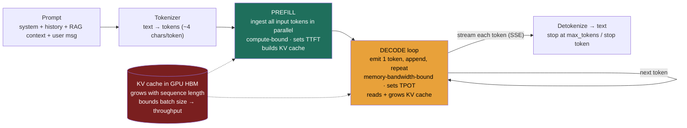

### Learning objectives
- Describe an LLM at **architecture altitude**: a frozen, **stochastic, stateless, token-metered** next-token predictor you *compose*, not train, and say what each of those four words costs you in a design.
- Reason in **tokens**: estimate token counts, explain why the **context window** is a finite, shared input+output budget, and why "just use a bigger context" is not free.
- Separate **prefill from decode** and use that split to predict latency, **TTFT** (time to first token) vs **TPOT** (time per output token), and why streaming changes the felt latency without changing the real one.
- Build the **cost model** from tokens, know that **output is the lever you control**, and that long prompts/RAG context quietly dominate the *input* bill.
- Name the **failure modes** a designer must engineer around, hallucination, knowledge cutoff, non-determinism, prompt sensitivity, context overflow, before reaching for any framework.

### Intuition first
An LLM is a **brilliant, improvising contractor with no memory and a per-word meter running**. Hand it a description of the job and it produces fluent, usually-excellent work, one word at a time, never pausing to check a fact it can't see. But the moment the conversation ends it forgets you completely: next time you must re-hand it *everything* it needs to know, because it kept no notes. And every word in and every word out is on the meter.

That single image carries most of the design consequences. **No memory** means every "remembered" fact, the chat history, the retrieved document, the user's profile, is something *you* re-send on every call (the whole reason memory and RAG exist as systems). **Improvises one word at a time** means it can sound completely certain while being wrong, and that the second half of a long answer costs more than the first. **The meter** means your bill scales with how much you say to it and how much you let it say back, not with how many servers you rent. Get this intuition right and the rest of the GenAI module is detail.

### Deep explanation

**An LLM is a next-token predictor, and that is the whole machine.** Under the hood it is a transformer trained on a large corpus to answer one question repeatedly: *given all the tokens so far, what is the most likely next token?* It emits one token, appends it to the input, and asks again, **autoregressively**, until it emits a stop token. Everything you experience as reasoning, formatting, or tool use is that loop plus a good prompt. The Director-altitude statement: *you are not building a model, you are composing a frozen function that maps a token sequence to a probability distribution over the next token.* The weights were trained once and are fixed at inference; you adapt behavior with **context** (retrieval and prompting), not by changing the model.

Four properties of that function drive every architecture decision:

- **Stochastic.** It samples from a probability distribution, so the same prompt can yield different outputs. You **reject** "the model will return the same JSON every time" as a design assumption; you validate and constrain output instead.
- **Stateless.** A call carries no memory of prior calls. **All** conversational state is context you resend. This is liberating (any replica serves any request, like a stateless web tier) and expensive (you pay to resend history every turn).
- **Token-metered.** Cost and the context limit are denominated in tokens, not requests or megabytes. You design in tokens.
- **Frozen + cut off.** Its knowledge ends at a training cutoff and doesn't update. Anything newer or private must be supplied at call time (→ RAG).

**Tokens are the unit of everything.** Models don't see characters or words; they see **tokens**, subword chunks produced by a byte-pair-encoding tokenizer. A useful back-of-envelope: **~4 characters per token, ~0.75 words per token, so ~750 words ≈ 1,000 tokens.** Code, rare words, and non-English text tokenize less efficiently (more tokens per word). You estimate token budgets the way you estimate QPS and storage elsewhere in this course: roughly, out loud, with stated assumptions. A 20-page document is ~10–12k tokens; a paragraph of chat is ~100–200 tokens; a typical system prompt is a few hundred.

**The context window is a finite, shared budget, and bigger is not free.** The context window is the maximum number of tokens the model can attend to in one call, **input and output drawn from the same pool.** In 2026 the common working range is **~128k–200k tokens**, with frontier models advertising **1M+**. It is tempting to treat a huge window as "just put everything in," but three costs bite:

1. **Money** scales with input tokens, so stuffing 500k tokens of context into every call is a real line item.
2. **Latency** scales with prompt length (prefill, below), so a giant prompt slows TTFT.
3. **Quality** degrades with a "**lost in the middle**" effect, relevant facts buried in the center of a very long context are attended to less reliably than facts at the start or end.

So the design question is rarely "how big is the window" but "**what is the smallest, best-ordered context that answers this?**", which is exactly what retrieval and context management solve. You **reject** "give it the whole corpus in a 1M context" in favor of "retrieve the right 5k tokens," and you can defend it on cost, latency, *and* accuracy.

**Prefill vs decode is the single most important serving fact, and it explains latency.** A generation has two phases with opposite performance characteristics:

- **Prefill**: the model ingests the entire prompt at once and builds its internal attention state. This is **highly parallel and compute-bound**, the GPU chews the whole prompt in one or a few big matrix operations. Prefill time grows with **prompt length**.
- **Decode**: the model generates output **one token at a time**, and each new token must read the model weights and all prior attention state. This is **sequential and memory-bandwidth-bound**, you can't parallelize across the tokens of a single response. Decode time grows with **output length**.

That asymmetry is why a model can start answering a short question almost instantly but take seconds to finish a long one, and why a 50-page prompt slows the *first* word but a 2,000-token answer slows *every* word after it. (The serving consequences, batching, the KV cache, GPU economics, come in the inference and LLM-serving lessons.)

**The KV cache is the memory tax that bounds throughput.** To avoid recomputing attention over the whole sequence for every new token, the model caches per-token key/value attention state, the **KV cache**. It is held in fast GPU memory and **grows linearly with sequence length** (prompt + generated so far). It matters to designers for one reason: KV cache competes with model weights for scarce GPU memory, so **long contexts and many concurrent requests fight for the same HBM**, which is what caps batch size and therefore throughput and cost (developed in the inference and LLM-serving lessons).

**The latency model falls straight out of prefill/decode.** Model the user-perceived latency as:

> **Total ≈ TTFT + (output_tokens × TPOT)**

- **TTFT (time to first token)** is dominated by **prefill**, so it grows with **prompt/context length** (and queueing). Ballpark: **a few hundred ms to a couple of seconds.**
- **TPOT (time per output token, a.k.a. inter-token latency)** is dominated by **decode** and the model's size. Ballpark: **~10–50 ms/token**, i.e., roughly **20–100 tokens/sec** of streamed output.

**Streaming changes the felt latency, not the real latency.** Because decode is token-by-token, you can stream tokens to the user as they're produced (SSE). The user sees words appear after one TTFT instead of waiting the full `TTFT + N×TPOT`, even though total time is unchanged. The Director-altitude statement: *streaming is a UX lever over the decode tax; it doesn't make generation faster, it makes the wait legible.* You **reject** non-streaming for interactive chat (it forces the user to stare at a spinner for the full generation) and **accept** it for batch/async jobs where there's no human watching.

**The cost model is tokens in plus tokens out, and the two levers behave differently.** You pay per **input token** and per **output token**, almost always at **different prices, output is typically several times dearer per token than input** (because decode is the expensive phase). Two consequences most candidates miss:

- **Output length is the lever you directly control**, cap it, ask for terse answers, use structured output, and you cut the most expensive tokens.
- **Input cost is quietly dominated by context you bolt on**, long system prompts, chat history, and especially **RAG context** can make *input* tokens the larger half of the bill even though each costs less, because there are far more of them.

Order-of-magnitude in 2026: frontier-model **output** runs on the order of **single-digit to low-tens of dollars per million tokens**, small/efficient models roughly **an order of magnitude cheaper**. Exact prices move monthly and vary by provider, so quote ranges and **design the cost model, not the price**. The structural fact that doesn't move: **LLM cost scales with usage (tokens), not with provisioned capacity**, the opposite of a fixed server fleet, which is why an LLM feature can be cheap in a demo and ruinous at scale.

**The failure modes you must design around (before any framework).** These are not edge cases; they're properties of the machine:

- **Hallucination**: fluent, confident, plausible, and wrong. The model optimizes for likely-sounding tokens, not truth. Mitigate with grounding/citations (RAG) and evaluation; never assume output is correct.
- **Knowledge cutoff / staleness**: the model knows nothing past training and nothing private. Anything fresh or proprietary must be supplied at call time (RAG, tools).
- **Non-determinism**: same prompt, different output. Even at temperature 0 you should not contract on bit-exact reproducibility. Validate and constrain, don't assume.
- **Prompt sensitivity**: small wording changes shift behavior; treat prompts as versioned artifacts under eval.
- **Context overflow**: exceed the window and the call fails or silently truncates. You must budget and manage context.

Go deeper, tokenization, sampling, and why temperature 0 still isn't deterministic (IC depth, optional)

- **Tokenization**: BPE merges frequent byte/character pairs into a fixed vocabulary (tens of thousands of tokens). Common English words are often one token; rare words, code symbols, and other scripts split into many. This is why a 1,000-"word" non-English document can cost far more than 1,333 tokens, and why token-counting (not word-counting) is the only reliable budget.
- **Sampling**: the model outputs a probability distribution (logits → softmax) over the vocabulary; **temperature** flattens (high) or sharpens (low) it, **top-p/top-k** truncate the candidate set. Temperature 0 = greedy (always take the argmax), which *feels* deterministic.
- **Why even temperature 0 drifts**: floating-point non-associativity across GPU kernels, variable batching, mixture-of-experts routing, and backend version changes can change the argmax tie-breaks. The practical rule for a designer: **never make correctness depend on identical output**, dedup on a stable key and validate structure instead (the same instinct as idempotency in the business-domain HLDs).
- **Embeddings vs generation**: the same transformer family also produces *embeddings* (a single vector per input) used for search and memory, a different output mode of the same underlying machinery.

### Diagram: the request lifecycle of one LLM call

### Worked example: a customer-facing support assistant

Take an in-product assistant that answers from a help center. Each turn assembles **a system prompt (~400 tokens) + 4 retrieved help articles (~2,600 tokens) + short chat history (~500 tokens) + the user's question (~100 tokens) ≈ 3,600 input tokens**, and produces a **~300-token answer**.

- **Latency.** Prefill of ~3,600 tokens gives a **TTFT of roughly 0.4–0.8 s**. Decode at ~25 ms/token over 300 tokens is **~7.5 s of generation**, but because we **stream**, the user sees the first words at ~0.5 s and reads as it flows, the felt latency is "instant start, smooth stream," not "8-second spinner." Rejected alternative: non-streaming, which would make the user wait the full ~8 s staring at nothing.
- **Cost.** With illustrative prices of $3/1M input and $15/1M output: input = 3,600 × $3/1e6 ≈ **$0.0108**; output = 300 × $15/1e6 ≈ **$0.0045**; **~$0.015/turn.** Note the teaching point: **the RAG context made *input* the larger half of the bill** even though output is 5× dearer per token, because there are 12× more input tokens. The cheapest win here is **retrieve 2 articles instead of 4** (halving input), not "use a cheaper model."
- **Scale.** At 1M turns/day that's **~$15k/day ≈ $450k/month**, and it scales linearly with usage. That number, derived in tokens, is what a Director brings to the build-vs-buy and routing conversation, not "it'll scale."

Every lever, context size, output cap, streaming, model choice, falls out of this token model, which is why you build it first.

### Trade-offs table: the two first-order model decisions

| Decision | Option A | Option B | Use when… |
|---|---|---|---|
| **Model size** | **Small / efficient model** (cheaper/token, lower TPOT, weaker reasoning) | **Large frontier model** (best quality, dearer, higher TPOT) | **A** for high-volume, well-scoped, latency-sensitive tasks (classification, extraction, simple Q&A); **B** for hard reasoning, ambiguous tasks, or where a wrong answer is costly. Route between them. |
| **Context length** | **Short, retrieved context** (~few k tokens) | **Long / full-document context** (tens–hundreds of k) | **A** as the default, cheaper, faster TTFT, and *more accurate* (avoids lost-in-the-middle); **B** only when the task genuinely needs the whole document at once and retrieval can't scope it. Bigger context is a cost/latency/quality trade, not a free upgrade. |

### What interviewers probe here
- **"Why does a long response take a while to *finish* but a short one starts almost instantly, regardless of length?"**, *Strong signal:* separates prefill (parallel, compute-bound, sets TTFT, grows with prompt) from decode (sequential, memory-bandwidth-bound, sets TPOT, grows with output); notes streaming hides decode latency. *Red flag:* "the model is just slow," no phase distinction.
- **"Where does the cost actually come from, and what would you cut first?"**, *Strong:* cost = input + output tokens at different prices; output is dearer per token but long context (RAG/history) often dominates the *input* bill; cut output length and trim retrieved context before swapping models. *Red flag:* "add a cache" with no token model, or assuming cost scales with servers.
- **"Is the model deterministic? Can I rely on identical output?"**, *Strong:* no, it's stochastic; even temperature 0 isn't bit-exact across backends; validate/constrain output and dedup on stable keys rather than assuming reproducibility. *Red flag:* designing a pipeline that breaks if the model returns slightly different text.
- **"You have a 1M-token context window, why not just put the whole knowledge base in every prompt?"**, *Strong:* cost (input tokens), latency (prefill), and accuracy (lost-in-the-middle) all argue for retrieving the smallest right context; bigger window is a tool, not a strategy. *Red flag:* treating a big window as a substitute for retrieval.

The through-line at Director altitude: reason in **tokens**, predict latency from **prefill/decode**, and price features from the **token cost model**, then delegate the kernel-level serving details with a stated prior ("I'd have the platform team validate TPOT under our batch settings; my prior is we're decode-bound").

### Common mistakes / misconceptions
- **Treating the LLM as deterministic** (a stable API that returns the same bytes). It's stochastic; build validation and idempotency around that, don't assume it away.
- **Confusing the model with the product.** The frozen model knows nothing fresh or private; "the AI is wrong about our pricing" is almost always a *context* problem (no RAG), not a model problem.
- **Reasoning in words/requests instead of tokens.** The window, the cost, and the latency are all in tokens; a word-based estimate misleads, especially for code and non-English.
- **Assuming a bigger context window is a free upgrade.** It costs money (input tokens), latency (prefill), and accuracy (lost-in-the-middle). Retrieve, don't stuff.
- **Ignoring that output tokens are the expensive, controllable lever.** Uncapped, verbose generation is the silent cost driver; cap and structure output.

### Practice questions

**Q1.** A chat feature's p95 latency is fine for short replies but users complain long answers "take forever to load." A teammate proposes a faster network and a bigger instance. What's actually happening and what do you change?
> *Model:* It's **decode**, not network or CPU. Long answers generate token-by-token at ~10–50 ms/token, so a 1,500-token answer is ~15–40 s of generation regardless of bandwidth. Two fixes that actually move it: **(1) stream tokens (SSE)** so the user reads from the first token (~one TTFT) instead of waiting for the whole response, fixing *felt* latency; **(2) cap and tighten output** (shorter answers, structured format) to cut the real decode time. A bigger instance helps prefill/TTFT and throughput, not the per-token decode wall. The teammate is optimizing the wrong phase.

**Q2.** Estimate the monthly token cost of an assistant: 500k requests/day, ~4k input tokens/request (system + RAG), ~400 output tokens. Then name the cheapest lever.
> *Model:* Input: 500k × 4k = 2.0B input tokens/day. Output: 500k × 400 = 0.2B output tokens/day. At ~$3/1M in and ~$15/1M out: input ≈ 2,000 × $3 = **$6,000/day**; output ≈ 200 × $15 = **$3,000/day**; **~$9k/day ≈ $270k/month.** The cheapest lever is **trimming the 4k input context** (it's two-thirds of the bill): fewer/better-ranked retrieved chunks and a leaner system prompt cut the dominant cost, before considering a cheaper model or caching.

**Q3.** Your extraction pipeline parses the model's JSON output and breaks ~1% of the time in production. Root cause and design fix?
> *Model:* The model is **stochastic**, occasionally it emits prose around the JSON, a trailing comma, or a slightly different shape. The fix is to stop assuming determinism: use the provider's **structured-output/JSON-schema mode** to constrain generation, **validate against a schema** on receipt, and **retry or repair** on failure, treating model output as untrusted input (the same posture as user input, and a precursor to agent action safety). Never let a downstream system assume the bytes are identical run-to-run.

**Q4.** Leadership asks, "we have a 1M-token context model now, can we drop the vector database and just send the whole knowledge base each time?" How do you respond?
> *Model:* No, and here's the math: sending, say, 800k tokens of context per request at ~$3/1M is ~$2.40 *per request* in input cost alone, plus a multi-second prefill TTFT, plus degraded accuracy from lost-in-the-middle. Retrieving the right ~5k tokens costs a fraction of a cent, answers faster, and is *more* accurate. The big window is useful for genuinely whole-document tasks; it is not a substitute for retrieval. I'd keep RAG and use the long window selectively.

### Key takeaways
- **An LLM is a frozen, stochastic, stateless, token-metered next-token predictor.** You compose it with context; you don't train it. Every "memory" is context you resend, every interaction is on the token meter.
- **Reason in tokens** (~4 chars/token; ~750 words ≈ 1k tokens). The **context window** is a finite, shared input+output budget, and a bigger one costs money, latency, and accuracy, so retrieve the smallest right context rather than stuffing.
- **Prefill (parallel, compute-bound) sets TTFT; decode (sequential, memory-bandwidth-bound) sets TPOT.** Latency ≈ TTFT + output_tokens × TPOT (~10–50 ms/token). Streaming hides the decode wait without removing it.
- **Cost = input + output tokens at different prices** (output dearer per token, but long RAG/history context often dominates the input bill). Output length is your direct lever; cost scales with **usage, not provisioned capacity**.
- **Design around the failure modes**, hallucination, staleness/cutoff, non-determinism, prompt sensitivity, context overflow, with grounding, evaluation, and output validation, never by assuming the model is correct or deterministic.

> **Spaced-repetition recap:** The LLM is a brilliant contractor with no memory and a per-word meter. **Tokens** are the unit of cost and of the **context window** (shared input+output; bigger isn't free, money + latency + lost-in-the-middle). **Prefill** is parallel/compute-bound and sets **TTFT** (grows with prompt); **decode** is sequential/memory-bound and sets **TPOT** (~10–50 ms/token, grows with output); total ≈ TTFT + N×TPOT, and **streaming** hides the decode wait. **Cost = tokens in + tokens out** (output dearer per token, long context dominates input), scaling with **usage not servers**, output length is the lever. It's **stochastic, stateless, frozen**, so plan for hallucination, staleness, non-determinism, and overflow. Next: embeddings turn meaning into geometry so you can retrieve the right context cheaply.
