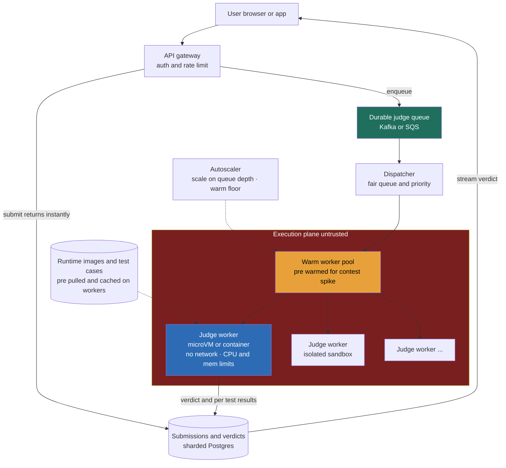

> **Why this gets asked at Director level:** Most system-design problems are about moving data fast. This one is about running *someone else's program* — code written specifically to break out of your box — and surviving a contest start where 100,000 submissions land in three minutes. The Director signal is not reciting cgroup flags; it is framing the isolation choice as a **blast-radius-vs-cost-vs-latency** trade, naming the viable answers (hardened containers, microVMs) with their failure modes, and seeing that the *same* shape generalizes to CI runners, FaaS, and AI-agent sandboxes. The canonical failure is "just spin up a Docker container per submission" without pricing the cold start or naming what a kernel exploit reaches. Asked rising-fast at Meta (Product Architecture, HARD tier), Coderpad, and HackerRank — and increasingly anywhere that runs agent-generated code.

### Learning objectives

1. Run the **RESHADED** spine on a problem whose crux is **executing untrusted code safely under burst load**, not a read:write ratio — and state that adaptation out loud.
2. Choose an **isolation strategy** (container vs microVM vs language sandbox) by trading **blast radius against cold-start latency and density/cost**, naming the rejected alternative.
3. Size the **contest-spike burst** (100k submissions in minutes) and show why a **warm worker pool** — not reactive autoscaling — is the load-bearing decision (ref 5.15).
4. Design the **async judging pipeline** — submit returns instantly, a queue feeds an isolated worker fleet, results stream back — and place resource limits where they bind.
5. Operate at **Director altitude:** own the cost-per-execution line, name the blast radius precisely, delegate the sandbox internals with a stated prior.

### Intuition first

Imagine you run a testing lab where strangers mail you machines and ask you to press the power button. Some are ordinary; some are rigged to catch fire, drill through the wall into the next lab, or quietly phone home with what they find — and you can't inspect them all first. So you build **blast chambers**: each machine runs in its own sealed room with a fuse that cuts power after ten seconds, a meter that trips on overdraw, and walls rated for how bad the worst machine could be. The whole business is a trade-off between **how strong you build each chamber** (a bunker is safe but slow and expensive to prepare) and **how fast and cheaply you cycle strangers through** (a curtain is instant and dense but one bad machine torches the building).

That is the online judge. A submission is an untrusted machine; the chamber is your **isolation boundary**; the fuse and meter are your CPU-time and memory limits; the wall rating is your **blast radius** — what a hostile submission reaches if it breaks out. And twice a week, at a contest start, ten thousand strangers show up *in the same minute*. There's no read:write skew here. The skew is **trusted control plane vs untrusted execution plane**, and the resource that runs out first is **safe, warm capacity to run code**.

---

## R — Requirements

> Pin the scope, and state the load-bearing fact out loud: this is not a CRUD app with a code field. The entire architecture exists to **run adversarial code safely, fast, at burst.**

**Clarifying questions I'd ask (with assumed answers):**
- *Who writes the code we run?* → **Anonymous, untrusted, sometimes actively malicious** users. This is the whole problem — not "a feature."
- *Steady drip, or contest spikes?* → **Contests are the design driver.** Steady submissions are trivial; a weekly contest start is **100k submissions in ~3 minutes.**
- *What languages?* → **~15** (C++, Python, Java, Go, Rust, …); each needs a different runtime image — an operational fact, not a footnote.
- *Verdict latency?* → **p95 < ~5 s** end-to-end; judging itself is bounded by the problem's time limit (often 1–2 s of CPU).
- *Is a wrong verdict acceptable?* → **No.** The same code + tests must yield the same verdict (ref 9.6's determinism discipline), and one user's run must never affect another's.

**Functional requirements:**
1. **Submit** code (language + source + problem id); get an instant acknowledgement.
2. **Compile and run** against a hidden test suite, inside isolation, under CPU/memory/time limits.
3. **Return a verdict** (Accepted / Wrong Answer / TLE / MLE / Runtime Error / Compile Error) with per-test detail, streamed as known.
4. **Run contests** — leaderboards, rate limits, fair queueing under spike.
5. **Resource-limit and sandbox** every execution; clean teardown, no residue.

**Explicitly CUT (scoping *is* the signal):** the problem-authoring CMS, the editor frontend, forums, billing, plagiarism detection, recommendations. I scope to **submit → queue → isolated judge → verdict**, plus the contest burst path, and say so.

**Non-functional requirements:**
- **Isolation / security first** — untrusted code must not escape its sandbox, read other users' data, exhaust the host, or reach the network. This is the cardinal invariant; everything else bends to it.
- **Burst tolerance** — absorb a 100k-in-3-min contest spike without melting or starving normal traffic.
- **Low, predictable latency** — p95 verdict < ~5 s; cold-start of the sandbox must not dominate that budget.
- **Cost-bounded** — judging is **compute-per-execution**; idle warm capacity and per-run overhead are the budget a Director owns.
- **Fairness** — one user (or one infinite loop) can't monopolize the fleet; contest and practice traffic isolated.

**The skew that matters, stated.** There's no database read:write skew worth designing around — the durable writes are tiny and off the hot path. The asymmetry is **trusted control plane (API, queue, results — ordinary web infra) vs untrusted execution plane (judge workers running adversarial code).** The control plane is a solved problem; the execution plane is the entire question. The scarce resource isn't QPS or storage — it's **warm, isolated capacity to safely execute code**, which is why isolation strategy and burst economics dominate.

---

## E — Estimation

> **Spine adaptation:** Estimation here is **burst-capacity math**, not steady QPS. The headline isn't an average — it's the contest spike and the **warm-pool size** that tames it.

**Assumptions:** ~200k submissions/day steady; one weekly contest with ~150k participants; ~30 test cases each; per-run CPU ~1–2 s; ~15 runtime images.

**Steady judging QPS:** `200k ÷ 86,400 ≈ 2.3/s`; peak ~5× → **~12/s.** A trivial fleet — *the trap.* "A few container hosts" feels fine, then dies at the contest start.

**The contest spike (the real headline).** A huge fraction of ~150k contestants submit in the **first 3 minutes** → **~100k in 180 s ≈ ~550 submissions/s**, spiking to ~1,000/s at `t=0`. Each submission holds a worker for **compile + ~30 tests × ~1–2 s ≈ ~10 s.** By Little's Law, concurrency = arrival × hold: `550/s × 10 s ≈ ` **5,500 concurrent executions** at the sustained spike, higher instantaneously. *This is the number the fleet is sized against — not the 12/s steady rate.*

**Why warm capacity is the lever.** A microVM cold-starts in ~125 ms; a fresh container with a cold runtime image takes 2–5 s — reactive scaling then *adds the cold start to every verdict during the spike*, blowing the 5 s p95. So you **pre-warm a pool for the spike**: ~5,500 slots at ~8 executions/host → **~700 warm hosts during contest windows**, scaled to a ~20–30 floor the other ~95% of the week. **The ~50× peak-vs-average gap is the cost conversation** (same shape as the GPU warm-pool in 5.15).

**Storage & cost (small bytes, real spend on capacity).** Submissions + verdicts are `200k/day × ~3 KB ≈ ~80 GB/yr` — a rounding error; test cases are tens of GB, cached on workers. A judged submission is ~$0.0001 of raw compute (~10 s at ~$0.04/vCPU-hour), so the **warm-pool idle cost dominates** — ~700 hosts for a ~3-hour weekly window plus the floor. Honest framing: **per-execution compute is nearly free; safe, warm, burst-ready capacity is what you pay for.**

**What estimation decided:** steady load is trivial; the contest spike (~5,500 concurrent) is everything; **warm-pool sizing for the spike** is the load-bearing call; the cost is idle warm capacity, not bytes. The numbers say *pre-warm, don't react.*

---

## S — Storage

> Three data classes; the interesting "store" is the **runtime image + test-case distribution to workers**, not a database.

**1. Submissions + verdicts (durable, small, control plane).** A **sharded relational store (Postgres/MySQL)**, sharded by `user_id`; verdicts are an append/update keyed by `submission_id`. *Rejected — a heavyweight distributed DB:* the data is ~80 GB/yr; reaching for Spanner/Cassandra solves a scale problem you don't have while ignoring the one you do (isolation).

**2. Runtime images + test cases (must be local to the worker before it runs).** **Pre-baked, pre-pulled runtime images** (one per language) cached on every warm worker, and **test cases in S3 with an aggressive local cache.** The image is *already on the host* when a submission arrives. *Rejected — pulling the image on demand:* turns a 125 ms cold start into seconds and re-introduces the exact tax warm pools exist to kill.

**3. The work queue (transient, the backpressure point).** A **durable queue — Kafka or SQS** — between submit and the judge fleet. Durable (unlike 5.15's in-memory queue) because a submission is a *contest entry* — losing it is unacceptable; replay on crash is required. *Rejected — synchronous judging:* couples the user's connection to a 10 s adversarial execution, and at 1,000/s the spike exhausts connection pools.

**Results delivery:** verdict updates pushed to the client via **SSE or polling** — best-effort, off the durable path.

---

## H — High-level design

> The shape to make visible: a **trusted control plane** (API, durable queue, results) feeding a **warm, isolated execution plane** running adversarial code behind a hardened boundary.



**Happy path, compressed:** the API authenticates, rate-limits, writes the submission row, **enqueues** the job, and returns `202` instantly — the connection never blocks on execution. The **dispatcher** pulls from the durable queue with fair-share/priority (contest jobs don't starve practice) and hands the job to a **warm worker** that already holds the runtime image and test data locally. The worker spins up an **isolated sandbox** (microVM or container) — **no network**, strict **CPU-time / memory / wall-clock limits**, read-only FS — compiles, runs the test cases, captures the verdict, **tears the sandbox down** (fresh per run, no residue), and writes per-test results back. The verdict streams to the user as tests complete.

**The shape to notice:** the load-bearing wall runs between the **trusted control plane** (ordinary, scalable, durable) and the **untrusted execution plane** (the red box — every isolation and resource-limit decision lives here). The queue + warm pool keep work crossing that wall at a rate the execution plane can safely serve.

---

## A — API design

> Small surface; the **async submit + streamed verdict** shape *is* the correctness story.

```
# Submit code (async — returns immediately)
POST /v1/submissions
  headers: { Authorization: Bearer <token> }
  body: { problemId, language: "cpp", source: "...", contestId? }
  -> 202 { submissionId, status: "queued" }
  -> 429   if over rate limit (per user / per contest)

# Poll or stream the verdict
GET  /v1/submissions/{submissionId}
  -> 200 { status: "running" | "accepted" | "wrong_answer" | "tle" | ...,
           passedTests, totalTests, results: [{ test, verdict, timeMs, memKb }] }

# Stream verdict as tests complete (SSE)
GET  /v1/submissions/{submissionId}/stream   (text/event-stream)
  data: { test: 1, verdict: "passed", timeMs: 42 }
  data: { test: 2, verdict: "passed" }  ...
  data: { status: "accepted", passedTests: 30, totalTests: 30 }

# Contest leaderboard (cached, eventual)
GET  /v1/contests/{contestId}/leaderboard  -> 200 { rankings: [...], asOf: <ts> }
```

**Design notes (each with its rejected alternative):**
- **Submit is async (`202`), never synchronous.** *Rejected: block the HTTP call until the verdict* — a 10 s adversarial execution on the request connection means the contest spike exhausts the connection pool before any judging happens. Decoupling submit from judging is the load-bearing API decision.
- **Verdict streams per-test.** *Rejected: one final blob.* "Failed on test 7 of 30" lets the worker **fail fast** (stop on first failure) and the user see progress — a UX and a cost win.
- **Rate limit per user *and* per contest.** *Rejected: trusting clients.* Without it one script floods the queue; the limit is the fairness NFR, enforced before the job reaches a worker.
- **The leaderboard is explicitly eventual** (`asOf`) — cached, never read from the hot judging path.

---

## D — Data model

> The schema is small and unremarkable — *which is the point.* The hardness is in the execution plane, not the data layer. The load-bearing field is the **resource-limit envelope** on each job.

**`submissions`** — PK `submission_id`, shard key `user_id`; carries `problem_id`, `language`, `source` (or a blob pointer), `contest_id` (nullable), `status`, `submitted_at`.

**`verdicts`** — keyed by `submission_id` (colocated); carries the overall `status`, `passed_tests`/`total_tests`, and a per-test result list (`test_id`, `verdict`, `time_ms`, `mem_kb`) — written incrementally as the worker streams results.

Each queued job also carries its **execution envelope** — `time_limit_ms`, `memory_limit_kb`, `output_limit`, and the language's `runtime_image` — the limits the sandbox enforces. These are the fields that actually bind, and they live with the job, not in a config the worker fetches.

<details>
<summary>Go deeper — full column schemas and the result row (IC depth, optional)</summary>

**`submissions`:**

| Field | Type | Notes |
|---|---|---|
| `submission_id` | uuid | primary key |
| `user_id` | int64 | **shard key** |
| `problem_id` | int64 | |
| `contest_id` | int64 (nullable) | set for contest entries (priority + leaderboard) |
| `language` | enum | selects the runtime image |
| `source` | text / blob ptr | the untrusted code |
| `status` | enum | `queued` / `running` / `accepted` / `wrong_answer` / `tle` / `mle` / `rte` / `ce` |
| `submitted_at` | timestamp | ordering for tie-breaks in contests |

**`test_results`** (one row per test, keyed by `submission_id`):

| Field | Type | Notes |
|---|---|---|
| `submission_id` | uuid | shard key (colocated with submission) |
| `test_id` | int | which hidden test |
| `verdict` | enum | `passed` / `wrong_answer` / `tle` / `mle` / `rte` |
| `time_ms` | int | wall/CPU time consumed |
| `mem_kb` | int | peak memory |

The per-test granularity is what enables **fail-fast** (stop after the first non-pass) and the streamed UX. The `contest_id` + `submitted_at` pair is the input to the leaderboard's scoring/tie-break, computed off the hot path.

</details>

**No exotic sharding.** `user_id` co-locates a user's submission history; `submission_id` co-locates a submission with its results. There's no hot-shard problem because the durable data is tiny and the *contention* lives in the execution fleet, not the database — which is exactly why this problem's difficulty is misjudged by candidates who spend it on schema design.

---

## E — Evaluation

> **Spine adaptation:** Evaluation here is an **isolation / blast-radius audit**, not a generic bottleneck hunt. Re-check the NFRs, then break the design on the security and burst dimensions — the two that actually fail. Five failure modes, each fixed with a *named* trade-off.

**Bottleneck 1 — sandbox escape (the cardinal security risk).**
A submission isn't buggy code; it's an exploit aimed at your host kernel. If it escapes, the **blast radius** is everything that worker reaches — other submissions, host credentials, the internal network. The boundary is chosen *by* that radius (three options in the trade-offs table): a **bare process/container** shares the host kernel → radius = the whole host; **gVisor** filters syscalls in userspace to shrink that surface; a **microVM (Firecracker)** gives each run its own guest kernel behind a hardware boundary → radius = one VM, at ~125 ms and lower density.
*Decision:* **microVMs for public adversarial code** (smallest radius); **gVisor containers** where density/cost dominate and the threat is softer. *Trade:* microVMs cost density and ~125 ms for a dramatically smaller blast radius; bare containers are cheaper but one kernel CVE is catastrophic. The Director answer names each radius and picks against the threat model — it doesn't recite cgroup flags. (Internals delegated — see below.)

<details>
<summary>Go deeper — microVM vs gVisor mechanics (IC depth, optional)</summary>

**Firecracker (microVM):** a minimal VMM (no BIOS, no PCI, a handful of emulated devices) that boots a stripped Linux guest in ~125 ms with ~5 MB overhead, using KVM. Each execution runs in its **own kernel** inside a hardware-virtualized boundary; a guest kernel compromise is contained by the hypervisor. This is what AWS Lambda and Fargate use to run untrusted tenant code. Density is lower (each microVM carries its own kernel + memory floor) and the boundary is hardware-enforced.

**gVisor:** a userspace kernel — it implements the Linux syscall surface in a sandboxed process (Sentry) so the *real* host kernel sees only a tiny, filtered set of syscalls. The host kernel attack surface shrinks ~10× versus a raw container, with container-like density and no hardware-virt requirement, at a per-syscall performance cost (some workloads slow 10–30%). The boundary is software, not hardware — strictly weaker than a microVM, much stronger than a bare container.

**Per-run hygiene regardless of boundary:** no network namespace (or an explicit deny-all), read-only root FS + a small tmpfs scratch, `seccomp` allow-list, dropped capabilities, CPU-time *and* wall-clock limits (catch both busy loops and sleeps), an output-size cap (catch fork bombs / disk floods), and a **fresh sandbox per submission** — never reuse, so no residue leaks between users.

</details>

**Bottleneck 2 — the contest-start thundering herd.**
1,000/s at `t=0`; reactive autoscaling lags by the cold-start of *new hosts* (minutes), so the spike queues for minutes or melts the fleet.
*Fix:* **pre-warm the pool** ahead of the (scheduled) contest start, scale on **queue depth** (a leading indicator, not CPU), and let the **durable queue absorb** the instantaneous peak with backpressure (429), honoring p95 across the 3-minute window rather than the literal first second. *Trade:* ~700 warm hosts for a 3-hour window is idle-cost paid for burst readiness. *Rejected:* purely reactive autoscaling — host cold start guarantees a multi-minute verdict lag at the worst moment.

**Bottleneck 3 — the runaway submission (infinite loop, fork bomb, memory hog).**
Untrusted code *will* try to consume the host; without hard limits one submission starves the worker.
*Fix:* **CPU-time *and* wall-clock limits** (a `sleep` burns no CPU but must still be killed → need both), a **memory ceiling** (cgroup → OOM → MLE), an **output-size cap** (kill a stdout flood), and a **PID limit** (defeat fork bombs). Limits live in the job envelope; a violation is a *verdict* (TLE/MLE), not a crash. *Trade:* aggressive limits can false-positive a slow-but-correct solution — tuned per problem, owned by authors. *Rejected:* wall-clock-only timeouts — they miss a busy loop under the wall limit and are fooled by `sleep`.

**Bottleneck 4 — test-case distribution to 700 workers.**
A scaled-up worker needs the (tens of GB) test data *before* it can judge; pulling it at first-job time stalls the spike.
*Fix:* **pre-stage test data on warm workers** (bake into the image or pre-pull on warm-up) with a local cache; only cold-added hosts pay the pull. *Trade:* test data is duplicated across the fleet (storage + a propagation lag when tests change) — accepted to keep judging local and fast.

**Bottleneck 5 — noisy tenant / queue fairness.**
One user firing thousands of submissions could monopolize the fleet and starve everyone else.
*Fix:* **per-user and per-contest rate limits** at the API, **fair-share dispatch**, and **separate priority lanes** (contest vs practice) so a practice flood can't delay a live contest. *Trade:* fairness machinery adds dispatcher complexity and can delay a legitimate burst — accepted to protect aggregate fleet health.

**Closing re-check:** escape contained (microVM/gVisor + per-run hygiene); spike survivable (pre-warm + durable queue + queue-depth scaling); runaways become verdicts not outages (hard limits); fairness held (rate limits + priority lanes); cost owned (warm-pool sizing). The untrusted plane stays sealed; everything that *can* be ordinary web infra *is*.

---

## D — Design evolution

> **Spine adaptation:** the evolution step is the **generalization** — the same untrusted-execution shape reappears across the industry. Push the dimensions, then name where I'd delegate.

**At 10× (a global platform: concurrent mega-contests, ~10k concurrent executions/region):**
- **Regional worker fleets**, warm-pooled per region; the durable queue and control plane stay global, the execution plane goes regional to keep latency and warm-pool cost local. **Tiered warm pools by language popularity** — C++/Python deep, the long tail thinner. *Trade:* a Rust submission may wait a beat longer at peak — accepted, since the warm budget should track the language mix.
- **Spot capacity for the steady floor**, on-demand for the spike — judging is idempotent on `submission_id`, so a preempted worker just re-queues. *Trade:* spot reclaim adds re-run latency for a real cost cut on the 95% off-contest time.

**The generalization (the real payoff).** This is *one instance* of **"run untrusted code at scale"**: **CI/CD runners** (GitHub Actions) run arbitrary user pipelines; **FaaS** (Lambda, Cloudflare Workers) runs untrusted tenant code — Firecracker and V8-isolate sandboxes are this problem at hyperscale; and **AI-agent / code-interpreter sandboxes** run *LLM-generated* code — the fastest-growing instance and the reason this question is rising. The blast-radius reasoning transfers wholesale. *Naming this generalization is the strongest Director signal in the problem.*

**Hardest trade-offs to defend:**
- **Isolation strength vs density/cost vs cold start** — the genuine trilemma; resolved by **threat model** (adversarial public code → microVMs; softer internal → gVisor).
- **Warm-pool size** — every warm host is idle money; too few and the spike blows p95. A direct $/latency dial set from the *scheduled* contest calendar (a luxury 5.15's unpredictable traffic doesn't have).
- **Hard limits vs false positives** — aggressive CPU/memory caps protect the fleet but can fail a slow-correct solution; tuned per problem, owned by authors.

**Where I'd delegate (the explicit Director move):**
- **The sandbox internals:** *"Platform-security owns the execution sandbox behind `judge(submission, limits) → verdict` — my prior is Firecracker microVMs for the public adversarial threat model, with seccomp/no-network/read-only-FS hardening and a fresh VM per run; they own the CVE-response SLA. I'm not specifying syscall filters on the whiteboard."*
- **Capacity / spot strategy** is a finance+infra partnership — the warm-pool floor and contest pre-warm schedule are the biggest cost levers. **Per-problem limit tuning** belongs to the content/problem-author team. What I keep — the trusted/untrusted boundary, the blast-radius framing, warm-pool-for-the-spike, async judging — and what I hand off with a stated prior, is the altitude.

---

## Trade-offs table — the pivotal decisions

| Decision | Option A | Option B | Option C | Use when… |
|---|---|---|---|---|
| **Isolation boundary** | **Process + seccomp/cgroups** — densest, shared host kernel | **Container + gVisor** — good density, userspace-filtered kernel surface | **microVM (Firecracker)** — own guest kernel, hardware boundary, ~125 ms | **A:** never alone for adversarial code (radius = host). **B:** density/cost dominate, softer threat. **C: default for public untrusted code (right call)** — smallest radius for ~125 ms + density cost. |
| **Burst handling** | **Reactive autoscaling** — add hosts on load | **Pre-warmed pool sized for the spike** | **Over-provision 24/7 at peak** | **A:** never alone — host cold start lags the spike by minutes. **B: right call** — contests are *scheduled*: pre-warm + queue-depth scaling + queue absorption. **C:** wastes ~50× the budget off-contest. |
| **Judging model** | **Synchronous** — request blocks until verdict | **Async via durable queue + worker pool** | **Async via in-memory queue** | **A:** never — exhausts connections, couples user to a 10 s run. **B: right call** — durable so a contest entry survives a crash. **C:** loses submissions on crash. |

---

## What interviewers probe here (Director altitude)

- **"What actually stops a submission from taking over the host?"** — *Strong:* names the **boundary and its blast radius** — microVM (own kernel; escape must beat the hypervisor → radius one VM) or gVisor (userspace-filtered syscalls) — plus per-run hygiene (no network, read-only FS, seccomp, fresh sandbox, hard CPU/mem/PID limits). *Red flag:* "run it in a Docker container," unaware a shared kernel means a CVE owns the host.
- **"What's the real load, and how do you size for it?"** — *Strong:* steady is trivial (~12/s); the design exists for the **contest spike (~5,500 concurrent via Little's Law)**, sized with a **pre-warmed pool** because contests are scheduled and reactive scaling lags by host cold start. *Red flag:* sizes for the average, or reactive-autoscales a 3-minute spike.
- **"Cold start during a contest — what happens to p95?"** — *Strong:* keeps cold start *out* of the per-verdict budget via warm pools + pre-pulled images; distinguishes sandbox cold start (~125 ms) from host cold start (minutes, pre-scheduled). *Red flag:* unaware that pulling a 1 GB image at judge time blows the budget.
- **"What's the blast radius if isolation fails, and the cost trade?"** — *Strong:* states radius per boundary, picks against the **adversarial-public threat model** (microVMs), names the density/cost it pays. *Red flag:* treats isolation as binary ("it's sandboxed") with no radius or cost reasoning.
- **"Where else does this pattern show up, and where would you delegate?"** — *Strong:* generalizes to **CI runners, FaaS, AI-agent sandboxes**; delegates sandbox internals behind `judge()` with a Firecracker prior, capacity to finance+infra. *Red flag:* treats it as a one-off toy, or hand-tunes syscall filters on the whiteboard.

---

## Common mistakes

- **Treating it as a CRUD app with a code field.** Durable data is ~80 GB/yr and trivial; the difficulty is the **untrusted execution plane** and the contest burst. Spending the interview on schema design misses the problem.
- **"Just use a Docker container."** A bare container shares the host kernel — one CVE and the blast radius is the whole host. Adversarial code needs a *smaller* boundary (gVisor) or a *harder* one (microVM); name the radius.
- **Sizing for the average, not the spike.** Steady is ~12/s; the contest is ~5,500 concurrent. Reactive autoscaling lags by host cold-start — pre-warm for the *scheduled* contest.
- **Wall-clock-only limits.** A busy loop pins a CPU under the wall limit; a `sleep` burns no CPU but must still be killed. Need **both CPU-time and wall-clock**, plus memory/output/PID caps — and a violation is a *verdict*, not a crash.
- **Reusing sandboxes between submissions.** Residue leaks one user's run into another's. Fresh sandbox per execution, full teardown — non-negotiable.

---

## Interviewer follow-up questions (with model answers)

**Q1. A submission is a deliberate exploit aimed at your kernel. How do you contain it, and what's the blast radius?**
> *Model:* I pick the boundary by blast radius. A bare container shares the host kernel — radius is the whole host, unacceptable for adversarial code. My default is **Firecracker microVMs**: each run gets its own guest kernel behind a hardware boundary, so an escape must beat the hypervisor, not just the kernel — radius is one microVM, ~125 ms cold start, lower density. Where density/cost dominate and the threat is softer, **gVisor** filters syscalls in userspace to shrink the host kernel surface with container-like density. Either way: no network, read-only FS, seccomp, dropped capabilities, hard CPU/memory/PID/output limits, **fresh sandbox per run**. Internals delegated to platform-security behind `judge(submission, limits)`; prior is microVMs for the public threat model.

**Q2. A weekly contest starts and 100k people submit in three minutes. Walk me through what happens.**
> *Model:* By Little's Law, `~550/s × ~10 s ≈ ~5,500 concurrent executions`, higher at `t=0` — I size for *that*, not the ~12/s steady rate. Contests are **scheduled**, so I **pre-warm** the pool ahead of the start rather than rely on reactive autoscaling, which lags by host cold start. The durable queue absorbs the `t=0` peak (429 if truly saturated), and I judge p95 across the 3-minute window, not the literal first second. Workers already hold pre-pulled images and test data, so per-verdict cold start is the sandbox's ~125 ms. Cost is ~700 warm hosts for a ~3-hour window — idle capacity paid for burst readiness.

**Q3. A submission runs an infinite loop. Another allocates 100 GB. Another fork-bombs. How does each get caught?**
> *Model:* Each is a **verdict, not an outage** — limits live in the job envelope and the sandbox enforces them. The loop trips the **CPU-time limit** → TLE (a wall-clock limit also catches a `sleep` stall that burns no CPU — I need both). The 100 GB hits the **cgroup memory ceiling** → OOM → MLE. The fork bomb hits the **PID limit** → RTE; an output flood hits the **output cap**. Untrusted code *will* try all of these, so limits aren't a safety net — they're the normal control path, producing a clean verdict, never a crashed worker.

**Q4. Why async with a durable queue instead of judging synchronously in the request?**
> *Model:* Synchronous ties the user's connection to a 10 s adversarial execution; at ~1,000/s the spike exhausts the connection pool before any judging happens. So submit returns `202`, writes the submission, enqueues; a worker pool drains the queue and streams the verdict. The queue is **durable** (Kafka/SQS), not in-memory, because a submission is a *contest entry* — losing it on a crash is unacceptable, and durability gives free replay (judging is idempotent on `submission_id`). Only the acknowledgement stays synchronous.

**Q5. This is "LeetCode," but where else does this exact problem show up?**
> *Model:* It's one instance of **running untrusted code at scale**. **CI/CD runners** (GitHub Actions) run arbitrary user pipelines; **FaaS** (Lambda, Cloudflare Workers) runs untrusted tenant code — Lambda literally uses Firecracker for this reason; and the fastest-growing instance, **AI-agent / code-interpreter sandboxes**, runs LLM-generated code — the blast-radius reasoning transfers wholesale. The architecture isn't "a judge," it's "a hardened execution plane behind a trusted control plane" — and that pattern is everywhere code I didn't write runs on infrastructure I own.

---

### Key takeaways
- The crux is **running untrusted, adversarial code safely at burst** — not a read:write ratio. The skew is **trusted control plane vs untrusted execution plane**; the scarce resource is **warm, isolated capacity to execute code.**
- **Isolation is a blast-radius trade:** process+seccomp (radius = host, insufficient) < gVisor container (userspace-filtered syscalls) < **microVM/Firecracker (own kernel, radius = one VM, ~125 ms)**. Pick against the threat model; for public adversarial code, microVMs. Internals delegated.
- **Contests drive the design:** ~5,500 concurrent (Little's Law) in a 3-minute spike. Contests are **scheduled**, so **pre-warm the pool** and scale on queue depth — reactive autoscaling lags by host cold start. The **~50× peak-vs-average gap is the cost conversation** (ref 5.15).
- **Submit is async over a durable queue; verdicts stream per-test.** Runaways become **verdicts not outages** via hard CPU-time *and* wall-clock, memory, PID, and output limits; a **fresh sandbox per run** prevents residue.
- **Director moves:** own the cost (per-execution compute ≈ free; **warm idle capacity is the spend**), name the blast radius precisely, delegate sandbox internals behind `judge()` with a Firecracker prior — and **name the generalization** (CI runners, FaaS, AI-agent sandboxes).

> **Spaced-repetition recap:** LeetCode / online judge = **run untrusted code safely, fast, at burst.** No read:write skew — the skew is **trusted control plane vs untrusted execution plane.** Pick isolation by **blast radius**: microVM/Firecracker (own kernel, ~125 ms, radius = one VM) for adversarial public code; gVisor where density/cost win. Size for the **contest spike** (~5,500 concurrent via Little's Law) with a **pre-warmed pool** (contests are scheduled) + durable queue, not reactive autoscaling. **Async submit + streamed per-test verdict;** hard CPU/wall/memory/PID/output limits turn runaways into verdicts; **fresh sandbox per run.** Per-execution compute ≈ free; **warm idle capacity is the budget.** Same shape as **CI runners, FaaS, AI-agent sandboxes.**

---

*End of Lesson 9.11. The online judge inverts the data-centric reflex of the social-feed problems: the durable data is trivial, and the architecture exists to **run adversarial code safely under a scheduled burst** — a tiny trusted control plane (async submit + durable queue) feeding a hardened, warm-pooled execution plane (microVM isolation + hard resource limits), reusing the warm-pool economics of 5.15 and the determinism discipline of 9.6. The pattern generalizes to every place code you didn't write runs on infrastructure you own.*
