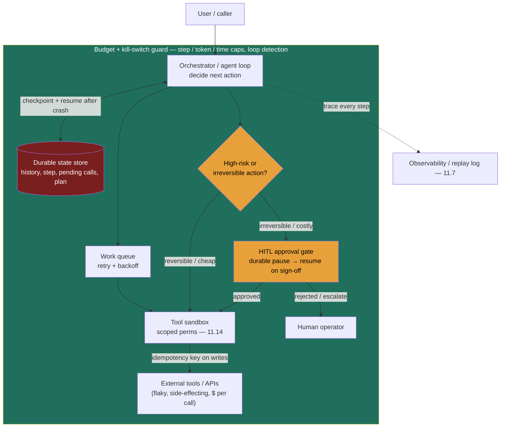

### Learning objectives
- Reframe a production agent as a **long-running, stateful, failure-prone distributed workflow** — not a chat loop — and name what that forces on you: durability, idempotency, human gates, budgets, and replay.
- Apply **durable execution** (checkpoint per step) so a crash **resumes** mid-run instead of restarting and re-running side effects, and quantify what restart-from-scratch costs.
- Make side-effecting **tool calls idempotent** by reusing the idempotency-key machinery from the business-domain HLDs, so at-least-once execution never double-acts.
- Place **human-in-the-loop** gates by **reversibility and blast radius**, designing interrupt/resume as a first-class capability rather than a bolt-on.
- Bound runaway behavior with **per-task step/token/time budgets, loop detection, and a kill switch**, and explain why an autonomous loop with no bounds is a cost-and-safety incident waiting to happen.

### Intuition first
A chat-loop demo is a **kite**: it flies for one breezy turn, touches nothing real, and if the string snaps you just relaunch it. A production agent is a **cargo flight**: it runs for minutes to hours, carries something valuable, has to survive turbulence and an engine restart mid-route, and — above all — **must not deliver the same shipment twice** when a leg is re-flown.

That shift in framing is the whole lesson. The moment an agent runs long and *takes actions in the world*, four things you never worried about in the kite dominate. **Progress has to persist:** an engine cutout over the Atlantic resumes from where it was, it does not taxi back to the gate and start the route over. **Actions can't double-fire:** if the cargo-manifest system hiccups and the leg is retried, nobody gets charged for the freight twice. **The irreversible calls need a human's sign-off:** the autopilot can adjust heading and altitude on its own, but a diversion to another country waits for the captain. And **there's a fuel budget:** a navigation bug can't be allowed to fly the plane in circles until the tanks run dry.

Durable progress, idempotent actions, a human gate on the irreversible, a hard budget. A chat loop has none of these because it lives for one turn. A production agent inherits **every hard problem of distributed workflows** — and the good news is you already solved most of them in the architecture and business-domain tracks. This lesson is where that machinery gets reused.

### Deep explanation

**A production agent IS a distributed workflow, not a chat loop.** The agent loop (observe → plan → act → observe) is the *logic*; the runtime is the *substrate that survives reality*. Reality is: the agent runs for minutes to hours, holds meaningful state (its plan, its scratchpad, partial results, pending tool calls), calls external tools that time out and fail, burns money per step, and must survive process crashes and routine deploys without corrupting what it has already done. That is the exact profile of a long-running, stateful workflow — so it carries the same obligations as any stateful distributed system: partial-failure handling, exactly-once *effects* on at-least-once infrastructure, retries, sagas, and audit. The Director instinct is to **stop treating "agent" as a novel category and recognize it as a durable workflow that happens to make nondeterministic decisions** — then design it with the reliability machinery you already know, not as a chat loop with tools bolted on. A naive in-memory loop loses everything on a crash, double-acts on retry, and can run away; each of those is a solved problem one module up.

**Durable execution: checkpoint state per step; resume, don't restart.** The cardinal sin is keeping agent state in **process RAM**, because a crash, an OOM, or a deploy then vaporizes a half-finished run. Durable-execution engines persist the outcome of each step to a state store and make the run **resumable**: on restart, completed steps are replayed from the journal (or skipped), and execution continues from the last checkpoint. The state — history, current step, pending tool calls — **lives in a durable store, not RAM**. The options span a spectrum:

- **Temporal** and **AWS Step Functions** — full workflow engines with durable timers, retries, signals, and replay.
- **Restate** and **DBOS** — durable execution as a lighter primitive bolted onto your own code.
- **LangGraph persistence** (a checkpointer) — framework-native, good enough for many single-service agents that need resume and HITL without new infrastructure.

The payoff is concrete. A 12-step agent that dies at step 8, restarted from scratch, re-burns 8 steps of LLM tokens and latency *and re-executes their side effects*; resumed from a checkpoint, recovery costs roughly nothing. **Rejected alternative: "just rerun it."** Fine for a pure-read agent; catastrophic the moment any step charged a card, sent an email, or wrote a row — because a rerun re-fires those effects.

**Idempotency of tool calls — reuse the business-domain pattern, don't reinvent it.** Durable execution buys you *at-least-once* step execution; combined with side-effecting tools, that is precisely the setup that double-acts. The fix is the one from the payments and wallet problems and the durable job scheduler: attach an **idempotency key** to every side-effecting tool call, derived deterministically from the run and step — `key = hash(run_id, step_id, tool, args)` — so a retried "issue refund," "send email," or "write row" is deduplicated by the downstream system and executed once. The identity is **exactly-once effect = at-least-once execution + dedup on a stable key.** Reads are free to retry; **writes need keys.** This is the single most common production-agent bug — a transient failure triggers a retry and the customer gets two refunds — and it is already solved upstream in this course. Naming that lineage in an interview signals you see the agent as a system, not a toy. **Rejected alternative:** assuming the transport is exactly-once, or "we'll just be careful" — both fail under the first network blip.

**The agent runtime shape.** Assemble five pieces: an **orchestrator / event loop** that drives the agent loop and decides the next action; a **durable state store** holding checkpoints, history, plan, and pending calls; a **tool execution layer / sandbox** that runs actions with scoped permissions; a **work queue** that decouples the loop from tool execution so calls can retry, back off, and scale independently; and a **guardrail/budget layer** wrapping all of it. The whole thing is **resumable and replayable** — which is what makes both crash recovery and debugging possible.

**Human-in-the-loop (HITL) is a first-class design primitive, not a bolt-on.** Where you insert a human is decided by **reversibility and blast radius** — the same one-way vs two-way-door lens, tied directly to the agent's autonomy level. Three placements:

- **Full-auto** for cheap, reversible, low-blast-radius actions (read a doc, draft text, query an API). Gating these on a human defeats the point of an agent.
- **Approve-before-execute** for irreversible or high-cost actions (delete data, move money, send to a customer, deploy). The runtime *proposes* the action, **durably pauses**, surfaces the proposed action plus its context to a human, and resumes on approval. Because the wait can be minutes to days, the pause itself must be durable — which is exactly why HITL and durable execution are inseparable.
- **Human-review queue** for batch oversight after the fact — sample completed runs, spot-check a class of decisions once trust is established.

Interrupt/resume is therefore a first-class runtime capability, and **escalation** (kick to a human on low confidence, repeated tool failure, or an out-of-policy request) is the safety valve. Placement is the design decision; getting it wrong in either direction — a human on every step (kills throughput), or full autonomy on the destructive action (unbounded loss) — is the failure.

**Long-running agents (hours to days) need durable state, resumability, and scheduled wakeups.** An agent that runs for hours can't hold an open request/response connection. The durable workflow **sleeps** while waiting on a human approval or a slow tool, then **wakes** on a durable timer and continues, streaming progress so the run is observable in flight. Cost also **accrues over time** — a multi-day run is a multi-day bill — so the budget layer tracks cost continuously, not just at the end. This is why an agent is modeled as a workflow with durable timers, not a synchronous API call.

**Runaway and cost control are not optional.** An autonomous loop that calls paid APIs and can spawn more work is a cost incident and a blast-radius incident waiting to happen — a planning bug or a prompt injection can put it in a tight loop spending money and taking actions. Enforce hard, **per-task** bounds: a **step/iteration cap**, a **token budget**, a **wall-clock timeout**, **loop / no-progress detection**, and a **kill switch** that halts the run. These are the agent equivalent of a circuit breaker, and a Director names them unprompted.

**Observability and replay are how you operate a nondeterministic system.** Log every step, decision, prompt, and tool call as a **trace** (the same observability primitive eval and LLMOps rely on) — not just for dashboards but because reproducing a misbehaving agent requires replaying its exact trajectory, every real-world action must be **attributable** for audit, and your eval harness scores trajectories, not just final answers. A nondeterministic system you can't replay is a system you can't debug.

The Director-altitude statement: *a production agent is a durable, idempotent, observable distributed workflow with human gates on the irreversible and hard budgets on the autonomous — not a chat loop with tools bolted on.* The reliability work is most of the engineering; the prompt is the easy part.

Go deeper — durable-execution mechanics and the saga parallel (IC depth, optional)

- **Event-sourcing / replay model (Temporal-style):** workflow code is deterministic; side effects happen only inside *activities*. The engine records each activity's result to an append-only history; on recovery it **replays the workflow function**, feeding recorded results back, so execution deterministically reaches the failure point without re-running completed activities. This is why workflow code must avoid non-deterministic calls (wall-clock time, random) outside activities — the same constraint as deterministic schedulers.
- **Compensation, not rollback (the saga link):** you can't two-phase-commit across a card network, an email provider, and your DB. A long agent that must "undo" a partially completed plan uses **compensating actions** (refund the charge, send a correction). Design each side-effecting step with its inverse where one exists, and gate it behind HITL where one doesn't.
- **Signals and durable timers:** the "wait for human approval" pause is the workflow blocking on an external **signal** with a timeout; the timer is durable, so a 3-day approval wait survives any number of restarts.
- **Idempotency-key derivation:** `key = hash(run_id, step_index, tool_name, args_digest)` makes the key stable across retries of *that* step but distinct across steps, so a legitimate second "send email" later in the plan isn't suppressed.

### Diagram: a durable agent runtime (crash-and-resume)

### Worked example: an expense-report filing agent

Take an agent that **files expense reports**: read each receipt, categorize it with an LLM where the rules are fuzzy, validate against policy, write the report into the finance system, then **pay out** the reimbursement. A naive notebook loop is a disaster here; the runtime carries it.

- **Durable execution:** the run is a workflow checkpointed **per step** (read → categorize → validate → write → pay). Suppose the process is recycled by a deploy **between the "approve" step and the "pay" step**. On restart it resumes at "pay" — not back at "read" — because the approval, the validated report, and the pending payment all live in the durable store, not RAM. Rejected: a stateless retry that re-runs from the top, re-burning the LLM categorize tokens and, worse, **re-writing the report**.
- **Idempotent payout (the crash-and-resume crux):** the pay step carries an idempotency key `hash(run_id, "pay", report_id)`. So even though the engine retried the leg after the crash — at-least-once execution — the payment provider **deduplicates on the key and pays once**. This is the payments/wallet pattern reused verbatim: a crash between "approve" and "pay" resumes *without double-paying*. Rejected: a naive retry of the pay step, which is exactly how an employee gets reimbursed twice.
- **HITL on the irreversible step:** read, categorize, validate, and write all run full-auto — they're reversible (you can re-run a report). **A payment over \$1,000 is one-way**, so it routes to an **approve-before-execute** human gate: the runtime surfaces the report, the receipts, and the policy citation to a finance approver, **durably pauses** (possibly overnight), and resumes on sign-off. Small reimbursements under the threshold pay automatically. Rejected: auto-paying every amount, where a hallucinated category on a \$40,000 "receipt" pays out before anyone looks.
- **Budget + kill switch:** per-task caps on total tool calls, total tokens, and wall-clock; loop detection if a receipt keeps failing validation; a kill switch the operator can pull. Rejected: an unbounded loop that, on a parse bug, retries a poison receipt forever while billing the LLM API.
- **Observability:** a full trace of every categorize decision and payment, so a disputed reimbursement is replayable and every payout is attributable.

Every decision traces to the workflow's nature: long-running (durable checkpoints), at-least-once (idempotent payout), partly irreversible (HITL on the >\$1,000 pay), and autonomous-with-money (budgets + kill switch).

### Trade-offs table

| Decision | Option A | Option B | Option C | Use when… |
|---|---|---|---|---|
| **Execution model** | **In-memory agent loop** | **Build-your-own / framework persistence** (LangGraph checkpointer, DBOS) | **Durable workflow engine** (Temporal / Step Functions) | **A** only for short, read-only, best-effort agents. **B** for a single-service agent needing resume + HITL without new infra, or when you want a lighter primitive. **C** for long-running, multi-step, side-effecting, business-critical agents — durable timers, signals, retries, replay out of the box. |
| **HITL gate placement** | **Full-auto** | **Approve-before-execute** | **Human-review queue (post-hoc)** | **A** for cheap, reversible, low-blast-radius actions (reads, drafts). **B** for irreversible / high-cost actions (money, deletes, customer-facing, deploys). **C** for batch oversight and sampling once trust is established. Choose by **reversibility × blast radius** (ties to the agent's autonomy level). |
| **Tool-call retry safety** | **Naive retry** | **Idempotency key on writes** | **Compensating action / saga** | **B** is the default for any side-effecting call. **A** only for pure reads. **C** when you must *undo* a committed effect across systems (refund, correction) since 2PC isn't available across a card network + email + DB. |

### What interviewers probe here
- **"Your agent crashed mid-task — what happens?"** — *Strong signal:* it **resumes from the last checkpoint**; completed side-effecting steps are not re-run; agent state lived in a durable store, not RAM; quantifies the wasted tokens/effects of a naive restart. *Red flag:* "it restarts the task," or state that only existed in process memory.
- **"A tool call gets retried and it sends money — how do you prevent double-spend?"** — *Strong:* **idempotency keys** on side-effecting tool calls (the payments / job-scheduler pattern), exactly-once effect = at-least-once execution + downstream dedup on a stable key; reads safe to retry, writes keyed. *Red flag:* assumes the transport is exactly-once, or "we'll be careful."
- **"When do you put a human in the loop?"** — *Strong:* by **reversibility and blast radius** — irreversible/high-cost actions gate on approve-before-execute with a durable pause/resume; cheap reversible actions run auto; escalate on low confidence; tie the gate to the autonomy level. *Red flag:* full autonomy on destructive actions, or a human on every step (which kills the value).
- **"How do you stop a runaway agent burning \$\$\$?"** — *Strong:* hard **per-task step/token/time budgets**, loop / no-progress detection, a **kill switch**, plus continuous per-run cost accounting. *Red flag:* no bounds — "the model decides when it's done."

The through-line at Director altitude: **the reliability story is the design.** "I'd run it on a durable workflow engine, make every side-effecting tool call idempotent with a derived key, gate the irreversible steps on human approval, and cap it with a per-task token/step/time budget and a kill switch. I'd have the platform team benchmark Temporal vs Step Functions for our latency and op model; my prior is Temporal for the richer signal/timer primitives. The prompt is the least of my worries."

### Common mistakes / misconceptions
- **Agent state in process memory.** A crash or routine deploy wipes a half-finished run. State belongs in a durable store; the runtime resumes from it, it doesn't restart.
- **Retrying side-effecting tool calls without idempotency keys.** At-least-once + a write = double charges, double emails. Reuse the payments / job-scheduler pattern: key the write, dedup downstream.
- **HITL bolted on at the end.** Approval gates must be designed as durable interrupt/resume points placed by reversibility — not a `confirm()` hacked onto the last step.
- **No budgets or kill switch.** An autonomous loop calling paid tools with no per-task step/token/time cap is a cost-and-blast-radius incident in waiting; loop detection and a kill switch are mandatory.
- **Modeling a long agent as a synchronous request.** Hours-long runs can't hold a connection; model it as a workflow with durable timers, sleeps, scheduled wakeups, and progress streaming.

### Practice questions

**Q1.** An agent runs a 20-step plan, takes a side-effecting action at step 6 (charges a customer), and the process is killed by a deploy at step 14. On restart, how do you guarantee the customer isn't charged twice and the first 13 steps aren't redone?
> *Model:* Run it on a **durable execution engine** so step results are journaled; on restart it **replays/resumes from step 14**, treating steps 1–13 as completed (their recorded results are reused, not re-executed). The step-6 charge additionally carries an **idempotency key** `hash(run_id, step_6, ...)` so that even if the engine retried that activity, the payment provider deduplicates it — exactly-once *effect* on at-least-once infrastructure. State never lived in process memory, so the crash lost nothing.

**Q2.** Design the human-in-the-loop policy for a customer-support agent that can issue refunds.
> *Model:* Gate by **amount and reversibility.** Refunds under a low, in-policy threshold run **full-auto** with logging. Refunds above the threshold, or anything outside policy, **pause for approve-before-execute**: the runtime surfaces the proposed refund, the customer context, and the policy citation to an agent who signs off; the workflow durably waits and resumes on approval. Low confidence or repeated tool failure **escalates** to a human. A **review queue** samples completed auto-refunds for after-the-fact oversight. The gate placement is the design — not "a human approves everything" (kills throughput) or "the agent refunds freely" (unbounded loss). This is the autonomy-by-reversibility lens.

**Q3.** Which durable-execution approach would you pick for a business-critical agent that orchestrates across payments, email, and a CRM over up to several hours, and why?
> *Model:* A **full workflow engine (Temporal / Step Functions)** over build-your-own/framework-only persistence. The run is long, multi-step, and side-effecting across external systems, so I need durable timers (for HITL and long tool waits), built-in per-activity retries with backoff, **signals** for human approval, and **replay** for debugging and audit. Framework persistence (a checkpointer) handles resume but not the timers, signal-based HITL, and operational tooling I want for something that moves money. The cost is operational complexity and a new dependency; justified by the blast radius. For a short single-service agent I'd accept the lighter option.

**Q4.** Your autonomous research agent occasionally gets stuck repeating the same failing search and burns through API budget. What runtime controls fix this?
> *Model:* **Loop / no-progress detection** (halt if N consecutive steps produce no new state or repeat an action), a hard **step/iteration cap**, a **token and wall-clock budget** with the run aborting when exceeded, and a **kill switch** for an operator. Pair with **observability** so the trace shows the loop, and feed that back into the agent's stop-condition design. Budgets are a runtime guardrail, not a tuning afterthought — they're the circuit breaker for an autonomous loop.

### Key takeaways
- **A production agent is a long-running, stateful, failure-prone distributed workflow — not a chat loop** — so it inherits durability, idempotency, observability, and exactly-once-*effect* obligations you already solved in the architecture and business-domain tracks. Reuse that machinery; don't reinvent a fragile stack.
- **Durable execution means resume, not restart:** checkpoint each step to a durable store (Temporal / Step Functions / Restate / DBOS / LangGraph persistence) so a crash at step 8 of 12 continues from 8 without re-running completed side effects or re-burning tokens. State lives in the store, not RAM.
- **Make side-effecting tool calls idempotent** with a key derived from `(run_id, step_id, tool, args)` so at-least-once execution never double-charges or double-sends; reads retry freely, writes need keys (the payments / wallet / job-scheduler pattern).
- **Human-in-the-loop is placed by reversibility and blast radius:** auto for cheap/reversible, approve-before-execute (a durable pause/resume) for irreversible/high-cost, review-queue for oversight — escalate on low confidence, and tie the gate to the autonomy level.
- **Bound the autonomy:** per-task step/token/time budgets, loop detection, and a kill switch turn an open-ended loop into an operable system; an unbounded agent calling paid tools is a cost-and-safety incident in waiting.

> **Spaced-repetition recap:** A chat-loop demo is a kite; a production agent is a cargo flight — long-running, survives a mid-air restart, and must not deliver the same shipment twice. Four obligations a chat loop never had: **durable progress** (checkpoint per step, resume not restart — Temporal / Step Functions / Restate / DBOS / LangGraph), **idempotent actions** (key every side-effecting tool call, the payments / job-scheduler pattern, so at-least-once doesn't double-pay), a **human gate on the irreversible** (place HITL by reversibility × blast radius; durable pause/resume; e.g. a >\$1,000 payout), and a **hard per-task budget + kill switch** (step/token/time caps, loop detection). Plus full **trace/replay** to operate a nondeterministic system. The reliability story *is* the design; the prompt is the easy part.
