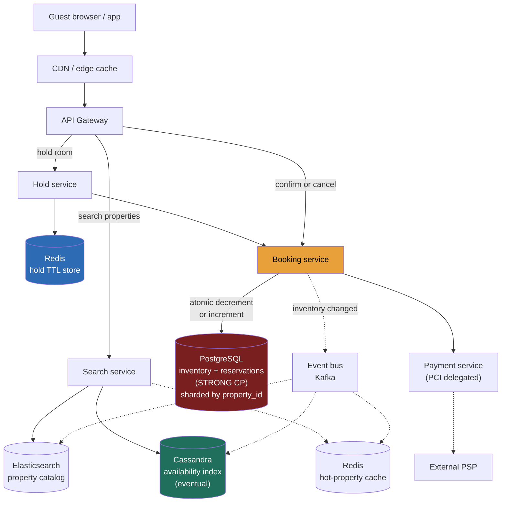

> **Why this gets asked and what separates a Director answer.** Hotel reservation is in the top tier of business-domain HLD problems precisely because it looks like Ticketmaster (Lesson 5.13) but isn't. Seats are unique and indivisible — one CAS per row. Hotel rooms are **fungible inventory**: you don't care *which* room 312 you get, only that the property has a king non-smoking available on your dates. That fungibility drives a **count-decrement model** rather than a seat-lock model, and it opens the door to a deliberate business decision that Ticketmaster never makes: **controlled overbooking**. A Director answer recognises the structural difference immediately, names the two-tier consistency split (eventual search / strong booking), and treats overbooking as a policy knob rather than a correctness bug.

---

### Learning objectives

1. Distinguish **fungible-inventory count decrements** from per-seat row locks and explain when each model applies.
2. Design the **search-vs-booking consistency split**: eventually-consistent availability index for ~1,000 QPS reads; strongly-consistent booking path for ~1 QPS writes per property — without serialising read traffic through the write path.
3. Model a **reservation-hold TTL** and argue the right duration against abandonment rate and competitive re-availability.
4. Articulate **overbooking as a deliberate policy knob** — the math that makes airlines and hotels set it above 100% on purpose — and design the system hook for it.
5. Know where the Director delegates depth: rate-plan pricing, payment PCI, and fraud — and state credible priors for each.

---

### Intuition first

Picture a hotel front desk clerk in 1985. A guest calls and asks "do you have a double room on the 14th?" The clerk glances at a paper ledger, sees 3 doubles marked open, says yes, pencils in the name, and drops the count to 2. Another call arrives — same answer, now 1. A third — count hits 0, clerk says "sold out." If the first guest calls back to cancel, the clerk erases the pencil mark and the count goes back up.

That is the entire booking model: **a counter per room-type per date**. Nobody cares which physical room 312 is — they care that the count is positive before it's decremented. The modern problem is doing that at booking.com scale: **500M property-date-roomtype cells** in the search index, **~3,000 booking writes/s** globally, and **~3M search reads/s** — a 1,000:1 ratio that makes it catastrophic to serve searches from the booking store.

The second wrinkle: the front desk clerk might sell the last room knowing a 10% no-show rate will keep a physical room available. **Overbooking is not a bug.** It is a revenue-optimisation decision with a contractual obligation (walk the guest with compensation). The system must support it as a configurable knob, not fight it.

---

## R — Requirements

> Pin scope to the core booking flow; cut the long tail of hotel-management features that would dominate the design without teaching anything new.

**Clarifying questions (with assumed answers):**

- *What's the unit of booking?* A **room type** (king non-smoking, double ocean view) at a property for a date range. Not a specific room number — that's assigned at check-in.
- *Search traffic vs booking traffic?* Assume ~**3M search/read QPS**, ~**3K booking writes/s** globally — roughly the 1,000:1 ratio Booking.com has disclosed publicly.
- *Is overbooking in scope?* Yes — as a configurable **overbooking buffer** per property per room type.
- *Hold-before-pay?* Yes — a **TTL-based reservation hold** during checkout (assume 10–15 min); expired hold releases inventory.
- *What's the latency bar?* Search results p99 < 200 ms; booking confirmation p99 < 1 s.

**Functional requirements (scoped core):**

1. **Search** properties by location, dates, room type, guest count, price range.
2. **View availability** and rates for a property across a date range.
3. **Hold** a room type temporarily during checkout (TTL reservation).
4. **Confirm** a booking (decrement inventory, write order, charge payment).
5. **Cancel** a booking (increment inventory back, apply cancellation policy).
6. **Overbooking policy** — support an `overbook_buffer` per property+room-type that allows bookings beyond physical count.

**Explicitly cut:** dynamic pricing / yield management engine, loyalty programs, hotel property-management system integration, room-number assignment, reviews, messaging. I scope to **search → hold → confirm → cancel**, with overbooking as a policy input.

**Non-functional requirements:**

- **Strong consistency on booking path** — double-booking (two guests, one physical room, no overbooking buffer) is the cardinal sin.
- **High availability on search** — 200 ms p99 with graceful degradation; stale by seconds is invisible.
- **Flash-sale tolerance** — a property releasing a limited promotion block can hit 10–100× normal write rate for that property (small scope relative to Ticketmaster, but must not cascade).
- **Overbooking as a configurable knob** — not a special-case hack.

**The RESHADED adaptation stated out loud:** the standard spine applies cleanly, but **S and E** carry the load-bearing work — Storage gets the search/booking split; Evaluation addresses overbooking, TTL races, and the hot-property write burst. Design evolution handles global scale and the cancellation storm.

---

## E — Estimation

> Enough math to justify the search/booking split and right-size each tier.

**Assumptions:** 500K bookable properties × avg 10 room types × 365 date-offsets (1 year forward) = **~1.8B availability cells** in the search index; ~100M DAU browsing, ~1M bookings/day.

**Search QPS:** 100M users × ~30 searches/day ÷ 86,400 ≈ **35K reads/s** baseline; 3× peak → **~100K reads/s**. Even "3M QPS" (Booking.com cited) is a CDN+cache figure — the origin request rate after caching is closer to 100K–500K/s depending on cache-hit ratio. Either way, it must not touch the booking store.

**Booking QPS:** 1M bookings/day ÷ 86,400 ≈ **12 writes/s** globally at average; 10× peak ≈ **120 writes/s**. Per property, this is typically < 1 write/s — a hot hotel in peak season might see 5–10/s.

**The 1,000:1 ratio is the governing fact.** It rules out serving searches from the transactional booking store (would serialise read traffic through a CP core designed for 120 writes/s).

**Storage — availability index:** 1.8B cells × ~100 B per cell ≈ **180 GB** raw. Fits in a distributed KV or wide-column store; replicated ×3 ≈ **~550 GB**. Search index (Elasticsearch/OpenSearch shards) of property metadata: ~50M documents × ~2 KB ≈ **100 GB** raw.

**Booking store:** 1M bookings/day × 365 days × ~1 KB/record ≈ **365 GB/year** — small; a sharded relational store holds this comfortably with years of history.

**Cache working set:** top 1% of properties (~5,000) × 10 room types × 365 days × ~100 B ≈ **1.8 GB** — fits in RAM, single Redis cluster.

**What estimation decided:** the search tier must be an independent, read-scaled, eventually-consistent layer; the booking store is a small, strongly-consistent shard; the hot-property spike (5–10 writes/s on one property) is manageable with per-property sharding without a waiting room (unlike Ticketmaster's 33K/s per event).

---

## S — Storage

> Three data tiers with different consistency requirements; match store to access pattern.

**1. Availability index (read-heavy, eventually consistent — the search tier).**

- *Access pattern:* ~100K reads/s for searches across property × room-type × date-range; acceptable staleness of seconds to minutes; writes are asynchronous fan-out from the booking store.
- *Choice:* **Apache Cassandra** (or DynamoDB) with partition key `(property_id, room_type_id)` and clustering key `date`. A row per (property, room-type, date) holds `available_count` and `price`. Wide-column gives fast range reads by date and high write throughput for async updates.
- *Rejected — Elasticsearch as the availability store:* Elasticsearch excels at full-text and geo search for property discovery but is not designed for high-frequency count updates on hundreds of millions of cells. Use Elasticsearch for the **property catalog** (name, location, amenities, ratings); use Cassandra for **availability counts**.
- *Rejected — serving availability from the booking store:* couples the 100K reads/s browse firehose to a CP core sized for 120 writes/s. Wrong store for the job.

**2. Booking store (strongly consistent, write path).**

- *Access pattern:* atomic decrement (or conditional insert) on `inventory` row; transactional order write; ~120 writes/s peak, strong consistency required.
- *Choice:* **PostgreSQL sharded by `property_id`** (or CockroachDB for geo-distributed strong consistency). Row-level transactions, conditional inventory decrements, and foreign-key integrity between `reservations` and `inventory` are natural here.
- *Rejected — Cassandra for bookings:* LWW semantics can permit two concurrent writes to both succeed and converge to an oversold state. Bookings demand linearisability per (property, room-type, date).

**3. Property catalog + search (AP, Elasticsearch).**

- *Access pattern:* geo search, full-text on amenity/name, faceted filters (star rating, price range, free wifi). Staleness of minutes acceptable — a property adding a new room type is not time-critical.
- *Choice:* **Elasticsearch/OpenSearch** (Lesson 3.13). Front with Redis and CDN for hot property pages.

**Reservation hold state:** a **Redis hash** keyed by `hold_id` holding (user, property, room-type, dates, expiry). TTL set on the key; expiry events trigger inventory release. Low-state, fast, near the API layer.

---

## H — High-level design

> An eventually-consistent search/browse front protecting a small strongly-consistent booking core; async fan-out keeps the two layers decoupled.



**Happy path — search to booking:**

1. Guest searches "Paris, 2 adults, June 14–17" → **Search service** queries Elasticsearch for matching properties, joins with Cassandra availability counts (all three dates must have `available_count > 0`), returns results with prices. Redis caches hot properties.
2. Guest selects a property → **Hold service** writes a hold record to Redis (TTL 10 min) and tentatively reserves via the Booking service (decrements a `held_count` in Postgres — not the confirmed count). The availability index is not yet updated — holds are optimistic.
3. Guest completes checkout → **Booking service** runs an atomic transaction: confirm the held_count → `confirmed_count` decrement, write the `reservations` row, call payment, commit. On success, emits a Kafka event.
4. **Kafka fan-out** asynchronously updates Cassandra availability counts and the Elasticsearch index — eventual update within seconds.
5. If the hold expires (Redis TTL fires), the `held_count` is returned to `available_count` in Postgres, and a Kafka event re-increments the Cassandra index.

**The shape to notice:** the read firehose (search, browse) never touches Postgres. The eventual/strong boundary is drawn at the Booking service — the only path that crosses into the CP core.

---

## A — API design

> Cover the booking lifecycle; status codes and idempotency are the correctness story.

```
# --- Search (eventual, cached) ---
GET /v1/properties?city=Paris&checkin=2026-06-14&checkout=2026-06-17
    &guests=2&room_type=KING                  -> 200 { properties: [...] }

GET /v1/properties/{propertyId}/availability
    ?checkin=&checkout=&room_type=            -> 200 { available: true,
                                                       count: 3,
                                                       price_per_night: 189,
                                                       asOf: <ts> }
                                                # count is from the eventual index — a hint

# --- Hold (tentative reservation, TTL-gated) ---
POST /v1/holds
  body: { propertyId, roomType, checkin, checkout, guestCount, userId }
  -> 201 { holdId, expiresAt, totalPrice }
  -> 409  # no availability (count hit 0 in the booking store)

# --- Confirm booking (convert hold to reservation, charge payment) ---
POST /v1/bookings
  headers: { Idempotency-Key: <uuid> }
  body: { holdId, paymentToken }
  -> 201 { bookingId, confirmationCode, roomType, checkin, checkout }
  -> 410  # hold expired — guest must restart search
  -> 402  # payment declined — hold released
  -> 409  # overbooking limit exceeded (rare; policy-controlled)

# --- Cancel ---
DELETE /v1/bookings/{bookingId}
  -> 200 { refundAmount, cancellationFee }   # policy-applied

# --- Admin: set overbooking policy ---
PUT /v1/properties/{propertyId}/inventory
  body: { roomType, date, physicalCount, overbookBuffer }
  -> 200
```

**Design notes (each with its rejected alternative):**

- **Hold before confirm, two calls.** *Rejected: single "book" call.* Humans need time to review totals and enter payment — you cannot hold a DB transaction open for 30 seconds. Split tentative hold (instant) from confirmation (involves PSP).
- **`availability` count is explicitly a hint** (`asOf` timestamp). The authoritative check is in the booking store at confirm time — the 409 on confirm is the real arbiter, not the search result.
- **`Idempotency-Key` on confirm is mandatory.** Network retries otherwise double-charge and potentially double-book. *Rejected: trusting clients not to retry* — they always do.
- **Overbooking 409 is a policy response, not a bug.** The API exposes it so clients can distinguish "truly sold out" from "overbooking cap reached" and display appropriate messaging.

---

## D — Data model

> The partition key for the booking store and the availability cell schema are the two load-bearing decisions.

**Booking store (Postgres, sharded by `property_id`):**

- **`inventory`** — primary key `(property_id, room_type_id, date)`. Columns: `physical_count`, `overbook_buffer`, `confirmed_count`, `held_count`. The invariant: `confirmed_count + held_count <= physical_count + overbook_buffer`. All updates run as `UPDATE ... WHERE confirmed_count + held_count + 1 <= physical_count + overbook_buffer` — the overbooking policy is encoded directly in the constraint.
- **`reservations`** — primary key `reservation_id`; foreign key `property_id` (colocation with inventory on the same shard). Columns: user, room_type, checkin, checkout, status (`HELD`/`CONFIRMED`/`CANCELLED`), `idempotency_key` (unique index), `created_at`, `expires_at`.

**Partition key = `property_id`. The load-bearing decision:**

- *Why it's right:* a booking transaction touches inventory rows for each night of the stay (checkin to checkout-1 dates) and writes one reservations row — all scoped to one property. Sharding by `property_id` colocates those rows on one shard, enabling a multi-row transaction with no cross-shard coordination.
- *Rejected: shard by `reservation_id` hash.* Spreads reservations evenly but scatters a property's inventory across shards → cross-shard 2PC on the hottest booking path. Wrong trade.
- *Hot property concern:* a popular city-centre hotel might see 5–10 writes/s at peak — manageable on one shard. Unlike Ticketmaster's 33K/s per event, hotel bookings are distributed across dates and room types, diluting the per-row contention significantly.

**Availability index (Cassandra):**

- Partition key `(property_id, room_type_id)`, clustering key `date`. Row: `available_count`, `price`, `updated_at`. Updated asynchronously from Kafka. A full date-range availability check is a single partition scan — fast.

<details>
<summary>Go deeper — multi-night atomicity and the inventory constraint (IC depth, optional)</summary>

A 3-night stay requires decrementing inventory for 3 separate date rows. In Postgres on the same shard, this is a single transaction across those rows. The conditional update pattern:

```sql
UPDATE inventory
SET confirmed_count = confirmed_count + 1
WHERE property_id = $1
  AND room_type_id = $2
  AND date = ANY($dates)
  AND confirmed_count + held_count + 1 <= physical_count + overbook_buffer;
```

Run inside a transaction that touches all dates; if any date row fails the WHERE predicate the whole transaction rolls back. This is exactly the multi-row atomicity that makes a transactional relational store worth its sharding complexity. A DynamoDB-style approach would need application-level compensation or DynamoDB Transactions (limited to 25 items, but adequate for typical stay lengths of 1–14 nights).

The `held_count` column prevents a race where two users both hold the last room simultaneously and both proceed to confirm. The hold endpoint increments `held_count` (conditional), the confirm converts `held_count - 1, confirmed_count + 1`, and a TTL expiry runs `held_count - 1`. This three-state accounting (`physical + overbook_buffer >= confirmed + held`) is the overbooking-aware generalisation of Ticketmaster's binary `AVAILABLE/HELD/SOLD`.

</details>

---

## E — Evaluation

> Re-check against NFRs, name bottlenecks, and fix each while stating the trade-off.

**Re-check vs NFRs:** no double-booking (conditional atomic decrement); overbooking policy (buffer column in invariant); search availability (AP, eventual); booking strong (CP, Postgres shard). Now the bottlenecks.

**Bottleneck 1 — search serving stale data that leads to a 409 storm.**

If the Cassandra availability index lags the booking store by more than a few seconds, guests see rooms that are already taken, click "book," hit 409 at confirm, and abandon. At steady state, Kafka lag is sub-second — acceptable. Under a flash sale (a property releasing a limited promotional block), Kafka consumer lag could spike.

*Fix:* the Search service hedges: for properties flagged as "high-contention" (detected via booking velocity from the event bus), it reads `available_count` directly from Postgres (bypassing Cassandra) for the final availability check before presenting the hold option. This adds ~5–10 ms latency for that property's search response, not for the full search result page. *Trade-off:* we increase load on the booking shard for that property during a flash event — acceptable given it's a hot-path hedge, not the steady-state path.

*Rejected: always read availability from Postgres.* Kills the read/write separation that the architecture is built on.

**Bottleneck 2 — hold expiry and inventory leakage.**

A guest holds a room and closes the browser tab. The `held_count` is incremented but the hold was never confirmed. If Redis TTL fires but the Booking service never processes the expiry event (service restart, missed event), `held_count` stays elevated — effectively leaked inventory.

*Fix — two-layer expiry.* (1) Redis TTL fires → publishes an expiry event to Kafka → Booking service decrements `held_count` and marks the reservation `EXPIRED`. (2) A background reconciliation job scans `reservations WHERE status='HELD' AND expires_at < now() - 5min` every minute and force-expires stragglers — the sweeper handles the Redis/Kafka failure case. The invariant is checked at confirm time regardless: `confirmed_count + held_count + 1 <= physical_count + overbook_buffer`. *Rejected: sweeper-only.* A crashed Redis loses all TTL state, leaving held_count inflated until the sweeper catches up — unacceptable during peak booking.

**Bottleneck 3 — the overbooking policy under-/over-shoot.**

Set `overbook_buffer` too low and the property loses revenue; too high and guests get walked. The buffer is a **live property-management knob**, not a deploy-time constant.

*The system hook:* the `PUT /v1/properties/{propertyId}/inventory` endpoint (admin-only) updates `overbook_buffer` in Postgres and the change takes effect on the next booking attempt. A separate **yield-management service** (out of scope, delegated to revenue-management team) reads historical no-show rates per property × season × day-of-week and recommends buffer values. *Trade-off:* the system supports overbooking as a first-class knob; whether to use it is a business and legal decision, not a technical one.

**Bottleneck 4 — cross-date consistency on a multi-night cancellation.**

A guest cancels a 5-night stay. The system must atomically increment `inventory.confirmed_count` for 5 date rows, write the cancellation record, compute refund (cancellation policy), and initiate payment reversal.

*Fix:* cancellation runs as a single Postgres transaction on the `property_id` shard (all 5 date rows colocated). Refund policy is applied in-transaction via a policy function (no external call in the hot path); actual payment reversal is async via the payment service with an idempotency key. *Trade-off:* async refund means the guest sees "cancelled, refund in 3–5 days" rather than instant credit — standard industry behaviour, avoids blocking the cancel path on PSP latency.

<details>
<summary>Go deeper — cancellation policy enforcement (IC depth, optional)</summary>

Cancellation policy (free until 48 hours before, 1-night penalty within 48 hours, no refund within 24 hours) is modelled as a policy rule applied at cancellation time:

```
refund_amount = total_price - cancellation_fee(policy, checkin, cancelled_at)
```

The function is pure and deterministic given policy + timestamps — safe to run in the transaction. The policy itself is stored in a `cancellation_policies` table keyed by `property_id` + `room_type_id` (or a `policy_id` FK). Storing policy in the DB rather than code means property managers can update it without a deploy, and historical reservations always reference the policy that was in effect at booking time (the reservation row stores a `policy_snapshot` JSONB column).

</details>

**Closing re-check:** double-booking prevented (conditional decrement, property-shard transactions); overbooking supported (buffer column, no invariant violation); search decoupled (Cassandra + ES, async Kafka fan-out); hold leakage bounded (two-layer expiry); cancellation atomic (same-shard transaction). The CP surface stays confined to the Booking service + Postgres shards.

---

## D — Design evolution

> Push each dimension up and name what breaks first.

**At 10× global scale (10M bookings/day, global properties, ~1M search QPS):**

- **Search tier** scales horizontally — Elasticsearch and Cassandra add shards; the read path is stateless services behind a load balancer. The CDN + Redis cache absorbs the long tail of popular-city searches.
- **Booking store** at 1,200 writes/s globally is still small — the shard count grows linearly with property count. **Geo-partitioning** (all European properties on EU shards, US properties on US shards) reduces cross-region latency for most bookings; cross-region reservations (US guest booking EU hotel) route to the EU shard, adding ~80–120 ms — acceptable for a synchronous booking confirmation.
- **The flash-sale problem becomes relevant** at 10× when a single large hotel group (Marriott, Hilton) drops a flash promotion: potentially thousands of properties, each with 10–50× normal booking rate for ~30 min. A per-property queue (lightweight compared to Ticketmaster's event queue — hotel booking peaks at ~50 writes/s per property, not 33K/s) can be added to the Booking service to shed burst write pressure without rebuilding the architecture.

**Hardest trade-offs to defend:**

- **The search/booking consistency split.** Drawn at the Booking service — eventual everywhere the read firehose goes, strong only on the booking path. The discipline is resisting requests to "just make search real-time" — it would re-couple 100K reads/s to a store sized for 120 writes/s.
- **Overbooking as a first-class system capability.** Some interviewers will push "just make it a hard constraint." The Director answer: the hotel industry runs on overbooking for valid revenue reasons; the system's job is to enforce the *chosen* constraint, not to choose it. Design the knob, let the business turn it.
- **Property-id sharding vs. date sharding.** Property-id buys transaction locality for a stay; date-sharding would enable a demand-calendar view more easily but shatters multi-night transactions. The right call depends on query patterns; for a booking-first system, property-id wins.

**What I'd revisit:** if the product adds **group bookings** (blocking 20 rooms across 30 dates for a conference), the inventory model needs a reservation-block primitive that the current row-per-date model doesn't express elegantly. I'd have the storage team design a `blocks` table with a separate decrement path. **Dynamic pricing / yield management** is a separate service reading from the inventory event stream — I delegate that to the revenue-management team with the constraint that it writes back via the `PUT /inventory` admin endpoint, not directly to the booking store.

**Where I'd delegate:**

- **Payment / PCI:** *"The payments team owns the PSP integration behind `charge(idempotencyKey, amount, token)` — my prior is tokenised cards, async capture on confirm, and automatic reversal on cancellation. They own SLA and compliance."*
- **Yield management / overbooking calibration:** *"The revenue-management team owns the model that sets `overbook_buffer`; the system provides the knob and a stream of booking velocity events. I'd ask them to define acceptable walk rates as a contractual SLA."*
- **Fraud:** *"Trust-and-safety owns bot-driven fake-booking detection (holds as inventory lock attacks). My prior is rate-limiting holds per user + IP and flagging anomalous hold patterns — they own the scoring model."*

---

## Trade-offs table — the pivotal decisions

| Decision | Option A | Option B | Option C | Use when... |
|---|---|---|---|---|
| **Availability read tier** | **Cassandra (eventual, async fan-out)** — decouples 100K reads/s from booking store | **Read replica of Postgres** — strong-enough, but scales only ~10× before replica lag under load | **Serve from Postgres directly** — correct but serialises reads through the CP core | **A** as default: the 1,000:1 ratio is the governing constraint (our choice). **B** for smaller scale where operational simplicity wins. **C** never at this scale. |
| **Booking store** | **Postgres sharded by property_id** — transactions, conditional decrements, property-colocation | **CockroachDB/Spanner** — geo-distributed strong consistency, higher cost | **DynamoDB with conditional writes** — single-item atomic, no multi-row txn | **A** for most deployments: strong consistency + multi-night atomicity, known ops model. **B** for global active-active writes required. **C** only if all stays are single-night or you model each night as independent. |
| **Overbooking enforcement** | **Buffer column in inventory invariant** — flexible, tunable per property | **Hard cap at physical_count** — simpler, but forces business to fight the system | **Application-layer guard** — flexible but race-prone without DB-level enforcement | **A**: overbooking is a real business need; encode it at the DB constraint level so it can't be bypassed (our choice). **B** only if overbooking is contractually forbidden. **C** rejected: race window between check and write. |
| **Hold expiry** | **Redis TTL + Kafka event + background sweeper** — defence-in-depth | **Sweeper-only** — simpler, ~1 min lag in returning inventory | **Redis TTL only** — no sweeper fallback | **A**: inventory leakage is a revenue problem during peak (our choice). **B** for low-stakes systems. **C** rejected: single point of failure on Redis. |

---

## What interviewers probe here (Director altitude)

- **"What prevents two guests from booking the last room simultaneously?"** *Strong:* the conditional atomic decrement in Postgres — `UPDATE inventory SET confirmed_count = confirmed_count + 1 WHERE ... AND confirmed_count + held_count + 1 <= physical_count + overbook_buffer` — one winner; loser sees 0 rows updated and returns 409. This is a deliberate CP choice on the booking path. *Red flag:* "the cache prevents it" or an eventually-consistent store as the booking truth.

- **"How is this different from Ticketmaster?"** *Strong:* seats are unique (per-seat row, CAS on one row); hotel rooms are fungible (count decrement on a room-type × date cell). Ticketmaster needs a waiting room because 33K/s hits one event's inventory shard; hotel booking peaks at ~50 writes/s per property, diluted across dates and room types — no waiting room needed. Overbooking is a legitimate hotel knob, not an option for Ticketmaster (seat oversell is fraud). *Red flag:* treating them as the same problem, or missing the fungibility distinction.

- **"Why not serve search directly from the booking store?"** *Strong:* the 1,000:1 read-to-write ratio; the booking store is a CP core sized for ~120 writes/s — attaching 100K reads/s to it either serialises those reads or requires massive over-provisioning of the transactional tier. *Red flag:* "we can add read replicas" without acknowledging that replica lag reintroduces the stale-data problem at the one place you need freshness.

- **"What is your overbooking model, and is it a bug or a feature?"** *Strong:* it's a deliberate policy stored as `overbook_buffer` per property × room-type, enforced at the DB constraint level, tunable by a yield-management service. The Director delegates calibration to revenue management with a stated SLA on walk rate. *Red flag:* "overbooking shouldn't happen" or ignoring it entirely.

- **"What happens if the hold expires while payment is in flight?"** *Strong:* the confirm step re-asserts the hold inside the Postgres transaction — `WHERE reservation_id = $holdId AND status = 'HELD' AND expires_at > now()`. If it expired and inventory was resold, the confirm fails gracefully and triggers an async refund. TTL is sized (10–15 min) far above worst-case PSP latency. *Red flag:* no re-assertion, or relying only on the TTL being "long enough."

---

## Common mistakes

- **Serving availability from the booking store.** The 1,000:1 search-to-book ratio makes this fatal at scale. The search tier must be an independent, eventually-consistent layer.
- **Treating overbooking as a correctness bug.** It is a revenue policy. The system enforces *whatever invariant the business sets* via the buffer column — the architecture should not presuppose that buffer = 0.
- **Forgetting multi-night atomicity.** A 5-night booking must decrement 5 inventory rows in a single transaction. Shard key choice (property_id) is what makes this possible without cross-shard 2PC.
- **Hold-only expiry via sweeper.** A sweeper with 1-min lag during peak inventory scarcity is a revenue problem. Two-layer expiry (Redis TTL + sweeper fallback) is the right defence-in-depth.
- **Conflating this with Ticketmaster.** The flash-crowd scale is different by 3 orders of magnitude per property; the overbooking semantics are opposite; the fungibility model changes the core data structure. Name the differences early.

---

## Practice questions (with model answers)

**Q1. A property has 5 king rooms. Two guests simultaneously try to book the last available room for June 14. How does the system handle it?**

> *Model:* Both guests arrive at the Booking service concurrently. Each attempts `UPDATE inventory SET confirmed_count = confirmed_count + 1 WHERE property_id = $p AND room_type = 'KING' AND date = '2026-06-14' AND confirmed_count + held_count + 1 <= physical_count + overbook_buffer`. Postgres serialises writes to the row; one update lands first, setting `confirmed_count` to the buffer limit. The second update finds the WHERE predicate false (count exceeded), returns 0 rows updated, and the Booking service returns a 409 to that guest. No lock held after the first commit; no oversell. The Cassandra availability index is updated asynchronously via Kafka — the second guest may have seen "1 available" from search but the 409 at confirm is the truth.

**Q2. The CTO asks: "Can we set overbooking to 110% for premium hotels during peak season?" How do you handle this without a code change?**

> *Model:* `overbook_buffer` is a first-class column in the `inventory` table, set per (property_id, room_type_id, date). The admin API `PUT /v1/properties/{propertyId}/inventory` accepts `physicalCount` and `overbookBuffer`. Setting `overbook_buffer = 2` on a 20-room property allows up to 22 bookings (110%). The DB constraint (`confirmed_count + held_count <= physical_count + overbook_buffer`) enforces it atomically. A yield-management service — delegated to the revenue team — reads booking velocity and no-show history to recommend and apply buffer values via that admin API. The business decision is theirs; the system enforces whatever they set. Walk-rate SLA is the revenue team's contractual obligation to manage.

**Q3. Design the cancellation flow for a 7-night booking, including the partial-refund case.**

> *Model:* Cancellation is a Postgres transaction on the `property_id` shard: decrement `confirmed_count` for each of the 7 date rows, update `reservation.status = 'CANCELLED'`, compute `refund_amount = total_price - cancellation_fee(policy, checkin, now())` using the stored policy. All 7 date rows are colocated on the same shard — no cross-shard coordination. Payment reversal is async: emit a `CancellationInitiated` event to Kafka; the Payment service handles the PSP reversal with an idempotency key and emits `RefundCompleted`. The reservation status updates to `REFUNDED` on that event. The guest sees "cancelled, refund in 3–5 days" — standard. We don't block the cancel path on PSP latency.

**Q4. A popular hotel flash-sale drops 50 discounted rooms. Suddenly your Cassandra availability index is wrong for 10 minutes while Kafka processes the backlog. What's your mitigation?**

> *Model:* Three levers. First, a **Kafka consumer-lag alert**: if lag on the availability-update consumer exceeds 30 s, the Booking service sets a `high_contention` flag for that property (stored in Redis, expires in 5 min). Second, for properties with that flag, the Search service **hedges by reading available_count from Postgres** instead of Cassandra for the final "can I book this?" check shown to users — adds ~10 ms to that property's search response, avoids showing availability that's already gone. Third, the Search API includes `asOf` in the response so clients can surface a "prices may be updating" disclaimer. The key is that the eventual tier is *always* a hint; the 409 at confirm is the authoritative answer. We accept a slightly elevated 409 rate during the flash window rather than re-architecting the read path.

---

### Key takeaways

1. **Fungibility changes the model.** Hotel rooms are a count per (room-type, date) — a decrement, not a per-seat row lock. This makes overbooking a natural, configurable buffer rather than a correctness violation.
2. **The 1,000:1 search-to-book ratio is the architectural driver.** It mandates an eventually-consistent search/availability tier (Cassandra + ES) decoupled from the strongly-consistent booking store (Postgres), connected by an async Kafka fan-out.
3. **Property-id sharding buys multi-night atomicity.** A 7-night stay decrements 7 inventory rows on one shard in one transaction — no cross-shard 2PC. The hot-property concern is manageable at hotel booking rates (< 50 writes/s per property) without a waiting room.
4. **Overbooking is a policy knob, not a bug.** Model it as `overbook_buffer` in the inventory constraint; delegate calibration to revenue management with a walk-rate SLA; the system enforces whatever the business sets.
5. **Defence-in-depth on hold expiry.** Redis TTL + Kafka event is the fast path; a background sweeper covers Redis failures. The booking-store confirm always re-asserts the hold in the same transaction — correctness never depends solely on a timer.

> **Spaced-repetition recap:** Hotel reservation = **fungible inventory** (count decrement, not seat lock) + **1,000:1 search-to-book** ratio demanding an eventual Cassandra availability index decoupled from a strongly-consistent Postgres booking store (sharded by `property_id` for multi-night atomicity). Overbooking = `overbook_buffer` column in the DB constraint, calibrated by the revenue team. Hold expiry = Redis TTL + sweeper fallback + in-transaction re-assertion at confirm. Contrast with Ticketmaster (Lesson 5.13): unique seats vs. fungible rooms, 33K/s event spike vs. < 50 writes/s per property, no overbooking vs. overbooking as standard practice.

---

*End of Lesson 9.3. Hotel reservation vs. Ticketmaster is a canonical "same surface, different model" pair — fungibility, the 1,000:1 ratio, and overbooking as a policy knob are the three ideas the question is testing. Next: Lesson 9.4 — Flight Booking System, where the inventory model shifts again: seat-class buckets (fare classes), a global GDS distribution layer, and the saga pattern for multi-leg itinerary atomicity.*
