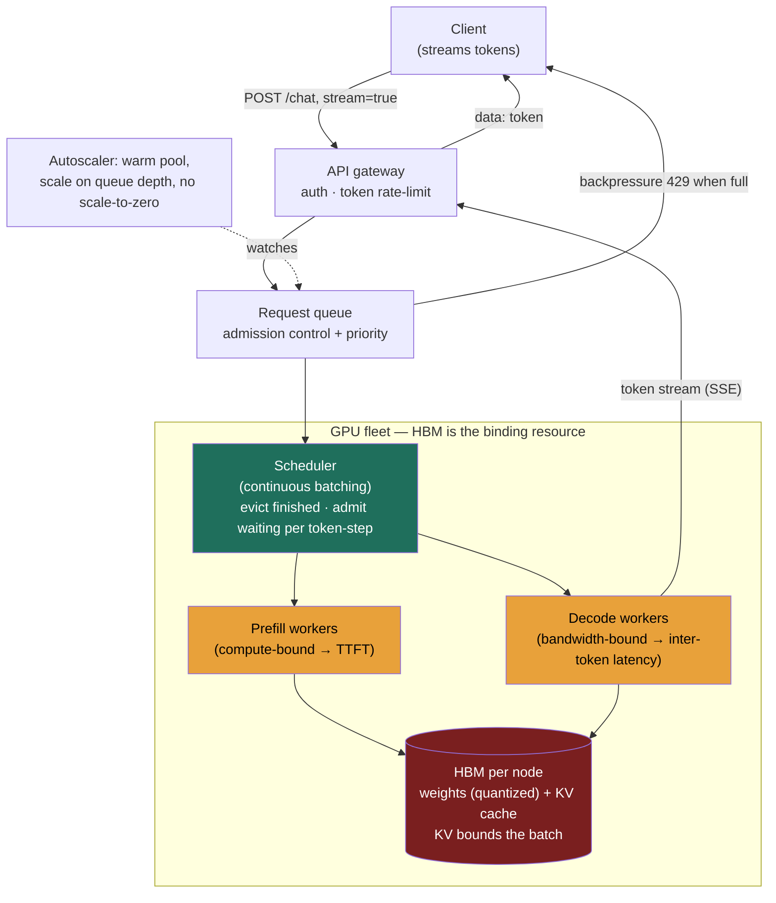

### Learning objectives
- Name the binding resource for LLM inference — **GPU HBM (high-bandwidth memory)**, not disk or CPU — and explain why decode is **memory-bandwidth-bound**, not compute-bound, so you optimize the right thing.
- Separate **prefill** (whole prompt in parallel, compute-bound → sets TTFT) from **decode** (one token at a time, sequential, bandwidth-bound → sets inter-token latency), and use the split to predict latency and size hardware.
- Explain how the **KV cache** grows with sequence length and **bounds how many requests you can batch**, and why long contexts eat batch capacity.
- Reach for the two throughput levers that don't require buying GPUs — **continuous (in-flight) batching** and **quantization** — and name what each costs.
- Make the **throughput-vs-latency** call (bigger batch = cheaper tokens but slower per request), separate **real-time from batch/async** serving, and **delegate** kernel/quant tuning with a stated prior while owning the capacity/cost/SLO decision.

> This lesson is the **building-block concept layer** — the reusable mechanics of serving one model on a GPU fleet. The **full end-to-end RESHADED design** (estimation, the serving system, autoscaling, the cost floor, the trade-off table) is **the ChatGPT / LLM-serving walkthrough**. This is the building-block → full-design split: learn the primitive here, watch it drive a complete design there. Don't re-derive the serving system in your head while reading this — get the mechanics first.

### Intuition first
A GPU is a **kitchen with a tiny counter and a freakishly fast chef.** The chef (the compute units) can chop and cook faster than almost anything — but everything they cook has to fit on the **counter** (HBM, the GPU's on-board memory) at once, and the counter is small. The bottleneck is almost never "can the chef chop fast enough." It's "how much fits on the counter at the same time."

Two things sit on that counter: the **recipe book the chef re-reads for every single word of every dish** (the model weights), and the **running notes for each order in progress** (the KV cache — what's been said so far, so the chef doesn't re-read the whole order to add the next word). The recipe book is huge and fixed; the notes grow as each order gets longer. Whatever counter space is left after the recipe book decides **how many orders the chef can work on at once** — and working on more orders at once is the only way the kitchen gets cheaper per dish, because the chef re-reads the same recipe page once and applies it to every order on the counter.

That single image carries the whole lesson. **Reading the recipe page is the slow part, not the chopping** — so the chef wants as many orders as possible sharing each read (batching), and the limit on batch size is **counter space**, not chef speed. Shrink the recipe book (quantization) and more orders fit. Read the first order's whole sentence in one glance (prefill) but answer it **one word at a time** (decode), and you've found why the first word starts fast but the full answer streams out slowly. Get this intuition right and GPU serving is detail.

### Deep explanation

**The GPU is the unit of cost; HBM is the binding resource.** Unlike a web tier where you reason about disk I/O, CPU, and network, an LLM serving fleet is priced in **GPU-hours** (≈ $2–4/GPU-hour for an H100-class card in 2026), and the thing that runs out first is **HBM** — the 80 GB or so of fast memory soldered next to the chip. Two consumers compete for it: the **weights** and the **KV cache**. The weights alone often nearly fill the card, and what's left bounds your batch — and your batch bounds your throughput. So the first sizing question is never "how many FLOPs" — it's "**does the model even fit, and how much room is left for the cache.**"

The weight math is the back-of-envelope you must be able to do out loud: **bytes = params × bytes-per-param.** A **70B** model in **fp16 (2 bytes/param)** is `70 × 10⁹ × 2 = 140 GB` — which does **not** fit one 80 GB H100. So you either span **2 GPUs** (140 GB across 2 × 80 GB, tensor-parallel) or **quantize** to drop the footprint. That single "140 GB > 80 GB" fact is the most common thing candidates get wrong, and it doubles the hardware count if you miss it (the worked example below makes it concrete).

**Decode is memory-bandwidth-bound, not compute-bound** — the most important and least intuitive fact here. To generate **one** output token, the GPU must stream **every weight** of the model from HBM through the compute units once. For a 70B model that's ~140 GB of reads (fp16) per token-step. At ~3 TB/s of HBM bandwidth, that read *is* the latency floor — the compute units finish their multiply long before the next batch of weights arrives, and sit idle waiting on memory. The consequence is the whole game: **if you're already paying to stream the weights once, you might as well apply them to many sequences at the same time.** That's why batching multiplies throughput almost for free — the expensive weight-read is **shared** across every sequence in the batch. The Director-altitude statement: *decode throughput is set by how many sequences share each weight-read, and that count is capped by HBM, not by the chip's math speed.*

**Prefill vs decode — two different machines in one request.** A request runs in two phases with opposite characteristics:

- **Prefill** processes the **entire prompt in one parallel pass** — all input tokens at once. This is **compute-bound** (the chip is genuinely busy doing matrix math on the whole prompt), takes tens to hundreds of milliseconds depending on prompt length, and it sets **TTFT (time to first token)** — how long until the user sees the first word.
- **Decode** generates the response **one token at a time, sequentially** — each token depends on the previous one, so there's no parallelism within a single sequence. This is **memory-bandwidth-bound** (as above), runs at ~30–50 ms/token, and it sets **inter-token latency (ITL)** — how fast words stream out after the first.

A typical request — 1,000 input tokens, 500 output — spends a few hundred ms in prefill, then ~15–25 s dripping out 500 tokens in decode. **Decode dominates wall-clock; prefill dominates the TTFT budget.** This is the LLM equivalent of the read:write skew that drives a CRUD design — except here the skew is **prefill vs decode**, and recognizing it is the first thing the problem tests (the token/latency model this builds on comes from the LLM-fundamentals lesson).

**The KV cache bounds your batch — and long contexts eat it.** To avoid re-reading the whole conversation on every decode step, the model caches the attention **keys and values** for every token it's already seen. This **KV cache is per-request, lives in HBM, and grows linearly with sequence length** — on the order of **~300 KB/token** for a 70B model with modern grouped-query attention, i.e. **~1.3 GB for a 4,000-token sequence.** Now the squeeze is visible: fp16 weights take 140 GB; on a 2-GPU node (160 GB) that leaves ~20 GB for KV, only **~15 concurrent 4K sequences** — far too few to keep an expensive GPU busy. **A 100K-token context consumes ~25× the KV of a 4K one**, so a handful of long-context requests can monopolize the node. The KV cache is the LLM's real "index": it bounds concurrency, therefore throughput, therefore $/token. The byte-math is in the Go-deeper block.

**Continuous (in-flight) batching is the throughput unlock.** The naive approach, **static batching**, assembles a batch of N requests and runs it to completion before admitting the next. Because generations vary wildly in length (one stops at 20 tokens, another runs to 800), the batch is **held hostage by its longest member** — finished sequences sit in their KV slots doing nothing while the GPU waits, and utilization craters (often <30%). **Continuous batching** (vLLM, TGI, TensorRT-LLM) works at **per-token granularity**: on every decode step the scheduler **evicts** any finished sequence and **admits** a waiting one into the freed KV slot, so the batch is continuously refilled and the GPU never idles on a straggler. This is the **single biggest utilization lever** — commonly **2–4× throughput on the same hardware**, and far more on bursty, mixed-length traffic. **PagedAttention** complements it by paging the KV cache into fixed-size blocks (like OS virtual memory) instead of reserving each sequence's max length up front, killing fragmentation and packing **~2–4× more** sequences into the same HBM. The cost of continuous batching is a far more complex scheduler (interleaving prefill and decode, managing a dynamic batch) — accepted because it's *the* cost lever in the system. You **reject static batching** for interactive serving: simple, but it leaves your most expensive resource idle.

**Quantization makes a model fit and raises the batch.** Quantization stores weights in fewer bits — **fp16 → int8 → int4** — using calibration methods like **AWQ** or **GPTQ** that preserve quality far better than naive rounding. The payoff is **~2× memory cut at int8, ~4× at int4**, doing two things at once: it lets a model **fit on fewer GPUs**, and **frees HBM for a bigger KV cache → bigger batch → higher throughput**. A 70B model is 140 GB at fp16, ~70 GB at int8 (fits one 80 GB H100 with KV room), ~35 GB at int4. The cost is a **small, model-dependent accuracy loss** that must be **measured on real evals**, not assumed — fp8/int8 is usually a clean win; int4 trades more quality for the smallest footprint. You **reject fp16 purity** when the SLO tolerates the measured loss and the GPU savings are large; **reject int4** when the eval shows the hit crosses your bar. This is the main lever to pull *before* buying more GPUs.

**Parallelism for big models, and faster decode** are the next levers when a single card or quantization isn't enough — covered in the Go-deeper block so the visible body stays at altitude.

Go deeper — KV byte-math, tensor/pipeline parallelism, speculative decoding (IC depth, optional)

**KV-cache byte math.** KV bytes per token = `2 (K and V) × layers × kv_dim × bytes_per_value`. For a 70B-class model (≈80 layers, 8K hidden, fp16): full multi-head attention keeps a K and V vector per head → ~`2 × 80 × 8192 × 2 B ≈ 2.5 MB/token`. **Grouped-query attention (GQA)** — the modern default — shares each K/V head across a group of ~8 query heads, shrinking `kv_dim` ~8× → **~320 KB/token**. A 4,096-token sequence: `320 KB × 4,096 ≈ 1.3 GB` (GQA) vs ~10 GB (MHA). This ~8× reduction is *why* batches of dozens are feasible at all.

**Tensor parallelism (TP)** splits each weight matrix *across* GPUs — every GPU holds a slice of every layer and they all-reduce activations each layer. It's how a 140 GB model runs on 2 × 80 GB cards (TP=2). Cost: heavy inter-GPU communication every layer, so TP wants a fast interconnect (NVLink) and is usually confined within one node. **Pipeline parallelism (PP)** splits the model *by layers* across GPUs (GPU 0 holds layers 1–40, GPU 1 holds 41–80) and streams micro-batches through the stages. Cheaper on bandwidth (only activations cross the boundary), but introduces pipeline "bubbles" (idle stages while the pipe fills/drains). Real frontier deployments combine them: TP within a node, PP across nodes.

**Speculative decoding** attacks decode latency. A small, fast **draft model** proposes the next *k* tokens; the big model then **verifies all k in a single parallel forward pass** (cheap, because verification is one prefill-like pass, not k sequential decodes). Accepted tokens are kept, the first rejected one is corrected. When the draft is right most of the time, you get ~2× fewer big-model steps for the same output — a real ITL win for a small quality-neutral cost (the output distribution is provably preserved). The trade: you now run and maintain two models and a verification loop; have the inference team benchmark acceptance rate on real traffic before adopting.

**Throughput vs latency is an SLO trade, not a free lunch.** Bigger batches raise **tokens/sec/GPU** (cheaper $/token, because each weight-read is amortized over more sequences) but **raise per-request latency** (a new request waits longer for a KV slot, and large prefills block the decode loop, pushing up TTFT and ITL). Smaller batches give snappy latency and idle, expensive GPUs. You **cannot** maximize throughput, latency, and cost at once — it's a trilemma. The resolution is to **stop trying to serve one workload**: split a **real-time / interactive path** (smaller batches, latency-bounded, low TTFT — the user is watching) from a **batch / async path** (giant batches, no latency SLO, run off-peak — the cheapest possible throughput for jobs nobody is staring at). A serious LLM API exposes both for exactly this reason. You **reject a single global batch size**: tuned for throughput it breaks the interactive product (TTFT ≫ 1 s); tuned for latency it burns money.

**Serving stacks and build-vs-buy.** Don't write the inference engine. The mature options:

- **Self-host an open engine** — **vLLM** (continuous batching + PagedAttention, the common default), **TGI** (HuggingFace), **TensorRT-LLM** (NVIDIA, fastest on NVIDIA hardware, more tuning), often fronted by **Triton** as the serving server. You own the GPUs and the ops; you get cost control and model freedom.
- **Managed inference** — **AWS Bedrock**, **GCP Vertex**, **Fireworks / Together / Anyscale**. Pay per token, no GPU ops, instant scale; you give up cost control at volume and some model/latency control.

The **build-vs-buy** call turns on volume and control needs and is worked through in **the AI-strategy & build-vs-buy lesson** — the short version: managed until your token volume makes the per-token markup exceed the cost of running your own fleet, or until you need a model/latency profile the managed offering won't give you.

**Autoscaling reality — GPUs don't scale like web servers.** Three facts break the playbook. GPUs are **scarce** (capacity may not be there on demand). **Cold starts are slow** — loading 70–140 GB of weights into HBM takes **tens of seconds to minutes**, so a new node can't absorb a spike in time. And **idle GPUs are very expensive** (~$6/node-hour for a 2-GPU node doing nothing). So you **don't scale from zero** for an active model and don't scale reactively on CPU. Instead you **over-provision a warm floor + warm pool** of pre-loaded standbys, **scale on queue depth / pending-token backlog** (a leading indicator), and absorb spikes with a **queue + backpressure (429)** while the pool spins up. The warm capacity is **idle GPU cost paid for responsiveness** — an explicit $/latency dial a Director owns. (Full autoscaling and queue design lives in the LLM-serving walkthrough.)

### Diagram: the serving path, HBM as the binding resource

The hot, expensive edge is **scheduler ↔ GPU fleet**, and inside the fleet the red box — **HBM holding weights + KV cache** — is what everything else is fighting over. The queue and autoscaler exist to keep that fleet busy without melting it.

### Worked example: fit a 70B model — fp16 vs int4

Take one **70B-parameter** model and ask the only question that sets the bill: **how many GPUs, and how big a batch?** Assume 80 GB H100s and ~4K-token sequences (~1.3 GB KV each, GQA).

- **fp16 (2 bytes/param):** weights = `70B × 2 = 140 GB`. **Does not fit one 80 GB GPU → 2-GPU node (160 GB), TP=2.** After 140 GB of weights, ~20 GB of HBM is left for KV → `20 ÷ 1.3 ≈` **~15 concurrent sequences.** That's a memory-bound node: ~15 sequences is too few to amortize the weight-reads, so tokens/sec/GPU is low and $/token is high. Full quality, double the hardware, small batch.
- **int4 (0.5 bytes/param):** weights = `70B × 0.5 ≈ 35 GB`. **Fits a single 80 GB GPU** with ~45 GB left for KV → `45 ÷ 1.3 ≈` **~34 sequences on one GPU** (and PagedAttention pushes effective capacity 2–4× higher still). So int4 **halves the GPU count *and* roughly doubles the batch** — a ~4× swing in $/token for the same traffic. The cost is a model-dependent, eval-measured accuracy hit; int8 (~70 GB, fits one GPU, ~8 KV seqs before paging) is the middle ground when int4's loss is too much.

The headline: **precision is the lever that decides hardware count and batch size simultaneously.** Going from fp16 to int4 took this from "2 GPUs, ~15 sequences" to "1 GPU, ~34 sequences" — before you've tuned a single kernel. The rejected alternative — *brute-force the batch with more/bigger-HBM GPUs* — linearly inflates the most expensive line item to buy capacity that quantization gets nearly free. (The full fleet-count and $/1M-token derivation from DAU lives in **the LLM-serving walkthrough**; this example is just the per-node fit that feeds it.)

### Trade-offs table: the three serving decisions

| Decision | Option A | Option B | Option C | Use when… |
|---|---|---|---|---|
| **Serving path** | **Real-time / interactive** — small batches, latency-bounded, low TTFT, warm pools | **Batch / async** — giant batches, no latency SLO, run off-peak | Single mixed path | **A** for anything a user watches stream (chat, copilots). **B** for offline jobs (bulk summarization, evals) — cheapest $/token. Single path: **reject** — one batch size can't satisfy both. |
| **Weight precision** | **fp16** — full quality, 140 GB (2 GPUs), ~15 KV seqs | **int8** — ~70 GB (1 GPU), ~2× batch, small eval-gated loss | **int4** — ~35 GB, ~4× batch, larger loss | fp16 when the quality SLO forbids any measured loss. **int8 the usual sweet spot** — big GPU/batch win for a small loss. int4 under extreme cost pressure on loss-tolerant tasks. |
| **Self-host vs managed** | **Self-host** (vLLM / TGI / TensorRT-LLM) — own GPUs, cost control, model freedom | **Managed** (Bedrock / Vertex / Fireworks) — per-token, no GPU ops | Hybrid (managed burst over self-host floor) | Managed early / for spiky low volume. **Self-host** when token volume makes the per-token markup exceed fleet cost, or you need a model/latency profile managed won't give. |

### What interviewers probe here
- **"What's the bottleneck in LLM serving?"** — *Strong signal:* names **GPU HBM / memory bandwidth**, not disk or CPU; explains decode is **memory-bandwidth-bound** (every weight streamed per token) and that the **KV cache bounds the batch → bounds throughput**. *Red flag:* reaches for a read:write ratio and a giant read cache as if it were a CRUD app, or says "add more CPU / more disk."
- **"Raise throughput without buying more GPUs — how?"** — *Strong:* **continuous (in-flight) batching** (2–4× by killing static-batch idle) plus **quantization** (fp16→int8 frees HBM for a bigger batch), with PagedAttention to pack KV; names the cost of each (scheduler complexity; eval-gated accuracy loss). *Red flag:* "just send bigger batches" with no awareness of the variable-length stall or the TTFT cost, or "buy bigger GPUs."
- **"Real-time vs batch — when and why two paths?"** — *Strong:* names the **TTFT-vs-throughput-vs-cost trilemma** and resolves it by **segmenting** traffic: interactive (small batches, warm pools, low TTFT, higher $/token) vs async (giant batches, off-peak, cheapest); explains why one global batch size can't do both. *Red flag:* one undifferentiated pool and "we'll tune the batch size."
- **"How do you autoscale a $6/hour-per-node GPU fleet?"** — *Strong:* scale on **queue depth**, keep a **warm pool**, **never scale to zero** (cold start = minutes loading weights), absorb spikes with queue + backpressure; names warm-pool idle cost as the $/responsiveness dial. *Red flag:* "autoscale on CPU" or "scale to zero off-peak."

The through-line at Director altitude: **own the capacity, cost, and SLO call; delegate the depth.** Say *"I'd have the inference team benchmark vLLM vs TensorRT-LLM and fp8-vs-fp16 throughput on our real traffic — my prior is a vLLM/PagedAttention stack at fp8 — but I'm not hand-tuning attention kernels on the whiteboard."* You set the tokens/sec/GPU target, the $/1M-token budget, and the latency SLO; you let the systems team own the kernels and the ML team own the quantization eval. **The full serving system — estimation, queue, streaming, autoscaling, the cost floor — is the LLM-serving walkthrough.**

### Common mistakes / misconceptions
- **Treating it like a CRUD / read-heavy service.** The binding resource is **GPU HBM + bandwidth**, and the asymmetry is **prefill vs decode**, not read:write. Mis-frame this and you size everything wrong (and reach for a Redis cache that solves nothing here).
- **Sizing "per GPU" for a model that needs several.** 70B fp16 = 140 GB > 80 GB → **2 GPUs/node**; miss it and your fleet count and cost are 2× off.
- **Forgetting the KV cache bounds the batch.** Throughput is capped by HBM, not raw FLOPs — which is *why* quantization, PagedAttention, and GQA matter, and why a few 100K-token requests can starve a node.
- **Defaulting to static batching.** It strands the GPU on the longest sequence (<30% utilization); **continuous batching is the default** for interactive serving.
- **Autoscaling GPUs like web servers.** Cold starts take minutes to load weights — warm pool, scale on queue depth, **never to zero** for an active model; reactive CPU-based scaling lags every spike.

### Practice questions

**Q1.** A team serves a 70B model on single 80 GB H100s in fp16 and is confused why it keeps OOM-ing on startup before any traffic arrives. What's wrong, and what are their two options?
> *Model:* fp16 weights are `70B × 2 = 140 GB`, which **exceeds a single 80 GB card** — it OOMs loading weights, before any KV cache exists. Two fixes: **(a) span 2 GPUs** with tensor parallelism (140 GB across 160 GB, TP=2) for full quality at double the hardware; or **(b) quantize** — int8 (~70 GB) fits one card with room for a small KV batch, int4 (~35 GB) fits comfortably with a much bigger batch, both for a model-dependent, eval-measured accuracy loss. The principle: **always check `params × bytes-per-param` against HBM before sizing anything else** — it decides GPU count.

**Q2.** Throughput is too low and you've been told "no new GPUs this quarter." Walk me through what you'd try, in order, and the cost of each.
> *Model:* **First, continuous batching** if you're on static — it's the biggest lever (2–4×) and costs only scheduler complexity (use vLLM/TGI; don't write it). **Then quantization** — fp16→int8 roughly halves the weight footprint, freeing HBM for a bigger KV cache and therefore a bigger batch; cost is a small, **eval-gated** accuracy loss the ML team signs off. **Then PagedAttention** to kill KV fragmentation (~2–4× more sequences packed in the same memory). **Then segment** real-time from batch traffic so latency-relaxed jobs run at giant batch sizes off-peak. Each step raises tokens/sec/GPU without a single new card; only after exhausting these do I argue for hardware.

**Q3.** A request with a 100K-token context is tanking the whole node's throughput. Why, and what do you do?
> *Model:* The **KV cache grows linearly with sequence length** and lives in HBM, so a 100K-token request consumes ~25× the KV of a 4K one — it **monopolizes the batch capacity** that throughput depends on, and its long prefill blocks the decode loop (hurting everyone's TTFT). Fixes: **per-request context caps** and **token-based rate limits (TPM)** so no tenant's long contexts dominate; **chunked prefill** (an inference-team lever) so a giant prompt doesn't stall the decode loop; **priority/fair-share scheduling** in the queue; and route huge-context or latency-relaxed work to the **async batch path**. The root cause to name: KV cache, not CPU.

**Q4.** Defend separating a real-time path from a batch path to a skeptical architect who wants "one fleet, one batch size."
> *Model:* It's a **trilemma** — you cannot maximize TTFT, throughput, and cost at once. A **big batch** amortizes the weight-read over many sequences (cheap $/token) but makes new requests wait for a KV slot and lets long prefills block decode (high TTFT) — fine for offline jobs, fatal for a chat UI. A **small batch** keeps TTFT snappy but leaves expensive GPUs idle (high $/token). One global batch size therefore *must* sacrifice either the interactive product or the budget. **Segmenting** lets the interactive pool run small, latency-bounded batches (paying slightly more per token to protect TTFT) while the async pool runs giant off-peak batches at the cheapest possible $/token — which is exactly why a serious LLM API exposes both a streaming and a `/batches` endpoint.

### Key takeaways
- **The GPU is the unit of cost and HBM is the binding resource** — not disk or CPU. Two consumers fight over HBM: **weights** (`params × bytes-per-param`; 70B fp16 = 140 GB > one 80 GB card) and the **KV cache**. Decode is **memory-bandwidth-bound** (every weight streamed per token), which is *why* batching multiplies throughput nearly for free.
- **Prefill vs decode is the skew that matters:** prefill = whole prompt in parallel, compute-bound, sets **TTFT**; decode = one token at a time, sequential, bandwidth-bound, sets **inter-token latency** and dominates wall-clock.
- **The KV cache (~300 KB/token GQA, ~1.3 GB per 4K sequence) bounds the batch → bounds throughput.** Long contexts eat batch capacity; this is the LLM's real "index."
- **The two no-new-GPU levers: continuous (in-flight) batching** (2–4× over static; PagedAttention to pack KV) and **quantization** (fp16→int8→int4 cuts memory 2–4×, fits the model and raises the batch for a small, eval-gated loss).
- **Throughput vs latency is an SLO trade:** bigger batch = cheaper but slower. **Segment real-time (low TTFT) from batch/async (max throughput).** Director move: optimize **tokens/sec/GPU, $/1M tokens, and a latency SLO**; delegate kernel/quant tuning with a stated prior; own capacity/cost/SLO. **The full serving system is the LLM-serving walkthrough.**

> **Spaced-repetition recap:** A GPU is a kitchen with a tiny counter (HBM) and a fast chef — the bottleneck is counter space, not chopping. Weights + KV cache fight over HBM; **70B fp16 = 140 GB > one 80 GB card** (quantize or use 2 GPUs). **Decode is bandwidth-bound** (stream all weights per token) → batch to share the read; the **KV cache bounds the batch**. Raise throughput without GPUs via **continuous batching + quantization**. **Prefill → TTFT, decode → inter-token latency.** Segment **real-time vs batch**; autoscale on **queue depth, warm pool, never to zero**. Concepts here; the **full design is the LLM-serving walkthrough**. Cross-refs: the token/latency model, the RAG context that feeds prefill, cost optimization, and the diffusion-serving contrast (compute-bound, not KV-bound).
