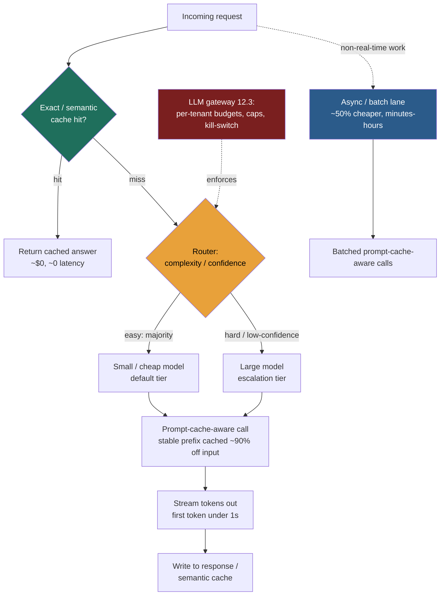

### Learning objectives
- Build the **cost model** from tokens — `cost ≈ (input × in_price) + (output × out_price)` — and explain why **output dominates**, why long prompts inflate the *input* bill on **every** call, and why an unprofitable-per-user feature scales into a *bigger* loss.
- Build the **latency model** — `total ≈ TTFT + output_tokens × TPOT (+ retrieval/tool round-trips)` — and map each lever to the term it attacks.
- Choose among the **caching levers** — prompt caching (shared-prefix, cuts input cost up to ~90%), exact response cache, and **semantic cache** (cheap but a correctness risk) — and gate the dangerous one.
- Apply **model routing / cascades** (cheap default → escalate on low confidence) to cut cost **5–10×**, and bound the quality loss with eval; know when to reach instead for **distillation**, **quantization**, and **batching**.
- Treat unit economics (`$/request`, `$/active-user`) and **per-tenant budgets** as a first-class design input, and name how you stop a runaway bill.

### Intuition first
An LLM feature is a **taxi with the meter always running**. Every token in and every token out is a coin dropped in the meter, and the meter never stops to admire the scenery. Your job is two things at once: **spend the fewest coins for the quality the trip actually needs**, and **make the ride *feel* short** even when the route is long.

That single image carries the whole lesson. You don't put every passenger in the luxury car — most trips are short and a cheap car is fine (**routing**: small model by default, big model only when the trip is genuinely hard). You don't re-explain the destination every time if you just took someone there (**caching**: don't re-pay to send the same prefix or re-answer the same question). You keep the conversation short and to the point so the meter ticks less (**token discipline**: shorter prompts, capped output, trimmed history). And you talk to the passenger as you drive so the wait doesn't feel dead (**streaming**: first token under a second changes the *felt* latency without changing the fare). Every one of these saves coins or time — and **every one trades away a little quality, freshness, or latency.** The Director skill is naming which.

### Deep explanation

**The cost model — and why output is the lever.** The bill for one call is roughly:

```
cost ≈ (input_tokens × input_price) + (output_tokens × output_price)
```

Two facts decide everything downstream. First, **output tokens are typically priced 3–5× higher than input tokens** (the decode phase runs the full model once per emitted token; prefill batches the input). So a 200-token answer can cost more than a 2,000-token prompt. **Output is the lever you most directly control** — cap it, structure it, stop padding it. Second, **long prompts inflate the input cost on *every single call*.** Chat history and RAG context are re-sent each turn because the model is stateless; a 20k-token retrieved context isn't a one-time cost, it's a tax on every message in the session. The Director-altitude statement: *you are not optimizing a model, you are optimizing tokens — and the two biggest token sinks are output you didn't cap and context you re-send.*

The third fact bites at scale: **cost scales linearly with usage.** There's no flat fee that amortizes — 10× the traffic is 10× the bill. So a feature that loses **$0.30/user/month** isn't a rounding error you'll grow out of; growth makes the hole deeper. **You design unit economics — `$/request`, `$/active-user` — up front, the way you'd size QPS and storage**, because "we'll optimize later" means "we'll discover later that the feature can't be profitable."

**The latency model.** Felt slowness has its own decomposition:

```
total_latency ≈ TTFT + (output_tokens × TPOT) + retrieval/tool round-trips
```

`TTFT` (time to first token) is dominated by prefill — processing the prompt — so it scales with **prompt length**. `TPOT` (time per output token) is the decode cadence, so total decode time scales with **how much the model says**. Retrieval and tool calls add round-trips on top. Each lever below attacks one or both terms: prompt caching cuts TTFT; output caps cut the `output × TPOT` term; routing to a smaller model cuts TPOT; streaming attacks *perceived* TTFT without touching the real numbers. **Name which term a lever moves** — that's the difference between "make it faster" and an engineering plan.

**Caching levers — three kinds, three risk profiles.**

- **Prompt caching (shared-prefix cache).** The provider caches the *prefix* of your prompt — system prompt, few-shot examples, a long pasted document — so repeat calls that share that prefix skip re-processing it. On a cache hit, the cached input is billed at roughly **10% of the normal input price (up to ~90% off that portion)** and TTFT drops because prefill is skipped for the cached span. This is **near-free quality-wise** — the model sees identical tokens — so it's the first lever to reach for whenever a large, stable prefix repeats (a fixed system prompt across all users, a document re-queried many times, an agent loop re-sending the same tool definitions). The trade-off is mild: the cache has a short TTL (often ~5 min) and a small write cost on the miss, so it only pays when the prefix is **reused soon and often**; you also must keep the prefix **byte-stable** (put the variable part last) or you never hit. *Rejected alternative:* re-sending the full prompt uncached — simpler, but you pay full input price and full TTFT on a prefix that never changed.
- **Exact response cache.** A plain key-value cache (Redis) keyed on the normalized request → store the response; identical requests are served for ~0 cost and ~0 latency. **No correctness risk** because the input is identical. The trade-off is **hit rate**: natural-language inputs rarely match exactly, so this only helps for constrained, repeated queries (a fixed FAQ, a canned classification). *Rejected alternative:* no cache — correct but pays for provably-identical work.
- **Semantic cache.** Embed the incoming query; if it's **embedding-similar** to a previously answered query (cosine above a threshold), serve the *stored* answer instead of calling the model. Big savings — it catches paraphrases the exact cache misses — but it is the **one caching lever that can return a *wrong* answer**, because "similar enough" is a judgment call. Two different questions can sit close in embedding space ("how do I cancel" vs "how do I *un*cancel"). You **gate it hard**: a conservative **similarity threshold**, a **freshness/TTL** policy, and a hard rule — **never for personalized or changing answers** (account balances, "my orders", anything user- or time-specific), because a neighbor's cached answer is then not just stale, it's *someone else's*. *Rejected alternative:* exact cache only — safe but misses paraphrases; semantic cache trades a bounded correctness risk for a much higher hit rate, and you must say so out loud.

**Model routing and cascades — usually the biggest single win.** Most traffic is easy; a minority is hard. A **router** sends each request to the cheapest model that can handle it: a small/cheap model by default, **escalating to a larger model only on low confidence or high complexity.** The escalation signal is either a cheap upfront **classifier** (length, topic, difficulty heuristic) or **self-eval** (the small model answers; a quick check — confidence score, a validator, a "can you answer this confidently?" gate — decides whether to retry on the big model). When the cheap model handles the majority of traffic, the blended cost drops **5–10×**, because the expensive model now runs on the 10–20% of requests that actually need it rather than 100%.

The trade-off is **quality on the routed-down traffic** plus the **router's own cost and its misroute rate** — every request the router sends to the small model that the small model botches is a quality regression you shipped. So **a cascade is only safe behind an eval harness**: you measure quality on each tier, set the escalation threshold to bound the regression, and re-check it when models change. *Rejected alternative:* one big model for everything — simpler, uniformly high quality, and 5–10× the bill; you reject it once volume makes that bill the constraint.

**Distillation and smaller fine-tuned models.** When a task is *narrow* (one classification, one extraction, one format), you don't need a generalist. **Distill** — use a large model to generate training data, then fine-tune a small model to match it on that task — and you get a model that's a fraction of the cost and latency *for that task*, often matching the big model's quality on it. The trade-off: it's **brittle outside its task** and carries a **training/maintenance cost** (you own a model now, with its own eval and refresh cycle). Use it for the high-volume narrow path; keep the generalist for the long tail.

**Quantization and batching — serving-side levers.** **Quantization** (serving the model at lower numeric precision) cuts memory and speeds inference for a small, measured accuracy cost — relevant when you **self-host** (it doesn't apply to a provider API you don't control). **Batching** is the throughput lever: for any work that isn't real-time — overnight summarization, bulk classification, embedding a corpus — provider **async/batch APIs run ~50% cheaper** than synchronous calls, because the provider schedules them when it has spare capacity. On self-hosted serving, **larger batch sizes raise throughput-per-dollar** (more tokens per GPU-second), trading per-request latency for fleet efficiency. The trade-off is explicit in the name: **batch is not interactive** — you accept minutes-to-hours of latency in exchange for the discount, so it's for pipelines, never the user-facing path.

**Token discipline — the unglamorous lever that compounds.** Every token you don't send or generate is saved on **every call, forever**:

- **Shorter system prompts.** A 1,500-token system prompt re-sent on every turn of a million-turn-a-day product is pure recurring cost; trim it to the essentials and pin the stable part behind prompt caching.
- **Output caps + structured output.** Set `max_tokens` and ask for structured/JSON output so the model stops instead of rambling — this attacks the most expensive term (output × out_price) directly.
- **Trim and compress context.** Don't re-send the entire chat history every turn; window it, or summarize older turns into a compact running summary. For RAG, **retrieve fewer, better chunks** — a reranker lets you send the top 3 instead of the top 20, cutting input tokens *and* improving quality (less "lost in the middle").

The trade-off for aggressive trimming is **dropped context** — cut too much history or too many chunks and the model loses the thread or the grounding facts. The discipline is to trim against an eval, not by feel.

**Streaming — a latency *perception* lever, not a cost one.** Streaming tokens as they're generated **does not change the bill or the total generation time** — the same tokens are produced. What it changes is **perceived latency**: the user sees the first token in **under a second** and reads along as the rest arrives, instead of staring at a spinner for the full `output × TPOT` window. For any interactive surface (chat, copilots), streaming is the cheapest UX win available — it makes a 4-second answer feel instant. The "trade-off" is only that it complicates the client and that you can't post-process a complete response before showing it (e.g., a guardrail that needs the whole output); for those you buffer-then-stream or accept non-streaming.

**FinOps — making the bill governable.** Because cost scales with usage and a single bad prompt-loop can melt a budget, you instrument unit economics as a first-class metric: **`$/request`, `$/active-user`, cost per feature and per tenant.** You set **per-tenant token budgets / quotas** so one customer (or a runaway agent loop) can't consume the whole bill, and you **alert** on cost-per-user drift the way you'd alert on latency. The mechanism that *stops* a runaway bill lives centrally: an **LLM gateway** that enforces budgets, rate-limits, caps, and kill-switches across every feature, so the control isn't reimplemented per service. The full FinOps/governance practice is the AI-governance lesson's subject.

<details>
<summary>Go deeper — caching mechanics, router signals, and batch arithmetic (IC depth, optional)</summary>

- **Prompt-cache hit rules:** the cache matches a **prefix**, byte-for-byte, up to the first divergence — so a single changed token early in the prompt invalidates everything after it. Order prompts **stable → variable**: system prompt and few-shot first (cacheable), user turn last. Providers expose `cache_read_input_tokens` vs `cache_write_input_tokens` in usage; the write (miss) is slightly *more* expensive than a normal token, so the break-even is roughly **>1 reuse within the TTL**.
- **Semantic-cache thresholds:** cosine similarity thresholds around **0.92–0.97** are common starting points, tuned on a labeled set of "should-have-hit / should-have-missed" pairs. Always store the *original* query alongside the answer so you can audit false hits, and key the cache by tenant/locale so you never serve across isolation boundaries.
- **Router signals:** cheap classifiers can be a fine-tuned small model, a logistic-regression head on the query embedding, or pure heuristics (token count, presence of code, named-entity density). **Self-eval cascade** (answer-then-verify) costs an extra small-model call on the escalated fraction; budget for it. Power-of-two-style routing isn't relevant here — the decision is quality-gated, not load-gated.
- **Batch economics:** the ~50% discount is for **non-interactive** completion windows (often up to 24h). For self-hosted, throughput rises with batch size until you hit memory or the KV-cache ceiling; continuous/in-flight batching (vLLM-style) packs new requests into the batch as others finish, keeping GPU utilization high without forcing a fixed window.
- **Output-cap caveat:** an aggressive `max_tokens` can **truncate** a needed answer mid-structure; pair caps with structured output and validate completeness, or the "saving" is a broken response you retry (paying twice).

</details>

### Diagram: the optimization stack on the request path



### Worked example: a chat feature at 1M requests/day

A support-chat feature, **1,000,000 requests/day**. Naive v1 sends a big prompt to a frontier model every time. Assume per request: **3,000 input tokens** (a 1,500-token system prompt + retrieved context + history) and **500 output tokens**. Frontier pricing (order-of-magnitude, mid-2026): **input ≈ $3 / million tokens, output ≈ $15 / million tokens.**

**v1 — naive, one big model, no caching.**
- Input: 3,000 × $3/1M = **$0.009/req**.
- Output: 500 × $15/1M = **$0.0075/req**.
- Per request ≈ **$0.0165**. At 1M/day → **~$16,500/day ≈ ~$500k/month.** (Note output is ~45% of the bill on only 14% of the tokens — the output-price multiplier at work.)

Now apply three levers and recompute.

**Lever 1 — prompt caching the stable prefix.** Of the 3,000 input tokens, ~1,800 (system prompt + few-shot + stable instructions) are identical across requests and reused within the TTL. Cached input bills at ~10%: 1,800 × $3/1M × 0.1 = $0.00054, plus the 1,200 variable input tokens at full price = $0.0036. New input cost ≈ **$0.0041** (down from $0.009).

**Lever 2 — small-model default with escalation.** Route ~80% of requests to a small model (input ≈ $0.30/1M, output ≈ $1.20/1M — ~10× cheaper); escalate the hard 20% to the frontier model. Blended model cost drops sharply because the expensive tier now runs on 1-in-5 requests.

**Lever 3 — output cap.** Cap and structure output to **250 tokens** average (was 500) — most support answers don't need 500 tokens. Halves the most expensive term.

Rough recomputation per request:
- *Small tier (80%):* input 1,200 variable × $0.30/1M + 1,800 cached × $0.03/1M ≈ $0.00041; output 250 × $1.20/1M = $0.0003 → ≈ **$0.00071**.
- *Frontier tier (20%):* input ≈ $0.0041 (with caching); output 250 × $15/1M = $0.00375 → ≈ **$0.0079**.
- Blended: 0.8 × $0.00071 + 0.2 × $0.0079 ≈ **$0.0021/req.**

At 1M/day → **~$2,100/day ≈ ~$63k/month** — roughly an **8× reduction** from ~$500k, dominated by routing, then caching, then the output cap. The trade-offs you'd state alongside the number: the **80/20 split and the small model's quality on that 80% must hold against an eval** (raise the escalation rate if it doesn't — the bill rises but stays far under v1); the **output cap risks truncating** the occasional answer that needs more room (validate completeness); and **prompt caching only pays while traffic keeps the prefix warm** within the TTL (true at 1M/day, false for a sparse internal tool). Layer **streaming** on top and the felt latency drops to sub-second first token at no extra cost — separate from the dollar win.

### Trade-offs table: the levers, what they save, and what they cost

| Lever | Saves | Trades away (the risk) | Use when |
|---|---|---|---|
| **Prompt caching** (shared prefix) | up to ~90% of input cost on the prefix; lower TTFT | needs a stable, reused-soon prefix; TTL + write cost on miss | a large fixed prefix (system prompt, doc, tool defs) repeats often |
| **Exact response cache** | ~100% on identical requests | low hit rate on free-text; staleness | constrained/repeated queries (FAQ, canned classification) |
| **Semantic cache** | high hit rate on paraphrases | **correctness risk** — can serve a wrong/stale neighbor's answer | non-personalized, slow-changing answers; gated by threshold + TTL |
| **Routing / cascade** | **5–10×** when the cheap tier carries the majority | quality on routed-down traffic; router cost + misroutes | mixed-difficulty traffic; **only behind an eval harness** |
| **Distillation** (narrow fine-tune) | large cost/latency cut on one task | brittle off-task; own a model + its refresh | high-volume narrow task (one classify/extract/format) |
| **Quantization** (self-host) | memory + faster inference | small measured accuracy loss; self-host only | you control serving and can tolerate the precision cost |
| **Async / batch** | **~50%** vs synchronous; higher throughput/$ | **not interactive** — minutes-to-hours latency | non-real-time pipelines (bulk summarize, embed corpus) |
| **Token discipline** (trim prompt/history/RAG, cap output) | recurring savings on every call | dropped context → lost thread/grounding | always; trim against an eval, not by feel |
| **Streaming** | nothing on cost | none material (client complexity) | every interactive surface — perceived-latency win |

### What interviewers probe here
- **"This feature costs $X per user per month — make it economical."** *Strong signal:* starts from the **cost model** (output dominates, re-sent context is the input sink), names **routing + caching as the biggest wins**, gives an order-of-magnitude recompute, and states the trade-off of each lever. *Red flag:* "use a cheaper model" with no routing, no eval, no number — or worse, no awareness that cost scales linearly with usage.
- **"When is a semantic cache dangerous?"** *Strong:* it can serve a **wrong or someone-else's** answer because "similar" isn't "same"; **never for personalized or changing data**; gate with a conservative threshold, freshness TTL, and tenant-keyed isolation. *Red flag:* treats it as a free, safe cache like Redis.
- **"Cut cost without dropping quality."** *Strong:* **cascade (cheap default → escalate on low confidence) behind an eval harness** to bound the regression, plus prompt caching and output caps (lossless), plus reranking to send fewer/better chunks. *Red flag:* "smaller model everywhere" with no quality gate — that *is* dropping quality, just silently.
- **"Real-time or batch for this workload?"** *Strong:* batch the non-interactive work (~50% cheaper, accept minutes-hours), keep the user-facing path synchronous + streamed; names the latency-for-cost trade explicitly. *Red flag:* one path for everything, paying interactive prices for overnight jobs.

The through-line at Director altitude: **design the unit economics (`$/request`, `$/active-user`) up front, name the trade-off on every lever, and enforce budgets centrally.** Say "I'd have the platform team stand up the router and prompt-cache layer behind our gateway and A/B the cascade against our eval set before we trust it; my prior is small-model default carries ~80% of support chat at our quality bar" rather than hand-tuning a single prompt yourself.

### Common mistakes / misconceptions
- **Ignoring that cost scales linearly with usage** — treating a per-user loss as something growth fixes; it deepens it. Design `$/user` before launch.
- **Optimizing input while output runs free** — output is priced 3–5× higher and is the term you most control; cap and structure it first.
- **Treating semantic cache like Redis** — it can return a *wrong* answer; never for personalized/changing data, and always gated by threshold + freshness.
- **A cascade with no eval** — routing down without measuring quality on each tier ships silent regressions; the eval harness is the safety the saving depends on.
- **Confusing streaming with a cost win** — it cuts *perceived* latency, not the bill or the total time; pair it with real cost levers, don't substitute it for them.

### Practice questions

**Q1.** A chat feature costs **$0.40/active-user/month** against an ARPU that can't absorb it. Walk me through making it economical, with numbers.
> *Model:* Start from the cost model: output dominates and re-sent context is the input sink. **(1) Routing/cascade** — small model by default, escalate the hard fraction on low confidence; if the small model carries 80% at quality, blended cost falls ~5–10×, the single biggest lever. **(2) Prompt caching** the stable system-prompt/RAG prefix → up to ~90% off that input portion and lower TTFT. **(3) Output caps + structured output** → halve the most expensive term. **(4) Trim context** — window history, rerank RAG to top-3, shorter system prompt. Recompute `$/user` after each; expect order-of-magnitude. The non-negotiable: the cascade rides behind an **eval harness** so the routed-down quality is bounded, and **none of this touches personalized data through a semantic cache.**

**Q2.** When is a semantic cache the right call, and when is it a liability?
> *Model:* **Right** for high-volume, **non-personalized, slow-changing** answers where paraphrases are common — product FAQs, policy questions, doc Q&A — gated by a conservative similarity threshold, a freshness TTL, and tenant/locale keys. **Liability** for anything **user-specific or time-sensitive** (balances, "my orders", live status): "similar enough" can return a *stale or someone-else's* answer, a correctness *and* a privacy bug. The exact cache is safe but low-hit; the semantic cache trades a bounded correctness risk for a much higher hit rate — you must say so and gate it, not ship it blind.

**Q3.** You need to embed and summarize a 50M-document corpus, and also serve a live chat. Same infrastructure? Same models?
> *Model:* **No — split by latency tolerance.** The corpus job is **non-interactive**, so run it through the **async/batch API (~50% cheaper)** or self-hosted with **large batch sizes** for throughput/$, accepting minutes-to-hours latency; use a small/distilled model for embedding and summarization since the task is narrow. The live chat is **interactive**: synchronous, **streamed** (sub-second first token), routed (small default → escalate), prompt-cached. Forcing the batch job through the real-time path pays interactive prices for work that doesn't need them; forcing chat through batch makes it unusable. The trade-off is explicit: batch buys ~50% by giving up interactivity.

**Q4.** A teammate proposes "just use the small model everywhere to cut cost." What's your response?
> *Model:* That's not cost optimization without a quality gate — it's **silently dropping quality** on the fraction of traffic the small model can't handle. The right shape is a **cascade**: small model default, **escalate on low confidence/complexity**, with an **eval harness** measuring quality per tier and the escalation threshold set to bound the regression. That captures most of the saving (the cheap tier still carries the majority) while keeping hard requests on a capable model — and it's defensible because you can show the quality number, not just the cost number. Reserve "small model everywhere" for a **narrow task** where a distilled model provably matches the big one on that task.

### Key takeaways
- **Cost ≈ (input × in_price) + (output × out_price); output is priced 3–5× higher and is the term you most control; re-sent context (history + RAG) inflates the input bill on *every* call.** Cost scales linearly with usage, so design `$/request` and `$/active-user` up front.
- **Latency ≈ TTFT + output × TPOT + round-trips.** Prompt caching cuts TTFT, output caps cut the decode term, routing cuts TPOT, and **streaming cuts only *perceived* latency** (sub-second first token) — a UX lever, not a cost one.
- **Routing/cascades are usually the biggest single win (5–10×)** — cheap model default, escalate on low confidence — but they ship silent regressions without an **eval harness** to bound the routed-down quality.
- **Three caches, three risk levels:** prompt caching (lossless, up to ~90% off the shared prefix), exact response cache (lossless, low hit), **semantic cache (high hit but a correctness risk — never for personalized/changing data, always gated)**.
- **Batch the non-interactive work (~50% cheaper), distill the narrow tasks, trim every token, and enforce per-tenant budgets centrally at the gateway** — every lever trades quality, freshness, or latency, so name which.

> **Spaced-repetition recap:** Taxi with the meter always running — spend the fewest coins for the quality the task needs, and make the wait *feel* short. Output dominates the bill (3–5× input) and re-sent context taxes every call. Biggest wins: routing/cascade (5–10×, behind an eval) and prompt caching (~90% off the shared prefix). Semantic cache is cheap but can return a *wrong* answer — never for personalized data. Batch non-real-time work (~50% off). Streaming cuts felt latency, not cost. Enforce budgets at the gateway; the full FinOps practice is the AI-governance lesson's subject.
